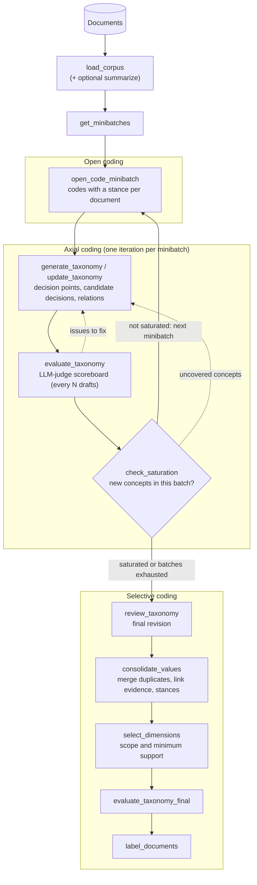

<p align="center">
  
</p>

# DelveDSpace — mining design spaces from text with LLMs

*DelveDSpace: Delve into Design Spaces.*

DelveDSpace reads a collection of documents (practitioner articles, architecture decision records, design
notes, blog posts, interview transcripts) and builds a **design space** from them: the **decision
points** the documents discuss, the **candidate decisions** for each one, how the sources stand toward
each candidate (adopted, rejected, or disputed), the **outcomes** they report, and how decision points
**relate** to each other. Every candidate decision keeps links to the passages that support it.

The pipeline follows **grounded theory** (open coding → axial coding until saturation → selective
coding), implemented as a [LangGraph](https://langchain-ai.github.io/langgraph/) workflow of LLM roles
with deterministic checks in between. An LLM judge scores the design space as it grows and feeds
actionable issues back into the next refinement step.

For corpus preparation, configuration, all commands and the output files, see
**[USAGE.md](USAGE.md)**.

## What you get

For a corpus and a short description of what you want to find (the **use case**), DelveDSpace produces:

- **A design space**: decision points (dimensions), each with its candidate decisions and outcomes
  (values), typed relations between decision points, and, for every candidate decision, the
  supporting passages and the stance of each source (`accepted`, `rejected`, `mixed`).
- **The selected view**: the decision points that serve the use case and have enough evidence, plus the
  ones dropped and why.
- **Labeled documents**: each document placed on one decision point and candidate decision (or
  "Other").
- **An evaluation scoreboard**: LLM-as-judge scores with actionable reasons, per iteration and for the
  final view.
- **Reports**: a self-contained grounded-theory Markdown report and a single-page HTML report;
  optional PCA biplots of the design space.
- **A design-space wiki**: an offline HTML wiki with a page for each dimension, value and source,
  plus graph and tree views of the design space ([how to build it](USAGE.md#exploring-a-run-as-a-wiki)).
- **Run history**: every taxonomy iteration, the saturation history and the open codes, so a run can be
  audited, compared with other runs, or used as the starting point of a new one.

## How it works



1. **Open coding.** Each document of a minibatch is coded: short concept labels with a rationale and a
   status, `accepted` (the source adopted the decision), `rejected` (it considered and declined it), or
   `outcome` (an effect of decisions, such as a cost or a result).
2. **Axial coding.** The first minibatch's codes produce a draft design space; each later minibatch
   updates it by constant comparison (new candidate decisions, new decision points, splits, merges,
   relations).
3. **Feedback inside the loop.**
   - The **saturation check** compares each new minibatch with the design space as it was before that
     minibatch, and reports concepts it does not cover.
   - The **evaluation** scores the draft and returns issues that name the decision points and values to
     fix.
   - Both go to the next update. The loop stops once saturation holds for several minibatches in a row
     (after a configurable minimum share of the corpus), or when the minibatches run out.
4. **Selective coding.**
   - A final **review** revises the design space against a fresh sample of documents.
   - **Consolidation** merges duplicate decision points and values, links every open code to the
     candidate decision it supports, records each source's stance, and drops values with no evidence.
   - **Selection** keeps the decision points that serve the use case and are supported by enough sources
     and candidate decisions.
   - **Labeling** places every document.

**Test mode** reuses a saved design space: its decision points are frozen, new documents are labeled
against them, and new candidate decisions can be appended.

## Key concepts

| Term | Meaning |
|---|---|
| **Dimension (decision point)** | A topic phrased as one question that requires a choice, e.g. *Drift detection test: which test detects degradation?* |
| **Value** | Either a **candidate decision** (an alternative answer to the dimension's question) or an **outcome** (an effect of decisions) |
| **Status / stance** | `accepted`, `rejected`, `mixed` (sources disagree) for candidate decisions; `outcome` for effects |
| **Evidence** | The passages whose open codes support a value; counted per value and per dimension (codes, documents, sources) |
| **Relation** | A typed link between two dimensions: `precondition`, `consequence`, `co_occurring`, `constrains` |
| **Saturation** | New minibatches no longer bring concepts the design space does not cover |
| **Selected dimensions** | The use-case-relevant, sufficiently supported subset of the final design space |

The full vocabulary is in [CONCEPTS.md](CONCEPTS.md).

## Installation

Python 3.10 or newer is required.

```bash
git clone https://github.com/andresdp/delve.git
cd delve
python -m venv .venv && source .venv/bin/activate     # or a conda environment
pip install -r requirements.txt
pip install -e ".[dev]"                                # optional: package + test/lint tools
```

Create a `.env` file in the repository root with the key of your LLM provider (see
[`.env.example`](.env.example)):

```bash
OPENAI_API_KEY=sk-...
# ANTHROPIC_API_KEY=..., FIREWORKS_API_KEY=..., GROQ_API_KEY=...
```

DelveDSpace uses three LLM roles, set in the `models` section of the YAML configuration. They should be
different models, so that judging is independent of generation; a shared model runs with a warning.

- **Generation LLM** (`generation_llm`): builds the design space.
- **Evaluation LLM** (`evaluation_llm`): judges it during a run (scoreboard, saturation critic).
- **Matching LLM** (`matching_llm`): judges value-option pairs when a run is scored against an expert
  ground truth.

OpenAI is the default provider, for the LLMs and the embedding model. Anthropic, Fireworks, Groq and Ollama
models can serve as the generation LLM through LangChain (`provider/model-name`, e.g.
`anthropic/claude-sonnet-5`). The evaluation and matching LLMs use OpenAI models. Only API keys are read
from the environment; everything else is configured in YAML.

## Quick start

Run one of the included examples:

```bash
python main.py --corpus examples/campus-bike/campus_bike_architecture_decisions.json \
               --config examples/campus-bike/campus_bike_config.yaml \
               --output examples/campus-bike/
```

Or your own corpus:

```bash
cp config.yaml my_project.yaml          # then edit use_case, models and thresholds
python main.py --corpus my_corpus.json --config my_project.yaml --output results/
```

The terminal shows each step, the design space as a tree, the evaluation scoreboard (and its evolution
across iterations), and the labeled documents. Add `--quiet` to see only the summary panels.

Next: [prepare your corpus](USAGE.md#preparing-a-corpus), [configure the run](USAGE.md#configuration)
(start with `taxonomy.use_case`), and see the [command-line reference](USAGE.md#command-line-reference)
for refining a run with feedback, test mode, reports and evaluation. To browse a run, [export it as a
wiki](USAGE.md#exploring-a-run-as-a-wiki).

## Examples

| Folder | Corpus |
|---|---|
| [`examples/campus-bike/`](examples/campus-bike/) | Architecture decisions of a bike-sharing system (small, quick to run) |
| [`examples/cursor-git-at-scale/`](examples/cursor-git-at-scale/) | Articles on scaling Git repository hosting (GitHub, Google, Microsoft, Cursor) |
| [`examples/das-p1-2023/`](examples/das-p1-2023/), [`examples/pharmacy-food/`](examples/pharmacy-food/) | Architecture decisions of two software projects |
| [`examples/c1-ml-workflow/`](examples/c1-ml-workflow/), [`examples/c2-rl-monitoring/`](examples/c2-rl-monitoring/) | Gray-literature passages on ML workflows and on monitoring deployed RL systems; the corpora are built from downloaded sources with the scripts in [`benchmark/`](benchmark/) (source texts are not distributed) |

Each folder has its configuration and, where present, a README with the exact commands.

## Development

```bash
make test                 # unit tests (no API calls), same as: python -m pytest tests/unit_tests
make lint                 # ruff + mypy
```

Project layout:

| Path | Content |
|---|---|
| `main.py` | Command-line interface |
| `src/taxonomy_generator/graph.py` | The LangGraph workflow |
| `src/taxonomy_generator/nodes/` | One module per step (open coding, generation, update, saturation, evaluation, review, consolidation, evidence linking, dimension merging, selection, labeling) |
| `src/taxonomy_generator/prompts/` | Prompt templates (Markdown) |
| `src/taxonomy_generator/evaluation/` | Judge criteria, scoreboard runner, consistency comparison |
| `src/taxonomy_generator/report_renderer.py`, `html_report.py`, `visualization.py` | Reports and biplots |
| `CONCEPTS.md` | Shared vocabulary |
| `docs/` | Design notes, plans and documented solutions |

[SETTINGS.md](SETTINGS.md) and [docs/DESIGN.md](docs/DESIGN.md) describe the original settings and
architecture; settings added since then are documented in `config.yaml` and in [USAGE.md](USAGE.md#configuration).

## Background and acknowledgements

DelveDSpace started as an implementation of **TnT-LLM** ("Text Mining at Scale with Large Language Models",
Wan et al., [arXiv:2403.12173](https://arxiv.org/abs/2403.12173)), forked from Delve
([andrestorres123/delve](https://github.com/andrestorres123/delve)), itself based on
[hinthornw/tnt-llm](https://github.com/hinthornw/tnt-llm). It keeps TnT-LLM's minibatch
generate-update-review loop, but now builds grounded-theory design spaces (open coding, decision
statuses, evidence linking, saturation, consolidation, selection and evaluation feedback) instead of
flat label taxonomies for training classifiers. Thanks to the TnT-LLM authors and to
[Will Fu-Hinthorn](https://github.com/hinthornw) for the original implementation.

## License

MIT, see [LICENSE](LICENSE).
