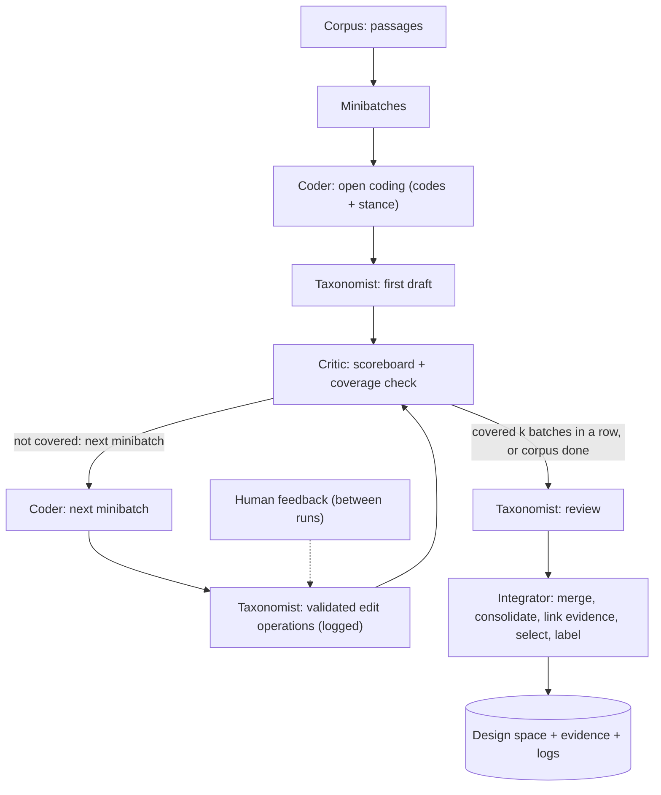

# Delve: An Agentic Workflow for Mining Architectural Design Spaces from Practitioner Literature

**Working manuscript — 9 October 2026. Anonymous draft.**

This draft describes the implementation on `main` after PR #9 (commit `e86c319`). The file is edited on branch `feat/paper-and-experiments`. The study design is prospective: the freeze and the main runs have not taken place, so Section 5 holds only the plan for the results. Bracketed `TODO` markers identify missing measurements, references or decisions. Section 9 contains author-facing notes and must be removed before submission. Page fit has not been checked in IEEEtran.

## Abstract

Architectural design spaces organize the decisions engineers face and the alternatives available for each decision. Practitioner literature, such as engineering blogs, documentation and articles, records many of these alternatives, but turning it into a coherent model takes repeated interpretation, comparison and revision. We present Delve, an orchestrated agentic workflow that mines architectural design spaces from a fixed corpus using techniques from grounded theory. A Coder extracts concepts from each passage. A Taxonomist organizes them into decision points and candidate decisions through validated, logged editing operations. A Critic scores each draft and checks whether new passages still bring uncovered concepts. An integration stage consolidates and scopes the result and links candidate decisions to their source passages. We evaluate Delve against the published models of two architectural decision studies, using both the decisions reported in each paper and the full replication models. The evaluation measures agreement with the expert models at the level of decisions and alternatives, stability across runs, and cost. It compares Delve with direct long-context generation and with a probe of the model's prior knowledge, and isolates the contribution of open coding, critic feedback and validated editing. A third case, on Git hosting at scale, shows how the extracted space places real systems. [TODO: replace this sentence with the principal numerical findings.]

**Keywords:** agentic AI for software engineering; architectural design decisions; design spaces; grounded theory; gray literature.

## 1. Introduction

Software architecture is largely a matter of choosing among alternatives under competing forces. An engineer designing the monitoring of a deployed reinforcement-learning system, for example, must decide what to monitor, how to detect reward hacking, and how to respond to an alert, and each decision has several defensible options. A design space makes these choices explicit. It names the decision points, lists the alternatives for each, and lets engineers compare complete designs as points in the space [1, 2]. Treating architecture as a set of design decisions [3, 4] has the same aim: to make the reasoning behind a system inspectable rather than implicit.

Much of the knowledge needed to build such spaces lives in gray literature: engineering blogs, product documentation, talks and practitioner reports [5]. Researchers have used grounded theory to turn these sources into architectural decision models, for example for machine-learning workflows [6] and for monitoring deployed reinforcement-learning systems [7]. These studies are valuable, but they are expensive: a team codes dozens of sources by hand, compares codes across sources, and revises the model until new sources add nothing [8].

Large language models can generate taxonomies and induce concepts from unstructured text [9, 10], and recent work shows that they can draft architectural decision records [11]. Producing a plausible taxonomy, however, is not the same as recovering the decisions that experts found. Two problems stand out. First, the output must be a design space: decision points whose values are alternatives for one choice, not a list of topics. Second, building the space incrementally from many passages is a state-management problem. Each revision must integrate new evidence without silently dropping alternatives that earlier evidence supported, and a model that rewrites its whole output at every step tends to do exactly that.

We present **Delve**, an orchestrated agentic workflow [12] that mines architectural design spaces from a fixed corpus. Its roles follow the main steps of grounded theory. A **Coder** extracts concepts from each passage, together with the source's stance on them. A **Taxonomist** builds the initial design space and then revises it minibatch by minibatch through a fixed set of validated editing operations, each of which is checked and logged. A **Critic** scores each draft and checks whether a new minibatch still brings concepts the space does not cover, which decides when to stop. An **Integrator** merges duplicates, consolidates alternatives, links them to their supporting passages, and keeps the decision points with enough evidence. The workflow is bounded: the corpus and the sequence of roles are fixed in advance, and no role collects new sources.

We ask whether this explicit decomposition helps recover the architectural knowledge that experts recovered. We compare Delve's output with the published models of the two studies above, at the level of decisions and of alternatives, and with both the decisions the papers report and the full models in their replication packages. We compare Delve with a single long-context prompt over the same corpus and with a probe of what the model knows without any corpus, and we remove components one at a time. A third case, on hosting Git repositories at scale, has no expert model; it shows how the extracted space places the systems that its sources describe. Agreement with an expert model is a reference measure, not proof that the expert model is the only valid answer.

The contributions of this paper are:

1. **Delve**, an implemented agentic workflow for mining architectural design spaces, with passage-level codes, validated and logged model edits, critic feedback, a coverage-based stopping rule, consolidation, and inspectable intermediate artifacts.
2. **An evaluation kit** that pairs the source inventories of two published decision studies with two views of each expert model (paper and replication package, with a crosswalk), and a matcher that aligns extracted alternatives and decision points with them.
3. **An empirical assessment** of agreement with the expert models, component effects, stability and cost. [TODO: substitute the findings.]

We scope the work to extracting architectural knowledge for understanding and comparing designs. We do not evaluate whether the extracted models lead to better architecture decisions, and we make no claim about the time they save in a human study.

## 2. Background and Related Work

### 2.1 Design spaces and architectural decisions

Design Space Analysis structures design rationale as questions, options and criteria [2]. Shaw describes a design space as a set of decisions, each with its alternatives, in which a complete design is a point; dependencies between decisions limit which combinations make sense [1]. Architecture research made design decisions first-class entities [3] and classified them, for example into existence, property and executive decisions [4]. We use this vocabulary throughout. A **decision point** is a question that requires a choice. A **candidate decision** is one alternative answer to it. A **relation** connects two decision points. Effects of a choice are **outcomes**, kept apart from the alternatives because an effect is not something an engineer chooses.

### 2.2 Mining architectural knowledge

Architectural knowledge is often implicit in project artifacts and online sources. Bhat et al. extract and classify design decisions from issue trackers with machine learning [13]. Soliman et al. study how developers find architectural knowledge through web search engines [14]. Gray literature is a recognized evidence source in software engineering research, with guidelines for including it in reviews [5]. The two expert studies we use as references built their decision models from such sources with Straussian grounded theory [6, 7].

Large language models have recently been applied to architecture tasks, including classifying design decisions, detecting patterns and generating designs [15]. Dhar et al. show that models such as GPT-4 can generate relevant design decisions for architecture decision records, below human quality [11]. These approaches produce individual decisions or classify given text. Delve instead builds a whole design space from a corpus, keeps each alternative linked to its sources, and is evaluated against complete expert models.

### 2.3 Grounded theory and LLM-assisted qualitative analysis

Grounded theory develops concepts and their relations through systematic engagement with data: open coding, comparison of new data with existing categories, and integration until new data adds nothing [8]. Stol et al. warn that many software engineering studies claim grounded theory while using only some of its techniques [8]. Delve uses open coding, constant comparison, category development and a coverage-based stopping rule as computational instruments. It does not perform theoretical sampling, because it reads a fixed corpus, and its stopping rule measures conceptual coverage, not theoretical saturation in the full methodological sense. Computational grounded theory combines unsupervised text analysis with interpretive reading [16]; Delve shares that combination, with LLM roles in place of topic models.

LLMs are increasingly used to support qualitative analysis. Codebook-based prompting reaches fair to substantial agreement with expert coders on deductive coding [17, 18], and LLMs can replace part of the manual annotation in software engineering studies when model-model agreement is high [19]. These studies label data against a given scheme. Delve builds the scheme itself, which makes judging its output harder and motivates the expert-model comparison.

### 2.4 LLM-based taxonomy and concept induction

TnT-LLM generates and refines a label taxonomy with an LLM in minibatches, then uses it to label data at scale [9]; Delve started from an open implementation of this generate-update-review loop. LLooM induces high-level concepts from text and supports mixed-initiative analysis [10]. Chain-of-Layer builds taxonomies layer by layer with in-context learning [20]. BERTopic clusters document embeddings into topics [21]. These methods organize text into categories or topics. Delve targets a more specific structure, decision points whose values answer the same question, and adds passage-level coding, source stance, and evidence links. Adapting topic-modeling and taxonomy-generation workflows to produce decision points and alternatives would add an interpretation layer of its own; we leave that comparison to future work and compare against direct generation by the same model.

### 2.5 Agentic workflows in software engineering

LLMs are now used across software engineering tasks [22], and multi-agent systems split such tasks into roles that check each other's work [12]. Delve is a bounded multi-role workflow: the roles and their order are fixed, and they coordinate through a shared design space rather than open conversation. The Taxonomist is its most agentic role: during revisions it chooses which editing operations to apply, sees the result of each one, and decides when it has finished, within a bounded number of turns. LLM judges are widely used to evaluate generated text but show biases, such as favoring their own outputs [23]. Delve uses an LLM judge in two places, as the Critic inside the workflow and as the matcher in the evaluation, and we validate the matcher against human labels.

## 3. Delve

### 3.1 Shared representation and roles

Delve represents a design space as a set of decision points. Each decision point has a name, the question it answers, its candidate decisions, and typed relations to other decision points. Each candidate decision has a label, a description, its supporting passages, and a status. The status records whether the sources adopt it (**accepted**), reject it (**rejected**), or disagree about it (**mixed**); effects of decisions are kept as **outcomes**. The workflow is a LangGraph state machine. Its shared state holds the passages, the open codes, every intermediate design space, the explanations of each revision, the operation log, and the Critic's feedback.

| Role | Responsibility | Mechanism |
|---|---|---|
| Coder | Extract passage-level concepts and the source's stance | Structured LLM output per passage |
| Taxonomist | Build and revise decision points, alternatives and relations; review the final model | First draft as structured output; updates and review through validated editing operations, each logged |
| Critic | Score drafts; detect concepts the model does not yet cover | LLM scoreboard fed back to the next update; coverage check of each new minibatch (read-only) |
| Integrator | Consolidate and scope the reviewed model | Dimension merging and value consolidation (embedding candidates, LLM adjudication of borderline pairs), evidence linking, minimum-support selection, labeling |

The roles have separate responsibilities, but separation alone does not make their judgments independent; in the study configuration they use the same model. Figure 1 shows the workflow.

**Figure 1 — architecture (to be drawn).** The diagram below fixes its content. Mark deterministic steps separately from LLM calls, and do not show retrieval.

### 3.2 Passages and open coding

A corpus builder segments each source into passages of about 300 words at paragraph and heading boundaries, keeps code blocks whole, and merges very short passages with their neighbours. Passage identifiers keep their source (e.g. `s07_p03`), so evidence can be counted per source as well as per passage. The Coder reads each passage in full and returns codes: a label naming a concept or decision, a rationale tied to the use case, and the source's stance (adopted, rejected, or reported as an outcome). Passages are processed independently and in parallel. A code does not store a verbatim quotation, so rationales support inspection but not exact quotation fidelity.

### 3.3 Revising the model with validated operations

The Taxonomist builds the first draft from the first minibatch. For each later minibatch it receives the current design space, the minibatch's passages and codes, and the Critic's feedback, and it edits the space through a fixed set of operations:
- add, move, merge, relabel or remove a candidate decision, set its status, or add evidence to it;
- add, rename, split, merge or remove a decision point;
- add or remove a relation.

Every call is validated before it is applied. Cited passages must belong to the current minibatch. Names must not duplicate existing ones. A split must leave at least two candidate decisions in each part. A rejected call changes nothing and returns the reason to the model, which may try again; an update is bounded by a number of turns. The final review uses the same operations over a sample of the corpus.

Because operations change only what they name, an alternative that earlier evidence supported survives unless an operation removes it, and the operation log shows where every candidate decision came from and why it disappeared. The original mechanism, in which each update re-emits the whole model, is kept as an ablation (Section 4.4).

### 3.4 Criticism and stopping

The Critic scores drafts on ten criteria, eight structural (for example orthogonality, clarity, and whether each decision point names one decision) and two that check coverage against a sample of passages. The weakest criteria and their reasons go to the next update. Completeness is judged against the use case alone, so it is reported but not fed back. These intrinsic scores steer the workflow; they are not the outcome measures of the evaluation.

The coverage check compares each new minibatch's codes with the design space **before** that minibatch is incorporated, so a revision that has just absorbed the codes cannot cover them by construction. A minibatch counts as covered when at least a set share of its codes is covered. The loop stops after a set number of covered minibatches in a row, once a minimum share of the corpus has been read, or when the corpus is exhausted. The study uses three minibatches, 90% coverage and 70% of the corpus. The rule signals diminishing conceptual novelty; it does not guarantee that every alternative has been found.

### 3.5 Integration, provenance and scope

After review, the Integrator merges decision points that name the same decision under different names, and consolidates candidate decisions that say the same thing. Both steps use embedding distance to propose pairs and an LLM judge for borderline ones. When sources disagree about an alternative, consolidation can merge the stances into one `mixed` candidate that keeps both sides as evidence. Evidence linking then assigns each open code to its most similar candidate decision and records the supporting passages and the stance of each source.

These links reconstruct provenance by similarity. They make the design space navigable: a reader can go from any alternative to the passages behind it. They do not prove that a passage supports the claim, so we do not measure evidential support in this paper. Candidate decisions without any linked evidence are removed but kept in an inspectable record.

Selection keeps the decision points that have evidence from at least two sources and at least two candidate decisions; the others are dropped with a recorded rationale. Labeling assigns each passage to one decision point and, when possible, one candidate decision. The outputs are the design space, its full history, the labeled passages, and reports. Because each decision point is an axis, the space can also be sampled into **design points**, one candidate decision from each of k decision points, which we use to check its coherence in the third case (Section 4.7).

## 4. Evaluation Design

### 4.1 Research questions

- **RQ1 — Recovery:** To what extent does Delve recover the decision points and alternatives of the expert models?
- **RQ2 — Workflow effects:** How does Delve compare with long-context generation and with the model's prior knowledge, and which components (open coding, critic feedback, validated editing) contribute to its results?
- **RQ3 — Reliability and resources:** How much do the results vary across runs, and what does each workflow cost in tokens, time and money?

The Git-hosting case (C3) is a supplementary application study. Evidence support, human feedback, the extraction of drivers and impacts, and richer saturation criteria are not research questions of this paper.

### 4.2 Cases and corpora

| Case | Expert reference | Sources (usable / listed) | Passages | Words |
|---|---|---:|---:|---:|
| C1: ML workflow | Published paper and replication model [6] | 29 / 29 | 265 | 70,191 |
| C2: deployed RL monitoring | Published paper and replication model [7] | 27 / 29 | 243 | 61,980 |
| C3: Git hosting at scale | None | 5 / 5 | 48 | 13,817 |

C1 and C2 reuse the source inventories of the two studies. C1 uses archived copies associated with the original study. C2 mostly uses recently retrieved pages: two of its 29 sources are no longer available and some pages have changed, so full-reference scores reflect corpus availability as well as extraction quality. C3 consists of an engineering article on scaling Git hosting and four official background sources from the organizations it describes. A curated variant of 16 documents is used only as a sensitivity check, because its headings and organization already encode design interpretations. Source texts are retrieved by scripts and not redistributed. [TODO: freeze the exact source bytes and corpus hashes.]

### 4.3 Expert models

Each expert study has two views. The **paper view** holds the decisions and options the article reports. The **model view** holds the full model from the replication package. A crosswalk records which elements occur in both views or in only one. Options without a description get one from the study's own evidence. Scope differences between the views are kept, not reconciled. Expert models are reference interpretations: an unmatched Delve element may be wrong, out of scope, valid but absent from the reference, or expressed at a different granularity.

### 4.4 Baselines and ablations

- **L1, long-context generation.** The same model receives all passages of a case in one prompt, with the same use case and output schema, and returns decision points and alternatives. We confirm that each corpus fits the model's usable context and report output limits.
- **L5, prior-knowledge probe.** The same model receives the use case but no corpus. Both expert studies are published, so a high score here would mean that part of Delve's agreement may come from what the model already knows.

The ablations remove one component at a time from the full system:
- (a) **no open coding:** the Taxonomist works from the passages directly;
- (b) **no critic feedback:** the scoreboard is still computed but not passed to the next update;
- (c) **whole-model rewriting** instead of validated editing operations.

[TODO: switches (a) and (b) are planned before the freeze; (c) is available.]

### 4.5 Matching and metrics

All outputs are normalized to decision points and candidate decisions. Accepted, rejected and mixed candidate decisions count as options; outcomes are excluded. Following the design of our matcher, embeddings propose pairs and an LLM judge decides:
1. Every Delve option is compared with every expert option of both views. Each is serialized with its decision point and description and embedded.
2. Pairs farther apart than a fixed cosine distance are labeled different. A closer pair goes to the judge only when one item is among the other's five nearest neighbours; the others are labeled different.
3. The judge assigns one of five labels: same, broader, narrower, related or different. It sees the two items in a seeded order, without knowing which one comes from the expert model, and compares the options regardless of the decision they sit under. Verdicts are cached, so rescoring is deterministic.

A Delve option **matches** an expert option when the label is same, broader or narrower. Option precision, recall and F1 are computed per view; exact recall (same only) and related pairs are reported alongside.

Decision alignment is derived from the option matches. For each Delve decision point and expert decision, the share of matched options between them is computed over the smaller of their option counts. **Strict alignment** is a one-to-one assignment over pairs whose share reaches a minimum. **Lenient alignment** keeps every such pair, so splits and merges count. We report decision precision, recall and F1 for both, and **placement**: the share of matched options that sit under an aligned decision point.

The distance thresholds were fixed on the expert models alone, before any run was scored. A stage funnel reruns the matching on every intermediate artifact (open codes, each draft, review, consolidation, selection) to show at which step an expert option is lost.

### 4.6 Judge validation, runs and statistics

**Judge validation.** The judge currently runs on the same model as the generator, so its labels need human validation. Two authors independently label a sample of option pairs as match or no match, blind to the judge's label and to which item is the expert's. The sample is stratified by judge label and distance band, and includes pairs the judge never saw. We report the agreement between the authors (Cohen's κ), the judge's agreement with the adjudicated labels, and the precision of the judge's matches. [TODO: report the results.]

**Runs.** Each principal configuration runs three times per case with different minibatch shuffle seeds; each ablation runs once or twice. Seeds control ordering only; provider outputs are not deterministic. Every run records its configuration, code version, models, a fingerprint of its prompts, its seed, and its token counts and elapsed time. [TODO: the run record lands before the freeze.]

**Statistics.** Results are reported per case and per view, never pooled across cases. For each configuration we give the mean and range over seeds. Comparisons with a baseline or an ablation are paired by seed: the same shuffle seed is used on both sides, and we report the per-seed differences with their mean. With three runs per configuration and two domains, these are descriptive estimates of within-case variation, not tests of general superiority. Stability is the spread of each metric over seeds and the pairwise alignment of the seeds' outputs. Cost covers generation, feedback and embeddings, reported in tokens, time and money at a stated pricing date; matching costs are reported separately. Failed runs and retries are reported, not omitted.

### 4.7 The Git-hosting case

C3 has no expert model, so its evaluation is qualitative and checks coherence and placement.

- **Passage-to-system map.** Each passage is mapped to the system it describes, such as GitHub's replication, Google's and Microsoft's repository systems, or Cursor's approach. The map and a list of the trade-offs the sources state were drafted from the sources alone, before any Delve output was inspected, and are reviewed by two authors.
- **System placement.** Using the map and the evidence links, a system × decision matrix shows which alternative each system takes for each decision point. Unknown placements stay unknown.
- **Design points.** We sample design points (one candidate decision from each of k decision points) in three groups. *Attested* points take every value from passages of one and the same system. *Novel* points combine values that no single system supports together. *Control* points include a value the sources rejected, or a value from a decision point outside the point. A judge and two human raters label each point as workable, conditional or unfeasible. Attested points should be rated workable and control points unfeasible; novel points show whether the space suggests combinations worth considering.

Raters also check whether each decision point admits coherent alternatives. Passage labeling assigns one decision point per passage, which limits placement when a passage discusses several systems.

### 4.8 Development history and reproducibility

Pilot runs on C1 and C2 shaped the workflow. They led us to choose validated editing over whole-model rewriting and to set several thresholds, and configuration comments record a calibration on C1. Neither case is untouched by development, so we make no held-out claims. Development runs are kept apart from the frozen evaluation runs, and the settings they affected are disclosed. The replication package will contain the frozen implementation, the normalized expert models and crosswalks, configurations, source manifests and retrieval scripts with content hashes, prompts, model identifiers, run outputs, alignment decisions and analysis scripts, and a browsable design-space wiki generated from a run. [TODO: anonymous artifact link.]

## 5. Results — Pending Evaluation

No outcome claims can be made before the frozen runs. This section specifies the evidence required for the final paper.

### 5.1 RQ1: Expert recovery

[TODO: report per-case, per-view decision P/R/F1 (strict and lenient), option P/R/F1, exact recall, and placement.]

**Table 1 — main reconstruction results.** Rows: case × reference view × system. Columns: decision F1 (strict, lenient), option precision, option recall, option F1, exact recall, and placement. Include the number of decisions/options behind each score.

[TODO: explain representative matched, merged, split, and missed outputs using actual passages. Distinguish absences caused by unavailable sources where possible. Use the stage funnel to show where missed expert options were lost.]

### 5.2 RQ2: Baselines and component effects

[TODO: compare the full workflow with L1 and L5. Report each case separately before drawing cross-case interpretations.]

**Table 2 — ablations.** For each implemented variant, show the change in option F1, decision F1, and extraction tokens relative to the frozen full system. Include run variation and the actual number of successful runs.

[TODO: if the long-context baseline performs equally well or better, state that result directly.]

### 5.3 RQ3: Stability and resources

[TODO: provide per-case variation across seeds, model size distributions, tokens, runtime, and cost. Describe the settings controlling shuffle variation and model sampling.]

**Figure 3 — cost and coverage.** Show option recovery against passages processed, if intermediate outputs can be aligned consistently. Do not interpret conceptual-coverage stopping as full theoretical saturation.

### 5.4 Supplementary Git-hosting case

The C3 corpus is segmented from raw text like C1 and C2. Because three of the described systems appear in only one source, and each source is one organization's write-up, C3 requires evidence from one source instead of two (a decision recorded before any C3 run). A passage-to-system map and a list of trade-offs stated by the sources were drafted from the sources only, before any Delve output was inspected; they await review by two authors.

[TODO: assess whether decision points admit coherent alternatives and whether supported placements distinguish the described systems (system × decision matrix). Unknown placements remain unknown. Report the design-point check: sampled combinations of candidate decisions, grouped as attested by a system, novel, or control (a rejected value, or a value from a decision point outside the point), with a workable / conditional / unfeasible verdict. Account for the single-label passage assignment limitation.]

## 6. Discussion

**What the decomposition buys.** Delve makes the intermediate steps of building a design space visible: codes per passage, every edit with its reason, the Critic's feedback, and the evidence behind each alternative. Whether this improves recovery is an empirical question, answered by the baselines and ablations. The decomposition costs more model calls than a single prompt, and each call is a chance for error. A Critic does not guarantee better output, and passing the coverage check does not guarantee completeness. [TODO: interpret against the results.]

**Agreement versus usefulness.** Agreement with an expert model and usefulness for design are different properties. An expert model may omit valid alternatives that the sources describe. A generated model may reproduce the experts' option names without the reasoning behind them. It may also find real options but group them too broadly, or split one decision too finely, for an engineer to make one choice at a time. Reporting option matching, decision alignment and placement separately keeps these outcomes apart.

**Inspection over trust.** Because every alternative is linked to passages and every edit is logged, a researcher can audit a Delve design space instead of trusting it. Human review remains necessary: to check that alternatives answer the same question, that evidence supports the claimed scope, and that relations express real dependencies. Between-run feedback offers a way to correct the model, but its effect is not measured here. Extraction cost is also not the same as saved researcher effort, which would require measuring preparation, validation and correction time.

[TODO: extend with implications grounded in the findings.]

## 7. Threats to Validity

**Construct validity.** Expert models are reference interpretations, not exhaustive truth. The two views differ in scope, option descriptions are uneven, and granularity differs between Delve and the experts; all of this affects alignment. We report both views, report exact matches alongside broader and narrower ones, and validate the judge against human labels. Evidence links are similarity-based and are not validated here; we use them for navigation only.

**Internal validity.** Pilot runs on both cases shaped the workflow; a frozen rerun improves reproducibility but cannot undo that exposure. The generator, Critic and judge use the same model and may share biases, including a preference for their own phrasing [23]; human validation of the judge addresses this for the outcome measure only. Stopping, filtering and consolidation can change both recall and precision, which is why we remove components one at a time.

**External validity.** The two expert studies come from one research group and two domains. Hundreds of passages do not replace independent studies. C3 adds a third genre without comparable ground truth. The results do not show that Delve works on arbitrary documents, on repository artifacts such as code or issues, or in industrial design tasks.

**Reliability and conclusion validity.** Sources change or disappear, provider models change, and inference is not deterministic. Manifests, content hashes and stored run artifacts reduce but do not remove these problems. Three runs per configuration limit statistical power, and repeated seeds measure variation within a case, not across domains.

**Training-data exposure.** Both expert studies are published, so the model may have seen them. The no-corpus probe (L5) shows how much the model can reconstruct without the corpus. A low probe score does not prove the absence of contamination, so we treat the probe as diagnostic evidence only.

## 8. Conclusion

We presented Delve, an agentic workflow that mines architectural design spaces from practitioner literature. It combines passage-level coding, revision through validated and logged editing operations, critic feedback, a coverage-based stopping rule, consolidation and evidence links, using grounded-theory techniques over a fixed corpus. The evaluation compares Delve with two expert models at the level of decisions and alternatives, with a long-context baseline and a prior-knowledge probe, and across component ablations, with a third case that places real systems in the mined space.

[TODO: one sentence with the principal finding and one with the most consequential limitation.]

Separating recovery of alternatives, alignment of decisions, and cost lets us ask whether the structure of the workflow, and not only the model behind it, contributes architectural knowledge that direct generation does not provide.

## References — Working List

Numbered in order of first citation. Entries were checked against publisher or arXiv records on 2026-10-09; open details are marked `TODO`. [TODO: add a Strauss and Corbin edition if the methodology section cites it directly.]

1. M. Shaw, "The Role of Design Spaces," *IEEE Software*, vol. 29, no. 1, pp. 46–50, 2012. [TODO: confirm volume/pages.] Author copy: https://cmu-swdesign.github.io/reading/ShawDesignSpace-a.pdf
2. A. MacLean, R. M. Young, V. M. E. Bellotti, and T. P. Moran, "Questions, Options, and Criteria: Elements of Design Space Analysis," *Human–Computer Interaction*, vol. 6, no. 3–4, pp. 201–250, 1991.
3. A. Jansen and J. Bosch, "Software Architecture as a Set of Architectural Design Decisions," in *Proc. 5th Working IEEE/IFIP Conf. on Software Architecture (WICSA)*, 2005, pp. 109–120.
4. P. Kruchten, "An Ontology of Architectural Design Decisions in Software-Intensive Systems," in *Proc. 2nd Groningen Workshop on Software Variability*, 2004, pp. 54–61.
5. V. Garousi, M. Felderer, and M. V. Mäntylä, "Guidelines for Including Grey Literature and Conducting Multivocal Literature Reviews in Software Engineering," *Information and Software Technology*, vol. 106, pp. 101–121, 2019.
6. S. J. Warnett and U. Zdun, "Architectural Design Decisions for the Machine Learning Workflow," *Computer*, vol. 55, no. 3, pp. 40–51, 2022. DOI: 10.1109/MC.2021.3134800. Replication package: https://doi.org/10.5281/zenodo.5730291
7. Z. Fang, S. J. Warnett, and U. Zdun, "Architectural Design Decisions for Monitoring Deployed Reinforcement Learning Systems," in *Proc. European Conf. on Software Architecture (ECSA)*, 2026. Replication package: https://doi.org/10.5281/zenodo.20305497. [TODO: proceedings pages and DOI.]
8. K.-J. Stol, P. Ralph, and B. Fitzgerald, "Grounded Theory in Software Engineering Research: A Critical Review and Guidelines," in *Proc. 38th Int. Conf. on Software Engineering (ICSE)*, 2016, pp. 120–131. DOI: 10.1145/2884781.2884833
9. M. Wan et al., "TnT-LLM: Text Mining at Scale with Large Language Models," arXiv:2403.12173, 2024. [TODO: final KDD 2024 metadata.]
10. M. S. Lam, J. Teoh, J. A. Landay, J. Heer, and M. S. Bernstein, "Concept Induction: Analyzing Unstructured Text with High-Level Concepts Using LLooM," in *Proc. CHI Conf. on Human Factors in Computing Systems*, 2024. DOI: 10.1145/3613904.3642830
11. R. Dhar, K. Vaidhyanathan, and V. Varma, "Can LLMs Generate Architectural Design Decisions? An Exploratory Empirical Study," in *Proc. 21st IEEE Int. Conf. on Software Architecture (ICSA)*, 2024. arXiv:2403.01709
12. J. He, C. Treude, and D. Lo, "LLM-Based Multi-Agent Systems for Software Engineering: Literature Review, Vision, and the Road Ahead," *ACM Trans. on Software Engineering and Methodology*, 2025. arXiv:2404.04834
13. M. Bhat, K. Shumaiev, A. Biesdorf, U. Hohenstein, and F. Matthes, "Automatic Extraction of Design Decisions from Issue Management Systems: A Machine Learning Based Approach," in *Proc. European Conf. on Software Architecture (ECSA)*, 2017, pp. 138–154.
14. M. Soliman, M. Wiese, Y. Li, M. Riebisch, and P. Avgeriou, "Exploring Web Search Engines to Capture Architectural Knowledge," in *Proc. 18th IEEE Int. Conf. on Software Architecture (ICSA)*, 2021. [TODO: pages.]
15. L. Schmid, T. Hey, M. Armbruster, S. Corallo, D. Fuchß, J. Keim, H. Liu, and A. Koziolek, "Software Architecture Meets LLMs: A Systematic Literature Review," arXiv:2505.16697, 2025. [TODO: check for a published version.]
16. L. K. Nelson, "Computational Grounded Theory: A Methodological Framework," *Sociological Methods & Research*, vol. 49, no. 1, pp. 3–42, 2020. DOI: 10.1177/0049124117729703
17. Z. Xiao, X. Yuan, Q. V. Liao, R. Abdelghani, and P.-Y. Oudeyer, "Supporting Qualitative Analysis with Large Language Models: Combining Codebook with GPT-3 for Deductive Coding," in *Companion Proc. 28th Int. Conf. on Intelligent User Interfaces (IUI)*, 2023. arXiv:2304.10548
18. R. Chew, J. Bollenbacher, M. Wenger, J. Speer, and A. Kim, "LLM-Assisted Content Analysis: Using Large Language Models to Support Deductive Coding," arXiv:2306.14924, 2023. [TODO: confirm author list.]
19. T. Ahmed, P. Devanbu, C. Treude, and M. Pradel, "Can LLMs Replace Manual Annotation of Software Engineering Artifacts?," in *Proc. 22nd Int. Conf. on Mining Software Repositories (MSR)*, 2025. arXiv:2408.05534
20. Q. Zeng, Y. Bai, Z. Tan, S. Feng, Z. Liang, Z. Zhang, and M. Jiang, "Chain-of-Layer: Iteratively Prompting Large Language Models for Taxonomy Induction from Limited Examples," in *Proc. 33rd ACM Int. Conf. on Information and Knowledge Management (CIKM)*, 2024. arXiv:2402.07386 [TODO: confirm author order.]
21. M. Grootendorst, "BERTopic: Neural Topic Modeling with a Class-Based TF-IDF Procedure," arXiv:2203.05794, 2022.
22. X. Hou, Y. Zhao, Y. Liu, Z. Yang, K. Wang, L. Li, X. Luo, D. Lo, J. Grundy, and H. Wang, "Large Language Models for Software Engineering: A Systematic Literature Review," *ACM Trans. on Software Engineering and Methodology*, vol. 33, no. 8, 2024.
23. L. Zheng et al., "Judging LLM-as-a-Judge with MT-Bench and Chatbot Arena," in *Advances in Neural Information Processing Systems (NeurIPS), Datasets and Benchmarks Track*, 2023.

---

## 9. Author Notes — Remove Before Submission

### 9.1 What the implementation supports (as of 2026-10-09, `main` at `e86c319`)

| Statement | Evidence | Draft treatment |
|---|---|---|
| Raw passage coding | `nodes/open_coder.py`; study configs set `open_coding.input: content` | Implemented |
| Source segmentation and corpora | `benchmark/build_corpus.py`; C1 265, C2 243, C3 48 passages (texts gitignored) | Implemented |
| Validated editing operations with an operation log | `taxonomy_editor.py`, `tool_update.py`; C1/C2/C3 set `edit_mode: tools` | Implemented; main strategy |
| Whole-model rewriting | `edit_mode: rewrite` (also `rewrite_restore`) | Ablation (c) |
| Dimension cap enforced in tools mode | `TaxonomyEditor(max_dimensions=…)`; study configs set no cap | Implemented; not used by the study |
| Feedback and conceptual-coverage stopping | `graph.py`, `nodes/saturation_checker.py`, settings | Implemented, with limited saturation claims |
| Dimension merging and value consolidation | `nodes/dimension_merger.py`, `nodes/value_consolidator.py` | Implemented |
| Provenance linking | `nodes/evidence_linker.py` | Implemented; links described as navigational, not validated |
| Relevance selection | `relevance_selection: false` in study configs | Off; selection is minimum support only |
| Both reference views and crosswalks | `benchmark/c1-ml-workflow/gt/`, `benchmark/c2-rl-monitoring/gt/` | Implemented |
| Matcher (options, decisions, placement) | `evaluation/gt_match.py`, `main.py --match-gt`, settings in `benchmark/README.md` | Implemented as described in §4.5 |
| Stage funnel | `benchmark/stage_funnel.py` | Implemented |
| Verbatim evidence and paradigm-typed codes | `OpenCode` has doc id, label, rationale, status only | Not claimed |
| Drivers/impacts as output fields | Absent from output schemas | Not claimed |
| L1/L5 baselines | Not implemented | Planned before freeze |
| Ablation switches (no open coding, no feedback) | Not implemented | Planned before freeze |
| Run record (provenance block) | Run metrics (tokens, time) only | Planned before freeze |
| C3 B7/B9 | Agent drafts in `benchmark/c3-git-at-scale/`; author review open | Described as drafts |
| C3 design-point sampler | `benchmark/design_points.py` (attested / novel / control) | Implemented; judge and human rating open |
| Design-space wiki | `benchmark/export_wiki.py` | Artifact only; not a paper contribution |
| C1/C2 untouched | Pilot runs and tuning on both | Held-out wording avoided |
| Researcher time saved | No measurement | No such claim |

### 9.2 Preliminary development observations (not results; pre-freeze, judge = generator)

- **Update strategy, C2** (`docs/paper/results/2026-10-05-c2-update-strategy-comparison.md`, one run each, paper view):
  - Whole-model rewriting lost 22 expert options for good in a single update and ended with option F1 0.25.
  - Validated editing (with the decision-granularity prompt, relevance filter off) reached option recall 0.91 and F1 0.56.
  - This motivated choosing validated editing as the main strategy.
- **C1 check, validated editing** (one run): option F1 0.51 (paper view) / 0.66 (model view); strict decision F1 0.62 / 0.79. Recall is higher than an older rewrite run, but precision in the paper view is lower.
- **Judge sensitivity:** the judge choice moved C2's option score by about 0.2, so the A6 human check comes before any number is reported.
- **Quality probe** (`docs/paper/results/2026-10-08-taxonomy-quality-probe.md`): 20–31% of candidate values answer a different question than their decision point asks; 3–12% are not options at all (goals, principles). Accepted links contain almost no unrelated passages; C2's mixed and outcome links are weaker (small samples).
- **Granularity:** Delve extracts more decision points than the experts (C1 30 vs. 10 paper / 28 model; C2 19 vs. 7; C3 22, no reference). The decision-focus pass was tried offline and closed with no variant kept (`docs/paper/results/2026-10-09-decision-focus-ab.md`). The analysis there (scope, a different decomposition, true splits) is deliberately not in the draft yet.

### 9.3 Minimum path to a defensible empirical submission

1. Before the freeze: run record (P13), ablation switches (P12), L1/L5 baselines, and the A6 labeling sheet.
2. Freeze the configuration and source hashes; record the C1/C2-informed tuning history.
3. Main runs, one at a time: C1/C2 × 3 seeds, ablations × 1–2 seeds, baselines, C3.
4. A6 human labels → κ and judge agreement; statistics harness (A3/A4) and tables.
5. Figures and traces from real outputs; replace all prospective phrasing and `TODO` markers.

### 9.4 Suggested 10-page body allocation

| Material | Approximate pages |
|---|---:|
| Abstract and introduction | 1.0 |
| Background and related work | 1.0 |
| Approach and architecture/evidence figures | 2.0 |
| Benchmark and evaluation design | 2.0 |
| Results and main tables | 2.5 |
| Discussion, threats, conclusion | 1.5 |

The official track permits 10 pages plus up to 2 pages for references, requires double-anonymous review, and specifies IEEEtran conference format. Mandatory abstract deadline: **19 October 2026 AoE**. Paper deadline: **23 October 2026 AoE**. Verified 7 October 2026: https://conf.researchr.org/track/saner-2027/saner-2027-agentic-ai4se-track

### 9.5 Claims to settle before submission

- Settled 2026-10-09: the evaluated system uses validated editing operations; whole-model rewriting is an ablation. Describe only that mechanism as the approach.
- Settled 2026-10-09: evidence support is not measured; linked passages are navigational provenance. RQ1 covers decisions and options only.
- Settled 2026-10-09: the matcher scores as implemented (same, broader, and narrower count as matches; exact recall reported alongside).
- Treat intrinsic quality scores as control signals, not independent validation.
- Disclose pilot exposure without implying that a post-pilot freeze restores an untouched evaluation.
- Keep C3-curated sensitivity results separate from raw-text extraction because preorganization can encode the answer.
- Report provider/model settings as actually used (currently `openai/gpt-5.6-luna` for generation, evaluation, and matching; no temperature or effort setting).
- **Anonymity:** the repository name, the GitHub Pages sample wiki (`andresdp.github.io/delve`) and the published C3 sample identify the authors. Use an anonymized artifact for review and do not link these.
- Measure human effort before claiming researcher-time savings; extraction API cost is a different outcome.

### 9.6 Title ideas (2026-10-09)

The current title stays until one is chosen.

Preferred:
- **Delving into Design Spaces through Agentic Mining of Technical Documents**
- **Agentic Mining of Architectural Design Spaces from Technical Documents**: this one has no pun on the tool's name, which suits the double-anonymous submission; the "Delving" title could then be the camera-ready version.

Other candidates:
- Delving into Design Spaces: Agentic Mining of Architectural Decisions from Technical Documents
- Mining Architectural Design Spaces from Textual Sources with LLM Agents
- An Agentic Workflow for Mining Architectural Design Spaces from Gray Literature
- Coding, Critiquing, Consolidating: An Agentic Workflow for Mining Design Spaces
- Can LLM Agents Recover the Design Decisions That Experts Found? (only if the results are strong)

Notes:
- **Corpus wording:** "Technical Documents" or "Textual Sources" are broad without claiming more than the evaluation covers; the cases themselves are practitioner (gray) literature. "Text" alone overreaches.
- **Avoid:**
  - "Grounded Theory" as a claim in the title; Delve uses grounded-theory techniques, not a full study;
  - "Compiling", which suggests a deterministic translation.

### 9.7 Drafting status (2026-10-09)

- **Drafted:** abstract, sections 1–4 and 6–8. Section 5 is unchanged and holds only the plan for the results.
- **Figure 1:** content fixed as a diagram in §3.1; the camera-ready figure is still to be drawn.
- **Related work:** 23 references, checked on 2026-10-09; the remaining `TODO`s are bibliographic details.
- **Length:** the abstract and sections 1–4 and 6–8 are about 4,900 words. The 10-page budget leaves about 2.5 pages for results, so sections 2–4 will need trimming once the results are in.
- **Not in the draft:** the scope/decomposition/split analysis of the precision gap (author decision).

### 9.8 Draft provenance

The 7 October version was prepared from an archive of commit `48a2fd1` and planning notes. This revision (9 October) updates it to the implementation on `main` at `e86c319`. Implementation claims were checked against the code and study configurations; corpus sizes were computed from the local corpora; preliminary observations come from the results notes cited in §9.2. No new experiments were run for this revision. The 9 October drafting pass rewrote sections 1–4 and 6–8 and the references.
