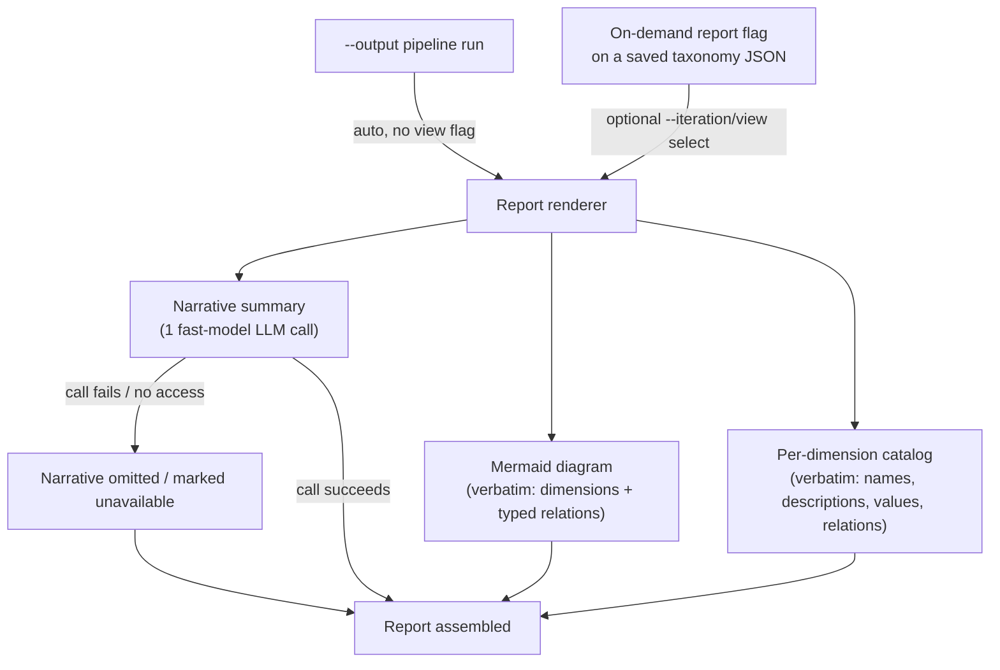

# Grounded Theory Report - Plan

## Goal Capsule

- **Objective:** Render a saved taxonomy as a self-contained markdown grounded-theory report — narrative summary, mermaid relationship diagram, per-dimension catalog — for collaborators who never ran the pipeline.
- **Product authority:** This plan owns the grounded-theory report only. `docs/NEW_IDEAS.md` also names taxonomy resumption (train/test modes) and a quality/robustness evaluation framework; those are related future areas, not active scope here (see [How This Work Fits Together](#how-this-work-fits-together)).
- **Open blockers:** None. Scope is confirmed; see Outstanding Questions for items deferred to planning.

## Product Contract

**Product Contract preservation:** meaning preserved; R12's flag name refined from the illustrative `--no-report` to `--no-auto-report`, avoiding a CLI collision with R1's `--report` flag (see KTD6) — no scope change.

### Summary

Add a markdown report renderer that turns a saved taxonomy JSON into a grounded-theory document: a narrative summary polished by one fast-model LLM call, a mermaid diagram of dimensions and their typed relations, and a per-dimension catalog of values — the diagram and catalog always rendered verbatim from the JSON. Generation is automatic with every `--output` pipeline run and available on demand from any previously saved taxonomy JSON, mirroring the existing `--visualize` flag.

### Problem Frame

The pipeline already produces a grounded theory in substance: `generate_taxonomy`/`update_taxonomy`/`review_taxonomy` output dimensions as axes of variation, values as points on those axes, and typed relations (`precondition`, `consequence`, `co_occurring`, `constrains`) linking dimensions — the paradigm-model shape grounded theory expects. But the only outputs today are the raw `taxonomy_*.json` file or the ephemeral Rich CLI tree (`_display_taxonomy_tree`). Neither is something a collaborator who didn't run the pipeline can pick up and review or critique on their own; both require reading structured data or being at the terminal when the run happened.

### Actors

- **Pipeline operator** — runs `main.py` with `--output` or invokes the on-demand report flag; triggers generation but is not necessarily the reader.
- **Report reader** — a collaborator or researcher who did not run the pipeline; consumes the markdown report to review or critique the theory without touching the tool.

### Requirements

**Report generation & triggers**
- R1. A new on-demand CLI flag generates the report from any previously saved taxonomy JSON file, mirroring the existing `--visualize` flag's post-hoc, single-file pattern.
- R2. The report is generated automatically alongside the existing `{documents|taxonomy|messages|clusters}` JSON files whenever a pipeline run uses `--output`, unless the run opts out per R12.
- R3. When invoked on demand, the report supports selecting which taxonomy view to render — a specific iteration or the final selected view — mirroring the existing `--iteration` selection semantics.
- R4. When auto-generated via `--output` with no explicit view selection, the report defaults to the same view precedence the CLI display already uses: an explicit iteration selection first, then `selected_clusters`, then the last iteration.
- R12. An opt-out (a `--no-auto-report` flag) lets operators skip automatic report generation — and its LLM narrative call — on `--output` runs where no report is needed.

**Report content & structure (deterministic)**
- R5. The mermaid diagram and the per-dimension catalog are rendered verbatim from the taxonomy JSON's clusters, relations, and values — never rewritten or reworded by an LLM.
- R6. The mermaid diagram represents each dimension as one node and each typed relation as a labeled directed edge between dimension nodes; values are not represented as diagram nodes.
- R7. The per-dimension catalog lists, per dimension: its name, its description, its values (label and description), and its outgoing relations with rationale.
- R8. Report generation reads only the single taxonomy JSON file being rendered; it does not join or read the paired documents or messages JSON files.

**Narrative summary (LLM pass)**
- R9. The report includes a narrative summary section, generated by one fast-model LLM call that synthesizes the rendered taxonomy iteration's stored `explanation` and dimension descriptions into a readable overview, positioned before the diagram and catalog.
- R10. The narrative-summary LLM call may only reword or synthesize existing explanation text for readability — it must not alter, invent, or contradict any structural fact (dimension names, relations, values) already fixed by R5.
- R11. When the narrative-summary LLM call fails or no model/API access is available, report generation still succeeds and produces the diagram and catalog in full; the narrative section is omitted or replaced with a clear "unavailable" note rather than failing the command.

### Key Decisions

- **Layered structure — narrative summary, then diagram, then per-dimension catalog** — gives a reader with zero pipeline context both the "why this holds together" framing and a checkable reference underneath, at no extra generation cost since every catalog field already exists in the JSON. Governs R5, R6, R7, R9.
- **Narrative summary gets an LLM polish pass; diagram and catalog stay verbatim** (session-settled: user-directed — chosen over a fully deterministic report after confirming the layered-report proposal, then requesting LLM massaging for readability). Governs R5, R9, R10.
- **LLM polish is scoped to the narrative summary only, not the catalog** (session-settled: user-directed — chosen over also rewording per-dimension descriptions and values, to keep structural facts entirely LLM-untouched and keep generation cost bounded). Governs R7, R10.
- **A failed or unavailable narrative call degrades gracefully rather than failing the report** — the diagram and catalog carry the evidentiary weight; losing the narrative shouldn't lose the whole document. Governs R11.
- **Auto-triggered reports default to the CLI's existing view precedence** (`--iteration`, then `selected_clusters`, then last iteration) — reuses an already-established convention (`interfaces/cli-and-outputs.md`) instead of inventing a new default. Governs R4.
- **R2's automatic generation gets an explicit opt-out (R12)** — a routine development `--output` run shouldn't pay the narrative LLM call and its cost/failure surface by default when no collaborator will ever see the report. Governs R2, R12.
- **Per-dimension catalog entries list outgoing relations only** — incoming relations are intentionally left to the diagram rather than duplicated per entry; a catalog entry is a reference alongside the diagram, not meant to be read in total isolation from it. Governs R7.

### Key Flows

- F1. Auto-generation with a pipeline run.
  - **Trigger:** A `main.py` run completes with `--output` set.
  - **Actors:** Pipeline operator.
  - **Steps:** Pipeline finishes → report view resolved by R4's precedence → narrative, diagram, and catalog assembled → report saved alongside the other output JSON files.
  - **Covers:** R2, R4, R5, R6, R7, R9, R11.
- F2. On-demand regeneration from a saved taxonomy.
  - **Trigger:** Operator invokes the new report flag against an existing `taxonomy_*.json`.
  - **Actors:** Pipeline operator.
  - **Steps:** File loaded → view resolved from an explicit selection or the default → narrative, diagram, and catalog assembled → report produced.
  - **Covers:** R1, R3, R5, R6, R7, R9, R11.

### Acceptance Examples

- AE1. **Covers R2, R4.** Given a full pipeline run with `--output` where dimension selection produced `selected_clusters`. When the run completes. Then a report is generated automatically rendering the `selected_clusters` view.
- AE2. **Covers R1, R3.** Given a previously saved taxonomy JSON with multiple iterations. When the on-demand report flag is invoked selecting a specific earlier iteration. Then the report renders that iteration's clusters as the theory, not the latest or selected view.
- AE3. **Covers R9, R11.** Given no LLM/API access is available (or the narrative call errors). When report generation runs, automatic or on-demand. Then the report still generates in full with diagram and catalog; the narrative section is clearly marked unavailable rather than the command failing.
- AE4. **Covers R6, R10.** Given a dimension with no outgoing or incoming relations. When the diagram is rendered. Then that dimension appears as an unconnected node, and the narrative pass does not fabricate a relation to explain its absence.

### Success Criteria

- A collaborator who never ran the pipeline can open the report and review or critique the theory — the dimensions, their relations, and their supporting values — without reading the raw taxonomy JSON or running the tool.
- No structural fact in the report (a dimension, a relation, a value) can be traced to LLM invention rather than the source taxonomy JSON.

### Scope Boundaries

**Deferred for later**
- Pulling document text or excerpts into the report to ground values with verbatim quotes (report reads the taxonomy JSON only, per R8).
- LLM rewriting of per-dimension catalog descriptions or values (scoped out by R10; narrative-only per Key Decisions).
- Taxonomy resumption / train-test modes and the taxonomy quality & robustness evaluation framework from `docs/NEW_IDEAS.md` — see [How This Work Fits Together](#how-this-work-fits-together).

**Deferred to Follow-Up Work**
- An unrelated pre-existing bug adjacent to the `--output`/`--fast-model` CLI wiring (`main.py`'s configurable-building block reads a non-existent `args.fast_llm` instead of `args.fast_model`) — discovered during planning research, left untouched by this diff.
- Standing up an automated `tests/` framework for this repo — no such framework exists today for any feature; this plan follows existing practice (KTD8) rather than introducing one.

### Dependencies / Assumptions

- Assumes the existing fast-model configuration (already used for `summarize` and `open_code_minibatch`) is reused for the narrative-summary call, rather than introducing a new model tier.
- Assumes taxonomy JSON `explanation`/`description` fields may occasionally be sparse (e.g., very small corpora); the narrative pass should degrade to a shorter but still coherent summary rather than fail on thin input.
- This feature is anticipatory: no taxonomy has been shared with a collaborator yet under the current tool, so scope reflects a projected need rather than an observed failure with existing sharing.
- Assumes the report is opened in a mermaid-capable markdown viewer (e.g., GitHub, most modern editors); when a viewer renders raw mermaid source instead of a diagram, the per-dimension catalog's textual relation listing (R7) is the intended fallback.
- The primary success criterion (an unfamiliar reader can understand and critique the theory) is not validated by any acceptance example, since AE1-AE4 test rendering mechanics only; a lightweight check — e.g., sharing an early generated report with one real collaborator — should happen before or shortly after shipping rather than assumed.

### Outstanding Questions

**Deferred to Planning**
- Exact narrative-pass prompt design, and whether it should draw on more than the rendered iteration's own `explanation`/descriptions (e.g., prior iterations) or stay scoped to the rendered iteration only.
- Exact output file naming and path convention for both the auto-generated and on-demand report files (this plan only requires they follow the existing output-file convention in spirit).
- Mermaid styling choices for representing four distinct relation types on diagram edges legibly as dimension count grows.

<!-- ce-section: work-relationships -->
### How This Work Fits Together

This plan owns the grounded-theory report only. `docs/NEW_IDEAS.md` describes two further areas; the breakdown below is the current understanding from this brainstorm, not a committed roadmap — a later plan may revise, split, merge, or discard it.

- Resumable taxonomy runs (train mode continuing to evolve a taxonomy; test mode freezing it and only classifying new batches)
  - Can proceed independently of this plan — no shared requirement or data-shape dependency identified.
- Taxonomy quality & robustness evaluation (repeated-run consistency, a GEval/deepeval scoreboard built from the existing `taxonomy_review.md` quality criteria, the saturation/review relationship, combinatorial sampling checks)
  - Can proceed independently of this plan.
  - Shares the same `Cluster`/`Relation`/`Value` taxonomy schema this plan renders from; an evaluation scoreboard could eventually reuse this plan's markdown-rendering approach for its own output, but that is speculative, not a commitment made here.

### Sources / Research

- `openwiki/pipeline/taxonomy.md`, `openwiki/pipeline/graph.md`, `openwiki/data-model/state-and-schemas.md` — pipeline lifecycle, node contracts, and state/schema shape referenced throughout this plan.
- `src/taxonomy_generator/schemas.py` — `Cluster`, `Relation` (typed: `precondition`/`consequence`/`co_occurring`/`constrains`), `Value` field shapes the report renders from.
- `src/taxonomy_generator/prompts/taxonomy_review.md` — existing quality-criteria table, relevant background for the deferred evaluation area, not consumed by this plan.
- `main.py` — existing `--visualize` flag (PCA biplot from a saved taxonomy JSON, no LLM calls) is the direct precedent for this plan's on-demand generation pattern; `openwiki/interfaces/cli-and-outputs.md` documents the existing output-file naming convention and the `--iteration` → `selected_clusters` → last-iteration display precedence reused by R4.
- `examples/campus-bike/campus-bike_taxonomy_20260816_194230.json` — real saved taxonomy JSON used to confirm the `Cluster`/`Relation`/`Value` shape this plan's report reads from.
- `examples/campus-bike/campus-bike_taxonomy_20260613_160855.json` — older-format saved taxonomy JSON (clusters carry no `relations`/`values` keys at all), the concrete evidence behind KTD3.
- `main.py:201-224` (`--visualize`/`--iteration` argparse group), `main.py:450-474` (`_select_clusters_for_visualize`), `main.py:477-528` (`_run_visualize`, "uniform mode": settings-only init, no graph/LLM call), `main.py:694-836` (`--output` file-serialization block: shared `timestamp`/`name_prefix`, four unconditional artifact saves), `main.py:856-859` (standalone-mode dispatch: `if args.visualize: ...; return`) — direct precedent for R1/R2/R3/R4/R12's CLI wiring.
- `src/taxonomy_generator/nodes/summary_generator.py:64-122` — the fast-model structured-output call pattern (`load_chat_model`, prompt-plus-schema chain) the narrative-summary call follows.
- `main.py:229-382` (`_display_taxonomy`/`_display_taxonomy_tree`) — the existing cluster-walk pattern the new markdown catalog renderer mirrors structurally.

---

## Planning Contract

### Key Technical Decisions

- **KTD1. Reuse `--visualize`'s standalone-mode dispatch pattern for `--report`** — mutually exclusive with `--visualize` via `argparse`'s mutual-exclusion group, and ignores `--corpus`/`--output` the same way `--visualize` does today, rather than introducing a new CLI error path (session-settled: user-approved — chosen over treating the combination as a hard error, after the agent proposed matching existing behavior and the tradeoff was surfaced in the plan-scoping synthesis). Governs R1, R3.
- **KTD2. The narrative-summary call follows `summarize`'s structured-output pattern** — a new `NarrativeSummaryOutput` Pydantic schema, a new prompt file loaded via the existing `_load_prompt` convention, `load_chat_model(configuration.fast_llm)` — no new model-loading abstraction. Governs R9.
- **KTD3. Missing `relations`/`values`/`explanation` keys on older saved taxonomy JSON degrade to empty**, matching the `.get(...) or []` convention `main.py`'s display and view-selection code already use — confirmed necessary by a real saved file with no `relations`/`values` keys at all. Governs R1, R7, R8.
- **KTD4. A relation whose `target_id` falls outside the rendered cluster set is dropped from the diagram edge, but the source dimension's catalog entry keeps the relation with a note that the target was excluded from this view** — confirmed necessary by a real saved file where selection dropped a dimension that other dimensions still hold relations toward. Governs R6, R7.
- **KTD5. When the default auto-generated view is `selected_clusters` (which carries no paired `explanation`), the narrative synthesis falls back to the latest iteration's `explanation`, scoped to omit any dimension not present in the rendered `selected_clusters` set** — avoids feeding the narrative LLM call text that describes structure the diagram/catalog no longer show. Governs R4, R9, R10.
- **KTD6. R12's opt-out flag is named `--no-auto-report`, not the Product Contract's illustrative `--no-report`, avoiding a CLI collision with R1's on-demand `--report` flag** (session-settled: user-approved). Governs R12.
- **KTD7. R10 is enforced by prompt instruction only — an accepted risk, consistent with every other LLM call in this pipeline** (session-settled: user-directed — chosen over adding a post-hoc dimension-name validation step, which would have been the first such check in this codebase). Governs R9, R10.
- **KTD8. No new automated test framework is stood up for this feature; verification is manual CLI smoke checks plus `make lint`**, matching the fact that no `tests/` directory or CI test run exists anywhere in this repo today (session-settled: user-approved). Governs the Verification Contract below.

### High-Level Technical Design

The Key Flows diagram in the Product Contract above already shows the full technical shape — two triggers (auto via `--output`, on-demand via `--report`) converging on one renderer that produces three sections (narrative, diagram, catalog), with the narrative's failure path folding back into report assembly. No separate diagram is added here; KTD1-KTD8 above are the technical decisions that shape how that flow is actually built.

### Sequencing

U1 has no dependencies and can start first. U2 depends on U1 (needs the narrative schema/prompt). U3 and U4 both depend on U2 and share its rendering functions; U4 additionally reuses U3's narrative-call wiring, so U3 should land first even though the two are otherwise independent CLI entry points.

---

## Implementation Units

### U1. Narrative-summary schema and prompt

- **Goal:** Add the structured-output contract and prompt template the narrative-summary LLM call (R9) will use, following the same shape as the existing `summarize` node.
- **Requirements:** R9, R10
- **Dependencies:** none
- **Files:**
  - `src/taxonomy_generator/schemas.py` — add `NarrativeSummaryOutput(BaseModel)` with a `summary: str` field, mirroring `SummaryOutput` (schemas.py:10-14).
  - `src/taxonomy_generator/prompts/narrative_summary.md` (new) — system prompt instructing the model to reword/synthesize the supplied `explanation` and dimension descriptions for readability only, and never introduce a dimension, relation, or value name not present in the supplied input (per KTD7's prompt-only enforcement of R10).
  - `src/taxonomy_generator/prompts/__init__.py` — add a `NARRATIVE_SUMMARY_PROMPT` export via `_load_prompt("narrative_summary.md", ...)`, and list it in `__all__` alongside the other prompt exports.
- **Approach:**
  - Follow `SummaryOutput`'s shape exactly for the new schema — single required string field, no optional structure the narrative call doesn't need.
  - Write the prompt to take the rendered iteration's `explanation` text and the in-scope dimension names/descriptions as input variables, with an explicit instruction not to reference any dimension name absent from that input (this is the prompt-level enforcement KTD7 accepts as the whole safeguard).
- **Patterns to follow:** `schemas.py:10-14` (`SummaryOutput`), `prompts/__init__.py`'s `_load_prompt` pattern used for `summary_generation.md`.
- **Test scenarios:**
  - Test expectation: none -- pure schema/prompt scaffolding with no branching logic to exercise.
- **Verification:** `python -c "from taxonomy_generator.schemas import NarrativeSummaryOutput"` and `python -c "from taxonomy_generator.prompts import NARRATIVE_SUMMARY_PROMPT"` both import without error; the prompt template renders with sample `explanation`/dimension-list values substituted.

### U2. Report renderer module

- **Goal:** Implement the three report sections — mermaid diagram, per-dimension catalog, and the narrative-summary LLM call — as pure functions over a taxonomy view (a list of clusters), independent of how that view was selected or where the report is written.
- **Requirements:** R5, R6, R7, R8, R9, R10, R11
- **Dependencies:** U1
- **Files:**
  - `src/taxonomy_generator/report_renderer.py` (new)
- **Approach:**
  1. `render_diagram(clusters) -> str` — emits a `flowchart TB` mermaid block: one node per dimension (id + name), one labeled directed edge per relation whose `target_id` is present among the rendered clusters (KTD4 — drop edges to excluded targets). Read `cluster.get("relations") or []` throughout (KTD3).
  2. `render_catalog(clusters) -> str` — emits one markdown section per dimension: name, description, values (`cluster.get("values") or []`, each with label + description), and outgoing relations with rationale; when a relation's `target_id` isn't among the rendered clusters, keep the relation line but note the target was excluded from this view (KTD4). Structurally mirror the cluster/value walk in `_display_taxonomy` (main.py:229-382), emitting Markdown instead of `rich` output.
  3. `generate_narrative_summary(clusters, explanation, configuration) -> str | None` — build the `NarrativeSummaryOutput` chain per KTD2 (`load_chat_model(configuration.fast_llm)`, `NARRATIVE_SUMMARY_PROMPT`, `.with_structured_output(NarrativeSummaryOutput)`), scope the input to the in-scope dimension names/descriptions plus `explanation` (KTD5 governs what `explanation` text the caller passes when the view is `selected_clusters`). Catch any call failure and return `None` rather than raising (R11).
  4. `assemble_report(clusters, narrative_summary_or_none) -> str` — combine narrative (or an "unavailable" note when `None`), diagram, and catalog into one markdown document (R11's graceful-degradation contract; the layered order from the Product Contract's Key Decisions).
- **Patterns to follow:** `main.py:229-382` (`_display_taxonomy`/`_display_taxonomy_tree` walk pattern), `summary_generator.py:64-122` (fast-model structured-output chain).
- **Test scenarios:**
  - Happy path: a taxonomy with 3 dimensions and a mix of all four relation types renders one node per dimension and correctly typed, labeled edges.
  - Edge case: a dimension with no relations renders as an unconnected node, not an error (covers AE4).
  - Edge case: a cluster dict with no `relations` or `values` keys at all (the older saved-file shape) renders identically to one with explicit empty lists (KTD3).
  - Edge case: a relation whose `target_id` is not among the rendered clusters is omitted from the diagram edge but appears as a noted exclusion in its source dimension's catalog entry (KTD4).
  - Error path: the narrative call raises or times out — `generate_narrative_summary` returns `None`, and `assemble_report` still produces a complete document with the narrative section marked unavailable (covers AE3).
  - Execution note: no automated test suite exists in this repo (KTD8); verify these scenarios via a short manual script or REPL session calling the module's functions directly against the two saved example taxonomy files, rather than new `pytest` coverage.
- **Verification:** manually invoke `render_diagram`/`render_catalog`/`assemble_report` against both `examples/campus-bike/campus-bike_taxonomy_20260816_194230.json` (new format, dangling `target_id`) and `examples/campus-bike/campus-bike_taxonomy_20260613_160855.json` (old format, missing keys), and read the output for correctness against KTD3/KTD4.

### U3. On-demand `--report` CLI flag

- **Goal:** Add the `--report FILE` standalone mode (R1), reusing R3's view-selection precedence and U2's renderer functions, mirroring `--visualize`'s existing "uniform mode" shape.
- **Requirements:** R1, R3, R11
- **Dependencies:** U2
- **Files:**
  - `main.py`
- **Approach:**
  1. Add `--report` to the CLI's argparse setup, placed in a mutual-exclusion group with `--visualize` (KTD1); reuse the existing `--iteration` flag for view selection.
  2. Add an async `_run_report(args)` function mirroring `_run_visualize` (main.py:477-528): `init_settings(args.config)` only, `json.load` the target file, resolve the view via the same precedence `_select_clusters_for_visualize` already implements (extract a shared helper rather than duplicating the precedence logic, since both `--visualize` and `--report` need the identical rule).
  3. Call `generate_narrative_summary`, then `render_diagram`/`render_catalog`/`assemble_report` from U2.
  4. Resolve the output path the same way `_run_visualize` does (`resolve_output_dir` from `visualization.py`, or the CLI's own default-output-dir fallback when `--output` isn't passed) and write `{name_prefix}report_{timestamp}.md`.
  5. Print the result path via `console.print`, mirroring `_run_visualize`'s confirmation (main.py:524-528).
  6. In `main()`, dispatch `_run_report` before the normal pipeline path, following the existing `if args.visualize: ...; return` shape (main.py:856-859).
  7. Update `--iteration`'s help text (main.py:209-215) and the module docstring (main.py:1-16) to mention `--report` alongside `--visualize`.
- **Patterns to follow:** `main.py:477-528` (`_run_visualize`), `main.py:450-474` (`_select_clusters_for_visualize`), `main.py:856-859` (dispatch).
- **Test scenarios:**
  - Happy path: `--report <valid taxonomy.json>` produces a report file with all three sections populated (covers AE2).
  - Edge case: `--report <taxonomy.json> --iteration N` renders that specific iteration's clusters, not the latest or selected view (covers AE2).
  - Edge case: `--report` combined with `--visualize` in the same invocation is rejected by argparse before any file I/O runs.
  - Edge case: `--report` combined with `--corpus`/`--output` ignores `--corpus` and proceeds in standalone mode, matching `--visualize`'s current behavior (KTD1).
  - Error path: `--report` targets a taxonomy JSON with an empty `clusters` list — the command still produces a near-empty report rather than crashing.
  - Execution note: no automated test suite exists in this repo (KTD8); verify via manual CLI runs against both saved example files listed in Sources / Research.
- **Verification:** `python main.py --report examples/campus-bike/campus-bike_taxonomy_20260816_194230.json` and the same command with `--iteration 1` both produce a readable report file; `python main.py --report examples/campus-bike/campus-bike_taxonomy_20260613_160855.json` (old format) does not error.

### U4. Automatic report generation on `--output`

- **Goal:** Generate the report automatically alongside the existing four `--output` artifacts (R2), honoring R4's default view precedence and the new `--no-auto-report` opt-out (R12).
- **Requirements:** R2, R4, R12
- **Dependencies:** U2, U3
- **Files:**
  - `main.py`
- **Approach:**
  1. Add a `--no-auto-report` boolean flag (KTD6), independent of any other `--output` conditional.
  2. In the existing `--output` file-writing block (main.py:694-836), after the four existing saves, add a report-generation branch gated on `args.output and not args.no_auto_report`.
  3. Resolve the view per R4's precedence (an explicit `--iteration` first if the operator passed one, then `selected_clusters`, then the last iteration) and call U2/U3's shared render/narrative functions.
  4. Write `{name_prefix}report_{timestamp}.md` using the same shared `timestamp`/`name_prefix` variables the other four artifacts already use.
  5. Fold the new file into the existing "Results Saved" panel (main.py:824-836).
- **Patterns to follow:** `main.py:694-836` (existing `--output` block).
- **Test scenarios:**
  - Happy path: `--output DIR` on a run where dimension selection produced `selected_clusters` generates a report rendering that view (covers AE1).
  - Edge case: `--output DIR --no-auto-report` produces the four existing artifacts but no report file.
  - Edge case: `--output DIR` on a run where `selected_clusters` was never produced falls back to the last taxonomy iteration, per R4.
  - Execution note: no automated test suite exists in this repo (KTD8); verify via a manual pipeline run with `--output` (with and without `--no-auto-report`) against a small corpus.
- **Verification:** run `python main.py --corpus examples/customer_support.txt --output /tmp/report-check` and confirm a report file is present and lists a `selected_clusters`-derived view; re-run with `--no-auto-report` and confirm the report file is absent while the other four artifacts still appear.

---

## Verification Contract

| Command | Applicability | What it proves |
|---|---|---|
| `make lint` | All units | Ruff check/format and `mypy --strict` pass on the new/changed code (`report_renderer.py`, `schemas.py`, `prompts/__init__.py`, `main.py`) — the only automated gate this repo currently has. |
| `python -c "from taxonomy_generator.schemas import NarrativeSummaryOutput"` | U1 | Schema import succeeds. |
| `python -c "from taxonomy_generator.prompts import NARRATIVE_SUMMARY_PROMPT"` | U1 | Prompt export succeeds. |
| `python main.py --report examples/campus-bike/campus-bike_taxonomy_20260816_194230.json` | U2, U3 | Report renders on a new-format file with a dangling `target_id` relation without error. |
| `python main.py --report examples/campus-bike/campus-bike_taxonomy_20260613_160855.json` | U2, U3 | Report renders on an old-format file missing `relations`/`values` keys without error. |
| `python main.py --report <file> --visualize <file>` | U3 | Rejected by argparse's mutual-exclusion group. |
| `python main.py --corpus examples/customer_support.txt --output /tmp/report-check` | U4 | Report auto-generates alongside the four existing `--output` artifacts. |
| `python main.py --corpus examples/customer_support.txt --output /tmp/report-check --no-auto-report` | U4 | Report generation is skipped; the other four artifacts still appear. |
| `python main.py --help` | U3 | `--report` and updated `--iteration` help text render correctly. |

Per KTD8, no `pytest`/CI test run is added — these are manual smoke commands, matching the repo's existing validation practice.

---

## Definition of Done

- All four implementation units (U1-U4) are complete and pass every Verification Contract command above.
- `make lint` passes with no new ruff or mypy warnings introduced by this work.
- Both saved example taxonomy files (old-format and new-format) render a report without error, demonstrating KTD3 and KTD4's degrade-gracefully behavior on real data, not just synthetic cases.
- The narrative section degrades to a marked "unavailable" note (never a crash) when the fast model is unreachable, demonstrated by a manual run with no API key configured.
- `--no-auto-report` correctly suppresses the automatic report while leaving the four existing `--output` artifacts unaffected.
- No dead-end or experimental code from approaches that didn't pan out remains in the diff (e.g., an abandoned first attempt at the mermaid-edge-filtering logic in KTD4).
