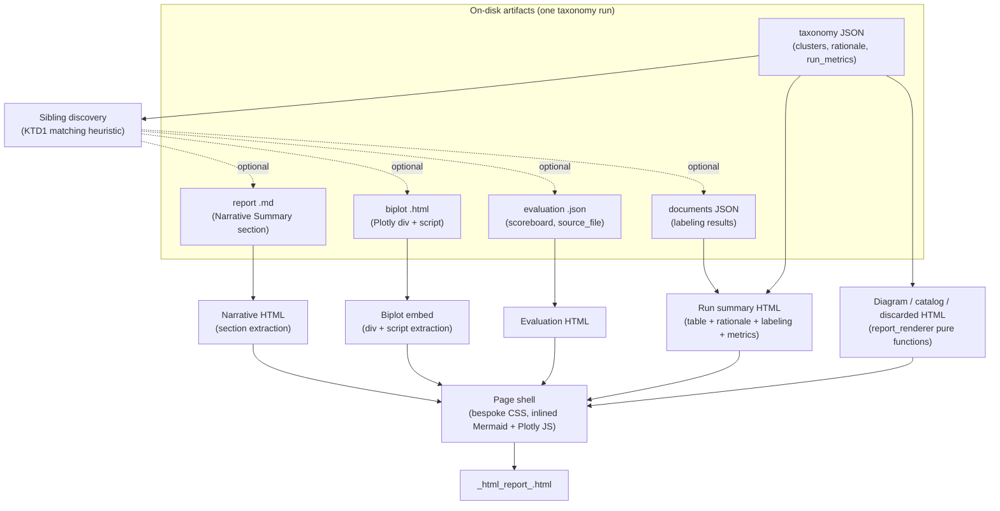

# Unified HTML Taxonomy Report - Plan

## Goal Capsule

- **Objective:** Add a `--html-report FILE` CLI mode that renders one polished, self-contained HTML page per taxonomy run, combining the run summary (dimension table, rationale, document labeling, run metrics), the grounded-theory report, the PCA/embeddings biplot, and the evaluation scoreboard.
- **Authority hierarchy:** The Product Contract (R1-R7) and Planning Contract (KTD1-KTD7) below govern implementation. Where they conflict with implementer judgment, the plan wins. A genuine blocker (an ambiguous artifact match, a missing data shape) is flagged, not guessed past.
- **Stop conditions:** Stop and flag if `plotly.offline.get_plotlyjs()` is unavailable or has changed shape in the pinned `plotly` version already in `pyproject.toml`. Stop and flag if no real example directory under `examples/` has the report, biplot, evaluation, and documents siblings all present to test the full-sibling-data path against (`examples/cursor-git-at-scale/` has all four as of this writing, though it predates `run_metrics` — see R4/Assumptions).
- **Execution profile:** `code`, Standard depth. U1, U2, U4, and U6 are parallel-safe; U3 depends on U2; U5 depends on U1, U3, and U4.
- **Tail ownership:** The implementer runs `make lint` and `make test`, plus the manual CLI checks in the Verification Contract, before calling this plan done.

---

## Product Contract

### Summary

Add a new `--html-report FILE` standalone CLI mode, mirroring the existing `--visualize`/`--report`/`--evaluate` modes, that reads a saved taxonomy JSON and its sibling artifacts off disk and composes one self-contained, blog-styled HTML page. The page reuses `report_renderer.py`'s existing pure rendering functions against the taxonomy JSON directly, inlines Mermaid and Plotly so it needs no network access, and adds a run-summary section (dimension table, rationale, document labeling, run metrics) reconstructed from the same JSON data that already powers the console display in `main.py`.

### Problem Frame

Today a taxonomy run scatters its output across independent files: a markdown report (`report_renderer.py`), a Plotly biplot HTML/PNG/CSV (`visualization.py`), an evaluation scoreboard JSON (`evaluation/runner.py`), and a documents JSON. The data behind the console's dimension table and document-labeling results is already saved in these files, but its polished rendering (`_display_taxonomy`, `_display_documents` in `main.py`) exists only in the terminal. A run's elapsed time and token usage are worse off: `main.py:run()` computes them but never writes them anywhere, so they are genuinely lost once the process exits. Sharing or archiving a taxonomy run today means gathering several files by hand and losing the console's polished view entirely. A single polished page, styled like a blog post rather than a raw file dump, makes one taxonomy run a shareable, self-contained artifact.

### Requirements

**Composition and sourcing**

- R1. Given a saved taxonomy JSON path, the feature locates and uses, when present, its sibling grounded-theory report (`.md`), biplot (`.html`), evaluation scoreboard (`.json`), and documents (`.json`) from the same output directory.
- R2. Each of the four sibling artifacts is optional and matched independently. When a sibling has no candidate at all, the page renders without that section and states plainly that it is unavailable. When a sibling has more than one ambiguous candidate, the page uses KTD1's tie-break and renders that best-effort match with a visible "approximate match" note, rather than omitting the section — both outcomes follow this codebase's existing fail-soft conventions (e.g. `render_taxonomy_biplot`'s `None` return, `generate_narrative_summary`'s omit-on-failure behavior), applied to two distinct cases: no match, and an unresolved tie.
- R3. The page includes a run-summary section — the dimension table, per-iteration rationale, and document-labeling results — reconstructed from the taxonomy JSON and its sibling documents JSON (R1), reproducing the same information `main.py`'s `_display_taxonomy`/`_display_documents` already show in the console.

**Run metrics persistence**

- R4. A full pipeline run (`--output DIR`) persists elapsed time, prompt/completion/total token counts, and run mode into the saved taxonomy JSON, so the run-summary section can show the same `⏱️`/`🪙` line the console already prints. A taxonomy JSON saved before this field existed has no `run_metrics`; the run-summary section renders that line as "not recorded for this run" rather than treating the whole taxonomy JSON as unusable (see Assumptions).

**Rendering and styling**

- R5. The combined report is one self-contained HTML file: viewing it needs no external network requests (Mermaid and Plotly JS are inlined, not CDN-loaded).
- R6. The page is styled as a polished, blog-quality document — clean typography, generous whitespace, a sticky in-page section navigation with anchor links in a fixed section order, pull-quote-style presentation of narrative and dimension highlights, alt/aria labeling on the embedded chart and diagram, and a single-column reflow below a stated breakpoint — not a raw concatenation of the source artifacts' own formatting.

**CLI integration**

- R7. A new `--html-report FILE` CLI mode, added to the existing mutually-exclusive standalone-mode group (`--visualize`/`--report`/`--evaluate`, `main.py:270-300`), renders the combined page from a saved taxonomy JSON and exits without running the pipeline.

### Key Decisions

- **Compose from on-disk artifacts, keyed on a taxonomy JSON path** (session-settled: user-directed — chosen over an in-process renderer sharing pipeline state: works retroactively on artifacts already saved, including the `examples/` directories, and stays decoupled from the three source renderers). Governs R1, R7.
- **Self-contained/offline HTML** (session-settled: user-directed — chosen over CDN-loaded Mermaid/Plotly: the page must be shareable and viewable with no network access). Governs R5.
- **Permanent CLI feature with its own test suite** (session-settled: user-directed — chosen over a one-off showcase script: any future taxonomy run should be able to produce the unified artifact, not just this session's examples). Governs R7.
- **Persist run metrics into the saved taxonomy JSON** (session-settled: user-directed — chosen over leaving timing/tokens out of the report: they are already computed as local variables in `main.py:run()` and only need to be written down, not newly derived). Governs R4.

### Scope Boundaries

- Only the new report's *consumption* of `report_renderer.py`/`visualization.py`/`evaluation/runner.py` output is in scope. Their own generation logic and output formats are unchanged.
- Static single-file HTML only — no server, no live dashboard, no interactivity beyond what a self-contained Plotly chart and Mermaid diagram already provide.

**Deferred to Follow-Up Work**

- Auto-generating the unified HTML report at the end of a full `--output` pipeline run (the way `--report` has an auto path today). This plan ships `--html-report` as an explicit standalone mode only.
- Any styling localization beyond the taxonomy's own content language.

---

## Planning Contract

### Key Technical Decisions

- KTD1. **Sibling-artifact matching heuristic.** Each of the four sibling types (report, biplot, evaluation, documents) is resolved independently; every resolver returns "no match" rather than raising, and every tie-break among multiple candidates prefers the candidate whose filename embeds the taxonomy JSON's own timestamp, falling back to most-recently-modified only when no candidate's filename carries a parseable timestamp (a filesystem-copy operation, such as the one U4's own tests use to build fixture directories, can reset modification times, so the embedded timestamp is the more reliable signal `run()` already produces).
  - **Report:** prefers an exact timestamp match — `<name>_report_<taxonomy JSON's own timestamp>.md`, the convention `run()` already uses when it writes both files in the same call (`main.py:1206`, `main.py:1360`) — falling back to the newest `<name>_report_*.md` in the directory, with a logged warning that the match is approximate.
  - **Biplot:** globs `taxonomy_biplot_<name>_*_<iteration>*.html` for the resolved iteration, preferring a `standalone`-stage match, else the newest. When both a `_2d` and `_3d` variant match the same stage and iteration (as in `examples/cursor-git-at-scale/`, which has both), prefers `_3d` as the richer view.
  - **Evaluation:** prefers an exact match on the file's own `source_file` field resolving to the given taxonomy JSON path (since `evaluation/runner.py`'s saved artifact already carries this), falling back to `taxonomy_name` + `iteration` equality. When more than one file matches `source_file` exactly — a normal outcome of re-running `--evaluate` against the same taxonomy, as `examples/cursor-git-at-scale/` also demonstrates — the same tie-break applies: embedded timestamp first, then newest. Multi-file consistency-mode artifacts (`--evaluate` with 2+ files, saved with `source_files`/`consistency` keys instead of `source_file`/`scoreboard`) never match this resolver and correctly fall through to "no match".
  - **Documents:** matches `<name>_documents_*.json` by `taxonomy_name`, same tie-break on multiple candidates.

  Governs R1, R2.
- KTD2. **Narrative summary sourced from the existing report `.md`, not a fresh LLM call; diagram/catalog/discarded-dimensions re-derived from the taxonomy JSON, evaluation from the sibling evaluation JSON.** `generate_narrative_summary` in `report_renderer.py:340-392` costs one model call and could drift from the archived text. The unified page instead extracts the `## Narrative Summary` section's paragraphs directly from the sibling `.md` file, applying a mechanical, dependency-free normalization for the common inline markdown the LLM-generated prose tends to contain — `**bold**`/`*italic*` spans to `<strong>`/`<em>`, and a leading `- `/`* ` line to a `<li>` inside a wrapping `<ul>` — so the extracted text does not leak raw markdown syntax into the styled HTML (R6). Diagram, catalog, and discarded-dimensions sections are re-derived by calling `report_renderer.render_diagram`/`render_catalog`/`render_discarded_dimensions` directly against the taxonomy JSON's clusters — pure, deterministic, LLM-free functions, so re-deriving them for richer HTML styling costs nothing and needs no `.md` parsing. The evaluation section instead calls `report_renderer.render_evaluation`'s equivalent HTML-native rendering against the *sibling evaluation JSON's* `scoreboard` data (resolved by KTD1) — it is not derivable from the taxonomy JSON's clusters.
- KTD3. **Biplot embedded by extraction, not regeneration.** The sibling biplot `.html` (built by `visualization.py`'s `_save_biplot_html`) already contains a `<div class="plotly-graph-div">` and a trailing `Plotly.newPlot(...)` `<script>`. The unified page extracts that div and script verbatim and drops the file's own CDN `<script src="https://cdn.plot.ly/...">` tag, replacing it once, page-wide, with `plotly.offline.get_plotlyjs()`'s inlined output. This reuses the artifact as the source of truth (consistent with the "compose from on-disk artifacts" decision) without needing the original clusters/config to reconstruct the chart. When a matched biplot file doesn't contain the expected div-plus-script shape (extraction fails), the biplot section falls back to the same "not available" state as a missing file, per R2, rather than embedding broken markup or raising. This plan accepts the risk that an archived biplot's `Plotly.newPlot(...)` call was generated against an older Plotly.js (the `examples/cursor-git-at-scale/` fixture references a `4.0.0` CDN build against a `plotly>=5.24.0` pinned dependency) and may render imperfectly under the newer inlined runtime; U3's manual offline-render check (Verification Contract) includes at least one archived, not freshly generated, biplot to surface this early if it is a real problem.
- KTD4. **Mermaid vendored as a packaged static asset.** No pip package provides Mermaid (JS-only). A pinned Mermaid UMD build is vendored under `src/taxonomy_generator/assets/mermaid.min.js` and shipped via `pyproject.toml`'s `[tool.setuptools.package-data]` (today only `py.typed`), read at render time and inlined in the page `<head>`.
- KTD5. **Bespoke inline CSS, no framework.** One hand-written `<style>` block in the page shell delivers the blog-quality styling (R6) without adding a CDN-dependent CSS framework, which would violate the offline requirement (R5). Section order and navigation are fixed: Run Summary, Dimension Diagram, Dimension Catalog, Discarded Dimensions (when present), Narrative Summary, Biplot, Evaluation — a sticky sidebar (or top bar on narrow viewports) lists these as anchor links, highlighting the section currently in view. Pull-quote treatment is applied to exactly two elements: the narrative's first sentence, and each of the top 3 dimensions by value count from the dimension table — no broader "highlight-worthy" judgment call is needed. Accessibility/responsive minimums: the Plotly chart and Mermaid diagram each get a text `aria-label` summarizing what they show (not just an empty container), heading levels follow the fixed section order with no skipped levels, body-text contrast meets WCAG AA, and the layout reflows to a single column with the sidebar nav collapsing into a top bar below a 720px viewport width.
- KTD6. **`run_metrics` is a plain dict added directly to `taxonomy_data`, not threaded through `State`/`OutputState`.** Unlike the LangGraph node-output case documented in `docs/solutions/architecture-patterns/surface-langgraph-node-output-through-state-schema-to-cli-and-report.md`, `elapsed`/`token_tracker`/`mode` are already local variables in `run()`'s own scope at the point `taxonomy_data` is assembled (`main.py:1164-1260`) — no node produces them, so no state-schema threading applies, only a direct dict write.
- KTD7. **New test suite lives under `tests/unit_tests/`.** The `Makefile`'s `test` target already assumes `TEST_FILE ?= tests/unit_tests/` (`Makefile:6-9`), though the directory does not yet exist — this is the first test suite for the package, following scaffolding the Makefile already expects rather than inventing a new convention.

### High-Level Technical Design



### Assumptions

- A recent stable Mermaid 10.x UMD build is an acceptable pin for KTD4; upgrading later is a non-breaking asset swap.
- `run_metrics.total_tokens` is stored as `0` (not omitted) when `token_tracker.total_tokens` is `0`, matching the console's own `"N/A"` fallback being a *display* choice, not a *data-absence* signal — the field is always written for a full pipeline run.
- `run_metrics` reflects only the pipeline graph's own execution cost (captured at `main.py:1164`, before the auto-report's separate narrative LLM call at `main.py:1361` runs). This matches what the console already shows today — `_format_elapsed`/`token_tracker` are displayed before auto-report generation starts — so the unified report is not introducing a new undercount, only persisting the same number the console already prints.
- A taxonomy JSON saved before this plan lands has no `run_metrics`/`mode` field, including the `examples/` fixtures already in this repo. Per R4, the run-summary section renders "not recorded for this run" for the timing/token line in that case, the same fail-soft treatment R2 gives a missing sibling artifact — this is expected on old files, not a defect to fix by regenerating them.

---

## Implementation Units

### U1. Persist run metrics into the saved taxonomy JSON

**Goal:** Capture elapsed pipeline time, token usage, and run mode — already local variables in `run()` — into the saved taxonomy JSON.

**Requirements:** R4

**Dependencies:** none

**Files:**
- `main.py` (the `taxonomy_data` assembly block, `main.py:1236-1260`)
- `tests/unit_tests/test_run_metrics.py` (new)

**Approach:**
1. After `elapsed` and `token_tracker` are computed (`main.py:1164-1177`), add `taxonomy_data["run_metrics"] = {"elapsed_seconds": ..., "total_tokens": ..., "prompt_tokens": ..., "completion_tokens": ...}` and `taxonomy_data["mode"] = mode` to the assembly block per KTD6.
2. Only write `run_metrics`/`mode` when `--output` is present — standalone modes have no timing/token data and must not fabricate it.

**Test scenarios:**
- Full pipeline run with `--output`: the saved taxonomy JSON's top level includes `run_metrics` with a positive `elapsed_seconds` and token counts, and `mode` matching the effective `--mode`/config default.
- `token_tracker.total_tokens == 0` (no LLM calls made): `run_metrics.total_tokens` is `0`, not omitted, per the Assumptions entry above.
- Full pipeline run without `--output`: no file is written at all (existing behavior unchanged); `run_metrics` logic is never reached.

**Verification:** Run `python main.py --corpus <sample> --output <dir>` and confirm the saved `*_taxonomy_*.json` includes `run_metrics` and `mode`. `make lint` clean.

---

### U2. Vendor Mermaid.js as a packaged asset

**Goal:** Ship a pinned Mermaid UMD build inside the installed package so the diagram section renders fully offline.

**Requirements:** R5

**Dependencies:** none

**Files:**
- `src/taxonomy_generator/assets/mermaid.min.js` (new, vendored)
- `pyproject.toml` (`[tool.setuptools.package-data]`, currently only `py.typed`)

**Approach:**
1. Vendor a specific pinned Mermaid UMD/browser build under a new `src/taxonomy_generator/assets/` directory (per KTD4 and the Assumptions pin).
2. Extend `pyproject.toml`'s package-data entry so the asset ships with the installed package.
3. Read the file's contents at render time (e.g. `importlib.resources`) rather than re-fetching it.

**Test scenarios:**
- Test expectation: none — pure static asset. U3's "full data present" test scenario explicitly asserts the vendored `mermaid.min.js` content is inlined in the composed page output (not merely that no external Mermaid `<script src=` remains), which is this unit's real coverage.

**Verification:** A local editable install (`pip install -e .` or equivalent) includes the asset in the built package. `make lint` clean.

---

### U3. HTML section-rendering module

**Goal:** Turn a taxonomy JSON, plus whatever sibling data U4 finds, into styled HTML fragments and the final composed page.

**Requirements:** R3, R5, R6

**Dependencies:** U2

**Files:**
- `src/taxonomy_generator/html_report.py` (new)
- `tests/unit_tests/test_html_report.py` (new)

**Approach:**
1. Run summary: dimension table + per-iteration rationale (mirroring `main.py:_display_taxonomy`'s label logic, `main.py:329-409`) + document-labeling table (mirroring `main.py:_display_documents`, `main.py:495-541`) + the `run_metrics` line, all sourced from the taxonomy JSON and sibling documents JSON (U4). The documents-JSON sibling follows the same optional/fail-soft treatment as the other three (R2): when U4 finds no match, the document-labeling table renders an explicit "not available" note instead of raising or being silently skipped.
2. Diagram: call `report_renderer.render_diagram(clusters)`, strip its ```` ```mermaid ```` fence, embed the inner syntax in `<pre class="mermaid">`.
3. Catalog, discarded dimensions: new HTML-native renderers over the same `clusters` data `report_renderer.py` already consumes, per KTD2 — not a markdown-to-HTML conversion of `render_catalog`'s output, since that would lose the blog-style presentation R6 requires. Evaluation scoreboard: a new HTML-native renderer over the sibling evaluation JSON's `scoreboard` data, per KTD2. A legitimate empty result (zero discarded dimensions, zero labeled documents) renders its own "none found" state, distinct from the "not available" state used when the sibling itself is missing.
4. Narrative: extract and normalize the `## Narrative Summary` section's paragraphs from the sibling report `.md`, per KTD2.
5. Biplot: extract the chart `<div>` and trailing `Plotly.newPlot(...)` `<script>` from the sibling biplot `.html`, per KTD3 (including its malformed-file fallback); inline U2's vendored Mermaid JS and `plotly.offline.get_plotlyjs()` once in the page `<head>`.
6. Page shell: one `<style>` block implementing KTD5's fixed section order, sticky anchor-link navigation, pull-quote rule, and accessibility/responsive minimums, wrapping all sections.
7. Every section function degrades to an explicit "unavailable" placeholder rather than raising when its source data is missing, matching `report_renderer.py`/`visualization.py`'s existing fail-soft conventions. A missing evaluation sibling and an evaluation sibling present but marked `unavailable: true` render distinct text ("no evaluation was run for this taxonomy" vs. the scoreboard's own stated unavailability reason).

**Test scenarios:**
- Full data present (taxonomy JSON + report `.md` + biplot `.html` + evaluation `.json` + documents `.json`): the composed page contains every section in KTD5's fixed order, the diagram's mermaid syntax, the vendored Mermaid JS content inlined (not just absence of an external Mermaid `<script src=`), the extracted Plotly chart div, and zero external `<script src=`/`<link href=` references anywhere in the output.
- Missing biplot sibling: the other sections render; the biplot section shows an explicit "not available" note, not an exception.
- Biplot sibling present but its `<div>`/`Plotly.newPlot(...)` shape doesn't extract cleanly: the biplot section falls back to the same "not available" state as a missing file, per KTD3.
- Missing evaluation sibling vs. an evaluation sibling present with `unavailable: true`: each renders its own distinct text, not the same generic placeholder.
- Zero discarded dimensions and zero labeled documents (siblings present, data legitimately empty): each renders a "none found" state distinct from the "not available" state used for a missing sibling.
- Missing documents-JSON sibling: the run-summary's document-labeling table shows "not available"; the rest of the page renders normally.
- Narrative extraction: a report `.md` with `## Narrative Summary` followed by `## Dimension Relationship Diagram` extracts only the narrative paragraphs, not the following section's content; embedded `**bold**` and a leading `- ` list line normalize to `<strong>`/`<li>` rather than appearing as literal markdown characters.
- Dimension catalog HTML includes a value carrying `merged_from` provenance: the consolidation note is visible, mirroring `report_renderer._merged_from_note`.

**Verification:** Run the new unit tests. Manually open a generated page in a browser with network access disabled to confirm it renders fully offline — check at least one freshly generated report and one built from an older archived biplot (e.g. `examples/cursor-git-at-scale/`) to catch any Plotly.js version-skew rendering issues (KTD3).

---

### U4. Sibling-artifact discovery and matching

**Goal:** Given a taxonomy JSON path, locate its sibling report/biplot/evaluation/documents files using KTD1's heuristics.

**Requirements:** R1, R2

**Dependencies:** none

**Files:**
- `src/taxonomy_generator/html_report.py` (discovery functions, alongside U3's renderers)
- `tests/unit_tests/test_artifact_discovery.py` (new)

**Approach:**
1. Implement one resolver per artifact type per KTD1: report (exact timestamp, then newest-file fallback), biplot (iteration + stage + dimensionality glob), evaluation (`source_file` match, then `taxonomy_name`+`iteration` fallback), documents (`taxonomy_name` match).
2. Every resolver's tie-break among multiple candidates parses the embedded filename timestamp first, falling back to most-recently-modified only when no candidate's filename carries a parseable timestamp, per KTD1.
3. Each resolver returns "no match" rather than raising, keeping U3's rendering path fail-soft.

**Test scenarios:**
- A directory with one taxonomy JSON and exactly one matching artifact of each of the four kinds resolves all four correctly, verified against the real fixtures in `examples/cursor-git-at-scale/`.
- A directory with multiple evaluation JSONs whose `source_file` all match the given taxonomy path (as `examples/cursor-git-at-scale/` itself has, from re-running `--evaluate`): the tie-break selects one via KTD1's rule, not an arbitrary or undefined choice.
- A directory with both a `_2d` and a `_3d` biplot for the same resolved stage and iteration (as `examples/cursor-git-at-scale/` has): the `_3d` variant is selected, per KTD1.
- A directory with no sibling artifacts at all: all four resolvers return "no match", no exception raised.
- A directory with an ambiguous report `.md` (no exact timestamp match, two candidates, one with a parseable embedded timestamp): the timestamp-bearing candidate is selected and a warning is logged.

**Verification:** Run the new unit tests against a copied fixture directory (a trimmed copy of `examples/cursor-git-at-scale/`).

---

### U5. Wire `--html-report FILE` into main.py

**Goal:** Add the new standalone CLI mode, mirroring `--report`/`--visualize`/`--evaluate`.

**Requirements:** R7

**Dependencies:** U1, U3, U4

**Files:**
- `main.py` (`parse_args`'s `standalone_mode` group, `main.py:270-300`; a new `_run_html_report` function modeled on `_run_report`, `main.py:708-757`; `main()`'s dispatch block, `main.py:1407-1419`)

**Approach:**
1. Add `--html-report FILE` to the existing `standalone_mode` mutually-exclusive group, with matching help text and `--iteration` support.
2. Add `_run_html_report(args)`, modeled on `_run_report`: load the taxonomy JSON via `_load_taxonomy_file`, resolve the view via `_select_clusters_for_visualize`, resolve the output directory via `visualization.resolve_output_dir`, discover siblings via U4, render via U3, write `<name_prefix>html_report_<timestamp>.html`, and print the same `Panel` + "saved to" convention the other standalone modes use.
3. Dispatch it from `main()` alongside the other standalone-mode branches.

**Test scenarios:**
- Test expectation: none — thin CLI wiring over U1/U3/U4, which carry the real test coverage. Verified by the manual CLI runs in the Verification Contract.

**Verification:** `python main.py --html-report <a saved taxonomy JSON> --output <dir>` produces a single `.html` file; open it in a browser with network disabled and confirm every section renders. `make lint` clean.

---

### U6. Test suite scaffolding

**Goal:** Stand up the package's first automated test suite, matching the `Makefile`'s existing `tests/unit_tests/` convention.

**Requirements:** supports the test scenarios in R1-R7 above

**Dependencies:** none (parallel with U1, U2, U4)

**Files:**
- `tests/unit_tests/__init__.py` (new, empty)
- `pyproject.toml` (add `pytest` to `[project.optional-dependencies].dev`)

**Approach:** Establish the directory and dev dependency once; U1, U3, and U4 each add their own test file under it.

**Test scenarios:** Test expectation: none — scaffolding only.

**Verification:** `make test` (`python -m pytest tests/unit_tests/`) runs cleanly once U1/U3/U4's tests exist.

---

## Verification Contract

| Command | Applies to | Purpose |
|---|---|---|
| `make lint` | All units | `ruff check` + `mypy` — the repo's only pre-existing automated gate. Must stay clean. |
| `make test` | U1, U3, U4, U6 | `python -m pytest tests/unit_tests/` — new test suite this plan introduces. |
| `python main.py --corpus <sample> --output <dir>` | U1 | Confirms `run_metrics`/`mode` persist to the saved taxonomy JSON and the existing auto-report path is unaffected. |
| `python main.py --html-report <taxonomy JSON> --output <dir>` | U5 | Run against `examples/cursor-git-at-scale/` (report/biplot/evaluation/documents all present, but `run_metrics` absent since the fixture predates U1) and against a taxonomy JSON missing one sibling, confirming both the full-sibling-data path and the degraded-data path — including the run-summary's "not recorded for this run" state for the pre-U1 fixture. |
| Manual: open the generated `.html` with network access disabled | U3, U5 | Confirms R5's self-contained/offline requirement actually holds, not just that no CDN URL is present in the source. |

## Definition of Done

- All six units land; `make lint` and `make test` pass.
- A generated report for `examples/cursor-git-at-scale/` renders every sibling-sourced section (narrative, diagram, catalog, biplot, evaluation, document-labeling) with no missing-data placeholders, since that example has all four sibling artifacts. Its run-summary timing/token line correctly shows "not recorded for this run", since that fixture predates U1 and has no `run_metrics` — this is the expected fail-soft state, not a defect.
- A generated report for a fresh full-pipeline run (`--output`, so `run_metrics` is present) shows the actual `⏱️`/`🪙` line in the run summary.
- A generated report for a taxonomy JSON missing one sibling artifact renders cleanly with that section's explicit "not available" state, not an error.
- The generated HTML file has zero external `<script src=`/`<link href=` references.
- No abandoned or experimental code left behind from approaches that did not pan out.
