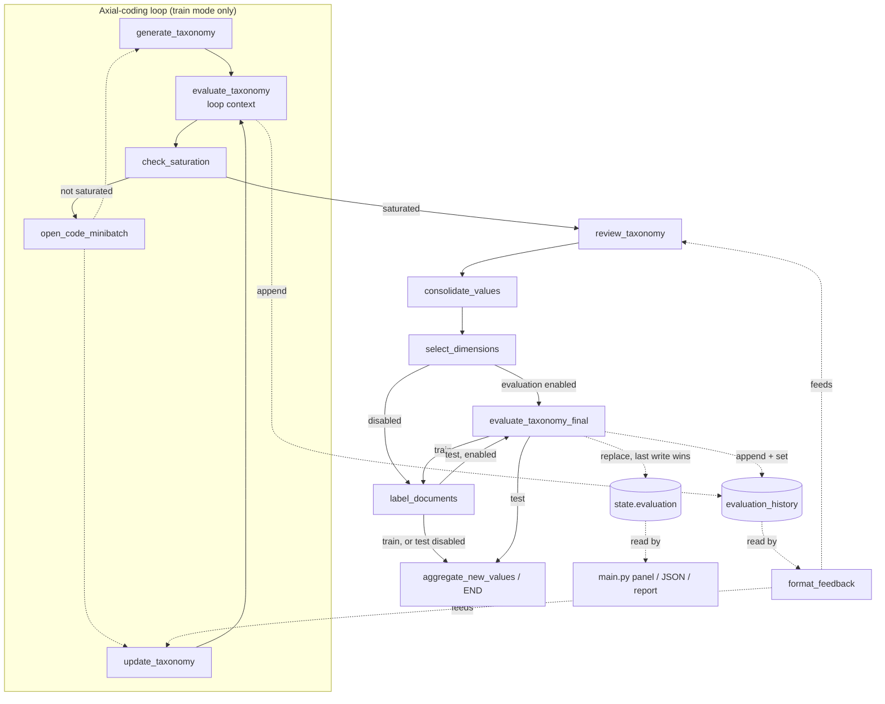

# Taxonomy Evaluation Feedback Integration - Plan

## Goal Capsule

- **Objective:** Wire the existing, observe-only `evaluate_taxonomy` node into `graph.py` at two points — after every axial-coding pass (new) and once after selection (finishing a design that was already built but never connected) — so `update_taxonomy` and `review_taxonomy` receive fresh evaluation-derived feedback through the existing `format_feedback` channel, and the already-built reporting surfaces (`main.py` panel/JSON/report) finally receive real data from live runs.
- **Authority hierarchy:** The Product Contract (R1-R7) and Planning Contract (KTD1-KTD5) below govern implementation. Where they conflict with implementer judgment, the plan wins. A genuine blocker (e.g. LangGraph version behavior differing from KTD1's ordering assumption) is flagged, not guessed past.
- **Stop conditions:** Stop and flag if the installed LangGraph version does not apply node-return updates to unreduced fields in strict execution order (KTD1's correctness argument for `state.evaluation` depends on this). Stop and flag if `evaluate_taxonomy`'s signature or `evaluation/runner.py`'s scoreboard shape has changed since this plan was written (`src/taxonomy_generator/nodes/taxonomy_evaluator.py`, `src/taxonomy_generator/evaluation/runner.py`).
- **Execution profile:** `code`, Standard depth. U1 is the sole dependency for U2, U3, and U4, which are otherwise independent of each other (U2 and U3 both touch `graph.py` and should land as consecutive, non-conflicting edits).
- **Tail ownership:** The implementer runs `make lint`, the graph-compile smoke check, and the pytest additions in the Verification Contract before calling this plan done. Network-dependent full-run verification is documented but not required to pass CI.

---

## Product Contract

### Summary

Register the existing `evaluate_taxonomy` node (`src/taxonomy_generator/nodes/taxonomy_evaluator.py`) under two names in `graph.py`, each wired at a different point: a **loop call** after every `generate_taxonomy`/`update_taxonomy` pass (new), and a **final call** completing the post-selection/post-labeling wiring that a prior commit (`1519860`) already built the routing for (`src/taxonomy_generator/routing/should_continue_after_evaluation.py`) but never connected. A new `evaluation_history` state field accumulates every call so `format_feedback` can surface the freshest scoreboard to `update_taxonomy` and `review_taxonomy`, while the existing `evaluation` field keeps its current "final, replace" contract untouched — it is always set last by construction, so `main.py`'s already-built panel/JSON/report code (currently dark on every live run, since `graph.py` never called the node) starts receiving real data with no changes on that side.

### Problem Frame

`evaluate_taxonomy` is fully built and unit-testable but dead code in every live pipeline run: `graph.py` never registers or routes to it. A prior plan ([`docs/plans/2026-08-20-0031-feat-taxonomy-evaluation-suite-plan.md`](2026-08-20-0031-feat-taxonomy-evaluation-suite-plan.md), KTD6) designed and mostly built this — the node, the `evaluation` state field, and the routing functions in `should_continue_after_evaluation.py` all exist — but the corresponding `graph.py` edges were never added (commit `1519860` touched only the node, state, and routing files). Separately, `update_taxonomy` and `review_taxonomy` already consume `format_feedback(state)` for prompt-injected feedback, but that channel currently only carries human/saturation-critic feedback — never evaluation signal, because no evaluation ever runs. (See origin: `docs/option-a1-evaluation-feedback-integration-plan.md`, the informal working draft this plan formalizes and corrects.)

### Requirements

**Loop feedback**

- R1. `evaluate_taxonomy` runs after every `generate_taxonomy`/`update_taxonomy` pass, before `check_saturation`, on every axial-coding iteration — not throttled.

**Final scoreboard (completing the existing design)**

- R2. `evaluate_taxonomy` also runs once after the axial-coding loop exits: `select_dimensions → evaluate_taxonomy_final → label_documents` (train mode), `label_documents → evaluate_taxonomy_final → aggregate_new_values` (test mode), reusing `should_evaluate_after_selection`/`should_continue_after_evaluation` exactly as already implemented.
- R3. `state.evaluation` keeps its existing "final view, replace semantics" contract: at run end it holds whatever the chronologically-last evaluator call produced, which by construction (R1 always precedes R2 in execution order) is always the R2 call — so `main.py`'s existing panel, JSON-artifact, and report-section code needs no changes to start working.

**Feedback surfacing**

- R4. A new `evaluation_history` field accumulates every evaluator call (both R1 and R2 sites), in execution order, using the repo's standard `Annotated[List[Dict], operator.add]` pattern (matching `clusters`, `explanations`, `status`, `open_codes`, `saturation_history` in `state.py`).
- R5. `format_feedback(state)` (`src/taxonomy_generator/utils.py`) appends a concise evaluation section built from `evaluation_history[-1]`'s real scoreboard shape — `{"criteria": [{"name","score","threshold","evaluated","passed","reason"}], "overall", "model", "unavailable"}` per `evaluation/runner.py::run_scoreboard` — sorted weakest-scoring-criterion-first, omitted entirely when the latest entry is absent or `unavailable`.

**Invariants preserved**

- R6. `evaluation.enabled: false` restores the exact current topology: the loop-call node executes but does no LLM work and appends nothing to `evaluation_history` (it already early-returns on disabled config); both final-call routing functions already fall through to the direct edges they implement today.
- R7. The evaluator remains strictly observe-only from both call sites — it never writes `clusters`, `selected_clusters`, or any routing-relevant state, and a judge failure (`scoreboard.get("unavailable")`) never fails the run or corrupts state.

### Key Decisions

- **Evaluate every axial-coding iteration, not throttled** (session-settled: user-directed — chosen over a once-before-review or every-Kth-iteration cadence: the user explicitly confirmed accepting the added judge-call cost in exchange for `update_taxonomy` getting fresh signal on every pass, which no less-frequent cadence can provide). Governs R1.
- **Finish and reuse the existing half-wired final-call design rather than replacing it** (session-settled: user-approved — `should_continue_after_evaluation.py` already implements exactly the post-selection/post-labeling topology needed for the canonical reporting scoreboard; discarding it would throw away already-correct, already-reviewed work). Governs R2, R3.
- **`format_feedback` reads `evaluation_history`, never `state.evaluation`** (derived from graph ordering, not a preference: `state.evaluation` is only set by the R2 call, which always executes after `review_taxonomy` has already run in both modes, so `review_taxonomy` can only ever observe evaluation signal through the history channel). Governs R5.

### Scope Boundaries

- Evaluation output never routes the graph or gates termination (R7) — this plan adds feedback content, not decision-making, to the pipeline.
- No new prompt variables — `format_feedback`'s existing `{feedback}` slot is the sole delivery channel (already consumed by `update_taxonomy` and `review_taxonomy`).
- `evaluation/runner.py`, `evaluation/metrics.py`, and `main.py`'s existing accumulation/panel/report code are unchanged — they already work correctly and only need `state.evaluation` to actually be populated, which R2/R3 supply.

**Deferred to Follow-Up Work**

- A configurable evaluation cadence (skip every Kth loop iteration) — noted as a cheap follow-up if judge cost proves too high in practice, not built now per the Key Decision above.
- Including scoreboard `reason` text (rationale strings) in the `format_feedback` summary beyond the shortest possible truncation — deferred to keep the first version simple; revisit if `update_taxonomy`/`review_taxonomy` output shows the summary needs more than scores to act on.

---

## Planning Contract

### Key Technical Decisions

- KTD1. **One node function, two graph registrations, no branching inside the node.** Register the unchanged `evaluate_taxonomy` callable under two node names — `"evaluate_taxonomy"` (loop context) and `"evaluate_taxonomy_final"` (post-loop context). `state.evaluation` has no reducer (plain replace), and this graph is a strict sequential chain with no parallel branches touching it, so whichever call executes last wins — the final-context call always executes after every loop-context call in both modes, so `state.evaluation` ends the run holding the true final scoreboard with zero special-casing in the node itself. Governs R2, R3.
- KTD2. **Graph wiring.** Loop (`src/taxonomy_generator/graph.py`): replace `generate_taxonomy → check_saturation` and `update_taxonomy → check_saturation` with `generate_taxonomy → evaluate_taxonomy → check_saturation` and `update_taxonomy → evaluate_taxonomy → check_saturation`. Final: replace `select_dimensions → label_documents` with a conditional edge on `should_evaluate_after_selection` (`{"evaluate_taxonomy": "evaluate_taxonomy_final", "label_documents": "label_documents"}`), add a conditional edge from `evaluate_taxonomy_final` on `should_continue_after_evaluation` (`{"label_documents": "label_documents", "aggregate_new_values": "aggregate_new_values"}`), and extend `should_aggregate_values` (`src/taxonomy_generator/routing/should_aggregate_values.py`) so its test-mode branch returns `"evaluate_taxonomy"` (mapped to node `"evaluate_taxonomy_final"`) when `evaluation.enabled`, else `"aggregate_new_values"` directly — preserving R6's disabled-path fallthrough. Governs R1, R2, R6.
- KTD3. **Node return payload.** `evaluate_taxonomy` (`src/taxonomy_generator/nodes/taxonomy_evaluator.py`) returns `evaluation_history: [scoreboard]` on every successful call, and `evaluation_history: []` on the disabled/no-view-available early returns (never appends `None`) — alongside the unchanged `evaluation: scoreboard` key. `state.py` gains `evaluation_history: Annotated[List[Dict], operator.add] = field(default_factory=list)` on `OutputState`/`State`, mirroring the existing `clusters`/`status`/`saturation_history` accumulation pattern. Governs R4.
- KTD4. **`format_feedback` evaluation section.** Read `state.evaluation_history[-1]` if present; skip entirely (no section appended) if absent or `.get("unavailable")` is true; among `criteria` entries where `evaluated` is not `False`, sort ascending by `score` and render the `overall` score plus every criterion name+score, weakest first, followed by one sentence instructing the model to prioritize the weakest criteria while preserving already-strong ones. No per-dimension/per-cluster breakdown exists in the real scoreboard — do not fabricate one. Governs R5.
- KTD5. **Docstring/comment consistency.** `taxonomy_evaluator.py`'s module docstring and `_resolve_view`'s train-mode branch currently describe only "the final (post-selection) view" — update both to describe the two call sites (mid-loop draft scoring vs. post-selection final scoring); the mid-loop fallback to `clusters[-1]` (since `selected_clusters` is empty until `select_dimensions` runs) is now intentional, not a gap. `state.py`'s existing `evaluation` field comment stays accurate as-is; the new `evaluation_history` field gets a comment explaining it accumulates every call for feedback purposes, distinct from `evaluation`'s single-final-value contract. Governs KTD1, KTD3.

### High-Level Technical Design

The loop subgraph runs zero times in test mode (test mode skips `generate_taxonomy`/`update_taxonomy`/`review_taxonomy` entirely per the existing `load_corpus` routing), so R1's cost applies to train-mode runs only — consistent with `format_feedback`'s consumers (`update_taxonomy`, `review_taxonomy`) also being train-mode-only nodes.

---

## Implementation Units

### U1. State field and node return payload

- **Goal:** `evaluate_taxonomy` returns the new `evaluation_history` entry on every call (including disabled/skipped paths), and `state.py` carries the accumulating field, so U2-U4 have something to wire into and read from.
- **Requirements:** R4, R6, R7 (KTD3, KTD5)
- **Dependencies:** None.
- **Files:**
  - `src/taxonomy_generator/state.py` (add field)
  - `src/taxonomy_generator/nodes/taxonomy_evaluator.py` (return payload, docstrings)
  - `tests/unit_tests/test_taxonomy_evaluator.py` (new)
- **Approach:**
  1. Add `evaluation_history: Annotated[List[Dict], operator.add] = field(default_factory=list)` to `OutputState` and `State` in `state.py`, next to the existing `evaluation` field, with a comment distinguishing its accumulate-every-call purpose from `evaluation`'s single-final-value contract (KTD5).
  2. In `evaluate_taxonomy`, change the disabled-config early return and the no-view early return to include `"evaluation_history": []`; change the success return to include `"evaluation_history": [scoreboard]` alongside the unchanged `"evaluation": scoreboard`.
  3. Update the module docstring and the `_resolve_view` train-mode comment per KTD5 to describe both call sites.
- **Patterns to follow:** `state.py`'s existing `Annotated[List[Dict], operator.add]` fields (`clusters`, `open_codes`, `saturation_history`); `tests/unit_tests/test_run_metrics.py`'s fake/stand-in style for isolating a function from LLM/network calls.
- **Test scenarios:**
  - `evaluation.enabled: false` → `evaluate_taxonomy` returns `{"evaluation": None, "evaluation_history": [], "status": [...]}` (no `run_scoreboard` call).
  - No taxonomy view available (empty `clusters`) → same shape, `evaluation_history: []`.
  - A successful scoring call (monkeypatch `evaluation.runner.run_scoreboard` to return a fixed scoreboard dict) → returns `{"evaluation": scoreboard, "evaluation_history": [scoreboard], "status": [...]}`, and the returned `evaluation_history` is exactly a one-item list, never the full accumulated history (the reducer owns accumulation, not the node).
  - Covers R7: the returned dict never contains `clusters`, `selected_clusters`, or `documents` keys, for any of the above paths.
- **Verification:** `pytest tests/unit_tests/test_taxonomy_evaluator.py`; `make lint`.

### U2. Loop-feedback wiring

- **Goal:** Every `generate_taxonomy`/`update_taxonomy` pass is followed by an `evaluate_taxonomy` call before `check_saturation`.
- **Requirements:** R1, R6 (KTD1, KTD2)
- **Dependencies:** U1.
- **Files:** `src/taxonomy_generator/graph.py`
- **Approach:**
  1. Import `evaluate_taxonomy` and register it once: `builder.add_node("evaluate_taxonomy", evaluate_taxonomy)`.
  2. Replace `builder.add_edge("generate_taxonomy", "check_saturation")` and `builder.add_edge("update_taxonomy", "check_saturation")` with edges into `"evaluate_taxonomy"`, plus one new edge `"evaluate_taxonomy" → "check_saturation"`.
- **Patterns to follow:** The existing `builder.add_node`/`builder.add_edge` calls already in `graph.py`.
- **Test scenarios:**
  - `python -c "from taxonomy_generator.graph import graph"` compiles without error after the edit (no pytest needed — topology-only change; matches this repo's existing verification convention for graph wiring, per `docs/plans/2026-08-20-0031-feat-taxonomy-evaluation-suite-plan.md`'s KTD10).
  - Test expectation: no dedicated unit test beyond the compile check — LangGraph topology is not independently mocked elsewhere in this repo, and a full-run assertion on iteration count requires network access (out of scope for CI per KTD10's existing precedent).
- **Verification:** Graph import/compile check; manual full train run (`python main.py --corpus <file> --output output/`, network) shows `evaluate_taxonomy` logged after each axial-coding pass.

### U3. Final-call wiring

- **Goal:** Complete the previously half-wired KTD6 design so the canonical `state.evaluation` scoreboard is actually produced on a live run.
- **Requirements:** R2, R3, R6 (KTD1, KTD2)
- **Dependencies:** U1.
- **Files:**
  - `src/taxonomy_generator/graph.py`
  - `src/taxonomy_generator/routing/should_aggregate_values.py`
- **Approach:**
  1. Register `builder.add_node("evaluate_taxonomy_final", evaluate_taxonomy)` (same callable as U2's node, different name — KTD1).
  2. Replace `builder.add_edge("select_dimensions", "label_documents")` with `builder.add_conditional_edges("select_dimensions", should_evaluate_after_selection, {"evaluate_taxonomy": "evaluate_taxonomy_final", "label_documents": "label_documents"})`.
  3. Add `builder.add_conditional_edges("evaluate_taxonomy_final", should_continue_after_evaluation, {"label_documents": "label_documents", "aggregate_new_values": "aggregate_new_values"})`.
  4. In `should_aggregate_values.py`, extend the test-mode branch: return `"evaluate_taxonomy"` when `configuration.evaluation_enabled`, else keep the current `"aggregate_new_values"`; update its conditional-edge mapping in `graph.py` so that literal routes to node `"evaluate_taxonomy_final"`.
- **Patterns to follow:** `should_continue_after_evaluation.py` (already implements the exact routing needed, unchanged); `should_aggregate_values.py`'s existing `configuration.mode == "test"` check.
- **Test scenarios:**
  - Graph import/compile check passes with both conditional edges and the extended `should_aggregate_values` mapping in place.
  - `should_aggregate_values(state, config)` with `mode="test"`, `evaluation_enabled=True` returns `"evaluate_taxonomy"`; with `evaluation_enabled=False` returns `"aggregate_new_values"` (covers R6) — add to a new or existing routing test alongside the existing train-mode `"__end__"` case.
  - Test expectation: the train-mode branch of `should_aggregate_values` is unchanged behavior — no new scenario needed there beyond confirming the existing case still returns `"__end__"`.
- **Verification:** `pytest` on the routing test; graph import/compile check; manual full train and test runs (network) each show `evaluate_taxonomy` logged once, at the expected point, and `state.evaluation` populated in the saved taxonomy JSON.

### U4. `format_feedback` evaluation summary

- **Goal:** `update_taxonomy` and `review_taxonomy` receive a real, scoreboard-grounded evaluation summary through the existing `{feedback}` prompt slot.
- **Requirements:** R5, R7 (KTD4)
- **Dependencies:** U1.
- **Files:**
  - `src/taxonomy_generator/utils.py` (`format_feedback`)
  - `tests/unit_tests/test_format_feedback_evaluation.py` (new)
- **Approach:**
  1. After the existing external/user-feedback parts are assembled, read `state.evaluation_history[-1] if state.evaluation_history else None`.
  2. If `None` or `.get("unavailable")` is true, append nothing.
  3. Otherwise, filter `criteria` to entries where `evaluated is not False`, sort ascending by `score`, and append a section: an `overall` line, one line per criterion (`name: score`), and one closing sentence instructing the model to prioritize the weakest criteria while preserving already-strong ones (KTD4).
- **Patterns to follow:** `format_feedback`'s existing `parts: List[str]` assembly and `"None."` empty-case return.
- **Test scenarios:**
  - No `evaluation_history` entries → evaluation section entirely absent, existing behavior unchanged (returns `"None."` when no other feedback present).
  - Latest entry has `"unavailable": True` → evaluation section entirely absent.
  - Latest entry is a normal scoreboard with 7 criteria → section present, criteria listed weakest-score-first, a criterion with `"evaluated": False` excluded from the list.
  - Evaluation section coexists with `external_feedback`/`user_feedback` content already present → both appear, evaluation section last.
- **Verification:** `pytest tests/unit_tests/test_format_feedback_evaluation.py`; `make lint`.

---

## Verification Contract

| Check | Command | Applies to |
|---|---|---|
| Lint + types | `make lint` | All units |
| Graph compiles | `python -c "from taxonomy_generator.graph import graph"` | U2, U3 |
| Unit tests | `pytest tests/unit_tests/test_taxonomy_evaluator.py tests/unit_tests/test_format_feedback_evaluation.py` | U1, U4 |
| Routing unit test | `pytest` on the extended `should_aggregate_values` test | U3 |
| Full train run (network) | `python main.py --corpus <file> --output output/` — `evaluate_taxonomy` logs after each axial-coding pass and once more before labeling; saved taxonomy JSON has a populated `evaluation` key | U2, U3 |
| Full test-mode run (network) | A run with `mode: test` and a seeded taxonomy — `evaluate_taxonomy` logs once, between labeling and aggregation | U3 |
| Disabled path unchanged (network) | `evaluation.enabled: false` — no `evaluate_taxonomy` log lines with LLM calls, no `evaluation` key in the saved taxonomy JSON, output otherwise identical to today | U2, U3, R6 |

Network runs are conditional validation (they need provider keys); `make lint`, the compile check, and the pytest additions are the required offline gate.

---

## Definition of Done

- U1-U4 implemented; `make lint` passes with no new findings.
- A fresh train run shows `evaluate_taxonomy` running after every axial-coding pass and once more between selection and labeling; the saved taxonomy JSON's `evaluation` key holds the post-selection scoreboard, not a mid-loop one.
- A fresh test run shows `evaluate_taxonomy` running once, between labeling and aggregation.
- `update_taxonomy` and `review_taxonomy` prompts include the evaluation summary (verifiable via logging or a debug print of `format_feedback`'s output during a run) whenever a prior evaluation exists.
- `evaluation.enabled: false` reproduces today's exact topology and outputs (R6).
- No experimental or dead-end code remains — `should_continue_after_evaluation.py` is no longer dead code (U3 wires it in as originally designed).
