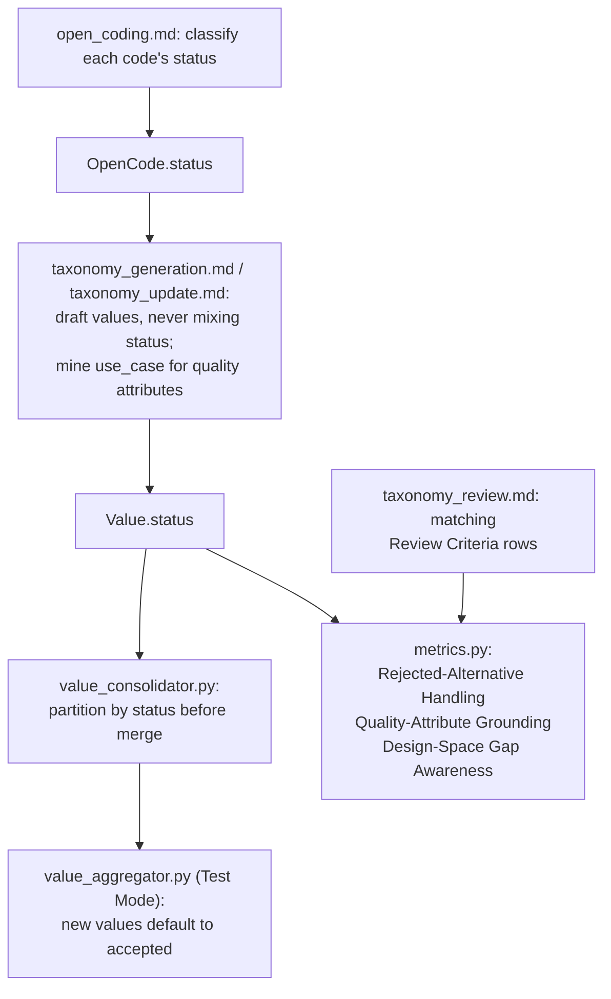

# Design-Space Quality Prompts and Evaluation Criteria - Plan

## Goal Capsule

- **Objective:** Make the taxonomy-generation prompts track decision status (accepted / rejected / outcome) and anchor dimensions to quality attributes implied by the use case, and add matching software-architecture-specific GEval evaluation criteria — without introducing hierarchy.
- **Authority hierarchy:** This plan's Requirements and Key Technical Decisions are authoritative. Where silent, follow existing codebase conventions: the `Relation.type: Literal[...]` field pattern, the "one GEval metric per Review Criteria row" contract already stated in `metrics.py`'s module docstring, and the `.get(key, default)` backward-compatibility pattern used throughout `utils.py`.
- **Stop conditions:** A genuine conflict with the flat-taxonomy constraint (no dimension may gain sub-dimensions), or a discovery that `graph.py`'s `evaluate_taxonomy` wiring itself needs to change. Both are out of scope — stop and report rather than expanding scope.
- **Execution profile:** Incremental commits per implementation unit, on the current branch.
- **Tail ownership:** The implementer records the before/after evaluation scores from Unit 7's live rerun in the PR description.

---

## Product Contract

### Summary

Add a schema-level decision-status field to open codes and values, thread it through open coding, axial coding, and value consolidation so rejected alternatives are never merged into or scored alongside adopted ones, and anchor generated dimensions to quality attributes implied by the use case. Add three new software-architecture-specific GEval evaluation criteria that check these same properties. The taxonomy stays flat — dimension to value, two levels only.

### Problem Frame

A live run on `examples/cursor-git-at-scale` (a discursive, non-atomized corpus) scored 0.3/1.0 on the existing Orthogonality criterion. The judge's rationale named two causes. First: a dimension's value list mixed an adopted alternative ("Write-ahead-log-based continuity") with several values labeled "Rejected: ..." as if they were peer positions on the same axis — nothing in the schema or prompts distinguishes a decision a source document adopted from one it explicitly declined, so `open_coding.md` extracts undifferentiated codes and `value_consolidator.py`'s embedding-distance merge step can and does collapse them together. This plan fixes that cause. Second, and separately: the judge also flagged semantic overlap between two whole dimensions on the "consistency/correctness" axis — a distinct problem this plan does not address (see Unit 7's verification note). Separately from both, dimensions are found purely bottom-up from data variation; the use case is only ever a late relevance filter, never mined up front for the quality attributes it implies (e.g. a use case naming GDPR/ISO 27001 should push the model to look for a compliance-handling dimension, not wait for it to surface by chance in a sampled minibatch).

### Requirements

**Decision-status capture and propagation**

- R1. `OpenCode` and `Value` (`src/taxonomy_generator/schemas.py`) gain a `status` field with values `accepted`, `rejected`, `outcome`, classifying whether the source content adopted the decision, explicitly declined it, or merely reported it as a trade-off/outcome rather than a decision.
- R2. `open_coding.md` instructs the model to classify every extracted code's status from the document's own framing.
- R3. `taxonomy_generation.md` and `taxonomy_update.md` instruct the model to never group codes or values of different status into one `Value`, and to record status when drafting or updating values. `taxonomy_review.md` instructs the model to preserve each existing value's status verbatim unless a review adjustment genuinely reclassifies it.
- R4. `value_consolidator.py` partitions each dimension's values by status before computing merge distances, so neither the automatic threshold merge nor the LLM-adjudicated borderline merge ever combines values of different status. The consolidated value's `status` is preserved.
- R5. `value_aggregator.py`'s manually constructed new-value dicts (Test Mode's new-value append path) include `status`, defaulted to `accepted`.
- R6. A `Value` loaded from a taxonomy JSON saved before this change (no `status` key) is treated as `accepted` everywhere status is read, without migrating the file.

**Quality-attribute anchoring**

- R7. `taxonomy_generation.md` and `taxonomy_update.md` instruct the model to first identify the quality attributes, constraints, or concerns the use case implies, then check candidate and existing dimensions against that list before finalizing.
- R8. `taxonomy_review.md`'s Review Criteria table gains a row checking whether each dimension is grounded in a recognizable quality attribute or trade-off, mirroring the matching evaluation criterion (R9).

**New evaluation criteria**

- R9. `src/taxonomy_generator/evaluation/metrics.py` gains three criteria — Quality-Attribute Grounding, Rejected-Alternative Handling, Design-Space Gap Awareness — built the same way as the existing `STRUCTURAL_CRITERIA`/`COVERAGE_CRITERION` entries.
- R10. `taxonomy_review.md` gains Review Criteria rows for Rejected-Alternative Handling and Design-Space Gap Awareness, matching R9 (Quality-Attribute Grounding's row is R8).

**Constraint**

- R11. The taxonomy stays flat. No requirement in this plan introduces a dimension with sub-dimensions or any nesting beyond dimension → value.

### Key Decisions

- **Decision status is a schema field, not prompt-only free text.** `(session-settled: user-directed — chosen over prompt-only guidance: a structured field lets `value_consolidator.py` and the evaluation criteria act on status deterministically; free text can't be reliably filtered or merged on)`. Governs R1–R6.
- **Quality attributes are auto-mined from the `use_case` string, no new config field.** `(session-settled: user-directed — chosen over an explicit config.quality_attributes list: works for any input without a new user-facing surface, matching the confirmed goal that the design must serve both pre-atomized decision corpora and discursive narrative corpora)`. Governs R7–R8.
- **New evaluation criteria: Rejected-Alternative Handling, Quality-Attribute Grounding, Design-Space Gap Awareness.** `(session-settled: user-directed — chosen over also adding Decision Traceability / Rationale Groundedness, which was proposed with equal rationale but not selected)`. Governs R9–R10.
- **Work continues on the current branch, `feat/taxonomy-evaluation-feedback-integration`.** `(session-settled: user-directed — chosen over a new branch)`.
- **The taxonomy stays flat.** `(session-settled: user-directed — chosen over introducing Shaw's choice/substructure hierarchy, to keep this change bounded)`. Governs R11.

### Scope Boundaries

- Outside this plan: any hierarchical or nested taxonomy structure; changes to `graph.py`'s `evaluate_taxonomy`/`evaluate_taxonomy_final` call sites or routing (already correctly wired by a prior plan — this work only adds criteria to the existing metrics list).
- Deferred to Follow-Up Work: surfacing decision status in the human-facing Grounded Theory Report or unified HTML report catalog (see KTD8); adding a Decision Traceability / Rationale Groundedness evaluation criterion, using the same pattern this plan establishes (KTD4) if it's wanted later.

---

## Risks & Dependencies

- **Design-Space Gap Awareness reliability is unproven.** Judging an absence is harder for an LLM judge than judging presence — early scores may be noisy. Mitigation: treat first-run scores as calibration data (see Assumptions), not a release gate; every GEval `threshold` in this codebase is already display-only, so a noisy score does not block a run.
- **Value counts may grow on existing corpora.** Status-partitioning (U4) stops the merge that previously collapsed an `accepted` and a `rejected` near-duplicate into one value — some dimensions will now show more values than before. This is the fix working as intended, not a regression; call it out during review so it isn't mistaken for one.
- **Prompt length and instruction salience.** U2 and U3 add new instructions to already-long system prompts. Mitigation: keep additions to short, example-anchored bullets matching each file's existing style (see each unit's Approach), not new prose sections.
- **Dependency: `deepeval`'s `GEval` judge model.** U6's new criteria reuse the existing `OpenAIModel(temperature=1.0)` construction in `metrics.py` (already fixed for reasoning-tier models — see `docs/solutions/integration-issues/deepeval-geval-temperature-unsupported-on-newer-openai-models.md`). No new dependency; any future judge-model change must preserve that fix.

---

## Planning Contract

### Key Technical Decisions

- KTD1. **Status enum values are `accepted` / `rejected` / `outcome`.** The first two reuse established ADR/MADR vocabulary (Nygard's ADR `Status` field; MADR's `proposed | rejected | accepted | deprecated | superseded`) rather than inventing new terms. `outcome` is added because source documents here are narrative/mixed, not ADRs themselves, and often report a trade-off or outcome without it being a decision at all — established ADR formats handle that case structurally (a separate "Consequences" section), which doesn't fit this pipeline's per-code/per-value granularity. Named `outcome`, not `consequence`, to avoid colliding with the existing `Relation.type` value `consequence` (a dimension-to-dimension link, a different concept) that the model emits in the same structured-output call.
- KTD2. **Status is enforced deterministically in `value_consolidator.py`, not left to prompt discipline alone.** The original 0.3 Orthogonality failure occurred in the embedding-distance union-find step, which is code, not a prompt — so the fix belongs there too (R4), even though R3 also asks the prompts to avoid mixing status.
- KTD3. **`value_consolidator.py` partitions by status, then reuses the existing merge algorithm per partition.** Split each dimension's `dim_values` into per-status sub-lists before computing `dist_matrix`; run the existing threshold-merge / borderline-LLM-adjudication / `_merge_group` sequence independently per sub-list; concatenate the resulting values across sub-lists and renumber `id` as `<dimension_id>.<n>` once, across the whole dimension. This reuses the existing algorithm rather than writing a parallel one.
- KTD4. **New evaluation criteria are authored as `taxonomy_review.md` rows first, then ported into `metrics.py`.** Preserves the existing 1:1 "one GEval metric per Review Criteria row" contract stated in `metrics.py`'s own module docstring, so generation-time review guidance and evaluation-time scoring stay aligned on the same standard.
- KTD5. **Design-Space Gap Awareness is `needs_documents=True`**, like `COVERAGE_CRITERION`. Judging an unaddressed value combination requires seeing what the document corpus does and doesn't contain — a judge with no documents can only guess at hypothetical gaps.
- KTD6. **Every status read uses `.get("status", "accepted")`, never a bare key lookup.** `utils.load_seed_taxonomy` performs no schema validation or migration on loaded JSON, so old taxonomy files are read as-is, never modified in place (R6).
- KTD7. **`labeler.md` and `dimension_selector.py` are left unchanged.** A document matching a `rejected`-status value is a legitimate label — a later document can also discuss and reject the same alternative. Dimension selection already filters whole dimensions by use-case relevance regardless of the status mix of their values. Neither needs status-aware logic for this plan's scope.
- KTD8. **Surfacing decision status in the Grounded Theory Report is deferred**, per Scope Boundaries. It needs the four-boundary change pattern documented in `docs/solutions/architecture-patterns/surface-langgraph-node-output-through-state-schema-to-cli-and-report.md` (`State`/`OutputState`, node return, `main.py`'s stream loop, `report_renderer.py`) — materially larger than this plan's confirmed scope.

### High-Level Technical Design

Status is assigned once, at open coding, and carried forward as data — every downstream consumer (axial coding, consolidation, evaluation) reads it rather than re-inferring it.

### Assumptions

- The exact wording of each new GEval criterion's judging instruction is decided during implementation (Unit 6), as a close paraphrase of its matching `taxonomy_review.md` row (KTD4) — not fixed in this plan.
- `Design-Space Gap Awareness`'s score reliability is unproven until Unit 7's live rerun; treat early scores as calibration data.

---

## Implementation Units

### U1. Schema: decision-status field on `OpenCode` and `Value`

- **Goal:** Add `status: Literal["accepted", "rejected", "outcome"]` to `OpenCode` (required) and `Value` (defaulted to `"accepted"`).
- **Requirements:** R1
- **Dependencies:** none
- **Files:** `src/taxonomy_generator/schemas.py`, `tests/unit_tests/test_schemas.py` (new)
- **Approach:**
  - Follow the existing `Relation.type: Literal[...]` pattern (`schemas.py`, `Relation` class) — same construction style, same `Field(description=...)` convention as every other field in the file.
  - `OpenCode.status` has no default: the model must always classify it.
  - `Value.status` defaults to `"accepted"`, so hand-built `Value` dicts elsewhere in the codebase don't need updating everywhere at once.
- **Test scenarios:**
  - Constructing an `OpenCode` without `status` raises a validation error.
  - Constructing a `Value` without `status` defaults to `"accepted"`.
  - Constructing either with `status="bogus"` raises a validation error.
- **Verification:** `python -c "import taxonomy_generator.schemas"` succeeds; new unit tests pass.

### U2. Prompt: open coding classifies status

- **Goal:** `open_coding.md` instructs the model to classify every extracted code's status from the document's own framing.
- **Requirements:** R2
- **Dependencies:** U1
- **Files:** `src/taxonomy_generator/prompts/open_coding.md`
- **Approach:**
  - Add a short "## Decision Status" subsection: define the three values, give one short example each, in the same style as the file's existing "Good open codes" examples.
  - State explicitly: classify from what the document says, not from what the analyst would choose — a document praising an alternative it did not adopt is still `rejected` if the document says so.
  - Per `docs/solutions/logic-errors/narrative-summary-includes-unscoped-explanation-text.md`'s lesson (a structured field and free prose describing the same scope need independent instructions): add one line stating `status` is authoritative for downstream filtering/merging; `rationale` still explains why, but must not contradict it.
- **Files (updated):** `src/taxonomy_generator/prompts/open_coding.md`, `tests/unit_tests/test_prompt_content.py` (new)
- **Test scenarios:**
  - Rendering `OPEN_CODING_PROMPT` with sample variables produces a system message containing the three status terms (`accepted`, `rejected`, `outcome`) and the authoritative-status instruction — a static assertion on the rendered template, not a live LLM call.
  - Live LLM behavior (does the model classify status correctly) is out of this unit's test scope; verified qualitatively via Unit 7's live smoke test.
- **Verification:** `python -c "import taxonomy_generator.prompts"` succeeds; the new static-rendering test passes.

### U3. Prompts: axial coding preserves status and mines quality attributes

- **Goal:** `taxonomy_generation.md` and `taxonomy_update.md` never merge codes/values of different status into one `Value`, and first identify quality attributes implied by the use case before drafting or updating dimensions.
- **Requirements:** R3, R7
- **Dependencies:** U1, U2
- **Files:** `src/taxonomy_generator/prompts/taxonomy_generation.md`, `src/taxonomy_generator/prompts/taxonomy_update.md`
- **Approach:**
  - In each file's "Design Space Framework" section, add one bullet on quality-attribute anchoring: before drafting/updating dimensions, name the quality attributes, constraints, or concerns the use case implies (performance, security, cost, compliance, maintainability, etc. as illustrative examples only, not an exhaustive fixed list), then check whether the data supports a dimension for each — even when that dimension isn't the most textually obvious grouping.
  - In each file's value-format instructions, state that a `Value` carries `status`, and that a value's supporting codes must share one status — near-duplicate codes of different status become two distinct values on the axis, never one merged value.
  - In `src/taxonomy_generator/prompts/__init__.py`'s inline Q2 human-message text for `TAXONOMY_GENERATION_PROMPT`/`TAXONOMY_UPDATE_PROMPT`, add one instruction to note when adopted/rejected alternatives were kept distinct, matching the existing "Include how you addressed any user feedback" instruction shape.
- **Files (updated):** `src/taxonomy_generator/prompts/taxonomy_generation.md`, `src/taxonomy_generator/prompts/taxonomy_update.md`, `src/taxonomy_generator/prompts/__init__.py`, `tests/unit_tests/test_prompt_content.py` (shared with U2)
- **Test scenarios:**
  - Rendering `TAXONOMY_GENERATION_PROMPT` and `TAXONOMY_UPDATE_PROMPT` with sample variables each produce a system message mentioning quality-attribute anchoring (e.g. the phrase "quality attributes") and the status-preservation instruction (a value's supporting codes must share one status) — static rendering assertions.
  - Live LLM behavior (does the model actually mine sensible quality attributes and avoid mixing status) is out of this unit's test scope; verified qualitatively via Unit 7's live smoke test against the recorded Orthogonality baseline.
- **Verification:** `python -c "import taxonomy_generator.prompts"` succeeds; the new static-rendering tests pass.

### U4. `value_consolidator.py` and `value_aggregator.py`: status-aware merging

- **Goal:** Guarantee in code that automatic and LLM-adjudicated value merging never combines values of different status, that a consolidated value's status is preserved, and that Test Mode's newly aggregated values carry a status.
- **Requirements:** R4, R5, R6
- **Dependencies:** U1
- **Files:** `src/taxonomy_generator/nodes/value_consolidator.py`, `src/taxonomy_generator/nodes/value_aggregator.py`, `tests/unit_tests/test_value_consolidator.py` (new), `tests/unit_tests/test_value_aggregator.py` (new)
- **Approach:**
  1. In `consolidate_values`'s per-dimension loop, before computing `dist_matrix`, partition `dim_values` into sub-lists keyed by `v.get("status", "accepted")`.
  2. Run the existing pairwise-distance / threshold-merge / borderline-LLM-adjudication / `_merge_group` sequence independently per sub-list.
  3. Concatenate the resulting values across sub-lists; renumber `id` as `<dimension_id>.<n>` once, across the whole dimension (not restarting per status group).
  4. In `_merge_group`, copy `status` into the `consolidated` dict from the canonical value (`canonical.get("status", "accepted")`) — partitioning guarantees every group member shares one status, so this is a direct copy.
  5. In `value_aggregator.py`'s manually constructed `new_value` dict, add `"status": "accepted"`.
  - Read `docs/solutions/architecture-patterns/surface-langgraph-node-output-through-state-schema-to-cli-and-report.md` before writing: two fields returned from the same node can have different list-nesting depth — verify `status`'s shape directly, don't assume it behaves like a neighboring field.
- **Test scenarios:**
  - Two values with the same status and distance below `epsilon` merge; the consolidated value's `status` matches theirs.
  - Two values with different status and distance below `epsilon` do NOT merge, even though they would have merged before status-partitioning.
  - A dimension with three values spanning all three status values, none within any merge/borderline threshold, produces three values retaining their original status, renumbered `<dim_id>.1`–`<dim_id>.3`.
  - Borderline pair adjudication (`VALUE_MERGE_PROMPT`) is only invoked for same-status pairs — a borderline-distance pair of different status is skipped without an LLM call.
  - `value_aggregator.py` appending a new value sets `status="accepted"`.
  - A value dict with no `status` key (legacy shape) is treated as `"accepted"` by the partition step, via `.get`, never a bare `["status"]` lookup.
- **Verification:** New unit tests pass. Running `consolidate_values` against a fixture with mixed-status near-duplicate values shows them un-merged.

### U5. `taxonomy_review.md`: new Review Criteria rows

- **Goal:** Add Review Criteria rows for Quality-Attribute Grounding and Rejected-Alternative Handling and Design-Space Gap Awareness, matching the criteria Unit 6 adds to `metrics.py`, and ensure the review step preserves each value's status instead of silently reverting it.
- **Requirements:** R3, R8, R10
- **Dependencies:** U3
- **Files:** `src/taxonomy_generator/prompts/taxonomy_review.md`
- **Approach:**
  - `taxonomy_review.md`'s "## Format" section currently documents only cluster-level fields (`id`, `name`, `description`) and says nothing about values. Add one line: preserve each existing value's `status` verbatim unless a review adjustment genuinely reclassifies it — never let the field silently default to `accepted` on re-emission.
  - Add three rows to the "## Review Criteria" table:
    - **Quality-attribute grounding** — does each dimension correspond to a recognizable quality attribute, constraint, or trade-off implied by the use case, rather than an arbitrary topical grouping?
    - **Rejected-alternative handling** — are `rejected`-status values kept distinct from `accepted` ones, never presented as equivalent peer values on the same axis?
    - **Design-space gap awareness** — given the existing dimensions and values, does the sampled data reveal an implied-but-unaddressed value combination the review sample suggests exists but no value currently names?
  - Add matching rows to "## Allowed Adjustments" only where the adjustment type is genuinely new (e.g. "Split value by status" — existing operations are dimension-level, not value-level); otherwise note the existing "Refine description" / "Rename" rows already cover it.
- **Files (updated):** `src/taxonomy_generator/prompts/taxonomy_review.md`, `tests/unit_tests/test_prompt_content.py` (shared with U2/U3)
- **Test scenarios:**
  - Rendering `TAXONOMY_REVIEW_PROMPT` with sample variables produces a system message whose Review Criteria table contains all three new row names (`Quality-attribute grounding`, `Rejected-alternative handling`, `Design-space gap awareness`) and the status-preservation instruction — a static rendering assertion.
  - Wording quality (does each row read as a faithful match to its Unit 6 criterion) is checked qualitatively via manual read-through, not a unit test.
  - Live LLM behavior (does review actually preserve status rather than reverting it) is out of this unit's test scope; verified qualitatively via Unit 7's live smoke test.
- **Verification:** `python -c "import taxonomy_generator.prompts"` succeeds; the new static-rendering test passes; manual read-through confirms each Unit 6 criterion matches its row here.

### U6. `metrics.py`: new GEval criteria

- **Goal:** Add three `Criterion` entries — Quality-Attribute Grounding, Rejected-Alternative Handling, Design-Space Gap Awareness — to `src/taxonomy_generator/evaluation/metrics.py`, wired into `build_metrics()`.
- **Requirements:** R9
- **Dependencies:** U5
- **Files:** `src/taxonomy_generator/evaluation/metrics.py`, `src/taxonomy_generator/evaluation/runner.py`, `tests/unit_tests/test_metrics.py` (new)
- **Approach:**
  - Add Quality-Attribute Grounding and Rejected-Alternative Handling to `STRUCTURAL_CRITERIA` — both judged against the taxonomy JSON and use case alone, same shape as the existing six.
  - Add Design-Space Gap Awareness as a second document-grounded criterion (`needs_documents=True`, KTD5), alongside `COVERAGE_CRITERION` as a new module-level constant. Extend `build_metrics()`'s `include_coverage`-gated append to also include it when documents are available — reuse the existing `include_coverage` flag unless implementation shows the two need to vary independently.
  - Word each `criteria` instruction as a close paraphrase of its matching `taxonomy_review.md` row (Unit 5), in the same "Determine whether..." style as the existing six criteria (KTD4).
  - `runner.py`'s no-document fallback currently re-adds only `COVERAGE_CRITERION` as an "evaluated: false" placeholder when `include_coverage` is `False` (R2 visibility). Generalize it to loop over every `needs_documents` criterion excluded from `build_metrics()`, so Design-Space Gap Awareness also shows "not evaluated" instead of disappearing from the scoreboard on document-less runs.
- **Test scenarios:**
  - `build_metrics(model=None, threshold=0.5, include_coverage=True)` returns all three new criteria by name, alongside the existing seven (six `STRUCTURAL_CRITERIA` plus `COVERAGE_CRITERION`).
  - `build_metrics(..., include_coverage=False)` omits both `Dimensional coverage` and `Design-space gap awareness` (document-grounded), but keeps `Quality-attribute grounding` and `Rejected-alternative handling` (structural).
  - Each new `GEval` instance's `_criterion` attribute round-trips to the correct `Criterion` object.
- **Verification:** New unit tests pass. `python -c "from taxonomy_generator.evaluation.metrics import build_metrics; print([c.name for c in build_metrics(None, 0.5, True)])"` lists all ten criteria names without error.

### U7. Backward compatibility and live verification

- **Goal:** Confirm existing saved taxonomy JSONs (no `status` key) still load and run correctly, and confirm the fix measurably changes the `cursor-git-at-scale` example's recorded Orthogonality regression.
- **Requirements:** R6, and end-to-end proof for R1–R10 together
- **Dependencies:** U1, U2, U3, U4, U5, U6
- **Files:** `tests/unit_tests/test_value_consolidator.py` (legacy-JSON fixture, may already exist from U4)
- **Approach:**
  1. Load one of the four checked-in example taxonomy JSONs (`examples/*/*_taxonomy_*.json`, saved before this change) as a seed; confirm `consolidate_values` and labeling do not raise on values missing `status`.
  2. Rerun `examples/cursor-git-at-scale` end to end via `scripts/run_examples_with_html_report.sh cursor-git-at-scale`; inspect the resulting taxonomy JSON's `evaluation.criteria` for the new criteria's scores, and confirm the previously conflated dimension ("State Evolution via Action Logs...") no longer lists a `rejected`-status value as an undistinguished peer of an `accepted` one.
- **Test scenarios:**
  - A legacy taxonomy JSON with values missing `status` loads and consolidates without a `KeyError`.
  - Live rerun of `examples/cursor-git-at-scale`: record the Rejected-Alternative Handling score and compare it against the prior Orthogonality baseline of 0.3 (`examples/cursor-git-at-scale/cursor-git-at-scale_taxonomy_20260905_225919.json`) — informal comparison, not a strict numeric gate. Note: the baseline's judge rationale named a second, unaddressed cause (cross-dimension consistency-axis overlap — see Problem Frame); if Orthogonality itself stays low after this rerun while Rejected-Alternative Handling scores well, that is expected — it does not mean this plan's fix failed.
- **Verification:** Unit test for legacy-JSON loading passes. Live rerun completes without error; its evaluation scoreboard is captured in the PR description for before/after comparison.

---

## Verification Contract

| Command | Purpose |
|---|---|
| `conda activate taxonomy && python -c "import taxonomy_generator.schemas"` | Schema module loads and validates |
| `conda activate taxonomy && python -c "import taxonomy_generator.prompts"` | All prompt templates load without error |
| `conda activate taxonomy && python -c "from taxonomy_generator.graph import graph; print(sorted(graph.get_graph().nodes.keys()))"` | Graph still compiles; wiring unchanged |
| `conda activate taxonomy && pytest tests/unit_tests/test_schemas.py tests/unit_tests/test_value_consolidator.py tests/unit_tests/test_value_aggregator.py tests/unit_tests/test_metrics.py tests/unit_tests/test_prompt_content.py -v` | New unit tests pass |
| `conda activate taxonomy && pytest tests/unit_tests/ -v` | Full existing suite still passes (no regression) |
| `ruff check src/taxonomy_generator/` | Lint — apply only safe fixes (`ruff check --fix`, never `--unsafe-fixes`) |
| `bash scripts/run_examples_with_html_report.sh cursor-git-at-scale` | Live end-to-end rerun; produces the evaluation scoreboard for Unit 7's before/after comparison |

## Definition of Done

- Requirements R1–R11 are implemented and traceable to their owning unit.
- All new and existing unit tests pass; `ruff check` shows no new violations.
- The graph still compiles and all prompt templates still load.
- Unit 7's live rerun of `cursor-git-at-scale` completes, and its evaluation scoreboard (including the three new criteria's scores) is recorded in the PR description alongside the pre-change baseline.
- No leftover debug output or throwaway fixtures outside version control; any fixture used for legacy-JSON testing is a checked-in test file.

---

## Sources / Research

- Mary Shaw, "The Role of Design Spaces," IEEE Software, Jan/Feb 2012 (`paper/ShawDesignSpace-a.pdf`) — the design-space framing this plan implements against.
- MADR (Markdown Architecture Decision Records), [adr.github.io/madr](https://adr.github.io/madr/) — status vocabulary (`proposed | rejected | accepted | deprecated | superseded`) informing KTD1.
- ISO/IEC 25010 quality characteristics, via [quality.arc42.org/standards/iso-25010](https://quality.arc42.org/standards/iso-25010) — informs the illustrative quality-attribute examples in R7/U3 (not encoded as a fixed list).
- `docs/solutions/architecture-patterns/surface-langgraph-node-output-through-state-schema-to-cli-and-report.md` — the four-boundary pattern behind KTD8's deferral, and the backward-compatibility pattern behind KTD6.
- `docs/solutions/architecture-patterns/taxonomy-evaluation-suite-scoreboard-and-consistency.md` — confirms `metrics.py`'s extension point and its "one GEval metric per row" contract (KTD4).
- `docs/solutions/logic-errors/narrative-summary-includes-unscoped-explanation-text.md` — the structured-field-vs-free-prose lesson behind U2's authoritative-status instruction.
- `examples/cursor-git-at-scale/cursor-git-at-scale_taxonomy_20260905_225919.json` — the recorded 0.3/1.0 Orthogonality baseline this plan targets.
