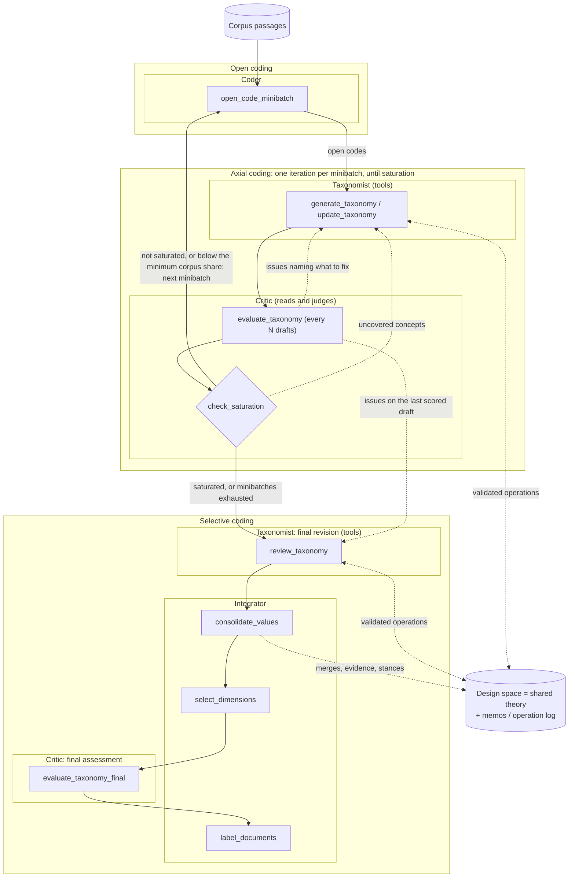

# Tool-Based Taxonomy Updates - Plan

## Goal Capsule

- **Objective:** replace the full-taxonomy rewrite in `update_taxonomy` (and `review_taxonomy`) with a
  tool-using agent that edits the stored taxonomy through a fixed set of coding operations
  (add, move, merge, split, rename, relate, remove), applied and validated by code.
- **Why:** the full rewrite does not scale. Once a draft reaches about 200–280 values, the model returns
  a compressed taxonomy and silently drops most values, even when the prompt forbids it (§1).
- **Contract kept:** the graph topology, the node names, and what the nodes return (`clusters`,
  `explanations`, `status`) stay the same, so every downstream node (saturation check, evaluation,
  consolidation, selection, labeling) works unchanged.
- **New output:** an **operation log** per iteration (which tool calls changed the taxonomy, with their
  justification), saved in the taxonomy JSON.
- **Branch:** implement on a separate branch from `feat/saner27-paper`; merge only after the comparison
  runs of §10 show no regression.

---

## The agentic model of the pipeline (storyline)

This plan is the step that turns Delve's central role, the **Taxonomist**, from a generator that
rewrites the theory into an **agent that acts on it**. This section places that change in the agentic
model of the whole pipeline and in grounded theory (Straussian, Strauss & Corbin), because that is the
story the paper tells.

### Framing: four agents around a shared theory

- **The orchestration is the method.** The LangGraph graph encodes the grounded-theory procedure: open
  coding → axial coding (repeated until saturation) → selective coding. Agents do not decide the
  procedure; each decides *how to carry out its part*. This is the "workflow vs. agent" distinction
  reviewers know: Delve is an **orchestrated multi-agent workflow**.
- **Agents are roles, not nodes.** An agent groups the consecutive nodes that share one responsibility
  and one **permission on the theory**; node names are implementation details (table below). Four roles
  cover the pipeline: the **Coder** writes codes, the **Taxonomist** edits the theory, the **Critic**
  only reads and judges it, and the **Integrator** consolidates, delimits and validates it.
- **The theory is a shared artifact (blackboard).** All agents work on one object, the emerging design
  space (decision points, candidate decisions, outcomes, relations, evidence), plus **memos** (iteration
  explanations and, with this plan, the operation log). Agents coordinate through the theory and through
  explicit **feedback channels** (Critic → Taxonomist: quality issues and uncovered concepts), not through
  free-form chat. External user feedback (`--feedback`) and the use case are inputs, not agents.
- **Generator–critic separation of duties.** In the axial-coding loop the Taxonomist proposes and the
  Critic judges; the Critic never edits the theory, and the Taxonomist never scores itself. This mirrors
  grounded theory's constant comparison until saturation.
- **Levels of autonomy**, stated honestly in the paper:
  1. **Tool-using agent:** the Taxonomist chooses operations, observes their results and iterates (this
     plan).
  2. **Judging and coding agents:** the Coder and the Critic make bounded decisions per call (codes,
     scores with reasons, saturation verdicts).
  3. **Instruments** inside the agents: deterministic procedures that keep them grounded (evidence
     linking, minimum-support and decision-point rules, saturation arithmetic, the operation executor).
     They make the agents' output auditable and are part of the contribution, not plumbing.

### Agents, responsibilities and grounded-theory phases

Phases follow Strauss & Corbin: **open coding** (concepts from incidents), **axial coding** (categories,
their properties and relations, by constant comparison, until saturation) and **selective coding**
(integrating, refining and validating the theory against the data).

| Agent | GT phase | Responsibility | Permission on the theory | Acts through | LangGraph nodes |
|---|---|---|---|---|---|
| **Coder** | Open coding | Break each passage into incidents and name concepts as codes (label, rationale), with how the source stands toward each: adopted, rejected, or an outcome | Writes codes; never touches the theory | Structured output per passage | `open_code_minibatch` (after the data steps `load_corpus`, `summarize`, `get_minibatches`) |
| **Taxonomist** | Axial coding; final revision opens selective coding | Fold each batch's codes into the theory by constant comparison: attach evidence or add candidate decisions, open, split, merge, move, rename and relate decision points; justify every change. Final revision on a fresh sample, guided by the Critic's issues | **Edits** the theory, only through validated operations (memo per operation) | **Tools** (this plan) | `generate_taxonomy` (first draft), `update_taxonomy`, `review_taxonomy` |
| **Critic** | Axial coding (judges every N drafts, decides saturation); final assessment | Score drafts against design-space criteria and return actionable issues; test each new batch against the theory as it was before that batch, report uncovered concepts, decide when to stop (with the minimum corpus share); score the final view | **Reads and judges only** | Judge per criterion with fixed steps; saturation judgment + coverage arithmetic | `evaluate_taxonomy`, `check_saturation` (+ routing `should_review`), `evaluate_taxonomy_final` |
| **Integrator** | Selective coding | Integrate (merge duplicate decision points and candidate decisions, link every code to the decision it supports, record stances accepted / rejected / mixed, drop what no evidence supports); delimit the theory to the study's question (scope, ≥ 2 sources, ≥ 2 candidate decisions, with recorded reasons); validate it against the data by placing every passage | Consolidates and delimits through deterministic rules and bounded judgments; never invents content | Instruments + merge judges + selection and labeling calls | `consolidate_values`, `select_dimensions`, `label_documents` |

### Workflow and agents



Solid arrows are the LangGraph control flow; dotted arrows are feedback channels and edits of the shared
theory. The Taxonomist and the Critic appear twice because their roles continue into selective coding
(final revision, final assessment).

### Coding operations = tools

The tools of §4 are the Taxonomist's coding operations, so the agent's actions read as grounded-theory
moves in the operation log:

| Grounded-theory move | Tool(s) |
|---|---|
| Constant comparison: incident fits an existing property | `add_evidence` |
| Constant comparison: incident is a new property of a category | `add_value` |
| Open a new category | `add_dimension` |
| Differentiate a category that bundles several phenomena | `split_dimension` |
| Integrate categories / properties that are the same | `merge_dimensions`, `merge_values` |
| Relocate a property to the category it belongs to | `move_value` |
| Revise names and definitions as understanding grows | `rename_dimension`, `relabel_value` |
| Relate categories (paradigm model: conditions, actions, consequences) | `add_relation`, `remove_relation` |
| Reclassify a stance on new evidence | `set_status` |
| Memo | the `reason` of every call, and `finish(explanation)` |

The constraints the executor enforces are the method's rules made explicit: a split must leave every
part with at least two candidate decisions (a category needs variation), evidence-backed properties
cannot be deleted during coding (data is never discarded silently), merges need a stated shared question.

### What this gives the paper's story

- **One sentence:** Delve operationalizes Straussian grounded theory as four agents around a shared
  theory: a Coder open-codes the data; a tool-using Taxonomist performs axial coding through explicit
  coding operations while a Critic judges each draft and decides when the theory is saturated; and an
  Integrator consolidates, delimits and validates the theory, with deterministic instruments keeping every
  claim tied to its evidence.
- **Figure:** the workflow diagram above (agents grouped by grounded-theory phase: open, axial, selective
  coding), redrawn for the paper.
- **Audit trail:** the operation log shows, per batch, which incidents changed which category and why;
  a short excerpt makes the agentic behaviour concrete (e.g. "split *Replica Strategy* into
  *Replica Coordination* and *Mutation Ordering* — judge issue: two questions").
- **Evidence for each role, per mechanism:** an agent bundles several mechanisms, so ablations are per
  mechanism, not per agent (paper plan RQ3): the Critic without quality feedback, the Critic without the
  saturation critic's uncovered concepts, the Taxonomist without its final revision, rewrite vs. tools for
  the Taxonomist (this plan's comparison runs, §10), the Integrator without dimension merging or evidence
  linking. The framing is shown, not asserted.
- **Terminology caution:** grounded theory's *dimension* (a range of variation of a property) is not the
  design-space *dimension* (a decision point); the paper's terminology box (paper plan §4.2.4) states it.

---

## 1. Problem (evidence)

Each `update_taxonomy` call re-outputs the whole taxonomy as structured JSON (`TaxonomyOutput`). Its
output therefore grows with the taxonomy, and past a certain size the model compresses it.

| Run | Values per iteration (dimensions) | Collapse |
|---|---|---|
| C2, 2026-10-02 21:16 | 61 → 146 → 213 → **46** → 99 → 158 → 213 → 282 → **59** → 59 → 58 | iteration 9 dropped 223 of 282 values while its explanation says "preserved all existing dimensions and values" |
| C1, 2026-10-02 18:55 | 55 → 129 → 221 → 150 → 201 → **83** → 154 → **97** → 155 → 111 → … | iteration 6 replaced 20 of 23 dimensions; dimension counts oscillated 23 → 13 → 22 → 12 |

Mitigations already in place (hiding document ids from the prompt, carrying evidence over by label,
"carry the taxonomy forward" rules) shortened the output but did not stop the collapse. Values lost in the
loop cannot be recovered later: evidence linking only attaches codes to values that still exist. In the
C2 run, the selected design space kept about 45 candidate decisions, against 62 options in the ground
truth.

**Evidence from ground-truth scoring (added 2026-10-04).** The matcher (`python main.py --match-gt`) scored
the selected views of the same runs against the expert design spaces (judge `gpt-5.6-luna`; details in
`docs/paper/SANER2027_PAPER_PLAN.md` §8.7):
- **Recall:** C2 recovers only 40% of the experts' options (C1: 55-65%).
- **Whole decisions lost:** two C2 decisions keep none of their options (safe exploration 0/3, false-alarm
  control 0/4), and two keep almost none (automated response 1/9, hacking mitigation 2/10).
- **Thin selected view:** it holds 36 candidate values. This is the pattern a collapsing rewrite produces:
  whole branches of the design space vanish in one update and are not rebuilt.

The A10 stage funnel should confirm that these options were open-coded and then lost in the loop, rather
than never coded. If so, this plan is the fix to test, re-scored with the same evaluation frame and judge.

Alternatives considered (see the conversation of 2026-10-02): restoring dropped values after each update
(a safety net, not a fix), detect-and-retry, a more compact output (delays the ceiling), per-dimension
updates, and value-free loops (values formed after the loop). Updates as operations remove the cause at
moderate cost; tools add immediate validation and the agentic framing.

---

## 2. Design overview

```
update_taxonomy node (unchanged signature)
  ├─ build context: compact taxonomy view + new batch's open codes + feedback
  ├─ TaxonomyEditor(previous taxonomy)            # Python object, owns the working copy
  ├─ tool loop (≤ max_steps turns):
  │     model.bind_tools(TOOLS, parallel_tool_calls=True)
  │     → AIMessage with tool calls
  │     → editor executes each call, returns ToolMessage ("ok: …" | "error: …")
  │     → until finish(explanation) or max_steps
  ├─ editor.result() → clusters (ensure_unique_ids, consistency checks)
  └─ return {"clusters": [clusters], "explanations": [...], "operation_log": [...], "status": [...]}
```

- The **taxonomy lives in Python** (`TaxonomyEditor`), never in the model's output. The model only
  references ids and supplies new text.
- **Every call is validated** before it is applied; an invalid call changes nothing and returns a precise
  error so the model can correct itself in the next turn.
- **Parallel tool calls** let the model issue many operations in one turn; a typical update needs 1–3
  turns.
- The loop is written by hand inside the node (not LangGraph's prebuilt ReAct agent) to control the step
  limit, parallel-call ordering, logging and fallback precisely. It can later become a subgraph if
  tracing per turn is wanted.

---

## 3. Context given to the model

The prompt keeps the current structure (use case, design-space framework, operations, feedback), with two
changes:

1. **Compact taxonomy view** instead of the full JSON: per dimension `id`, `name`, `description` and its
   relations; per value `id`, `label`, `status`. No value descriptions and no provenance fields
   (`supporting_doc_ids`, `stances`, `evidence`, `merged_from`). Example:

   ```
   [3] Drift Detection Test — Which test detects production degradation? (constrains → 5)
       3.1 CUSUM test (accepted) · 3.2 KS test (rejected) · 3.3 Covariance-weighted mean test (accepted)
   ```

2. **New batch:** the open codes of the minibatch, grouped by document (as today), each with `doc_id`,
   label, rationale and status.

Instructions replace "output the taxonomy" with: "change the taxonomy only by calling the tools; use
parallel calls; every new open code must end up as evidence of a value (`add_value` or `add_evidence`)
or be judged irrelevant to the use case; call `finish` with an explanation when done".

Optional read tools (`get_value`, `get_dimension`) return descriptions on demand if the compact view is
not enough; not needed in the first version.

---

## 4. Tools

All ids are the taxonomy's own (`"3"`, `"3.2"`). Every mutating tool takes a short `reason` (logged;
used as the memo of the change). Errors are returned as text, never raised to the model.

### 4.1 Values

| Tool | Arguments | Effect | Validation |
|---|---|---|---|
| `add_value` | `dimension_id, label, description, status, doc_ids, reason` | New value with the next free id `<dim>.<n>` | dimension exists; status ∈ {accepted, rejected, outcome}; doc_ids ⊆ batch documents; label not a duplicate in that dimension (else error suggesting `add_evidence`) |
| `add_evidence` | `value_id, doc_ids, reason` | Union of supporting documents | value exists; doc_ids ⊆ batch documents |
| `move_value` | `value_id, to_dimension_id, reason` | Moves the value (new id in the target dimension; old id recorded as an alias for later calls in the same update) | both exist; different dimensions |
| `merge_values` | `value_ids, label, description, reason` | One value in the dimension of the first id; union of documents; `merged_from` recorded | ≥ 2 values, same dimension, same status group (candidate vs outcome) |
| `relabel_value` | `value_id, label, description?, reason` | Rewrites label (and description) | value exists; no duplicate label in the dimension |
| `set_status` | `value_id, status, reason` | Changes status | review only, or when the batch contains direct evidence (doc ids in `reason`) |
| `remove_value` | `value_id, reason` | Removes the value | **blocked if the value has supporting documents** (decision D1) |

### 4.2 Dimensions

| Tool | Arguments | Effect | Validation |
|---|---|---|---|
| `add_dimension` | `name, description, reason` | New empty dimension with the next free id; values are added with `add_value`/`move_value` | name not a duplicate |
| `rename_dimension` | `dimension_id, name, description?, reason` | Rewrites name/description | exists; no duplicate name |
| `split_dimension` | `dimension_id, parts: [{name, description, value_ids}], reason` | Replaces the dimension by the parts; every value must be assigned to exactly one part; relations copied to every part | all values covered once; ≥ 2 parts; each part keeps ≥ 2 candidate decisions **or** the call is rejected with the "move values instead" rule |
| `merge_dimensions` | `dimension_ids, name, description, reason` | One dimension with all values and relations (deduplicated) | ≥ 2 dimensions; reason must state the shared question (prompt rule: merge only dimensions that ask the same question) |
| `remove_dimension` | `dimension_id, reason` | Removes it | **blocked unless it has no values** (move them first) |

### 4.3 Relations and control

| Tool | Arguments | Effect | Validation |
|---|---|---|---|
| `add_relation` | `source_id, target_id, type, rationale` | Adds a typed relation | both exist; type ∈ allowed types; no duplicate |
| `remove_relation` | `source_id, target_id, reason` | Removes it | exists |
| `finish` | `explanation` | Ends the loop; the explanation becomes the iteration's explanation | — |

### 4.4 Order within a turn

Parallel calls of one turn are applied **in the order returned**. A call that depends on another call of
the same turn (e.g. `add_value` into a dimension created by `add_dimension` in the same turn) cannot know
the new id; the prompt says to create dimensions in one turn and fill them in the next, and the
`add_dimension` result message returns the new id. Ids moved or merged within an update are kept as
aliases until the update ends, so later calls with the old id still resolve.

---

## 5. The executor (`TaxonomyEditor`)

- New module `src/taxonomy_generator/taxonomy_editor.py`: a class holding a deep copy of the previous
  clusters plus the batch's document ids, with one method per tool, each returning `(ok: bool,
  message: str)` and appending to `self.log`.
- **Consistency checks at the end** (`result()`): unique ids (`ensure_unique_ids`), relations pointing to
  existing dimensions only (dangling ones dropped and logged), no empty dimensions created in this update
  left empty (dropped and logged), every value's `dimension_id` equal to its dimension.
- **Coverage check:** open codes of the batch whose document is cited by no value are reported in the
  log as `uncited` (not an error; the Critic's saturation check and evidence linking deal with them).
- Pure Python, no LLM: fully unit-testable.
- `carry_over_evidence` becomes unnecessary for the tool path (values keep their documents because the
  model never re-emits them); it stays for the legacy path.

---

## 6. The loop

```python
async def run_tool_update(model, editor, messages, max_steps) -> (clusters, explanation, log):
    bound = model.bind_tools(TOOLS, parallel_tool_calls=True)
    for step in range(max_steps):
        ai = await bound.ainvoke(messages)
        messages.append(ai)
        if not ai.tool_calls:
            break                                   # no tools: treated as "nothing to change"
        for call in ai.tool_calls:
            ok, msg = editor.apply(call["name"], call["args"])
            messages.append(ToolMessage(msg, tool_call_id=call["id"]))
        if editor.finished:
            break
    return editor.result(), editor.explanation or _fallback_explanation(editor), editor.log
```

- **Step limit** `max_steps` (default 8). Operations already applied are kept when the limit is hit
  (decision D3); the explanation is then generated from the log.
- **Token use:** each turn re-sends the conversation. With a compact view (C2's 282 values ≈ 6–8k
  tokens) and 1–3 turns, an update costs less than today's full rewrite (which re-sends and re-writes
  everything).
- **Model:** `configuration.model` (as today), via `load_chat_model(...).bind_tools`. Check that the
  configured OpenAI model supports parallel tool calls; if not, set `parallel_tool_calls=False` and
  raise `max_steps`.

---

## 7. Integration

| Place | Change |
|---|---|
| `nodes/taxonomy_updater.py` | Branch on `configuration.taxonomy_edit_mode`: `"tools"` → build context, `TaxonomyEditor`, `run_tool_update`; `"rewrite"` → today's chain |
| `nodes/taxonomy_reviewer.py` | Same branch (decision D2); review uses the same tools on the review sample's documents |
| `nodes/taxonomy_generator.py` | Unchanged: the first taxonomy is still generated in one call (small) |
| `utils.py` | `format_taxonomy_compact(clusters)`; shared message building; keep `invoke_taxonomy_chain` for the rewrite path |
| `prompts/` | `taxonomy_update_tools.md`, `taxonomy_review_tools.md` (framework and rules from the current prompts; output section replaced by tool instructions) |
| `state.py` | `operation_log: Annotated[List[Dict], operator.add]` (one entry per iteration: `{"iteration", "node", "operations": [...], "rejected": [...], "uncited_codes": [...]}`) |
| `main.py` | Accumulate and save `operation_log` in the taxonomy JSON (next to `iterations`); optional terminal summary (operations per iteration) |
| `report_renderer.py` / `html_report.py` | Optional later: an "Evolution" section listing operations per iteration (memo trail) |
| `settings.py`, `configuration.py`, YAML | `taxonomy.edit_mode: "rewrite" \| "tools"` (default `"rewrite"` until validated), `taxonomy.edit_max_steps: 8` |

### Interactions with existing features

- **Evaluation feedback:** unchanged channel (`{feedback}`); the judge already proposes split, merge,
  move, rename and drop, which map one-to-one to tools. The reason step's "never ask to add" rule for
  structural criteria stays.
- **Saturation check:** unchanged (compares the batch's codes with `clusters[-2]`).
- **Consolidation, evidence linking, dropping unsupported values, dimension merging, selection:**
  unchanged; they now receive taxonomies that kept every value.
- **Test mode:** unaffected (no updates).
- **Seeded train runs:** work as before (the seed is `clusters[0]`).

---

## 8. Decisions to make before building

| # | Question | Recommendation |
|---|---|---|
| D1 | Allow removals during the loop? | Allow `remove_value` only for values **without** supporting documents and `remove_dimension` only for **empty** dimensions, each with a logged reason. Everything with evidence is removed only after the loop by the deterministic steps |
| D2 | Use the tools in `review_taxonomy` too? | Yes: the review is the Taxonomist's final revision (same agent, same tools); same failure mode (full rewrite), and it is where evaluation feedback is most often applied |
| D3 | Fallback when the model calls no tools or hits `max_steps` | Keep the operations applied so far; log a warning; no retry |
| D4 | Default mode | `rewrite` until §10's comparison passes, then `tools` for C1/C2 configs |
| D5 | Read tools (`get_value`, `get_dimension`) | Not in the first version; add if the compact view proves insufficient |

---

## 9. Tests (no API calls)

- **Executor, per tool:** valid call applies the change and logs it; each validation rule returns an
  error and changes nothing (unknown id, duplicate label, merge across status groups, split that leaves
  a single candidate, removal of a supported value, removal of a non-empty dimension).
- **Aliases:** `move_value` then `add_evidence` with the old id in the same update resolves correctly.
- **Consistency checks:** dangling relations dropped; unique ids; `dimension_id` fields updated after
  moves and splits.
- **Loop:** a scripted fake chat model (LangChain `GenericFakeChatModel` / `FakeMessagesListChatModel`
  with predefined tool calls) covering: one turn of parallel calls + `finish`; an invalid call followed by
  a corrected call; no tool calls; hitting `max_steps`.
- **Node contract:** `update_taxonomy` in tools mode returns `clusters`, `explanations`, `status` and
  `operation_log` with the same shapes as the rewrite mode (existing node tests reused).
- **No value loss:** property-style test — after any sequence of valid operations except removals, every
  previous value id (or its alias) is present.

---

## 10. Validation runs (before switching the default)

Run C2 (and then C1) with `edit_mode: tools`, same config and seed as the rewrite runs of 2026-10-02:

| Measure | Rewrite (2026-10-02) | Target with tools |
|---|---|---|
| Values per iteration | collapses (282 → 59) | non-decreasing during the loop, except logged removals of unsupported values |
| Dimensions per iteration | oscillating (C1: 23 → 13 → 22 → 12) | changes only through logged operations |
| Candidate decisions in the selected view (C2) | ≈ 45 | closer to the ground truth's 62 options (not a target in itself) |
| Rejected tool calls | — | low share; recurring errors fixed in the prompt |
| Tokens and time | C2: 3.7M, 34 min; C1: 8.3M, 73 min | not higher |
| Final scoreboard | C2: 0.65 | not lower |

Then compare against the ground truth with the matching protocol once it exists (paper plan §5.1).

---

## 11. Risks

- **Tool-call reliability** of the configured model (wrong ids, missing `finish`): mitigated by
  validation messages, aliases, the step limit and the fallback.
- **Under-editing:** the model may call few tools and leave codes uncited. The `uncited_codes` log makes
  it visible; the prompt requires every code to be placed or judged irrelevant.
- **Duplicates accumulate** (the model adds a value instead of `add_evidence`): the duplicate-label check
  catches exact repeats; near-duplicates are merged after the loop by value consolidation, as today.
- **Prompt drift between the two modes:** the shared framework text should live in one place (a prompt
  fragment included by both prompt variants).
- **Deadline:** keep `rewrite` as the default until validated; the paper can describe whichever mode the
  reported runs used.

## 12. Paper angle

See "The agentic model of the pipeline (storyline)" at the top for the full agent model. In short:


Axial coding becomes a **tool-using agent that edits the theory through coding operations** (add,
differentiate = split, integrate = merge, relate, revise), each justified and logged. The operation log
is the memo trail of the analysis (plan P11): it shows how each batch and each evaluation issue changed
the design space, and it makes the agentic contribution concrete for the Agentic AI4SE track.

## 13. Effort

| Unit | Content | Effort |
|---|---|---|
| U1 | `TaxonomyEditor` with all tools, validation, aliases, consistency checks | 0.5–0.75 d |
| U2 | Tool schemas (Pydantic args), compact view, loop with fake-model tests | 0.5 d |
| U3 | Prompts (tool variants of update and review), node branching, settings | 0.25–0.5 d |
| U4 | Operation log in state, JSON, terminal summary | 0.25 d |
| U5 | Validation runs on C2 and C1, prompt fixes | 0.5 d + run time |

Total: about 2–2.5 days including validation.
