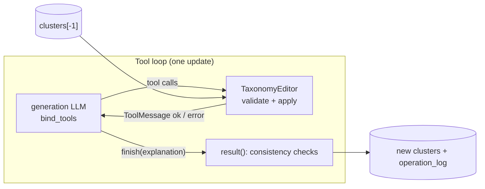

# feat: Tool-based taxonomy updates, switchable with the rewrite

**Branch:** `feat/tool-based-taxonomy-update` (from `main` after the ground-truth matcher merge).

---

## Goal Capsule

- **Objective:** add a second update strategy for the Taxonomist. In **tools** mode, `update_taxonomy` and
  `review_taxonomy` edit the stored taxonomy through validated coding operations (add, move, merge, split,
  rename, relate, remove) instead of re-emitting the whole taxonomy. The current full-taxonomy **rewrite**
  stays available and stays the default.
- **Switch:** `taxonomy.edit_mode: rewrite | tools`. The two modes are the paper's "rewrite vs. tools"
  ablation (paper plan §8.6b, RQ3).
- **Measurement:** an A10 stage funnel locates where expert options are lost (open codes → loop → review →
  consolidation → selection) and compares the two modes on the same frame and judge.
- **Contract kept:** graph topology, node names and node return shapes (`clusters`, `explanations`, `status`)
  are unchanged; downstream nodes work as before. Tools mode adds an **operation log**.
- **Authority:** this plan; the paper plan's evaluation frame (`benchmark/README.md`) for any scoring.
- **Stop and ask if:** the configured generation LLM cannot do tool calling at all, or the tools mode needs a
  change to the graph topology.
- **Deadline context:** paper freeze 10-09/10. Units U1–U5 are the build; U6 can run first on existing runs;
  U7 is the validation runs.

- **Outcome (2026-10-05):** built and compared on C2 (and checked on C1); `tools` is the main configuration
  of the C1/C2 study configs, with `relevance_selection: false`; `rewrite` and `rewrite_restore` remain
  ablations. Results: `docs/paper/results/2026-10-05-c2-update-strategy-comparison.md`. Added during
  execution beyond the units below: LangChain `StructuredTool`s with `tool.invoke`, tool transcripts in the
  operation log, the values-as-options rule and similar-value hints, the decision-point granularity rule and
  structural check, and the `taxonomy.relevance_selection` switch.

---

## Product Contract

### Problem

Each `update_taxonomy` call re-outputs the whole taxonomy as structured JSON (`TaxonomyOutput`). Its output
grows with the taxonomy, and past a certain size the model compresses it.

| Run | Values per iteration | Collapse |
|---|---|---|
| C2, 2026-10-02 21:16 | 61 → 146 → 213 → **46** → 99 → 158 → 213 → 282 → **59** → 59 → 58 | the update after 282 values dropped 223 of them while its explanation says "preserved all existing dimensions and values" |
| C1, 2026-10-02 18:55 | 55 → 129 → 221 → 150 → 201 → **83** → 154 → **97** → 155 → 111 → … | one update replaced 20 of 23 dimensions; dimension counts oscillated 23 → 13 → 22 → 12 |

Mitigations already in place (hiding document ids, carrying evidence over by label, "carry the taxonomy
forward" rules) shortened the output but did not stop the collapse. Values lost in the loop cannot be
recovered later: evidence linking only attaches codes to values that still exist.

**Evidence from ground-truth scoring (2026-10-04, judge `gpt-5.6-luna`, paper plan §8.7):** C2 recovers 40% of
the experts' options (C1: 55–65%); two C2 decisions keep none of their options (safe exploration 0/3,
false-alarm control 0/4) and two keep almost none (automated response 1/9, hacking mitigation 2/10); the
selected view holds 36 candidate values. This is the pattern a collapsing rewrite produces, but it is not yet
proven: the options might never have been open-coded. The stage funnel (U6) tests that rival.

Alternatives considered (2026-10-02): restoring dropped values after each update (a safety net, not a fix),
detect-and-retry, a more compact output (delays the ceiling), per-dimension updates, value-free loops.
Operations remove the cause at moderate cost, add immediate validation, and give the agentic framing.

### Requirements

- **R1.** A setting `taxonomy.edit_mode` selects `rewrite` (default, today's behavior, prompts byte-identical),
  `rewrite_restore` (rewrite plus restoring dropped evidence-backed values, KTD12) or `tools`, for both
  `update_taxonomy` and `review_taxonomy`.
- **R2.** In tools mode the model changes the taxonomy only through the tools of §Tools; the taxonomy lives
  in Python and is never re-emitted by the model.
- **R3.** Every tool call is validated before it is applied; an invalid call changes nothing and returns a
  precise error the model can act on.
- **R4.** No value with supporting documents is removed during the loop (decision D1); a value survives the
  update unless a logged operation moved, merged or removed it.
- **R5.** Tools-mode nodes return the same shapes as rewrite mode, so saturation, evaluation, consolidation,
  selection, labeling, biplots and the HTML report work unchanged.
- **R6.** Tools mode records an operation log per update and review (applied, rejected, uncited codes,
  explanation), saved in the taxonomy JSON.
- **R7.** Token use of the tool loop is counted in `run_metrics`, like the rewrite chain.
- **R8.** A stage funnel reports, per ground-truth option and view, its **loss stage** (the first stage judged
  absent after its last presence; unjudged stages are not losses) and counts options dropped and later recovered, using the matcher's serialization, judge and cache; it runs on any saved run of either mode.
- **R9.** C1/C2 study configs can switch modes without other changes; docs (SETTINGS, USAGE, CONCEPTS)
  describe the switch and the operation log.

### Scope boundaries

- `generate_taxonomy` (the first draft) stays a single structured call in both modes.
- Relation types stay the current four (`precondition`, `consequence`, `co_occurring`, `constrains`);
  the ADD vocabulary (P17) is future work.
- No read tools (`get_value`, `get_dimension`) in the first version (D5).
- No report section for the operation log yet (memo trail P11 is a later step); the JSON carries it.
- Switching the default to `tools` happens only after U7's comparison, as a separate decision.

### Success criteria

| Measure | Rewrite (2026-10-02) | Target with tools |
|---|---|---|
| Values per iteration (**invariant check**, holds by construction under KTD2; not a success measure) | collapses (282 → 59) | non-decreasing during the loop, except logged removals of unsupported values |
| Dimensions per iteration | oscillating (C1: 23 → 13 → 22 → 12) | changes only through logged operations |
| Candidate values in the selected view (C2) | 36 | closer to the ground truth's 62 options (not a target in itself) |
| C2 option recall, same frame and judge | 0.40 (paper view) | higher; reported whatever the result |
| C2 option precision, F1 and exact (`same`-only) recall, same frame and judge | 0.45 / 0.43 / 0.05 (paper view) | not lower than rewrite (guards against recall by flooding the view) |
| Rejected tool calls | — | low share; recurring errors fixed in the prompt |
| Tokens and time | C2: 3.7M, 34 min; C1: 8.3M, 73 min | not higher |
| Final scoreboard | C2: 0.65 | not lower |

---

## Planning Contract

### Key Technical Decisions

- **KTD1. Default stays `rewrite`.** (session-settled: user-directed — chosen over replacing the rewrite:
  the current strategy stays as an option and is the ablation baseline.) Switching the C1/C2 default is a
  later decision after U7.
- **KTD2. D1 removals:** `remove_value` only for values **without** supporting documents; `remove_dimension`
  only for **empty** dimensions. Evidence-backed content is removed only after the loop by the deterministic
  steps (consolidation, unsupported-value drop, selection).
- **KTD3. D2 review uses the tools too:** the review is the Taxonomist's final revision, has the same failure
  mode, and is where evaluation feedback is most often applied. It edits against the review sample's
  documents.
- **KTD4. D3 fallback:** when the model calls no tools, hits `edit_max_steps`, or a model call raises, the
  operations applied so far are kept, a warning is logged, and the explanation is generated from the log.
  With zero operations the previous taxonomy is returned unchanged. Tools mode never falls back to a rewrite.
- **KTD5. D5:** no read tools in the first version.
- **KTD6. Tools prompts are derived from the rewrite prompts at load time.** The tools variants of
  `taxonomy_update.md` and `taxonomy_review.md` are built by removing the output-oriented parts (the
  "Carry the taxonomy forward" and "Existing values are shown without their document ids" bullets and the
  `### Format` section) and inserting one shared tool-instructions fragment (`prompts/taxonomy_tools.md`).
  Chosen over two separate prompt files: one source of truth for the design-space framework, no drift, and
  the rewrite prompts stay byte-identical. The fragment restates the non-output rules the removed `### Format`
  sections carry: the name and description word limits (`{cluster_name_length}`,
  `{cluster_description_length}`), the dimension cap (`{max_num_clusters}`), evidence only on a value of the
  same status (a different status gets a new value), and, in review, statuses and labels kept unless an
  operation changes them. Markers are checked by tests so an edit to the rewrite prompt
  cannot silently break the derivation.
- **KTD7. A hand-written loop inside the node**, not LangGraph's prebuilt ReAct agent: precise step limit,
  ordering of parallel calls, logging and fallback. The loop passes the node's `RunnableConfig` to every
  model call so the run's callbacks (token tracker, tracing) see it (R7).
- **KTD8. Operation log in state:** `operation_log: Annotated[List[Dict], operator.add]` on **both**
  `State` and `OutputState`, and wired into `main.py` in three places (initialize, accumulate, serialize),
  per `docs/solutions/architecture-patterns/surface-langgraph-node-output-through-state-schema-to-cli-and-report.md`.
  Rewrite mode returns no log entry.
- **KTD9. The funnel is GT-anchored.** For recall only expert-side candidates matter: per expert option, the
  `k` nearest stage items (cosine, matcher serialization) are judged with the matcher's graded judge and
  cache; a hit is `same`/`broader`/`narrower`, as in the matcher. At the selected stage the funnel also
  reads the official match file, and reports agreement between the two, so the funnel's own candidate gate
  is calibrated against the scored result.
- **KTD10. Model:** `configuration.generation_llm` via `load_chat_model(...).bind_tools(...)`, with
  `parallel_tool_calls=True` when supported.
- **KTD11. `merge_values` requires identical status in the loop.** (session-settled: user-approved — chosen
  over merging within the candidate group with a derived status: the update prompt forbids grouping codes
  of different status, and value consolidation already owns stance-based merging and `mixed`.)
- **KTD12. A third ablation arm, "rewrite + restore".** (session-settled: user-approved — chosen over a
  two-arm comparison.) Rewrite mode with a deterministic step after each update that re-inserts any value
  with supporting documents that the rewrite dropped (by label/id, into its previous dimension), logged.
  It isolates the no-removal invariant (KTD2) from tool-based editing: the tools gain over this arm is the
  mechanism effect. Setting: `edit_mode: rewrite_restore`.
- **KTD13. Repeated runs.** (session-settled: user-approved — chosen over one run per mode.) At least 3
  seeds per mode on C2; report per-run spread with the means; a single pair is anecdotal.
- **KTD14. The funnel informs, it does not gate.** (session-settled: user-approved — chosen over gating
  U1–U5 on the funnel result; the user asked for tools mode as an option regardless.) U6 runs first on the
  2026-10-02 runs; its result is reported in the paper plan and shapes the paper's explanation, not the build.
- **KTD15. Funnel gate at the open-codes stage.** (session-settled: user-approved.) There `k` scales with
  the stage size (or every code within the matcher's upper distance threshold is judged); per stage the funnel
  reports options with **no judged candidate** as `unjudged`, not as lost; a small hand-checked sample
  (about 20 options) validates the open-codes gate before the funnel is used to accept or reject the rival.

### Design overview

```
update_taxonomy / review_taxonomy (unchanged signatures)
  ├─ edit_mode == "rewrite" → today's chain (invoke_taxonomy_chain)
  └─ edit_mode == "tools":
       ├─ context: compact taxonomy view + batch open codes + feedback (derived tools prompt)
       ├─ TaxonomyEditor(previous clusters, batch doc ids)
       ├─ tool loop (≤ edit_max_steps turns): model.bind_tools → tool calls
       │     → editor.apply each, in order → ToolMessage "ok: …" | "error: …"
       │     → until finish(explanation) / no calls / step limit / model error
       ├─ editor.result() → clusters (ensure_unique_ids, consistency checks)
       └─ return {"clusters": [clusters], "explanations": [...], "status": [...], "operation_log": [entry]}
```



### Context given to the model

1. **Compact taxonomy view** instead of the full JSON: per dimension `id`, `name`, `description` and its
   relations; per value `id`, `label`, `status`. No value descriptions, no provenance fields. Example:

   ```
   [3] Drift Detection Test — Which test detects production degradation? (constrains → 5)
       3.1 CUSUM test (accepted) · 3.2 KS test (rejected) · 3.3 Covariance-weighted mean test (accepted)
   ```

2. **New batch:** the open codes of the minibatch (or review sample), grouped by document as today
   (`format_open_codes_for_docs`), each with `doc_id`, label, rationale and status.

Instructions replace "output the taxonomy" with: change the taxonomy only by calling the tools; use parallel
calls; every new open code must end up as evidence of a value (`add_value` or `add_evidence`) or be judged
irrelevant to the use case; call `finish` with an explanation when done.

### Tools

All ids are the taxonomy's own (`"3"`, `"3.2"`). Every mutating tool takes a short `reason` (logged; the memo
of the change). Errors are returned as text, never raised to the model.

**Values**

| Tool | Arguments | Effect | Validation |
|---|---|---|---|
| `add_value` | `dimension_id, label, description, status, doc_ids, reason` | New value with the next free id `<dim>.<n>` | dimension exists; status ∈ {accepted, rejected, outcome}; doc_ids ⊆ batch documents; label not a duplicate in that dimension (else error suggesting `add_evidence`) |
| `add_evidence` | `value_id, doc_ids, reason` | Union of supporting documents | value exists; doc_ids ⊆ batch documents |
| `move_value` | `value_id, to_dimension_id, reason` | Moves the value (new id in the target; old id kept as an alias for this update) | both exist; different dimensions |
| `merge_values` | `value_ids, label, description, reason` | One value in the dimension of the first id, keeping the shared status; union of documents; `merged_from` recorded | ≥ 2 values, same dimension, **identical status** (cross-stance merging stays with value consolidation, KTD11) |
| `relabel_value` | `value_id, label, description?, reason` | Rewrites label (and description) | value exists; no duplicate label in the dimension |
| `set_status` | `value_id, status, reason` | Changes status | review, or when `reason` cites a batch document id |
| `remove_value` | `value_id, reason` | Removes the value | blocked if the value has supporting documents (KTD2) |

**Dimensions**

| Tool | Arguments | Effect | Validation |
|---|---|---|---|
| `add_dimension` | `name, description, reason` | New empty dimension with the next free id (returned in the message) | name not a duplicate |
| `rename_dimension` | `dimension_id, name, description?, reason` | Rewrites name/description | exists; no duplicate name |
| `split_dimension` | `dimension_id, parts: [{name, description, value_ids}], reason` | Replaces the dimension by the parts; relations copied to every part | every value assigned exactly once; ≥ 2 parts; each part keeps ≥ 2 candidate decisions, else rejected with the "move values instead" rule |
| `merge_dimensions` | `dimension_ids, name, description, reason` | One dimension with all values and relations (deduplicated) | ≥ 2 dimensions; reason states the shared question |
| `remove_dimension` | `dimension_id, reason` | Removes it | blocked unless it has no values (KTD2) |

**Relations and control**

| Tool | Arguments | Effect | Validation |
|---|---|---|---|
| `add_relation` | `source_id, target_id, type, rationale` | Adds a typed relation | both exist; type ∈ current `Relation.type`; no duplicate |
| `remove_relation` | `source_id, target_id, reason` | Removes it | exists |
| `finish` | `explanation` | Ends the loop; the explanation becomes the iteration's explanation | — |

**Order within a turn.** Parallel calls are applied in the order returned. A call cannot use an id created
by another call of the same turn; the prompt says to create dimensions in one turn and fill them in the next,
and `add_dimension` returns the new id. Moved or merged ids stay aliases until the update ends.

### Executor (`TaxonomyEditor`)

- A deep copy of the previous clusters plus the batch's document ids; one method per tool, each returning
  `(ok, message)` and appending to the log.
- **Consistency checks** in `result()`: unique ids (`ensure_unique_ids`); relations to missing dimensions
  dropped and logged; dimensions created in this update and left empty dropped and logged; every value's
  `dimension_id` equal to its dimension.
- **Coverage:** batch documents cited by no value are logged as `uncited` (not an error; saturation and
  evidence linking handle them).
- Pure Python, no LLM. `carry_over_evidence` is not used in tools mode (values keep their documents because
  the model never re-emits them); it stays for rewrite mode.

### Loop (directional sketch)

```
bound = model.bind_tools(TOOLS, parallel_tool_calls=True)
for step in range(edit_max_steps):
    ai = await bound.ainvoke(messages, config)       # node config → callbacks see the tokens
    messages.append(ai)
    if no tool calls and no invalid tool calls: break
    for call in ai.tool_calls (in order):
        ok, msg = editor.apply(call.name, call.args)
        messages.append(ToolMessage(msg, tool_call_id=call.id))
    for bad in ai.invalid_tool_calls:                  # unparsable arguments: answer them too, or the
        messages.append(ToolMessage("error: could not parse arguments: …", tool_call_id=bad.id))
        editor.log_rejected(bad)                       # next request fails (every tool_call_id needs a reply)
    if editor.finished: break
return editor.result(), editor.explanation or fallback_from_log(editor), editor.log
```

Step limit `edit_max_steps` (default 12; 8 until 2026-10-05, raised after smoke runs hit it). With a compact view (C2's 282 values ≈ 6–8k tokens) and 1–3 turns,
an update should cost less than today's rewrite.

### Integration

| Place | Change |
|---|---|
| `src/taxonomy_generator/nodes/taxonomy_updater.py`, `nodes/taxonomy_reviewer.py` | Branch on `configuration.edit_mode` |
| `src/taxonomy_generator/nodes/taxonomy_generator.py` | Unchanged |
| `src/taxonomy_generator/taxonomy_editor.py` (new) | `TaxonomyEditor` |
| `src/taxonomy_generator/tool_update.py` (new) | Tool argument schemas, `run_tool_update` loop, message building |
| `src/taxonomy_generator/utils.py` | `format_taxonomy_compact`; `invoke_taxonomy_chain` unchanged for rewrite |
| `src/taxonomy_generator/prompts/__init__.py`, `prompts/taxonomy_tools.md` (new) | Derived tools prompts (KTD6) |
| `src/taxonomy_generator/state.py` | `operation_log` on `State` and `OutputState` (KTD8) |
| `main.py` | Accumulate and save `operation_log`; one-line summary per update in tools mode |
| `src/taxonomy_generator/settings.py`, `configuration.py`, `config.yaml` | `taxonomy.edit_mode`, `taxonomy.edit_max_steps` |
| `src/taxonomy_generator/evaluation/stage_funnel.py` (new), `benchmark/stage_funnel.py` (new CLI) | A10 funnel |

**Interactions.** Evaluation feedback: same `{feedback}` channel; the judge's split/merge/move/rename/drop
issues map one-to-one to tools. Saturation check: unchanged (`clusters[-2]`). Consolidation, evidence linking,
unsupported-value drop, dimension merging, selection: unchanged. Test mode: unaffected (no updates). Seeded
train runs: as before (the seed is `clusters[0]`).

### Risks

- **Tool-call reliability** of the configured model (wrong ids, missing `finish`): validation messages,
  aliases, the step limit and KTD4.
- **Under-editing** (few calls, codes left uncited): the `uncited` log makes it visible; the prompt requires
  every code to be placed or judged irrelevant.
- **Duplicates accumulate** (`add_value` instead of `add_evidence`): exact repeats are rejected;
  near-duplicates are merged after the loop by value consolidation, as today.
- **Funnel judge cost and independence:** the funnel uses the configured matching LLM, which is currently also
  the generator; its numbers are diagnostic, not reported results, until A6.
- **Deadline:** keep `rewrite` the default until validated; the paper describes whichever mode the reported
  runs used.

### Implementation-time unknowns

- Whether `gpt-5.6-luna` accepts `parallel_tool_calls=True`; if the API rejects it, rebind without it once and
  raise the effective step budget.
- How the LangChain fake chat models in `langchain_core` 1.4 handle `bind_tools`; a minimal scripted fake
  that returns predefined `AIMessage` tool calls may be needed in tests.
- The exact mapping of the saved `iterations` entries to nodes (generate, updates, review, consolidation) for
  the funnel's stage labels; read it from the run structure (saturation history length, explanations).

---

## Implementation Units

### U1. TaxonomyEditor

**Goal:** the pure-Python executor of all tools with validation, aliases and consistency checks.

**Requirements:** R2, R3, R4.

**Dependencies:** none.

**Files:** `src/taxonomy_generator/taxonomy_editor.py` (new); `tests/unit_tests/test_taxonomy_editor.py` (new).

**Approach:**
1. Hold a deep copy of the previous clusters, the set of batch doc ids, an alias map, the log, `finished`
   and `explanation`.
2. One method per tool (tables in §Tools); a dispatcher `apply(name, args)` that validates argument shape and
   returns `(ok, message)`; unknown tool → error.
3. `result()` runs the consistency checks and `ensure_unique_ids`, and computes `uncited` doc ids.

**Patterns to follow:** `utils.ensure_unique_ids` for id rules; value dict shape from `schemas.Value`.

**Test scenarios:**
- `add_value` into an existing dimension creates `<dim>.<next>` with the given doc ids and logs it.
- `add_value` with a duplicate label in the dimension returns an error mentioning `add_evidence`; taxonomy unchanged.
- `add_value` with a doc id outside the batch returns an error; taxonomy unchanged.
- `add_evidence` unions documents without duplicates.
- `move_value` then `add_evidence` with the old id in the same update resolves through the alias.
- `merge_values` of values with different statuses (accepted + rejected, accepted + outcome) is rejected; with identical status it unions documents, keeps the status and records `merged_from`.
- `split_dimension` leaving a part with one candidate decision is rejected with the "move values instead" message; a valid split assigns every value exactly once and copies relations.
- `split_dimension` that omits or duplicates a value id is rejected.
- `merge_dimensions` combines values and deduplicates relations.
- `remove_value` of a supported value is rejected; of an unsupported value succeeds and is logged.
- `remove_dimension` of a non-empty dimension is rejected.
- `add_relation` with an unknown type or a duplicate is rejected.
- `set_status` outside review without a batch doc id in `reason` is rejected.
- `result()` drops relations to removed dimensions and empty dimensions created in this update, and logs both.
- `result()` lists batch documents no value cites as `uncited`.
- Property: after any sequence of valid non-removal operations, every previous value id (or its alias) is present.

**Verification:** all scenarios pass without any LLM or network call.

### U2. Tool schemas, compact view and the loop

**Goal:** tool argument schemas bound to the generation LLM, the compact taxonomy view, and `run_tool_update`.

**Requirements:** R2, R3, R7; KTD4, KTD7, KTD10.

**Dependencies:** U1.

**Files:** `src/taxonomy_generator/tool_update.py` (new); `src/taxonomy_generator/utils.py`
(`format_taxonomy_compact`); `tests/unit_tests/test_tool_update.py` (new).

**Approach:**
1. Pydantic argument models per tool (descriptions are the model's documentation); `finish` included.
2. `format_taxonomy_compact(clusters)` renders the view of §Context.
3. `run_tool_update(model, editor, messages, max_steps, config)` per the sketch; model errors end the loop
   per KTD4; the fallback explanation summarizes applied operations by type.

**Test scenarios:**
- A scripted fake model issuing one turn of parallel calls plus `finish` yields the edited clusters and the `finish` explanation.
- An invalid call followed by a corrected call in the next turn: the error text reaches the model's next input; the corrected call applies.
- A call with unparsable arguments (`AIMessage.invalid_tool_calls`) gets an error `ToolMessage`, is logged as rejected, and the next model call still succeeds.
- A model answering with no tool calls returns the previous taxonomy unchanged and a fallback explanation.
- Hitting `max_steps` keeps applied operations and logs a warning.
- A model call that raises after one applied turn keeps that turn's operations (KTD4).
- The config passed to `run_tool_update` reaches every model call (a callback records each invocation).
- `format_taxonomy_compact` shows ids, names, statuses and relations, and omits descriptions of values and provenance fields.

**Verification:** scenarios pass with fake models only.

### U3. Settings and configuration

**Goal:** the `edit_mode` switch and step limit, end to end from YAML.

**Requirements:** R1, R9.

**Dependencies:** none.

**Files:** `src/taxonomy_generator/settings.py`, `src/taxonomy_generator/configuration.py`, `config.yaml`
(commented entries), `tests/unit_tests/test_edit_mode_settings.py` (new).

**Approach:** `TaxonomySettings.edit_mode = "rewrite"` (allowed: `rewrite`, `rewrite_restore`, `tools`),
`edit_max_steps = 12`; `_build_taxonomy` reads them; `Configuration` fields and `_defaults_from_settings`
mapping; an unknown mode raises a clear error at load.

**Test scenarios:**
- No `edit_mode` in YAML → `rewrite`, `edit_max_steps` 12.
- `edit_mode: rewrite_restore` is accepted.
- `edit_mode: tools` in YAML reaches `Configuration.from_runnable_config`.
- A runnable-config override wins over YAML.
- `edit_mode: patch` raises a settings error naming the allowed values.

**Verification:** scenarios pass; existing settings tests unchanged.

### U4. Derived tools prompts

**Goal:** tools variants of the update and review prompts (KTD6).

**Requirements:** R1, R2.

**Dependencies:** U2 (tool names).

**Files:** `src/taxonomy_generator/prompts/taxonomy_tools.md` (new), `src/taxonomy_generator/prompts/__init__.py`,
`tests/unit_tests/test_prompt_content.py`.

**Approach:**
1. The fragment states the tool rules: tools only, parallel calls, dimensions first then values, every code
   placed or judged irrelevant, removal limits, `finish` with an explanation naming each operation.
2. A loader builds `TAXONOMY_UPDATE_TOOLS_PROMPT` / `TAXONOMY_REVIEW_TOOLS_PROMPT` from the rewrite files by
   removing the two output bullets and the `### Format` section and inserting the fragment; the human
   messages ask for tool calls instead of a taxonomy.

**Test scenarios:**
- The rewrite prompts are byte-identical to the files on `main`.
- The tools variants contain the design-space framework, the operations table and the feedback rules.
- The tools variants contain no `### Format` section and no "Carry the taxonomy forward" bullet.
- The tools variants still contain the `{cluster_name_length}`, `{cluster_description_length}` and `{max_num_clusters}` placeholders and the same-status evidence rule.
- Removing a marker from a rewrite prompt makes the derivation fail loudly (error naming the marker).

**Verification:** scenarios pass; `test_prompt_provenance.py` still passes.

### U5. Node branching, operation log and run output

**Goal:** both nodes run either mode; the operation log reaches the saved taxonomy JSON.

**Requirements:** R1, R5, R6, R7; KTD3, KTD8.

**Dependencies:** U1, U2, U3, U4.

**Files:** `src/taxonomy_generator/nodes/taxonomy_updater.py`, `src/taxonomy_generator/nodes/taxonomy_reviewer.py`,
`src/taxonomy_generator/state.py`, `main.py`, `tests/unit_tests/test_tool_update_nodes.py` (new),
`tests/unit_tests/test_biplot_iteration_numbering.py`.

**Approach:**
0. `rewrite_restore` (KTD12): after the rewrite chain returns, a pure helper `restore_dropped_values(previous,
   updated)` re-inserts every previous value with supporting documents that no updated value matches (by
   normalized label, as `carry_over_evidence` does), into the dimension of the same name or id, else into its
   previous dimension recreated; returns the restored list for the status line and log.
1. Each node branches on `configuration.edit_mode`; tools mode builds the derived prompt messages, the
   editor over the batch (update) or the review sample (review), runs the loop, and returns the rewrite
   shapes plus one `operation_log` entry `{iteration, node, operations, rejected, uncited, explanation}`.
2. The biplot call keeps `iteration_index=len(state.clusters) + 1` in both modes.
3. `operation_log` on `State` and `OutputState`; `main.py` initializes, accumulates and saves it next to
   `iterations`, and prints one line per update (applied / rejected / uncited counts) in tools mode.

**Test scenarios:**
- Rewrite mode calls `invoke_taxonomy_chain` exactly as before and returns no `operation_log`.
- `restore_dropped_values` re-inserts a dropped supported value into the dimension of the same name; leaves unsupported dropped values out; does not duplicate a value the rewrite kept under the same label.
- `rewrite_restore` mode returns the restored taxonomy and an `operation_log` entry listing the restored values.
- Tools mode with a scripted model returns `clusters`, `explanations`, `status` and one `operation_log` entry with the same shapes as rewrite mode.
- Tools-mode review uses the review sample's document ids for validation.
- Biplot `iteration_index` is `len(state.clusters) + 1` in tools mode for both nodes.
- `operation_log` survives the graph's output schema (declared on `OutputState`).
- The saved taxonomy JSON contains `operation_log` in tools mode and omits it in rewrite mode.

**Verification:** scenarios pass; the full unit suite passes; a short C2 run in tools mode (1–2 minibatches)
completes end to end.

### U6. Stage funnel (A10)

**Goal:** per expert option and view, the last stage where it is present, for any saved run.

**Requirements:** R8; KTD9.

**Dependencies:** none (runs on the existing 2026-10-02 runs first).

**Files:** `src/taxonomy_generator/evaluation/stage_funnel.py` (new), `benchmark/stage_funnel.py` (new CLI),
`tests/unit_tests/test_stage_funnel.py` (new).

**Approach:**
1. Stages: open codes (accumulated), each saved iteration (peak and final loop iteration reported), after
   review/consolidation where the run stores it, and the selected view.
2. Items per stage use `gt_match.serialize`; open codes serialize as label + rationale.
3. Per expert option, the `k` nearest items per stage (cosine) are judged with the matcher's graded judge and
   `JudgeCache`; hit = `same`/`broader`/`narrower`. At the open-codes stage `k` scales with stage size and
   options with no judged candidate are reported as `unjudged` (KTD15); a hand-check sheet of ~20 options is
   exported for validating the open-codes gate.
4. Output per run: `*_stage_funnel.csv` (option × stage) and `*_stage_funnel.json` (counts per stage, loss
   stage per option, agreement with the official match file at the selected stage, settings, judge model).

**Patterns to follow:** `gt_match.run_match` for settings, caching and output records; `benchmark/frame_thresholds.py`
for the CLI shape.

**Test scenarios:**
- With a fake embedder and fake judge, an option present in codes and early iterations but absent later gets its loss stage at the first stage judged absent after its last presence.
- An option absent at one iteration and present again later is counted as "dropped then recovered", and its loss stage ignores the temporary gap.
- An option never coded has loss stage "open codes".
- An option matched in the selected view has no loss stage.
- An option whose open-codes candidates are all outside the gate is reported `unjudged` at that stage, not lost.
- The open-codes `k` grows with the number of codes (more codes → more candidates judged).
- Cached judge verdicts are reused across stages (judge called once per distinct pair).
- Agreement with the official match file is reported at the selected stage.
- A run without saved open codes fails with a clear error.

**Verification:** scenarios pass; the funnel runs on C2 `20261002_211657` and produces the per-stage counts.

### U7. Validation runs and documentation

**Goal:** compare rewrite vs. tools on C2 (then C1) and document the switch.

**Requirements:** R9; success criteria.

**Dependencies:** U5, U6.

**Files:** `SETTINGS.md`, `USAGE.md`, `CONCEPTS.md` (Operation Log entry), `config.yaml`, study configs
(commented `edit_mode`), `docs/paper/SANER2027_PAPER_PLAN.md` (§8.7 progress), `benchmark/README.md`
(frame change log only if the frame changes).

**Approach:**
1. Run C2 in the three modes (`rewrite`, `rewrite_restore`, `tools`), 3 seeds each (KTD13; the 2026-10-02
   run counts as one rewrite seed), same config otherwise; re-score with the matcher (same frame, judge) and
   run the funnel on every run. If time is short, tools and rewrite_restore first.
2. Report the success-criteria table in the paper plan's progress log, whatever the result.
3. If C2 passes, repeat on C1.

**Test expectation:** none -- runs and documentation; covered by U1–U6 tests.

**Verification:** both runs saved with operation logs; the comparison table is in the paper plan.

---

## Verification Contract

- Unit tests: `python -m pytest tests/unit_tests -q` with the `taxonomy` conda env's interpreter (the shell's
  default `python` is an older base install). All existing tests keep passing.
- Lint: `ruff check` on changed files; no new warnings beyond the existing `print` convention in `benchmark/`.
- No test makes an LLM or network call.
- After code changes: `graphify update .`.

---

## Definition of Done

- U1–U6 merged with tests; the full suite passes.
- `edit_mode: rewrite` reproduces today's prompts byte for byte and today's node outputs.
- A C2 tools-mode run completes and saves an operation log.
- The funnel has run on the 2026-10-02 C2 run and on the tools-mode run; the comparison is in the paper plan.
- SETTINGS, USAGE and CONCEPTS describe the switch and the operation log.

---

## Appendix

### The agentic model of the pipeline (storyline)

This plan turns Delve's central role, the **Taxonomist**, from a generator that rewrites the theory into an
**agent that acts on it**.

- **The orchestration is the method.** The LangGraph graph encodes the grounded-theory procedure: open coding
  → axial coding (repeated until saturation) → selective coding. Agents decide *how* to carry out their part.
  Delve is an **orchestrated multi-agent workflow**.
- **Agents are roles, not nodes.** Four roles: the **Coder** writes codes, the **Taxonomist** edits the theory,
  the **Critic** only reads and judges it, the **Integrator** consolidates, delimits and validates it.
- **The theory is a shared artifact (blackboard)**: decision points, candidate decisions, outcomes, relations,
  evidence, plus memos (iteration explanations and the operation log). Agents coordinate through it and
  through explicit feedback channels (Critic → Taxonomist).
- **Generator–critic separation of duties.** The Taxonomist proposes, the Critic judges; neither does the
  other's job.
- **Levels of autonomy:** (1) tool-using agent (the Taxonomist, this plan); (2) judging and coding agents
  (Coder, Critic); (3) deterministic instruments that keep them grounded (evidence linking, minimum-support
  and decision-point rules, saturation arithmetic, the operation executor).

| Agent | GT phase | Responsibility | Permission on the theory | Acts through | LangGraph nodes |
|---|---|---|---|---|---|
| **Coder** | Open coding | Name concepts as codes with the source's stance | Writes codes; never touches the theory | Structured output per passage | `open_code_minibatch` |
| **Taxonomist** | Axial coding; final revision | Fold each batch's codes into the theory by constant comparison; justify every change | **Edits** the theory through validated operations | **Tools** (this plan) or rewrite | `generate_taxonomy`, `update_taxonomy`, `review_taxonomy` |
| **Critic** | Axial coding; final assessment | Score drafts, return actionable issues, decide saturation | **Reads and judges only** | Judge per criterion; saturation judgment | `evaluate_taxonomy`, `check_saturation`, `evaluate_taxonomy_final` |
| **Integrator** | Selective coding | Integrate, delimit to the study question, validate against the data | Deterministic rules and bounded judgments | Instruments, merge judges, selection and labeling | `consolidate_values`, `select_dimensions`, `label_documents` |

| Grounded-theory move | Tool(s) |
|---|---|
| Incident fits an existing property | `add_evidence` |
| Incident is a new property of a category | `add_value` |
| Open a new category | `add_dimension` |
| Differentiate a category | `split_dimension` |
| Integrate categories or properties | `merge_dimensions`, `merge_values` |
| Relocate a property | `move_value` |
| Revise names and definitions | `rename_dimension`, `relabel_value` |
| Relate categories | `add_relation`, `remove_relation` |
| Reclassify a stance on new evidence | `set_status` |
| Memo | every call's `reason`, and `finish(explanation)` |

The executor's constraints are the method's rules made explicit: a split leaves every part with at least two
candidate decisions; evidence-backed properties are not deleted during coding; merges state the shared
question.

### Paper angle

Axial coding becomes a **tool-using agent that edits the theory through coding operations**, each justified
and logged; the operation log is the memo trail (P11). The rewrite-vs-tools comparison is a per-mechanism
ablation (RQ3), and the funnel explains recall (claim map §10.3). Terminology: grounded theory's *dimension*
is not the design-space *dimension* (paper plan §4.2.4).

### Effort

| Unit | Effort |
|---|---|
| U1 | 0.5–0.75 d |
| U2 | 0.5 d |
| U3 | 0.1 d |
| U4 | 0.25 d |
| U5 | 0.5 d |
| U6 | 0.5 d |
| U7 | 0.5 d + run time |
