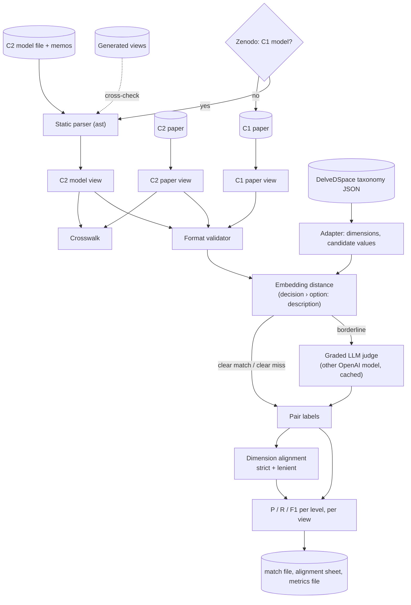

# Ground-Truth Conversion and Matcher - Plan

## Goal Capsule

- **Objective:** turn the two expert design spaces (C1 ML workflow, C2 RL monitoring) into validated, machine-readable ground-truth files, and build the matcher that scores a DelveDSpace (or baseline) output against them at decision and option level, per view.
- **Authority:** this plan's Requirements and Key Technical Decisions. Where silent, follow the evaluation plan (kept outside this repository) (§4.1, §4.2.5, §5.1 matching protocol M1–M7 and M10–M11, §5.4 safeguards) and existing `benchmark/` and `src/taxonomy_generator/evaluation/` conventions.
- **Stop conditions:**
  - C2's model cannot be read faithfully by the static parser (U2), e.g. elements built dynamically rather than as literal calls;
  - the C1 paper does not state options per decision clearly enough to transcribe without inventing structure.

  In both cases, stop and report rather than guessing.
- **Execution profile:** units land as separate commits on a feature branch from `main`. The C1 and C2 paper transcriptions need an author check before they count as done.
- **Tail ownership:** the implementer writes the evaluation-frame note (U5). Two authors confirm the use cases, recorded in that note. An author checks each paper transcription, recorded in the study's ground-truth README (U3, U4).

---

## Product Contract

### Summary

Produce one ground-truth format and, in it:
- C2's model view, parsed statically from the replication package's model file (no third-party library), C2's paper view and a crosswalk between them;
- C1's paper view, plus a model view and crosswalk if a C1 model turns out to exist (U4 checks first).

Then build a matcher that validates both levels of a DelveDSpace design space against the experts' (dimensions against decisions, values against options, and whether each matched value sits under the right dimension) and reports precision, recall and F1 per level and per view. Pairs are proposed by sentence-embedding distance (lower is closer) and decided, when borderline, by a deepeval LLM judge running a different OpenAI model than the generator. A short evaluation-frame note records the agreed use cases, metric definitions and matcher settings; no hash-based freeze.

### Problem Frame

Every fidelity number in the evaluation (RQ1, RQ2) compares DelveDSpace and the baselines with the experts' design spaces. Today those exist only as PDFs and, for C2, as Python model code, and no tool exists to score an output against them. The IR evaluation guidelines in `AGENTS.md` ask that the evaluation frame be fixed before scores are seen and that judges be independent of the generator; a written frame note covers the first without strict hashing; for the second, only OpenAI models are available, so the judge is a different OpenAI model than the generator and is validated against human gold alignment (A6). Existing DelveDSpace runs (C1 and C2 of 2026-10-02) can be scored as soon as this plan lands.

### What is validated

| DelveDSpace element | Ground-truth element | Question answered | Level |
|---|---|---|---|
| Value (candidate decision; outcomes excluded by default) | Option | Did DelveDSpace find the experts' options, and are its values real options? | Option level (primary) |
| Dimension (decision point) | Decision (ADD) | Did DelveDSpace find the experts' decisions, and are its dimensions real decisions? | Decision level |
| Matched value under its dimension | Option under its decision | Is a found option placed under the dimension that corresponds to its expert decision? | Placement |

Forces, impacts and decision links are stored in the ground truth but not scored in this plan.

### Requirements

**Ground-truth format**
- R1. One JSON format holds every view of both studies: decisions (with question and decision type), options per decision (with description and its source), forces, per-decision force descriptions, option–force impacts, and links between decisions (with a list of stereotypes and a label), each element with a stable id and a source reference.
- R2. A validator checks any ground-truth file against the format and reports structural errors (missing or duplicate ids, dangling references, unknown impact, decision-type or stereotype values).
- R3. Descriptions come from authors' text: the study's model, memos or paper, or a one-sentence description written by the benchmark authors (paper plan §5.1 M2) and marked as such; never generated by an LLM. Whoever transcribes or writes descriptions does not consult any system output (DelveDSpace or baseline) while doing so.

**C2 RL monitoring**
- R4. The model view is read from the replication package's model file without executing it or installing CodeableModels, including option links, forces with their impact stereotypes, and links between decisions with their stereotypes and labels.
- R5. The paper view is transcribed from the paper's tables, figures and text, with a page or table reference per element.
- R6. A crosswalk classifies every decision and option of both views as `paper+model`, `model only` or `paper only`, with shared ids across the two views.
- R7. Extraction reports element counts and the discrepancies between the views and against the package's generated views. A model option linked to no decision is recorded as unattached, with its forces, and excluded from scoring.

**C1 ML workflow**
- R8. Before transcribing, the Zenodo record named in the paper plan (10.5281/zenodo.5730291) is checked for a C1 model, and the result is recorded.
- R9. Transcription rules are written before transcribing: what counts as a decision, an option, a "consideration" or "practice", how options under several decisions are recorded, and how decision type is set.
- R10. The paper view is transcribed with a page, table or figure reference per element; forces are recorded only where the paper lists them explicitly.

**Author checks**
- R15. An author checks each paper transcription (C1, and C2 with its crosswalk) against the paper, and the check (who, when, corrections) is recorded in the study's ground-truth README, together with whether transcription and descriptions were done without consulting system outputs (and, if not, which outputs had been seen).

**Matcher**
- R16. An adapter turns a DelveDSpace taxonomy JSON into system dimensions and values (candidate decisions; outcome values excluded by default, with an option to include them), keeping the format open for baseline adapters.
- R17. Value-to-option matching runs once against the union of a study's views: sentence-embedding distance (lower is closer) proposes candidate pairs, clear pairs are accepted or rejected by thresholds, and borderline pairs go to an LLM judge that returns one graded label (same, broader, narrower, related, different; paper plan §5.1 M3) and a reason. The judge compares the design options themselves, regardless of the decision or dimension they sit under.
- R18. Dimension-to-decision alignment reports a strict one-to-one alignment and a lenient alignment that allows one dimension to cover several ground-truth decisions and vice versa.
- R19. Metrics are precision, recall and F1 at decision and option level (a value–option pair labeled same, broader or narrower is a hit; exact-option recall counts only same; the rate of related pairs is reported), plus placement accuracy (the share of matched values whose dimension is aligned with their option's expert decision), reported per view with the view rules of paper plan §5.1 M7 (C2: paper view and model view; C1: one view, or both views if U4 finds a C1 model).
- R20. The judge model, embedding model and thresholds are settings in a dedicated `matcher` section; the judge defaults to no model, never falls back to the generator, must be a different model than the generator, and the run records all of them.
- R21. Each scored run writes a match file (every candidate pair with its distance, label and label source), a human-readable alignment sheet and a metrics file (paper plan §5.1 M11).

**Evaluation frame**
- R13. Before the first scored run, a written evaluation-frame note records the agreed use cases, the metric definitions, and the matcher settings (judge, embedding model, explicit threshold values and how they were chosen), with the commit at which they were fixed. Changes made after any score has been seen are logged in the same note with their reason.

### Key Decisions

- C1 and C2 are compared only against their own papers (Warnett & Zdun; Fang, Warnett & Zdun). Governs R5, R10. (session-settled: user-directed — chosen over also using the MARL and Digital Twins papers as ground truth: those studies are out of scope)
- C2 uses both views side by side, the paper as reported and the full model. Governs R4, R5, R6, R19. (session-settled: user-directed — chosen over the model alone: the paper is what readers see, the model is the authors' full analysis)
- No strict freeze: the evaluation frame is a written note fixed at a commit, not hashes and a verifier. Governs R13. (session-settled: user-directed — chosen over a hash manifest and verifier: not needed for this study)
- The matcher is part of this plan. Governs R16–R21. (session-settled: user-directed — chosen over a separate follow-up plan)
- No CodeableModels installation. Governs R4. (session-settled: user-directed — chosen over executing the model with the library: avoid the extra dependency)
- The judge is an OpenAI model, because only OpenAI is available in this setup; independence from the generator comes from using a different OpenAI model and from validating the judge against human gold alignment (A6). Governs R17, R20. (session-settled: user-directed — chosen over a judge from another provider such as Anthropic: not available in the user's configuration)

### Scope Boundaries

- Not in this plan: gold alignment and κ (A6), threshold calibration fitted on one study and applied to the other, the judge stress test and candidate-recall report (paper plan §5.1 M9), baselines and their adapters beyond the open adapter interface, scoring of forces and relations, a judge from another provider.
- C2 decision links are stored with their original stereotypes; mapping them to DelveDSpace relation types (P17) is out of scope.
- The MARL and Digital Twins papers in `papers/spaces/` are not ground truth.

#### Deferred to Follow-Up Work

- Matcher validation against human gold (A6): candidate recall, judge stress test, threshold calibration.
- Whether forces and decision links enter RQ1 metrics (paper plan §12 item 6); this plan makes them available but scores only decisions and options.
- An "out of ground-truth scope" rating for unmatched C1 items whose topic the C1 paper does not cover (expert rating, A7).

---

## Planning Contract

### Key Technical Decisions

- KTD1. **Read C2's model by static parsing with Python's `ast` module.** Every element in the model file is a literal call: `CClass(<metaclass>, "Name")` for decisions, options and forces; `add_decision_option_link(decision, option, …)` for options; `add_force_relations({option: {force: stereotype}})` for impacts (the dictionary may be inline or a named variable); `add_links({a: b}, stereotype_instances=[…], label=…)` for decision links; plus simple aliases (`x = y`). Stereotypes appear in the model only as variable names (e.g. `positive`, `enables_next_decision`); the metamodel file (`src/metamodels/guidance_metamodel.py`) is parsed the same way to map each variable to its `CStereotype` label and its parent type, keeping force-impact stereotypes and next-decision link stereotypes apart (two link labels repeat dependency-type labels). Walking these calls needs no library and no execution. The package's generated views (`_generated/rl_monitoring_adds/*_view.txt`), produced by the authors from the same model, serve as an independent cross-check. (session-settled: user-directed — chosen over installing CodeableModels: avoid the dependency)
- KTD2. **Element ids derive from the model's variable or class names** (slugged) for C2; C2 paper-view elements reuse the model id when the crosswalk maps them, and get a `P`-prefixed id when paper-only. C1 ids are assigned at transcription (`D1`, `D1.O1`, `F1`). Ids never change once a run has been scored.
- KTD3. **Decision type is "single", "multiple" or "unspecified".** The C2 metamodel defines "Single Answers" and "Multiple Answers", but the model's seven decisions use neither, so they are "unspecified" unless a paper states the type (with a page reference). Unspecified is valid and reported as a warning.
- KTD4. **Option names and descriptions follow what the model actually stores.** The option name is the option's class name. The description is the link's `description` tagged value; where the model passed the text as the third positional argument (`option_name`), that text is the description and its source is recorded. Fallback: the catalogue memo (`memos/add-catalogue.md`). Names are normalized before matching memo entries (Unicode normalization, hyphen variants to `-`, whitespace and case).
- KTD5. **Forces are described per decision.** The memo describes each force differently under each decision, so per-decision driver text is stored on a decision–force record citing the memo section, and a force's own description stays empty unless a single source defines it.
- KTD6. **Candidate pairs come from sentence embeddings, the BERTopic-style representation already in the pipeline.** Each value and option is serialized as "<decision or dimension name> › <option or value name>: <description>" with CamelCase names split into words (paper plan §5.1 M1), on both sides, then embedded with the configured embedding model (`text-embedding-3-small`), L2-normalized, and compared by distance in bands (lower is closer; the same Euclidean distance on normalized vectors that `_cross_distances` uses), reusing the pattern of `src/taxonomy_generator/evaluation/consistency.py`. This is the embedding step BERTopic itself uses, without its clustering, which a pairwise matcher does not need. **BERTScore is not used by default:** deepeval's `Scorer.bert_score` needs `bert_score`, `torch` and `transformers` plus a large model download; it is tuned for sentence-level paraphrase rather than short option labels, and its raw scores need baseline rescaling to separate pairs. It can be added later as a sensitivity check on the same pairs.
- KTD7. **The judge is a custom deepeval metric with fixed instructions and graded labels, served by a different OpenAI model than the generator.** It follows the existing scoreboard's stack (`src/taxonomy_generator/evaluation/metrics.py`: deepeval metrics with fixed instructions, deepeval `OpenAIModel`). Only OpenAI is available, so independence is partial: the judge must be a different OpenAI model than the generator (preferably another model line than `gpt-5.6-luna`), and the human gold alignment (A6) validates it; the paper states this as a limitation. GEval returns a score, not a category, so the judge is a small custom deepeval metric (subclassing deepeval's `BaseMetric`) that calls the deepeval `OpenAIModel` with structured output and fixed instructions, returning one graded label (same, broader, narrower, related, different) and a reason. Both items are presented symmetrically, in a seeded random order recorded in the match file; the decision and dimension are given as context only, because placement is scored separately (KTD9). Same, broader and narrower count as matches (R19); the label and reason are kept in the match file. The judge comes from the `matcher` settings section (R20) with no default and no fallback to the generator model; the matcher refuses to run with it unset or equal to the generator model (read from the run's config). Judge results are cached on disk, keyed by judge model, steps and pair, so reruns are deterministic and cheap.
- KTD8. **Matching runs once against the union of a study's views, metrics are computed per view** (paper plan §5.1 M7): recall in a view counts only that view's elements; paper-view precision leaves out system items matched only to `model only` elements and reports their number.
- KTD9. **Dimension alignment uses the value matches.** A dimension and an expert decision are related by the share of their values and options matched to each other, with the embedding distance of their names and descriptions as a tie-break. Strict alignment is a one-to-one assignment (`scipy.optimize.linear_sum_assignment`) above a minimum share; lenient alignment keeps every pair above the share, so splits and merges count. Placement accuracy (R19) is read from the same alignment.
- KTD10. **Outcome values are excluded from system values by default**, matching the candidates-only decision of the topic-metrics plan; an option includes them for a sensitivity run.

### High-Level Technical Design

### Sources

- C2 model: `benchmark/c2-rl-monitoring/replication_package/src/model/model.py` (113 `CClass` elements: 7 decisions, 63 options of metaclass `practice`, 43 forces; 62 `add_decision_option_link` calls; `add_decision_option_link` calls from line 663; `add_force_relations` from line 290; `add_links` decision links at lines 748–766, some with several stereotypes). Metamodel: `src/metamodels/guidance_metamodel.py` (`add_decision_option_link` stores `name` and `description` tagged values).
- C2 descriptions: `benchmark/c2-rl-monitoring/replication_package/memos/add-catalogue.md` (per-decision driver tables; non-breaking hyphens in names).
- C2 generated views: `benchmark/c2-rl-monitoring/replication_package/_generated/rl_monitoring_adds/` (PlantUML; labels need `<b>` tags and `: Practice` suffixes stripped and `\n` breaks replaced by a space).
- Papers: `papers/spaces/COMSI-2021-07-0084.R2_Warnett.pdf` (C1), `papers/spaces/Architectural_Design_Decisions_for_Monitoring_Deployed_Reinforcement_Learning_Systems.pdf` (C2).
- Matching protocol: the evaluation plan (kept outside this repository), §5.1 (M1–M7, M10, M11).
- Reusable code: `src/taxonomy_generator/evaluation/consistency.py` (embedding bands, judge), `src/taxonomy_generator/utils.py` (`load_embeddings_model`, `load_chat_model`, `l2_normalize`).
- Test pattern for benchmark scripts: `tests/unit_tests/test_build_corpus.py`.

---

## Implementation Units

### U1. Ground-truth format and validator

- **Goal:** define the common format (R1) and a validator (R2) that every later unit writes against.
- **Requirements:** R1, R2, R3; KTD2, KTD3, KTD5.
- **Dependencies:** none.
- **Files:**
  - `benchmark/gt_format.py` (format, loader, validator, command-line check)
  - `tests/unit_tests/test_gt_format.py`
- **Approach:**
  1. Define the fields of R1, including decision–force records with per-decision text and decision links with a stereotype list and label.
  2. Validate ids (unique, well-formed), references, and vocabularies (impact stereotypes `++ + o - -- +/-`, decision types, link stereotypes from the C2 metamodel).
  3. Report empty descriptions and "unspecified" decision types as warnings.
- **Patterns to follow:** load-by-path pattern of `tests/unit_tests/test_build_corpus.py`.
- **Test scenarios:**
  - a minimal valid file (one decision, two options, one force, one impact, one link with two stereotypes) validates;
  - a duplicate option id is reported with both locations;
  - an impact pointing to an unknown force is reported;
  - an unknown impact stereotype (`+++`) is rejected;
  - a decision typed "unspecified" validates with a warning;
  - an empty option description validates with a warning.
- **Verification:** the validator accepts the valid file and rejects each broken variant with a specific message.

### U2. C2 model view by static parsing

- **Goal:** produce C2's model view from the model file without executing it (R4, R7).
- **Requirements:** R3, R4, R7; KTD1, KTD2, KTD3, KTD4, KTD5.
- **Dependencies:** U1.
- **Files:**
  - `benchmark/parse_c2_model.py`
  - `benchmark/c2-rl-monitoring/gt/gt_model.json`
  - `tests/unit_tests/test_parse_c2_model.py`
- **Approach:**
  1. Parse the model file with `ast`; collect `CClass` assignments by metaclass, resolve simple aliases and named dictionaries. Parse the metamodel file the same way to map stereotype variables to labels and parent types (KTD1).
  2. Read option links (KTD4), force impacts and decision links (stereotype lists and labels).
  3. Attach memo descriptions after name normalization; store per-decision force text (KTD5).
  4. Write the view with provenance (package source, file hashes for traceability), validate it with U1, print counts.
  5. Cross-check option and force lists against the generated views after stripping PlantUML formatting; list every difference.
- **Execution note:** run the parser on the real model file early; if any element is built dynamically and cannot be read statically, stop (Goal Capsule) and report the construct.
- **Test scenarios:**
  - a small synthetic model source (two decisions, three options, one shared option, two forces, an inline and a variable impact dictionary, one alias, one link with three stereotypes and a label) parses into the expected format;
  - an option linked with a positional third argument stores that text as the description, with its source;
  - an option linked with `option_description` stores it as the description;
  - a memo entry written with a non-breaking hyphen matches the model name;
  - an option linked to two decisions appears under both with one option id;
  - the parser does not import or execute the model file;
  - an option with force impacts but no decision link is recorded as unattached, appears in no decision, and is reported as a discrepancy (in the real model: "Action Failure Rate Monitoring");
  - `positive` resolves to `+` as a force impact, and `enables_next_decision` resolves to "Enables" as a next-decision link stereotype, not as a dependency type.
- **Verification:** `gt_model.json` validates; counts are reported (7 decisions; the option and force counts match the generated views or every difference is explained).

### U3. C2 paper view, crosswalk and author check

- **Goal:** transcribe C2's paper view, link it to the model view, and record an author check (R5, R6, R7, R15).
- **Requirements:** R3, R5, R6, R7, R15; KTD2.
- **Dependencies:** U1, U2.
- **Files:**
  - `benchmark/c2-rl-monitoring/gt/gt_paper.json`
  - `benchmark/c2-rl-monitoring/gt/gt_crosswalk.csv`
  - `benchmark/c2-rl-monitoring/gt/README.md` (sources per element, discrepancies, author check record)
  - `benchmark/gt_crosswalk.py`
  - `tests/unit_tests/test_gt_crosswalk.py`
- **Approach:**
  1. Transcribe decisions and options from the paper's tables and figures with page or table references; forces only from the model view (U2).
  2. Reuse model ids for shared elements; `P`-prefixed ids for paper-only elements.
  3. Write and check the crosswalk over decisions and options.
  4. Fill empty descriptions from the paper or, where none exists, with an author-written sentence marked as such (R3).
  5. Hand the paper view and crosswalk to an author; record the check (R15).
- **Test scenarios:**
  - a crosswalk that omits an element of either view is reported;
  - a `paper+model` element missing from one view is reported;
  - a `paper only` element that reuses a model id is reported;
  - a consistent synthetic pair of views and crosswalk passes.
- **Verification:** both views validate; the crosswalk check passes; the README lists every discrepancy and a completed author check.

### U4. C1 model check, transcription rules and paper view

- **Goal:** settle whether C1 has a model, then produce C1's ground truth with rules and an author check (R8, R9, R10, R15).
- **Requirements:** R3, R8, R9, R10, R15; KTD2, KTD3.
- **Dependencies:** U1 (and U2 if a C1 model exists).
- **Files:**
  - `benchmark/c1-ml-workflow/gt/README.md` (Zenodo result, transcription rules, sources per element, open issues, author check record)
  - `benchmark/c1-ml-workflow/gt/gt_paper.json` (and `gt_model.json` plus crosswalk if a model exists)
- **Approach:**
  1. Check the Zenodo record and record what it contains. If it holds a CodeableModels model, reuse U2's parser and U3's crosswalk for C1 and stop here for the model view.
  2. Write the transcription rules (R9) before transcribing; apply the ADD = dimension, option = value mapping of paper plan §4.2.5.
  3. Transcribe with page, table or figure references; forces only where explicit; descriptions from the paper's text or author-written and marked.
  4. List ambiguous cases as open issues; hand the draft to an author and record the check (R15).
- **Test expectation:** none for new code beyond U1–U3; correctness is established by the author check and the validator.
- **Verification:** the C1 files validate; every element has a source reference; the README contains the Zenodo result, the rules, the open issues and a completed author check.

### U6. Matcher: adapter, candidates and judge

- **Goal:** give every plausible pair of system value and ground-truth option a graded label (R16, R17, R20).
- **Requirements:** R16, R17, R20; KTD6, KTD7, KTD10.
- **Dependencies:** U1.
- **Files:**
  - `src/taxonomy_generator/evaluation/gt_match.py`
  - `src/taxonomy_generator/settings.py`, `src/taxonomy_generator/configuration.py` (`matcher` section)
  - `config.yaml` (commented `matcher` section)
  - `tests/unit_tests/test_gt_match.py`
- **Approach:**
  1. Add the `matcher` settings section (judge model with no default and no fallback, embedding model, lower and upper distance thresholds), built like the existing `evaluation` section.
  2. Adapter: read a taxonomy JSON (selected view by default) into system dimensions and candidate values with their descriptions; outcomes only on request.
  3. Serialize values and options as KTD6 describes; embed system values and the union of ground-truth options; compute all pair distances.
  4. Below the lower threshold: label "same"; above the upper threshold: label "different"; in between: score the pair with the graded judge metric (KTD7), blind to which system produced the value.
  5. Cache judge results on disk; refuse to run with the judge unset or equal to the generator model (KTD7).
- **Patterns to follow:** `consistency.py` (bands, `_cross_distances`), `evaluation/metrics.py` (GEval with fixed steps, `OpenAIModel`), `evaluation/judge.py`, `settings.py::_build_evaluation`, `utils.load_embeddings_model`.
- **Test scenarios (fake embeddings and a fake judge, no API calls):**
  - a pair below the lower threshold is labeled "same" with source "auto";
  - a pair in the band is sent to the judge, and its graded label (e.g. "narrower") and reason are stored with source "judge";
  - a judge answer outside the five labels is rejected and retried once, then recorded as "different" with a warning;
  - the order in which the two items are presented to the judge is seeded and recorded;
  - a cached judge result is reused without a second call;
  - outcome values are excluded by default and included with the option;
  - an unset judge, or a judge equal to the generator model, stops the run with a clear message;
  - a `matcher.judge_model` set in YAML reaches the matcher, and an unset one does not fall back to `models.model`;
  - a CamelCase option name is serialized with spaces and its decision prefix;
  - the judge's steps do not require the decision and the dimension to correspond (a same-option pair under different decisions is judged a match).
- **Verification:** on a synthetic taxonomy and ground truth, every pair is labeled exactly once and the label sources are reported.

### U5. Evaluation-frame note (before any scoring)

- **Goal:** fix what reported numbers rest on before any score is seen (R13), without hashes.
- **Requirements:** R13.
- **Dependencies:** U3, U4, U6 (the matcher settings exist); must land before U7's end-to-end run.
- **Files:**
  - `benchmark/README.md` ("Evaluation frame" section)
- **Approach:**
  1. Record the agreed use cases (which config text, who agreed, when) and the metric definitions (levels, hits, exact-option recall, related rate, placement, views).
  2. Record the matcher settings with explicit threshold values and how they were chosen without looking at system scores (e.g. from distances between ground-truth options themselves).
  3. Note the commit at which the frame was fixed; any later change is logged with its reason and the date.
- **Test expectation:** none (documentation).
- **Verification:** the section names use cases, metric definitions, matcher settings with threshold values, and the fixing commit, and that commit precedes the first scored run.

### U7. Matcher: dimension alignment, metrics, outputs and command

- **Goal:** turn value–option labels into dimension alignment, placement and per-view metrics, and write the run outputs (R18, R19, R21).
- **Requirements:** R18, R19, R21; KTD8, KTD9.
- **Dependencies:** U6, and U5 before the end-to-end run (and U2–U4 for real runs).
- **Files:**
  - `src/taxonomy_generator/evaluation/gt_match.py`
  - `main.py` (a `--match-gt` standalone mode, like `--evaluate`)
  - `tests/unit_tests/test_gt_metrics.py`
- **Approach:**
  1. Dimension alignment from value–option matches (KTD9): strict one-to-one and lenient.
  2. Metrics at decision and option level, plus placement accuracy, per view (KTD8, KTD9); report the number of system items matched only to `model only` elements.
  3. Write the match file, the alignment sheet (CSV) and the metrics file next to the scored run; record judge, generator model, embedding model, thresholds and ground-truth commit.
  4. Command: `--match-gt <taxonomy.json> --gt <study gt folder> --config <yaml>`.
- **Test scenarios:**
  - one system dimension covering two ground-truth decisions counts in lenient but not strict alignment;
  - recall in the paper view ignores `model only` elements, and paper-view precision leaves out items matched only to them, reporting their count;
  - a system with no matches gets precision and recall 0 without errors;
  - a perfect synthetic match gives F1 1.0 at both levels and placement accuracy 1.0;
  - pairs labeled broader or narrower count as hits for option recall but not for exact-option recall, and related pairs only raise the related rate;
  - a value matched to an option of a decision its dimension is not aligned with lowers placement accuracy but not option recall;
  - outputs contain every pair, its distance, label and label source.
- **Verification:** the command scores the C2 and C1 runs of 2026-10-02 and writes the three outputs.

### U8. Paper-plan updates after scoring

- **Goal:** bring the paper plan in line with what this plan produced.
- **Requirements:** R13.
- **Dependencies:** U7.
- **Files:**
  - the evaluation plan (kept outside this repository) (§4.1 and §5.1 M7 for the C1 outcome; §5.4 and P9: the judge is a different OpenAI model validated by human gold, stated as a limitation; §8.7 progress log)
- **Approach:**
  1. Record the C1 outcome (one or two views) and the judge arrangement.
  2. Log the first scores and any change made to the frame after them, with reasons.
- **Test expectation:** none (documentation).
- **Verification:** the paper plan reflects the C1 outcome, the judge arrangement and the progress log.

---

## Verification Contract

| Gate | Command or check | Applies to |
|---|---|---|
| Unit tests | `make test` (no API calls) | U1, U2, U3, U6, U7 |
| Format validation | the U1 validator on every file in `benchmark/*/gt/*.json` | U2, U3, U4 |
| C2 cross-check | U2's counts and comparison with the generated views | U2 |
| Crosswalk consistency | U3's crosswalk check | U3 |
| Author checks | records in `benchmark/c1-ml-workflow/gt/README.md` and `benchmark/c2-rl-monitoring/gt/README.md` | U3, U4 |
| End-to-end | `--match-gt` on the C1 and C2 runs of 2026-10-02 with a cross-family judge | U7 |

---

## Definition of Done

- All ground-truth files validate; the C2 crosswalk check passes; counts and discrepancies are documented.
- The Zenodo result, the C1 transcription rules, open issues and both author checks are recorded.
- The matcher scores the existing C1 and C2 runs and writes match, alignment and metrics files; judge calls are cached.
- The evaluation-frame note was committed before the first scored run; the paper plan is updated.
- `make test` passes; no third-party package code, downloaded source text or abandoned experimental code is committed; no new runtime dependency is added.
