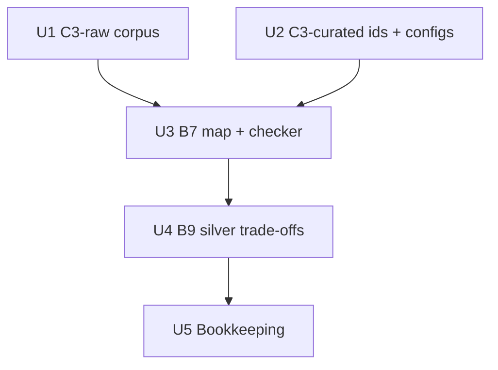

# feat: C3 Git-at-scale corpora and provisional silver lists (B6, B7, B9)

## Goal Capsule

- **Objective:** Before the freeze, prepare everything C3 needs except the runs:
  - the C3-raw and C3-curated corpora and the C3 study configs (B6);
  - a provisional passage→system map (B7);
  - a provisional silver trade-off list (B9).
- **Authority:** the evaluation plan (kept outside this repository), §4.4 and §8.2 (B6, B7, B9) define the content. This plan settles the layout, schemas and the bias guard. Author review may correct the agent drafts under the rule in KTD6.
- **Stop conditions:**
  - Stop and report if the Cursor article cannot be fetched by any route (live, Wayback, saved page). C3-raw cannot exist without it.
  - Never open existing Delve C3 outputs (KTD6). If one is opened by accident, record it in the C3 README and tell the user.
- **Out of the tail:** no Delve C3 runs, no commits or pushes unless the user asks; the user publishes the branch.

---

## Product Contract

### Summary

C3 is the paper's third case: several organizations (GitHub, Google, Microsoft, Cursor) solved the same problem, hosting Git at scale, in different ways. It has no expert ground truth. It is evaluated by expert rating, by placing each system as a point in the mined design space (needs B7), and by recall of stated trade-offs (needs B9). This plan builds the inputs those checks need. The agent drafts B7 and B9 from the sources alone, as provisional versions for author review.

### Problem Frame

The existing C3 material is 16 paraphrased, pre-organized documents (`examples/cursor-git-at-scale/`). That pre-structuring helps any system, so the paper's primary C3 corpus must be the raw sources, prepared exactly like C1/C2. B7 and B9 are reference data. They are credible only if they come from the sources and not from Delve's C3 output. The paper must also say which version it used, the agent draft or the author-reviewed one.

### Requirements

**Corpora (B6)**
- R1. C3-raw: the Cursor article plus its official background sources, fetched and segmented into `sNN_pKK` passages with the same tools and settings as C1/C2.
- R2. No downloaded or segmented third-party text is committed; only the source list, manifest and passage index are.
- R3. C3-curated: the existing 16 documents, unchanged, plus an id-bearing copy so labels and B7 can refer to documents by name.
- R4. C3 study configs that mirror the frozen C1/C2 study settings, apart from the exceptions recorded in KTD5. The use case names the problem and genre but no dimensions.

**Reference data (B7, B9)**
- R5. Every C3-raw passage and every curated document is mapped to one or more systems from a fixed vocabulary.
- R6. A silver list of the trade-offs the raw sources state, each with its systems, the quality attributes in tension, and passage references.
- R7. B7 and B9 are drafted from source text only, marked as agent-drafted and pending author review, and dated.

**Bookkeeping**
- R8. The status, the bias guard and the C3 paths are recorded in:
  - a new C3 README;
  - `benchmark/README.md`;
  - the pre-freeze to-do list (outside this repository), item 6;
  - the paper plan's B6/B7/B9 paths.

### Scope Boundaries

- No Delve runs on C3, no placement matrix (A9), no design-point work (A12, A13, A15, E13): all come after the freeze.
- No changes to the pipeline code. `fetch_sources.py` and `build_corpus.py` already accept any case folder.
- `examples/cursor-git-at-scale/` stays untouched, including its old config, builder and outputs.

### Deferred to Follow-Up Work

- Optional silver **decision** list (§4.4 item 5): not requested now; same bias rules apply when it is written.
- Author review of B7/B9 and the two-author agreement on the C3 use case (B4-style), tracked in the pre-freeze to-do list (outside this repository).
- `compare_taxonomies` C3-raw vs. C3-curated: after the runs.

### Decisions on the open questions (user, 2026-10-08)

- Q1. **`min_dimension_sources`: 1 for C3-raw** (2 for C3-curated), recorded as a C3 exception (KTD5).
- Q2. **The agent draft of B7/B9 is primary in the paper.** The author-reviewed version is a sensitivity check, and each review change cites source text (KTD6).
- Q3. **`batch_size: 8` for both C3 configs**, recorded as a C3 exception (KTD5), so the loop can reach saturation.

### Sources

- the evaluation plan (kept outside this repository), §4.4, §8.2 (B6, B7, B9, A9, A15).
- `examples/cursor-git-at-scale/references.md` (source URLs) and the 16 curated documents.
- `benchmark/README.md` (corpus tooling, evaluation-frame change log).

---

## Planning Contract

### Key Technical Decisions

- KTD1. **Case folder `c3-git-at-scale`, not `benchmark/cursor/`.** It matches `c1-ml-workflow` / `c2-rl-monitoring`. `build_corpus.py` writes to `examples/<case>/`, so the corpus lands in a new `examples/c3-git-at-scale/` instead of mixing with the old curated example and its earlier outputs. The paper plan's `benchmark/cursor/` paths are updated to match.
- KTD2. **C3-raw sources: s1 Cursor article; s2 "Stretching Spokes"; s3 "Building resilience in Spokes"; s4 Scalar philosophy doc; s5 "Introducing Scalar".**
  - The Wikipedia "Rendezvous hashing" page is excluded. It describes a generic technique, not a system or decision, and its encyclopedic text (math, unrelated uses) would dilute the corpus.
  - s4 uses a `fetch_override` to the raw GitHub markdown file. This is new: C1/C2 only override to a raw PDF. The raw markdown goes through the HTML extractor, so U1 checks s4's word count and headings against the rendered page.
  - Three systems (GitHub filesystem, Google JGit/DHT, Azure DevOps) are described only by s1, Cursor's own retelling. Their placement therefore reflects that account, not the systems' own documentation. This caveat goes in the C3 README and the paper.
- KTD3. **Same segmentation as C1/C2** (target 300 words, min 80, max 450), for fairness across cases.
- KTD4. **C3-curated with ids, built only from the 16 documents.**
  - The existing curated builder globs every `.md` in its folder. That folder also holds earlier Delve `*_report_*.md` outputs, so running the builder as-is would put Delve output into the corpus and break KTD6.
  - Instead, a small wrapper reuses the builder's frontmatter stripping, reads only `examples/cursor-git-at-scale/0[1-6]-*/*.md`, and asserts there are exactly 16 files.
  - Ids are the document file slugs.
  - The documents are LLM-assisted paraphrases distilled from the article ("generated 2026-08-20"), already committed, so the id-bearing copy can be committed too. The paper describes C3-curated as such, not as author-written.
- KTD5. **Study configs mirror C1 with four recorded exceptions.**
  - Copied from `examples/c1-ml-workflow/c1_ml_workflow_config.yaml`: models, `edit_mode: tools`, `relevance_selection: false`, `max_num_clusters: null`, `link_evidence: true`, open coding on `content`, and the other loop settings.
  - Exception 4, `batch_size: 8` (Q3): C3 has far fewer documents, and 20 would leave one to three minibatches and no saturation check.
  - Exception 1, `output.default_output_dir`: set to `examples/c3-git-at-scale`, and the C1 header comments are rewritten for C3.
  - Exception 2, `min_dimension_sources: 1` (Q1): source support counts the `sNN` prefix, and three systems appear only in s1, so a value of 2 risks dropping the dimensions that place them.
  - Exception 3, the use case: it names the problem (hosting Git repositories at scale) and the genre (one engineering article plus official background) only. It names neither the organizations or systems nor any example dimension, so that whether the systems come out as distinct points is mined, not prompted.
  - Two configs that differ only in `taxonomy.name`:
    - `c3-git-at-scale` (raw);
    - `c3-git-at-scale-curated`.

    This keeps run outputs distinguishable. In the curated config `min_dimension_sources` is 2: each document counts as its own source there, as in C1/C2.
- KTD6. **Bias guard.**
  - **What the agent reads while drafting B7/B9:**
    - `benchmark/c3-git-at-scale/sources/text/*.md`;
    - the C3-raw corpus;
    - the 16 documents under `examples/cursor-git-at-scale/0[1-6]-*/`;
    - `references.md`.
  - **What it never opens:** `examples/cursor-git-at-scale/*_taxonomy_*`, `*_report_*`, `*_clusters_*`, `*_open_codes_*`, `*_documents_*`, `*_messages_*`, html reports or `graph.png`.
  - **Committed before any C3 run.** B7/B9 are committed before any C3 run with the new configs.
  - **Known exposure.** Earlier Delve C3 outputs from an older pipeline version exist, and the authors may have seen them. The C3 README states this.
  - **Rule for the author review.** The review may change an agent row only against cited source text, recording each change with a reason. This keeps the reviewed version auditable (Q2).
- KTD7. **System vocabulary (B7):**
  - `GH-FS`: GitHub filesystem distribution.
  - `GOOG-DHT`: Google JGit on a distributed KV store.
  - `GH-SPOKES`.
  - `MS-GVFS`: GVFS virtualization.
  - `MS-SCALAR`.
  - `MS-ADO`: Azure DevOps hybrid store.
  - `CUR-CONT`: Cursor Continuity and Origin.
  - `GENERAL`: Git internals, problem framing, no specific system.

  Rules:
  - **Successors.** A successor gets its own code when its source says it reversed a design decision: Scalar moved away from GVFS virtualization, and Spokes replaced filesystem distribution. It shares a code when it deploys the same design, as Origin does Continuity.
  - **`systems`.** Multi-label: every system a passage substantively describes. Placement (A9) aggregates by `systems` membership, so a system mentioned only in mixed passages still gets a point.
  - **`primary`.** One system, used only to break ties between conflicting values.
- KTD8. **File shapes.** CSV, matching the benchmark's other version-controlled indices. Each file starts with one `#` comment line giving its status ("agent draft, 2026-10-07, author review pending"); the checker skips it.
  - `passage_systems.csv`: `passage_id, corpus (raw|curated), systems, primary, basis`. `basis` is a short note in the agent's own words, never a quote.
  - `silver_tradeoffs.csv`: `id, tradeoff, systems, qa_favoured, qa_sacrificed, explicitness (stated|implied), passage_ids, curated_ids, found_in (raw|curated-check)`.
  - Quality attributes use the A14 vocabulary: ISO 25010 characteristics plus cost.
- KTD9. **A checker for B7/B9 integrity, with unit tests.** `benchmark/check_c3_reference.py` validates the reference files against the passage index and the curated ids:
  - every passage mapped;
  - only known codes;
  - `primary` included in `systems`;
  - every referenced id exists;
  - quality-attribute fields not empty.

  It skips the B9 checks while `silver_tradeoffs.csv` is absent, and reruns after any corpus rebuild, which can renumber passages.
- KTD10. **B9 comes from the raw sources first.**
  - A trade-off enters only if it cites at least one C3-raw passage.
  - The curated documents are consulted afterwards, only to flag possible misses. A trade-off found that way is added only if a raw passage supports it, and is marked `found_in=curated-check`.
  - This keeps B9 from being shaped by the pre-structured corpus that C3-curated runs consume.

### Assumptions

- The Cursor blog page yields its article text through trafilatura (live or Wayback). If not, the page is saved by hand into `benchmark/c3-git-at-scale/sources/raw/s1.html` and re-extracted with `python benchmark/fetch_sources.py benchmark/c3-git-at-scale --reextract`. Without the case argument, the script re-extracts C1/C2 instead.
- The Wikipedia exclusion (KTD2), the vocabulary split (KTD7) and the use-case wording (KTD5) are agent choices pending author review. Each can be reversed by a rebuild or a config edit before the C3 runs.

### Risks

| Risk | Mitigation |
|---|---|
| Article text is truncated or includes navigation and code noise | Check its word count against the article's length. Compare section headings with the curated docs' coverage of the systems. Flag the source in the manifest. |
| Agent drafts are read as ground truth | Status line in every file and in the README. The paper names the version used (Q2). Recall on B9 is reported as indicative only. |
| A corpus rebuild renumbers passages and silently breaks B7/B9 | The checker (KTD9) fails on unknown or missing ids. |
| Shared salience bias between drafter and generator | The drafting agent (Claude) and the generation LLM (OpenAI) are different families, but both are LLMs and may notice the same salient trade-offs. Author review happens before the numbers count, and the drafting model is named in the C3 README. |
| Authors' earlier exposure to C3 output | Stated in the README. Review changes must cite source text (KTD6). |

### Sequencing

---

## Implementation Units

### U1. C3-raw corpus

- **Goal:** Fetched sources and the segmented C3-raw corpus.
- **Requirements:** R1, R2; KTD1, KTD2, KTD3.
- **Dependencies:** none.
- **Files:**
  - Create `benchmark/c3-git-at-scale/sources.csv` (C1 header).
  - Generated `benchmark/c3-git-at-scale/sources/manifest.json` and `manifest.csv` (committed).
  - Generated `examples/c3-git-at-scale/c3-git-at-scale_passages.csv` (committed).
  - Generated `examples/c3-git-at-scale/c3-git-at-scale_corpus.json` (gitignored).
  - Create `examples/c3-git-at-scale/.gitignore` (copy of C1's).
- **Approach:**
  1. Write `sources.csv` rows s1–s5. Find Wayback timestamps near today for the archive columns.
  2. Fetch with `benchmark/fetch_sources.py benchmark/c3-git-at-scale`.
  3. Inspect the manifest flags (`short`, `bot_block`) and each text's head and tail. For s4, also compare its word count and headings with the rendered GitHub page.
  4. Build with `benchmark/build_corpus.py c3-git-at-scale`.
  5. Confirm with `git status` that no text file is staged or untracked outside the ignore rules.
- **Patterns to follow:** `benchmark/c1-ml-workflow/sources.csv`, `examples/c1-ml-workflow/.gitignore`.
- **Test scenarios:** Test expectation: none -- data preparation; verified by manifest status and the U3 checker.
- **Verification:**
  - The manifest shows all five sources `ok` with plausible word counts.
  - The passage count is reported (expected roughly 30–60).
  - The corpus file is ignored by git.

### U2. C3-curated ids and study configs

- **Goal:** An id-bearing curated corpus and the two C3 study configs.
- **Requirements:** R3, R4; KTD4, KTD5.
- **Dependencies:** none.
- **Files:**
  - Create `benchmark/c3-git-at-scale/build_curated.py` (wrapper, KTD4).
  - Generated `examples/c3-git-at-scale/c3-git-at-scale-curated_documents.json`.
  - Create `examples/c3-git-at-scale/c3_git_at_scale_config.yaml`.
  - Create `examples/c3-git-at-scale/c3_git_at_scale_curated_config.yaml`.
- **Approach:**
  1. Build the curated file with the wrapper, which reads only the six numbered folders and asserts there are 16 documents.
  2. Copy the C1 config and apply the KTD5 exceptions (output dir, header comments, `min_dimension_sources`, use case), each with a comment giving the reason.
  3. Derive the curated config by changing `taxonomy.name` and setting `min_dimension_sources: 2`.
- **Patterns to follow:** `examples/c1-ml-workflow/c1_ml_workflow_config.yaml`; the `strip_frontmatter` helper of `examples/cursor-git-at-scale/build_corpus.py`.
- **Test scenarios:** Test expectation: none -- config and generated data; the wrapper's 16-file assertion is its own check.
- **Verification:**
  - Both configs load through the settings loader.
  - The curated file has 16 `{id,title,content}` entries, none from a `*_report_*` file.
  - `examples/cursor-git-at-scale/` is unchanged (`git status`).

### U3. B7 passage→system map and checker

- **Goal:** `benchmark/c3-git-at-scale/passage_systems.csv` covering every C3-raw passage and every curated document, and the checker that validates it.
- **Requirements:** R5, R7; KTD6, KTD7, KTD8, KTD9.
- **Dependencies:** U1, U2.
- **Files:**
  - Create `benchmark/c3-git-at-scale/passage_systems.csv`.
  - Create `benchmark/check_c3_reference.py`.
  - Create `tests/unit_tests/test_check_c3_reference.py`.
- **Approach:**
  1. Write the checker and its tests first (KTD9).
  2. Read each passage in order (respecting KTD6).
  3. Assign `systems` and `primary`, and write a one-line `basis` in the agent's own words.
  4. Map the 16 curated documents the same way (`corpus=curated`).
  5. When the systems in a passage are ambiguous, list them all in `systems` and set `primary` to the one the passage is mainly about, or `GENERAL` for even comparisons.
- **Patterns to follow:** `benchmark/selection_variant.py` and `tests/unit_tests/test_selection_variant.py`.
- **Test scenarios:**
  - A valid fixture (two passages, one curated id, one map row each) passes, with no trade-off file present.
  - The leading `#` status line is skipped.
  - A passage missing from the map is reported.
  - An unknown system code is reported.
  - A `primary` not in `systems` is reported.
  - With a trade-off file present: a trade-off citing a nonexistent passage id is reported.
  - With a trade-off file present: empty `qa_favoured` or `qa_sacrificed` is reported.
  - With a trade-off file present: a trade-off with no raw passage id is reported.
- **Verification:**
  - The checker passes on the real map.
  - The unit tests pass.
  - Systems with no passage at all are listed in the README, not invented.

### U4. B9 silver trade-off list

- **Goal:** `benchmark/c3-git-at-scale/silver_tradeoffs.csv`.
- **Requirements:** R6, R7; KTD6, KTD8, KTD10.
- **Dependencies:** U3.
- **Files:** Create `benchmark/c3-git-at-scale/silver_tradeoffs.csv`.
- **Approach:**
  1. Draft trade-offs from the C3-raw passages alone, each citing its passage ids. Expect about 8–15.
  2. Then consult the curated `03-tradeoffs/` and decision documents for possible misses, and add rows only under KTD10.
  3. Fill `curated_ids` where a curated document covers the same trade-off.
- **Test scenarios:** Covered by the U3 checker tests (trade-off cases).
- **Verification:** The checker passes with both files present.

### U5. Bookkeeping

- **Goal:** The status, the bias guard and the caveats are documented where the authors and the paper will look.
- **Requirements:** R8, R7.
- **Dependencies:** U4.
- **Files:**
  - Create `benchmark/c3-git-at-scale/README.md`.
  - Modify `benchmark/README.md`.
  - Modify the pre-freeze to-do list and the evaluation plan (both outside this repository).
- **Approach:**
  1. **C3 README:**
     - sources and exclusions;
     - how to rebuild;
     - B7/B9 schemas and vocabulary, with the successor rule;
     - the status line, plus a review checklist and the review rule (KTD6);
     - the bias guard, what was read, and the known earlier exposure;
     - the secondhand-account caveat (KTD2);
     - the drafting model;
     - the curated provenance (KTD4);
     - any system without passages.
  2. **Benchmark README:** add a short C3 entry to the layout and corpus sections, and a dated change-log line noting that C3 was added with no ground truth.
  3. **Pre-freeze to-do list:** tick B6 and the B7/B9 drafts. Add the author review and the use-case agreement, and record the Q1–Q3 decisions.
  4. **Paper plan:** replace `benchmark/cursor/` with `benchmark/c3-git-at-scale/`.
- **Test scenarios:** Test expectation: none -- documentation.
- **Verification:** The documents name the same paths, counts and status as the generated files.

---

## Verification Contract

| Gate | Command / check | Applies to |
|---|---|---|
| Sources fetched | manifest: all five `ok`, word counts plausible | U1 |
| No third-party text tracked | `git status --porcelain` shows no `sources/text`, `sources/raw` or `*_corpus.json` | U1, U2 |
| Configs load | load both C3 configs through the settings loader | U2 |
| Reference data valid | `python benchmark/check_c3_reference.py` exits 0 | U3, U4 |
| Unit tests | `/Users/adiazpace/opt/anaconda3/envs/taxonomy/bin/python -m pytest tests/unit_tests -q` | U3 |
| Bias guard held | no read of the listed C3 output files in the session; stated in the C3 README | U2, U3, U4 |

## Definition of Done

- C3-raw passages and C3-curated ids exist; both C3 configs load.
- B7 covers every passage and every curated document; B9 lists the stated trade-offs; both pass the checker and carry the provisional status line.
- Bookkeeping updated, with the Q1–Q3 decisions recorded; `graphify update .` run after the code changes.
- Nothing committed unless the user asks.
