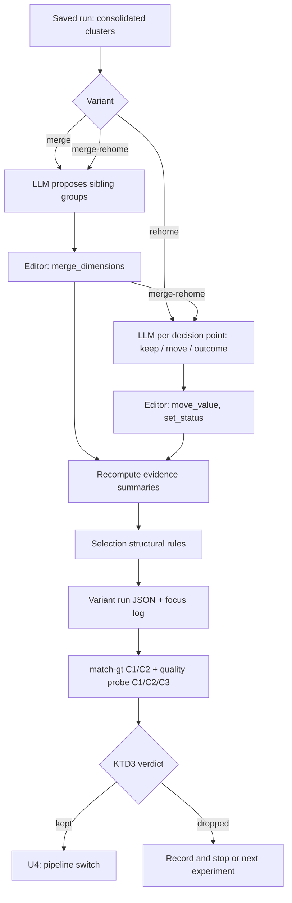

# Decision-Focus Pass - Plan

## Goal Capsule

- **Objective:** test, offline and one experiment at a time, whether a post-consolidation pass brings C1/C2 decision points closer to the expert decisions. Keep the pass only on evidence; if kept, add it to the pipeline behind a switch.
- **Authority:** Requirements (R) own product behavior. Key Technical Decisions (KTD) own mechanism. Units carry only local deltas.
- **Execution profile:** offline experiments on saved runs first. No full pipeline run happens in this plan.
- **Stop conditions:**
  - Stop after any experiment whose variant fails KTD3, and report before starting the next one.
  - Stop before U4 unless an experiment passed KTD3.
- **Branch:** `feat/paper-and-experiments`.

---

## Product Contract

### Summary

Add a decision-focus pass with two operations, applied to saved runs:
- **merge:** merge sibling decision points that answer parts of one design decision;
- **rehome:** move values to the decision point whose question they answer, and turn goals and principles into outcomes.

Score each variant against the expert models, and keep only what improves alignment. Integrate a kept variant as a switchable pipeline stage, before the freeze and the C1/C2/C3 re-runs.

### Problem Frame

The 2026-10-08 quality probe found that 20–31% of candidate values answer a different question than their decision point, and that only 23–53% of decision points are focused. Delve also extracts more decision points than the experts: C1 has 30 against 10 (paper view) / 28 (model view), and C2 has 19 against 7.

The baseline scores show the consequence: recall is high but precision is low at both levels, and on C2 a third of the matched values sit under the wrong decision point. The generation, update and review prompts already ask for focused decision points, so more prompt text is unlikely to help.

**Baselines** (saved runs, `--match-gt` with the luna judge, scored 2026-10-05):

| Run | View | Dimensions vs. decisions | Decision P / R / F1 (strict) | Decision F1 (lenient) | Option P / R / F1 | Exact R | Placement |
|---|---|---|---|---|---|---|---|
| C1 `c1-u7b-tools_taxonomy_20261005_122709` | paper | 30 vs. 10 | 0.45 / 1.00 / 0.63 | 0.87 | 0.38 / 0.79 / 0.51 | 0.16 | 0.82 |
| | model | 30 vs. 28 | 0.77 / 0.82 / 0.79 | 0.88 | 0.58 / 0.75 / 0.66 | 0.21 | 0.86 |
| C2 `c2-u7b-tools-norelevance_taxonomy_20261005_110747` | paper | 19 vs. 7 | 0.32 / 0.86 / 0.46 | 0.64 | 0.41 / 0.91 / 0.56 | 0.26 | 0.67 |
| | model | 19 vs. 7 | 0.37 / 1.00 / 0.54 | 0.69 | 0.42 / 0.90 / 0.57 | 0.27 | 0.68 |

### Key Decisions

- **Explore the fix with evidence before the freeze.** (session-settled: user-directed — chosen over skipping the fix and reporting granularity as a limitation: the user wants evidence that decision points can move closer to the ground truth.) Governs R1, R5, R6.
- **C1 is judged on its model view.** (session-settled: user-approved — chosen over paper-view-primary and "neither view may drop": the replication model is the authors' complete model; the paper view is a reported subset.) Governs R6.

### Requirements

**Offline variants**
- R1. Each experiment produces a variant of a saved run (`-merge`, `-rehome`, `-merge-rehome`) without re-running the pipeline, for C1, C2 and C3.
- R2. The merge pass merges decision points that a practitioner would document as one design decision.
- R3. The rehome pass moves each value to the decision point whose question it answers, and reclassifies goals and principles as outcomes.
- R4. A variant re-applies selection's structural rules and recomputes each decision point's evidence summary.

**Evaluation**
- R5. Each variant is scored with the same matcher settings, judge and cache as its baseline; C3 gets the quality probe only (no ground truth).
- R6. Each experiment ends with a keep/drop verdict under KTD3, recorded in a dated results document before the next experiment starts.
- R7. The pass's prompts use the use case and the taxonomy only, never the expert models.

**Integration (only if a variant is kept)**
- R8. A `taxonomy.decision_focus` switch runs the kept pass in the pipeline after consolidation and before selection; the off setting is an ablation.

### Success Criteria

- A variant is kept under KTD3, which is the single keep/drop rule.
- On C2, placement rises above the 0.67 / 0.68 baseline for any kept variant that includes rehome.

### Scope Boundaries

- **Out:**
  - Splitting decision points. It adds decision points and works against decision precision. It returns only as a conditional experiment E4 (see Open Questions).
  - The evidence-link pipeline.
  - The 10-05 granularity rule in `taxonomy_tools.md`.
  - New prompt text in generation, update or review.
  - Changes to the minimum-support settings.
  - C3 corpus and configs: changing them after seeing output would be tuning to the result.
- **Deferred to follow-up work:**
  - The full C1/C2/C3 re-runs (three seeds) after the freeze.
  - Re-deriving the C3 design points and probe on the new runs.

### Open Questions

- **Deferred:** run E4 (split) only if E1–E3 leave clear bundles that the probe still flags. Decide after E3.
- **Deferred:** should value consolidation run again after a merge, to fold near-duplicate values that now share a decision point? Measure duplicates in the E1 variant first; add it only if they affect option precision.

---

## Planning Contract

### Key Technical Decisions

- KTD1. **A separate step after consolidation, with structured proposals applied through the editor.** Each pass asks the generation LLM for a structured proposal:
  - merge: one call over all decision points;
  - rehome: one call per decision point, all on the same snapshot.

  The code applies the proposals through `TaxonomyEditor` in review mode (`merge_dimensions`, `move_value`, `set_status`), which validates each operation and records rejections. This is not the minibatch tool loop: that loop expects batch citations, and a post-hoc pass has no batch. Structured proposals are also cheaper and testable with a stub model.
- KTD2. **Offline A/B on the saved runs.** Comparing a variant with its own base run removes run-to-run variation. The variant tool follows the `benchmark/selection_variant.py` pattern and writes a sibling `<name>-<variant>_taxonomy_<ts>.json`.
- KTD3. **Keep/drop rule, fixed before E1 is scored.** (session-settled: user-approved — chosen over the 10-08 rule without recall, placement or effect-size guards: one-to-one alignment rewards over-merging, and a single noisy pass could otherwise decide.) A variant is kept only if, on C2 (paper and model view) and C1 (model view):
  - option precision or option F1 rises by at least 0.03;
  - option recall drops by at most 0.03;
  - strict decision F1 does not drop;
  - strict decision recall does not drop;
  - C2 placement does not drop; for a variant that includes rehome, C2 placement rises.

  A gain smaller than what the re-judged pairs could explain (KTD6) makes the verdict **inconclusive**, not kept. C1's paper view is reported but does not veto (see Key Decisions). The quality probe's focused rate is reported but does not decide: it uses the same LLM and similar criteria, so it would partly confirm itself.
- KTD4. **Integration as an ablatable stage.** A kept pass runs behind `taxonomy.decision_focus` (default on), is recorded in the run record (P13), and is logged in the evaluation frame's "Changes after scores were seen" log in `benchmark/README.md`. The off setting is an ablation for the paper.
- KTD5. **Experiments one at a time, in a fixed order.** (session-settled: user-directed — chosen over building all passes and scoring them together: each step should produce evidence before the next.) The order is E1 merge → E2 rehome → E3 merge then rehome, then E4 split only if needed. A later experiment does not start until the earlier one has a recorded verdict.
- KTD6. **Score with the matcher as implemented, and control for judge noise.** (session-settled: user-directed — chosen over exact-only scoring: same, broader and narrower count as matches, with exact recall reported alongside.) The matcher serializes each value with its parent decision point, so a moved or merged value gets new judge calls rather than cached labels. Each results document therefore reports:
  - how many pairs were re-judged;
  - how many pairs whose texts did not change flipped label, split by how each label was produced (judge, cache, or the matcher's nearest-neighbour rule).

  Only judge-to-judge changes on unchanged pairs indicate judge or cache inconsistency, and they should be zero. Other transitions come from the matcher's nearest-neighbour routing, which shifts when the set of values changes. `benchmark/focus_compare.py` computes these counts; a no-change C2 variant reproduced the baseline exactly (0 re-judged pairs, 0 label changes).
- KTD7. **The merge pass favors fewer, broader decision points only when the options answer one choice.** Its prompt keeps the existing rule that "how to detect" and "how to mitigate" are separate decisions (as in `prompts/dimension_merge.md`). A merged group needs a stated shared question, and the editor rejects merges that create a duplicate name.

### High-Level Technical Design

### Sequencing

U1 → U2 → U3 runs once per experiment (E1, then E2, then E3). U4 runs only after an experiment passes KTD3.

### Risks

- **Re-fragmentation or over-merging.** A merge can join decisions the experts keep apart. KTD3's decision-recall guard catches this; decision F1 alone would not, because one-to-one alignment rewards fewer decision points.
- **Self-grading.** luna both edits and judges. The ground-truth scores decide, not the probe.
- **Judge noise.** Changed texts are re-judged, and the judge choice has moved C2's score by about 0.2 before. KTD6 makes the noise visible.
- **Moved values keep their evidence links.** The C3 attested design points must be re-derived, not reused.
- **Development exposure.** Iterating on C1/C2 is tuning on the evaluation cases. The paper already discloses this (draft §4.7); every variant and verdict is recorded.

---

## Implementation Units

### U1. Decision-focus passes

- **Goal:** the merge and rehome passes, applied to a list of decision points.
- **Requirements:** R2, R3, R4, R7; KTD1, KTD7.
- **Dependencies:** none.
- **Files:**
  - `src/taxonomy_generator/nodes/decision_focus.py` (new);
  - `src/taxonomy_generator/prompts/decision_focus_merge.md`, `src/taxonomy_generator/prompts/decision_focus_rehome.md` (new), registered in `src/taxonomy_generator/prompts/__init__.py`;
  - proposal schemas in `src/taxonomy_generator/schemas.py`;
  - `tests/unit_tests/test_decision_focus.py` (new).
- **Approach:**
  1. Merge pass: one structured call lists every decision point (id, name, question, a sample of value labels); the proposal is a list of groups, each with a shared question, a name and a description.
  2. Rehome pass: per decision point, one structured call gives its values plus the list of all decision points; the proposal labels each value `keep`, `move` (with a target id) or `outcome`.
  3. Apply each proposal with `TaxonomyEditor(review=True)` and collect applied and rejected operations into a focus log.
  4. Recompute each decision point's evidence summary from its values, as `nodes/evidence_linker.py` does at the end of linking (codes, documents, sources).
  5. The model is passed in, so tests use a stub.
- **Patterns to follow:** `nodes/dimension_merger.py` (structured output, per-call failure keeps things unchanged, use case as a prompt partial); `prompts/dimension_merge.md` (decision rules).
- **Test scenarios:**
  - A stub proposal merging two decision points yields one decision point holding both sets of values, with relations redirected.
  - A merge proposal naming an unknown id, or a name that duplicates another decision point, is rejected and logged; the taxonomy is unchanged for that group.
  - A rehome proposal moves a value to the named decision point; its old id resolves through the editor alias.
  - A `move` to a nonexistent decision point is rejected and logged; the value stays.
  - An `outcome` proposal sets the value's status to outcome.
  - A failed LLM call for one decision point leaves that decision point unchanged and the others processed.
  - After moves, evidence summaries match the values' `supporting_doc_ids` (documents and distinct sources).
  - The prompts contain the use case and the taxonomy and no ground-truth text.
- **Verification:** the unit tests pass, and both passes run on a fixture without a network.

### U2. Offline variant tool

- **Goal:** build a variant of a saved run for one experiment.
- **Requirements:** R1, R4; KTD2.
- **Dependencies:** U1.
- **Files:**
  - `benchmark/focus_variant.py` (new);
  - `tests/unit_tests/test_focus_variant.py` (new).
- **Approach:**
  1. Read a saved run, take its final consolidated clusters (`iterations[-1].clusters`) and the study config.
  2. Apply the requested pass sequence (`merge`, `rehome`, or `merge-rehome`) with the config's generation LLM and use case.
  3. Re-apply `split_by_support` and `split_by_candidates` to build `selected_clusters` and `dropped_dimensions`.
  4. Write `<name>-<variant>_taxonomy_<ts>.json` next to the run. It records `derived_from` (variant, model, date) and the focus log.
- **Patterns to follow:** `benchmark/selection_variant.py` and its test.
- **Test scenarios:**
  - With a stub pass, the written file keeps the run's other fields and replaces `selected_clusters` and `dropped_dimensions`.
  - The output name carries the variant suffix and the original timestamp, so `--match-gt` and the sibling discovery find it.
  - A decision point that falls below minimum support after a move is dropped with a recorded rationale.
  - A path that is not a saved taxonomy exits with code 2.
- **Verification:** running it on the C2 base run writes a variant that `python main.py --match-gt` accepts.

### U3. Experiments E1–E3: scoring and verdicts

- **Goal:** run each experiment, score it, and record the verdict.
- **Requirements:** R5, R6; KTD3, KTD5, KTD6.
- **Dependencies:** U2.
- **Files:**
  - decision-focus A/B results document, outside this repository (new; one document, one section per experiment);
  - the variant runs and their `*_gt_metrics.json` beside the base runs (untracked, like the base runs).
- **Approach:** per experiment, in order:
  1. Build the C1, C2 and C3 variants with U2.
  2. Run `--match-gt` on C1 and C2 with the same settings and judge cache as the baselines.
  3. Run the quality probe with the luna judge on all three.
  4. Compute the KTD6 counts: re-judged pairs, and label flips on unchanged pairs.
  5. Write the results section: baseline vs. variant table (the columns of the baselines table), decision-point counts, the KTD6 counts, the probe rates, examples of applied merges and moves, and the KTD3 verdict.
  6. Stop and report to the author before the next experiment.
- **Execution note:** one experiment at a time, never in parallel (API rate limit). E3 runs only after E1 and E2 have verdicts.
- **Test expectation:** none; this unit runs experiments. Correctness rests on U1/U2 tests and on the matcher's existing tests.
- **Verification:** each experiment has a results section with a verdict, and the author has seen it before the next experiment starts.

### U4. Pipeline integration (only if a variant passes KTD3)

- **Goal:** run the kept pass inside the pipeline, behind a switch.
- **Requirements:** R8; KTD4.
- **Dependencies:** U3 with at least one kept variant; the P13 run record (pre-freeze to-do list §4, outside this repository).
- **Files:**
  - `src/taxonomy_generator/nodes/value_consolidator.py` (the pass runs at its end);
  - `src/taxonomy_generator/settings.py`, `src/taxonomy_generator/configuration.py` (switch);
  - `config.yaml` (documented setting);
  - the C1/C2/C3 study configs under `examples/`;
  - `src/taxonomy_generator/state.py` and `main.py`, if the focus log is saved with the run;
  - `benchmark/README.md` (change log);
  - `tests/unit_tests/test_decision_focus.py` (graph-level tests).
- **Approach:**
  1. Run the kept pass sequence at the end of value consolidation (after evidence linking and dropping unsupported values), behind `taxonomy.decision_focus`. A separate graph node would add an entry to the run's append-only iteration list and break iteration numbering in reports.
  2. Save the focus log with the run, following the four-step recipe in `docs/solutions/architecture-patterns/surface-langgraph-node-output-through-state-schema-to-cli-and-report.md`.
  3. Add the frame change-log entry.
- **Test scenarios:**
  - With the switch off, the graph produces the same clusters as before (no LLM call from the pass).
  - With the switch on and a stub model, the pass runs once after consolidation and selection sees its output.
  - The focus log reaches the saved taxonomy JSON.
  - Study configs load with the new key.
- **Verification:** the unit tests pass, and a configuration with the switch off reproduces the current behavior.

---

## Verification Contract

| Gate | Command (from the repo root, `taxonomy` conda env) | Applies to |
|---|---|---|
| Unit tests | `python -m pytest tests/unit_tests -q` | U1, U2, U4 |
| Variant build | `python benchmark/focus_variant.py <run>_taxonomy_<ts>.json --config <study config> --variant <merge\|rehome\|merge-rehome>` | U3 |
| Ground-truth scores | `python main.py --match-gt <variant>_taxonomy_<ts>.json --gt benchmark/<case>/gt --config <study config>` | U3 (C1, C2) |
| Quality probe | `python benchmark/quality_probe.py <variant>_taxonomy_<ts>.json --corpus <case>_corpus.json --judge openai/gpt-5.6-luna` | U3 (C1, C2, C3) |

The variant command's flag names are fixed in U2; the line above shows its intended shape.

---

## Definition of Done

- U1 and U2 are merged with passing tests.
- E1, E2 and E3 each have a results section with a KTD3 verdict, in the results notes outside this repository.
- If a variant was kept: U4 is merged, the switch is on in the study configs, and the change log has its entry. If none was kept: the results document states it, and the paper draft treats granularity as a finding and a threat.
- No experimental code from dropped variants is left in the diff beyond the switchable passes and their tests.
- The pre-freeze to-do list entry for this pass reflects the outcome.

---

## Appendix

### Dimension granularity (noted 2026-10-08)

| Case | Delve dimensions | Expert decisions |
|---|---|---|
| C1 | 30 | 10 (paper view) / 28 (model view) |
| C2 | 19 | 7 |
| C3 (first run, 48 passages) | 22 | no ground truth |

- **Two causes:**
  - Corpus effects: sources with operational or client-side detail yield single-system decision points (C3: four Spokes operations and six Scalar client decision points).
  - C3's minimum support of 1: five single-source decision points survive.
- **A cap is not the fix.** `max_num_clusters` forces broad topics that bundle decisions, and changing C3's settings after seeing output would be post-hoc tuning.
- **Presentation only, meanwhile:** the wiki marks core dimensions and has core-only filters.

### Approximate cost of the later re-runs (per seed)

C1 about 17.5M tokens, C2 about 10.5M, C3 about 1.5M. Runs happen one at a time because of the API rate limit.
