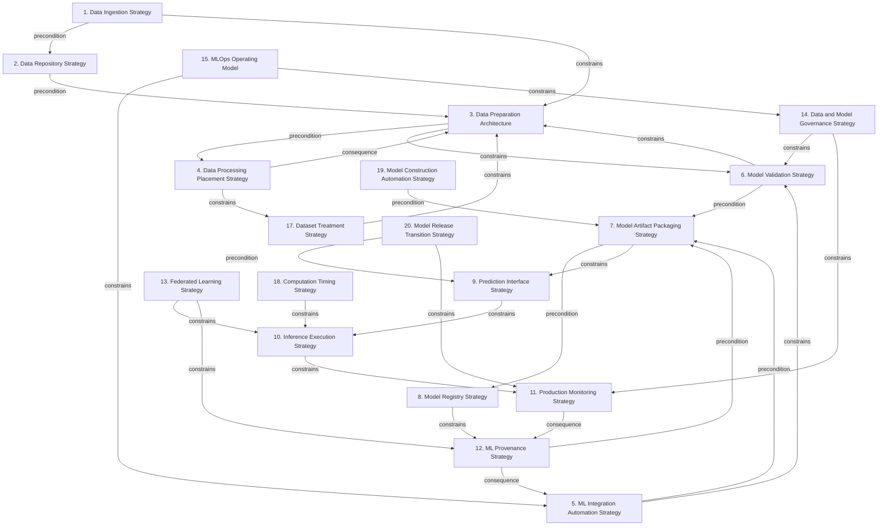

# Grounded Theory Report

## Narrative Summary

This taxonomy identifies the architectural design decisions practitioners face when designing and implementing machine learning systems across the machine learning workflow—from acquiring and preparing data, through constructing and validating models, to releasing, operating, and governing them in production. For each decision, the taxonomy records the alternative options practitioners use or consider and the quality attributes, constraints, and practical concerns that influence their choices.

The 20 dimensions cover the workflow’s major architectural concerns. They include how data is acquired, stored, prepared, and processed; how integration and model-building work is automated; how models are validated, packaged, registered, and exposed for prediction; and how inference is executed and monitored after deployment. They also address machine learning provenance, federated learning, data and model governance, and the machine learning operations (MLOps) operating model. Dataset treatment, computation timing, model construction automation, and model release transition further capture decisions about preparing data, scheduling computation, constructing models, and promoting or reverting models in production.

The resulting taxonomy contains 118 distinct values across these 20 dimensions; no draft values were merged. Evidence links 946 of 1,826 open codes to a value, and 231 of 258 documents support at least one value. The relationship diagram and dimension catalog provide the detailed view of how these decision areas and their alternatives are represented in the practitioner literature.

## Dimension Relationship Diagram

## Dimension Catalog

### 1. Data Ingestion Strategy

The mechanisms and timing used to acquire source, enterprise, event, or analytical data.

**Values:**

- **Messaging-queue ingestion** — Durable queues deliver acquired source data.
- **Query-based ingestion** — Pipelines query source systems for data.
- **Event-based ingestion** — Events drive source-data acquisition and processing.
- **API-based ingestion** — Services or APIs provide source data or features.
- **Change-data-capture ingestion** — Source changes are propagated through CDC.
- **Scheduled ingestion** — Acquisition runs periodically.
- **Continuous enterprise-data transfer** — Enterprise data subsets are continuously transferred to cloud processing.
- **Automated business-data collection** — Business data collection is automated when existing access is insufficient.

**Outgoing relations:**

- **precondition** → Data Repository Strategy (#2): Acquired data is required before persistence and preparation.
- **constrains** → Data Preparation Architecture (#3): Ingestion choices determine storage, freshness, and downstream processing requirements.

### 2. Data Repository Strategy

The persistence arrangement, integration scope, lifecycle, and mutability of data retained for ML work.

**Values:**

- **Persistent data repository** — Integrated data is retained for discovery, development, and downstream use.
- **Unified data layer** — A common data layer integrates lifecycle data access and processing.
- **Immutable raw-data persistence** — Original raw inputs are retained without mutation for traceability and replay.

**Outgoing relations:**

- **precondition** → Data Preparation Architecture (#3): Persisted data supplies material for preparation and model development.
- **constrains** → #16 _(target excluded from this view)_: Repository lifecycle and mutability requirements influence storage technology.

### 3. Data Preparation Architecture

The architectural organization of cleansing, transformation, enrichment, feature engineering, and input preprocessing before modeling.

**Values:**

- **Dedicated feature-engineering pipeline** — A reusable pipeline prepares raw data and features.
- **Analyst-managed preprocessing** — Analysts preprocess extracted data.
- **Reusable scripted transformations** — Transformations are implemented as reusable scripts or functions.
- **Automatic preprocessing** — Automation selects preprocessing for data-quality conditions.
- **Integrated cleansing and feature enrichment** — Integration cleanses, transforms, and enriches data for later ML processing.
- **Input dataset preprocessing** — The input dataset is preprocessed before training.

**Outgoing relations:**

- **precondition** → Data Processing Placement Strategy (#4): Preparation produces artifacts consumed by training and serving.
- **constrains** → Model Validation Strategy (#6): Preparation choices influence validation schemas and feature consistency.

### 4. Data Processing Placement Strategy

The computational placement, distribution, and partitioning used to execute preparation and feature workloads.

**Values:**

- **Distributed data preparation** — Distributed processing handles large-scale preparation.
- **External cluster execution** — Heavy calculations are offloaded to external clusters.
- **Within-pipeline data partitioning** — Pipeline data is partitioned across processors or servers.
- **Dedicated dataset pipelines** — Each dataset is processed by an independent pipeline.

**Outgoing relations:**

- **consequence** → Data Preparation Architecture (#3): Execution placement responds to preparation workload characteristics.
- **constrains** → Dataset Treatment Strategy (#17): Placement affects how dataset treatment is implemented.

### 5. ML Integration Automation Strategy

The integration trigger and automation level used to build, test, and package changes to ML workflows.

**Values:**

- **Continuous integration** — Changes are integrated frequently.
- **Commit-triggered CI pipeline** — Commits trigger building, testing, and packaging.
- **Pull-request CI/CD pipeline** — Pull requests trigger automated ML pipeline execution and feedback.
- **Manual ML workflow** — Data, training, validation, and transitions are performed manually.
- **CI omission** — Infrequent workflows explicitly omit CI.

**Outgoing relations:**

- **precondition** → Model Artifact Packaging Strategy (#7): Automated integration produces artifacts for release.
- **constrains** → Model Validation Strategy (#6): Integration automation determines when validation occurs.

### 6. Model Validation Strategy

The data, feature, model, policy, and service tests used to establish correctness and deployment readiness.

**Values:**

- **Automated schema and domain validation** — Data and feature schemas and domain values are checked automatically.
- **Training-derived serving schema** — Training statistics define expectations for serving.
- **Feature-creation unit testing** — Feature-creation code is tested for correctness and regression.
- **Feature predictive-importance testing** — Feature predictive power is tested against alternatives.
- **Policy-compliance pipeline checks** — Policies such as GDPR are checked programmatically in development and production.
- **Automated model validation** — New models are validated before deployment.
- **Secret test-set evaluation** — A hidden test set gates model deployment.
- **Prediction-service contract testing** — Prediction APIs are checked for input and response compatibility.
- **Prediction-service load testing** — Throughput and latency are tested under load.

**Outgoing relations:**

- **precondition** → Model Artifact Packaging Strategy (#7): Validation evidence is required before artifact release.
- **constrains** → Data Preparation Architecture (#3): Validation requirements shape preparation schemas and feature logic.

### 7. Model Artifact Packaging Strategy

The packaging, serialization, dependency capture, and interoperability format used for deployable models.

**Values:**

- **Packaged model artifact** — A model is saved as a file for later loading.
- **Containerized deployment artifact** — A versioned container packages the production environment.
- **Execution-environment dependency capture** — Runtime dependencies are saved with persisted models.
- **Model serialization format** — Framework-specific formats include Pickle, POJO, MOJO, MLeap, Protocol Buffers, TorchScript, HDF5, and Core ML.
- **Model-format interoperability** — Open and cross-framework formats support deployment interoperability.

**Outgoing relations:**

- **precondition** → Model Registry Strategy (#8): A packaged artifact is required before release transition.
- **constrains** → Prediction Interface Strategy (#9): Artifact format and dependencies constrain serving runtimes.

### 8. Model Registry Strategy

The registration, identification, metadata, lifecycle-stage, and discoverability mechanisms applied to model artifacts.

**Values:**

- **Centralized model registry** — A registry manages published artifacts and lifecycle information.
- **Published-model metadata capture** — Registration records publishers, changes, timing, and deployment metadata.
- **Model-stage promotion tracking** — Development, production, and archival stages are tracked.
- **Name-and-version identification** — Models are identified through names and versions.
- **Metadata-tag model search** — Tags support model discovery and filtering.
- **Externally trained model registration** — Models trained outside the workspace can be registered.
- **Deletion protection for active models** — Actively deployed models are protected from deletion.

**Outgoing relations:**

- **precondition** → #22 _(target excluded from this view)_: Registry decisions precede release and transition decisions.
- **constrains** → ML Provenance Strategy (#12): Registry metadata supports provenance and lifecycle traceability.

### 9. Prediction Interface Strategy

The interaction and application-integration form through which users or systems request predictions.

**Values:**

- **Real-time inference endpoint** — A synchronous endpoint serves predictions.
- **REST API serving interface** — Prediction functionality is exposed through REST.
- **Microservice model integration** — An independent ML service integrates with a product.
- **Monolithic application architecture** — ML functionality is integrated into a monolithic application.
- **Front-end prediction gateway** — A front-end applies domain logic before calling model APIs.
- **Business-facing data product** — Models are packaged as applications or data products for business users.
- **Threshold-based prediction decision** — A score is converted into an action using a configured threshold.

**Outgoing relations:**

- **constrains** → Inference Execution Strategy (#10): Interface form constrains latency, hosting, and request handling.

### 10. Inference Execution Strategy

The runtime placement, timing, and feature-query behavior used to execute deployed predictions.

**Values:**

- **Serverless-function deployment** — Cloud-managed functions host inference.
- **Container-based prediction API** — A container hosts the prediction API.
- **Kubernetes model serving** — Models run on Kubernetes or dedicated servers.
- **Asynchronous feature derivation** — Feature computation runs asynchronously when a short delay is acceptable.
- **Synchronous precomputed feature queries** — Synchronous queries use precomputed features for immediate transaction decisions.
- **Precomputed-result fallback** — A previously computed result is used when fresh computation is unavailable.
- **Mobile or enterprise application deployment** — Data products are deployed to mobile or enterprise applications.

**Outgoing relations:**

- **constrains** → Production Monitoring Strategy (#11): Execution technology and timing constrain capacity, latency, and cost.

### 11. Production Monitoring Strategy

The operational, data-quality, predictive, fairness, interpretability, and business signals collected after deployment.

**Values:**

- **Production telemetry** — Deployment and API layers emit monitoring telemetry.
- **Predictive-quality monitoring** — Precision, recall, F1, and served-data quality are monitored.
- **Prediction-bias monitoring** — Statistical bias is measured across prediction slices.
- **Model interpretability integration** — Interpretability information is integrated into model operation or review.
- **Model monitoring with baselines** — Baselines are generated and model behavior is monitored.
- **Low-confidence human review loop** — Uncertain predictions are routed to human review.
- **Private single-user review workforce** — A private workforce containing the author performs review tasks.
- **Unified observability stack** — Operational and model signals use a common observability stack.
- **Software-metrics-only monitoring** — Monitoring limited to software metrics is insufficient.
- **Business-KPI-only monitoring** — Relying only on downstream business KPIs is insufficient and too late.

**Outgoing relations:**

- **consequence** → ML Provenance Strategy (#12): Monitoring evidence can initiate retraining or corrective action.
- **constrains** → #22 _(target excluded from this view)_: Production evidence constrains promotion, rollback, and release decisions.

### 12. ML Provenance Strategy

The metadata and lineage records used to reproduce, compare, audit, resume, and trace ML executions and artifacts.

**Values:**

- **ML metadata store** — Pipeline executions are recorded for lineage, reproducibility, debugging, and comparison.
- **Pipeline-run record tracking** — Pipeline runs retain versions, parameters, timing, executors, and outputs.
- **Pipeline resumption from completed-step artifacts** — Pipelines resume from the most recent completed step.
- **Training-run snapshot capture** — Code, data, and compute used for training are snapshotted.
- **Git code provenance tracking** — Repository, branch, and commit are recorded for ML code.
- **Dataset tracking and versioning** — Datasets are tracked, profiled, and versioned.
- **Training and testing metric recording** — Metrics support comparison with previous models.

**Outgoing relations:**

- **precondition** → Model Artifact Packaging Strategy (#7): Release governance depends on artifact and execution provenance.
- **consequence** → ML Integration Automation Strategy (#5): Build and execution processes generate provenance records.

### 13. Federated Learning Strategy

The placement of models, personal data, training, aggregation, and update scheduling across devices and servers.

**Values:**

- **Hybrid-serving federated architecture** — A server model coexists with separate user-side models.
- **General server model initialization** — A general server model initializes device-specific models.
- **On-device user-specific model training** — Devices train specialized models locally.
- **Local personal-data retention** — Personal training and testing data remains on devices.
- **Server-side model-update aggregation** — The server aggregates model updates from devices.
- **Idle-and-charging update scheduling** — Updates occur when devices are idle, connected, and charging.
- **TensorFlow Federated framework** — TensorFlow Federated supports distributed learning under device constraints.

**Outgoing relations:**

- **constrains** → Inference Execution Strategy (#10): Federated placement determines where inference and training computation occur.
- **constrains** → ML Provenance Strategy (#12): Distributed training constrains provenance and update tracking.

### 14. Data and Model Governance Strategy

The access-control, information-governance, compliance, and operational responsibility arrangements governing ML data and models.

**Values:**

- **Context-sensitive access control** — Access differs by information sensitivity and user context.
- **Data-science monitoring ownership** — Data-science teams own deployed-model monitoring.
- **Cross-functional ML monitoring responsibility** — Technical, business, support, and stakeholder roles share monitoring responsibility.
- **Distributed input-data ownership** — Data, operations, and product teams share responsibility for input changes.
- **Production accountability for business value** — Teams are accountable for demonstrating production business value.

**Outgoing relations:**

- **constrains** → Model Validation Strategy (#6): Governance requirements determine validation and policy checks.
- **constrains** → Production Monitoring Strategy (#11): Accountability determines who reviews production evidence and acts on it.

### 15. MLOps Operating Model

The platform, staffing, ownership, and customization arrangement used to manage ML lifecycle work.

**Values:**

- **End-to-end MLOps solution** — One solution manages building, training, deployment, and monitoring.
- **Custom-built MLOps ecosystem** — An organization assembles its own tool ecosystem.
- **Fully managed MLOps services** — Managed services support lifecycle execution.
- **Dedicated model-operations team** — Engineers manage models and deployments.
- **Out-of-the-box MLOps solution** — A prebuilt platform replaces dedicated operations staffing.
- **In-house ML infrastructure** — Organizations build and maintain their own ML platforms.
- **Pre-built ML platform** — A prebuilt platform supplies lifecycle capabilities.
- **Dedicated operations staffing cost** — Operations staffing cost is reported as an outcome.
- **Infrastructure time to value** — Infrastructure construction time is reported as an outcome.

**Outgoing relations:**

- **constrains** → ML Integration Automation Strategy (#5): Operating-model choices constrain lifecycle automation and integration.
- **constrains** → Data and Model Governance Strategy (#14): Operating models determine ownership and accountability.

### 17. Dataset Treatment Strategy

The treatment applied to datasets for sampling, augmentation, splitting, and safe task-specific preparation.

**Values:**

- **Training-data augmentation** — Training data is expanded through sampling or transformations.
- **Dataset sanitization** — Dataset splits receive safe and task-specific preprocessing.

**Outgoing relations:**

- **constrains** → Data Preparation Architecture (#3): Dataset treatment constrains the preparation artifacts used for modeling.

### 18. Computation Timing Strategy

The timing mode used to compute features or results, ranging from immediate execution to delayed batch processing.

**Values:**

- **Online real-time computation** — Features or results are computed synchronously for immediate use.
- **Nearline computation** — Computation is delayed slightly to balance freshness and efficiency.
- **Offline batch computation** — Features or results are computed periodically in batches.

**Outgoing relations:**

- **constrains** → Inference Execution Strategy (#10): Computation timing determines the freshness and latency available to inference.

### 19. Model Construction Automation Strategy

The automation mechanism used to construct, tune, evaluate, and orchestrate model-building workflows.

**Values:**

- **Dedicated automated model-building service** — A service automatically builds models from prepared data.
- **Metric-driven model building** — Model construction or promotion is driven by measured metrics.
- **Automated hyperparameter-tuning scripts** — Scripts automate hyperparameter search and model tuning.
- **Orchestrator-centered ML workflow** — A central orchestrator coordinates model creation and updating.
- **Custom data-science automation scripts** — Recurring feature, training, and tuning tasks use custom scripts.
- **Boxed routine-modeling solutions** — Prepackaged solutions are rejected for recurring modeling automation.

**Outgoing relations:**

- **precondition** → Model Artifact Packaging Strategy (#7): Model construction automation produces artifacts that can be packaged and released.

### 20. Model Release Transition Strategy

The deployment, promotion, fallback, rollback, and production-traffic mechanisms used after model validation.

**Values:**

- **Manual model deployment** — Models are released manually.
- **Pipeline-based service deployment** — A pipeline deploys a trained model service.
- **Automated deployment and rollback** — A pipeline deploys or rolls back services.
- **Previous-model fallback** — The previous model remains available when a candidate is unsuitable.
- **Previous-model rollback** — The previous model is restored after degradation.
- **Progressive production traffic rollout** — Increasing portions of production traffic are directed to a new model while monitored.
- **Performance-gated promotion** — Measured performance determines whether a model is promoted.

**Outgoing relations:**

- **precondition** → Prediction Interface Strategy (#9): Release transitions determine which artifact the serving interface exposes.
- **constrains** → Production Monitoring Strategy (#11): Transition mechanisms determine production behavior available for monitoring.

## Discarded Dimensions

Dimensions considered during taxonomy generation but excluded from this view during dimension selection, judged not relevant to the stated use case:

- **16. Storage Technology Strategy** — Not a decision point: 1 candidate decision(s) (accepted/rejected/mixed values) besides outcomes; at least 2 required.

## Evaluation

_Observe-only LLM-as-judge scoreboard (judge: openai/gpt-5.6-luna). Pass flags are display-only — nothing gates on them._

| Criterion | Score | Pass | Reason |
|---|---|---|---|
| Orthogonality | 0.70 | ✓ | Most dimensions ask distinct questions, such as ingestion (1), repository choice (2), validation (6), packaging (7), release transition (20), and interface design (9). However, three overlaps remain: (1) Computation Timing Strategy (18) duplicates the timing and feature-computation choices in Inference Execution Strategy (10); rename 10 to focus on runtime placement and move values 10.4–10.6 to 18. (2) Data Preparation Architecture (3) overlaps Dataset Treatment Strategy (17), especially 3.6 and 17.2; move 3.6 to 17 and narrow 17 to dataset-level preprocessing/treatment, or otherwise assign those preprocessing values to only one dimension. (3) Data and Model Governance Strategy (14) overlaps MLOps Operating Model (15) through responsibility and ownership values 14.2–14.5 and 15.4; narrow 14 to access, governance, and compliance and move the operational responsibility choices to 15. |
| Clarity | 0.60 | ✓ | The taxonomy covers many decisions with generally understandable descriptions, such as computation timing (18), prediction interfaces (9), and production monitoring (11). However, several dimensions contain values that are difficult to distinguish. In Data Preparation Architecture (3), values 3.1 and 3.5 both describe integrated/reusable preparation pipelines, while 3.2 and 3.6 both describe generic preprocessing; merge the overlapping pairs or rename them to expose their concrete differences. In MLOps Operating Model (15), 15.1, 15.3, 15.5, and 15.7 substantially overlap around end-to-end, managed, or prebuilt platforms; merge redundant values and retain distinct platform/ownership alternatives. In Model Artifact Packaging Strategy (7), 7.1 is broad enough to overlap 7.3 and 7.4; rename 7.1 to clearly mean file-based packaging and reserve 7.4 for serialization formats. Value 20.1, Manual model deployment, is an actual decision alternative despite being marked outcome; reclassify it as a candidate status. Some descriptions, especially in 1 and 12, are terse and should be renamed or consolidated where overlapping labels such as scheduled/query-based ingestion and metadata-store/run-record tracking cannot be reliably separated. |
| Completeness | 1.00 | ✓ | No material coverage shortcoming is evident under this criterion. The taxonomy represents the major workflow areas with decision dimensions having multiple candidates: ingestion (1), repositories (2), preparation and processing (3, 4, 17, 18), model construction and validation (19, 5, 6), packaging and provenance (7, 12), deployment and inference (20, 9, 10), and production operation and governance (11, 13, 14, 15). Even the smallest dimensions, Data Repository Strategy (2) and Dataset Treatment Strategy (17), contain several candidate decisions. Forces are not required because the specified format cannot express them. |
| Use case alignment | 0.80 | ✓ | The taxonomy is broadly within scope: dimensions 1–13 and 17–20 cover ingestion, repositories, preparation, training automation, validation, packaging, release, serving, monitoring, and specialized deployment architectures. The main scope drift is dimension 14, “Data and Model Governance Strategy,” whose responsibility and accountability values (14.2–14.5) are organizational governance rather than architectural design decisions; retain only the access-control decision (14.1) or move these values into the operational dimension 15. Dimension 15, “MLOps Operating Model,” is partly relevant through platform choices (15.2, 15.3, 15.6, 15.7), but staffing and cost/time outcomes (15.4, 15.8, 15.9) are tangential to architectural decisions and should be moved to an existing operating/impact dimension or dropped. |
| No catch-alls | 1.00 | ✓ | No explicit catch-all dimensions or values appear. The taxonomy uses specific decision areas such as "Data Ingestion Strategy" (1), "Model Registry Strategy" (8), and "Production Monitoring Strategy" (11), with concrete alternatives rather than buckets named Other, Miscellaneous, General considerations, or Various techniques. No changes are needed for this criterion. |
| Axis vs. value | 0.30 | ✗ | Several dimensions do represent decisions, such as 1 Data Ingestion Strategy, 18 Computation Timing Strategy, and 20 Model Release Transition Strategy, but many dimensions combine multiple decision points while listing compatible practices rather than alternatives. Split 5 ML Integration Automation Strategy into CI adoption (5.1, 5.4, 5.5) and CI trigger choice (5.2, 5.3). Reorganize 6 Model Validation Strategy because values 6.1–6.9 are distinct test subtopics that can coexist, not options for one decision. Split 7 Model Artifact Packaging Strategy into packaging/dependency choices (7.1–7.3) and serialization/interoperability choices (7.4–7.5), preserving 7.5 as the outcome. Similarly, reorganize 12 ML Provenance Strategy and 14 Data and Model Governance Strategy, whose values describe separate lineage mechanisms and separate access, ownership, and accountability decisions rather than alternative answers to one question. Dimension 17 Dataset Treatment Strategy also combines augmentation and sanitization, which should not be treated as mutually exclusive alternatives. |
| One decision point | 0.30 | ✗ | The taxonomy contains many dimensions with multiple candidates, and outcome values are generally marked correctly, but numerous decision points combine different questions. For example, Data Ingestion Strategy (1) mixes transport mechanisms (1.1–1.5) with timing and collection approaches (1.6–1.8); split these into separate existing-content decision points. Data Repository Strategy (2) combines persistence, integration scope, and mutability (2.1–2.3), so separate those questions. Model Validation Strategy (6) mixes schema, feature, policy, model, and service testing; reorganize candidates into coherent validation questions, merging sibling test types where each group retains at least two candidates. Model Release Transition Strategy (20) combines deployment, fallback/rollback, traffic rollout, and promotion gating; split only into groups with at least two candidates or move values to the relevant existing decision points. Similar mixed-question problems occur in Prediction Interface Strategy (9), Inference Execution Strategy (10), Production Monitoring Strategy (11), Federated Learning Strategy (13), Governance (14), and MLOps Operating Model (15). No dimension has fewer than two candidate decisions, but the many broad, heterogeneous dimensions substantially reduce alignment with the required one-question-per-dimension structure. |
| Rejected-alternative handling | 0.90 | ✓ | The taxonomy consistently uses accepted, rejected, mixed, and outcome statuses, and most descriptions match their status. The main violation is value 20.1, "Manual model deployment," in dimension 20 "Model Release Transition Strategy": it is phrased as an alternative deployment choice, not an effect, so it must be changed from status "outcome" to the appropriate candidate-decision status (accepted, rejected, or mixed). The other outcome values, such as 7.5, 15.8, and 15.9, are appropriately phrased as effects. |
| Dimensional coverage | 0.90 | ✓ | The taxonomy places nearly all decision-bearing passages, including ingestion and immutable storage in dimensions 1–2 (s15_p03, s02_p03), AutoML and hyperparameter automation in dimension 19 (s19_p09, s17_p03, s18_p04), CI/CD and testing in dimensions 5–6 (s06_p14, s22_p12), packaging and reproducibility in dimensions 7 and 12 (s19_p09, s25_p02), and deployment, inference, and monitoring in dimensions 9–11 (s12_p07, s23_p10, s20_p03). Two passages cannot be placed: s13_p07 discusses choosing process methodologies such as ASUM-DM versus the IBM Cloud Garage/agile method and cultural change; add a process-methodology value to dimension 15, MLOps Operating Model, or add a dedicated process-strategy dimension. s10_p02 discusses product safeguards, anomaly detection, and choosing heuristics versus machine learning for fraud mitigation; add a risk-detection strategy dimension with values for product controls, anomaly detection, heuristics, and ML. |
| Candidate-decision coverage | 0.70 | ✓ | The taxonomy covers many adopted options, including ingestion modes in s15_p03 and s02_p03, AutoML and hyperparameter automation in s19_p09, s17_p03, and s18_p04, CI/CD and validation practices in s06_p14, serialization in s19_p09, and online/offline computation and monitoring in s12_p07 and s23_p10. Missing options include: add 'ASUM-DM process model' and 'IBM Cloud Garage Method' to dimension 15, MLOps Operating Model, supported by s13_p07; add 'relational SQL repository', 'distributed NoSQL/key-value repository', and a hybrid offline-plus-online computation option to dimensions 2, Data Repository Strategy, and 18, Computation Timing Strategy, supported by s12_p07; add 'mixed or hybrid architecture' to dimension 9, Prediction Interface Strategy, supported by s16_p07; add a Fraud Mitigation Strategy dimension with 'product changes', 'anomaly detection', and 'heuristic or ML detection', supported by s10_p02; and add 'automated repeated test execution' to dimension 6, Model Validation Strategy, supported by s22_p12. |

**Overall score:** 0.72 (mean of evaluated criteria)