# Grounded Theory Report

## Narrative Summary

This taxonomy identifies the architectural design decisions practitioners face when designing and implementing machine learning systems across the workflow—from data ingestion and processing, through model building and training, to production serving and operation—as documented in practitioner (gray) literature. Each of the 30 dimensions names one decision, while its values represent the alternative options practitioners use or consider. The choices are shaped by concerns such as data and model quality, latency, throughput, scalability, availability, recovery, resource use, security, access, portability, and operational control.

The dimensions cover how data is acquired, stored, processed, profiled, validated, labeled, and transformed into features; how models are selected, optimized, evaluated, trained, parallelized, updated, and represented; and how training and serving features, model artifacts, lineage, and release checks are managed. They also address development environments, infrastructure placement, delivery automation, serving architecture, deployment arrangements, packaging and runtime, serving platforms and hardware, prediction interaction, capacity and recovery, state storage, and operational monitoring. Together, these dimensions present the decision space practitioners navigate as they move from experimentation to dependable production operation. The accompanying relationship diagram and per-dimension catalog provide the detailed structure.

The consolidated taxonomy contains 344 draft values across the 30 dimensions. No values were merged, so all 344 remained distinct. Evidence linking assigned 1,127 of 1,377 open codes to a value, using a similarity threshold of at least 0.50, and all 196 documents support at least one value.

## Dimension Relationship Diagram

```mermaid
flowchart TB
    dim_5["5. Prediction Serving Interaction"]
    dim_7["7. ML Delivery Automation"]
    dim_8["8. Model Governance and Lineage"]
    dim_9["9. Operational Monitoring Strategy"]
    dim_13["13. Model Artifact Representation"]
    dim_15["15. Data Profiling and Validation"]
    dim_16["16. Data Storage Architecture"]
    dim_17["17. Training Execution Mode"]
    dim_18["18. Training Trigger Policy"]
    dim_23["23. Model Optimization Strategy"]
    dim_24["24. Pre-release Validation"]
    dim_25["25. Training Parallelization and Resilience"]
    dim_28["28. Training-Serving Feature Consistency"]
    dim_29["29. Serving Architecture Style"]
    dim_30["30. Serving Deployment Arrangement"]
    dim_31["31. Serving Capacity and Recovery"]
    dim_32["32. Feature and Model State Storage"]
    dim_34["34. Ground Truth and Labeling Strategy"]
    dim_35["35. Serving Platform and Hardware"]
    dim_36["36. Serving Packaging and Runtime"]
    dim_37["37. ML Infrastructure Placement"]
    dim_38["38. ML Development Environment"]
    dim_39["39. Data Ingestion Approach"]
    dim_40["40. Data Processing Path"]
    dim_41["41. Training Update Algorithm"]
    dim_42["42. Candidate-Model Search Execution"]
    dim_43["43. Feature Pipeline Architecture and Tooling"]
    dim_44["44. Feature Transformation Strategy"]
    dim_45["45. Model Evaluation Dataset Strategy"]
    dim_46["46. Model Evaluation Criteria and Instrumentation"]
    dim_5 -->|precondition| dim_29
    dim_5 -->|precondition| dim_30
    dim_5 -->|precondition| dim_31
    dim_5 -->|precondition| dim_32
    dim_5 -->|precondition| dim_35
    dim_5 -->|precondition| dim_36
    dim_5 -->|co_occurring| dim_8
    dim_7 -->|consequence| dim_8
    dim_7 -->|consequence| dim_9
    dim_8 -->|consequence| dim_45
    dim_8 -->|consequence| dim_46
    dim_8 -->|consequence| dim_34
    dim_8 -->|consequence| dim_23
    dim_8 -->|consequence| dim_24
    dim_8 -->|co_occurring| dim_7
    dim_8 -->|constrains| dim_5
    dim_9 -->|consequence| dim_45
    dim_9 -->|consequence| dim_46
    dim_9 -->|consequence| dim_34
    dim_9 -->|consequence| dim_23
    dim_9 -->|consequence| dim_24
    dim_9 -->|constrains| dim_7
    dim_9 -->|co_occurring| dim_37
    dim_9 -->|co_occurring| dim_38
    dim_9 -->|consequence| dim_17
    dim_9 -->|consequence| dim_18
    dim_13 -->|co_occurring| dim_8
    dim_15 -->|precondition| dim_17
    dim_15 -->|precondition| dim_18
    dim_15 -->|precondition| dim_25
    dim_15 -->|precondition| dim_41
    dim_15 -->|precondition| dim_42
    dim_15 -->|consequence| dim_39
    dim_15 -->|consequence| dim_40
    dim_17 -->|precondition| dim_45
    dim_17 -->|precondition| dim_46
    dim_17 -->|precondition| dim_34
    dim_17 -->|precondition| dim_23
    dim_17 -->|precondition| dim_24
    dim_17 -->|constrains| dim_29
    dim_17 -->|constrains| dim_30
    dim_17 -->|constrains| dim_31
    dim_17 -->|constrains| dim_32
    dim_17 -->|constrains| dim_35
    dim_17 -->|constrains| dim_36
    dim_18 -->|precondition| dim_45
    dim_18 -->|precondition| dim_46
    dim_18 -->|precondition| dim_34
    dim_18 -->|precondition| dim_23
    dim_18 -->|precondition| dim_24
    dim_18 -->|constrains| dim_29
    dim_18 -->|constrains| dim_30
    dim_18 -->|constrains| dim_31
    dim_18 -->|constrains| dim_32
    dim_18 -->|constrains| dim_35
    dim_18 -->|constrains| dim_36
    dim_23 -->|precondition| dim_8
    dim_23 -->|precondition| dim_5
    dim_24 -->|precondition| dim_8
    dim_24 -->|precondition| dim_5
    dim_25 -->|precondition| dim_45
    dim_25 -->|precondition| dim_46
    dim_25 -->|precondition| dim_34
    dim_25 -->|precondition| dim_23
    dim_25 -->|precondition| dim_24
    dim_25 -->|constrains| dim_29
    dim_25 -->|constrains| dim_30
    dim_25 -->|constrains| dim_31
    dim_25 -->|constrains| dim_32
    dim_25 -->|constrains| dim_35
    dim_25 -->|constrains| dim_36
    dim_28 -->|precondition| dim_17
    dim_28 -->|precondition| dim_18
    dim_28 -->|precondition| dim_25
    dim_28 -->|precondition| dim_41
    dim_28 -->|precondition| dim_42
    dim_28 -->|consequence| dim_39
    dim_28 -->|consequence| dim_40
    dim_29 -->|constrains| dim_5
    dim_29 -->|co_occurring| dim_7
    dim_30 -->|constrains| dim_5
    dim_30 -->|co_occurring| dim_7
    dim_31 -->|constrains| dim_5
    dim_31 -->|co_occurring| dim_7
    dim_32 -->|constrains| dim_5
    dim_32 -->|co_occurring| dim_7
    dim_34 -->|precondition| dim_8
    dim_34 -->|precondition| dim_5
    dim_35 -->|constrains| dim_5
    dim_35 -->|co_occurring| dim_7
    dim_36 -->|constrains| dim_5
    dim_36 -->|co_occurring| dim_7
    dim_37 -->|constrains| dim_29
    dim_37 -->|constrains| dim_30
    dim_37 -->|constrains| dim_31
    dim_37 -->|constrains| dim_32
    dim_37 -->|constrains| dim_35
    dim_37 -->|constrains| dim_36
    dim_37 -->|precondition| dim_9
    dim_38 -->|constrains| dim_29
    dim_38 -->|constrains| dim_30
    dim_38 -->|constrains| dim_31
    dim_38 -->|constrains| dim_32
    dim_38 -->|constrains| dim_35
    dim_38 -->|constrains| dim_36
    dim_38 -->|precondition| dim_9
    dim_39 -->|precondition| dim_43
    dim_39 -->|precondition| dim_44
    dim_39 -->|precondition| dim_28
    dim_39 -->|precondition| dim_15
    dim_39 -->|precondition| dim_16
    dim_40 -->|precondition| dim_43
    dim_40 -->|precondition| dim_44
    dim_40 -->|precondition| dim_28
    dim_40 -->|precondition| dim_15
    dim_40 -->|precondition| dim_16
    dim_41 -->|precondition| dim_45
    dim_41 -->|precondition| dim_46
    dim_41 -->|precondition| dim_34
    dim_41 -->|precondition| dim_23
    dim_41 -->|precondition| dim_24
    dim_41 -->|constrains| dim_29
    dim_41 -->|constrains| dim_30
    dim_41 -->|constrains| dim_31
    dim_41 -->|constrains| dim_32
    dim_41 -->|constrains| dim_35
    dim_41 -->|constrains| dim_36
    dim_42 -->|precondition| dim_45
    dim_42 -->|precondition| dim_46
    dim_42 -->|precondition| dim_34
    dim_42 -->|precondition| dim_23
    dim_42 -->|precondition| dim_24
    dim_42 -->|constrains| dim_29
    dim_42 -->|constrains| dim_30
    dim_42 -->|constrains| dim_31
    dim_42 -->|constrains| dim_32
    dim_42 -->|constrains| dim_35
    dim_42 -->|constrains| dim_36
    dim_43 -->|precondition| dim_17
    dim_43 -->|precondition| dim_18
    dim_43 -->|precondition| dim_25
    dim_43 -->|precondition| dim_41
    dim_43 -->|precondition| dim_42
    dim_43 -->|consequence| dim_39
    dim_43 -->|consequence| dim_40
    dim_44 -->|precondition| dim_17
    dim_44 -->|precondition| dim_18
    dim_44 -->|precondition| dim_25
    dim_44 -->|precondition| dim_41
    dim_44 -->|precondition| dim_42
    dim_44 -->|consequence| dim_39
    dim_44 -->|consequence| dim_40
    dim_45 -->|precondition| dim_8
    dim_45 -->|precondition| dim_5
    dim_46 -->|precondition| dim_8
    dim_46 -->|precondition| dim_5
```

## Dimension Catalog

### 5. Prediction Serving Interaction

The axis varies the temporal and communication contract by which predictions are requested, completed, delivered, and retrieved.

**Values:**

- **Synchronous online serving** — A caller submits a request and receives a prediction during the request interaction.
- **Asynchronous offline serving** — Large collections are scored as batch jobs, with results retrieved after completion.
- **Push-based score delivery** — Completed predictions are delivered to the caller through an independent notification.
- **Polling-based score retrieval** — The caller periodically checks a low-latency store for completed predictions.
- **Broker-based completion notification** — A message broker signals completion of offline scoring before consumers fetch results.
- **Model-version request routing** — Requests identify a model version and a router directs them to the corresponding model.
- **Cached offline predictions** — Precomputed predictions are cached to reduce access latency for repeated or relevant requests.
- **Prediction-request feature payload** — Including available contextual features directly in prediction requests.
- **Fresh recommendation results** — Serve recommendation outputs that rapidly reflect new data and user actions.
- **Low-latency recommendation serving** — Return recommendation results quickly enough to respond to interactions.
- **Three-way prediction input contract** — Supply predictions with model artifacts, processed data, and fresh live signals.
- **REST model invocation** — Request predictions from a remotely hosted model through a REST interface.
- **gRPC model invocation** — Request predictions from a remotely hosted model through gRPC.
- **Reduced fraud-response latency** — Streaming and real-time decisioning reduce the elapsed time from suspicious transaction detection to account blocking.

**Outgoing relations:**

- **precondition** → Serving Architecture Style (#29): The selected interaction contract determines serving components, routing, storage, and scaling requirements.
- **precondition** → Serving Deployment Arrangement (#30): The selected interaction contract determines serving components, routing, storage, and scaling requirements.
- **precondition** → Serving Capacity and Recovery (#31): The selected interaction contract determines serving components, routing, storage, and scaling requirements.
- **precondition** → Feature and Model State Storage (#32): The selected interaction contract determines serving components, routing, storage, and scaling requirements.
- **precondition** → Serving Platform and Hardware (#35): The selected interaction contract determines serving components, routing, storage, and scaling requirements.
- **precondition** → Serving Packaging and Runtime (#36): The selected interaction contract determines serving components, routing, storage, and scaling requirements.
- **co_occurring** → Model Governance and Lineage (#8): Serving interactions commonly depend on model versions and lifecycle states recorded in governance systems.

### 7. ML Delivery Automation

The axis varies the degree and mechanism of automation for experimentation, testing, orchestration, training, deployment, and infrastructure operations.

**Values:**

- **Manual RAD pipeline execution** — Preparation, training, validation, and testing are performed manually with exploratory tools such as notebooks.
- **Pull-request-triggered experiments** — Code changes submitted through pull requests automatically launch experiment execution.
- **Automated CI/CD pipeline** — Code, data, models, and pipelines are automatically built, tested, and deployed.
- **Event-triggered model deployment** — Data, code, monitoring, messages, or calendar events trigger training and deployment workflows.
- **Interdependent-task orchestration** — Feature engineering, training, and prediction tasks are scheduled and coordinated across compute infrastructure.
- **End-to-end MLOps automation** — Integration, testing, release, deployment, infrastructure management, and training are automated as one lifecycle.
- **MLOps platform automation** — An end-to-end platform automates technical tasks and reduces operational bottlenecks at scale.
- **Hypothesis-driven experimentation** — Short feedback cycles and explicit hypotheses guide experiments, learning, and backlog decisions.
- **Interactive development execution** — Practitioners execute workflow steps interactively during early development before automation increases.
- **Continuous integration pipeline** — An adopted continuous-integration pipeline supports implementation testing and delivery.
- **Continuous delivery pipeline** — Model releases are automatically delivered through a continuous delivery process.
- **Automated retraining-and-deployment pipeline** — Pipeline automation that retrains, validates, and deploys models from offline development.
- **Automated repeatable data preprocessing** — Repeatable automated preprocessing within retraining and deployment workflows.
- **Standalone boxed AutoML** — Adopt a packaged AutoML solution without embedding it in a broader data-science process.
- **CRISP-DM as insufficient for evolving ML** — Use CRISP-DM alone as the process model for rapidly changing data-science work.
- **Specialized-toolchain MLOps** — Assemble multiple specialized tools across pipeline, deployment, monitoring, and orchestration activities.
- **ML process model** — Adopt a structured process model with lifecycle activities, templates, guidelines, or implementation roadmaps.
- **Heavyweight Waterfall or V-Model process** — Use a heavyweight sequential process for ML delivery.
- **Manual model analysis** — Perform model analysis manually before or between workflow iterations.
- **Automated ML lifecycle management** — Automate training, deployment, retraining, and related lifecycle operations to reduce manual effort.
- **Continuous model training** — Train and retrain models continuously or frequently as data and operational conditions change.
- **Pipeline complexity from automated pre-deployment work** — Added deployment-pipeline complexity resulting from automating training and validation steps.
- **Single-command research-to-production delivery** — A single command automates delivery from research through production deployment.
- **Research-to-production lead time** — The elapsed time required to transfer a model from research into production affects delivery automation.
- **Experimental-phase project attrition** — Projects fail to progress from experimentation into operational production.
- **Human intervention burden** — Frequent manual intervention remains necessary across a specialized-tool MLOps lifecycle.
- **Lightweight data-science process** — Use a lightweight process model for data-science work.
- **Extended productization effort** — Productionizing ML artifacts requires substantially more time and multidisciplinary effort than initial creation.
- **Faster experimentation and deployment** — Reduce time required for ML experimentation, development, and production deployment.

**Outgoing relations:**

- **consequence** → Model Governance and Lineage (#8): Automated delivery creates lifecycle events, versions, and promotion records that governance systems must track.
- **consequence** → Operational Monitoring Strategy (#9): Automation enables recurring operation and monitoring rather than isolated manual model releases.

### 8. Model Governance and Lineage

The axis varies how models, code, data, metadata, versions, lifecycle stages, and deployment eligibility are recorded and controlled.

**Values:**

- **Self-contained model artifacts** — Artifacts contain the preprocessing and prediction components required to generate results.
- **Model-code-data lineage** — Relationships among models, training code, training data, and test data are tracked.
- **Centralized model registry** — Production candidates are published and managed in a central registry or hub.
- **Published-model metadata catalog** — The registry records identifiers, locations, datasets, metrics, and system or business metadata.
- **Model version tracking** — Versions and their publication dates are recorded for change management.
- **Lifecycle-stage promotion** — Artifacts are explicitly marked for development, staging, production, or archival stages.
- **Governance and audit metadata** — Registry records support auditability and regulatory requirements.
- **Shadow-mode model testing** — Candidate model changes are evaluated alongside production behavior before or during deployment.
- **Previous-model fallback and reversion** — Retain and restore a prior model when a new model serves too slowly or degrades predictive accuracy.
- **Version-chain responsibility pattern** — Assign responsibility across linked model, code, data, and deployment versions throughout the lifecycle.
- **Source-controlled pipeline implementation** — Keep pipeline and model implementation units in a source-code repository for controlled collaboration and reproducibility.
- **DVC-based data versioning** — Using DVC or comparable tooling to version datasets and reproduce training experiments.
- **Training-configuration recording** — Recording training configurations so experiments can be reproduced across environments.
- **Deterministic reproducible training** — Training is designed to produce identical models from identical data and controlled randomness.
- **Serving model update control** — Operational support for replacing or updating the model used by a prediction service.
- **Experiment lifecycle tracking platform** — A platform records experiments and manages the machine-learning lifecycle between development and deployment.
- **Pipeline design versioning** — Preserve prior pipeline designs while iterating on new workflow versions.
- **Model management policy** — Define a consistent policy for managing models, artifacts, versions, and business or regulatory requirements.
- **Enterprise architecture standards** — Apply organization-wide architectural standards and guidelines as constraints on ML technology and implementation choices.
- **Permissive open-source licensing** — Permit open-source technology selection only when licensing meets permissive organizational requirements.
- **Artifact and dataset execution tracking** — Record artifacts, datasets, and models used or produced during executable ML runs.

**Outgoing relations:**

- **consequence** → Model Evaluation Dataset Strategy (#45): Evaluation and testing produce evidence that is attached to candidate models and informs promotion.
- **consequence** → Model Evaluation Criteria and Instrumentation (#46): Evaluation and testing produce evidence that is attached to candidate models and informs promotion.
- **consequence** → Ground Truth and Labeling Strategy (#34): Evaluation and testing produce evidence that is attached to candidate models and informs promotion.
- **consequence** → Model Optimization Strategy (#23): Evaluation and testing produce evidence that is attached to candidate models and informs promotion.
- **consequence** → Pre-release Validation (#24): Evaluation and testing produce evidence that is attached to candidate models and informs promotion.
- **co_occurring** → ML Delivery Automation (#7): Governance records are created and advanced through automated delivery workflows.
- **constrains** → Prediction Serving Interaction (#5): Approved versions and lifecycle stages constrain which models can serve prediction requests.

### 9. Operational Monitoring Strategy

The axis varies how deployed models are observed, reviewed, and checked for health, quality degradation, failures, and business impact.

**Values:**

- **End-to-end lifecycle monitoring** — Models, infrastructure, and all ML construction and operation steps are monitored continuously.
- **Data-scientist-led monitoring** — The model creator personally collects feedback, iterates, and supervises the model after deployment.
- **Periodic model health checks** — Teams revisit deployed models at regular intervals for basic health assessment.
- **User-reported issue detection** — Users identify failures and problems, after which the team responds reactively.
- **Custom monitoring dashboard** — Important models use internally built dashboards for dedicated operational observation.
- **Failure-driven monitoring checks** — Custom checks are added incrementally after operational failures occur.
- **Separated model and business KPI reporting** — Operational model metrics and business KPI reports are maintained in separate views or silos.
- **Human review of uncertain predictions** — Predictions below a confidence threshold are routed to human workers for review and updating.
- **Active model performance monitoring** — The source explicitly rejected active model-performance monitoring as the selected monitoring approach.
- **Training-serving data drift monitoring** — Monitor divergence between training data or features and those observed during production serving.
- **Below-threshold human review loop** — Route predictions below a confidence or quality threshold to human review before accepting the result.
- **Complete online-learning data logging** — Whether all incoming online-learning data is retained for offline analysis and replay.
- **Prediction logging** — Whether predictions and their inputs are logged for replay, validation, and optimization.
- **Deferred persistence of logged data** — Whether operational logs may be persisted later when immediate durability is unnecessary.
- **Half-blind input-output monitoring** — Monitoring inputs and predictions before ground truth or business outcomes are immediately available.
- **Classifier decision-threshold adjustment** — Changing prediction thresholds to respond to drift or evolving model behavior.
- **Product-feature compensation for model flaws** — Changing product features to mitigate known model weaknesses or population-specific failures.
- **Automated model adjustment** — Operationally automated changes maintain or improve a deployed model after delivery.
- **Live-data performance monitoring** — Production performance statistics from live data support operational decisions and retraining.
- **Pipeline dependency-change monitoring** — Monitoring detects dependency changes across the complete machine-learning pipeline.
- **Training-serving input schema monitoring** — Monitoring alerts when production inputs violate the schema established during training.
- **Alert-threshold tuning** — Alert thresholds are tuned to keep monitoring signals useful and credible.
- **Numerical and computational stability alerting** — Monitoring alerts on numerical invalidity and dramatic or gradual computational regressions.
- **Lifecycle event alerting** — Alert on experiment, registration, deployment, and drift events during the model lifecycle.
- **Distinct ML monitoring domain** — Treat monitoring of model behavior and impact as a specialized operational discipline distinct from general software monitoring.
- **Cross-functional monitoring responsibility** — Assign model monitoring responsibility across technical, business, support, and other affected stakeholders.
- **Software-metrics-only monitoring** — Rely exclusively on software metrics to monitor a production model.
- **Business-KPI-only monitoring** — Wait exclusively for downstream product or business KPIs to monitor model behavior.
- **Production model as operational service** — Treat a deployed model as a user-facing operational service within a product or process.
- **Partial monitoring coverage** — Only a minority of deployed models receive monitoring, leaving substantial operational blind spots.
- **Model degradation** — Changing real-world data causes predictive performance to decline over time.
- **Feedback-loop bias amplification** — Optimizing the wrong objective can bias collected data and amplify bias through subsequent retraining.
- **Silent model failure** — Harmful or incorrect predictions that appear operationally successful and evade ordinary outage detection.
- **Delayed business-outcome failure detection** — Failure detection delayed until customer outcomes or business KPIs become observable.
- **Performance degradation from data drift** — Model performance decline caused by changing production data profiles, sensors, seasons, or feature relationships.
- **Enterprise adoption difficulty** — Production adoption may remain difficult despite deployment, requiring organizational and operational support.
- **Absence of model-drift violation** — Observed distributional distance remains below the configured drift threshold.
- **Prediction-confidence distribution** — Operational results distribute predictions across high-confidence and indeterminate confidence bands.

**Outgoing relations:**

- **consequence** → Model Evaluation Dataset Strategy (#45): Operational monitoring extends pre-release quality checks into production and can trigger retraining or rollback.
- **consequence** → Model Evaluation Criteria and Instrumentation (#46): Operational monitoring extends pre-release quality checks into production and can trigger retraining or rollback.
- **consequence** → Ground Truth and Labeling Strategy (#34): Operational monitoring extends pre-release quality checks into production and can trigger retraining or rollback.
- **consequence** → Model Optimization Strategy (#23): Operational monitoring extends pre-release quality checks into production and can trigger retraining or rollback.
- **consequence** → Pre-release Validation (#24): Operational monitoring extends pre-release quality checks into production and can trigger retraining or rollback.
- **constrains** → ML Delivery Automation (#7): Monitoring findings can trigger or constrain automated retraining, testing, and deployment workflows.
- **co_occurring** → ML Infrastructure Placement (#37): Monitoring practices depend on the infrastructure and access controls available for production operation.
- **co_occurring** → ML Development Environment (#38): Monitoring practices depend on the infrastructure and access controls available for production operation.
- **consequence** → Training Execution Mode (#17): Operational monitoring can trigger or inform subsequent training execution.
- **consequence** → Training Trigger Policy (#18): Operational monitoring can trigger or inform subsequent training execution.

### 13. Model Artifact Representation

Which artifact format and portability approach packages trained models for storage, exchange, and deployment?

**Values:**

- **Framework-specific model serialization** — Models are stored in formats native to their training framework, such as pickle, MOJO, Protocol Buffers, TorchScript, HDF5, or MLeap.
- **Language-agnostic exchange format** — Models are exchanged and served through a framework-independent format such as PMML.
- **Platform-specific model format conversion** — Models are converted into a target platform format for embedded or platform-bound deployment.
- **Vendor-specific model exchange format** — Distribute models using an exchange format tied to a particular vendor ecosystem.
- **Independent executable model asset** — Package a model as an executable asset that can run outside its training environment.
- **Model-code-and-parameter co-management burden** — Amalgamated model packages require exported code and parameters to be managed together.

**Outgoing relations:**

- **co_occurring** → Model Governance and Lineage (#8): Artifact representation and governance lineage jointly describe deployable model artifacts.

### 15. Data Profiling and Validation

Which profiling and validation practices establish that prepared data is trustworthy?

**Values:**

- **Metadata and distribution profiling** — Attribute metadata, value distributions, and visualizations are documented to understand dataset structure.
- **User-defined dataset validation** — Custom routines detect inconsistencies, incorrect associations, missing values, and other data errors.
- **Schema-anomaly pipeline halt** — Stop training or processing when incoming features are unexpected, missing, or invalid.
- **Data-type mismatch detection** — Observed validation output identifying inputs whose types violate dataset expectations.

**Outgoing relations:**

- **precondition** → Training Execution Mode (#17): Prepared and validated features are prerequisites for dependable model training.
- **precondition** → Training Trigger Policy (#18): Prepared and validated features are prerequisites for dependable model training.
- **precondition** → Training Parallelization and Resilience (#25): Prepared and validated features are prerequisites for dependable model training.
- **precondition** → Training Update Algorithm (#41): Prepared and validated features are prerequisites for dependable model training.
- **precondition** → Candidate-Model Search Execution (#42): Prepared and validated features are prerequisites for dependable model training.
- **consequence** → Data Ingestion Approach (#39): Preparation choices determine how ingested data is transformed for downstream learning.
- **consequence** → Data Processing Path (#40): Preparation choices determine how ingested data is transformed for downstream learning.

### 16. Data Storage Architecture

Which storage architecture, technology family, role, and data model should hold ML and analytics data?

**Values:**

- **Distributed storage medium** — Use physical, in-memory, or distributed virtual-file storage according to pipeline characteristics and system requirements.
- **Database technology family** — Choose relational, NoSQL, or NewSQL technology based on data model, queries, and CAP-related requirements.
- **Analytical or transactional storage role** — Assign data to operational stores, warehouses, lakes, marts, OLTP, OLAP, or related storage roles.
- **Schema and data model** — Represent data with relational, key-value, document, wide-column, graph, star, snowflake, or cube models.
- **Warehouse-centered platform storage** — Consolidate raw and external data in a persistent warehouse serving downstream BI and data-science consumers.
- **Columnar or NoSQL logging store** — Use of slower columnar or NoSQL storage for retained prediction and input logs.
- **Distributed parallel analytics processing** — Distributed and parallel querying or processing for analytical workloads.
- **Data access and query technology** — Selection of languages and tools used to retrieve and process stored data.
- **Analytics outcome type** — Selection among descriptive, predictive, prescriptive, and business-intelligence analytics goals.
- **Business-intelligence tool usage** — Use of analyst-oriented tools for querying, visualization, and business analysis.
- **Relational historical-data storage** — Store historical data in a relational database technology such as Db2.
- **Star-schema analytical transformation** — Transform analytical data into a denormalized star schema during ETL.

**Outgoing relations:**

_No outgoing relations._

### 17. Training Execution Mode

Which computational mode should produce model updates: offline batch or online incremental execution?

**Values:**

- **Offline batch training** — Training runs as an offline process rather than during prediction requests.
- **Real-time online learning** — The model updates continuously or incrementally while operating on incoming data.
- **Nearline computation** — Intermediate computation balancing freshness and computational flexibility without strict real-time serving.
- **Hybrid offline-nearline-online computation** — Combine offline, nearline, and online computation regimes in one managed architecture.
- **Streaming update granularity** — Update incrementally per individual data point or in small mini-batches.
- **Batch and real-time processing support** — Accommodate both batch and real-time execution modes in the ML processing architecture.
- **Limited production suitability of forecast workflows** — Offline forecast workflows provide limited usefulness for industry production systems.
- **Reduced training-data memory requirement** — Incremental training avoids retaining the complete training dataset in memory.
- **Real-time learning scalability burden** — High-rate incremental training creates a significant scaling challenge.

**Outgoing relations:**

- **precondition** → Model Evaluation Dataset Strategy (#45): Training execution produces candidate models that must subsequently be evaluated and tested.
- **precondition** → Model Evaluation Criteria and Instrumentation (#46): Training execution produces candidate models that must subsequently be evaluated and tested.
- **precondition** → Ground Truth and Labeling Strategy (#34): Training execution produces candidate models that must subsequently be evaluated and tested.
- **precondition** → Model Optimization Strategy (#23): Training execution produces candidate models that must subsequently be evaluated and tested.
- **precondition** → Pre-release Validation (#24): Training execution produces candidate models that must subsequently be evaluated and tested.
- **constrains** → Serving Architecture Style (#29): Training schedules, parallelism, and execution modes constrain required serving and operational infrastructure.
- **constrains** → Serving Deployment Arrangement (#30): Training schedules, parallelism, and execution modes constrain required serving and operational infrastructure.
- **constrains** → Serving Capacity and Recovery (#31): Training schedules, parallelism, and execution modes constrain required serving and operational infrastructure.
- **constrains** → Feature and Model State Storage (#32): Training schedules, parallelism, and execution modes constrain required serving and operational infrastructure.
- **constrains** → Serving Platform and Hardware (#35): Training schedules, parallelism, and execution modes constrain required serving and operational infrastructure.
- **constrains** → Serving Packaging and Runtime (#36): Training schedules, parallelism, and execution modes constrain required serving and operational infrastructure.

### 18. Training Trigger Policy

Which temporal or event policy determines when training runs?

**Values:**

- **Time- and event-triggered training** — Schedulers, calendar events, messages, monitoring events, or data and code changes initiate training.
- **Criticality-dependent training schedule** — Training frequency varies according to application criticality, from multiple times daily to daily execution.
- **Performance- and drift-triggered retraining** — Retrain when model performance degrades or feature distributions indicate drift.

**Outgoing relations:**

- **precondition** → Model Evaluation Dataset Strategy (#45): Training execution produces candidate models that must subsequently be evaluated and tested.
- **precondition** → Model Evaluation Criteria and Instrumentation (#46): Training execution produces candidate models that must subsequently be evaluated and tested.
- **precondition** → Ground Truth and Labeling Strategy (#34): Training execution produces candidate models that must subsequently be evaluated and tested.
- **precondition** → Model Optimization Strategy (#23): Training execution produces candidate models that must subsequently be evaluated and tested.
- **precondition** → Pre-release Validation (#24): Training execution produces candidate models that must subsequently be evaluated and tested.
- **constrains** → Serving Architecture Style (#29): Training schedules, parallelism, and execution modes constrain required serving and operational infrastructure.
- **constrains** → Serving Deployment Arrangement (#30): Training schedules, parallelism, and execution modes constrain required serving and operational infrastructure.
- **constrains** → Serving Capacity and Recovery (#31): Training schedules, parallelism, and execution modes constrain required serving and operational infrastructure.
- **constrains** → Feature and Model State Storage (#32): Training schedules, parallelism, and execution modes constrain required serving and operational infrastructure.
- **constrains** → Serving Platform and Hardware (#35): Training schedules, parallelism, and execution modes constrain required serving and operational infrastructure.
- **constrains** → Serving Packaging and Runtime (#36): Training schedules, parallelism, and execution modes constrain required serving and operational infrastructure.

### 23. Model Optimization Strategy

Which search, tuning, regularization, and optimization strategy should select or improve model configurations?

**Values:**

- **Hyperparameter optimization and regularization** — Iterative optimization and regularization refine candidate models before final selection.
- **Manual deep-learning hyperparameter tuning** — Manually exploring deep-learning hyperparameters without automated search.
- **Neural architecture search** — Automated search selects neural architectures using defined spaces, metrics, and search algorithms.
- **Ecological-cost optimization** — Model optimization accounts for computational carbon footprint as an objective.
- **Model optimization objective selection** — Selecting the performance criterion or error type that model optimization prioritizes.
- **Automated algorithm and model selection** — Automation evaluates multiple algorithms or models to select a suitable candidate during training.
- **Expanded deep-learning hyperparameter search space** — Growth in the number of hyperparameters that makes exhaustive manual search impractical.
- **Reduced hyperparameter-search burden** — Reduced data-scientist effort resulting from automated hyperparameter optimization.
- **Heuristic rule complexity** — Rule-based fraud heuristics become unwieldy as fraud vectors grow more complex and evolve.

**Outgoing relations:**

- **precondition** → Model Governance and Lineage (#8): Evaluation evidence and test results support decisions to promote model artifacts through lifecycle stages.
- **precondition** → Prediction Serving Interaction (#5): Serving a model requires evidence that its quality and runtime behavior meet acceptance criteria.

### 24. Pre-release Validation

Which testing and release checks should establish pipeline integrity and production readiness?

**Values:**

- **Automated end-to-end pipeline testing** — The complete data, training, and model pipeline is regularly executed and checked before production.
- **Validation-set regression thresholds** — Quality thresholds detect gradual or sudden degradation across model versions.
- **Canary serving validation** — A model is tested in a production-like serving environment using realistic data before full service.
- **Diff-testing against previous models** — Comparing new models directly with previously built models is explicitly discouraged because maintenance is difficult.
- **Competing-model production testing** — Multiple candidate models receive split production traffic for comparative performance evaluation.
- **Manual documented test execution** — Run tests manually while documenting and distributing their results.
- **Automated repeated test execution** — Use automation to run tests repeatedly.
- **Minimum-section readiness scoring** — Let the least-developed testing or monitoring section determine overall readiness.
- **ML Test Score readiness measure** — Use a combined testing and monitoring score to assess production readiness.
- **Production-readiness level classification** — Classify systems by ranges of testing and monitoring maturity.
- **Traffic-splitting and data-collection complexity** — Comparative production testing increases operational complexity while traffic is divided and evidence accumulates.
- **Reliability gaps from insufficient testing** — Insufficient testing leaves serious reliability holes and requires further productionization investment.
- **Testing and monitoring automation strength** — Higher readiness scores indicate stronger testing and monitoring automation.

**Outgoing relations:**

- **precondition** → Model Governance and Lineage (#8): Evaluation evidence and test results support decisions to promote model artifacts through lifecycle stages.
- **precondition** → Prediction Serving Interaction (#5): Serving a model requires evidence that its quality and runtime behavior meet acceptance criteria.

### 25. Training Parallelization and Resilience

How should training computation be partitioned, parallelized, and made restartable?

**Values:**

- **Data-partitioned model replicas** — Data is partitioned and a model replica trains on each partition.
- **Model-partitioned parameter updates** — The model is partitioned so separate workers update different parameter subsets.
- **Checkpointed training partitions** — Training partitions use checkpoints and retry or failover mechanisms after transient failures.

**Outgoing relations:**

- **precondition** → Model Evaluation Dataset Strategy (#45): Training execution produces candidate models that must subsequently be evaluated and tested.
- **precondition** → Model Evaluation Criteria and Instrumentation (#46): Training execution produces candidate models that must subsequently be evaluated and tested.
- **precondition** → Ground Truth and Labeling Strategy (#34): Training execution produces candidate models that must subsequently be evaluated and tested.
- **precondition** → Model Optimization Strategy (#23): Training execution produces candidate models that must subsequently be evaluated and tested.
- **precondition** → Pre-release Validation (#24): Training execution produces candidate models that must subsequently be evaluated and tested.
- **constrains** → Serving Architecture Style (#29): Training schedules, parallelism, and execution modes constrain required serving and operational infrastructure.
- **constrains** → Serving Deployment Arrangement (#30): Training schedules, parallelism, and execution modes constrain required serving and operational infrastructure.
- **constrains** → Serving Capacity and Recovery (#31): Training schedules, parallelism, and execution modes constrain required serving and operational infrastructure.
- **constrains** → Feature and Model State Storage (#32): Training schedules, parallelism, and execution modes constrain required serving and operational infrastructure.
- **constrains** → Serving Platform and Hardware (#35): Training schedules, parallelism, and execution modes constrain required serving and operational infrastructure.
- **constrains** → Serving Packaging and Runtime (#36): Training schedules, parallelism, and execution modes constrain required serving and operational infrastructure.

### 28. Training-Serving Feature Consistency

Which separation, reuse, and consistency controls should keep training and serving features aligned?

**Values:**

- **Separate training-serving feature preparation** — Maintain distinct preparation paths for training data and serving-time features.
- **Training-serving feature consistency controls** — Use shared or explicitly aligned transformations so training features and serving features remain consistent.

**Outgoing relations:**

- **precondition** → Training Execution Mode (#17): Prepared and validated features are prerequisites for dependable model training.
- **precondition** → Training Trigger Policy (#18): Prepared and validated features are prerequisites for dependable model training.
- **precondition** → Training Parallelization and Resilience (#25): Prepared and validated features are prerequisites for dependable model training.
- **precondition** → Training Update Algorithm (#41): Prepared and validated features are prerequisites for dependable model training.
- **precondition** → Candidate-Model Search Execution (#42): Prepared and validated features are prerequisites for dependable model training.
- **consequence** → Data Ingestion Approach (#39): Preparation choices determine how ingested data is transformed for downstream learning.
- **consequence** → Data Processing Path (#40): Preparation choices determine how ingested data is transformed for downstream learning.

### 29. Serving Architecture Style

Which architectural style should organize model-serving components and their boundaries?

**Values:**

- **Microservice architecture** — Clearly separated product components are independently served as microservices.
- **Monolithic architecture** — A monolithic serving architecture was considered as an alternative to decomposed ML integration and rejected.
- **Hybrid microservice-monolith architecture** — Microservice and monolithic structures are combined when both separation and shared integration are needed.
- **Universal default monolith** — Treating the standard monolith as suitable for every situation is explicitly rejected.
- **Lambda architecture** — Combine streaming and batch paths to support continuously updated online-learning systems.
- **Loosely coupled serving integration** — Keep serving components integrated with surrounding systems while allowing independent evolution and maintenance.
- **Weak ML component boundaries** — ML components have weak boundaries that impede independent architecture and deployment.
- **Interleaved ML model dependencies** — One model consumes another model's outputs, creating coupled component dependencies.

**Outgoing relations:**

- **constrains** → Prediction Serving Interaction (#5): Architecture choices restrict which prediction interaction patterns and latency targets can be supported.
- **co_occurring** → ML Delivery Automation (#7): Serving architectures are commonly packaged and promoted through automated delivery pipelines.

### 30. Serving Deployment Arrangement

Which deployment arrangement should host, connect, and make serving components replaceable?

**Values:**

- **Separate model and API deployment** — The model and feature-retrieval or invocation APIs operate as distinct serving components.
- **Containerized prediction microservice** — A prediction model is packaged and deployed as a containerized microservice.
- **Clustered queue-backed serving** — Online serving runs across a cluster behind a queue for load balancing, throughput, and low latency.
- **Parallel stateless prediction pipelines** — Multiple stateless prediction pipelines scale horizontally to accommodate load.
- **Web-service model deployment** — Hosting trained models behind web-service interfaces in cloud or local environments.
- **Replaceable serving components** — Serving components or providers can be substituted independently without rebuilding the whole system.
- **Container orchestration platform** — Use Kubernetes, Fargate, or an equivalent orchestrator to run serving containers.
- **Openscoring model serving** — Serve trained models through the Openscoring serving mechanism.
- **Rolling serving upgrades** — Update deployed ML services incrementally without downtime.
- **HTTPS service communication** — Secure REST service communication using HTTPS as a deployment and integration requirement.
- **Reduced single-point-of-failure risk** — Service decomposition reduces dependence on one provider or component failure.
- **Feature-service independence** — Independent feature services enable distributed development and component autonomy.
- **Distributed development enablement** — Service decomposition enables development by distributed teams.
- **Software development cost** — Development and maintenance effort affected by application architecture and code organization.

**Outgoing relations:**

- **constrains** → Prediction Serving Interaction (#5): Architecture choices restrict which prediction interaction patterns and latency targets can be supported.
- **co_occurring** → ML Delivery Automation (#7): Serving architectures are commonly packaged and promoted through automated delivery pipelines.

### 31. Serving Capacity and Recovery

Which scaling, availability, performance, and recovery strategy should keep prediction capacity operational?

**Values:**

- **Elastic serving scale** — Prediction infrastructure dynamically scales capacity with changing workload demand.
- **Automated failover and recovery** — Production serving activates geographically resilient failover and rapid automated recovery.
- **Serverless service deployment** — Deploy services through a serverless runtime rather than dedicated continuously running hosts.
- **Availability-oriented serving** — Prioritize service availability and rapid recovery so prediction requests receive responses despite failures or load.
- **Performance-oriented serving** — Choose serving architecture to meet read, write, scoring, and response-time performance requirements.
- **Horizontal execution-cluster scaling** — Scale the execution cluster horizontally for automated ML workflows.
- **Workload-managed serving computation** — Manage computational resources according to workload to sustain efficient production operation.
- **Fault-tolerant self-healing serving** — Recover from component breakdowns through fault tolerance and self-healing operation.
- **Serverless state and duration mismatch** — Stateless short-lived serverless functions can fit poorly with stateful, long-running data-science workers.
- **Scalable ML pipeline operation** — Ability of deployed ML pipeline infrastructure to operate at increasing scale.
- **Sub-10-millisecond scoring latency** — Observed prediction response latency below ten milliseconds under load.
- **Software scalability** — The selected service architecture improves software scalability.
- **Latency-throughput constraint** — Meet application-specific latency and throughput requirements for production inference.

**Outgoing relations:**

- **constrains** → Prediction Serving Interaction (#5): Architecture choices restrict which prediction interaction patterns and latency targets can be supported.
- **co_occurring** → ML Delivery Automation (#7): Serving architectures are commonly packaged and promoted through automated delivery pipelines.

### 32. Feature and Model State Storage

Which storage strategy should provide feature, model, and serving state to prediction components?

**Values:**

- **In-memory feature store** — Input features are kept in a low-read-latency in-memory store for online prediction.
- **Atomic model-state persistence** — Model parameter reads and writes preserve an all-or-nothing serving-visible model state.
- **Key-value model store** — Models and parameters are stored in a key-value system to improve serving performance.

**Outgoing relations:**

- **constrains** → Prediction Serving Interaction (#5): Architecture choices restrict which prediction interaction patterns and latency targets can be supported.
- **co_occurring** → ML Delivery Automation (#7): Serving architectures are commonly packaged and promoted through automated delivery pipelines.

### 34. Ground Truth and Labeling Strategy

Which labeling and ground-truth construction approach should establish target outcomes for model assessment?

**Values:**

- **Ground-truth construction and label separation** — Practitioners construct accurate labels and preserve distinctions between materially different outcome categories.
- **Chargeback-type separation for modeling** — Separating chargeback types as a modeling ground-truth strategy was explicitly rejected.
- **Web-based manual labeling** — Use a web application to support human creation of ground-truth labels.
- **Outsourced manual labeling** — Use an external labeling service to create ground-truth labels.

**Outgoing relations:**

- **precondition** → Model Governance and Lineage (#8): Evaluation evidence and test results support decisions to promote model artifacts through lifecycle stages.
- **precondition** → Prediction Serving Interaction (#5): Serving a model requires evidence that its quality and runtime behavior meet acceptance criteria.

### 35. Serving Platform and Hardware

Which platform, hardware, and resource target should execute model inference?

**Values:**

- **Edge model deployment** — Deployment of inference models to edge devices rather than only centralized services.
- **Inference hardware selection** — Selection of CPU, GPU, or FPGA resources for model inference.
- **Target-platform resource configuration** — Configuration of VM family, memory, cores, and related serving resources.
- **Hosted model-serving infrastructure** — Models are hosted and maintained on dedicated infrastructure after deployment.
- **Azure or local serving target** — Deploy real-time model services to Azure Container Instance, Azure Kubernetes Service, or a local environment.
- **Infrastructure hosting cost** — Data-storage and server costs resulting from infrastructure and deployment architecture.

**Outgoing relations:**

- **constrains** → Prediction Serving Interaction (#5): Architecture choices restrict which prediction interaction patterns and latency targets can be supported.
- **co_occurring** → ML Delivery Automation (#7): Serving architectures are commonly packaged and promoted through automated delivery pipelines.

### 36. Serving Packaging and Runtime

Which packaging, dependency, entry-point, and function abstraction should make model serving executable?

**Values:**

- **Dependency-defined serving environment** — Packaging runtime dependencies required by the serving entry point and models.
- **Model-serving entry script** — Request-handling entry point that invokes models and returns prediction responses.
- **Supplemental model-serving assets** — Packaging of additional text or data assets required at serving time.
- **Machine-learning function abstraction** — Packaging executable ML code as managed functions with injected runtime context.
- **Serverless ZIP packaging** — Package serverless code and dependencies as a ZIP artifact with a single invocation entry point.
- **Deployment package configuration** — Package model artifacts, dependencies, invocation code, and deployment configuration together.
- **Manifest-defined execution package** — Package production execution through a manifest defining code configuration, dependencies, resources, and runtime baseline.
- **Wrapper-based runtime injection** — Supply secrets, credentials, execution context, and parameters through the runtime wrapper rather than embedded code.
- **Model-as-dependency packaging** — Package a trained model inside an application as a conventional software dependency.
- **Microservice maintainability burden** — Maintainability and readability costs resulting from extensive service decomposition.
- **Monolithic dependency-change ripple** — Change propagation across a shared codebase after a deeply nested dependency change.
- **Monolithic cognitive overhead** — Debugging and extension effort caused by traversing a large shared codebase.
- **Serverless artifact-size constraint** — Deployment artifact size limits constrain serverless packaging.
- **Reproducible software builds** — Manage declared dependencies and environments to produce repeatable software builds.

**Outgoing relations:**

- **constrains** → Prediction Serving Interaction (#5): Architecture choices restrict which prediction interaction patterns and latency targets can be supported.
- **co_occurring** → ML Delivery Automation (#7): Serving architectures are commonly packaged and promoted through automated delivery pipelines.

### 37. ML Infrastructure Placement

Where should ML capabilities run, and how should infrastructure placement address organizational, security, and access constraints?

**Values:**

- **Hybrid cloud and on-premises infrastructure** — Cloud services coexist with on-premises systems to accommodate sensitive workloads and existing infrastructure.
- **On-premises sensitive-data retention** — Private or sensitive data remains on company-controlled servers to reduce exposure risk.
- **Centralized consistent storage** — Accessible data is retained in a consistent structure, ideally in one centralized location.
- **Computation-resource abstraction** — Separating ML code from the cluster, distributed engine, or runtime executing it.
- **Organizational workflow reorganization** — Reworking organizational workflows and processes to enable machine-learning adoption.
- **Direct underlying-data access** — Allowing direct access to underlying data was explicitly rejected as an infrastructure access approach.
- **Machine-local dependency installation** — Notebook dependencies are installed only on an individual developer machine.
- **Custom-built MLOps infrastructure** — Build and maintain an organization-specific MLOps tool ecosystem in-house.
- **Managed cloud MLOps platform** — Adopt a fully managed cloud platform spanning substantial portions of model development and operations.
- **Pre-built MLOps pipeline components** — Assemble MLOps workflows from pre-built components and templates supplied by a platform.
- **Hybrid MLOps infrastructure** — Combine internally built and externally managed infrastructure components for MLOps.
- **Hybrid infrastructure management complexity** — Operating cloud and on-premises environments together creates additional management complexity.
- **Sensitive-data exposure risk** — A vulnerability affecting private data can have catastrophic consequences and motivates infrastructure isolation.
- **On-premises infrastructure reliability failures** — Reliability problems arising from operating infrastructure on premises.
- **Specialized compute and storage access gaps** — Limited access to specialized infrastructure resources under self-managed deployment.
- **Infrastructure-specific skills gap** — Additional specialist skills required to operate self-managed infrastructure.
- **Infrastructure management diversion from model R&D** — Operational infrastructure work displaces attention from model research and data collection.
- **Managed platform flexibility and scalability** — Flexibility and scalability resulting from using a fully managed platform.
- **Managed platform compliance and security exposure** — Compliance, regulatory, and security concerns introduced by managed-platform use.
- **Cloud-based ML infrastructure** — Running ML infrastructure in cloud environments rather than only self-managed local systems.
- **ML infrastructure maintenance burden** — Building, updating, and operating in-house ML infrastructure consumes substantial engineering effort.

**Outgoing relations:**

- **constrains** → Serving Architecture Style (#29): Infrastructure placement and access constraints restrict feasible serving architectures and deployment topologies.
- **constrains** → Serving Deployment Arrangement (#30): Infrastructure placement and access constraints restrict feasible serving architectures and deployment topologies.
- **constrains** → Serving Capacity and Recovery (#31): Infrastructure placement and access constraints restrict feasible serving architectures and deployment topologies.
- **constrains** → Feature and Model State Storage (#32): Infrastructure placement and access constraints restrict feasible serving architectures and deployment topologies.
- **constrains** → Serving Platform and Hardware (#35): Infrastructure placement and access constraints restrict feasible serving architectures and deployment topologies.
- **constrains** → Serving Packaging and Runtime (#36): Infrastructure placement and access constraints restrict feasible serving architectures and deployment topologies.
- **precondition** → Operational Monitoring Strategy (#9): Operational monitoring requires hosted infrastructure and authorized access to deployed models and services.

### 38. ML Development Environment

Which language, notebook, platform, and development-environment approach should support ML implementation and experimentation?

**Values:**

- **Enterprise-standard RStudio platform** — An organization mandates RStudio Server as the standard data-science development platform.
- **Mandatory R-language constraint** — Organizational guidelines require data-science projects to use R.
- **Notebook-based prototyping** — Data scientists prototype with notebooks despite an enterprise-provided platform.
- **Model access authentication** — Authentication restricts model use to authorized parties.
- **Notebook production pipeline** — Using notebooks as the production pipeline was explicitly rejected.
- **Multi-language implementation support** — Use infrastructure that permits services or ML components to be implemented in multiple programming languages.
- **Visual low-code/no-code ML tooling** — Use of visual tools instead of conventional code-centered ML development.
- **Cloud-hosted notebook execution** — Using cloud-hosted notebook execution was explicitly rejected in favor of the selected execution arrangement.
- **Uncontainerized notebook runtime** — Research notebooks run without container isolation from production environments.
- **Notebook execution without build and CI validation** — Notebook execution bypasses build processing and server-enforced continuous-integration validation.
- **Python implementation language** — Python is selected as the primary implementation language for machine learning and data science.
- **JSON-file notebook representation** — Represent notebooks as large JSON documents, affecting collaboration and versioning.
- **Local-machine data access** — Develop by accessing protected data directly from a local machine.
- **Secure VM-hosted IDE development** — Use a secure virtual machine and IDE for protected-data development.
- **Replicable IDE code development** — Use an IDE setup that supports proper, repeatable code and results.
- **Notebook cell SQL execution** — Execute SQL directly through notebook cell integrations.
- **Generic query-generation function** — Generate related queries through a reusable function parameterized by changing elements.
- **Notebook execution-state caching** — Cache executed cell results and variables for reuse across notebook cells.
- **Explicit notebook cache invalidation** — Clear cached state or rerun defining cells to invalidate notebook results.
- **PyCharm data-science editor** — Use an IDE such as PyCharm as the primary environment for editing data-science code.
- **Server-side notebook hosting** — Host notebooks on servers to protect sensitive data and centralize execution.
- **Notebook showcasing and exploratory workflow** — Use interactive notebooks for presenting results and conducting exploratory data analysis.
- **Notebook code-quality and testing burden** — Notebook-centered development creates difficulty with linting, function structure, and automated testing.
- **Technology-dependent maintenance and expert availability burden** — Maintenance difficulty and staffing constraints resulting from selected languages and technologies.
- **Research-production numerical divergence** — Dependency differences cause numerical calculations to differ between research and production.
- **Non-reproducible local notebook results** — Local dependency and caching differences produce different notebook results across machines.
- **Data value realization** — Business value sought from collected data and enabled by organizational ML capabilities.
- **Notebook merge difficulty** — Difficulty merging collaboratively edited notebooks because of their document representation.
- **Notebook review-workflow gap** — Difficulty applying pull requests and software review practices to collaborative notebooks.
- **Lowered data-science entry barriers** — Notebook environments make data science more accessible by reducing barriers to entry.
- **Duplicated credential management** — Maintain access credentials separately across notebooks.
- **Noncanonical dataset definition** — Lack a reusable canonical representation of a dataset, requiring copied query definitions.
- **Untracked notebook accumulation** — Accumulate notebooks whose purpose, history, and version relationships are unclear.
- **IDE productivity improvement** — Improve development speed, code quality, and production delivery through IDE-supported work.
- **Duplicated notebook queries** — Repeated notebook query cells create duplicated query code.
- **Avoided repeated notebook computation** — Avoid repeated expensive training, retrieval, or database computation through cached results.
- **Stale notebook state risk** — Retained notebook state can expose obsolete data or model results.
- **Procedural notebook workflow** — Develop notebook work as sequential procedural steps, with associated maintainability consequences.

**Outgoing relations:**

- **constrains** → Serving Architecture Style (#29): Infrastructure placement and access constraints restrict feasible serving architectures and deployment topologies.
- **constrains** → Serving Deployment Arrangement (#30): Infrastructure placement and access constraints restrict feasible serving architectures and deployment topologies.
- **constrains** → Serving Capacity and Recovery (#31): Infrastructure placement and access constraints restrict feasible serving architectures and deployment topologies.
- **constrains** → Feature and Model State Storage (#32): Infrastructure placement and access constraints restrict feasible serving architectures and deployment topologies.
- **constrains** → Serving Platform and Hardware (#35): Infrastructure placement and access constraints restrict feasible serving architectures and deployment topologies.
- **constrains** → Serving Packaging and Runtime (#36): Infrastructure placement and access constraints restrict feasible serving architectures and deployment topologies.
- **precondition** → Operational Monitoring Strategy (#9): Operational monitoring requires hosted infrastructure and authorized access to deployed models and services.

### 39. Data Ingestion Approach

Which source, transport, and acquisition approach should bring raw data into the ML workflow?

**Values:**

- **External-source ingestion** — Features are collected from systems or sources outside the ML pipeline.
- **ETL-based ingestion** — Batch-oriented extract, transform, and load processes bring features into the workflow.
- **Streaming ingestion** — Features enter the workflow continuously through streaming mechanisms.
- **Additional-data feedback loop** — Insufficient data sends the workflow back to ingestion to acquire useful additional information.

**Outgoing relations:**

- **precondition** → Feature Pipeline Architecture and Tooling (#43): Ingested data must be available before feature preparation and validation can occur.
- **precondition** → Feature Transformation Strategy (#44): Ingested data must be available before feature preparation and validation can occur.
- **precondition** → Training-Serving Feature Consistency (#28): Ingested data must be available before feature preparation and validation can occur.
- **precondition** → Data Profiling and Validation (#15): Ingested data must be available before feature preparation and validation can occur.
- **precondition** → Data Storage Architecture (#16): Ingestion patterns require a selected storage architecture to receive and organize incoming data.

### 40. Data Processing Path

Which processing path should transform incoming data, balancing latency, routing, quality, throughput, and resource use?

**Values:**

- **Data-access delay** — Delayed access to required data obstructs ML delivery and value generation.
- **Insufficient ML business value** — Operational barriers prevent machine-learning initiatives from generating positive business value.
- **Event-stream data quality** — Higher-quality, better-documented data supplied by mission-critical event streams.
- **Forty-minute decision latency** — Experience approximately forty minutes between transaction persistence and fraud-blocking decisions.
- **Rigid resource-intensive processing** — Experience rigid architecture and substantial resource consumption from traditional batch processing.
- **Data processing latency mode** — Selection of batch, streaming, real-time, or near-real-time data processing.
- **Dual event-data routing** — Route ambiguous interaction information through both low-latency event and quality-focused data flows.
- **Event-oriented low-latency processing** — Process time-sensitive interaction units as events with minimal latency.
- **Data-oriented quality-and-quantity processing** — Process and store denser information units for later use, prioritizing quality and quantity over latency.
- **High-throughput structured streaming processing** — Use streaming processing suited to high-throughput structured real-time data.
- **Low-latency video stream processing** — Use streaming processing specialized for low-latency real-time video data.
- **ETL batch analytics pipeline** — Use extraction, transformation, batch analytics, and subsequent prediction as the data-processing architecture.

**Outgoing relations:**

- **precondition** → Feature Pipeline Architecture and Tooling (#43): Ingested data must be available before feature preparation and validation can occur.
- **precondition** → Feature Transformation Strategy (#44): Ingested data must be available before feature preparation and validation can occur.
- **precondition** → Training-Serving Feature Consistency (#28): Ingested data must be available before feature preparation and validation can occur.
- **precondition** → Data Profiling and Validation (#15): Ingested data must be available before feature preparation and validation can occur.
- **precondition** → Data Storage Architecture (#16): Ingestion patterns require a selected storage architecture to receive and organize incoming data.

### 41. Training Update Algorithm

Which learning algorithm, model family, prediction representation, or algorithm architecture should produce model updates?

**Values:**

- **Stochastic-gradient incremental training** — Stochastic gradient descent provides the optimization routine for incremental online learning.
- **Linear learning algorithm** — A simple linear or logistic learner updates parameters efficiently for online prediction.
- **Parameter-only prediction** — Prediction uses learned weights or parameters without retaining a complex model representation.
- **Gradient-boosted tree model** — Use a gradient-boosted tree algorithm, exemplified by XGBoost, for model training.
- **Multi-variable fraud model** — A model using multiple variables addresses complex and evolving fraud vectors.
- **Scalable algorithm architecture** — Choose an algorithm architecture supporting arbitrary complexity and very large data volumes.
- **Pluggable recommendation algorithm architecture** — Design recommendation algorithms so new approaches can be integrated easily.
- **Recommendation technology selection** — Select technologies balancing recommendation scalability, flexibility, freshness, and responsiveness.
- **Algorithm decomposition** — Decompose recommendation algorithms strategically to achieve scalability and responsiveness.
- **Scikit-learn model-building framework** — Build models using the scikit-learn framework.
- **Built-in gradient-boosting algorithm** — Use a managed platform's built-in gradient-boosting algorithm rather than a framework deployment.
- **Probability-valued prediction output** — Return probabilistic classification scores rather than only categorical predictions.
- **Linearity constraint** — The learning approach cannot directly represent nonlinear relationships.
- **Rapid adaptation to change** — An online learner reacts quickly to changing data during operation.

**Outgoing relations:**

- **precondition** → Model Evaluation Dataset Strategy (#45): Training execution produces candidate models that must subsequently be evaluated and tested.
- **precondition** → Model Evaluation Criteria and Instrumentation (#46): Training execution produces candidate models that must subsequently be evaluated and tested.
- **precondition** → Ground Truth and Labeling Strategy (#34): Training execution produces candidate models that must subsequently be evaluated and tested.
- **precondition** → Model Optimization Strategy (#23): Training execution produces candidate models that must subsequently be evaluated and tested.
- **precondition** → Pre-release Validation (#24): Training execution produces candidate models that must subsequently be evaluated and tested.
- **constrains** → Serving Architecture Style (#29): Training schedules, parallelism, and execution modes constrain required serving and operational infrastructure.
- **constrains** → Serving Deployment Arrangement (#30): Training schedules, parallelism, and execution modes constrain required serving and operational infrastructure.
- **constrains** → Serving Capacity and Recovery (#31): Training schedules, parallelism, and execution modes constrain required serving and operational infrastructure.
- **constrains** → Feature and Model State Storage (#32): Training schedules, parallelism, and execution modes constrain required serving and operational infrastructure.
- **constrains** → Serving Platform and Hardware (#35): Training schedules, parallelism, and execution modes constrain required serving and operational infrastructure.
- **constrains** → Serving Packaging and Runtime (#36): Training schedules, parallelism, and execution modes constrain required serving and operational infrastructure.

### 42. Candidate-Model Search Execution

Which execution ordering should train and compare candidate models during search?

**Values:**

- **Sequential candidate-model training** — Running training jobs one after another when searching candidate configurations.
- **Parallel candidate-model training** — Multiple algorithms, parameter configurations, or candidate models train concurrently.

**Outgoing relations:**

- **precondition** → Model Evaluation Dataset Strategy (#45): Training execution produces candidate models that must subsequently be evaluated and tested.
- **precondition** → Model Evaluation Criteria and Instrumentation (#46): Training execution produces candidate models that must subsequently be evaluated and tested.
- **precondition** → Ground Truth and Labeling Strategy (#34): Training execution produces candidate models that must subsequently be evaluated and tested.
- **precondition** → Model Optimization Strategy (#23): Training execution produces candidate models that must subsequently be evaluated and tested.
- **precondition** → Pre-release Validation (#24): Training execution produces candidate models that must subsequently be evaluated and tested.
- **constrains** → Serving Architecture Style (#29): Training schedules, parallelism, and execution modes constrain required serving and operational infrastructure.
- **constrains** → Serving Deployment Arrangement (#30): Training schedules, parallelism, and execution modes constrain required serving and operational infrastructure.
- **constrains** → Serving Capacity and Recovery (#31): Training schedules, parallelism, and execution modes constrain required serving and operational infrastructure.
- **constrains** → Feature and Model State Storage (#32): Training schedules, parallelism, and execution modes constrain required serving and operational infrastructure.
- **constrains** → Serving Platform and Hardware (#35): Training schedules, parallelism, and execution modes constrain required serving and operational infrastructure.
- **constrains** → Serving Packaging and Runtime (#36): Training schedules, parallelism, and execution modes constrain required serving and operational infrastructure.

### 43. Feature Pipeline Architecture and Tooling

Which pipeline structure and tooling should produce, organize, and manage model features?

**Values:**

- **Dedicated feature engineering pipeline** — A distinct pipeline selects, transforms, combines, and prepares raw data before algorithm use.
- **Feature preparation tooling** — Spark, Python, or database capabilities implement feature analysis and transformation.
- **Modular reusable transformation functions** — Organize feature and data preparation as independently testable functions that can be imported across pipeline stages.
- **Feature resource-cost measurement** — Feature dependencies, inference latency, and memory cost are measured against predictive benefit.
- **Three-layer ML pipeline architecture** — Separate data, computation, and serving-orchestration layers in the ML pipeline.
- **Shared-transformation downstream improvement** — Improving one canonical production transformation automatically improves dependent downstream pipelines.
- **Reduced data-pipeline plumbing** — Feature-store tooling reduces effort spent building data pipes and negotiating data access.

**Outgoing relations:**

- **precondition** → Training Execution Mode (#17): Prepared and validated features are prerequisites for dependable model training.
- **precondition** → Training Trigger Policy (#18): Prepared and validated features are prerequisites for dependable model training.
- **precondition** → Training Parallelization and Resilience (#25): Prepared and validated features are prerequisites for dependable model training.
- **precondition** → Training Update Algorithm (#41): Prepared and validated features are prerequisites for dependable model training.
- **precondition** → Candidate-Model Search Execution (#42): Prepared and validated features are prerequisites for dependable model training.
- **consequence** → Data Ingestion Approach (#39): Preparation choices determine how ingested data is transformed for downstream learning.
- **consequence** → Data Processing Path (#40): Preparation choices determine how ingested data is transformed for downstream learning.

### 44. Feature Transformation Strategy

Which domain, missing-value, outlier, and restructuring approach should transform data into model features?

**Values:**

- **Improved transformation code quality** — A structured development environment improves the quality of transformation code.
- **Real-time featurization complexity cost** — Real-time feature computation increases machine-learning system complexity.
- **Domain-informed feature engineering** — Combine raw data with domain knowledge to construct features for model consumption.
- **Missing-value handling strategy** — Choose imputation or record/field removal strategies for missing values during transformation.
- **Outlier treatment strategy** — Choose whether to retain, correct, or remove anomalous records during data cleaning.
- **Record and dataset restructuring** — Restructure fields, records, granularity, pivots, and aggregations to match downstream task requirements.

**Outgoing relations:**

- **precondition** → Training Execution Mode (#17): Prepared and validated features are prerequisites for dependable model training.
- **precondition** → Training Trigger Policy (#18): Prepared and validated features are prerequisites for dependable model training.
- **precondition** → Training Parallelization and Resilience (#25): Prepared and validated features are prerequisites for dependable model training.
- **precondition** → Training Update Algorithm (#41): Prepared and validated features are prerequisites for dependable model training.
- **precondition** → Candidate-Model Search Execution (#42): Prepared and validated features are prerequisites for dependable model training.
- **consequence** → Data Ingestion Approach (#39): Preparation choices determine how ingested data is transformed for downstream learning.
- **consequence** → Data Processing Path (#40): Preparation choices determine how ingested data is transformed for downstream learning.

### 45. Model Evaluation Dataset Strategy

Which held-out, split, or evaluation-subset data arrangement should support model assessment and selection?

**Values:**

- **Held-out-data evaluation** — Performance is measured on data not used during training to assess generalization.
- **Evaluation-subset model selection** — The best candidate is selected by comparing performance against true values in an evaluation dataset.
- **Sequential dataset splitting** — Partition data into training and testing subsets by preserving source order and applying a ratio.
- **Random-seed dataset splitting** — Partition data into training and testing subsets through randomized selection controlled by a seed and ratio.
- **Injectable dataset segregation strategy** — Select and configure dataset segregation algorithms at runtime through an injectable strategy and service.

**Outgoing relations:**

- **precondition** → Model Governance and Lineage (#8): Evaluation evidence and test results support decisions to promote model artifacts through lifecycle stages.
- **precondition** → Prediction Serving Interaction (#5): Serving a model requires evidence that its quality and runtime behavior meet acceptance criteria.

### 46. Model Evaluation Criteria and Instrumentation

Which objectives, metrics, evaluators, baselines, fairness checks, and interpretability instruments should assess model quality?

**Values:**

- **Pluggable evaluator library** — Multiple evaluation metrics can be combined or exchanged through a flexible evaluator library.
- **Fairness and inclusion testing** — Candidate models are tested for fairness, bias, inclusion, and protected-category effects before release.
- **Business-impact-aligned evaluation** — Model metrics are evaluated together with business outcomes such as revenue or engagement.
- **Out-of-fold prediction blending** — Combining out-of-fold candidate predictions to form the final prediction pipeline.
- **Multi-criteria operational evaluation** — Evaluation considers stability, ethics, fairness, explainability, user experience, and edge cases beyond error alone.
- **Single-objective error minimization** — Considering one error objective instead of broader operational criteria was rejected for model assessment.
- **Model interpretability instrumentation** — Interpretability mechanisms explain model results for users, governance, and regulatory needs.
- **Heuristic baseline model** — Use simple hand-crafted rules as a reference model for evaluating later ML models.
- **Ground-truth-limited precision and recall** — Inaccurate labels impose an upper bound on achievable model precision and recall.
- **Production accuracy requirement** — Require AutoML-produced models to meet the accuracy needed for real-world use.

**Outgoing relations:**

- **precondition** → Model Governance and Lineage (#8): Evaluation evidence and test results support decisions to promote model artifacts through lifecycle stages.
- **precondition** → Prediction Serving Interaction (#5): Serving a model requires evidence that its quality and runtime behavior meet acceptance criteria.

## Evaluation

_Observe-only LLM-as-judge scoreboard (judge: openai/gpt-5.6-luna). Pass flags are display-only — nothing gates on them._

| Criterion | Score | Pass | Reason |
|---|---|---|---|
| Orthogonality | 0.60 | ✓ | Most dimensions ask distinguishable questions—for example, id 18 Training Trigger Policy differs from id 17 Training Execution Mode, and id 45 Model Evaluation Dataset Strategy differs from id 46 Model Evaluation Criteria and Instrumentation. However, several dimensions overlap. Id 7 ML Delivery Automation contains direct answers to id 18 and id 17, such as 7.4 Event-triggered model deployment and 7.21 Continuous model training; move trigger choices to id 18 and execution-mode choices to id 17, retaining only automation choices in id 7. Id 16 Data Storage Architecture mixes storage with processing and access choices: move 16.7 Distributed parallel analytics processing to id 40 and 16.8 Data access and query technology to the relevant processing/development dimension. Id 41 Training Update Algorithm overlaps id 23 Model Optimization Strategy through 41.6 Scalable algorithm architecture and 23.6 Automated algorithm and model selection; keep algorithm-family/architecture values in id 41 and selection/search values in id 23. Id 42 Candidate-Model Search Execution also overlaps id 25 Training Parallelization and Resilience through parallel execution; retain candidate-search ordering in id 42 and move general training parallelization to id 25. These overlaps are substantial but limited relative to the many dimensions with clearly different scopes. |
| Clarity | 0.40 | ✗ | Many dimensions do pose recognizable questions and several values are clearly distinguished, such as 39 Data Ingestion Approach, 18 Training Trigger Policy, and 42 Candidate-Model Search Execution. However, the taxonomy frequently overloads dimensions with multiple decision points and mixes incomparable alternatives with outcomes. Split 16 Data Storage Architecture into separate questions for storage medium, technology family, storage role, data model, and access tooling; its values 16.1–16.12 currently span architectures, processing, goals, tools, and concrete examples. Split 41 Training Update Algorithm into algorithm/model family, prediction representation, and algorithm architecture, since values such as 41.1, 41.4, 41.12, and 41.7 answer different questions. Split 7 ML Delivery Automation into automation level/mechanism and process-model choice, and move outcome values 7.22–7.29 out of the decision dimension. Similarly split 9 Operational Monitoring Strategy into monitoring coverage/techniques, response actions, and responsibility, because values such as 9.10, 9.16, 9.26, and 9.29 are not alternatives to one another. Split 38 ML Development Environment into language, development tool, and execution/isolation approach; values 38.2, 38.3, 38.7, and 38.14 currently represent distinct decisions. |
| Completeness | 1.00 | ✓ | The taxonomy covers the major workflow areas in the use case—ingestion (39), storage (16), processing (40), feature engineering and validation (43, 44, 15, 28), labeling (34), training (17, 18, 25, 41, 42), optimization and evaluation (23, 45, 46, 24), deployment and serving (13, 5, 29–36), infrastructure (37, 38), and operations (8, 7, 9). Each area has at least one decision dimension with multiple candidate values; even the narrowest dimensions, such as Training-Serving Feature Consistency (28) and Candidate-Model Search Execution (42), provide two alternatives. No major workflow area lacks a multi-option decision point. |
| Use case alignment | 0.90 | ✓ | The taxonomy is strongly within scope: it covers architectural decisions across ingestion and storage (39, 16), processing and features (40, 43, 44, 28, 15), training and evaluation (17, 18, 25, 41, 42, 23, 45, 46, 24), deployment and serving (13, 5, 29–36), infrastructure and development (37, 38), and production operations (7, 8, 9). Most dimensions directly represent decisions practitioners make while designing, implementing, deploying, and operating ML systems. A small amount of content is only tangential to architecture, such as BI and analytics-goal choices in dimension 16 and organizational workflow reorganization in 37.5; if tighter scope is required, move or drop those values, but the dimensions themselves remain relevant to the stated workflow. |
| No catch-alls | 0.20 | ✗ | Several dimensions are catch-all buckets rather than single decisions. Split 16 Data Storage Architecture into separate storage technology/model and storage-role decisions, moving the corresponding existing values. Split 41 Training Update Algorithm into algorithm/model-family, prediction-representation, and algorithm-architecture decisions. Split 46 Model Evaluation Criteria and Instrumentation into evaluation criteria and evaluation-instrumentation decisions. Split 7 ML Delivery Automation into delivery automation and process/experimentation decisions. Split 8 Model Governance and Lineage into governance/lineage and lifecycle/version-control decisions. These dimensions each combine multiple distinct questions, so the taxonomy contains many broad buckets despite covering the ML workflow. |
| Axis vs. value | 0.30 | ✗ | Many dimensions are not single decision points and mix several broader choices. Dimension 16, "Data Storage Architecture," combines storage medium, technology family, storage role, data model, query technology, analytics goals, and BI tooling; split it into separate existing-content decisions and move values such as 16.8 "Data access and query technology" and 16.9 "Analytics outcome type" out of storage. Dimension 41, "Training Update Algorithm," mixes learning algorithms, model families, prediction representation, recommendation architecture, frameworks, and output format; separate these decisions and move 41.12 "Probability-valued prediction output" to the prediction-output decision. Dimension 38, "ML Development Environment," combines language, IDE, notebooks, platform, authentication, and query practices; split those choices and move 38.4 "Model access authentication" to an access-control decision. Dimension 7, "ML Delivery Automation," also combines automation level with experimentation and lifecycle process models; separate automation from process-method choices such as 7.8 "Hypothesis-driven experimentation" and 7.15 "CRISP-DM as insufficient for evolving ML." Dimension 9, "Operational Monitoring Strategy," mixes monitoring mechanisms with human review, threshold adjustment, product compensation, and automated model changes; separate monitoring from response/remediation policies and move values such as 9.8, 9.16, 9.17, and 9.18 accordingly. |
| One decision point | 0.30 | ✗ | The taxonomy covers the ML workflow and most dimensions have at least two candidate decisions, including 28 Training-Serving Feature Consistency and 42 Candidate-Model Search Execution. However, several broad dimensions combine answers to substantially different questions. Dimension 16 Data Storage Architecture mixes storage medium, database family, storage role, schema, analytics goals, BI tools, processing, and concrete implementations; split these decision points and move values such as 16.9 Analytics outcome type and 16.10 Business-intelligence tool usage to the questions they answer. Dimension 41 Training Update Algorithm combines learning algorithms, model families, architecture, prediction representation, and technology selection; split or move values such as 41.12 Probability-valued prediction output and 41.8 Recommendation technology selection. Dimension 7 ML Delivery Automation mixes automation level, process models, experimentation practices, CI/CD, tooling, and lifecycle operations; reorganize these into the corresponding existing decision questions. Dimension 38 ML Development Environment combines language/platform choice with authentication, notebook workflow, query generation, caching, and collaboration practices; move those latter values to their relevant decision points. Dimension 9 Operational Monitoring Strategy similarly combines observation scope, logging, human review, threshold adjustment, automated model changes, and responsibility; split or move these values. These broad groupings substantially weaken the one-question-per-dimension requirement even though no dimension appears to have fewer than two candidate decisions. |
| Rejected-alternative handling | 0.40 | ✗ | All values use permitted statuses, and most rejected or outcome descriptions are compatible with their status. However, many mixed candidates are described as straightforwardly adopted without acknowledging disagreement, including 17.1, 17.3, and 17.6 in Training Execution Mode; 29.1 in Serving Architecture Style; 30.2 in Serving Deployment Arrangement; 23.2 and 25.1; and 7.10, 7.11, 7.14, 7.18, and 7.20 in ML Delivery Automation. Revise those descriptions to state the conflicting practitioner positions, or change their statuses to accepted where the content supports adoption. The same problem occurs for mixed values 38.3, 38.6, 38.12, 38.16, and 38.21 in ML Development Environment. Also, 46.10 in Model Evaluation Criteria and Instrumentation is phrased as a decision requirement ("Require"), not an effect; change it to a candidate-decision status. Finally, merge 7.10 with 7.3, or otherwise consolidate their overlapping continuous-integration candidates, so the same decision is not represented under different statuses. |
| Dimensional coverage | 1.00 | ✓ | All decision-bearing passages can be placed under at least one taxonomy dimension. Examples include s19_p09 under automated algorithm/model selection (23.6), AutoML automation (7.14/7.20), accuracy requirements (46.10), and model serialization (13.2/13.4); s15_p03 and s02_p03 under ingestion, processing, storage, and trigger choices (39, 40, 16, 18); s06_p14 and s22_p12 under CI/CD, testing, and readiness strategies (7, 24); s20_p03 and s23_p10 under monitoring, drift, retraining, and collaboration (9, 17, 18); and s12_p07 and s16_p07 under serving, storage, and architecture alternatives (5, 16, 29). Background or introductory material such as s11_p09 and s27_p01 does not discuss a distinct design decision and therefore does not count against coverage. No unplaceable decision-bearing passages or taxonomy changes were identified. |
| Candidate-decision coverage | 0.60 | ✓ | The taxonomy covers many major decisions, including AutoML selection and accuracy requirements (s19_p09), online versus batch training, reproducibility, monitoring, serving styles, CI/CD, and model serialization. However, several explicitly adopted options are not named. Add "message-queue ingestion," "query-based ingestion," "API ingestion," and "change-data-capture ingestion" to dimension 39 (s15_p03); add unit, convergence, NaN/numerical-validity, artifact, integration, infrastructure-compatibility, prediction-API, load/performance, data-validation, predictive-target, and environment-specific deployment checks to dimension 24 (s06_p14); add anomaly detection, rule-based fraud detection, and product/user-verification mitigation values to the relevant model or serving decision dimensions (s10_p02); add immutable raw-data storage, dedicated per-dataset pipelines, and partitioned parallel ingestion to dimensions 16/39 (s02_p03); and add explicit accuracy, speed/latency, and user-engagement objective values to dimension 46 (s03_p02). |

**Overall score:** 0.57 (mean of evaluated criteria)