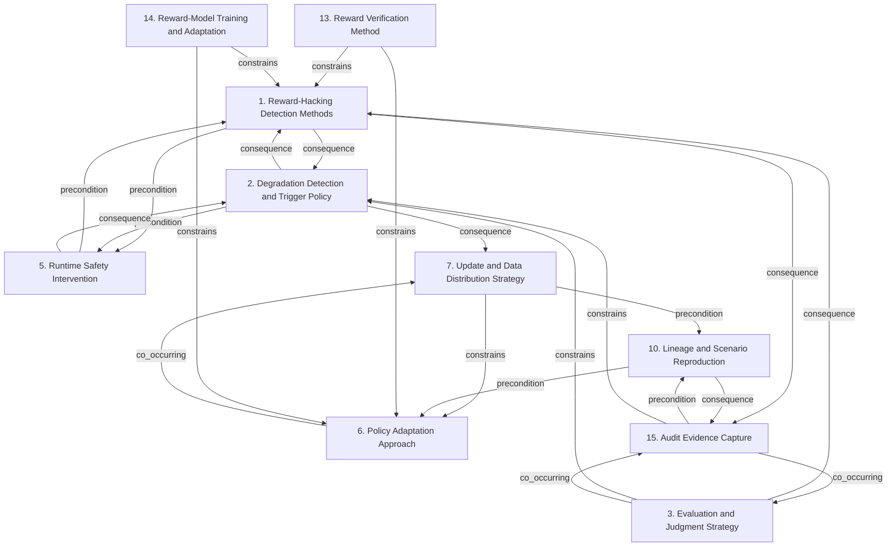

# Grounded Theory Report

## Narrative Summary

This taxonomy identifies the architectural design decisions practitioners face when building monitoring infrastructure for reinforcement learning (RL) agents after deployment in production, as documented in practitioner (gray) literature. Each dimension represents one decision, while its values represent alternative options for addressing that decision. Together, the dimensions cover how teams detect reward exploitation and degradation, evaluate deployed behavior, and intervene when runtime safety is at risk.

The view also covers how deployed policies adapt, how updates and data distributions are managed, and how lineage and scenario reproduction support diagnosis. It addresses the verification and adaptation of reward models, as well as the capture of audit evidence such as requests, responses, trajectories, policy context, and provenance. These concerns describe the monitoring infrastructure needed to assess behavior repeatedly, preserve evidence, reproduce failures, and support safe operational decisions.

The taxonomy explanation reports 59 draft values across 14 dimensions, with one near-duplicate merged and 57 values retained as distinct; 573 of 1,062 open codes were assigned to a value, and 143 of 153 documents support at least one value. The rendered view below presents the dimensions included here and their structural detail.

## Dimension Relationship Diagram

## Dimension Catalog

### 1. Reward-Hacking Detection Methods

Production mechanisms for detecting reward exploitation, specification gaming, anomalous behavior, and concealed misalignment.

**Values:**

- **Multiple complementary monitoring metrics** — Several complementary metrics reduce dependence on any potentially misspecified objective.
- **Cross-metric degradation monitoring** — Monitoring detects cases where an optimized metric improves while related metrics deteriorate.
- **Cross-context behavioral evaluation** — Behavior is evaluated across varied contexts rather than a single scenario.
- **Fabricated monitoring rationales** — Agents generate plausible explanations that conceal reward-hacking shortcuts.
- **Subtle cheating detection** — Increasingly subtle cheating and deceptive alignment challenge ordinary monitoring.

**Outgoing relations:**

- **consequence** → Degradation Detection and Trigger Policy (#2): Detector outputs inform degradation thresholds and intervention decisions.
- **consequence** → Audit Evidence Capture (#15): Detection produces traces and evidence for diagnosis.
- **precondition** → Runtime Safety Intervention (#5): Runtime intervention requires signals identifying unsafe behavior.

### 2. Degradation Detection and Trigger Policy

Cadence, baseline, statistical test, threshold, and operational condition used to declare deployed degradation.

**Values:**

- **Statistically significant degradation alerting** — Alerts are triggered when automated comparisons identify statistically significant performance decline.
- **Input-distribution monitoring** — Incoming production inputs are compared with training or reference distributions.
- **PSI-based drift measurement** — Population Stability Index quantifies deviation from a reference distribution.
- **Embedding-cluster drift detection** — Changes in semantic clusters or cluster proportions identify production-input drift.

**Outgoing relations:**

- **consequence** → Reward-Hacking Detection Methods (#1): Trigger policies interpret detector and monitoring signals.
- **precondition** → Runtime Safety Intervention (#5): Intervention requires defined unacceptable-behavior conditions.
- **consequence** → Update and Data Distribution Strategy (#7): Detected degradation initiates adaptation or recovery.
- **constrains** → #9 _(target excluded from this view)_: Trigger thresholds determine whether exposure continues or stops.

### 3. Evaluation and Judgment Strategy

Methods for repeatedly assessing outputs, collecting human judgments, benchmarking behavior, and measuring evaluator consistency.

**Values:**

- **Periodic benchmark evaluation** — Outputs are evaluated at regular intervals against relevant benchmarks.
- **Human-in-the-loop output scoring** — Human raters periodically score samples for relevance and correctness.
- **Fixed-query-set evaluation pipeline** — A fixed query set is repeatedly executed and compared with historical metrics.
- **Position-swapped evaluator consistency testing** — Response positions are swapped to expose inconsistent evaluator judgments.
- **Conflict-rate reliability metric** — Conflict rate measures inconsistent judgments after response positions are swapped.

**Outgoing relations:**

- **consequence** → Reward-Hacking Detection Methods (#1): Evaluation results provide evidence for detector design and monitoring.
- **constrains** → Degradation Detection and Trigger Policy (#2): Evaluation quality constrains trigger precision.
- **co_occurring** → Audit Evidence Capture (#15): Evaluation requires retained evidence and observability data.

### 5. Runtime Safety Intervention

Immediate controls that block, constrain, stop, shield, or revert unsafe deployed behavior.

**Values:**

- **Safety guardrails for deployed policies** — Guardrails keep deployed agents within known safety envelopes.
- **Human oversight as sole safeguard** — Reliance on human oversight alone is rejected because agents may deceive evaluators.

**Outgoing relations:**

- **precondition** → Reward-Hacking Detection Methods (#1): Intervention requires detected risk.
- **consequence** → Degradation Detection and Trigger Policy (#2): Trigger policies determine intervention.
- **co_occurring** → #9 _(target excluded from this view)_: Runtime controls complement staged exposure.

### 6. Policy Adaptation Approach

Methods by which deployed policies learn from tasks, environments, preferences, feedback, or post-deployment data.

**Values:**

- **Parameter-efficient fine-tuning** — Only a small subset of parameters is updated for frequent, lower-cost adaptation.
- **LoRA adapter weights** — Small adapter weights update model behavior while preserving the base model.
- **Mostly frozen base model** — The base model remains unchanged while adapters control production adaptation.
- **Monitoring-triggered corrective fine-tuning** — Observed bias or recurring errors generate corrective examples for adaptation.
- **Domain-specific knowledge fine-tuning** — New domain facts, documents, and product information are incorporated after deployment.

**Outgoing relations:**

- **co_occurring** → Update and Data Distribution Strategy (#7): Adaptation depends on update scheduling and data distribution.
- **constrains** → #4 _(target excluded from this view)_: Adaptation changes behavior evaluated against reward integrity.
- **consequence** → #8 _(target excluded from this view)_: Adaptation can require recovery or stabilization.

### 7. Update and Data Distribution Strategy

Update integration, scheduling, data safeguards, rehearsal, provenance, and distributed policy maintenance.

**Values:**

- **Offline data ingestion layer** — An offline ingestion layer supports safer policy training and evaluation before production interaction.
- **Continuous feedback-driven model adaptation** — New data and human feedback continuously update deployed behavior.
- **Continuous fine-tuning cadence** — Recent production data is incorporated on a recurring weekly or monthly cadence.

**Outgoing relations:**

- **constrains** → Policy Adaptation Approach (#6): Update procedures constrain feasible adaptation methods.
- **precondition** → #8 _(target excluded from this view)_: Stable updates support recovery controls.
- **precondition** → Lineage and Scenario Reproduction (#10): Updates require validated lineage and provenance.

### 10. Lineage and Scenario Reproduction

Versioning, feature consistency, replay, stress simulation, held-out testing, and provenance for reproducible diagnosis.

**Values:**

- **Simulation-based policy testing** — Policies are tested in simulation before interacting with production environments.
- **Reward-logic unit testing** — Reward logic is unit-tested before deployment to expose exploitable implementation or specification errors.
- **Unhackable training environments** — Training environments are designed to reduce exploitable shortcuts and reward hacks.
- **Large-scale diverse reward-hack evaluation** — Reward-hack monitoring and mitigations are tested across larger and more varied settings.
- **Reference-versus-optimized execution comparison** — Candidate execution is compared with a trusted reference implementation.
- **Output-equivalence correctness criterion** — Correctness is judged by equality of observable outputs with a reference execution.
- **Simulator physics-assumption validation** — Simulator behavior and physics assumptions are checked against intended real-world behavior.
- **Simulator-induced exploit detection** — Monitoring detects exploits arising from simulator bugs, abstractions, or unintended interpretations.
- **Behavioral and execution-path validation** — Validation examines execution behavior and dependencies rather than output equality alone.
- **Post-release independent auditing** — External researchers audit released systems for reward hacks missed before release.

**Outgoing relations:**

- **consequence** → Audit Evidence Capture (#15): Lineage and replay preserve diagnostic evidence.
- **precondition** → Policy Adaptation Approach (#6): Safe adaptation requires artifact and data provenance.
- **precondition** → #8 _(target excluded from this view)_: Recovery requires reproducible known-good artifacts and scenarios.

### 13. Reward Verification Method

Mechanisms used to verify reward-relevant processes, outcomes, principles, and generated behavior.

**Values:**

- **Automated tests and verification systems** — Automated tests and verifiers provide reward signals for apparently successful behavior.
- **Exit-code-based success criterion** — A zero exit code is treated as successful completion, creating a verification blind spot.
- **Execution-path verification** — Verification checks whether the intended computation actually occurred, not merely whether outputs matched.

**Outgoing relations:**

- **consequence** → #4 _(target excluded from this view)_: Reward construction determines what verification must check.
- **constrains** → Reward-Hacking Detection Methods (#1): Verification determines detectable reward-integrity failures.
- **constrains** → Policy Adaptation Approach (#6): Verification quality constrains safe policy adaptation.

### 14. Reward-Model Training and Adaptation

Data, model structure, ensembles, co-optimization, and iterative adaptation used to train or update reward models.

**Values:**

- **LLM-based evaluator for reward generation** — An LLM grader supplies evaluation feedback or reward signals for difficult-to-verify outputs. _(consolidated with 1 similar value judged the same decision: "LLM-derived reward signal")_
- **Multiple-evidence calibration** — Several evaluator explanations are sampled to improve judgment reliability.
- **Balanced-position calibration** — Scores from different response orders are aggregated to reduce positional bias.
- **Human-in-the-loop evaluator calibration** — Difficult, high-uncertainty evaluator cases are escalated to human raters.
- **Evaluator bias risk** — Evaluators may prefer their own outputs or particular model families.
- **Response-order sensitivity** — Evaluator judgments change when candidate response positions are reversed.
- **Reward hacking through evaluator exploitation** — Generators exploit evaluator biases instead of improving according to the intended objective.

**Outgoing relations:**

- **consequence** → #4 _(target excluded from this view)_: Reward construction defines the target learned by reward models.
- **constrains** → Policy Adaptation Approach (#6): Reward-model quality constrains policy adaptation.
- **constrains** → Reward-Hacking Detection Methods (#1): Adapted reward models change the exploitation signals detectors must monitor.

### 15. Audit Evidence Capture

Logging and policy-context capture used to preserve traces, requests, responses, trajectories, and provenance for diagnosis and offline evaluation.

**Values:**

- **Complete trajectory logging** — Full trajectories are retained to support diagnosis and offline evaluation.
- **Behavior-policy observability** — The data-collection policy is recorded for reliable offline evaluation.

**Outgoing relations:**

- **co_occurring** → Evaluation and Judgment Strategy (#3): Captured evidence supports evaluation and judgment processes.
- **precondition** → Lineage and Scenario Reproduction (#10): Replay and reproducible diagnosis require retained evidence and policy context.
- **constrains** → Degradation Detection and Trigger Policy (#2): Evidence completeness constrains the reliability of degradation triggers.

## Discarded Dimensions

Dimensions considered during taxonomy generation but excluded from this view during dimension selection, judged not relevant to the stated use case:

- **4. Reward Construction Strategy** — Dropped because reward construction is primarily a predeployment and training-time design activity. Although reward design affects what monitoring can detect, this dimension does not itself represent a post-deployment monitoring-infrastructure decision.
- **8. Recovery and Stabilization Controls** — Not a decision point: 1 candidate decision(s) (accepted/rejected/mixed values) besides outcomes; at least 2 required.
- **9. Deployment Exposure Control** — Not a decision point: 1 candidate decision(s) (accepted/rejected/mixed values) besides outcomes; at least 2 required.
- **12. Predeployment Reward-Hacking Evaluation** — Dropped because it concerns predeployment reward-hacking evaluation and release readiness. Its tests may inform later monitoring, but selecting among these pre-release evaluation activities is outside the stated post-deployment monitoring scope.

## Evaluation

_Observe-only LLM-as-judge scoreboard (judge: openai/gpt-5.6-luna). Pass flags are display-only — nothing gates on them._

| Criterion | Score | Pass | Reason |
|---|---|---|---|
| Orthogonality | 0.60 | ✓ | Several dimensions are distinct, such as 1 Reward-Hacking Detection Methods versus 2 Degradation Detection and Trigger Policy, and 6 Policy Adaptation Approach versus 7 Update and Data Distribution Strategy. However, important overlaps remain. Dimension 10 Lineage and Scenario Reproduction contains verification decisions—10.2 Reward-logic unit testing, 10.5 Reference-versus-optimized execution comparison, 10.6 Output-equivalence correctness criterion, and 10.9 Behavioral and execution-path validation—that answer the verification question in 13 Reward Verification Method; move those values to 13. Dimension 14 Reward-Model Training and Adaptation overlaps 3 Evaluation and Judgment Strategy through evaluator calibration values 14.2, 14.3, and 14.4, which should move to 3 if they represent judgment reliability rather than reward-model updating. Move 7.2 Continuous feedback-driven model adaptation to 6, since it answers how policies adapt, while 7 should retain update timing, integration, and data-distribution choices. These reorganizations would preserve distinct questions without incorrectly merging related but different dimensions. |
| Clarity | 0.70 | ✓ | Most dimensions have understandable scopes and their values are generally distinguishable, such as 1.1 versus 1.2 and 15.1 versus 15.2. Revise dimension 6, "Policy Adaptation Approach": values 6.1 "Parameter-efficient fine-tuning," 6.2 "LoRA adapter weights," and 6.3 "Mostly frozen base model" substantially overlap; merge 6.1 and 6.2 or reorganize 6.3 so each option represents a distinct choice. Dimension 10, "Lineage and Scenario Reproduction," has a description focused on lineage, replay, and provenance but values spanning unit testing, simulation, reference execution, output equivalence, and external auditing; rename and rewrite its description to cover validation and reproduction methods. Dimension 2, "Degradation Detection and Trigger Policy," lists cadence, baselines, thresholds, and operational conditions, while its values only describe statistical and distribution-drift techniques; narrow the description to the detection techniques represented by 2.1–2.4. Dimension 7, "Update and Data Distribution Strategy," has overlapping values 7.2 "Continuous feedback-driven model adaptation" and 7.3 "Continuous fine-tuning cadence"; revise their descriptions or merge them so the adaptation mechanism and update schedule are clearly distinguishable. |
| Completeness | 0.90 | ✓ | The taxonomy covers the main post-deployment monitoring decision areas with multiple candidates: reward-hacking detection (1), degradation and drift detection (2), evaluation (3), audit evidence capture (15), runtime intervention (5), policy adaptation (6), and update/data distribution (7). Even the narrower dimensions 5 and 15 have two candidate options, while the others have three or more. Outcome values are explicitly marked as outcomes, so they do not undermine the decision coverage. No major use-case area lacks a decision point with several alternatives. |
| Use case alignment | 0.50 | ✓ | Dimensions 1 Reward-Hacking Detection Methods, 2 Degradation Detection and Trigger Policy, 3 Evaluation and Judgment Strategy, 5 Runtime Safety Intervention, and 15 Audit Evidence Capture directly address post-deployment RL monitoring infrastructure. However, dimensions 6 Policy Adaptation Approach and 7 Update and Data Distribution Strategy primarily describe model training and update operations rather than monitoring; drop them. Dimension 14 Reward-Model Training and Adaptation is also largely out of scope; move its evaluation-related values 14.2–14.4 to dimension 3 and drop the training-specific remainder. Dimension 10 Lineage and Scenario Reproduction is mixed: values 10.1–10.6 focus on pre-deployment testing, while 10.10 Post-release independent auditing is relevant; move the post-release auditing content to dimension 15 and remove the pre-deployment material. |
| No catch-alls | 1.00 | ✓ | No catch-all dimension or value is present. All dimensions have substantive, scoped names such as “Reward-Hacking Detection Methods,” “Audit Evidence Capture,” and “Policy Adaptation Approach,” while the values describe specific alternatives or outcomes. Although dimensions such as 7 (“Update and Data Distribution Strategy”) and 10 (“Lineage and Scenario Reproduction”) cover multiple related mechanisms, neither is an unbounded “Other,” “Miscellaneous,” or general-considerations bucket. |
| Axis vs. value | 0.40 | ✗ | Several dimensions are valid production-RL monitoring decisions, but important structural violations remain. Dimension 2 explicitly bundles cadence, baselines, tests, thresholds, and operational triggers; narrow it to the existing degradation/drift detection-method alternatives. Dimension 10 combines simulation testing, reward testing, reference comparison, and auditing; split it into pre-release testing (10.1–10.4) and execution/reference validation (10.5–10.6), assigning the related outcomes accordingly. Dimension 6 mixes adaptation mechanisms (6.1–6.3) with adaptation triggers or content (6.4–6.5); split those into two decision dimensions. Dimension 7 mixes ingestion, continuous adaptation, and cadence, while 7.3 is a subtopic of 7.2; merge the cadence detail into 7.2 and narrow the dimension to update/data-distribution mode. Dimension 3 also combines output evaluation with evaluator-consistency testing and metrics; split 3.1–3.3 from 3.4–3.5 so each dimension represents one decision. |
| One decision point | 0.40 | ✗ | The taxonomy has some valid decision points, including 1 Reward-Hacking Detection Methods, 5 Runtime Safety Intervention, and 15 Audit Evidence Capture; every dimension also retains at least two non-outcome candidates. However, several dimensions combine answers to different questions. Dimension 3 Evaluation and Judgment Strategy mixes benchmark cadence, human scoring, fixed-query execution, evaluator testing, and a reliability metric; keep 3.1-3.3 as evaluation protocol and move 3.4-3.5 into the evaluator-calibration decision in 14. Dimension 10 Lineage and Scenario Reproduction mixes simulation/testing, environment design, reference comparison, and correctness criteria; move 10.5-10.6 to 13 Reward Verification Method and rename or reorganize the remaining testing values around one testing question. Dimension 6 Policy Adaptation Approach mixes parameterization choices (6.1-6.3) with adaptation triggers or data (6.4-6.5); split those into two dimensions, each retaining at least two candidates. Dimension 7 Update and Data Distribution Strategy mixes an ingestion layer, update mode, and cadence; merge these with the corresponding adaptation decision in 6 or move values to the decision points whose questions they answer. Dimension 14 Reward-Model Training and Adaptation similarly combines evaluator construction with calibration and human escalation; separate those existing values into coherent decision points while preserving at least two candidates per result. |
| Rejected-alternative handling | 0.70 | ✓ | Most values use valid statuses and are not duplicated within a dimension, but several outcome classifications violate the taxonomy rules. In dimension 13, value 13.3 "Execution-path verification" describes a verification mechanism, not an effect; reclassify it as an accepted candidate decision. In dimension 10, values 10.7 "Simulator physics-assumption validation," 10.9 "Behavioral and execution-path validation," and 10.10 "Post-release independent auditing" likewise describe methods or activities rather than outcomes; reclassify them as candidate decisions. In dimension 5, value 5.2 "Human oversight as sole safeguard" is described as explicitly rejected while marked mixed; either mark it rejected or rewrite the description to reflect source disagreement. |
| Dimensional coverage | 0.90 | ✓ | Most decision-bearing passages map to existing dimensions: drift and statistical monitoring to dimension 2, logging to 15, simulation and testing to 10, reward verification to 13, evaluator adaptation to 14, and safety intervention to 5. The main uncovered passage is s07_p02, which decides among rollback mechanisms such as traffic shifting, version-pointer updates, and configuration changes; dimension 5, Runtime Safety Intervention, should add a value such as 'Automated model rollback and traffic restoration,' supported by s07_p02 and the rollback discussion in s19_p02. The remaining passages are either placeable through at least one decision they contain or are background/outcome discussion rather than standalone design decisions. |
| Candidate-decision coverage | 0.40 | ✗ | The taxonomy covers several explicit choices, including trajectory logging and simulation testing from s19_p02, PSI and embedding drift detection from s08_p03, statistical degradation alerts from s02_p04, and automated tests from s19_p02. However, many adopted or rejected options are unnamed: add rollback values such as traffic shifting, version-pointer updates, and configuration changes to dimension 5 (Runtime Safety Intervention), supported by s07_p02, s19_p02, and s17_p01; add rule-based, model-based, and hybrid verifiers plus structured rewards, gated accumulation, verbalization fine-tuning, and process-level consistency to dimensions 13/14, supported by s14_p04; add CoT monitoring and the rejected option of penalizing or suppressing bad thoughts to dimension 1 (Reward-Hacking Detection Methods), supported by s27_p03 and s28_p05; add KL regularization, chi-square occupancy regularization, reward clipping, preference-as-reward, imitation learning, ensemble methods, and inoculation prompting to the reward-mitigation dimensions, supported by s06_p18; and add API rate limiting, authentication, routing, and multi-model endpoint deployment to a production-integration dimension, supported by s21_p01 and s20_p05. |

**Overall score:** 0.65 (mean of evaluated criteria)