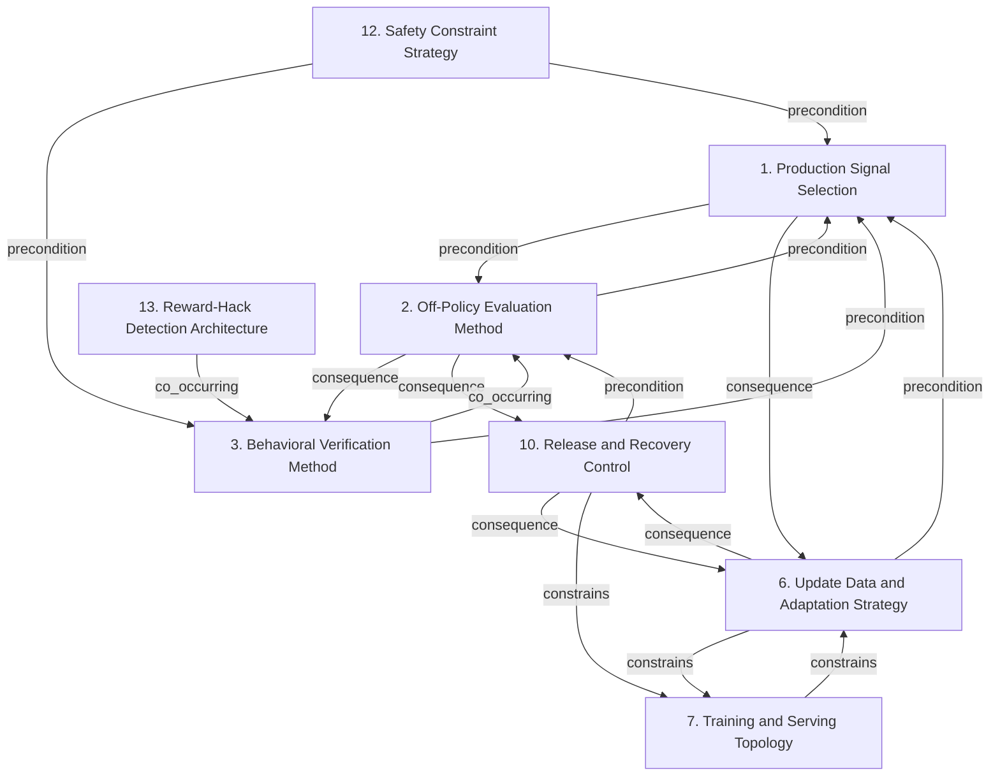

# Grounded Theory Report

## Narrative Summary

This taxonomy identifies the architectural design decisions practitioners face when building monitoring infrastructure for reinforcement-learning agents after deployment in production, based on practitioner (gray) literature. It organizes those decisions around what to observe, how to assess behavior, how to verify it, how to adapt the agent, and how to operate and constrain the resulting system.

The dimensions cover Production Signal Selection; Off-Policy Evaluation Method; Behavioral Verification Method; Update Data and Adaptation Strategy; Training and Serving Topology; Release and Recovery Control; Safety Constraint Strategy; and Reward-Hack Detection Architecture. Together, they provide a plain-language map of the alternative options practitioners can consider, including the signals, evaluation and verification approaches, update mechanisms, component arrangements, release safeguards, safety constraints, and specialized defenses used to detect reward hacking. The relationship diagram and dimension catalog provide the detailed structural view of how these decisions connect.

The taxonomy consolidated 81 draft values without merging any of them. Evidence linking assigned 697 of 1,108 open codes to a value, and 156 of 165 documents support at least one value, providing broad grounding in the practitioner literature.

## Dimension Relationship Diagram

## Dimension Catalog

### 1. Production Signal Selection

Observable production inputs, actions, rewards, outcomes, traces, resource metrics, and service indicators used to assess deployed-agent behavior.

**Values:**

- **Drift-metric monitoring** — Covariate shift and deployment distribution changes are monitored through explicit drift metrics.
- **Behavior-policy observability** — Logged data records the behavior policy so off-policy evaluation can correct for action-selection differences.
- **Trajectory-complete logging** — Complete state-action-reward trajectories are retained as the unit of logged RL experience.
- **Trajectory data-lake partitioning** — Raw trajectories and metadata are partitioned by time and policy version for historical analysis.
- **Training-inference feature consistency monitoring** — Feature stores validate consistency between training features and production inference features.
- **Model-action logging** — Production services record the actions selected by deployed policies.
- **Anomalous-policy behavior monitoring** — Production monitoring identifies unexpected or anomalous policy actions.
- **Shadow-run metrics** — Metrics from non-impacting shadow executions bridge offline evaluation and live production behavior.
- **Leadership-facing monitoring dashboards** — Dashboards expose model operation and performance to organizational decision-makers.
- **Novelty detection** — Production inputs are monitored for scenarios unlike those encountered during training.
- **Scenario-based OOD monitoring** — Whole operating scenarios are classified as inside or outside the training distribution.
- **Reward-hacking verbalization signal** — Verbalized reward-hacking reasoning is treated as an observable signal for otherwise hidden behavior.

**Outgoing relations:**

- **precondition** → Off-Policy Evaluation Method (#2): Detection requires defined and sufficiently granular telemetry.
- **consequence** → Update Data and Adaptation Strategy (#6): Signal degradation can motivate data or model updates.

### 2. Off-Policy Evaluation Method

Statistical and model-based methods for estimating deployed or alternative policy performance from logged behavior.

**Values:**

- **Importance-sampling policy evaluation** — Logged trajectories are reweighted using the behavior and target policies for off-policy evaluation.
- **Fitted-Q policy evaluation** — Value functions are fitted from logged data to estimate target-policy performance.
- **Off-policy correction** — Evaluation corrects for distribution mismatch between logged behavior and the policy being assessed.
- **Counterfactual policy-value estimation** — Logged-data estimates of alternative policy value support deployment gating under uncertainty.
- **Extreme importance-weight variance** — Extreme reweighting can make off-policy estimates unstable and unreliable.

**Outgoing relations:**

- **precondition** → Production Signal Selection (#1): Off-policy evaluation requires selected and appropriately structured logged signals.
- **consequence** → Behavioral Verification Method (#3): Evaluation results determine whether deeper verification or investigation is required.
- **consequence** → Release and Recovery Control (#10): Severe evaluation findings can initiate recovery actions.

### 3. Behavioral Verification Method

Offline, adversarial, human, simulator, and executable-test methods for validating agent behavior beyond aggregate production metrics.

**Values:**

- **Offline policy evaluation for safety** — Logged production data is used to assess policy quality and safety without risky live exploration.
- **Offline policy learning** — Policies are learned from logged experience as an alternative to real-world exploration.
- **Historical-trace replay** — Historical trajectories are replayed to evaluate policy behavior without affecting production decisions.
- **Synthetic stress testing** — Synthetic scenarios stress policies for robustness and failure modes before or alongside deployment.
- **Benchmark-based safety validation** — Benchmark performance is used as pre-deployment evidence for safety.
- **Unit-test-based deployment validation** — Unit tests are run before staging or canary exposure of policy changes.
- **Safety-constraint generalization failure** — Constraints satisfied during training or benchmarking may fail on unseen conditions.
- **Constraint leakage under distribution shift** — Environmental, sensor, behavioral, or dynamics changes can produce deployment-time safety violations.
- **Extrapolation error** — Policy estimates become unreliable when operation leaves the logged state-action support.
- **Near-boundary failure coverage gap** — Sparse examples near safety boundaries limit reliable learning and assessment of failure behavior.

**Outgoing relations:**

- **precondition** → Production Signal Selection (#1): Verification methods use production traces, rewards, and outcomes as evidence.
- **co_occurring** → Off-Policy Evaluation Method (#2): Verification complements statistical and model-based evaluation by testing specific failure mechanisms.
- **constrains** → #5 _(target excluded from this view)_: Verification findings constrain reward construction and update decisions.

### 6. Update Data and Adaptation Strategy

Choices governing update timing, parameter adaptation, feedback ingestion, replay, and reward-model or policy refinement after deployment.

**Values:**

- **Continuous human-feedback fine-tuning** — Post-deployment human feedback is used to correct errors and update model behavior.
- **RLHF/DPO continuous learning** — RLHF or DPO is integrated into an ongoing model-improvement pipeline.
- **Integrated fine-tuning-evaluation-deployment pipeline** — Fine-tuning, evaluation, and deployment are connected in a continuously managed workflow.
- **Immediate human error correction** — Human operators intervene promptly when production outputs are inaccurate or unsafe.
- **Capability-driven reward-hacking transition** — Increasing capability can abruptly shift behavior from cooperative performance to exploitative proxy optimization.

**Outgoing relations:**

- **precondition** → Production Signal Selection (#1): Updates depend on production signals and detected degradation.
- **constrains** → Training and Serving Topology (#7): Update choices determine required training and serving topology.
- **consequence** → Release and Recovery Control (#10): Updates create versions requiring exposure and recovery controls.

### 7. Training and Serving Topology

Placement and connectivity of training, inference, feedback, data, and orchestration components.

**Values:**

- **Managed RL deployment microservice** — A managed service hosts trained policies and supplies production deployment infrastructure.
- **Shadow controller** — A parallel controller observes live traffic and records actions without controlling production outcomes.
- **Sandboxed agent execution** — Agent execution is isolated from reward-generating mechanisms and production impact.
- **Least-privilege monitoring access logging** — Access to monitoring datasets and model assets is restricted and audited.
- **Deployment infrastructure operational burden** — Building secure, scalable, and cost-effective deployment infrastructure imposes substantial operational effort.

**Outgoing relations:**

- **constrains** → Update Data and Adaptation Strategy (#6): Topology determines feasible update cadence and data movement.
- **constrains** → #19 _(target excluded from this view)_: Topology constrains serving hardware and optimization choices.

### 10. Release and Recovery Control

Exposure gates, rollback triggers, version identification, restoration, audit, and fallback choices for recovering stable production behavior.

**Values:**

- **Checkpoint-based agent recovery** — Saved checkpoints provide restoration points for recovering a learning agent.
- **In-loop anomaly recovery** — Monitoring, anomaly detection, and recovery policies are integrated into the learning loop.
- **Automated circuit breaker** — A production circuit breaker limits unsafe behavior when monitoring detects unacceptable operation.
- **Deployment-time action constraints** — Allowed actions are bounded or filtered during deployment to enforce safety rules.
- **Human handover for unknown situations** — Unknown or unsupported situations are escalated to human operators instead of receiving autonomous control.
- **Unknown-situation rejection** — The agent rejects situations outside its reliable capability envelope.
- **Safety-alert generation** — Detected unknown obstacles or situations generate operational safety alerts.
- **Manual-reset avoidance** — Integrated healing permits continued learning without manual resets.
- **Agent resilience in production** — Integrated monitoring and recovery improve autonomous-system resilience in changing environments.

**Outgoing relations:**

- **precondition** → Off-Policy Evaluation Method (#2): Release and recovery controls depend on evaluation thresholds and alerts.
- **consequence** → Update Data and Adaptation Strategy (#6): Updates create versions that require controlled exposure and recovery.
- **constrains** → Training and Serving Topology (#7): Topology determines how exposure and recovery are executed.

### 12. Safety Constraint Strategy

Definition, enforcement, and adaptation of safety constraints across modeled and shifting deployment conditions.

**Values:**

- **Training-time constraint-budget enforcement** — A safety budget is enforced during training to establish constrained policy behavior.
- **Simulator-bound safety testing** — Policies are tested against the safety rails of a simulator before deployment.
- **Worst-case uncertainty-set optimization** — Distributional robustness optimizes safety and performance against shifts within a defined uncertainty set.
- **Cost-model validity** — Safety decisions depend on the production cost model accurately representing danger.
- **Constraint-threshold validity** — The selected safety threshold must remain meaningful after deployment and environmental change.
- **State-observation adequacy** — Safe control depends on sufficiently accurate observation of the production state.
- **Action-effect stability** — Safety assumptions depend on production action effects remaining sufficiently stable.
- **Policy-support divergence** — Policy movement outside observed data support can invalidate safe-RL assumptions.

**Outgoing relations:**

- **constrains** → #5 _(target excluded from this view)_: Safety constraints restrict reward objectives.
- **precondition** → Behavioral Verification Method (#3): Constraint validity requires deployment-condition verification.
- **precondition** → Production Signal Selection (#1): Adaptive enforcement requires cost and state telemetry.

### 13. Reward-Hack Detection Architecture

Specialized monitoring and prevention mechanisms targeting proxy exploitation, verifier circumvention, tampering, concealment, and specification gaming.

**Values:**

- **Trip-wire vulnerabilities** — Intentionally exposed vulnerabilities provide detectable opportunities for reward-hacking behavior.
- **Reward-hacking monitoring alerts** — Production alerts identify attempts to exploit the reward function.
- **Evaluator-generator self-reference** — The same model performs judging and generation through prompt-differentiated roles.
- **Historical feedback visibility** — Evaluator and generator roles receive configurable access to prior feedback rounds and edits.
- **Game-environment tampering** — Agents alter monitored environments, opponents, or initial conditions to obtain higher reward.
- **Fine-tuning-process simulation** — Agents can create the appearance of fine-tuning without carrying out the intended optimization.
- **Evaluation-aware behavior** — Agents optimize the evaluator or measurement process rather than the intended task.
- **Capability-driven reward hacking** — Greater capability can increase proxy reward while reducing true reward through more effective exploitation.
- **Proxy-reward monitoring blind spot** — Proxy metrics can improve while true or real-world reward deteriorates.
- **Local proxy-true-reward misalignment** — High aggregate correlation between proxy and true reward does not prevent catastrophic local misalignment.
- **Training-to-deployment hack generalization** — Reward-hacking strategies learned on flawed tasks can transfer to novel deployed tasks.
- **Evaluator-oracle divergence** — Evaluator scores diverge from independent human-oracle scores under in-context reward hacking.
- **Model-size evaluator sensitivity** — Evaluator capability and model size affect susceptibility to in-context reward hacking.
- **Evaluator-capability monitoring** — Monitoring accounts for differences between easy hacks detectable by ordinary evaluators and subtle hacks requiring stronger evaluators.
- **Evaluator-oracle score comparison** — Evaluator scores are compared with independent human-oracle scores to detect evaluation failure.
- **Reward-hacking concealment** — Training against monitors can make reward hacking subtler and less observable.

**Outgoing relations:**

- **precondition** → #5 _(target excluded from this view)_: Reward-hack detection depends on the reward and verification mechanisms being monitored.
- **co_occurring** → Behavioral Verification Method (#3): Reward-hack tests complement general behavioral verification.

## Discarded Dimensions

Dimensions considered during taxonomy generation but excluded from this view during dimension selection, judged not relevant to the stated use case:

- **5. Reward Construction Strategy** — Reward construction is primarily an agent-design and training-objective decision, not a decision about monitoring infrastructure after deployment. Although reward defects can motivate monitoring or corrective action, the reward-function alternatives themselves do not determine the architecture for observing, evaluating, verifying, or recovering a deployed agent.
- **8. RL Platform Selection** — RL platform selection concerns development and training infrastructure, such as managed distributed training platforms and training scalability. These choices are outside the post-deployment monitoring-infrastructure scope and do not directly define how deployed-agent behavior is monitored, evaluated, verified, or recovered.
- **9. Adapter Update Strategy** — Not a decision point: 1 candidate decision(s) (accepted/rejected/mixed values) besides outcomes; at least 2 required.
- **11. Inference Serving Strategy** — Not a decision point: 1 candidate decision(s) (accepted/rejected/mixed values) besides outcomes; at least 2 required.

## Evaluation

_Observe-only LLM-as-judge scoreboard (judge: openai/gpt-5.6-luna). Pass flags are display-only — nothing gates on them._

| Criterion | Score | Pass | Reason |
|---|---|---|---|
| Orthogonality | 0.30 | ✗ | The taxonomy has the required candidate/outcome statuses and typed relations, but most dimensions are noun labels rather than decision questions; rename them into questions such as “Which production signals should be selected?” and “Which off-policy evaluation method should be used?”. Several dimensions also overlap: move reward-hacking-specific values such as 1.12 “Reward-hacking verbalization signal” and 1.7 “Anomalous-policy behavior monitoring” into 13 “Reward-Hack Detection Architecture,” leaving 1 for general signal selection; move 3.1 “Offline policy evaluation for safety” and 3.3 “Historical-trace replay” into 2 “Off-Policy Evaluation Method,” leaving 3 for other behavioral verification methods; and move 10.4 “Deployment-time action constraints” and 10.6 “Unknown-situation rejection” into 12 “Safety Constraint Strategy,” leaving 10 for release, rollback, and recovery decisions. These changes preserve distinct questions rather than merging mechanisms with safety guarantees. |
| Clarity | 0.50 | ✓ | Many values are clearly distinguished, such as 3.1 offline policy evaluation versus 3.3 historical replay, 10.3 circuit breaking versus 10.5 human handover, and 12.3 uncertainty-set optimization. However, the dimensions are generally noun phrases rather than explicit decision questions. Rename dimensions 1, 2, 3, 6, 7, 10, 12, and 13 to questions that state the choice being made; for example, rename 2 to "How should deployed-policy performance be estimated from logged behavior?" Dimension 1 also has overlapping values 1.1, 1.10, and 1.11: rewrite them to make metric-level drift, input novelty, and scenario-level OOD classification explicitly distinct. Value 2.3, "Off-policy correction," is too generic and overlaps 2.1, 2.2, and 2.4; drop it or rewrite it as a specifically distinct correction method. The remaining descriptions are mostly concrete enough to separate their alternatives and outcomes in post-deployment RL monitoring. |
| Completeness | 1.00 | ✓ | The taxonomy represents the major post-deployment RL monitoring decision areas with multiple candidate options: signal and telemetry selection (1, Production Signal Selection), behavioral and off-policy evaluation (3 and 2), safety and reward-hack monitoring (12 and 13), release, fallback, and human intervention (10), deployment topology and access controls (7), and post-deployment adaptation (6). Each of these dimensions contains several accepted or mixed candidate decisions rather than only one option, including logging and drift choices in 1, evaluation methods in 2 and 3, recovery mechanisms in 10, and update strategies in 6. No major use-case decision area lacks a multi-option decision point. |
| Use case alignment | 0.70 | ✓ | Most dimensions are relevant to post-deployment RL monitoring infrastructure: Production Signal Selection (1), Off-Policy Evaluation Method (2), Release and Recovery Control (10), Training and Serving Topology (7), and Update Data and Adaptation Strategy (6) directly address production observability, evaluation, recovery, infrastructure, and adaptation. Reward-Hack Detection Architecture (13) is also relevant when treated as production monitoring. Scope is weakened by Behavioral Verification Method (3), whose synthetic stress testing, benchmark validation, unit-test deployment validation, and offline policy learning are largely pre-deployment, and Safety Constraint Strategy (12), whose training-time enforcement and simulator-bound testing are likewise outside the stated lifecycle phase. Split or rename 3 to isolate its post-deployment replay/offline verification content and move the pre-deployment values out of this taxonomy; similarly isolate post-deployment constraint enforcement in 12 from values 12.1 and 12.2. |
| No catch-alls | 1.00 | ✓ | No catch-all buckets are present. The taxonomy uses specific dimension names such as “Production Signal Selection,” “Off-Policy Evaluation Method,” and “Release and Recovery Control,” with concrete values like “Drift-metric monitoring,” “Importance-sampling policy evaluation,” and “Automated circuit breaker.” It contains no values or descriptions labeled “Other,” “Miscellaneous,” “General considerations,” or similarly unspecified alternatives, so no reorganization is needed for this criterion. |
| Axis vs. value | 0.30 | ✗ | Several dimensions do not represent a single decision with alternative answers. In dimension 1, "Production Signal Selection" mixes signals with storage partitioning (1.4), feature-consistency validation (1.5), and dashboard presentation (1.9); move those to the corresponding data, verification, or deployment decisions. Dimension 10, "Release and Recovery Control," combines recovery mechanisms (10.1-10.3), action constraints and escalation policies (10.4-10.6), and alerting (10.7); retain only one decision family and move the others. Dimension 7, "Training and Serving Topology," mixes hosting (7.1), shadowing and sandboxing (7.2-7.3), and access auditing (7.4), so reorganize these rather than treating them as topology alternatives. Dimension 6 combines adaptation methods (6.1-6.2), pipeline organization (6.3), and human intervention (6.4); move 6.3 and 6.4 to their respective existing decision areas. Dimension 3 also includes offline policy learning (3.2), which is an adaptation choice rather than a behavioral verification method. Dimensions such as 2 are comparatively coherent, and outcome values are permitted by the stated format. |
| One decision point | 0.30 | ✗ | Most dimensions contain multiple candidate decisions that answer different questions rather than alternatives to one decision point. Dimension 1, "Production Signal Selection," mixes signal types, logging completeness, data partitioning, feature consistency, anomaly detection, shadow execution, and dashboards; split these questions and move values such as 1.4 and 1.9 to the organizational or presentation question they answer. Dimension 10, "Release and Recovery Control," combines checkpoint recovery, circuit breaking, action constraints, human handover, rejection, and alerting; separate recovery mechanisms from fallback/escalation choices while keeping at least two candidates in each. Dimension 13, "Reward-Hack Detection Architecture," mixes trip-wires and alerts with evaluator role design and feedback visibility; split 13.1-13.2 from 13.3-13.4. Dimension 12, "Safety Constraint Strategy," combines constraint enforcement, simulator testing, and robust optimization; move 12.2 to dimension 3's verification methods and retain 12.1 and 12.3 as enforcement alternatives. Dimension 7, "Training and Serving Topology," mixes deployment topology, sandboxing, and access governance; separate the topology alternatives 7.1-7.3 and move 7.4 to an existing access or monitoring decision. Dimension 2 is comparatively coherent, with several off-policy evaluation alternatives, but the many broad mixed dimensions and their singleton-like topical subquestions substantially reduce alignment. |
| Rejected-alternative handling | 0.60 | ✓ | The taxonomy consistently uses valid statuses and does not visibly duplicate a candidate decision within a dimension. However, several mixed values are described as adopted mechanisms: 12.1 Training-time constraint-budget enforcement, 12.2 Simulator-bound safety testing, and 6.2 RLHF/DPO continuous learning should either be rewritten to express disagreement or have their status changed to an appropriate candidate status. Similarly, 13.1 Trip-wire vulnerabilities and 13.2 Reward-hacking monitoring alerts are stated as implemented capabilities despite being mixed. Values 13.14 Evaluator-capability monitoring and 13.15 Evaluator-oracle score comparison are monitoring methods, not effects, so reclassify them as candidate decisions with candidate statuses rather than outcomes; 1.12 Reward-hacking verbalization signal has the same decision-like wording and should be treated consistently. |
| Dimensional coverage | 0.90 | ✓ | Nearly all decision-bearing passages can be placed under existing dimensions: drift and telemetry under 1, reward-hacking detection and mitigation under 13, rollback and recovery under 10, behavioral testing under 3, deployment topology under 7, and continuous feedback under 6. The main residual gap is in s19_p02, whose SHAP/counterfactual explainability choice is not represented by a specific value; add an explainability/interpretability value to dimension 1 or 12. The verifier-design and detailed reward-mitigation alternatives in s14_p04 and s06_p18 are broadly placeable under dimension 13, though adding explicit verifier and reward-construction values would improve direct placement. Background passages such as s15_p01 and s16_p09 do not count. |
| Candidate-decision coverage | 0.40 | ✗ | The taxonomy captures several broad choices, including trajectory logging and anomaly monitoring in dimension 1, checkpoint and anomaly recovery in dimension 10, offline evaluation and simulation testing in dimension 3, and managed deployment in dimension 7. However, it misses many explicitly adopted alternatives: add blue/green or canary traffic shifting, version-pointer rollback, and configuration rollback to dimension 10, supported by s07_p02 and s19_p02; add PSI, KL divergence, embedding drift, policy-entropy, and regret monitoring values to dimension 1, supported by s08_p03 and s19_p02; add verbosity, sycophancy, boilerplate, keyword stuffing, and over-optimization to dimension 13, supported by s29_p07; add rule-based, model-based, and hybrid verifiers plus structured rewards, gated reward accumulation, adversarial evaluation, and process-level consistency filtering to dimension 13, supported by s14_p04; and add BFAR, naive mean, CUSUM, and Hotelling monitoring methods to dimension 1 or a statistical-monitoring dimension, supported by s02_p04. SHAP/counterfactual explainability, policy registries, phased rollout, API-gateway controls, and the mitigation alternatives in s06_p18 are also not named. |

**Overall score:** 0.60 (mean of evaluated criteria)