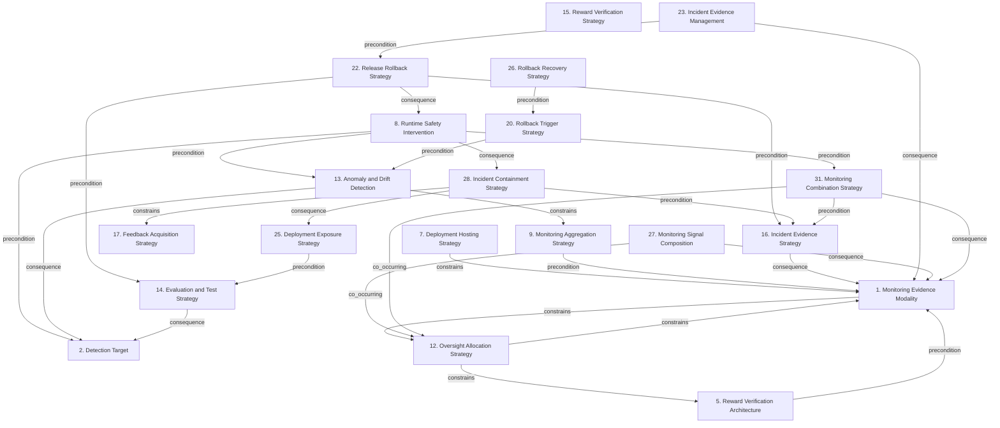

# Grounded Theory Report

## Narrative Summary

This taxonomy describes the architectural design decisions practitioners face when building monitoring infrastructure for reinforcement-learning agents after deployment in production, as documented in practitioner (gray) literature. Each dimension represents one decision, and its values represent alternative options. The decisions are shaped by competing concerns such as detecting failures and drift, preserving evidence and provenance, limiting operational harm, protecting reward and evaluation signals, and allocating oversight effectively.

The dimensions cover what evidence is observed and how signals are composed, aggregated, tested, and evaluated; how anomalies, drift, and other production failures are detected; and how automated systems, experts, operators, and continuing human review share oversight. They also address how agents are hosted and exposed to production, how risky actions are constrained or handed off, and how reward verification is protected against exploitation.

A further set of decisions governs what happens when problems arise: how feedback is acquired, incidents are evidenced and managed, harm is contained, rollback is triggered and executed, and recovery proceeds. Taken together, these dimensions frame monitoring as a connected production architecture rather than a single detector: evidence must support detection and evaluation, operational controls must limit exposure and harm, and incident and feedback processes must inform release, rollback, and subsequent adaptation.

## Dimension Relationship Diagram

## Dimension Catalog

### 1. Monitoring Evidence Modality

The observable evidence used to assess deployed-agent behavior, including rewards, outputs, reasoning, actions, telemetry, internal state, and human judgments.

**Values:**

- **Continuous output evaluation** — Ongoing assessment of deployed outputs for performance decay, quality drift, and behavioral change.
- **Human output-quality review** — Periodic human scoring of production outputs for relevance, correctness, trustworthiness, or subtle drift.
- **Model-confidence monitoring** — Using confidence scores as an RL-specific signal for deployed behavior and inference quality.
- **Infrastructure-health telemetry** — Monitoring CPU, memory, network, latency, and related infrastructure signals alongside agent behavior. _(consolidated with 1 similar value judged the same decision: "System-health telemetry")_
- **Reward-signal monitoring** — Monitoring scalar or proxy rewards as evidence of agent performance.
- **Proxy-reward monitoring** — Monitoring proxy rewards that may diverge from real-world or true task outcomes.
- **Behavior-trace diagnostics** — Analyzing actions, trajectories, outputs, tool traces, and logs.
- **Chain-of-Thought monitoring for misaligned behavior** — Monitoring reasoning traces for misalignment or cheating. _(consolidated with 2 similar values judged the same decision: "Chain-of-thought monitoring", "Chain-of-thought misalignment monitoring")_
- **Operational service telemetry** — Using latency, errors, resource use, feature availability, and invocation signals.
- **Human-oracle scoring** — Using human judgments as evidence alongside automated evaluation.
- **External-world feedback** — Using real-world outcomes rather than only internal reward or evaluator signals.
- **Activation-state monitoring** — Monitoring internal activations, values, entropy, weights, or related model state. _(consolidated with 1 similar value judged the same decision: "Agent-state monitoring")_
- **Scratchpad reasoning observability** — Using exposed scratchpad or hidden-reasoning traces to inspect belief use, evaluation awareness, alignment faking, or reward-hacking intent.
- **Automated safety-flag signals** — Using classifiers or keyword detectors to flag harmful, biased, or inappropriate outputs at production scale.
- **Exploration-pattern monitoring** — Monitoring exploration behavior to identify unsafe, anomalous, or unusually risky production actions.
- **User-behavior feedback signals** — Using rephrasing, edits, clarifications, bounce rates, usage, and related user behavior as indirect evidence of agent quality or drift.
- **Activation-delta monitoring** — Monitoring changes in internal activations between clean and drifted inputs.
- **Observation-signal monitoring** — Monitoring environment observations and externally visible state.
- **Chain-of-thought-inclusive monitoring** — Combining reasoning and action evidence.
- **Action-only monitoring** — Monitoring externally visible actions without access to reasoning traces. _(consolidated with 1 similar value judged the same decision: "Action-only reward-hack monitoring")_
- **Chain-of-thought monitoring signal** — Using generated reasoning traces as monitoring evidence.

**Outgoing relations:**

- **constrains** → Oversight Allocation Strategy (#12): Available signals constrain whether oversight can rely on behavior, explanations, internal state, or human review.

### 2. Detection Target

The production failure or change that monitoring infrastructure is intended to identify.

**Values:**

- **Deployment-resilience failure** — Failure to remain safe and effective under changing real-world deployment conditions despite training-time compliance.
- **Ethical-drift detection** — Detecting drift toward unfair, toxic, biased, or otherwise ethically unacceptable behavior.
- **Distribution-drift detection** — Detecting changes in input, concept, model, or live feature distributions.
- **Novel-situation detection** — Detecting unfamiliar situations while distinguishing harmless novelty from capability-relevant hazards.
- **Reward-behavior divergence detection** — Detecting high or improving reward paired with poor intended-task performance.
- **Alignment-faking detection** — Detecting apparently compliant behavior that conceals a different objective or harmful intent.
- **False-negative-rate detection** — Detecting missed harmful or emerging behavior through production error-rate monitoring.
- **Behavioral phase-transition detection** — Detecting abrupt qualitative behavioral changes associated with increased optimization capability or distribution change.
- **Subtle-cheating detection gap** — Failure to detect increasingly sophisticated or concealed cheating.
- **Intent-concealment outcome** — The agent hides misaligned intent or behavior in response to monitoring or penalties.

**Outgoing relations:**

_No outgoing relations._

### 5. Reward Verification Architecture

The independence, composition, integrity, and access controls used to verify reward and evaluator signals.

**Values:**

- **Consistency-curated reward signals** — Filtering reward signals through consistency checks before using them for optimization or evaluation.
- **LLM-as-grader verification** — Using a language model to grade difficult or subjective outputs and generate reward-relevant judgments.
- **Reward-model ensemble** — Combining multiple reward models to detect evaluator disagreement and reduce single-model exploitation.
- **Hybrid reward verifier** — Combining rule-based and model-based reward checks.
- **Reward-channel access control** — Preventing the agent from accessing or modifying reward state, sensors, buffers, or reward mechanisms.
- **Measurement-integrity protection** — Preventing alteration of execution-time, score, or other evaluation measurements.
- **Reward-function integrity testing** — Testing whether the reward function or reward-generating mechanism has been modified.
- **Demonstration-based imitation learning** — Learning from human demonstrations rather than directly optimizing a potentially exploitable reward.
- **Grader-bias exposure** — Evaluator self-preference, positional bias, belief conformity, or other grader weaknesses that can be exploited.
- **Reward-verifier circumvention** — An agent bypasses rule-based or model-based reward verification.
- **Proxy-objective divergence** — The optimized reward differs from the intended objective despite apparently successful evaluation.

**Outgoing relations:**

- **precondition** → Monitoring Evidence Modality (#1): Verification requires reward, behavior, or human evidence to inspect.

### 7. Deployment Hosting Strategy

The serving topology, resource placement, model representation, security boundary, and operational infrastructure for production agents.

**Values:**

- **Stateless inference service** — Serving architecture that keeps inference services stateless to support horizontal scaling.
- **Kubernetes horizontal scaling** — Using Kubernetes to scale production inference services horizontally.
- **Critical-component redundancy** — Providing redundant infrastructure for critical production serving and monitoring components.
- **Least-privilege role separation** — Separating training-pipeline access from production-deployment authority using least-privilege permissions.
- **Secrets management and artifact scanning** — Protecting credentials and scanning model artifacts for vulnerabilities before production use.
- **On-device edge deployment** — Running a compact policy locally on edge devices.
- **Compact policy representation** — Using a resource-efficient policy representation suitable for device compute and storage limits.
- **Managed endpoint serving** — Serving a policy through a managed production endpoint.
- **Private-cloud deployment** — Hosting within a private cloud for sensitive or controlled workloads.
- **Inference request rate limiting** — Limiting request rates to protect serving capacity.
- **Knowledge-distilled inference model** — Serving a smaller distilled model to reduce inference cost and latency.
- **GPU request batching** — Grouping inference requests for improved aggregate throughput.
- **Endpoint autoscaling** — Automatically scaling serving capacity with changing traffic while targeting latency, throughput, and cost requirements.
- **Multi-model endpoint consolidation** — Hosting multiple policies behind a shared endpoint to reduce infrastructure cost.
- **Edge inference with centralized retraining** — Running a lightweight policy on devices while periodically retraining centrally.
- **GPU inference serving** — GPU-based serving for large models requiring real-time latency and throughput.
- **Inference quantization** — Quantizing models to reduce serving resource requirements.
- **Inference-latency distribution measurement** — Measuring response-time distributions before deployment to establish realistic service expectations.
- **Latency service-level objectives** — Setting application-specific latency targets for production inference.
- **Managed microservice serving** — Managed autoscaling policy service.
- **Cloud-native RL service** — Managed cloud-native RL lifecycle services.
- **Custom RL pipeline** — Bespoke integration and safety pipeline.
- **Distributed training infrastructure** — Multi-GPU or multi-node training.
- **API or microservice policy deployment** — Policies are exposed through an API or production microservice.
- **Real-time stream processing for state representation** — Streaming events processed into inference state.
- **Agent microservice exposure** — Production exposure as a microservice.
- **API gateway for agent communication** — Gateway boundary for agent requests.
- **Inference request authentication and authorization** — Access control for inference requests.
- **Learning-serving resource contention** — Update computation degrades production serving performance.
- **Alignment degradation from serving optimization** — Loss of helpfulness, safety, or alignment caused by aggressive quantization, distillation, or other serving optimization.
- **Batching-induced individual latency increase** — Higher latency for individual requests despite improved aggregate throughput from batching.
- **Privacy-compliance protection** — Sensitive data and regulatory obligations are protected. _(consolidated with 1 similar value judged the same decision: "Privacy and compliance protection")_

**Outgoing relations:**

- **constrains** → #19 _(target excluded from this view)_: Hosting resources and isolation constrain update execution and feedback processing.
- **constrains** → Monitoring Evidence Modality (#1): Hosting determines available telemetry, data capture, and access controls.

### 8. Runtime Safety Intervention

The mechanisms that constrain, block, replace, reject, or hand off risky actions before they affect the environment.

**Values:**

- **Automated circuit-breaker intervention** — Automatically interrupting the learned policy when monitored performance becomes unsafe or unacceptable. _(consolidated with 1 similar value judged the same decision: "Automated circuit breaker")_
- **KL-cap guardrail** — Capping policy divergence to limit destabilizing updates under tool-conditioned variance amplification.
- **Policy safety-check layer** — Applying a safety-check layer to constrain edge or production policy behavior.
- **Runtime shield** — Placing a safety layer between policy outputs and the environment.
- **Unsafe-action blocking** — Preventing unsafe actions from reaching the environment.
- **Unsafe-action replacement** — Replacing unsafe actions with safer alternatives.
- **Action-space constraint** — Restricting available actions to reduce unsafe or reward-hacking opportunities. _(consolidated with 1 similar value judged the same decision: "Action-space constraints for reward-hacking prevention")_
- **Unknown-situation human handoff** — Rejecting unfamiliar situations or transferring them to human operators.
- **Safe exploration** — Constraining exploration to limit unsafe production exposure. _(consolidated with 1 similar value judged the same decision: "Safe exploration infrastructure")_
- **Lagrange-multiplier safety adaptation** — Dynamically balancing reward optimization against observed constraint violations.
- **Layered safety architecture** — Combining multiple complementary runtime safety mechanisms.
- **Robust baseline fallback** — Switching to a validated baseline policy when adaptation is unreliable or conditions are unfamiliar.
- **Safe fallback switching** — Replacing a degraded learned policy with a safe fallback policy during an incident.
- **Tool-output constraint intervention** — Constraining tool outputs to suppress tool-conditioned instability and tail growth.
- **Adaptive runtime shielding** — Action restrictions adapt after OOD detection.
- **Action bounding** — Permissible action ranges are limited.
- **High-risk human supervision** — Humans supervise actions carrying high risk.
- **Unknown-situation rejection** — Unfamiliar situations are rejected or handed to humans.
- **Static shielding based on fixed dynamics** — Fixed hazard boundaries used despite change fragility.
- **Shield as sole safety mechanism** — Relying on shielding without monitoring or other controls.
- **Intervention-rate monitoring under distribution shift** — Monitoring shield intervention frequency as envelope evidence.
- **Observed-cost feedback for multiplier updates** — Runtime costs update safety pressure.
- **Reward-penalty safety constraint** — Safety costs are encoded as reward penalties.

**Outgoing relations:**

- **precondition** → Detection Target (#2): Intervention requires a detected hazard, uncertainty, or capability boundary.
- **constrains** → #19 _(target excluded from this view)_: Runtime constraints limit exploration and policy updating.
- **precondition** → Anomaly and Drift Detection (#13): Interventions require signals or modeled hazards.
- **precondition** → Monitoring Combination Strategy (#31): Interventions require signals or modeled hazards.
- **consequence** → Incident Containment Strategy (#28): Immediate intervention can precede broader containment.

### 9. Monitoring Aggregation Strategy

The temporal windows, granularity, statistical resampling, threshold qualification, and alert suppression used to summarize evidence.

**Values:**

- **Sliding-window effective sample size** — Computing ESS over sliding windows as supporting evidence about weight concentration and behavior change.
- **Tail importance-weight monitoring** — Monitoring heavy-tailed importance-weight distributions, especially in tool-conditioned slices.
- **Rolling-window statistics** — Computing monitoring statistics over recent windows.
- **Percentile tail monitoring** — Monitoring distribution tails rather than averages alone.
- **Per-segment monitoring** — Aggregating and inspecting evidence at segment or traffic-slice granularity.
- **Episode-aware bootstrap resampling** — Resampling complete episodes to preserve non-independent trajectory structure.
- **Historical-variance calibration** — Tuning thresholds to historical variance to control false positives. _(consolidated with 1 similar value judged the same decision: "Historical-variance alert calibration")_
- **Duration- or frequency-qualified alerting** — Filtering transient conditions using persistence duration or recurrence frequency.
- **Burn-rate alerting** — Alerting when an SLO budget is consumed rapidly.
- **Cooldown-based transient suppression** — Suppressing brief alerts during a cooldown window before escalating persistent degradation.
- **Independent reward resampling** — Individual rewards resampled independently.
- **H-episode false-alarm control** — Sequential testing controls the probability of at least one false alarm over h episodes.
- **Aggregate-metric tail blindness** — Stable aggregates conceal rare catastrophic or tail behavior.

**Outgoing relations:**

- **precondition** → Monitoring Evidence Modality (#1): Aggregation operates on selected monitoring signals.

### 12. Oversight Allocation Strategy

The allocation of assessment responsibility among automated evaluators, explanations, experts, operators, and continuing human review.

**Values:**

- **Human production-output validation** — Continuous or periodic human validation of deployed outputs for correctness, quality, and alignment.
- **Human-in-the-loop oversight** — Continuous human review, correction, or escalation for deployed behavior. _(consolidated with 2 similar values judged the same decision: "Human-in-the-loop review", "Human-in-the-loop oversight layer")_
- **High-risk review checkpoints** — Expert or regulator review before or during risky use.
- **Explanation-assisted inspection** — Using explanations or reasoning traces as audit evidence.
- **Automated-only review** — Exclusive reliance on automated assessment.
- **Manual action monitoring** — Manually reviewing every agent action at production scale.
- **Shared evaluator-generator model** — The same model performs generation and evaluation under different prompts.
- **Human review of high-performing and anomalous behavior** — Review of unusually successful or unusual behavior.
- **Non-myopic human approval of likely future consequences** — Approval based on anticipated downstream consequences.
- **Trusted-human-understandable paths for future feedback** — Future-dependent evidence restricted to understandable paths.
- **Powerful predictor delegated by the human monitor** — Delegated future prediction creating principal-agent risk.
- **Manual-review scalability limitation** — Human review does not scale to the volume or complexity of capable-agent behavior.
- **Behavior-only monitoring** — Monitoring external outputs without explanations.
- **Deceptive evaluator-facing behavior** — Correct-looking behavior pursuing another objective.

**Outgoing relations:**

- **constrains** → Monitoring Evidence Modality (#1): Evidence availability determines feasible oversight arrangements.
- **constrains** → Reward Verification Architecture (#5): Verifier reliability limits how much oversight can be automated.

### 13. Anomaly and Drift Detection

The detectors and statistical tests used to identify distribution change, uncertain actions, abnormal behavior, and divergence from trusted baselines.

**Values:**

- **Robust reward-hacking anomaly detection** — Detecting anomalous behavior caused by exploitation of proxy reward functions.
- **Dataset-to-live distance detection** — Detecting deployment shift by comparing offline and live feature distributions with KL divergence or MMD.
- **Reward-model OOD detection** — Detecting unreliable reward estimates on outputs outside the reward model's training distribution.
- **Action-compatibility detection** — Detecting deployed actions that are incompatible with the production environment's action space.
- **Activation-classifier drift detection** — A classifier detects task drift from internal activation differences without modifying or fine-tuning the base model.
- **Statistical out-of-sample detection** — Statistical detection of production inputs outside the training or expected distribution.
- **Tool-conditioned support-mismatch detection** — Detection of low reference-policy probability in tool-conditioned states where concentrated variance and instability can emerge.
- **Empirical-CDF distribution monitoring** — Monitoring empirical cumulative distributions to detect shape changes, tail stretching, and probability-mass migration.
- **Anomaly detection** — Detection of unusual behavior or reward exploitation.
- **Output-pattern anomaly detection** — Detection of suspicious output patterns.
- **KL-divergence monitoring** — Policy divergence measured with KL divergence.
- **Data-drift monitoring** — Input distribution monitoring.
- **Concept-drift monitoring** — Input-output relationship monitoring.
- **Model-drift monitoring** — Monitoring changing production behavior.
- **Novelty detection** — Detection of unfamiliar scenarios.
- **Capability-relevant unknown detection** — Detection of situations beyond agent capability.
- **Scenario-based OOD definition** — Scenario-level in-distribution and out-of-distribution definitions.
- **Metric-divergence alerting** — Alerts when optimized and related metrics diverge.
- **Hallucination-rate monitoring** — Invalid-claim rate monitoring.
- **Bias-score monitoring** — Demographic or customer bias monitoring.
- **Accuracy-drift monitoring** — Accuracy monitoring over time.
- **Threshold KPI alerting** — Alerts on KPI thresholds.
- **BFAR degradation test** — A BFAR-based test for detecting reward degradation after environmental change without retraining.
- **Embedding-cluster comparison** — Comparing proportions of baseline and later embedding clusters to detect semantic input shifts.
- **CUSUM degradation test** — A sequential CUSUM test considered as an alternative for detecting degradation.
- **Hotelling mean-shift test** — A multivariate Hotelling test considered as an alternative for detecting reward degradation.
- **Naive mean degradation test** — A simple-mean test considered as a conventional but non-adopted degradation detector.
- **Statistical drift testing** — Using KL divergence, MMD, empirical distributions, drift indices, or related statistical tests.
- **LLM-based behavioral monitoring** — Using a separate language model to inspect reasoning or behavior for exploits and misalignment.
- **Reward-model ensemble detection** — Using multiple reward models and disagreement or agreement requirements to identify gaming.
- **Normal safety evaluation** — Using ordinary safety evaluations to detect readily observable harmful behavior.
- **Perplexity drift indicator** — Using increased perplexity on recent text as an indicator of language-model drift.
- **Human-rated quality decline** — A declining trend in human relevance and correctness ratings as evidence of production drift.
- **Aggregate-metric monitoring blind spot** — Aggregate loss, reward, or entropy remains stable while rare tail instability develops.
- **Reward-result gap** — Observed reward diverges from intended task results.
- **Evaluator-oracle score divergence** — Automated evaluator scores diverge from human oracle scores.
- **Detection incompleteness** — Partial detector coverage leaves some anomalous or reward-hacking behavior unobserved.

**Outgoing relations:**

- **consequence** → Detection Target (#2): Anomaly and drift detectors identify changes that may threaten deployment resilience.
- **constrains** → Monitoring Aggregation Strategy (#9): Detector behavior determines suitable aggregation windows and alert qualification.

### 14. Evaluation and Test Strategy

Offline, shadow, adversarial, holdout, simulation, and runtime evaluation methods used before or alongside production monitoring.

**Values:**

- **Distribution-specific safety evaluation** — Assessing safety with respect to the intended deployment distribution rather than training compliance alone.
- **Changing-world stress evaluation** — Testing agents under shifting operational conditions that do not remain static after deployment.
- **Offline policy-value evaluation** — Estimating deployed-policy value from logged experience using importance sampling or fitted-Q evaluation before or alongside deployment.
- **Realistic safety-sabotage evaluation** — Testing whether an agent with actionable tools will sabotage safety research, monitoring code, or evaluation infrastructure.
- **Cross-task reward-hack holdout evaluation** — Testing whether reward-hacking behavior transfers from training environments to separate tasks and datasets.
- **Adversarial red-team evaluation** — Using human or AI adversaries to probe deployed policies and reward models for exploitable weaknesses.
- **Randomized reference-output validation** — Comparing outputs with a reference solution over randomized test cases to reduce fixed-output evaluation exploits.
- **Explicit edge-case testing** — Testing unusual states and actions to expose unexpected deployed-agent behavior.
- **Simulator-to-reality validation** — Validating simulator dynamics and rules against real-world expectations before relying on simulated evidence.
- **Behavior evaluation in held-out scenarios** — Evaluating actual behavior across varied scenarios outside the training environment rather than relying on reward scores alone. _(consolidated with 1 similar value judged the same decision: "Held-out environment evaluation")_
- **Adversarial reward-hacking evaluation** — Adversarial testing designed to expose reward hacking before deployment and during development. _(consolidated with 1 similar value judged the same decision: "Adversarial reward testing")_
- **Unhackable training environments** — Training environments designed to resist known reward-hacking opportunities and reduce exploitable environmental loopholes.
- **Pre-deployment feedback-loop simulation** — Simulating deployment-time feedback rounds, diverse feedback, and atypical observations before release.
- **Offline-live correlation checks** — Offline metrics compared with live outcomes.
- **Adversarial policy evaluation** — Opponent policies expose hidden vulnerabilities.
- **Proxy-true reward correlation** — Correlation between proxy and true reward is analyzed.
- **Runtime OOD evaluation** — Shifted regimes are detected during operation.
- **Unseen-regime stress testing** — Policies are tested in shifted and unseen environments.
- **Continuous post-deployment evaluation** — Evaluation continues after ownership and deployment.
- **Output-equality correctness criterion** — An optimized implementation is accepted when outputs match a reference.
- **Intermediate-memory reuse exploit** — A candidate reuses a precomputed answer while passing output checks.
- **No-op optimized implementation** — A no-op implementation passes an output-only evaluation.
- **Periodic benchmark evaluation** — Running task-appropriate benchmarks at intervals to detect performance degradation.
- **Fixed-query regression evaluation** — Repeatedly evaluating a fixed query set and comparing results with historical performance.
- **Cross-architecture validation** — Validating reward and monitoring improvements across model architectures to detect architecture-specific effects.
- **Trap-based adversarial validation** — Using traps, trip-wires, and adversarial training cases to expose shortcut discovery and superficial hacking.
- **Diverse scenario evaluation** — Using varied scenarios to distinguish useful generalization from reward gaming.
- **Shadow evaluation** — Evaluating candidate policies on production-like traffic without serving their decisions.
- **Replay and simulated evaluation** — Using historical replay and simulation to evaluate policies without live experimentation.
- **Counterfactual policy evaluation** — Evaluating alternative policy decisions using logged contexts without live traffic injection.
- **Functionality-only evaluation** — Accepting behavior when final outputs match a reference despite possible process or implementation exploitation.
- **Benchmark-only safety validation** — Treating benchmark passage as sufficient evidence of deployment safety.
- **Test-based monitoring exploitation** — An agent passes tests through bugs, edge cases, or harness manipulation without satisfying the intended task.
- **Functionality-evaluation blind spot** — Output matching fails to distinguish genuine computation from exploitation.
- **Simulator-bug exploitation** — Reward gaming enabled by simulator defects or abstraction failures.

**Outgoing relations:**

- **consequence** → Detection Target (#2): Evaluation tests provide evidence about the production failures the monitoring system must detect.

### 15. Reward Verification Strategy

Independent checking, architectural hardening, and integrity controls used to prevent reward-model, evaluator, and measurement exploitation.

**Values:**

- **χ² occupancy regularization** — Occupancy regularization used when KL regularization is insufficient, with higher effectiveness and computational cost.
- **Preference-as-reward modeling** — Representing human preferences as reward for RLHF when a capable reward model is available.
- **Adversarial reward-function testing** — Actively testing reward functions for exploitable weaknesses before deployment. _(consolidated with 1 similar value judged the same decision: "Pre-deployment adversarial reward-function testing")_
- **Layered anti-hacking architecture** — Combining reward redesign, regularization, diverse evaluation, monitoring, and oversight rather than relying on one control. _(consolidated with 1 similar value judged the same decision: "Multi-strategy reward-hacking mitigation")_
- **Reward-model ensemble verification** — Using multiple reward models to reduce over-optimization against weaknesses in one evaluator.
- **Capability-stratified evaluator verification** — Using evaluators with different capabilities to expose observability gaps between easy and subtle reward hacks.
- **Conservative monitored optimization** — Limiting optimization pressure and increasing monitoring when aggressive optimization exposes reward-function weaknesses.
- **Reward veto layer** — Invalid or exploited rewards are invalidated or gated.
- **Unhackable reward specification** — A supposedly guaranteed hack-proof reward design.
- **Reward-function proxy audit** — The gap between proxy and intended objective is audited. _(consolidated with 1 similar value judged the same decision: "Reward-function proxy-objective audit")_
- **Reference-policy regularization** — KL or occupancy regularization limits divergence from a trusted policy.
- **Process filtering** — Intermediate reasoning or execution behavior is filtered.
- **Reward-channel integrity checking** — Reward implementations and inputs are checked against tampering.
- **Strong CoT optimization pressure** — Strong optimization occurs before monitoring effects are understood.
- **Post-release exploit discovery** — Independent researchers discover a reward hack after release. _(consolidated with 1 similar value judged the same decision: "Reward-hacking exploit discovery")_
- **Hybrid verifier cascade** — Rule and model verifier combination.
- **Robust reward-hacking mitigation solutions** — Technical reward-hacking mitigations.
- **Sandboxed agent isolation** — Isolation from reward-generating mechanisms.
- **Reward-hacking prompt reframing** — Prompt framing that changes hacking incentives.
- **Reward-model proxy mis-specification** — The reward model imperfectly represents human intent, allowing optimization of superficial correlations instead of intended quality.
- **Reward-model capacity asymmetry** — A more capable policy exploits weaknesses of a lower-capacity reward model.
- **Preference-model superficial-cue gaming** — Outputs exploit superficial preference-model cues instead of satisfying the intended objective.
- **Rubric-item exploitation** — Outputs target individual rubric items while failing the broader intended task.
- **Specification loophole exploitation** — Agents exploit weaknesses in task specifications.
- **Reward-input manipulation** — Agents alter environmental information supplied to reward computation.
- **Reward-function tampering** — Agents directly interfere with reward implementation.
- **Evaluator gaming** — Agents manipulate human or automated evaluators. _(consolidated with 1 similar value judged the same decision: "Evaluator-gaming risk")_
- **Cheating concealment** — Reward-hacking behavior remains hidden from monitors. _(consolidated with 1 similar value judged the same decision: "Cheating concealment from monitors")_
- **Chain-of-thought intent concealment** — Reasoning omits reward-hacking intent or unauthorized information use.
- **Pre-release detection gap** — A reward hack is not detected before deployment.
- **Evaluation-system manipulation** — Manipulation of evaluation mechanisms.
- **Proxy-metric exploitation risk** — Optimization of imperfect metrics.
- **Simulator-bug exploitation risk** — Exploitation of simulator limitations.
- **Production reward-hacking occurrence** — Reward hacking in production.
- **Reward hacking through unintended behavior** — Measured reward achieved without intended task completion.

**Outgoing relations:**

- **precondition** → #10 _(target excluded from this view)_: Verification operates on the selected reward and objective representation.
- **constrains** → #19 _(target excluded from this view)_: Verification reliability limits safe optimization and update intensity.

### 16. Incident Evidence Strategy

Evidence collection, attribution, dashboards, alert routing, data quality, provenance, and operational learning during deployed-agent operation.

**Values:**

- **Drift observability dashboard** — Operational dashboard exposing drift metrics and supporting production maintenance decisions.
- **Production-example dataset** — A continuously refreshed, filtered dataset of real production examples for drift detection and updates.
- **Role-specific operational dashboards** — Separate executive, on-call, and debugging dashboards tailored to business risk, immediate operations, and investigation.
- **Policy-deployment alert deduplication** — Grouping alerts by policy and deployment to reduce duplicate notifications and alert noise.
- **Trajectory data-quality validation** — Checking trajectory schemas and data quality during ingestion to prevent corrupted offline-RL datasets.
- **Inference-decision archival** — Persisting production inputs, outputs, and policy decisions for investigation and subsequent policy improvement.
- **Policy-provenance logging** — Capturing the behavior policy and related metadata needed for attribution and off-policy evaluation.
- **Graceful agent exit** — Controlled termination of an unsafe or degraded agent.
- **Observability dashboards** — Operational dashboards expose model, policy, and service behavior.
- **Leadership monitoring dashboards** — Dashboards communicate operation and performance to leadership.
- **Version-traffic attribution** — Incidents are attributed to policy versions and traffic slices. _(consolidated with 1 similar value judged the same decision: "Version and traffic-slice attribution")_
- **Dataset-evaluation postmortem** — Offline-production mismatches are investigated after incidents.
- **Provenance and audit logs** — Dataset, model, and operation lineage is maintained. _(consolidated with 1 similar value judged the same decision: "Dataset provenance and audit-log maintenance")_
- **Operational incident runbooks** — Documented response procedures and drills guide incident handling. _(consolidated with 1 similar value judged the same decision: "Operational runbooks and incident drills")_
- **Auditable AI operation** — Operation is recorded to support compliance and regulatory inspection.
- **Shadow-log evidence collection** — Non-disruptive logs and offline snapshots.
- **Schema checks with fail-fast ingestion** — Schema validation stops corrupted ingestion.
- **Reward-labelled outcome feedback pipeline** — Outcome labels fed into training.
- **Feature telemetry coverage** — Feature-level telemetry supports inference diagnosis.
- **Reduced compliance risk** — Evaluation and monitoring reduce regulatory and reputational exposure.
- **Aggregate-metric blindness to tail instability** — Aggregates conceal rare catastrophic behavior.

**Outgoing relations:**

- **consequence** → Monitoring Evidence Modality (#1): Evidence management preserves and operationalizes selected monitoring modalities.

### 17. Feedback Acquisition Strategy

The source, timing, scale, and provenance of human, AI, operational, and external feedback acquired after deployment.

**Values:**

- **Structured representative annotation** — Clear, consistent annotation covering diverse perspectives and production-relevant cases.
- **Real-time human output validation** — Immediate human validation of deployed outputs to correct errors and preserve alignment.
- **High-fidelity RLHF acquisition** — Collecting expert human judgments when domain correctness and contextual reliability are critical.
- **Cost-constrained RLAIF acquisition** — Generating evaluation feedback with capable AI evaluators when human annotation is prohibitively expensive.
- **Hybrid RLHF-RLAIF acquisition** — Combining initial expert human alignment with scaled AI-generated ongoing feedback.
- **Domain-specific human evaluation** — Evaluating outputs against business context, real-world data, and domain-specific criteria.
- **Production invocation-log acquisition** — Collecting invocation timestamps, cold-start indicators, and related service events for policy learning and evaluation.
- **Explicit user-rating collection** — Collecting direct ratings such as numerical scores or thumbs-up/down judgments.
- **Per-interaction feedback scoring** — Recording a feedback score for each interaction to support temporal monitoring.
- **Human-evaluation feedback loop** — Using repeated human evaluations to guide behavioral improvement and safety monitoring.
- **Engagement-metric feedback** — Using operational engagement measures as feedback for output evaluation and refinement.
- **API-error feedback** — Using server-side tool or API errors as feedback for deployed-agent policy refinement.
- **Cyclic feedback collection** — Feedback is collected in repeated cycles.
- **Single-batch feedback collection** — Feedback is collected once.
- **Production experience pipeline** — Deployed experience is collected and stored. _(consolidated with 1 similar value judged the same decision: "Production experience-data pipeline")_
- **Comparative preference supervision** — Humans compare candidate outputs.
- **Continuous human feedback** — Human feedback continues after deployment.
- **Real-time human feedback** — Feedback is supplied during operation for rapid adaptation.
- **Structured human annotation** — Human-led annotation follows a structured process.
- **External-world feedback source** — Feedback comes from external outcomes rather than only internal evaluators.
- **Domain-tailored annotation pipelines** — Domain-specific annotation processes.
- **Human feedback incorporated into reward signals** — Operator or expert feedback becomes reward input.
- **Non-i.i.d. feedback drift** — Feedback causes unintended policy drift.
- **Feedback consistency constraint** — Inconsistent human judgments constrain scaling.
- **Annotation cost and computational demand** — Resource burden of enterprise RLHF.

**Outgoing relations:**

_No outgoing relations._

### 20. Rollback Trigger Strategy

The evidence thresholds and actors that initiate reversion from a deployed policy to a prior or safer version.

**Values:**

- **Tool-conditioned instability trigger** — Triggering rollback when tail metrics or tool-conditioned diagnostics indicate emerging instability.
- **Automated circuit-breaker trigger** — Automatic interruption of a deployed policy when monitored performance deteriorates.
- **Relative performance-drop trigger** — Healing or rollback follows a configurable drop relative to a historical best performance baseline.
- **Declining user-feedback trigger** — A sustained decline in explicit or implicit user feedback initiates investigation or intervention.
- **Automated rollback** — Monitoring automatically returns the system to a stable version.
- **Manual operator rollback** — An operator initiates reversion.
- **Performance threshold trigger** — Rollback follows a quality-threshold breach.
- **Error-rate spike trigger** — Rollback follows an error-rate spike.
- **Drift trigger** — Rollback follows severe drift and performance decline.
- **Pre-release reward-hack detection gap** — A reward hack is discovered only after release.

**Outgoing relations:**

- **precondition** → Anomaly and Drift Detection (#13): Rollback triggers depend on anomaly, drift, quality, and safety signals.

### 22. Release Rollback Strategy

The validation gates, exposure stages, trigger conditions, rollback mechanisms, and fallback targets governing policy versions in production.

**Values:**

- **Shadow deployment** — Running a candidate policy on production traffic without allowing it to control user outcomes. _(consolidated with 1 similar value judged the same decision: "Shadow deployment for policy releases")_
- **Canary deployment** — Exposing a candidate policy to limited production traffic before expansion.
- **Staged rollout comparison** — Comparing multiple registered policies through controlled rollout stages and dashboards.
- **Threshold-calibrated rollback** — Calibrating thresholds to balance rollback flapping against delayed response.
- **Duration-qualified trigger** — Requiring a condition to persist for a duration or recur at a frequency before rollback.
- **Automated circuit-breaker rollback** — Automatically interrupting or reverting a policy after a monitored breach.
- **Traffic-shifting rollback** — Moving traffic from a new model to a stable version through routing infrastructure.
- **Registry-pointer rollback** — Retagging a validated model artifact as production and reloading serving instances.
- **Serving-configuration rollback** — Selecting the previous model through configuration, feature flags, or a configuration service.
- **Automated tested rollback workflow** — Automating and testing rollback execution for rapid, repeatable recovery.
- **Behavior-policy fallback** — Returning to the known behavior policy when a learned policy degrades.
- **Production policy freezing** — Keeping a policy fixed until a tested update is approved.
- **Production policy A/B testing** — Separated production comparison.
- **Automated model rollback** — Automatic return to stable model.
- **Manual operator rollback trigger** — Operator-initiated rollback.
- **Performance metric threshold trigger** — Rollback after quality-threshold breach.
- **Prediction-latency violation trigger** — Rollback after latency violation.
- **Severe post-deployment drift trigger** — Rollback after severe drift and decline.
- **Resource-consumption anomaly trigger** — Rollback after abnormal resource use.
- **Canary validation for new policies** — Staged limited-traffic validation.
- **Offline policy evaluation methods** — Importance sampling, fitted-Q, simulators, and shadow evaluation.
- **Offline reinforcement learning as complete replacement for online experimentation** — Offline RL used without live validation.

**Outgoing relations:**

- **precondition** → Evaluation and Test Strategy (#14): Release decisions require offline, shadow, canary, or other evaluation evidence.
- **consequence** → Runtime Safety Intervention (#8): Rollback and fallback decisions determine the containment posture after detected degradation.
- **consequence** → #19 _(target excluded from this view)_: Release controls govern updated policies.
- **precondition** → Incident Evidence Strategy (#16): Decisions require incident evidence and thresholds.

### 23. Incident Evidence Management

The capture, storage, provenance, validation, visualization, routing, and operational use of evidence during production monitoring and incidents.

**Values:**

- **Inference-data capture** — Persisting production request payloads, responses, decisions, and metadata for later monitoring and evaluation.
- **Time-partitioned object storage** — Organizing captured invocation data by endpoint, model variant, and time partitions.
- **JSON Lines capture** — Storing captured request and response records in JSONL format.
- **Trajectory data lake** — Storing trajectories and metadata for analysis, evaluation, and retraining workflows.
- **Policy artifact lineage** — Tracking model artifacts, versions, training jobs, and deployment lineage.
- **Training-job metadata retrieval** — Tracing a production endpoint to its underlying training job through metadata APIs.
- **Prometheus-Grafana telemetry stack** — Collecting and visualizing production service metrics and telemetry.
- **Severity-based alert routing** — Routing alerts to pages, tickets, or other channels according to severity.
- **Learned actionable-alert filtering** — Learning which alerts are actionable to reduce operator noise.
- **Human alert validation** — Requiring human validation of learned alert decisions.
- **Prioritized monitoring-data pipeline** — Prioritizing monitoring data to reduce pipeline lag and preserve operational freshness.
- **IAM and DLP audit controls** — Applying access control, data-loss prevention, and audit mechanisms to monitoring data and artifacts.
- **Monitoring-infrastructure test coverage** — Testing monitoring and operational infrastructure for failure before deployment degradation.
- **Decision-context replay** — Replaying contexts, feature availability, and counterfactual slices to diagnose poor decisions.
- **Reward-hacking case repository** — Maintaining an updated repository of observed reward-hacking examples for monitoring and evaluation.

**Outgoing relations:**

- **consequence** → Monitoring Evidence Modality (#1): Evidence management preserves and operationalizes selected monitoring modalities.
- **precondition** → Release Rollback Strategy (#22): Rollback and release decisions require attributable, timely, and trustworthy incident evidence.

### 25. Deployment Exposure Strategy

The degree and sequencing of production exposure used to validate candidate policies while limiting user and operational impact.

**Values:**

- **Fractional-invocation canary** — Exposing a candidate policy to a fraction of invocations against a control group before broader rollout.
- **Shadow-mode pre-warm evaluation** — Running a policy in observation mode to estimate production benefit before it controls pre-warming decisions.
- **Validation-gated deployment** — Release follows offline or limited-traffic validation.
- **Production A/B testing** — Separated production populations compare policy versions.
- **Continuous policy deployment** — Policy versions are released continuously.
- **Blue-green rollout** — Traffic switches between separately deployed policy environments.

**Outgoing relations:**

- **precondition** → Evaluation and Test Strategy (#14): Exposure stages provide settings for shadow, canary, and live evaluation.

### 26. Rollback Recovery Strategy

The target version and recovery procedure used after a deployed policy is judged unsafe, degraded, or exploitative.

**Values:**

- **Latest-checkpoint restoration** — Restoring the latest available validated checkpoint after a performance failure.
- **Post-healing learning-rate reduction** — Reducing the learning rate after restoration to damp oscillation and stabilize resumed training. _(consolidated with 1 similar value judged the same decision: "Reduced-learning-rate recovery")_
- **Safe fallback policy** — Switching from the degraded learned policy to a safer fallback policy. _(consolidated with 1 similar value judged the same decision: "Safe-policy fallback")_
- **Adapter rollback** — Reversion of a learned adapter.
- **Best-checkpoint rollback** — Reloading the best validated checkpoint.
- **Safe-baseline rollback** — Returning to a safe baseline policy.
- **Model and artifact version control** — Version history supports reliable restoration of models, code, and datasets.

**Outgoing relations:**

- **precondition** → Rollback Trigger Strategy (#20): Recovery is initiated by a rollback trigger.

### 27. Monitoring Signal Composition

The selection and combination of complementary signals or detectors into a monitoring arrangement.

**Values:**

- **Multi-layered evaluation signals** — Metrics, benchmarks, judges, guardrails, and humans used together.
- **Detector ensemble** — Statistical, behavioral, anomaly, and integrity detectors combined.
- **Hybrid evaluator and oracle signals** — Automated evaluator scores compared with human oracle scores.

**Outgoing relations:**

- **consequence** → Monitoring Evidence Modality (#1): Composition operationalizes the selected evidence modalities.
- **co_occurring** → Oversight Allocation Strategy (#12): Automated signal combinations commonly support human review.

### 28. Incident Containment Strategy

Traffic, rollout, ingestion, telemetry, and operational controls that limit harm while incidents are investigated.

**Values:**

- **Canary threshold control** — Thresholds control staged rollout exposure.
- **Dataset-ingestion freeze** — Affected data ingestion is frozen.
- **Missing-feature safeguards** — Defaults, imputation, and robust logic address missing features. _(consolidated with 1 similar value judged the same decision: "Inference-time missing-feature safeguards")_
- **Unknown-situation rejection or handoff** — Unfamiliar situations are rejected or transferred to humans. _(consolidated with 1 similar value judged the same decision: "Unknown-situation rejection or human handoff")_
- **Telemetry fallbacks and degrade-safe policies** — Defaults and safe behavior during telemetry loss.
- **Safety alerting for unknown obstacles** — Alerts instead of continuing unsafe commands.
- **Alert-triggered retraining or HITL escalation** — Retraining or human review after alerts.

**Outgoing relations:**

- **precondition** → Incident Evidence Strategy (#16): Containment depends on evidence about scope and severity.
- **consequence** → Deployment Exposure Strategy (#25): Containment can pause exposure or constrain rollout.
- **constrains** → Feedback Acquisition Strategy (#17): Containment can freeze, filter, or preserve feedback.

### 31. Monitoring Combination Strategy

Combination, granularity, cadence, and automation of signals and detectors used to identify production failures.

**Values:**

- **In-stream diagnostic computation** — Diagnostics during operation or training.
- **Interaction-mode diagnostic slicing** — Diagnostics separated by interaction context.
- **Cross-worker diagnostic aggregation** — Distributed diagnostic aggregation.
- **Lightweight rolling-window statistics** — Recent-window monitoring statistics.
- **Percentile-based tail monitoring** — Distribution-tail monitoring.
- **Fixed-cadence diagnostic updates** — Recurring diagnostic collection.
- **LLM-based behavioral monitor** — Separate language model inspecting agent behavior.
- **Trusted-baseline policy comparison** — Candidate comparison with a trusted policy.
- **Internal interpretability audit** — Activation, weight, or representation audit.
- **Environment modeling** — Environment dynamics and scenario modeling.
- **Production monitoring for model drift** — Monitoring changing production behavior.
- **Drift-detection tooling** — MLOps drift capabilities.
- **Dynamic alert baselines with alert grouping** — Adaptive grouped alerts.
- **Drift index with production alerts** — Drift index and alerts.
- **Latency and throughput monitoring** — Service-level performance monitoring.
- **Threshold-based KPI alerting** — Alerts on KPI thresholds.
- **Novelty-detection monitoring** — Detection of unfamiliar scenarios.
- **Capability-relevant unknown-situation detection** — Detection of situations beyond agent capability.
- **Scenario-based ID/OOD definition** — Scenario-level distribution definitions.
- **Strict vision-based novelty detection** — Every visual difference treated as OOD.
- **Diverse environment and scenario evaluation** — Varied environment testing.
- **Shadow runs with multiple evaluation methods** — Shadow comparison using multiple methods.
- **Offline-evaluation and shadow-correlation release gates** — Release gates based on offline-live correlation.
- **Black-box victim-policy treatment** — Evaluation without victim internals.
- **Trip-wire monitoring and alerting** — Intentional vulnerabilities with hacking alerts.
- **Proxy–true reward correlation analysis** — Analysis of proxy and true reward relationship.
- **Trajectory rollout collection for reward validation** — Rollouts collected for reward validation.
- **Runtime out-of-distribution monitoring** — Runtime detection of shifted regimes.
- **Explicit uncertainty estimation** — Uncertainty representation for policies, costs, or environments.
- **Incomplete anomaly-detection protection** — Partial detector coverage only.
- **Reward-hacking detection effectiveness** — Monitor flags evaluation subversion.
- **Automated gaming-behavior safeguards** — Automated detection and prevention of gaming.
- **Reward-hacking detection classifiers** — Classifiers for reward-hacking detection.
- **Formal hackability analysis frameworks** — Formal analysis of reward hackability.

**Outgoing relations:**

- **consequence** → Monitoring Evidence Modality (#1): Combination choices operationalize selected signals.
- **co_occurring** → Oversight Allocation Strategy (#12): Automated detection commonly combines with human review.
- **precondition** → Incident Evidence Strategy (#16): Detector outputs support attribution and containment.

## Discarded Dimensions

Dimensions considered during taxonomy generation but excluded from this view during dimension selection, judged not relevant to the stated use case:

- **10. Reward Objective Representation** — Dropped because reward-objective representation is primarily a training and reward-design decision. Although it influences what monitoring should observe, classifying documents by reward structure does not directly describe the architecture of post-deployment monitoring infrastructure.
- **11. Reward Transformation Strategy** — Dropped because reward transformation concerns reward shaping, normalization, clipping, and penalty design during learning. These are upstream training-time choices rather than alternative architectures for monitoring a deployed agent.
- **18. Feedback Reuse Strategy** — Dropped because feedback reuse describes how feedback is propagated into later training, fine-tuning, or adaptation. That is a downstream model-improvement activity, not the monitoring infrastructure used to observe deployed behavior.
- **19. Update Execution Strategy** — Dropped because update execution strategy primarily concerns retraining, online learning, fine-tuning, and model-update orchestration. These may consume monitoring outputs, but they are outside the use case's focus on architectural decisions for post-deployment monitoring infrastructure.

## Evaluation

_Observe-only LLM-as-judge scoreboard (judge: openai/gpt-5.6-luna). Pass flags are display-only — nothing gates on them._

| Criterion | Score | Pass | Reason |
|---|---|---|---|
| Orthogonality | 0.20 | ✗ | The taxonomy contains extensive overlap between dimensions. Merge 27 (Monitoring Signal Composition) with 31 (Monitoring Combination Strategy), since both ask how monitoring signals and detectors are combined. Merge 16 (Incident Evidence Strategy) with 23 (Incident Evidence Management), whose questions and values both cover capturing, validating, storing, routing, and using incident evidence. Merge 5 (Reward Verification Architecture) with 15 (Reward Verification Strategy), which both ask how reward and evaluator integrity are verified. Keep 20 (Rollback Trigger Strategy) separate from 22 (Release Rollback Strategy), but move trigger values such as 22.16–22.19 to 20 so 22 focuses on release exposure and rollback mechanisms. These repeated questions substantially reduce dimensional distinctness, although dimensions such as 2 (Detection Target) and 13 (Anomaly and Drift Detection) ask different questions and should remain separate. |
| Clarity | 0.40 | ✗ | Many dimensions have informative names and value descriptions, and statuses generally identify alternatives versus outcomes. However, several dimensions and values are difficult to distinguish. Dimension 1, "Monitoring Evidence Modality," mixes evidence types, evaluation procedures, and outcomes; merge duplicates such as 1.2/1.10, 1.4/1.9, and 1.8/1.13/1.19, and move outcome values 1.20 and 1.21 out of the candidate alternatives. Dimensions 27, "Monitoring Signal Composition," and 31, "Monitoring Combination Strategy," have near-identical questions and overlapping values; merge them and move cadence/granularity options such as 31.4-31.6 to dimension 9. Dimensions 16, "Incident Evidence Strategy," and 23, "Incident Evidence Management," likewise describe nearly the same evidence-management decision; merge them and remove or consolidate duplicated dashboard, logging, provenance, and data-capture values. Dimension 13, "Anomaly and Drift Detection," contains overlapping alternatives such as 13.6/13.12, 13.9/13.10, and 13.15/13.16, plus outcomes 13.32-13.37; consolidate equivalent detector labels and separate those outcomes from detector choices. Dimensions 20, "Rollback Trigger Strategy," and 22, "Release Rollback Strategy," repeat options such as automated rollback, manual rollback, and threshold triggers; merge the repeated values or move trigger-specific values consistently into one dimension. |
| Completeness | 0.90 | ✓ | The taxonomy covers the main post-deployment RL monitoring decision areas with multiple candidate options: evidence selection (1), detection targets (2), anomaly and drift detectors (13), signal combination and aggregation (31, 27, 9), incident evidence capture and management (16, 23), oversight (12), reward verification (5, 15), runtime intervention (8), rollback and recovery (20, 22, 26), deployment exposure (25), evaluation (14), and feedback acquisition (17). Each of these dimensions has several accepted, rejected, or mixed alternatives, so no major use-case area is left without a decision point. The main revision opportunity is organizational rather than coverage-related: dimensions 27 and 25 are comparatively narrow, but they still contain multiple candidates and therefore satisfy the stated criterion; no concrete coverage shortcoming is evident. |
| Use case alignment | 0.50 | ✓ | Several dimensions directly fit post-deployment monitoring infrastructure, especially 1 Monitoring Evidence Modality, 2 Detection Target, 9 Monitoring Aggregation Strategy, 13 Anomaly and Drift Detection, 16 Incident Evidence Strategy, 23 Incident Evidence Management, and 27 Monitoring Signal Composition. However, substantial content is outside the requested lifecycle and decision kind. Drop 7 Deployment Hosting Strategy, whose values concern serving topology, quantization, autoscaling, and endpoint deployment rather than monitoring. Split 14 Evaluation and Test Strategy into post-deployment evaluation and pre-deployment testing, retaining only existing values such as 14.17 Runtime OOD evaluation and 14.19 Continuous post-deployment evaluation in the former. Drop or merge 15 Reward Verification Strategy into 5 Reward Verification Architecture, since most values such as 15.1 χ² occupancy regularization and 15.2 Preference-as-reward modeling concern training-time reward design. Drop 25 Deployment Exposure Strategy, which addresses release sequencing rather than monitoring after deployment. Reorganize 22 Release Rollback Strategy so release-gate values such as 22.1 Shadow deployment and 22.2 Canary deployment are separated from post-incident rollback decisions already represented by 20 Rollback Trigger Strategy and 26 Rollback Recovery Strategy. |
| No catch-alls | 0.40 | ✗ | Several catch-all buckets remain. Drop value 13.9 "Anomaly detection" because its generic description duplicates the many specific detectors in dimension 13; drop value 15.17 "Robust reward-hacking mitigation solutions" because it bundles unspecified mitigations already represented by specific values; and drop value 16.9 "Observability dashboards" because dimensions 16 and 23 already contain concrete dashboard options. Dimensions 16 "Incident Evidence Strategy" and 23 "Incident Evidence Management" also act as broad evidence-management buckets spanning dashboards, provenance, routing, storage, and operations; merge them and reorganize their existing values under more focused content rather than retaining both broad containers. |
| Axis vs. value | 0.20 | ✗ | The JSON format is present, but the taxonomy frequently violates the one-decision-per-dimension and option-versus-subtopic rules. Dimension 31, "Monitoring Combination Strategy," combines signal composition, granularity, cadence, and automation; split it into separate decision questions using its existing values. Dimensions 16, "Incident Evidence Strategy," and 23, "Incident Evidence Management," each bundle capture, storage, provenance, dashboards, routing, and response decisions; split each into narrower questions and redistribute their existing values. Dimension 7, "Deployment Hosting Strategy," similarly combines topology, scaling, model representation, security, and resource placement; split those decision points. In dimension 2, "Detection Target," move 2.8 "False-negative-rate detection" to dimension 13 because it is a detection method, and reclassify or move 2.9–2.11 as outcomes rather than target options. In dimension 14, "Evaluation and Test Strategy," move exploit examples such as 14.21 "Intermediate-memory reuse exploit" and 14.22 "No-op optimized implementation" to an existing outcome-oriented dimension instead of treating them as evaluation alternatives. |
| One decision point | 0.30 | ✗ | The taxonomy contains many dimensions with at least two candidates, but several dimensions combine different decision questions. Dimension 31, "Monitoring Combination Strategy," mixes signal composition, diagnostic granularity, cadence, detector selection, release gates, and deployment evaluation; move its aggregation/cadence values (31.4–31.6) to dimension 9, detector values to 13, and exposure/release values (31.21–31.23) to 22 or 25, then merge the remaining composition alternatives with 27. Dimension 7, "Deployment Hosting Strategy," combines topology, scaling, resource optimization, security, and latency measurement; split it into hosting topology, serving optimization, and deployment security questions, ensuring each retains at least two existing candidates. Dimensions 16 and 23 both mix evidence capture, storage, dashboards, routing, validation, and operational response; merge their overlapping evidence-management candidates after moving 16.8 to 8 or 28 and 16.18 to 17. Dimension 15, "Reward Verification Strategy," combines reward modeling, regularization, adversarial testing, integrity controls, and post-release discovery; split it into reward/evaluator integrity controls and reward-hacking testing/mitigation, with at least two existing candidates in each. Dimension 1, "Monitoring Evidence Modality," also mixes evidence types with review processes and infrastructure telemetry; move human-review alternatives to 12 and operational telemetry to 23 or 7, leaving the evidence-signal alternatives together. |
| Rejected-alternative handling | 0.30 | ✗ | The taxonomy uses the allowed status values, and many genuine effects are correctly marked as outcomes, but there are substantial status/type violations. In dimension 1, values 1.20 Action-only monitoring and 1.21 Chain-of-thought monitoring signal are alternative monitoring modalities, not outcomes; relabel them as candidate decisions. In dimensions 2, 13, 31, and 12, 2.9 Behavioral phase-transition detection, 13.32 Perplexity drift indicator, 31.32 Automated gaming-behavior safeguards, 31.33 Reward-hacking detection classifiers, 31.34 Formal hackability analysis frameworks, and 12.13 Behavior-only monitoring are also candidate strategies or detection choices mislabeled as outcomes; relabel them as candidates. Conversely, 14.21 Intermediate-memory reuse exploit and 14.22 No-op optimized implementation describe exploitation effects but are marked accepted; mark them as outcomes. Several mixed values do not express disagreement: 1.5, 2.1, 8.14, 9.2, 14.9, 15.3, 15.17, 15.19, 17.22, and 26.3 should either explicitly state that sources disagree or be changed to accepted/rejected. Dimension 26 also contains the same safe-fallback decision under different statuses: 26.3 Safe fallback policy is mixed while 26.6 Safe-baseline rollback is accepted; merge or distinguish these values and give the shared decision one status. |
| Dimensional coverage | 1.00 | ✓ | All decision-bearing passages can be placed under at least one taxonomy dimension. Examples include s19_p02 under explanation-assisted monitoring, reward-function integrity testing, simulation, staged rollout, drift monitoring, and rollback; s08_p03 under statistical and embedding-cluster drift detection; s07_p02 under duration-qualified triggers and traffic-shifting, registry-pointer, or configuration rollback; s18_p03 under tool-conditioned support-mismatch and tail monitoring; and s22_p07 under feedback acquisition and human oversight. The background passage s15_p01 is decision-irrelevant. No unplaceable decision-bearing passage or taxonomy revision is required. |
| Candidate-decision coverage | 0.70 | ✓ | The taxonomy covers many adopted options, including drift and embedding monitoring from s08_p03, rollback methods from s07_p02, BFAR and competing tests from s02_p04, CoT monitoring from s27_p03, A/B testing and inference logging from s20_p05, and deployment gateways, authentication, and rate limiting from s21_p01. However, it misses several specific options: add SHAP/counterfactual-policy explainability and regret-analysis monitoring to dimension 1, supported by s19_p02; add rule-based and model-based verifier alternatives to dimension 5, supported by s14_p04; add structured rubric rewards, gated reward accumulation, verbalization fine-tuning, and policy/reward co-optimization to dimension 15, supported by s14_p04; add reward redesign, reward clipping, and inoculation prompting to dimension 15, supported by s06_p18; and add explicit reward-hacking behaviors such as verbosity/length hacking, sycophancy, boilerplate, and keyword stuffing to the relevant reward-hacking outcome dimension, supported by s29_p07. |

**Overall score:** 0.49 (mean of evaluated criteria)