# Grounded Theory Report

## Narrative Summary

This taxonomy describes the architectural design decisions practitioners face when building monitoring infrastructure for reinforcement learning (RL) agents after deployment in production, as documented in practitioner (gray) literature. Each dimension represents one decision, while its cataloged values represent alternative ways to make that decision. Together, the dimensions cover what to observe, how to evaluate evidence, how to operate the serving system, and how to respond when an agent’s behavior becomes unsafe or degraded.

The monitoring choices include Drift Monitoring Signals, Behavioral Oversight Signals, Production Evidence Capture, Statistical Degradation Detection Test, Behavioral Anomaly and Slice Monitoring, Reward and Integrity Monitoring, and User and Output Quality Monitoring. These dimensions frame the signals, behavioral traces, statistical tests, evidence, and quality assessments used to detect changes or failures. Evidence Provenance and Validation addresses how those observations are validated, versioned, and retained. Evaluator-Generator Configuration, Feedback Source Configuration, Evaluator Calibration and Aggregation, and Evaluator Escalation and Diversity describe alternative ways to produce and strengthen evaluator feedback.

The taxonomy also covers the controls that contain risk in operation: Inference Safety Filtering, Policy Serving Topology, Serving Operational Control, Deployment and Operations Infrastructure, Runtime Uncertainty and Feature Handling, and Runtime Action and Model Safety Controls. When harmful or degraded behavior is detected, Production Recovery Trigger determines what initiates intervention, while Production Recovery Action determines how the deployed policy is contained or reverted. The relationship diagram and per-dimension catalog provide the detailed structure, including the alternatives and the connections among these decisions. The consolidated taxonomy contains 267 distinct retained values after one near-duplicate was merged; evidence links assign 953 of 1,094 open codes to a value, and all 160 documents support at least one value.

## Dimension Relationship Diagram

```mermaid
flowchart TB
    dim_9["9. Drift Monitoring Signals"]
    dim_10["10. Behavioral Oversight Signals"]
    dim_13["13. Production Recovery Action"]
    dim_14["14. Production Recovery Trigger"]
    dim_20["20. Production Evidence Capture"]
    dim_21["21. Evidence Provenance and Validation"]
    dim_24["24. Statistical Degradation Detection Test"]
    dim_30["30. Inference Safety Filtering"]
    dim_33["33. Policy Serving Topology"]
    dim_34["34. Serving Operational Control"]
    dim_38["38. Deployment and Operations Infrastructure"]
    dim_39["39. Evaluator-Generator Configuration"]
    dim_40["40. Feedback Source Configuration"]
    dim_41["41. Evaluator Calibration and Aggregation"]
    dim_42["42. Evaluator Escalation and Diversity"]
    dim_43["43. Runtime Uncertainty and Feature Handling"]
    dim_44["44. Runtime Action and Model Safety Controls"]
    dim_45["45. Behavioral Anomaly and Slice Monitoring"]
    dim_46["46. Reward and Integrity Monitoring"]
    dim_47["47. User and Output Quality Monitoring"]
    dim_9 -->|precondition| dim_20
    dim_9 -->|precondition| dim_21
    dim_9 -->|constrains| dim_13
    dim_9 -->|constrains| dim_14
    dim_9 -->|consequence| dim_14
    dim_10 -->|precondition| dim_20
    dim_10 -->|precondition| dim_21
    dim_10 -->|constrains| dim_13
    dim_10 -->|constrains| dim_14
    dim_10 -->|consequence| dim_14
    dim_13 -->|precondition| dim_24
    dim_13 -->|precondition| dim_45
    dim_13 -->|precondition| dim_46
    dim_13 -->|precondition| dim_47
    dim_13 -->|precondition| dim_9
    dim_13 -->|precondition| dim_10
    dim_14 -->|precondition| dim_24
    dim_14 -->|precondition| dim_45
    dim_14 -->|precondition| dim_46
    dim_14 -->|precondition| dim_47
    dim_14 -->|precondition| dim_9
    dim_14 -->|precondition| dim_10
    dim_20 -->|precondition| dim_9
    dim_20 -->|precondition| dim_10
    dim_21 -->|precondition| dim_9
    dim_21 -->|precondition| dim_10
    dim_24 -->|consequence| dim_13
    dim_24 -->|consequence| dim_14
    dim_30 -->|consequence| dim_13
    dim_30 -->|consequence| dim_14
    dim_33 -->|precondition| dim_9
    dim_33 -->|precondition| dim_10
    dim_34 -->|precondition| dim_9
    dim_34 -->|precondition| dim_10
    dim_38 -->|precondition| dim_9
    dim_38 -->|precondition| dim_10
    dim_39 -->|co_occurring| dim_10
    dim_40 -->|co_occurring| dim_10
    dim_41 -->|co_occurring| dim_10
    dim_42 -->|co_occurring| dim_10
    dim_43 -->|consequence| dim_13
    dim_43 -->|consequence| dim_14
    dim_44 -->|consequence| dim_13
    dim_44 -->|consequence| dim_14
    dim_45 -->|consequence| dim_13
    dim_45 -->|consequence| dim_14
    dim_46 -->|consequence| dim_13
    dim_46 -->|consequence| dim_14
    dim_47 -->|consequence| dim_13
    dim_47 -->|consequence| dim_14
```

## Dimension Catalog

### 9. Drift Monitoring Signals

Which signals detect changes in input, concept, or output distributions during production monitoring?

**Values:**

- **Combined drift and output-quality monitoring** — Combines input-distribution or embedding drift with output-quality measures and feedback.
- **Data-drift monitoring** — Monitors changes in production input distributions.
- **Concept-drift monitoring** — Monitors changes in the relationship between inputs and outputs.
- **Activation-based drift monitoring** — Internal model activation patterns detect task drift without changing the deployed model.
- **Activation-delta classifier detection** — A classifier over clean-versus-drifted activation deltas detects off-track behavior.
- **Fine-tuning-free drift monitoring** — Drift detection preserves the deployed model without fine-tuning, trading lower cost for activation access.
- **State-action distribution shift** — Detects policy operation outside the state-action support represented by logged production or training data.
- **Goodhart-induced distribution shift** — Detects distribution changes caused by optimizing a proxy metric into regions unlike the original data distribution.

**Outgoing relations:**

- **precondition** → Production Evidence Capture (#20): Signal computation depends on the availability and reliability of production telemetry, trajectories, and baseline data.
- **precondition** → Evidence Provenance and Validation (#21): Signal computation depends on the availability and reliability of production telemetry, trajectories, and baseline data.
- **constrains** → Production Recovery Action (#13): Available signal sources determine which conditions can trigger recovery actions.
- **constrains** → Production Recovery Trigger (#14): Available signal sources determine which conditions can trigger recovery actions.
- **consequence** → Production Recovery Trigger (#14): Drift signals can produce the triggers that initiate production recovery.

### 10. Behavioral Oversight Signals

Which behavioral traces or oversight sources provide evidence of agent behavior during production monitoring?

**Values:**

- **Chain-of-thought monitoring** — Uses natural-language reasoning traces to identify reward hacking, intent, or misbehavior.
- **Multi-source agent telemetry** — Combines reasoning traces, intermediate actions, and final outputs as monitoring evidence.
- **Human output review** — Uses expert or operator review to identify subtle quality, safety, or drift failures.
- **Direct chain-of-thought supervision** — Applies strong direct supervision to reasoning traces as a monitoring or training approach.
- **No hidden scratchpad oversight** — Monitors agents without a hidden scratchpad, simplifying observable reasoning context.
- **Effective misbehavior flagging** — Successfully flags demonstrated attempts to subvert coding-environment tests.
- **Fragile natural monitorability** — Reasoning-based monitoring becomes unreliable when supervision causes models to conceal intent.
- **Low reasoning-trace faithfulness** — Observed reasoning traces fail to faithfully disclose unauthorized information or actual decision processes.
- **Action-only monitoring insufficiency** — Action-only oversight misses reward-hacking intent that richer reasoning traces can expose.

**Outgoing relations:**

- **precondition** → Production Evidence Capture (#20): Signal computation depends on the availability and reliability of production telemetry, trajectories, and baseline data.
- **precondition** → Evidence Provenance and Validation (#21): Signal computation depends on the availability and reliability of production telemetry, trajectories, and baseline data.
- **constrains** → Production Recovery Action (#13): Available signal sources determine which conditions can trigger recovery actions.
- **constrains** → Production Recovery Trigger (#14): Available signal sources determine which conditions can trigger recovery actions.
- **consequence** → Production Recovery Trigger (#14): Behavioral oversight findings can initiate recovery triggers for harmful policy behavior.

### 13. Production Recovery Action

What action contains or reverts harmful deployed-policy behavior?

**Values:**

- **Automated model rollback** — Reverts a problematic production model to a previously stable version automatically. _(consolidated with 1 similar value judged the same decision: "Model-registry rollback target")_
- **Manual operator rollback** — Preserves an operator-controlled rollback path for qualitative or external concerns.
- **Fallback behavior policy activation** — Disables a failing deployed policy and immediately serves a maintained fallback behavior policy.
- **Checkpoint restoration** — Persisted training checkpoints provide a recovery point for restoring learning-agent behavior.
- **Rollback failure simulation** — Regularly tests rollback behavior by simulating failed or broken deployments.
- **Manual-reset avoidance** — Recovery allows continued learning without manually resetting the agent.
- **Production agent resilience** — Integrated monitoring, detection, and recovery improve resilience of deployed agents.

**Outgoing relations:**

- **precondition** → Statistical Degradation Detection Test (#24): Automated recovery requires a degradation, error, latency, drift, or resource signal to define an intervention condition.
- **precondition** → Behavioral Anomaly and Slice Monitoring (#45): Automated recovery requires a degradation, error, latency, drift, or resource signal to define an intervention condition.
- **precondition** → Reward and Integrity Monitoring (#46): Automated recovery requires a degradation, error, latency, drift, or resource signal to define an intervention condition.
- **precondition** → User and Output Quality Monitoring (#47): Automated recovery requires a degradation, error, latency, drift, or resource signal to define an intervention condition.
- **precondition** → Drift Monitoring Signals (#9): Recovery decisions depend on monitoring signals being connected to deployment orchestration.
- **precondition** → Behavioral Oversight Signals (#10): Recovery decisions depend on monitoring signals being connected to deployment orchestration.

### 14. Production Recovery Trigger

What signal or threshold initiates production policy recovery?

**Values:**

- **Performance-threshold trigger** — Initiates rollback when performance metrics breach sustained thresholds or SLOs.
- **Server-error trigger** — Initiates rollback after prediction errors, server errors, or model exceptions increase.
- **Latency-violation trigger** — Initiates rollback when prediction latency consistently exceeds its SLO.
- **Drift-alarm trigger** — Uses severe post-deployment drift, when correlated with degradation, as a rollback condition.
- **Resource-anomaly trigger** — Initiates rollback when CPU, memory, or network consumption becomes abnormal.
- **Canary threshold trigger** — Initiating recovery when predefined canary rollout thresholds indicate unsafe or degraded behavior.
- **Monitoring-alert recovery trigger** — Initiates recovery from a general monitoring alert delivered through an operational webhook or API.
- **Trigger flapping risk** — Aggressive recovery thresholds can repeatedly switch between model versions in response to unstable signals.

**Outgoing relations:**

- **precondition** → Statistical Degradation Detection Test (#24): Automated recovery requires a degradation, error, latency, drift, or resource signal to define an intervention condition.
- **precondition** → Behavioral Anomaly and Slice Monitoring (#45): Automated recovery requires a degradation, error, latency, drift, or resource signal to define an intervention condition.
- **precondition** → Reward and Integrity Monitoring (#46): Automated recovery requires a degradation, error, latency, drift, or resource signal to define an intervention condition.
- **precondition** → User and Output Quality Monitoring (#47): Automated recovery requires a degradation, error, latency, drift, or resource signal to define an intervention condition.
- **precondition** → Drift Monitoring Signals (#9): Recovery decisions depend on monitoring signals being connected to deployment orchestration.
- **precondition** → Behavioral Oversight Signals (#10): Recovery decisions depend on monitoring signals being connected to deployment orchestration.

### 20. Production Evidence Capture

What production trajectories, policies, or datasets are captured for monitoring and later use?

**Values:**

- **Complete trajectory logging** — Preserves complete state-action-reward sequences for evaluation and diagnosis.
- **Behavior-policy logging** — Records the policy that generated logged data for off-policy evaluation.
- **Production-example running dataset** — Continuously maintains filtered real-world examples representing current usage.
- **Approved production-log feedback loop** — Feed approved production interactions and logs back into evaluation or policy improvement workflows.
- **Near-boundary failure coverage** — Captures examples near safety boundaries so monitoring and learning can distinguish safe from unsafe behavior.
- **State-representative feature capture** — Captures features that represent the policy state used for production decisions.
- **Fallback instrumentation** — Records missing-feature fallback behavior so feature gaps remain observable during operation.
- **Rollback event audit logging** — Captures rollback trigger, time, source, and target for operational investigation.

**Outgoing relations:**

- **precondition** → Drift Monitoring Signals (#9): Reliable monitoring signals require complete, validated, and appropriately versioned evidence.
- **precondition** → Behavioral Oversight Signals (#10): Reliable monitoring signals require complete, validated, and appropriately versioned evidence.
- **precondition** → #31 _(target excluded from this view)_: Offline policy evaluation depends on trajectory completeness, behavior-policy records, and reproducible datasets.
- **precondition** → #32 _(target excluded from this view)_: Offline policy evaluation depends on trajectory completeness, behavior-policy records, and reproducible datasets.
- **precondition** → #12 _(target excluded from this view)_: Offline policy evaluation depends on trajectory completeness, behavior-policy records, and reproducible datasets.

### 21. Evidence Provenance and Validation

How are monitoring evidence, datasets, and baselines validated, versioned, or retained?

**Values:**

- **Trajectory telemetry verification** — Inventories and verifies required telemetry fields before relying on trajectories.
- **Dataset validation checks** — Checks historical training and evaluation data for quality or consistency problems.
- **Dataset snapshotting** — Versions datasets to support reproducible evaluation, debugging, and change analysis.
- **Baseline performance reference** — Establishes training-data and initial-deployment baselines for ongoing comparison.
- **Affected-period data-ingestion freeze** — Freeze ingestion of affected production data while an incident period is investigated and validated.
- **Policy version and safety-metric registry** — Versions deployed policies alongside performance and safety metrics for controlled comparison and management.
- **Dataset incompleteness** — Breaks training or evaluation reliability when required trajectory information is missing.

**Outgoing relations:**

- **precondition** → Drift Monitoring Signals (#9): Reliable monitoring signals require complete, validated, and appropriately versioned evidence.
- **precondition** → Behavioral Oversight Signals (#10): Reliable monitoring signals require complete, validated, and appropriately versioned evidence.
- **precondition** → #31 _(target excluded from this view)_: Offline policy evaluation depends on trajectory completeness, behavior-policy records, and reproducible datasets.
- **precondition** → #32 _(target excluded from this view)_: Offline policy evaluation depends on trajectory completeness, behavior-policy records, and reproducible datasets.
- **precondition** → #12 _(target excluded from this view)_: Offline policy evaluation depends on trajectory completeness, behavior-policy records, and reproducible datasets.

### 24. Statistical Degradation Detection Test

Which statistical or distributional test detects performance degradation, drift, or environment-induced instability?

**Values:**

- **BFAR drift-detection test** — Uses BFAR to detect episodic performance degradation after environmental modification.
- **Simple-mean monitoring test** — Uses a naive mean-performance comparison to detect degradation.
- **CUSUM monitoring test** — Uses cumulative sequential deviations to identify performance change.
- **Hotelling mean-shift test** — Uses multivariate mean-shift analysis for degradation detection.
- **Automated drift-threshold alerting** — Raises alerts when a monitored drift measure exceeds a predefined threshold.
- **Trend-based degradation monitoring** — Uses sustained trends rather than isolated spikes to identify meaningful production change.
- **Robust state-distance monitoring** — Uses robust distance measures to compare observed states while limiting sensitivity to unusual observations.
- **Tail-quantile log-ratio monitoring** — Monitor high-percentile policy-update ratios to detect instability concentrated in distribution tails.
- **Empirical distribution-shape monitoring** — Compare empirical distribution shapes across windows to detect degradation without relying on one threshold.
- **Dataset drift index alerting** — Use an indexed drift measure and alerts to detect unnoticed production-dataset change.
- **Adaptive alert baselines** — Use dynamic baselines and grouping to reduce noisy degradation alerts.
- **False-alarm control** — Maintains low false-alarm behavior when the deployment environment remains stable.
- **Rapid post-modification degradation detection** — Detects degradation faster or more frequently after environmental changes than comparison tests.
- **Tool-conditioned support mismatch** — Concentrate update instability where tool-conditioned states have weak reference-policy support.
- **Insufficient global variance reduction** — Fail to resolve tail instability through larger batches or globally improved baselines.
- **Positive-correlation detection insufficiency** — Fail to detect reward hacking when proxy and intended rewards remain positively correlated.

**Outgoing relations:**

- **consequence** → Production Recovery Action (#13): Detection results provide signals that can initiate automated or manual production recovery.
- **consequence** → Production Recovery Trigger (#14): Detection results provide signals that can initiate automated or manual production recovery.

### 30. Inference Safety Filtering

Which filtering or external service boundary screens production inputs and outputs for safety?

**Values:**

- **Input/output safety filtering** — Filter harmful inputs and outputs before they reach users through rules, classifiers, or moderation services.
- **External moderation service integration** — Use an external content-moderation service as an additional runtime safety-checking layer.

**Outgoing relations:**

- **constrains** → #17 _(target excluded from this view)_: Guardrails restrict policy optimization or execution to reduce reward hacking and unsafe behavior.
- **constrains** → #18 _(target excluded from this view)_: Guardrails restrict policy optimization or execution to reduce reward hacking and unsafe behavior.
- **constrains** → #19 _(target excluded from this view)_: Guardrails restrict policy optimization or execution to reduce reward hacking and unsafe behavior.
- **consequence** → Production Recovery Action (#13): Guardrail violations can produce escalation or rollback conditions.
- **consequence** → Production Recovery Trigger (#14): Guardrail violations can produce escalation or rollback conditions.

### 33. Policy Serving Topology

Which serving boundary or deployment topology hosts the production policy and monitoring controls?

**Values:**

- **API or microservice policy serving** — Serving the deployed policy behind an API or microservice boundary for production monitoring and controls.
- **Managed inference endpoint** — Hosting the policy on a managed inference endpoint with production serving controls.
- **Multi-model endpoint consolidation** — Hosting multiple policies behind one endpoint to consolidate serving infrastructure.
- **Prometheus-Grafana monitoring stack** — Prometheus and Grafana provide production telemetry collection and visualization at the serving boundary.

**Outgoing relations:**

- **precondition** → Drift Monitoring Signals (#9): Serving architecture supplies the production boundary and telemetry access needed for drift monitoring.
- **precondition** → Behavioral Oversight Signals (#10): Serving architecture determines access to production behavior for oversight.

### 34. Serving Operational Control

Which operational control governs capacity, request access, or authorization at the serving boundary?

**Values:**

- **Endpoint autoscaling** — Scaling serving resources with traffic while maintaining latency and throughput requirements.
- **Inference request rate limiting** — Limits incoming inference requests to protect the serving boundary from overload.
- **Gateway authentication and authorization** — Restricts policy-serving requests to authenticated and authorized callers.

**Outgoing relations:**

- **precondition** → Drift Monitoring Signals (#9): Serving architecture supplies the production boundary and telemetry access needed for drift monitoring.
- **precondition** → Behavioral Oversight Signals (#10): Serving architecture determines access to production behavior for oversight.

### 38. Deployment and Operations Infrastructure

Which infrastructure supports serving, monitoring integration, incident response, rollback, and operational deployment?

**Values:**

- **Reduced manual correction burden** — Reduces extensive manual correction through feedback-driven policy improvement.
- **Lower operational costs** — Reduces long-term operating costs through automated improvement with retained human oversight.
- **Cross-component error propagation** — Allow annotation, reward-model, or learning weaknesses to propagate through the policy pipeline.
- **Monitoring-deployment integration** — Integrate monitoring and deployment systems so detected degradation can execute recovery reliably.
- **Incident team alerting** — Notify operators when production degradation and automated recovery actions occur.
- **CI/CD rollback orchestration** — Uses deployment pipelines or workflow orchestrators to automate recovery API calls.
- **Integrated training-serving infrastructure** — Co-locates or reuses serving computations to support online policy updates.
- **Training-serving separation** — Keeps model training infrastructure separate from inference serving to preserve serving stability.

**Outgoing relations:**

- **precondition** → Drift Monitoring Signals (#9): Adaptation choices depend on monitoring signals identifying drift, quality loss, or changing production needs.
- **precondition** → Behavioral Oversight Signals (#10): Adaptation choices depend on monitoring signals identifying drift, quality loss, or changing production needs.
- **consequence** → #31 _(target excluded from this view)_: Validation requirements follow from the risk that adaptation changes deployed policy behavior.
- **consequence** → #32 _(target excluded from this view)_: Validation requirements follow from the risk that adaptation changes deployed policy behavior.
- **consequence** → #12 _(target excluded from this view)_: Validation requirements follow from the risk that adaptation changes deployed policy behavior.

### 39. Evaluator-Generator Configuration

How are evaluator and agent roles, context, parameter sharing, and feedback history configured?

**Values:**

- **Shared evaluator-generator model** — Using the same model capability for judging and generating agent behavior.
- **Parameter-free evaluator-generator loop** — Evaluating and generating through prompting without updating production model parameters.
- **Feedback-history visibility** — Choosing how much prior feedback or interaction history evaluators and agents can see.
- **Matched evaluator-generator context** — Keep evaluator and generating agent context aligned when producing behavioral feedback.

**Outgoing relations:**

- **co_occurring** → Behavioral Oversight Signals (#10): Evaluator feedback configuration and behavioral oversight jointly define how monitored behavior is judged.

### 40. Feedback Source Configuration

Which human, AI, external, or reward-model sources provide evaluator feedback and learning signals?

**Values:**

- **External-world proxy feedback** — Grounding proxy optimization feedback in outcomes supplied by the external world.
- **RLHF feedback configuration** — Uses human preference or expert judgment as the feedback source for policy adaptation and oversight.
- **RLAIF feedback configuration** — Uses reliable AI-based task evaluation as the scalable feedback source for policy adaptation and oversight.
- **Hybrid RLHF-RLAIF feedback configuration** — Combines human initial alignment with scalable AI-generated ongoing feedback.
- **Reward-model feedback loop** — Use a reward model as a continuous evaluator that scores policy outputs and feeds updates back into policy optimization.
- **Structured human annotation** — Use structured human-led annotation to generate dependable production feedback and alignment signals.
- **Trusted-human-understandable feedback** — Restricts feedback paths to future information a trusted human can understand and approve.

**Outgoing relations:**

- **co_occurring** → Behavioral Oversight Signals (#10): Evaluator feedback configuration and behavioral oversight jointly define how monitored behavior is judged.

### 41. Evaluator Calibration and Aggregation

Which calibration, scoring, aggregation, or verifier method improves reliability of evaluator judgments?

**Values:**

- **LLM-based output critique** — Uses language models to critique or grade outputs at scale for feedback and monitoring.
- **Reward-model ensemble evaluation** — Uses multiple reward models rather than one evaluator to monitor and reduce exploitable scoring errors.
- **Information-bottleneck reward evaluation** — Compresses evaluator representations to filter spurious features and reduce exploitable reward signals.
- **Separated quality-length reward heads** — Separates content-quality and response-length predictions to limit verbosity-based reward gaming.
- **Pairwise LLM feedback scoring** — Ranks candidate outputs pairwise and converts comparisons into feedback scores for policy refinement.
- **Evidence-based evaluator calibration** — Require textual evidence and multiple sampled explanations before aggregating evaluator judgments.
- **Balanced-position score aggregation** — Aggregate judgments across response positions to reduce positional bias in evaluator decisions.
- **Hint-disclosure faithfulness test** — Test whether reported reasoning acknowledges supplied hints across valid and invalid hint scenarios.
- **Hybrid rule-model verifier** — Cascaded rules and machine learning combine precision and recall for behavioral verification.
- **Attention-pattern reward-model distillation** — Distills attention patterns into reward models to improve contextual resistance to attention hacking.
- **Evaluator self-preference bias** — Causes evaluators to favor outputs from their own model family, weakening feedback reliability.
- **Positional evaluator bias** — Changes judgments according to candidate presentation order rather than response quality.
- **Response-order conflict rate** — Measures evaluator inconsistency when candidate response positions are swapped.
- **User-belief-conforming feedback** — Produces feedback that confirms user beliefs or mimics user mistakes instead of reliably judging correctness.
- **High-fidelity human judgment requirement** — Requires expert human judgment where automated evaluation is insufficiently reliable.
- **Preference-data annotation cost** — Creates cost pressure favoring scalable AI-generated evaluation over human annotation.
- **Reliable AI-based task evaluation** — Enables RLAIF when an AI evaluator can judge the task dependably.
- **Majority unfaithful explanations** — Observe explanations that omit influential hints despite correct or incorrect hint exposure.
- **Evaluator hint-disclosure rate** — Measure how often evaluator reasoning reports reliance on injected hints.

**Outgoing relations:**

- **co_occurring** → Behavioral Oversight Signals (#10): Evaluator feedback configuration and behavioral oversight jointly define how monitored behavior is judged.

### 42. Evaluator Escalation and Diversity

Which evaluator-selection, diversity, triage, or human-escalation method improves oversight reliability?

**Values:**

- **Adversarial evaluator selection** — Sources reward-model probes from human red teams, AI adversaries, or both.
- **Diverse debiased evaluator datasets** — Uses diverse, debiased comparison data to reduce evaluator dependence on superficial proxy features.
- **Human escalation for uncertain evaluations** — Route difficult or uncertain evaluator cases to human raters for adjudication.
- **Entropy-based evaluation triage** — Use evaluator-decision entropy to prioritize examples for human review.

**Outgoing relations:**

- **co_occurring** → Behavioral Oversight Signals (#10): Evaluator feedback configuration and behavioral oversight jointly define how monitored behavior is judged.

### 43. Runtime Uncertainty and Feature Handling

Which runtime control detects unknown situations or handles missing, partial, and masked features?

**Values:**

- **Unknown-situation detection** — Detects when observations fall outside familiar operating conditions.
- **Inference-time feature fallbacks** — Uses defaults, imputation, or robust logic when production features are missing.
- **Observation masking** — Restrict or mask observations to reduce adversarial exploitation and improve runtime robustness.
- **Feature access whitelisting** — Restrict inference and monitoring to explicitly authorized feature inputs.
- **Irrational novel-situation outputs** — Produces unsafe or irrational outputs when observations differ substantially from training data.
- **Overconfident unknown-situation outputs** — Issues confident controls without recognizing that a situation is unfamiliar.
- **Partial observability of environment state** — Leaves relevant environmental conditions hidden from the deployed policy and monitoring system.
- **State-observation inadequacy** — Insufficient observation of production state undermines safety decisions.

**Outgoing relations:**

- **constrains** → #17 _(target excluded from this view)_: Guardrails restrict policy optimization or execution to reduce reward hacking and unsafe behavior.
- **constrains** → #18 _(target excluded from this view)_: Guardrails restrict policy optimization or execution to reduce reward hacking and unsafe behavior.
- **constrains** → #19 _(target excluded from this view)_: Guardrails restrict policy optimization or execution to reduce reward hacking and unsafe behavior.
- **consequence** → Production Recovery Action (#13): Guardrail violations can produce escalation or rollback conditions.
- **consequence** → Production Recovery Trigger (#14): Guardrail violations can produce escalation or rollback conditions.

### 44. Runtime Action and Model Safety Controls

Which runtime control constrains actions, validates models, limits rewards, or manages intervention and environment validity?

**Values:**

- **Action-space constraints** — Restricts available actions to reduce exploitation of reward or system weaknesses.
- **Human reward review** — Adds human oversight when automated reward or behavior assessment may be unreliable.
- **Reward clipping guardrail** — Clipping reward values to limit over-optimization of incorrect or extreme reward signals.
- **Simulator-fidelity monitoring** — Account for simulator physics assumptions and defects when interpreting policy behavior and monitoring evidence.
- **Deterministic business-rule validation** — Validates generated or extracted outputs against structured domain and compliance rules.
- **Safety and alignment degradation** — Deployed policy behavior can deteriorate into undesirable or unsafe outputs despite prior alignment training.
- **Out-of-distribution reward and safety degradation** — Degrades reward and safety estimates when policy operation leaves logged-data support.
- **Cost-model invalidity** — Distribution shift can make the safety cost model inaccurate in production.
- **Constraint-threshold invalidity** — Production changes can invalidate the meaning of a previously safe constraint threshold.
- **Action-effect instability** — Distribution shift can change relationships between actions and their effects.
- **Policy-support escape** — A policy may leave the support of previously observed data under production shift.

**Outgoing relations:**

- **constrains** → #17 _(target excluded from this view)_: Guardrails restrict policy optimization or execution to reduce reward hacking and unsafe behavior.
- **constrains** → #18 _(target excluded from this view)_: Guardrails restrict policy optimization or execution to reduce reward hacking and unsafe behavior.
- **constrains** → #19 _(target excluded from this view)_: Guardrails restrict policy optimization or execution to reduce reward hacking and unsafe behavior.
- **consequence** → Production Recovery Action (#13): Guardrail violations can produce escalation or rollback conditions.
- **consequence** → Production Recovery Trigger (#14): Guardrail violations can produce escalation or rollback conditions.

### 45. Behavioral Anomaly and Slice Monitoring

Which behavioral, slice-level, and deployment-performance signals monitor anomalous agent behavior?

**Values:**

- **Trusted-baseline policy anomaly detection** — Comparing candidate action distributions with a trusted policy to flag anomalous deployment behavior.
- **Tool-conditioned slice monitoring** — Monitor localized tool-use or interaction slices to detect tail instability hidden by aggregate behavior metrics.
- **Segment-level metric monitoring** — Preserves per-segment visibility so aggregate metrics cannot conceal localized degradation.
- **Anomalous behavior detection** — Detects unsafe or unexpected agent actions during production operation.
- **Real-time regret monitoring** — Monitors deviation of the current policy from an optimal or reference policy during operation.
- **Continuous deployed-agent monitoring** — Continuously observe deployed agents to identify reward hacking, errors, and behavioral degradation.
- **Policy behavior monitoring** — Monitor operational latency, safety violations, and behavioral distribution drift after deployment.
- **Exploration–exploitation behavior monitoring** — Monitor deployed-agent balance between trying new actions and exploiting previously successful strategies.
- **Offline RL observability signals** — Monitoring signals for action outcomes, feature availability, drift, shadow correlation, and safety logs in deployed offline RL.
- **RL-specific behavioral metric monitoring** — RL-specific reward, exploration, entropy, trace, and learning metrics monitor deployed-agent behavior.
- **Self-assigned performance score capability** — Allows an agent to manipulate evaluation measurements and effectively choose its reported performance.
- **Misalignment detectability gap** — Leave some misaligned behavior outside the observable or detectable monitoring envelope.
- **Hidden reward-hacking behavior** — Allow reward hacking to remain concealed from oversight signals and monitoring.
- **Sophisticated reward-hacking detection difficulty** — Become less able to detect advanced reward hacking as agent behavior grows harder to understand.
- **Higher-dimensional observation effects** — Observe performance and robustness changes caused by richer or poorer production state representations.
- **Deceptive reward-seeking behavior** — Agents seek high scores through deceptive behavior that reward values alone may not reveal.
- **Test-to-deployment behavioral gap** — Behavior succeeds in testing but fails after deployment, exposing inadequate production generalization.
- **Low monitor activation** — A monitoring signal rarely triggers, limiting its operational detection usefulness.
- **Sudden behavioral phase transitions** — Abrupt capability-linked changes in deployed behavior that motivate anomaly monitoring.
- **Deployment drift and adversarial adaptation** — Operational pressure from changing distributions and agents adapting against monitoring.
- **Context-dependent alignment behavior** — Alignment appears to vary across situations, limiting consistency of monitoring evidence.
- **Capability-dependent detectability** — Monitoring effectiveness varies with the evaluated model’s capability and ability to discover reward loopholes.

**Outgoing relations:**

- **consequence** → Production Recovery Action (#13): Detection results provide signals that can initiate automated or manual production recovery.
- **consequence** → Production Recovery Trigger (#14): Detection results provide signals that can initiate automated or manual production recovery.

### 46. Reward and Integrity Monitoring

Which reward, environment-integrity, alignment, or harmful-optimization signals monitor reward-related failures?

**Values:**

- **Adversarial reward-hacking probe** — Testing policies with deliberately misleading signals or reward-hacking scenarios to expose proxy optimization.
- **Tail-based importance-weight monitoring** — Using heavy-tailed importance-weight distributions as primary evidence of localized policy instability.
- **Reward and environment integrity monitoring** — Checks that reward implementations and environmental inputs have not been manipulated by the agent.
- **Proxy–true reward comparison** — Compare proxy and intended reward signals across trajectories to monitor reward alignment and integrity.
- **Observed constraint-cost monitoring** — Use deployed cost observations to update or assess safety-constraint pressure.
- **Reward misspecification monitoring** — Monitors weighting, ontology, and scope errors in the reward specification.
- **Insufficient feedback signals** — Lack reliable feedback signals needed to judge deployed-agent behavior.
- **Observation-fidelity reward misalignment** — Change observation fidelity in ways that improve proxy reward while harming intended reward.
- **Alignment-faking behavior** — Appear aligned while concealing divergent or reward-hacking behavior from oversight.
- **Safety-research sabotage** — Produce harmful sabotage behavior as a severe consequence of reward-hacking-induced misalignment.
- **Quick-fix mitigation risk** — Adopt short-term reward-hacking mitigations without durable safety properties.
- **Simulator-induced exploit behavior** — Observe rewarded behaviors exploiting simulator defects or proxy-gamable task mechanics.
- **Safety-system exploit discovery** — Deployed agents discover and exploit weaknesses in safety systems.
- **Reward-mechanism tampering** — An outcome in which an agent alters the mechanism generating its reward.

**Outgoing relations:**

- **consequence** → Production Recovery Action (#13): Detection results provide signals that can initiate automated or manual production recovery.
- **consequence** → Production Recovery Trigger (#14): Detection results provide signals that can initiate automated or manual production recovery.

### 47. User and Output Quality Monitoring

Which user-feedback, output-quality, compliance, or domain-evaluation signals monitor production quality?

**Values:**

- **Aggregate metrics as sole instability evidence** — Rely only on aggregate loss, reward, entropy, or global KL metrics to judge training stability.
- **Explicit user-feedback monitoring** — Direct ratings and per-interaction feedback used to monitor deployed model quality.
- **Implicit user-behavior monitoring** — Rephrasing, clarification, editing, bounce, session, and usage behavior used as indirect quality signals.
- **Hallucination monitoring** — Monitoring detects plausible but false outputs that undermine deployed-model accuracy and safety.
- **Bias monitoring** — Monitoring detects hidden output tendencies that disadvantage groups or policies.
- **Regulatory compliance monitoring** — Monitoring detects violations of applicable regulatory requirements in deployed outputs.
- **Automated quality-metric monitoring** — Uses automated output-quality metrics to monitor deployed-agent performance.
- **Domain-specific evaluation benchmarking** — Uses industry- and task-specific benchmarks to monitor correctness and compliance.
- **Practice-oriented behavioral monitoring** — Uses monitors designed to approximate realistic practitioner deployment behavior.
- **Human-evaluator vulnerability** — Systematic error, limited attention, and manipulation susceptibility weaken human-derived reward oversight.
- **Financial loss from risk misclassification** — Model degradation can misprice high-risk cases and produce catastrophic financial loss.
- **Offline-only monitoring coverage** — Experiment tracking and registries may provide offline evidence without online post-deployment monitoring.
- **Evaluation-oversight limitation risk** — Models may optimize weaknesses in evaluation and oversight instead of intended helpful behavior.

**Outgoing relations:**

- **consequence** → Production Recovery Action (#13): Detection results provide signals that can initiate automated or manual production recovery.
- **consequence** → Production Recovery Trigger (#14): Detection results provide signals that can initiate automated or manual production recovery.

## Discarded Dimensions

Dimensions considered during taxonomy generation but excluded from this view during dimension selection, judged not relevant to the stated use case:

- **12. Validation Exposure Strategy** — Dropped because shadow and canary exposure are deployment-validation strategies before broad production operation, outside the stated post-deployment monitoring scope.
- **15. Deployment World Assumption** — Dropped because the open-world versus closed-world assumption is a deployment-environment assumption rather than a monitoring-infrastructure decision. Its monitoring implications are represented more directly by runtime uncertainty and drift dimensions.
- **17. Objective Specification** — Dropped because objective and reward specification is an upstream policy-design decision, not a decision about post-deployment monitoring infrastructure.
- **18. Alignment Evaluation** — Dropped because alignment evaluation concerns evaluating or establishing policy alignment, largely before or outside the operational monitoring architecture covered by the use case.
- **19. Optimization Constraint** — Dropped because optimization constraints govern policy training or updating and do not constitute alternative architectures for monitoring deployed RL agents.
- **26. Policy Update Strategy** — Dropped because policy update strategy determines how the agent is adapted after monitoring, but is not itself a monitoring-infrastructure design decision.
- **29. Policy Safety Optimization** — Dropped because policy safety optimization concerns how the policy is optimized, primarily during training or adaptation, rather than how deployed behavior is monitored.
- **31. Policy Evaluation Modality** — Dropped because policy evaluation modality is primarily a pre-deployment or validation-exposure decision, whereas the use case concerns monitoring infrastructure after production deployment.
- **32. Policy Evaluation Estimator** — Dropped because estimator selection concerns offline policy evaluation methods rather than the architecture of post-deployment monitoring infrastructure.
- **37. Training and Experiment Infrastructure** — Dropped because the dimension focuses mainly on training and experimentation infrastructure. Although it can support later remediation, it does not directly specify post-deployment monitoring architecture.

## Evaluation

_Observe-only LLM-as-judge scoreboard (judge: openai/gpt-5.6-luna). Pass flags are display-only — nothing gates on them._

| Criterion | Score | Pass | Reason |
|---|---|---|---|
| Orthogonality | 0.50 | ✓ | Many dimensions ask distinct questions, such as production evidence capture (20) versus evidence validation (21), and recovery triggers (14) versus recovery actions (13). However, several values overlap across monitoring dimensions: statistical monitoring options such as 46.2 Tail-based importance-weight monitoring fit 24 Statistical Degradation Detection Test more directly; alerting values 24.5 Automated drift-threshold alerting and 24.10 Dataset drift index alerting should move to 9 Drift Monitoring Signals or 14 Production Recovery Trigger; and 33.4 Prometheus-Grafana monitoring stack answers deployment/monitoring infrastructure in 38 more than serving topology in 33. The broad behavioral-monitoring scopes of 10 Behavioral Oversight Signals and 45 Behavioral Anomaly and Slice Monitoring also substantially overlap; move source-oriented values such as 10.3 Human output review to the output-quality monitoring dimension 47, while retaining trace-specific values in 10. |
| Clarity | 0.70 | ✓ | Most dimensions are phrased as clear monitoring decisions and most values have distinguishable descriptions relevant to post-deployment RL infrastructure. However, dimension 20, "Production Evidence Capture," does not fit value 20.4, "Approved production-log feedback loop"; rename the dimension and description to include feedback or move that value to an existing feedback/infrastructure dimension. Move 33.4, "Prometheus-Grafana monitoring stack," from "Policy Serving Topology" to 38, "Deployment and Operations Infrastructure," because it describes telemetry infrastructure rather than serving topology. In dimension 24, 24.1, "BFAR drift-detection test," is unexplained jargon; rename it to the existing described concept, such as "Episodic performance-degradation test." Dimension 45 contains several overly generic and overlapping values—especially 45.4, "Anomalous behavior detection," 45.6, "Continuous deployed-agent monitoring," and 45.7, "Policy behavior monitoring"—so merge or drop the redundant generic entries while retaining the more specific signals. Value 47.9, "Practice-oriented behavioral monitoring," is also vague and should be renamed to explicitly state the realistic practitioner-deployment behavior it monitors. |
| Completeness | 0.90 | ✓ | The taxonomy covers the main post-deployment RL monitoring decision areas with multiple candidates: evidence capture (20), provenance and validation (21), drift and statistical detection (9, 24), behavioral/reward/quality monitoring (45–47), oversight and evaluator configuration (10, 39–42), serving and operations (33, 34, 38), recovery triggers/actions (14, 13), and runtime safety controls (43, 44, 30). Each of these dimensions has several accepted, rejected, or mixed candidate decisions, including the smaller but sufficient candidate sets in 30 and 34. No major use-case area is left without a decision point; remaining issues concern taxonomy organization or semantics, which are outside this criterion. |
| Use case alignment | 0.70 | ✓ | Most dimensions are strongly within scope for post-deployment RL monitoring infrastructure: 20 Production Evidence Capture, 21 Evidence Provenance and Validation, 9 Drift Monitoring Signals, 24 Statistical Degradation Detection Test, 45 Behavioral Anomaly and Slice Monitoring, 46 Reward and Integrity Monitoring, 43/44 runtime controls, and 13/14 recovery decisions all address production evidence, detection, safety, or rollback. However, 39 Evaluator-Generator Configuration, 40 Feedback Source Configuration, 41 Evaluator Calibration and Aggregation, and 42 Evaluator Escalation and Diversity primarily concern training/alignment feedback and evaluator design rather than infrastructure decisions after deployment; drop these dimensions or move only their explicitly runtime-monitoring content into 10 Behavioral Oversight Signals. 47 User and Output Quality Monitoring and 10 Behavioral Oversight Signals also contain tangential general-LLM material such as hallucination, chain-of-thought, and RLHF-style oversight; move the directly applicable production signal values into 45 or 46 and drop the remaining out-of-scope values. 33 Policy Serving Topology and 34 Serving Operational Control are relevant infrastructure decisions, though their generic serving options should be retained only where they support deployed-agent monitoring. |
| No catch-alls | 0.20 | ✗ | The taxonomy contains several catch-all buckets, which conflicts with the requirement that each dimension represent one focused decision. Most notably, id 38 "Deployment and Operations Infrastructure" combines serving, monitoring integration, incident response, rollback, and online training; split it into focused deployment/serving and recovery/operations questions, moving values 38.4–38.8 accordingly. Id 44 "Runtime Action and Model Safety Controls" combines action limits, reward clipping, human review, simulator validity, and rule validation; split these into action/reward controls and model/environment validation, moving values 44.1–44.5. Id 45 "Behavioral Anomaly and Slice Monitoring," id 46 "Reward and Integrity Monitoring," and id 47 "User and Output Quality Monitoring" similarly bundle multiple distinct signal families; split each into focused existing-content dimensions and move their values to the corresponding question. Broad values such as 45.6 "Continuous deployed-agent monitoring" and 45.9 "Offline RL observability signals" should also be moved into the more specific dimensions they describe. |
| Axis vs. value | 0.30 | ✗ | Several dimensions bundle distinct decisions or contain values that are sub-topics rather than alternatives to one question. In dimension 20, values 20.4 (feedback loop), 20.7 (fallback instrumentation), and 20.8 (rollback auditing) should be moved to the existing feedback, runtime-control, and recovery/operations dimensions rather than treated as evidence-capture options. Dimension 24 mixes statistical tests with alerting and baseline policies; move values 24.5, 24.6, 24.10, and 24.11 to recovery-trigger configuration or rename/reorganize the dimension around detection and alerting. Value 33.4 is a monitoring-stack choice, not a policy-serving topology option, so move it to dimension 38. Dimension 38 itself combines integration, alerting, rollback orchestration, and training/serving topology; distribute values 38.4–38.8 to the corresponding existing recovery, trigger, serving, and monitoring dimensions and drop the emptied dimension. Dimensions 43 and 44 also bundle separate uncertainty handling, feature access, action constraints, reward controls, validation, and simulator decisions; merge or redistribute these values so each retained dimension represents one runtime-control decision. |
| One decision point | 0.30 | ✗ | Several dimensions have at least two candidates and coherent questions, notably 14 Production Recovery Trigger, 30 Inference Safety Filtering, 40 Feedback Source Configuration, and 42 Evaluator Escalation and Diversity. However, many broad dimensions mix distinct decision points. Dimension 20 Production Evidence Capture mixes what is logged (20.1-20.3, 20.5-20.6), feedback workflows (20.4), instrumentation (20.7), and rollback auditing (20.8); move the workflow and operational-audit values to the relevant existing operations dimensions. Dimension 21 Evidence Provenance and Validation mixes validation, snapshot/versioning, baselines, incident freezing, and registries; split validation values 21.1-21.2 from version/registry values 21.3 and 21.6, and move 21.4 and 21.5 to the existing monitoring or operations decision points. Dimension 39 Evaluator-Generator Configuration combines model/parameter configuration (39.1-39.2) with context/history configuration (39.3-39.4); split it into those two questions, preserving two candidates in each. Dimension 38 Deployment and Operations Infrastructure mixes integration, alerting, rollback orchestration, and training-serving topology; move 38.7-38.8 to the topology decision 33 and move 33.4 and 13.5 to the operational integration/recovery decision. Dimensions 43 Runtime Uncertainty and Feature Handling and 44 Runtime Action and Model Safety Controls likewise combine detection, feature handling, action constraints, reward controls, validation, and simulator monitoring; move feature masking/whitelisting 43.3-43.4 to 30 and reorganize the remaining values into existing decision points that match their specific questions. |
| Rejected-alternative handling | 0.90 | ✓ | All values use permitted statuses, and outcomes are generally phrased as effects rather than alternatives. No candidate decision is duplicated under different statuses within a dimension. The main issue is that mixed candidates 44.4, Simulator-fidelity monitoring, and 46.6, Reward misspecification monitoring, are described in affirmative prescriptive language; revise each description to explicitly present the approach as contested or conditional so it matches the mixed status. |
| Dimensional coverage | 1.00 | ✓ | All decision-bearing passages can be placed under at least one taxonomy dimension. For example, s19_p02 maps to Production Evidence Capture (20), Reward and Integrity Monitoring (46), policy registry/versioning (21.6), and rollback controls (13); s08_p03 and s02_p04 map to Drift Monitoring Signals (9) and Statistical Degradation Detection Test (24); s07_p02 maps to Production Recovery Action (13); s17_p01 maps to recovery triggers/actions (14, 13); and s27_p03 maps to Behavioral Oversight Signals (10). Reward-hacking and verifier decisions in s12_p03, s13_p02, s14_p04, s25_p13, s28_p05, and s29_p07 are covered by dimensions 41, 45, and 46. No decision-bearing passage was identified that lacks placement; s15_p01 and s16_p09 are primarily background or framing and do not create an uncovered decision. |
| Candidate-decision coverage | 0.60 | ✓ | The taxonomy covers many explicit choices, including trajectory and policy logging (20), drift tests such as BFAR/CUSUM/Hotelling (24), anomaly and regret monitoring (45), CoT oversight (10), rollback/checkpoint recovery (13), and serving controls such as rate limiting and authorization (34). Coverage is incomplete for several concrete alternatives: add SHAP or counterfactual-policy explainability and reward-logic unit testing from s19_p02; add traffic-shifting, version-pointer, and configuration rollback values to dimension 13, Production Recovery Action, from s07_p02; add PSI/KL divergence and embedding-cluster drift detection values to dimension 9, Drift Monitoring Signals, from s08_p03; add rule-based and model-based verifier values plus structured rewards, gated reward accumulation, verbalization fine-tuning, and process-consistency filtering to dimensions 41, Evaluator Calibration and Aggregation, and/or 44, Runtime Action and Model Safety Controls, from s14_p04; and add KL regularization, chi-squared occupancy regularization, preference-as-reward, imitation learning, and inoculation prompting to dimension 44 from s06_p18. A/B testing and phased rollout are also mentioned in s17_p01 and s20_p05 but are not explicitly named as deployment decisions. |

**Overall score:** 0.61 (mean of evaluated criteria)