# Grounded Theory Report

## Narrative Summary

This taxonomy identifies the architectural design decisions practitioners face when building monitoring infrastructure for reinforcement learning (RL) agents after they have been deployed in production, as documented in practitioner (gray) literature. Each dimension names one decision, while its values represent alternative options; the options are shaped by concerns such as safety, reliability, adaptability, performance, security, operational cost, and the risk of harmful or degraded agent behavior.

The dimensions span the lifecycle from deciding how behavior will be evaluated and what safety standard will apply, through selecting evaluation contexts, runtime signals, telemetry, alerting, and diagnostic evidence. They also cover how much human oversight is used, how feedback is incorporated into model changes, whether reasoning traces are inspected, and how deployed agents adapt over time. Together, these decisions connect assessment and feedback with production monitoring and diagnosis, without reducing oversight to a single automated mechanism.

The operational architecture is further framed by decisions about scaling and resilience, rollout and incident control, production security, and integration with existing operational pipelines. The accompanying relationship diagram shows how these decision areas relate, while the per-dimension catalog details their alternative options. The taxonomy was consolidated from the source material’s draft values, with near-duplicates merged; evidence links 947 of 1,084 open codes to values, and all 158 documents support at least one value.

## Dimension Relationship Diagram

```mermaid
flowchart TB
    dim_2["2. Safety Assessment Standard"]
    dim_6["6. Post-Deployment Adaptation Strategy"]
    dim_8["8. Scaling and Resilience Architecture"]
    dim_9["9. Rollout and Incident Control"]
    dim_10["10. Production Security Controls"]
    dim_11["11. Operational Monitoring Integration"]
    dim_12["12. Human Oversight Mode"]
    dim_13["13. Feedback Integration Cycle"]
    dim_15["15. Reasoning-Trace Inspection"]
    dim_20["20. Evaluation Method Selection"]
    dim_21["21. Evaluation Deployment Context"]
    dim_26["26. Runtime Signal Selection"]
    dim_27["27. Telemetry Collection Architecture"]
    dim_28["28. Runtime Alerting"]
    dim_29["29. Runtime Diagnosis"]
    dim_2 -->|constrains| dim_20
    dim_2 -->|constrains| dim_21
    dim_2 -->|constrains| dim_6
    dim_6 -->|precondition| dim_26
    dim_6 -->|precondition| dim_27
    dim_6 -->|precondition| dim_28
    dim_6 -->|precondition| dim_29
    dim_6 -->|precondition| dim_15
    dim_6 -->|precondition| dim_12
    dim_6 -->|precondition| dim_13
    dim_6 -->|constrains| dim_8
    dim_6 -->|constrains| dim_9
    dim_6 -->|constrains| dim_10
    dim_6 -->|constrains| dim_11
    dim_8 -->|consequence| dim_26
    dim_8 -->|consequence| dim_27
    dim_8 -->|consequence| dim_28
    dim_8 -->|consequence| dim_29
    dim_8 -->|consequence| dim_15
    dim_8 -->|constrains| dim_6
    dim_8 -->|co_occurring| dim_20
    dim_8 -->|co_occurring| dim_21
    dim_9 -->|consequence| dim_26
    dim_9 -->|consequence| dim_27
    dim_9 -->|consequence| dim_28
    dim_9 -->|consequence| dim_29
    dim_9 -->|consequence| dim_15
    dim_9 -->|constrains| dim_6
    dim_9 -->|co_occurring| dim_20
    dim_9 -->|co_occurring| dim_21
    dim_10 -->|consequence| dim_26
    dim_10 -->|consequence| dim_27
    dim_10 -->|consequence| dim_28
    dim_10 -->|consequence| dim_29
    dim_10 -->|consequence| dim_15
    dim_10 -->|constrains| dim_6
    dim_10 -->|co_occurring| dim_20
    dim_10 -->|co_occurring| dim_21
    dim_11 -->|consequence| dim_26
    dim_11 -->|consequence| dim_27
    dim_11 -->|consequence| dim_28
    dim_11 -->|consequence| dim_29
    dim_11 -->|consequence| dim_15
    dim_11 -->|constrains| dim_6
    dim_11 -->|co_occurring| dim_20
    dim_11 -->|co_occurring| dim_21
    dim_12 -->|consequence| dim_26
    dim_12 -->|consequence| dim_27
    dim_12 -->|consequence| dim_28
    dim_12 -->|consequence| dim_29
    dim_12 -->|consequence| dim_15
    dim_12 -->|consequence| dim_6
    dim_12 -->|co_occurring| dim_20
    dim_12 -->|co_occurring| dim_21
    dim_13 -->|consequence| dim_26
    dim_13 -->|consequence| dim_27
    dim_13 -->|consequence| dim_28
    dim_13 -->|consequence| dim_29
    dim_13 -->|consequence| dim_15
    dim_13 -->|consequence| dim_6
    dim_13 -->|co_occurring| dim_20
    dim_13 -->|co_occurring| dim_21
    dim_15 -->|precondition| dim_20
    dim_15 -->|precondition| dim_21
    dim_15 -->|constrains| dim_12
    dim_15 -->|constrains| dim_13
    dim_15 -->|co_occurring| dim_8
    dim_15 -->|co_occurring| dim_9
    dim_15 -->|co_occurring| dim_10
    dim_15 -->|co_occurring| dim_11
    dim_20 -->|consequence| dim_26
    dim_20 -->|consequence| dim_27
    dim_20 -->|consequence| dim_28
    dim_20 -->|consequence| dim_29
    dim_20 -->|consequence| dim_15
    dim_20 -->|constrains| dim_2
    dim_20 -->|co_occurring| dim_12
    dim_20 -->|co_occurring| dim_13
    dim_21 -->|consequence| dim_26
    dim_21 -->|consequence| dim_27
    dim_21 -->|consequence| dim_28
    dim_21 -->|consequence| dim_29
    dim_21 -->|consequence| dim_15
    dim_21 -->|constrains| dim_2
    dim_21 -->|co_occurring| dim_12
    dim_21 -->|co_occurring| dim_13
    dim_26 -->|precondition| dim_20
    dim_26 -->|precondition| dim_21
    dim_26 -->|constrains| dim_12
    dim_26 -->|constrains| dim_13
    dim_26 -->|co_occurring| dim_8
    dim_26 -->|co_occurring| dim_9
    dim_26 -->|co_occurring| dim_10
    dim_26 -->|co_occurring| dim_11
    dim_27 -->|precondition| dim_20
    dim_27 -->|precondition| dim_21
    dim_27 -->|constrains| dim_12
    dim_27 -->|constrains| dim_13
    dim_27 -->|co_occurring| dim_8
    dim_27 -->|co_occurring| dim_9
    dim_27 -->|co_occurring| dim_10
    dim_27 -->|co_occurring| dim_11
    dim_28 -->|precondition| dim_20
    dim_28 -->|precondition| dim_21
    dim_28 -->|constrains| dim_12
    dim_28 -->|constrains| dim_13
    dim_28 -->|co_occurring| dim_8
    dim_28 -->|co_occurring| dim_9
    dim_28 -->|co_occurring| dim_10
    dim_28 -->|co_occurring| dim_11
    dim_29 -->|precondition| dim_20
    dim_29 -->|precondition| dim_21
    dim_29 -->|constrains| dim_12
    dim_29 -->|constrains| dim_13
    dim_29 -->|co_occurring| dim_8
    dim_29 -->|co_occurring| dim_9
    dim_29 -->|co_occurring| dim_10
    dim_29 -->|co_occurring| dim_11
```

## Dimension Catalog

### 2. Safety Assessment Standard

Which safety criteria and deployment-distribution assessments should determine whether agent behavior remains acceptable?

**Values:**

- **Deployment-resilience safety criterion** — Safety judged by resilience during repeated post-deployment action and optimization rather than training compliance alone.
- **Deployment-distribution safety assessment** — Safety assessment explicitly grounded in the distribution of environments encountered after deployment.
- **Training-compliance safety guarantee** — Treating training-time constraint obedience as sufficient evidence of deployment safety.
- **Distribution-specific safety budget** — A safety budget calibrated to a particular patient group, road surface, market regime, or robot load.
- **Closed-world deployment assumption** — Assume deployment observations match training conditions when defining deployment safety criteria.
- **Training-time safety transfer failure** — Failure of constraint satisfaction during training to remain valid under unseen deployment conditions.
- **Changing deployment environments** — Nonstationary production worlds that undermine assumptions behind static safety guarantees.
- **Safety compromise under reward maximization** — Optimizing a real-world reward can produce behavior that violates operational safety constraints.

**Outgoing relations:**

- **consequence** → #22 _(target excluded from this view)_: Reward design choices can produce specification gaming, reward hacking, and other safety failures.
- **consequence** → #23 _(target excluded from this view)_: Reward design choices can produce specification gaming, reward hacking, and other safety failures.
- **consequence** → #24 _(target excluded from this view)_: Reward design choices can produce specification gaming, reward hacking, and other safety failures.
- **consequence** → #25 _(target excluded from this view)_: Reward design choices can produce specification gaming, reward hacking, and other safety failures.
- **constrains** → Evaluation Method Selection (#20): Deployment-distribution assumptions constrain evaluation criteria and the validity of safety evidence.
- **constrains** → Evaluation Deployment Context (#21): Deployment-distribution assumptions constrain evaluation criteria and the validity of safety evidence.
- **constrains** → Post-Deployment Adaptation Strategy (#6): Safety strategy determines whether continual learning may proceed freely or requires stability controls.

### 6. Post-Deployment Adaptation Strategy

Decisions about continual learning, fine-tuning, drift response, and stability controls throughout the deployed model lifecycle.

**Values:**

- **Repeated fine-tuning cycle** — Repeated post-deployment fine-tuning using newly collected evidence and feedback.
- **Segment-specific personalization** — Adapting outputs or policies to distinct user or operational segments.
- **Continual-learning capability** — Ongoing model adaptation as production conditions change.
- **Online-learning stability controls** — Controls that prevent continual adaptation from becoming unstable in production.
- **Production drift detection** — Detection of changes in model behavior, inputs, or relevance after deployment.
- **Continuous model-improvement process** — An organizational and technical process for maintaining and improving deployed models.
- **Observed-cost constraint adaptation** — Updating safety pressure using observed costs and a Lagrange multiplier during learning.
- **Periodic retraining schedule** — Retrain on a fixed calendar schedule regardless of whether live metrics have crossed a trigger.
- **Metric-triggered retraining** — Start retraining when evaluation, feedback, or drift metrics cross a defined threshold.
- **Automated drift-to-deployment retraining** — Automate drift detection, retraining execution, validation, and deployment as one production workflow.
- **Partial-model fine-tuning** — Update selected model components rather than all weights to reduce adaptation cost and time.
- **Historical-and-recent data replay** — Mix older and recent data during retraining to preserve prior capabilities while adapting to new conditions.
- **Weight-preserving fine-tuning** — Preserve important model weights during fine-tuning to reduce loss of existing knowledge.
- **Serving-data feedback to training** — Rapidly feed production serving data to a separate training cluster for online adaptation.
- **Mutable adapter with fixed base model** — Update a separate adapter while keeping the base model fixed to limit production-change scope.
- **Adapter rollback** — Revert a continuously updated adapter when an online update causes production problems.
- **Staged preference-data retraining pipeline** — Collect new preference data, update the reward model, resume policy training, and evaluate before release.
- **Model drift** — Observed degradation or changed relevance caused by evolving production conditions.
- **Production reward-hacking sophistication** — More subtle or frequent reward hacking associated with increasing model capability.
- **Outdated recommendation risk** — Deployed models become unsafe or ineffective when domain guidance, libraries, or practices change.
- **Restored model accuracy** — Model updating restores answer accuracy after production knowledge becomes outdated.
- **Financial losses from faulty outputs** — Drift-related faulty outputs cause significant organizational losses.

**Outgoing relations:**

- **precondition** → Runtime Signal Selection (#26): Reliable adaptation requires monitoring drift, behavior, and operational signals before changing a deployed model.
- **precondition** → Telemetry Collection Architecture (#27): Reliable adaptation requires monitoring drift, behavior, and operational signals before changing a deployed model.
- **precondition** → Runtime Alerting (#28): Reliable adaptation requires monitoring drift, behavior, and operational signals before changing a deployed model.
- **precondition** → Runtime Diagnosis (#29): Reliable adaptation requires monitoring drift, behavior, and operational signals before changing a deployed model.
- **precondition** → Reasoning-Trace Inspection (#15): Reliable adaptation requires monitoring drift, behavior, and operational signals before changing a deployed model.
- **precondition** → Human Oversight Mode (#12): Human feedback can provide corrective data for repeated fine-tuning and post-deployment improvement.
- **precondition** → Feedback Integration Cycle (#13): Human feedback can provide corrective data for repeated fine-tuning and post-deployment improvement.
- **constrains** → Scaling and Resilience Architecture (#8): Adaptation requires lifecycle tooling, controlled releases, data handling, and rollback capabilities.
- **constrains** → Rollout and Incident Control (#9): Adaptation requires lifecycle tooling, controlled releases, data handling, and rollback capabilities.
- **constrains** → Production Security Controls (#10): Adaptation requires lifecycle tooling, controlled releases, data handling, and rollback capabilities.
- **constrains** → Operational Monitoring Integration (#11): Adaptation requires lifecycle tooling, controlled releases, data handling, and rollback capabilities.

### 8. Scaling and Resilience Architecture

Which deployment topology, scaling, and redundancy mechanisms keep RL monitoring services available and performant?

**Values:**

- **Stateless inference services** — Stateless service architecture supporting horizontal scaling of production inference.
- **Kubernetes horizontal scaling** — Kubernetes-based scaling of inference services as workloads change.
- **Elastic training-cluster scaling** — Elastic resource allocation for large or changing RL training jobs.
- **Critical-component redundancy** — Redundant infrastructure for components whose failure could interrupt RL operations.
- **Separated training and inference** — Keep training infrastructure separate from inference to protect serving stability and latency.
- **Co-located training and serving** — Place training and serving processes together to enable rapid online updates with lower data-transfer overhead.
- **Managed endpoint deployment** — Serve the trained policy through a managed cloud inference endpoint.
- **Multi-model policy endpoint** — Consolidate policies serving different segments behind a shared multi-model endpoint.
- **Private-cloud RL deployment** — Deploy sensitive, time-critical RL systems in a private cloud environment.
- **Federated offline RL deployment** — Trains from privacy-sensitive offline logs distributed across devices without centralizing those logs.
- **Hybrid simulation-based training** — Combines logged experience with learned dynamics for controlled exploration while limiting live interaction.
- **Edge policy with server retraining** — Runs a lightweight policy on-device while periodically retraining or refreshing it on a server.
- **Quantized inference serving** — Uses reduced-precision inference to lower production serving resource requirements.
- **Knowledge-distilled serving model** — Serves a smaller model distilled to mimic a larger aligned model.
- **Inference request batching** — Groups incoming requests for joint accelerator processing to increase throughput.
- **Latency and error SLO compliance** — Meeting latency and error objectives under production load.
- **Non-scalable code-review burden** — Operational inability to manually review large, complex agent-generated artifacts at production scale.
- **Low reward-penalty implementation cost** — Reward penalties reduce implementation effort and cost.
- **Standard training-pipeline compatibility** — Reward penalties integrate readily with standard training pipelines.
- **Per-request batching latency increase** — Batching improves aggregate throughput while increasing individual request latency.
- **Inference-optimization alignment degradation** — Aggressive quantization, distillation, or serving optimization can reduce helpfulness or safety.

**Outgoing relations:**

- **consequence** → Runtime Signal Selection (#26): Operational architecture determines the availability, granularity, and response speed of monitoring data.
- **consequence** → Telemetry Collection Architecture (#27): Operational architecture determines the availability, granularity, and response speed of monitoring data.
- **consequence** → Runtime Alerting (#28): Operational architecture determines the availability, granularity, and response speed of monitoring data.
- **consequence** → Runtime Diagnosis (#29): Operational architecture determines the availability, granularity, and response speed of monitoring data.
- **consequence** → Reasoning-Trace Inspection (#15): Operational architecture determines the availability, granularity, and response speed of monitoring data.
- **constrains** → Post-Deployment Adaptation Strategy (#6): Release, data, and lifecycle controls limit how safely models can be updated.
- **co_occurring** → Evaluation Method Selection (#20): Production evaluation requires logging, traffic control, snapshots, and operational mechanisms supplied by this architecture.
- **co_occurring** → Evaluation Deployment Context (#21): Production evaluation requires logging, traffic control, snapshots, and operational mechanisms supplied by this architecture.

### 9. Rollout and Incident Control

Which rollout, rollback, fallback, and incident-data controls limit harm from production policy changes?

**Values:**

- **Canary threshold control** — Predefined thresholds that limit exposure during controlled policy rollout.
- **Policy-version traffic slicing** — Identification and isolation of affected policy versions and production traffic segments.
- **Safe fallback policy switching** — Redirecting traffic to a safe fallback or behavior policy during incidents.
- **Affected-period data freeze** — Freezing ingestion of potentially contaminated or disputed data during incident investigation.
- **Safe-exploration infrastructure** — Controls and infrastructure that limit harm while agents learn through real-world interaction.
- **Automated policy rollback** — Automatically return to a stable model or policy when monitoring detects severe production regressions or safety failures.
- **Canary and shadow release control** — Expose candidate policies to limited or non-impacting traffic before full production rollout.
- **Fail-safe degradation and action gating** — Degrade gracefully or gate unsafe actions when policies, features, or environments behave unexpectedly.
- **Chaos and game-day validation** — Exercise logging, feature, drift, and data-integrity dependencies before or during production operation.
- **Drift-sensitive error-budget control** — Restrict policy deployment cadence using conservative error budgets when production drift risk is high.
- **Runtime out-of-distribution monitoring** — Detect deployment observations or conditions outside modeled and evaluated distributions before unsafe actions occur.
- **Adaptive action shielding** — Adaptively intervene between policy output and execution when distribution shifts or unsafe conditions are detected.
- **Safe action gate** — Route policy outputs through a final gate that blocks unsafe actions before execution.
- **Layered safety controls** — Combine complementary safety mechanisms rather than relying on one constraint family under distribution shift.
- **Conservative policy learning** — Prefer policies that remain safer under deployment shifts rather than optimizing only average return.
- **Explicit uncertainty modeling** — Represent policy and cost uncertainty explicitly to support safer runtime decisions under shift.
- **Input-output safety filtering** — Block harmful inputs and sanitize unsafe outputs before they reach users.
- **Observed-state-only safety constraints** — Safety constraints limited to visible state variables are rejected when hidden risk variables can change.
- **Fixed hidden-regime safety assumption** — Assuming hidden environmental and system parameters remain fixed is rejected for deployment safety.
- **Classical multiplier-based safety constraints** — Classical primal-dual or Lagrangian constraint handling is rejected for fast distribution shifts.
- **Novelty-as-danger decision rule** — Treating every novel situation as dangerous is rejected because agents may safely generalize to some novel situations.
- **Inference-time missing-feature fallback** — Fallback defaults, imputation, and robust policy logic handle missing required features during deployment.
- **Separated model-runtime ownership** — Assigns model and runtime accountability to distinct teams for incident response.
- **Incident runbooks and escalation playbooks** — Uses predefined runbooks for known incidents and coordinated playbooks for complex incidents.
- **Irrational outputs under novel observations** — Monitor and control unsafe or over-confident actions caused by observations outside training support.
- **Observation manipulation** — Agent manipulates sensors or observations so monitoring receives a misleading environment state.
- **Lagging violation signal under distribution shift** — Delayed violation-triggered signals are an adverse deployment outcome when safety control reacts after unfamiliar conditions arise.
- **Cost-estimator bias under regime change** — Regime changes can bias estimated safety costs and drive constraint updates in the wrong direction.
- **Estimated–true risk divergence** — Hidden-parameter changes can make estimated risk diverge from true risk, allowing unsafe constraints to pass.
- **Unsafe shield approval under shift** — Outdated shielding assumptions can approve unsafe actions after distribution shift.
- **Safe-action shield overblocking** — Changed dynamics can cause a shield to block actions that are actually safe.

**Outgoing relations:**

- **consequence** → Runtime Signal Selection (#26): Operational architecture determines the availability, granularity, and response speed of monitoring data.
- **consequence** → Telemetry Collection Architecture (#27): Operational architecture determines the availability, granularity, and response speed of monitoring data.
- **consequence** → Runtime Alerting (#28): Operational architecture determines the availability, granularity, and response speed of monitoring data.
- **consequence** → Runtime Diagnosis (#29): Operational architecture determines the availability, granularity, and response speed of monitoring data.
- **consequence** → Reasoning-Trace Inspection (#15): Operational architecture determines the availability, granularity, and response speed of monitoring data.
- **constrains** → Post-Deployment Adaptation Strategy (#6): Release, data, and lifecycle controls limit how safely models can be updated.
- **co_occurring** → Evaluation Method Selection (#20): Production evaluation requires logging, traffic control, snapshots, and operational mechanisms supplied by this architecture.
- **co_occurring** → Evaluation Deployment Context (#21): Production evaluation requires logging, traffic control, snapshots, and operational mechanisms supplied by this architecture.

### 10. Production Security Controls

Which access and artifact-security controls protect deployed RL monitoring infrastructure?

**Values:**

- **Least-privilege role-based access** — Separated duties and minimum necessary permissions across training and production deployment.
- **Model-artifact vulnerability scanning** — Security scanning of model artifacts before or during deployment.
- **Model-code-dataset version control** — Version models, code, and datasets together to secure and reproduce deployed RL systems.
- **Privacy-preserving learning** — Protect sensitive user data while learning and satisfying applicable privacy requirements.
- **Domain regulatory compliance and audit controls** — Regulatory validation and audit controls govern whether production RL monitoring can be relied upon in regulated domains.
- **End-to-end lifecycle control** — Retain organizational control over the full production data and model lifecycle.
- **Ethical AI governance controls** — Which ethical governance controls should constrain reward-model development and deployed-agent accountability?
- **Compliance and governance outcome** — Enterprise RLHF deployment produces compliance and governance requirements around organizational use.

**Outgoing relations:**

- **consequence** → Runtime Signal Selection (#26): Operational architecture determines the availability, granularity, and response speed of monitoring data.
- **consequence** → Telemetry Collection Architecture (#27): Operational architecture determines the availability, granularity, and response speed of monitoring data.
- **consequence** → Runtime Alerting (#28): Operational architecture determines the availability, granularity, and response speed of monitoring data.
- **consequence** → Runtime Diagnosis (#29): Operational architecture determines the availability, granularity, and response speed of monitoring data.
- **consequence** → Reasoning-Trace Inspection (#15): Operational architecture determines the availability, granularity, and response speed of monitoring data.
- **constrains** → Post-Deployment Adaptation Strategy (#6): Release, data, and lifecycle controls limit how safely models can be updated.
- **co_occurring** → Evaluation Method Selection (#20): Production evaluation requires logging, traffic control, snapshots, and operational mechanisms supplied by this architecture.
- **co_occurring** → Evaluation Deployment Context (#21): Production evaluation requires logging, traffic control, snapshots, and operational mechanisms supplied by this architecture.

### 11. Operational Monitoring Integration

Which pipeline, analytics, and reporting integrations connect monitoring evidence to production operations?

**Values:**

- **MLOps pipeline integration** — Embedding deployment, monitoring, updates, CI/CD, and model refresh in repeatable workflows.
- **Analytics-platform integration** — Connecting monitoring data to business-impact analytics such as safety, personalization, and satisfaction.
- **Reporting-dashboard integration** — Connecting monitoring insights to dashboards used by technical and decision-making teams.
- **Prometheus-Grafana monitoring stack** — Prometheus collection combined with Grafana dashboards for infrastructure, action, offline, and shadow metrics.
- **Dataset provenance and audit logging** — Maintain data lineage and audit records to support reproducibility, incident analysis, and legal review.
- **External moderation integration** — Integrate external content moderation services as an additional production safety-checking layer.
- **Reward-hacking incident documentation** — Document problematic reward-hacking behavior for traceability, analysis, and future prevention.

**Outgoing relations:**

- **consequence** → Runtime Signal Selection (#26): Operational architecture determines the availability, granularity, and response speed of monitoring data.
- **consequence** → Telemetry Collection Architecture (#27): Operational architecture determines the availability, granularity, and response speed of monitoring data.
- **consequence** → Runtime Alerting (#28): Operational architecture determines the availability, granularity, and response speed of monitoring data.
- **consequence** → Runtime Diagnosis (#29): Operational architecture determines the availability, granularity, and response speed of monitoring data.
- **consequence** → Reasoning-Trace Inspection (#15): Operational architecture determines the availability, granularity, and response speed of monitoring data.
- **constrains** → Post-Deployment Adaptation Strategy (#6): Release, data, and lifecycle controls limit how safely models can be updated.
- **co_occurring** → Evaluation Method Selection (#20): Production evaluation requires logging, traffic control, snapshots, and operational mechanisms supplied by this architecture.
- **co_occurring** → Evaluation Deployment Context (#21): Production evaluation requires logging, traffic control, snapshots, and operational mechanisms supplied by this architecture.

### 12. Human Oversight Mode

How much human review should be used alongside or instead of automated oversight of deployed-agent behavior?

**Values:**

- **Human-in-the-loop behavior review** — Continuous human checking and improvement of deployed agent behavior.
- **Solely automated oversight** — Excluding human checking from behavior assessment and improvement.
- **Manual action monitoring** — Human review of agent actions and complex generated artifacts as the primary monitoring mechanism.
- **Automated-only behavior monitoring** — Exclusive reliance on automated models to check and improve deployed behavior.
- **Human review alongside automation** — Retain human review of actions or outputs rather than relying exclusively on automated monitoring.
- **Human oversight labor burden** — Operational effort required to sustain human review and corrective feedback in production.

**Outgoing relations:**

- **consequence** → Runtime Signal Selection (#26): Monitoring outputs determine which cases are escalated for human review or converted into feedback.
- **consequence** → Telemetry Collection Architecture (#27): Monitoring outputs determine which cases are escalated for human review or converted into feedback.
- **consequence** → Runtime Alerting (#28): Monitoring outputs determine which cases are escalated for human review or converted into feedback.
- **consequence** → Runtime Diagnosis (#29): Monitoring outputs determine which cases are escalated for human review or converted into feedback.
- **consequence** → Reasoning-Trace Inspection (#15): Monitoring outputs determine which cases are escalated for human review or converted into feedback.
- **consequence** → Post-Deployment Adaptation Strategy (#6): Feedback and oversight decisions lead to model updates and post-deployment adaptation.
- **co_occurring** → Evaluation Method Selection (#20): Human judgments supplement automated evaluation where correctness, safety, or intent is difficult to measure.
- **co_occurring** → Evaluation Deployment Context (#21): Human judgments supplement automated evaluation where correctness, safety, or intent is difficult to measure.

### 13. Feedback Integration Cycle

How should human evaluations and preferences be collected, propagated, and integrated into corrective model changes?

**Values:**

- **Cyclic feedback collection** — Repeated collection of feedback so behavior can improve incrementally over time.
- **Preference propagation** — Scaling a small amount of human preference data across larger datasets.
- **Human-evaluation feedback loop** — Incorporating human evaluations into repeated alignment and correction cycles.
- **Single-batch feedback collection** — Collecting feedback once rather than through ongoing iterative cycles.
- **Preference-and-correctness cross-checking** — Compare human approval or preference feedback with independent factual or quality checks before corrective updates.
- **Continuous evaluation-feedback iteration** — Iterate monitoring, feedback, and model updates throughout the deployed model lifecycle.
- **Harmful and biased output reduction** — Lower rates of harmful, biased, unsafe, or policy-violating outputs following human feedback.
- **Reduced correction and retraining burden** — Continuous human feedback reduces manual correction effort and extensive retraining cycles.
- **Lower operational adaptation costs** — Continuous feedback and fewer errors reduce long-term model-operation costs.
- **Sustained accuracy and ethical standards** — Human feedback and automation maintain accuracy and ethical standards during adaptation.

**Outgoing relations:**

- **consequence** → Runtime Signal Selection (#26): Monitoring outputs determine which cases are escalated for human review or converted into feedback.
- **consequence** → Telemetry Collection Architecture (#27): Monitoring outputs determine which cases are escalated for human review or converted into feedback.
- **consequence** → Runtime Alerting (#28): Monitoring outputs determine which cases are escalated for human review or converted into feedback.
- **consequence** → Runtime Diagnosis (#29): Monitoring outputs determine which cases are escalated for human review or converted into feedback.
- **consequence** → Reasoning-Trace Inspection (#15): Monitoring outputs determine which cases are escalated for human review or converted into feedback.
- **consequence** → Post-Deployment Adaptation Strategy (#6): Feedback and oversight decisions lead to model updates and post-deployment adaptation.
- **co_occurring** → Evaluation Method Selection (#20): Human judgments supplement automated evaluation where correctness, safety, or intent is difficult to measure.
- **co_occurring** → Evaluation Deployment Context (#21): Human judgments supplement automated evaluation where correctness, safety, or intent is difficult to measure.

### 15. Reasoning-Trace Inspection

Whether and how should reasoning traces be inspected to reveal concealed or misaligned agent behavior?

**Values:**

- **Reasoning-trace monitoring** — Inspection of chain-of-thought or reasoning traces to expose exploit intent or unfaithful behavior.
- **LLM-based trace monitor** — An automated language-model monitor for detecting exploits in reasoning traces.
- **Chain-of-Thought faithfulness testing** — Test whether reasoning traces faithfully describe the model process before relying on them for monitoring.
- **Reasoning-trace concealment detection** — Inspect reasoning traces for omitted unauthorized information use or misaligned behavior hidden from final outputs.
- **Interpretability-based loophole detection** — Use interpretability techniques to expose unintended optimization strategies and reward-hacking loopholes.
- **Scratchpad hidden-reasoning inspection** — Scratchpads expose hidden reasoning for monitoring evaluation awareness and reward-hacking behavior.
- **Light chain-of-thought optimization pressure** — Applies limited optimization pressure to traces while avoiding strong direct supervision.
- **Strong chain-of-thought supervision** — Directly applies strong supervision to reasoning traces.
- **Black-box decision auditing** — Opaque decision systems without stakeholder-understandable reasoning are excluded from auditable oversight.
- **Reasoning-trace concealment** — Observed hiding of exploit intent when monitoring or penalties make undesirable reasoning detectable.
- **Capability-driven exploit complexity** — Increasingly sophisticated exploits that raise the burden on production monitoring.
- **Hidden reasoning monitoring blind spot** — Concealed or unfaithful reasoning limits confidence that trace inspection reveals actual agent behavior.
- **Evaluation-to-production trace transfer limitation** — Trace-monitoring results from contrived evaluations may not generalize to harder production tasks.

**Outgoing relations:**

- **precondition** → Evaluation Method Selection (#20): Monitoring signals provide the evidence required to evaluate deployed behavior.
- **precondition** → Evaluation Deployment Context (#21): Monitoring signals provide the evidence required to evaluate deployed behavior.
- **constrains** → Human Oversight Mode (#12): Monitoring capacity and observability determine how much human review and feedback can be incorporated.
- **constrains** → Feedback Integration Cycle (#13): Monitoring capacity and observability determine how much human review and feedback can be incorporated.
- **co_occurring** → Scaling and Resilience Architecture (#8): Production monitoring commonly operates alongside scalable services, access controls, dashboards, and incident mechanisms.
- **co_occurring** → Rollout and Incident Control (#9): Production monitoring commonly operates alongside scalable services, access controls, dashboards, and incident mechanisms.
- **co_occurring** → Production Security Controls (#10): Production monitoring commonly operates alongside scalable services, access controls, dashboards, and incident mechanisms.
- **co_occurring** → Operational Monitoring Integration (#11): Production monitoring commonly operates alongside scalable services, access controls, dashboards, and incident mechanisms.

### 20. Evaluation Method Selection

Which tests, graders, baselines, and sampling methods should assess agent behavior?

**Values:**

- **Multiple offline evaluation methods** — Triangulation across several offline evaluation methods instead of relying on one metric.
- **Behavior-policy baseline** — Offline evaluation benchmark derived from the policy that generated the observed data.
- **Subset traffic sampling** — Sampling a subset of production traffic to control shadow-evaluation overhead.
- **Ground-truth test-case evaluation** — Assessment against known test cases where correctness can be directly established.
- **Evaluator-free assessment** — Assessment design for tasks whose correctness cannot be directly evaluated by an available evaluator.
- **Hint-based faithfulness protocol** — Testing whether models disclose reliance on injected correct or incorrect hints in their reasoning.
- **Multi-turn reward-hacking environment** — Deliberately eliciting reward hacking across realistic multi-turn interactions for systematic evaluation.
- **Adversarial reward-hacking evaluation** — Use red teams, adversarial agents, or scaled critiques to probe policies and reward models for exploitation.
- **Support-aware offline evaluation** — Check whether offline evaluation data adequately represents situations in which the policy may be deployed.
- **Counterfactual policy evaluation** — Evaluate alternative policy decisions from historical interactions without exploratory production actions.
- **Score-only performance evaluation** — Use reward scores alone as evidence of acceptable agent performance.
- **LLM-grader evaluation** — Use language models to grade difficult-to-verify outputs and provide evaluation feedback.
- **Offline-only evaluation without on-policy interaction** — On-policy evaluation is rejected when evaluation must remain entirely offline.
- **Production A/B policy evaluation** — Compare a candidate policy with the existing production model under controlled live traffic.
- **Multiple-evidence evaluator calibration** — Calibrates model-based evaluation using textual evidence before scoring outputs.
- **Position-balanced score aggregation** — Aggregates evaluation results across response orders to reduce positional bias.
- **Entropy-based evaluation difficulty routing** — Uses evaluator uncertainty to select difficult cases for human assistance.
- **Agentic evaluation scaffolds** — Which execution context should evaluation use to expose agent behavior?
- **Unfaithful answer behavior** — Failure to disclose information used to generate an answer despite the evaluation requiring such disclosure.
- **Evaluator fidelity and bias risk** — LLM-based grading can diverge from oracle judgment and depend on model family or response ordering.
- **Evaluation-aware model behavior** — Agents may adapt behavior to evaluator mechanisms rather than performing the intended task.

**Outgoing relations:**

- **consequence** → Runtime Signal Selection (#26): Evaluation choices determine which monitoring outputs become evidence of degradation or failure.
- **consequence** → Telemetry Collection Architecture (#27): Evaluation choices determine which monitoring outputs become evidence of degradation or failure.
- **consequence** → Runtime Alerting (#28): Evaluation choices determine which monitoring outputs become evidence of degradation or failure.
- **consequence** → Runtime Diagnosis (#29): Evaluation choices determine which monitoring outputs become evidence of degradation or failure.
- **consequence** → Reasoning-Trace Inspection (#15): Evaluation choices determine which monitoring outputs become evidence of degradation or failure.
- **constrains** → Safety Assessment Standard (#2): Evaluation distributions and tests constrain the safety claims that can be made about deployment.
- **co_occurring** → Human Oversight Mode (#12): Human feedback and evaluation protocols jointly establish whether behavior meets intended quality and safety criteria.
- **co_occurring** → Feedback Integration Cycle (#13): Human feedback and evaluation protocols jointly establish whether behavior meets intended quality and safety criteria.

### 21. Evaluation Deployment Context

Which environments, traffic exposures, shifts, and replay contexts should validate behavior beyond training?

**Values:**

- **Shadow-run evaluation** — Evaluation of candidate behavior on production-like traffic without making it authoritative for users.
- **Shift stress testing** — Stress-test candidate policies across shifted or unseen environments before or during deployment.
- **Decision-context replay debugging** — Replay logged decision contexts to inspect inputs, circumstances, and alternative policy decisions.
- **Training-environment-only evaluation** — Evaluate agents only in the environment used for training.
- **Near-boundary failure coverage** — Include logged failures near safety boundaries when validating policies and safety estimates.
- **Dataset-evaluation mismatch** — Mismatch between production data and evaluation evidence that undermines offline validation.

**Outgoing relations:**

- **consequence** → Runtime Signal Selection (#26): Evaluation choices determine which monitoring outputs become evidence of degradation or failure.
- **consequence** → Telemetry Collection Architecture (#27): Evaluation choices determine which monitoring outputs become evidence of degradation or failure.
- **consequence** → Runtime Alerting (#28): Evaluation choices determine which monitoring outputs become evidence of degradation or failure.
- **consequence** → Runtime Diagnosis (#29): Evaluation choices determine which monitoring outputs become evidence of degradation or failure.
- **consequence** → Reasoning-Trace Inspection (#15): Evaluation choices determine which monitoring outputs become evidence of degradation or failure.
- **constrains** → Safety Assessment Standard (#2): Evaluation distributions and tests constrain the safety claims that can be made about deployment.
- **co_occurring** → Human Oversight Mode (#12): Human feedback and evaluation protocols jointly establish whether behavior meets intended quality and safety criteria.
- **co_occurring** → Feedback Integration Cycle (#13): Human feedback and evaluation protocols jointly establish whether behavior meets intended quality and safety criteria.

### 26. Runtime Signal Selection

Which behavior, drift, quality, reward, safety, and usage signals should production monitoring collect?

**Values:**

- **Continuous behavior monitoring** — Ongoing observation of deployed agent behavior in real-world environments.
- **Baseline comparison monitoring** — Compare live inputs and outputs continuously against training and initial-deployment baselines.
- **Periodic concept-drift evaluation** — Run recurring data-drift and concept-drift evaluations during production operation.
- **Policy-decision SLI monitoring** — Monitor policy decision latency, action failures, safety violations, and reward-proxy stability as production indicators.
- **Combined drift and output-quality monitoring** — Monitor input-distribution drift together with output-quality metrics and feedback for broader coverage.
- **Tool-conditioned state monitoring** — Monitor post-tool, low-support state slices separately from aggregate deployment metrics.
- **Activation-based drift monitoring** — Internal activation changes and learned classifiers are used to detect task drift without fine-tuning the deployed model.
- **User-feedback and usage-signal monitoring** — Explicit ratings, implicit user behavior, and operational trace metrics provide granular production monitoring signals.
- **Episodic-return threshold monitoring** — Sliding windows of episodic returns and moving-average thresholds detect degradation and trigger diagnosis.
- **Safety-flag monitoring** — Monitor classifier or keyword flags for harmful, biased, or inappropriate outputs.
- **Helpfulness-proxy monitoring** — Monitor task-appropriate response, feedback, and completion proxies for helpfulness.
- **Frozen reward-model production scoring** — Periodically score sampled production interactions with a frozen reward model.
- **KL-based policy-drift measurement** — Measure divergence between the deployed policy and its reference policy on production samples.
- **Shield intervention-rate monitoring** — Monitor how often runtime action shielding intervenes, especially on unfamiliar states.
- **Embedding-cluster distribution comparison** — Compare semantic embedding-cluster proportions across baseline and production snapshots.
- **Continuous output evaluation** — Continuously evaluate deployed outputs rather than monitoring inputs alone.
- **Reward-hacking behavior** — Observable behavior that obtains reward through shortcuts, proxy exploitation, or task avoidance.
- **Tool-conditioned variance amplification** — Tool-conditioned low-support states amplify importance-weight variance and destabilize long-horizon learning.
- **Safety-envelope mismatch** — Runtime shielding intervention patterns reveal divergence between modeled safety boundaries and operational reality.
- **Semantic-cluster input drift** — Production semantic cluster proportions can reveal emerging input areas and drift.
- **Output-quality degradation** — Perplexity, task scores, and human ratings can decline as deployed quality drifts.

**Outgoing relations:**

- **precondition** → Evaluation Method Selection (#20): Monitoring signals provide the evidence required to evaluate deployed behavior.
- **precondition** → Evaluation Deployment Context (#21): Monitoring signals provide the evidence required to evaluate deployed behavior.
- **constrains** → Human Oversight Mode (#12): Monitoring capacity and observability determine how much human review and feedback can be incorporated.
- **constrains** → Feedback Integration Cycle (#13): Monitoring capacity and observability determine how much human review and feedback can be incorporated.
- **co_occurring** → Scaling and Resilience Architecture (#8): Production monitoring commonly operates alongside scalable services, access controls, dashboards, and incident mechanisms.
- **co_occurring** → Rollout and Incident Control (#9): Production monitoring commonly operates alongside scalable services, access controls, dashboards, and incident mechanisms.
- **co_occurring** → Production Security Controls (#10): Production monitoring commonly operates alongside scalable services, access controls, dashboards, and incident mechanisms.
- **co_occurring** → Operational Monitoring Integration (#11): Production monitoring commonly operates alongside scalable services, access controls, dashboards, and incident mechanisms.

### 27. Telemetry Collection Architecture

Which instrumentation, storage, and telemetry-pipeline mechanisms should capture runtime evidence?

**Values:**

- **Infrastructure and ML-signal monitoring** — Joint monitoring of infrastructure metrics and RL-specific signals such as reward, drift, confidence, and inference latency.
- **Trajectory instrumentation** — Log each decision with timestamp, state, action, outcome, reward proxy, version, and trace identifiers.
- **Centralized versioned telemetry lake** — Centralize versioned trajectories and request-response metadata for reproducible monitoring and evaluation.
- **Aggregate monitoring blind spot** — Global entropy, reward, and KL metrics may remain stable while tool-conditioned instability develops.
- **Importance-weight variance amplification** — Low-support tool-conditioned updates create disproportionate variance through importance-weight denominator effects.
- **Heavy-tailed importance-weight signal** — Heavy-tailed importance weights in tool-conditioned contexts provide an empirical instability signal.

**Outgoing relations:**

- **precondition** → Evaluation Method Selection (#20): Monitoring signals provide the evidence required to evaluate deployed behavior.
- **precondition** → Evaluation Deployment Context (#21): Monitoring signals provide the evidence required to evaluate deployed behavior.
- **constrains** → Human Oversight Mode (#12): Monitoring capacity and observability determine how much human review and feedback can be incorporated.
- **constrains** → Feedback Integration Cycle (#13): Monitoring capacity and observability determine how much human review and feedback can be incorporated.
- **co_occurring** → Scaling and Resilience Architecture (#8): Production monitoring commonly operates alongside scalable services, access controls, dashboards, and incident mechanisms.
- **co_occurring** → Rollout and Incident Control (#9): Production monitoring commonly operates alongside scalable services, access controls, dashboards, and incident mechanisms.
- **co_occurring** → Production Security Controls (#10): Production monitoring commonly operates alongside scalable services, access controls, dashboards, and incident mechanisms.
- **co_occurring** → Operational Monitoring Integration (#11): Production monitoring commonly operates alongside scalable services, access controls, dashboards, and incident mechanisms.

### 28. Runtime Alerting

Which anomaly tests, thresholds, routing, grouping, and sequential procedures should trigger runtime alerts?

**Values:**

- **Trend-based anomaly monitoring** — Monitoring persistent trends rather than reacting to isolated metric spikes.
- **Threshold-based drift alerting** — Automatically alert when drift metrics cross defined thresholds for investigation before user impact.
- **Severity-based alert routing** — Route safety and latency breaches to paging while routing lower-severity metric drift to tickets and escalation.
- **Adaptive alert baselines and grouping** — Adapt alert baselines and group related alerts to reduce noise from static thresholds.
- **Sequential false-alarm-controlled degradation testing** — Controls false alarms across overlapping sequential monitoring windows.
- **Episode-preserving bootstrap calibration** — Resamples complete episodes when calibrating degradation thresholds for dependent rewards.
- **BFAR degradation monitoring procedure** — Uses bootstrap false-alarm-rate control for non-i.i.d. sequential reward signals.
- **Simple false-positive criterion** — Uses a single false-positive probability despite sequential overlapping tests.
- **Low monitoring overhead** — Keeps deployed detector resource overhead below an operational threshold.

**Outgoing relations:**

- **precondition** → Evaluation Method Selection (#20): Monitoring signals provide the evidence required to evaluate deployed behavior.
- **precondition** → Evaluation Deployment Context (#21): Monitoring signals provide the evidence required to evaluate deployed behavior.
- **constrains** → Human Oversight Mode (#12): Monitoring capacity and observability determine how much human review and feedback can be incorporated.
- **constrains** → Feedback Integration Cycle (#13): Monitoring capacity and observability determine how much human review and feedback can be incorporated.
- **co_occurring** → Scaling and Resilience Architecture (#8): Production monitoring commonly operates alongside scalable services, access controls, dashboards, and incident mechanisms.
- **co_occurring** → Rollout and Incident Control (#9): Production monitoring commonly operates alongside scalable services, access controls, dashboards, and incident mechanisms.
- **co_occurring** → Production Security Controls (#10): Production monitoring commonly operates alongside scalable services, access controls, dashboards, and incident mechanisms.
- **co_occurring** → Operational Monitoring Integration (#11): Production monitoring commonly operates alongside scalable services, access controls, dashboards, and incident mechanisms.

### 29. Runtime Diagnosis

Which diagnostic evidence and validation methods should explain suspected runtime degradation or reward exploitation?

**Values:**

- **Reward-hacking diagnosis** — Verify that observed behavior is reward hacking rather than an unexpected valid strategy.
- **Effective-sample-size supporting diagnostic** — Use ESS as a supplementary, not decisive, signal for tool-conditioned instability.
- **Effective-sample-size primary evidence** — Treat ESS as sufficient primary evidence for instability decisions.
- **Aggregate metrics as sole instability monitor** — Rely only on aggregate metrics to detect tool-conditioned instability.
- **Reward-hacking detection classifiers** — Use classifiers to identify reward-hacking behavior in monitored interactions.
- **Reward-hacking detection methods** — Apply dedicated detection methods to identify unintended reward optimization.
- **Covariance-weighted reward degradation test** — Sequentially detects reward deterioration using covariance-aware weighted aggregation rather than an unweighted recent-episode mean.
- **Cross-environment detector validation** — Validates reward-hacking detectors separately across tasks and environments.
- **Reward-hack frequency** — The rate of reward-hacking events is a runtime diagnostic outcome. _(consolidated with 1 similar value judged the same decision: "Low-frequency reward-hacking incidence")_
- **Unseen-task reward hacking** — Reward hacking may emerge on tasks absent from prior experience.
- **Post-failure reward-hack onset** — Reward hacking may occur after normal task completion fails.
- **Immediate reward-hack onset** — Reward hacking may begin immediately rather than after a failed attempt.
- **Capability-conditioned reward hacking** — Reward-hack interpretation depends on whether the agent could solve the task normally.
- **Cross-domain reward-hack coverage** — Monitoring evidence must cover reward hacking beyond programming domains.
- **Cross-model reward-hack comparability** — Comparisons require comparable tests across model families.
- **Covariance-aware monitoring advantage** — Improved detection performance when reward variability is heterogeneous across time steps.
- **Reward-hacking suspicion from metric divergence** — Divergence between optimized and related metrics prompts investigation of metric gaming.
- **Non-i.i.d. reward dependence** — Dependent episodic rewards constrain ordinary degradation-monitoring resampling.
- **Covert misalignment prevalence** — Misaligned internal reasoning can accompany aligned-seeming outputs, limiting output-only diagnosis.

**Outgoing relations:**

- **precondition** → Evaluation Method Selection (#20): Monitoring signals provide the evidence required to evaluate deployed behavior.
- **precondition** → Evaluation Deployment Context (#21): Monitoring signals provide the evidence required to evaluate deployed behavior.
- **constrains** → Human Oversight Mode (#12): Monitoring capacity and observability determine how much human review and feedback can be incorporated.
- **constrains** → Feedback Integration Cycle (#13): Monitoring capacity and observability determine how much human review and feedback can be incorporated.
- **co_occurring** → Scaling and Resilience Architecture (#8): Production monitoring commonly operates alongside scalable services, access controls, dashboards, and incident mechanisms.
- **co_occurring** → Rollout and Incident Control (#9): Production monitoring commonly operates alongside scalable services, access controls, dashboards, and incident mechanisms.
- **co_occurring** → Production Security Controls (#10): Production monitoring commonly operates alongside scalable services, access controls, dashboards, and incident mechanisms.
- **co_occurring** → Operational Monitoring Integration (#11): Production monitoring commonly operates alongside scalable services, access controls, dashboards, and incident mechanisms.

## Discarded Dimensions

Dimensions considered during taxonomy generation but excluded from this view during dimension selection, judged not relevant to the stated use case:

- **22. Reward Objective Source** — Dropped because reward-objective source is primarily an upstream objective and training/design choice. It can determine what should be monitored, but classifying documents by reward source does not directly identify an architectural decision for building post-deployment monitoring infrastructure.
- **23. Objective Regularization and Monitoring** — Dropped because regularization and policy-distance controls primarily constrain reward optimization during training or adaptation, rather than specifying the production monitoring infrastructure itself. Their runtime outcomes remain observable through selected monitoring dimensions.
- **24. Reward Model Construction** — Dropped because reward-model construction is mainly a reward-design, data, and verifier-development phase choice. Although reward-model disagreement or verifier updates may supply monitoring signals, the dimension as a whole is outside the post-deployment monitoring-infrastructure scope.
- **25. Exploit Mitigation Strategy** — Dropped because exploit mitigation is primarily a remediation and reward-design strategy, with many values concerning training objectives, reward shaping, and patches. The monitoring-relevant parts are represented more directly by runtime signal selection, alerting, diagnosis, safety assessment, rollout control, and adaptation dimensions.

## Evaluation

_Observe-only LLM-as-judge scoreboard (judge: openai/gpt-5.6-luna). Pass flags are display-only — nothing gates on them._

| Criterion | Score | Pass | Reason |
|---|---|---|---|
| Orthogonality | 0.70 | ✓ | Most dimensions ask distinct questions, such as signal selection (26), telemetry mechanisms (27), alerting (28), diagnosis (29), rollout controls (9), and adaptation (6). However, several values blur those boundaries: move 27.1 "Infrastructure and ML-signal monitoring" to 26 because it selects signals rather than a collection architecture; move 26.9 "Episodic-return threshold monitoring" to 28 because it specifies degradation detection and triggering; move 6.5 "Production drift detection" to 26 because it is a monitoring signal decision, leaving dimension 6 focused on adaptation responses; and move 29.7 "Covariance-weighted reward degradation test" to 28 because it is an alerting/degradation-test procedure. Dimension 11's 11.4 "Prometheus-Grafana monitoring stack" also answers the telemetry-collection mechanism question in 27 more directly than the operational-integration question. These should be reorganized without merging dimensions whose questions remain different. |
| Clarity | 0.40 | ✗ | Many labels and descriptions are understandable, and outcomes are generally marked explicitly. However, several dimensions do not represent one decision point. Dimension 20, Evaluation Method Selection, combines tests, graders, baselines, sampling, live A/B evaluation, and evaluator execution context; split it into method selection and evaluation-context/scaffolding decisions, moving 20.18 with the latter. Dimension 6, Post-Deployment Adaptation Strategy, combines adaptation mode, drift detection, retraining triggers, update scope, and rollback; split it into decisions such as retraining trigger and update strategy, retaining at least two existing candidate values in each. Dimension 9, Rollout and Incident Control, similarly combines rollout controls, runtime safety shielding, learning constraints, ownership, and runbooks; split rollout/rollback choices from runtime action-safety choices. Dimension 12 contains indistinguishable duplicates: merge 12.1 Human-in-the-loop behavior review with 12.5 Human review alongside automation, and merge 12.2 Solely automated oversight with 12.4 Automated-only behavior monitoring. Dimension 26 has overlapping candidate values such as 26.1 Continuous behavior monitoring, 26.5 Combined drift and output-quality monitoring, and 26.16 Continuous output evaluation; make their covered signal-selection alternatives explicit or merge the indistinguishable entries. Related overlap also occurs between 29.5 Reward-hacking detection classifiers and 29.6 Reward-hacking detection methods, and between 28.5 and 28.7. |
| Completeness | 1.00 | ✓ | The taxonomy covers the main post-deployment RL monitoring decision areas with multiple candidate decisions in each: signal selection (26), telemetry collection (27), alerting (28), diagnosis (29), evaluation and context (20, 21), safety assessment (2), rollout and incident control (9), human oversight and feedback (12, 13), and adaptation (6). Even narrower areas such as reasoning-trace inspection (15), operational integration (11), resilience (8), and security (10) have several alternatives. Outcomes are explicitly marked with status "outcome," and the absence of forces or rationale is not penalized under the specified format. |
| Use case alignment | 0.70 | ✓ | Most dimensions are relevant to post-deployment RL monitoring infrastructure: 26 Runtime Signal Selection, 27 Telemetry Collection Architecture, 28 Runtime Alerting, 29 Runtime Diagnosis, 9 Rollout and Incident Control, 11 Operational Monitoring Integration, and 12 Human Oversight Mode directly address production monitoring. However, 6 Post-Deployment Adaptation Strategy extends into continual learning and retraining rather than monitoring infrastructure; 13 Feedback Integration Cycle focuses on model correction and training changes; and 8 Scaling and Resilience Architecture, 10 Production Security Controls, and parts of 20 Evaluation Method Selection and 21 Evaluation Deployment Context broaden into general serving, governance, offline evaluation, and pre-deployment validation. Revise by dropping dimension 6, merging or narrowing 13 into monitoring feedback handling, narrowing 8 and 10 to monitoring-service concerns, and narrowing 20 and 21 to post-deployment evaluation only. |
| No catch-alls | 1.00 | ✓ | No catch-all dimensions or values are present. The taxonomy uses bounded decision areas such as Runtime Signal Selection (26), Telemetry Collection Architecture (27), Runtime Alerting (28), and Runtime Diagnosis (29), with concrete alternatives like trajectory instrumentation (27.2), threshold-based drift alerting (28.2), and reward-hacking diagnosis (29.1). Even broad areas such as Operational Monitoring Integration (11) are explicitly limited to pipeline, analytics, and reporting integrations rather than an unspecified 'other' bucket. |
| Axis vs. value | 0.30 | ✗ | The JSON uses the requested decision/value/outcome structure, and several dimensions are relevant to post-deployment RL monitoring. However, many dimensions bundle multiple decision points rather than posing one choice. Split 26 Runtime Signal Selection into separate questions for signal scope and collection/measurement approach, since values such as 26.1 Continuous behavior monitoring, 26.3 Periodic concept-drift evaluation, and 26.8 User-feedback and usage-signal monitoring are compatible techniques rather than alternatives. Split 27 Telemetry Collection Architecture into instrumentation, storage, and pipeline decisions, and split 28 Runtime Alerting into detection/calibration, thresholding, and routing decisions. Split 29 Runtime Diagnosis into diagnostic evidence versus detector-validation decisions; values 29.2 Effective-sample-size supporting diagnostic and 29.8 Cross-environment detector validation answer different questions. The same restructuring is needed for 20 Evaluation Method Selection, 21 Evaluation Deployment Context, 6 Post-Deployment Adaptation Strategy, and 9 Rollout and Incident Control, which each combine several choices. Move or split question-like values 20.18 Agentic evaluation scaffolds and 10.7 Ethical AI governance controls so they become answers to appropriately scoped decision questions rather than subtopics. |
| One decision point | 0.30 | ✗ | Many dimensions have at least two candidate decisions, but several broad topics combine answers to different questions, which is a major taxonomy defect for this post-deployment RL monitoring use case. Dimension 9, "Rollout and Incident Control," mixes rollout/rollback, runtime safety shielding, data freezing, and organizational incident response; split it into rollout control, runtime safety control, and incident-response decisions, with each retaining at least two existing values. Dimension 20, "Evaluation Method Selection," mixes evaluation methods, traffic sampling, graders, evaluator calibration, and execution scaffolds; split evaluation methods from evaluator configuration, moving traffic exposure to dimension 21. Dimensions 27, "Telemetry Collection Architecture," and 28, "Runtime Alerting," respectively mix collection/storage/instrumentation and triggering/routing/statistical calibration; reorganize their values into the existing signal, operational-integration, evaluation, and alerting questions rather than treating each broad topic as one decision point. Dimension 29, "Runtime Diagnosis," mixes diagnostic evidence, detection methods, degradation tests, and cross-environment validation; move the degradation procedure to 28 and validation to 20, leaving diagnosis alternatives together. Similar over-breadth appears in dimensions 8, "Scaling and Resilience Architecture," 10, "Production Security Controls," 11, "Operational Monitoring Integration," 15, "Reasoning-Trace Inspection," and 6, "Post-Deployment Adaptation Strategy," which should be split into coherent subquestions or have odd values moved to the existing dimensions whose questions they answer. The taxonomy therefore contains useful accepted/rejected/mixed alternatives and correctly separates outcome values, but its numerous heterogeneous broad topics substantially reduce alignment. |
| Rejected-alternative handling | 0.90 | ✓ | The taxonomy consistently uses the permitted statuses, and rejected or mixed values are generally not presented as simply adopted; outcomes are also mostly phrased as effects. The main violation is in Human Oversight Mode (12): 12.2 "Solely automated oversight" and 12.4 "Automated-only behavior monitoring" represent the same candidate decision but have different statuses (rejected versus mixed). Merge these values into one candidate, using mixed status and a description that reflects the disagreement. |
| Dimensional coverage | 1.00 | ✓ | All decision-bearing passages can be placed under at least one taxonomy dimension. Deployment monitoring, reward logging, simulation, registries, phased rollout, drift detection, and rollback in s19_p02 map to dimensions 26, 27, 9, 11, and 20; drift monitoring in s08_p03 and s02_p04 maps to 26 and 28; rollback strategies in s07_p02 map to 9; reward-hacking evaluation and mitigation in s13_p02, s14_p04, s25_p13, s28_p05, and s29_p07 map to 20, 29, 15, and 9; human feedback choices in s22_p07 map to 12 and 13; API, deployment, A/B testing, and telemetry choices in s21_p01 and s20_p05 map to 10, 11, 20, 27, and 8; and CoT monitoring or suppression in s27_p03 maps to 15. No decision-bearing passage is left without a placement, so no corrective issue is required. |
| Candidate-decision coverage | 0.70 | ✓ | The taxonomy covers many adopted options, including trajectory and drift monitoring (26.2, 26.3, 26.6, 26.15), A/B and shadow evaluation (20.14, 21.1), rollback and fallback controls (9.3, 9.6), reasoning-trace monitoring (15.1–15.3), and BFAR degradation testing (28.7), but several concrete choices in the passages are not named. Add verifier alternatives such as rule-based, model-based, and hybrid verifiers, plus structured rubrics and gated reward accumulation, to Evaluation Method Selection (20), supported by s14_p04. Add version-pointer rollback and configuration-change rollback values to Rollout and Incident Control (9), supported by s07_p02. Add 95th-percentile log-ratio monitoring, right-tail/CDF distribution-shift monitoring, real-time regret monitoring, and explicit policy-entropy monitoring to Runtime Signal Selection (26), supported by s18_p03 and s19_p02. Add API-gateway rate limiting and request authentication/authorization to Production Security Controls (10), supported by s21_p01. Add simulation testing, policy-registry version tracking, and reward-logic unit testing to the relevant evaluation/operations dimensions, supported by s19_p02; these are not explicitly named despite the otherwise strong MLOps coverage. |

**Overall score:** 0.70 (mean of evaluated criteria)