# Grounded Theory Report

## Narrative Summary

This taxonomy identifies the architectural design decisions involved in making Git repositories operate at scale for very many repositories, very large repositories, and very many users, on both hosting servers and clients. Each dimension names one decision, while its values represent the alternative options adopted or considered and rejected. Together, the dimensions cover server-side placement, serving, storage, replication, coordination, maintenance, and failure recovery, alongside client-side cloning, fetching, indexing, filesystem monitoring, configuration, and maintenance.

The server-focused dimensions describe how repository state is represented, served, replicated, committed, scheduled, checked, and recovered across changing infrastructure. They also capture choices about replica topology and factor, write commitment, authority synchronization, maintenance transitions, and packfile lifecycle management. The client-focused dimensions describe how large repositories are materialized and fetched, how working-state inspection is accelerated, how filesystem changes are monitored, and how maintenance is integrated with user activity. The Version-Control Operating Model and Client Scaling Integration dimensions frame broader choices about collaboration and whether scaling support is provided through an auxiliary client layer or absorbed into core Git.

The taxonomy consolidates 192 draft values across 23 dimensions, merging five near-duplicates and retaining 182 distinct values. Evidence linking assigns 324 of 331 open codes to a value, and all 48 documents support at least one value. The relationship diagram and dimension catalog that follow provide the structural detail behind this overview.

## Dimension Relationship Diagram

```mermaid
flowchart TB
    dim_3["3. Replica Checksum Strategy"]
    dim_5["5. Repository Placement Strategy"]
    dim_6["6. Maintenance Transition Strategy"]
    dim_8["8. Client Scaling Integration"]
    dim_9["9. Replica Topology and Factor"]
    dim_10["10. Authority Synchronization"]
    dim_11["11. Repository Serving Architecture"]
    dim_12["12. Client Clone Materialization"]
    dim_14["14. Replica Failure Recovery"]
    dim_15["15. Version-Control Operating Model"]
    dim_17["17. Repository Replication Mechanism"]
    dim_18["18. Replica Update Scheduling"]
    dim_20["20. Repository Storage Representation"]
    dim_21["21. Packfile Lifecycle Management"]
    dim_22["22. Client Repository Fetching"]
    dim_25["25. Replica Commit Coordination"]
    dim_26["26. Replica Write Commitment Policy"]
    dim_27["27. Client Maintenance Scheduling"]
    dim_28["28. Client Maintenance Strategy"]
    dim_30["30. Client Index Representation"]
    dim_31["31. Client Filesystem and Status Monitoring"]
    dim_32["32. Client Configuration and Registration"]
    dim_3 -->|consequence| dim_25
    dim_3 -->|consequence| dim_26
    dim_3 -->|consequence| dim_17
    dim_3 -->|consequence| dim_18
    dim_6 -->|co_occurring| dim_25
    dim_6 -->|co_occurring| dim_26
    dim_6 -->|co_occurring| dim_17
    dim_6 -->|co_occurring| dim_18
    dim_8 -->|precondition| dim_22
    dim_8 -->|precondition| dim_27
    dim_8 -->|precondition| dim_28
    dim_8 -->|precondition| dim_30
    dim_8 -->|precondition| dim_31
    dim_8 -->|precondition| dim_32
    dim_17 -->|consequence| dim_3
    dim_18 -->|consequence| dim_3
    dim_22 -->|co_occurring| dim_8
    dim_25 -->|consequence| dim_3
    dim_26 -->|consequence| dim_3
    dim_27 -->|co_occurring| dim_8
    dim_28 -->|co_occurring| dim_8
    dim_30 -->|co_occurring| dim_8
    dim_31 -->|co_occurring| dim_8
    dim_32 -->|co_occurring| dim_8
```

## Dimension Catalog

### 3. Replica Checksum Strategy

Which checksum implementation verifies equivalence among replicated repository states?

**Values:**

- **Spokes checksum** — Summarizes reference names, values, and replica state to compare logical contents across replicas.
- **Incremental XOR checksum maintenance** — Updates checksum contributions when references change instead of rescanning the complete reference set.
- **Full checksum recomputation** — Recomputing all reference hashes from scratch becomes expensive for repositories with many references.
- **Reference-update throughput constraint** — The cost of full recomputation would limit the achievable rate of reference updates.

**Outgoing relations:**

- **consequence** → Replica Commit Coordination (#25): Replica commit coordination produces state whose post-update equivalence must be checked independently.
- **consequence** → Replica Write Commitment Policy (#26): Replica commit coordination produces state whose post-update equivalence must be checked independently.
- **consequence** → Repository Replication Mechanism (#17): Replica commit coordination produces state whose post-update equivalence must be checked independently.
- **consequence** → Replica Update Scheduling (#18): Replica commit coordination produces state whose post-update equivalence must be checked independently.

### 5. Repository Placement Strategy

Documents vary by how requests locate repositories and how missing local materializations are recovered across a changing server cluster.

**Values:**

- **Rendezvous-hashed repository placement** — Maps repository identifiers to expected nodes without maintaining authoritative placement state.
- **Repository-ID and healthy-node routing** — Uses only the repository ID and current healthy-node set, tolerating stale routing because repositories can be rematerialized.
- **Rendezvous-ranked preferred primary** — Normally favors the highest-ranked node to reduce compare-and-swap retries while allowing other servers during failures.
- **Any-replica read routing** — Routes fetches and clones to any synchronized replica instead of a designated read replica.
- **Routing-database availability dependency** — What dependency is introduced by storing repository-to-machine placement in an external routing database?

**Outgoing relations:**

_No outgoing relations._

### 6. Maintenance Transition Strategy

Documents vary by how servers enter planned maintenance while preserving active reads and continued replicated writes.

**Values:**

- **Direct reboot or unplugging** — Stops a server immediately, risking interruption and loss of progress for long-running reads such as large clones.
- **Quiescing period** — Withdraws a server from new reads while allowing active operations to drain before reboot.
- **Continued write delivery during quiescence** — Continues sending writes to the quiescing replica so it does not fall arbitrarily behind.
- **Rolling reboot testing** — Tests failures through planned rack-scoped rolling reboots rather than random interruption.
- **Rack-scoped availability-zone maintenance** — Reboots one rack at a time and bounds simultaneous reboots within that rack.
- **Bounded parallel server reboots** — Limits concurrent reboots after quiescence to control maintenance disruption.
- **Long and variable quiescence duration** — Maintenance duration may range from seconds to hours because active reads, especially large clones, are allowed to finish.
- **Increased same-day write-rejection risk** — Reduced replication after sudden loss increases the chance that later writes are rejected.

**Outgoing relations:**

- **co_occurring** → Replica Commit Coordination (#25): The maintenance procedure reuses replica coordination behavior while withdrawing a server from new reads.
- **co_occurring** → Replica Write Commitment Policy (#26): The maintenance procedure reuses replica coordination behavior while withdrawing a server from new reads.
- **co_occurring** → Repository Replication Mechanism (#17): The maintenance procedure reuses replica coordination behavior while withdrawing a server from new reads.
- **co_occurring** → Replica Update Scheduling (#18): The maintenance procedure reuses replica coordination behavior while withdrawing a server from new reads.

### 8. Client Scaling Integration

Documents vary by whether large-repository performance is supplied by an auxiliary client layer or absorbed into core Git.

**Values:**

- **Custom Git build dependency** — Requires a Git build containing Scalar-specific functionality for repository-scaling features.
- **Scalar performance layer** — Uses Scalar as an additional client mechanism for achieving required large-repository performance.
- **Core Git performance capabilities** — Moves repository management and performance features into the core Git client.
- **Additional Git management layers** — The longer-term design rejects continued dependence on management layers such as Scalar above core Git.
- **Scalar-to-core-Git transition** — Treats Scalar as a transitional solution while equivalent capabilities become available in core Git.
- **Scalar configuration tuning** — Applying recommended Git configuration values to accelerate client commands.
- **GVFS Protocol in standard Git** — Is the GVFS Protocol integrated into the standard Git client?
- **Reliability-performance-scale platform objectives** — The client integration direction targets improved reliability, performance, and scale for Git operations.
- **Low-friction platform migration** — Adoption of improved repository infrastructure minimizes migration disruption.
- **Incremental infrastructure evolution** — Version-control infrastructure continues evolving as workload and platform conditions change.
- **Agent-driven workload growth** — Software agents increase code, pull-request, and CI workload demands on repository infrastructure.
- **Repository availability productivity impact** — Repository unavailability directly reduces developer and CI productivity.

**Outgoing relations:**

- **precondition** → Client Repository Fetching (#22): Scalar registration and background maintenance provide the operational mechanism for the documented client-side scaling behavior.
- **precondition** → Client Maintenance Scheduling (#27): Scalar registration and background maintenance provide the operational mechanism for the documented client-side scaling behavior.
- **precondition** → Client Maintenance Strategy (#28): Scalar registration and background maintenance provide the operational mechanism for the documented client-side scaling behavior.
- **precondition** → #29 _(target excluded from this view)_: Scalar registration and background maintenance provide the operational mechanism for the documented client-side scaling behavior.
- **precondition** → Client Index Representation (#30): Scalar registration and background maintenance provide the operational mechanism for the documented client-side scaling behavior.
- **precondition** → Client Filesystem and Status Monitoring (#31): Scalar registration and background maintenance provide the operational mechanism for the documented client-side scaling behavior.
- **precondition** → Client Configuration and Registration (#32): Scalar registration and background maintenance provide the operational mechanism for the documented client-side scaling behavior.

### 9. Replica Topology and Factor

How many replicas and what physical topology provide repository redundancy and failure isolation?

**Values:**

- **Rack-level replica anti-colocation** — Placing repository replicas in different racks to isolate rack-wide failures.
- **Distant replica placement** — Placing replicas across geographically separated locations despite inter-replica latency.
- **Colocated filesystem replicas** — Keeping filesystem replicas near one another because block replication is latency-sensitive.
- **Block-level filesystem replication** — Replicating repository storage at filesystem or block level.
- **Three replicas per repository** — Maintaining three repository copies as the selected replication factor.
- **Non-voting geo-replication replicas** — Keeping geographically replicated hosts out of write-voting quorums so writes survive their temporary unavailability.
- **Elastic per-repository replica allocation** — Replica counts vary with repository demand, from minimal availability to large read-serving pools.
- **Geographically localized replica reads** — Serving reads from synchronized replicas near users to improve transfer locality. _(consolidated with 1 similar value judged the same decision: "Geographically localized Git transfer serving")_
- **Durable highly available content access** — Maintaining durable, highly available repository and gist access through multi-copy replication.
- **Replication floor and capacity ceiling** — The fixed replication floor is costly for small repositories while offering insufficient serving capacity for massive repositories.
- **Two-copy repository state after sudden loss** — Leaves a repository with two surviving copies after an unexpected server disappearance, preserving service but reducing failure tolerance.
- **Replica-count scaling bottleneck** — Increasing the number of replicas reduces push throughput under three-phase commit.

**Outgoing relations:**

_No outgoing relations._

### 10. Authority Synchronization

Which mechanism coordinates authoritative repository state persistence and synchronization?

**Values:**

- **S3-backed write-ahead log** — Persisting authoritative repository updates through a write-ahead log in S3.
- **S3 compare-and-swap synchronization** — Uses atomic S3 compare-and-swap operations to serialize concurrent write-ahead-log updates.
- **WAL-based repository consistency** — Uses a write-ahead log as the authoritative record for consistent repository operations without an external relational database.
- **Push acknowledgment after WAL persistence** — Acknowledges pushes only after their complete operation is durable in the authoritative log.
- **Fully consistent repository views** — Maintains every accessed repository view as fully consistent rather than partially consistent.
- **External relational database for repository references** — Stores repository references in an external relational database alongside blob-stored packfiles.
- **Consensus-free repository primaries** — Allows any server to receive updates instead of using elections or fixed primary ownership.
- **Repository copies as consensus source** — What repository state establishes consensus for replicated operations?
- **Cloud-agnostic object-storage deployment** — The authority log runs on S3-compatible object storage across cloud providers.
- **Batched WAL uploads** — Multiple pushes are grouped to avoid one object-store write per push.
- **One-object-store-write-per-push ingestion** — Each push is ingested with a separate object-store write.
- **Single-local-repository reference synchronization** — Reference transactions synchronize with one local repository instead of a replica quorum.
- **Periodic WAL compaction** — The write-ahead log is periodically compacted to bound restore cost and retained history.
- **Compaction results recorded across storage representations** — Compaction outcomes are recorded for both the WAL and on-disk repository so replicas reproduce them.
- **S3 Express One Zone deployment** — High-performance clusters use a lower-latency object-storage tier for WAL updates and push ingestion.
- **ETag-conditional read verification** — Replicas use conditional object-storage reads to verify WAL-index freshness before serving fetches or clones.

**Outgoing relations:**

_No outgoing relations._

### 11. Repository Serving Architecture

How does the application access repository storage across serving and storage nodes?

**Values:**

- **Stateless repository-serving cluster** — Treats local repository copies as replaceable warm caches and avoids authoritative server-local repository state.
- **RPC-based repository access** — Accessing repositories remotely through an application-facing RPC layer.
- **Dedicated repository fileservers** — Storing repositories on dedicated fileservers rather than a shared distributed filesystem.
- **Co-located GVFS cache server** — Places a cache server with the repository to handle many GVFS protocol requests.
- **Git protocol with Scalar registration** — Uses ordinary Git protocol and client registration when GVFS cache infrastructure is unavailable.
- **GVFS without cache server** — Uses GVFS protocol without a dedicated cache server for repositories small enough not to require one.
- **Horizontal application-server replication** — How does the serving application scale its application instances around repository access?
- **Warm-cache materialization** — Recreates absent local repositories from the S3 write-ahead log when routing directs work to another node.
- **Single-machine repository storage** — Keeping each repository on only one machine after remote fileserver access.
- **Git hosting operational difficulty** — Makes repository hosting operations a significant scalability and reliability concern.
- **Read-dominant repository workload** — Operating under a workload with roughly one hundred reads per write.

**Outgoing relations:**

_No outgoing relations._

### 12. Client Clone Materialization

How are repository content and working-tree data materialized on large-repository clients?

**Values:**

- **Partial-clone object materialization** — Fetching missing repository objects on demand instead of storing every reachable object locally.
- **Virtualized filesystem materialization** — Using a virtualized filesystem to support very large repositories without fully materializing content. _(consolidated with 1 similar value judged the same decision: "Virtualized filesystem materialization")_
- **Sparse-checkout materialization** — Populating only selected working-tree paths to control client materialization size.
- **GVFS-protocol cloning** — Cloning through the GVFS hosting protocol for large repositories.
- **Nested source working directory** — Places the working tree beneath the repository directory to separate source files from adjacent build outputs. _(consolidated with 1 similar value judged the same decision: "Sibling build-output directories")_
- **Reduced Git working-directory management load** — Separating build outputs from the working directory reduces the work Git performs while managing repository files.
- **Reduced object-transfer burden** — Partial transfer and caching reduce client data movement and central-server load compared with complete object database transfer.
- **Populated-file data cost** — Populating working files costs substantially more data movement and processing than changing index entries.
- **Populated-file modification-detection cost** — Determining modifications across many populated files becomes an important client scalability cost.

**Outgoing relations:**

_No outgoing relations._

### 14. Replica Failure Recovery

How are failed or retiring replica servers detected and repaired to restore repository redundancy?

**Values:**

- **Live-traffic-based failure detection** — Detecting server failure from live application traffic and routing requests around unavailable servers.
- **Automated permanent-failure repair** — Automatically restoring repository replication after disk or server failures.
- **Retiring-server replica-count removal** — Removing a retiring server from active replica counts while keeping it available until repairs complete.
- **MxN failure-detection matrix** — How are failure observations distributed across application servers and file servers?
- **Per-application-server failure isolation** — How are failure classifications isolated when one application server has a local connectivity or DNS fault?
- **Heartbeat-based primary failure detection** — Which mechanism is used as the primary detector for failed repository servers?
- **Advisory replica-offline status** — How is an uncertain offline judgment represented in replica routing?
- **Cross-server fault inference** — How are file-server faults distinguished from application-server faults?
- **Pet-style repository operations** — Are repositories managed as individually irreplaceable assets or interchangeable instances?
- **Three-consecutive-failure offline threshold** — A replica is marked offline only after three consecutive request failures.
- **Losing-replica isolation** — Replicas on the losing side of a write vote are removed from reads and writes until repaired.
- **N-to-N replica reconstruction** — Replacement replicas can be created anywhere from either surviving repository copy.
- **Localized failure-detector false positive** — What failure-detection error can remain localized to one application server?
- **Operational burden of repository health management** — What operational effect follows from continuous repository location, checksum, corruption, and repair management?
- **Cluster-size recovery scaling** — Replica recovery accelerates as the file-server cluster grows.
- **Replica failover from concurrent maintenance** — Concurrent maintenance on multiple replica nodes can trigger repository failover and availability impact.

**Outgoing relations:**

_No outgoing relations._

### 15. Version-Control Operating Model

Which collaboration and repository-control model governs how users and teams exchange Git changes?

**Values:**

- **Distributed version-control model** — Retains decentralized repositories and offline change exchange as the underlying version-control model.
- **Decentralized subsystem-maintainer workflow** — Organizes development through many maintainers and decentralized subsystem ownership.
- **Offline work and delayed-push capabilities** — Provides offline development and postpones synchronization with the central host.
- **Centralized repository hosting** — Coordinates users through a centralized repository host despite distributed client capabilities.
- **Central-server-coupled object retrieval** — Clients rely on a central server for missing objects, relaxing the fully distributed collaboration model.
- **Distributed-model mismatch with centralized workflows** — Creates friction when organizations use centralized coordination rather than decentralized development.

**Outgoing relations:**

_No outgoing relations._

### 17. Repository Replication Mechanism

Which mechanism distributes repository data and updates among replica servers?

**Values:**

- **Application-level repository replication** — Applying repository replication in an application-level system rather than filesystem replication.
- **Git-and-rsync replication mechanisms** — Combining Git and rsync mechanisms to replicate repository content.
- **Orchestrated packfile fan-out** — Distributes pushed packfiles to every repository instance before references are published.
- **Unsynchronized packfile distribution** — Fans out unreachable packfiles without consensus, relying on later synchronized reference commitment.
- **Packfile-level replication** — Replicates Git data as packfiles while leaving Git operations standard on each repository replica.
- **Fully consistent replica synchronization** — Keeps replicated Git data synchronized so clients and CI can immediately read newly pushed commits.
- **Optimistic UDP gossip replication** — Replicas exchange catch-up metadata through lossy gossip while authoritative reads verify state independently.
- **Direct S3 replica catch-up** — Replicas retrieve WAL indexes and data directly from object storage rather than transferring state replica-to-replica.
- **Idle-replica removal and rematerialization** — Inactive repository replicas are removed from disks and recreated from the authoritative WAL when needed.
- **S3 distribution of compacted packs** — Replicas download already-compacted packs from object storage instead of performing local repacking.
- **Repository-consistency complexity cost** — Incurs substantial operational complexity to keep repository copies fully synchronized.
- **Linear read scaling across replicas** — Adding replicas increases read-serving capacity approximately linearly without reducing push throughput.

**Outgoing relations:**

- **consequence** → Replica Checksum Strategy (#3): Coordinated reference transactions create a need to verify that replicas retain equivalent logical state.

### 18. Replica Update Scheduling

How are competing repository updates prioritized and coalesced?

**Values:**

- **Coalesced bookkeeping reference updates** — Combining non-time-critical bookkeeping reference updates into fewer transactions.
- **Priority scheduling for user-initiated updates** — Prioritizing user reference updates over bookkeeping updates during cascades.

**Outgoing relations:**

- **consequence** → Replica Checksum Strategy (#3): Coordinated reference transactions create a need to verify that replicas retain equivalent logical state.

### 20. Repository Storage Representation

Which repository object representation and access pattern supports server-scale Git workloads?

**Values:**

- **Size-minimizing packfile layout** — Organizing packed objects primarily to minimize storage size, accepting physical indirection and random reads.
- **Whole-file local caching** — Caching an entire repository file locally to make random access acceptable.
- **Distributed filesystem architecture** — Distributing repository storage through a shared filesystem.
- **Plain Git repositories on local NVMe** — Stores ordinary Git repositories on local NVMe to support random packfile reads and standard client access.
- **Normal on-disk Git repository operations** — Runs standard Git operations against ordinary on-disk repositories using upstream-compatible tooling.
- **Eventually consistent repository replicas** — Allows replicas to expose newly pushed repository data only after propagation completes.
- **Content-addressable object storage** — Repository objects are stored and addressed by content hashes.
- **DAG-dependent object traversal** — Repository access follows dependent commit, tree, and file references sequentially.
- **Distributed key-value object storage** — Git objects are mapped directly onto a distributed key-value store.
- **Distributed hash-table packfile storage** — Normal on-disk packfiles are replaced by a distributed hash table.
- **Packfile-based network transfer** — Git transfers repository changes through packfiles over the network.
- **Distributed identical repository instances** — Hosting servers and developer machines retain the same distributed repository model.
- **Packfile-based repository storage** — Repository code and metadata are stored in compressed filesystem packfiles.
- **Single on-disk HTTP repository** — An HTTP daemon serves one local on-disk repository.
- **Server-internal non-packfile storage** — The server uses an internal representation other than packfiles while preserving packfile network operations.
- **Multi-machine repository placement** — Repository data is distributed across multiple disks and machines for parallelism and availability.
- **Efficient Git cloning** — Preserves efficient cloning by retaining plain Git data rather than transforming it for clients.
- **Network-filesystem performance and correctness problems** — What operational effect results when Git repositories are exposed through networked filesystem semantics?
- **Distributed-store access overhead** — Object-level distributed storage adds repeated network round trips and latency.
- **Unacceptable clone performance** — Object-level distribution makes repository cloning too slow for practical use.
- **Packfile hosting management burden** — Large binary packfiles make filesystem-scale repository management difficult.
- **Packfile hosting scalability ceiling** — Packfile-based hosting limits availability and scalability for large providers.

**Outgoing relations:**

_No outgoing relations._

### 21. Packfile Lifecycle Management

How are Git packfiles repacked, indexed, retained, and removed over time?

**Values:**

- **Incremental pack-file repacking** — Which pack-maintenance strategy limits each repacking operation while reducing large repositories’ pack count?
- **Multi-pack-index reference redirection** — Which index mechanism redirects selected objects to newly generated packs while retaining old packs temporarily?
- **Deferred obsolete-pack deletion** — When are obsolete pack files deleted relative to pack creation and reference updates?
- **Single-pack-file repacking** — Accumulated packfiles are rewritten into one packfile as a maintenance strategy unsuitable for very large repositories.
- **Primary-only compaction** — Only the primary replica performs repository compaction, while replicas consume the recorded result.
- **Replica-side repository repacking** — Replicas independently trigger repository repacking as opposed to consuming primary-produced compacted data.
- **Unbounded pack-file accumulation** — What pack-growth condition can result when pack maintenance is not bounded?
- **Pack-count and storage-footprint reduction** — What storage result follows from incremental repacking and obsolete-pack expiration?
- **Git compaction as ingestion bottleneck** — At high throughput, on-disk Git compaction becomes the limiting factor for repository ingestion.

**Outgoing relations:**

_No outgoing relations._

### 22. Client Repository Fetching

How is repository fetching exposed and executed on the client?

**Values:**

- **Background repository fetching** — Fetches objects periodically outside foreground commands to reduce perceived user waiting.
- **Hidden remote-reference namespace** — Stores background-fetched references under a separate namespace without changing ordinary local or remote-tracking refs.
- **Separate fetch-objects endpoint** — Downloading pack files through a separate endpoint while central services control branch updates.

**Outgoing relations:**

- **co_occurring** → Client Scaling Integration (#8): The documented background maintenance mechanisms are delivered through Scalar's client-side repository management layer.

### 25. Replica Commit Coordination

Which coordination mechanism orders and publishes updates across repository replicas?

**Values:**

- **Three-phase commit** — Coordinates replica capability checks, tentative commit, and rollback for deterministic reference-update transactions.
- **Majority-based write commitment** — Committing writes after a replica majority, with at least two replicas producing the same state.
- **Consensus-based repository replication** — Uses consensus coordination to keep multiple repository copies consistent during pushes.
- **Git reference transaction locking** — Locks and verifies references until a distributed transaction commits or aborts.
- **Global push linearization** — Orders all pushes into one deterministic operation history for repository consistency.
- **Per-write voting protocol** — Each write independently determines its winning order and commitment outcome.
- **Overlapped coordinator work during network waits** — The coordinator performs locking, checksumming, and reads concurrently with network operations.

**Outgoing relations:**

- **consequence** → Replica Checksum Strategy (#3): Coordinated reference transactions create a need to verify that replicas retain equivalent logical state.

### 26. Replica Write Commitment Policy

Which consistency, durability, and availability policy determines when replicated writes are accepted or rolled back?

**Values:**

- **Reduced update-cascade request delay** — Reducing user-request delay during large bookkeeping reference-update cascades.
- **High-latency reference-update constraint** — Limiting reference-update throughput because distant replica coordination incurs high latency.
- **Internal reference-update amplification** — Generating many bookkeeping reference updates from one user push or pull-request workflow.
- **Reference-update latency budget** — Restricting each reference update to a few hundred milliseconds to sustain repository throughput.
- **Availability-durability separation** — Serving requests and preserving accepted writes are treated as distinct resilience properties.
- **Slowest-replica latency bound** — Each coordination step waits for the slowest participating replica, limiting transaction performance as replica groups grow.
- **Minority-write rollback** — Writes lacking majority agreement are reverted on replicas where they were applied.
- **Consistency and partition-tolerance priority** — Replication preserves consistency and partition tolerance even when unrestricted availability is sacrificed.
- **Insufficient-replication write refusal** — Writes are refused when the minimum number of durable copies cannot be created.
- **Durability-before-write-availability policy** — Write availability is sacrificed to prevent permanent data loss.

**Outgoing relations:**

- **consequence** → Replica Checksum Strategy (#3): Coordinated reference transactions create a need to verify that replicas retain equivalent logical state.

### 27. Client Maintenance Scheduling

When and how are client repository maintenance operations scheduled and run relative to user commands?

**Values:**

- **Background split commit-graph maintenance** — Updates reachable commit graphs incrementally in the background to preserve large-repository performance.
- **Background Git maintenance** — Running repository maintenance asynchronously instead of periodic foreground garbage collection.
- **Single-command maintenance execution** — Runs configuration, fetching, graph updates, and object cleanup together through one maintenance command.
- **Foreground maintenance execution** — Allows operators to run repository maintenance manually on demand alongside scheduled background work.
- **Foreground fetch overhead** — Commit-graph generation during foreground fetches adds work and user-visible waiting.
- **Reduced foreground command waiting** — Background object and graph maintenance shifts expensive work away from commands for which users are waiting.

**Outgoing relations:**

- **co_occurring** → Client Scaling Integration (#8): The documented background maintenance mechanisms are delivered through Scalar's client-side repository management layer.

### 28. Client Maintenance Strategy

Which scope and rewrite strategy is used to maintain client repository data over time?

**Values:**

- **Incremental repository maintenance** — Expensive repository upkeep is performed incrementally to limit machine-resource spikes.
- **Complete object-data rewrites** — Maintenance rewrites all object data, including compression, during cleanup.
- **Repository performance decay** — Disabling cleanup causes repository performance to deteriorate as objects accumulate.

**Outgoing relations:**

- **co_occurring** → Client Scaling Integration (#8): The documented background maintenance mechanisms are delivered through Scalar's client-side repository management layer.

### 30. Client Index Representation

Which index representation and caching choices reduce client working-state inspection cost?

**Values:**

- **Updated Git index format** — Using a compact index representation to reduce large-repository client command overhead.
- **Untracked cache** — Caching untracked-file information to reduce working-directory inspection work.
- **Single-file Git index storage** — Maintaining tracked paths in one index file read and written by core commands.
- **Index-file size reduction** — Reducing the large-repository index file from 400 MB to 250 MB.

**Outgoing relations:**

- **co_occurring** → Client Scaling Integration (#8): The documented background maintenance mechanisms are delivered through Scalar's client-side repository management layer.

### 31. Client Filesystem and Status Monitoring

Which filesystem watching and status-inspection mechanisms maintain responsive client working-state updates?

**Values:**

- **Git-aware filesystem watcher** — Using a Git-specific watcher to avoid broad filesystem scans during client maintenance.
- **Watchman filesystem watching** — Using the general-purpose Watchman watcher for client filesystem change detection. _(consolidated with 1 similar value judged the same decision: "Watchman-based filesystem monitoring hook")_
- **Performance bottleneck tracing** — Using custom traces and user feedback to identify large-repository client bottlenecks.
- **Disabled ahead-behind status calculation** — Omits potentially expensive branch-divergence computation during status operations.
- **Selective modified-path inspection** — Git restricts index and cache work to paths reported as changed instead of scanning every populated path.
- **Working-directory scan latency** — Full working-directory scans become slower as populated repository size grows.

**Outgoing relations:**

- **co_occurring** → Client Scaling Integration (#8): The documented background maintenance mechanisms are delivered through Scalar's client-side repository management layer.

### 32. Client Configuration and Registration

Which client-side configuration and enlistment-registration mechanisms prepare repositories for scalable operation?

**Values:**

- **Background configuration updater** — Applies supported Git settings asynchronously to registered repositories after installation.
- **Automatic enlistment registration during cloning** — Registers newly cloned repositories automatically for recommended configuration and maintenance.

**Outgoing relations:**

- **co_occurring** → Client Scaling Integration (#8): The documented background maintenance mechanisms are delivered through Scalar's client-side repository management layer.

## Discarded Dimensions

Dimensions considered during taxonomy generation but excluded from this view during dimension selection, judged not relevant to the stated use case:

- **29. Client Garbage-Collection Policy** — Not a decision point: 1 candidate decision(s) (accepted/rejected/mixed values) besides outcomes; at least 2 required.

## Evaluation

_Observe-only LLM-as-judge scoreboard (judge: openai/gpt-5.6-luna). Pass flags are display-only — nothing gates on them._

| Criterion | Score | Pass | Reason |
|---|---|---|---|
| Orthogonality | 0.70 | ✓ | Most dimensions ask distinct questions relevant to scaling Git across many repositories, users, servers, and clients, such as replica topology (9), storage representation (20), packfile lifecycle (21), and client materialization (12). However, Client Scaling Integration (8) overlaps Client Configuration and Registration (32): value 8.6, "Scalar configuration tuning," answers the configuration question and should move to dimension 32. Authority Synchronization (10) also partially overlaps Replica Commit Coordination (25), since WAL/CAS and consensus or commit protocols all describe how replicated updates are coordinated; keep the questions separate but reassign values so 10 contains authoritative-log persistence/synchronization and 25 contains replica transaction ordering and publication. These are limited overlaps rather than a pervasive collapse of the taxonomy. |
| Clarity | 0.60 | ✓ | Most dimensions use explicit question-like names and most values have distinct labels, such as 25.1 Three-phase commit versus 25.2 Majority-based write commitment. However, several descriptions do not state the decision or alternative clearly: dimension 5 Repository Placement Strategy says only that documents vary rather than naming the placement question; dimension 8 Client Scaling Integration mixes integration choices with configuration, objectives, and outcomes; and dimension 31 Client Filesystem and Status Monitoring includes 31.3 Performance bottleneck tracing, which is not covered by its stated watching/status scope. Several values also retain question-shaped descriptions instead of distinguishing the option, notably 10.8 Repository copies as consensus source, 11.7 Horizontal application-server replication, 14.4 MxN failure-detection matrix, and 21.1–21.3. Rename dimension 5 to an explicit placement-and-rematerialization question, move 8.6 Scalar configuration tuning to dimension 32, rename dimension 31 to include performance monitoring or drop 31.3, and replace the question-shaped value descriptions with the corresponding existing option wording. |
| Completeness | 1.00 | ✓ | The taxonomy represents the major server-side and client-side scaling areas with multiple candidate decisions in each: replication and coordination (25, 17, 26), placement and topology (5, 9), authority and serving architecture (10, 11), storage and packfile lifecycle (20, 21), failure recovery and maintenance (14, 6), and client cloning, fetching, maintenance, indexing, monitoring, and configuration (12, 22, 27, 28, 30, 31, 32). Even the narrower dimensions 18 and 32 provide two candidate decisions. No major use-case area lacks a decision point with several candidate values. |
| Use case alignment | 0.90 | ✓ | The taxonomy is strongly in scope for the stated use case: dimensions such as 9 Replica Topology and Factor, 10 Authority Synchronization, 17 Repository Replication Mechanism, 20 Repository Storage Representation, 21 Packfile Lifecycle Management, and 22/27/30/31 client scaling decisions directly address large repositories, many repositories, many users, server operations, and client operations. The main tangential area is dimension 15, Version-Control Operating Model: values such as 15.2 Decentralized subsystem-maintainer workflow and 15.6 Distributed-model mismatch with centralized workflows concern collaboration organization rather than architectural scaling decisions. Drop dimension 15, or move only 15.4 Centralized repository hosting and 15.5 Central-server-coupled object retrieval into the relevant serving/client dimensions and discard the remaining operating-model content. |
| No catch-alls | 0.50 | ✓ | Several values are catch-all buckets rather than focused alternatives. Drop 8.8 "Reliability-performance-scale platform objectives" and 8.10 "Incremental infrastructure evolution", which bundle broad platform goals and evolution concerns. Drop 31.3 "Performance bottleneck tracing", a generic diagnostic activity rather than a specific design alternative. Drop 14.14 "Operational burden of repository health management", which aggregates location, checksum, corruption, and repair concerns. Drop 20.18 "Network-filesystem performance and correctness problems", which combines broad consequences instead of representing one concrete option. The rest of the taxonomy contains many specific decision alternatives, so it is not dominated entirely by catch-alls. |
| Axis vs. value | 0.30 | ✗ | The taxonomy contains many relevant decision candidates, but several dimensions bundle distinct decisions and several values are subtopics or questions rather than answers. Dimension 20, "Repository Storage Representation," combines packfile layout, object storage, filesystem architecture, access patterns, and network transfer; split it into separate existing-content decisions for storage representation and access/transfer architecture. Dimension 17, "Repository Replication Mechanism," includes lifecycle and recovery choices such as 17.8 "Direct S3 replica catch-up," 17.9 "Idle-replica removal and rematerialization," and 17.10 "S3 distribution of compacted packs"; move these to dimensions 10, 14, and 21 respectively. Dimension 25, "Replica Commit Coordination," includes the implementation optimization 25.7 "Overlapped coordinator work during network waits," which should be moved to the scheduling/implementation decision in dimension 18. Client dimensions 22, 27, 30, and 31 each combine multiple decisions (fetch exposure versus execution, scheduling versus execution, index representation versus caching, and filesystem watching versus status inspection); split each into separate questions while retaining their existing values. Finally, question-form values such as 8.7, 10.8, 11.7, and 14.4-14.9 should be rewritten or reorganized as concrete alternative answers rather than standalone questions. |
| One decision point | 0.20 | ✗ | Although several dimensions are well-formed decision questions with at least two candidates—such as 3 Replica Checksum Strategy, 18 Replica Update Scheduling, 22 Client Repository Fetching, and 32 Client Configuration and Registration—many major dimensions combine unrelated decision points. Split 20 Repository Storage Representation into storage representation versus serving/placement choices, moving values such as 20.2, 20.3, 20.12, and 20.16 accordingly. Split 10 Authority Synchronization into authoritative persistence/serialization versus WAL ingestion, deployment, and compaction, moving 10.4 to 26 Replica Write Commitment Policy and related compaction values to 21 Packfile Lifecycle Management. Split 14 Replica Failure Recovery into failure detection and replica repair/reconstruction; values 14.1, 14.4-14.8, and 14.10 answer detection, while 14.2, 14.3, 14.11, and 14.12 answer repair. Split 11 Repository Serving Architecture into server-side repository serving and client protocol/cache choices, moving 11.4-11.6 to the client-side grouping. Finally, 25 Replica Commit Coordination mixes coordination alternatives with scheduling optimization: move 25.7 to 18 Replica Update Scheduling, and narrow 17 Repository Replication Mechanism by moving materialization and compaction-related values such as 17.9 and 17.10 to the existing serving and packfile dimensions. |
| Rejected-alternative handling | 0.40 | ✗ | Statuses are present and most outcome values describe effects rather than alternatives, with no clear duplicate candidates under different statuses. However, many mixed candidates are described as straightforwardly adopted: 8.2 Scalar performance layer, 12.2 Virtualized filesystem materialization, 17.5 Packfile-level replication, 20.4 Plain Git repositories on local NVMe, 20.5 Normal on-disk Git repository operations, 20.6 Eventually consistent repository replicas, 20.9 Distributed key-value object storage, 27.2 Background Git maintenance, 31.1 Git-aware filesystem watcher, and 31.2 Watchman filesystem watching. Revise each description to state the sources' disagreement or partial adoption, or change the status to accepted where the option was actually adopted. The same issue appears for 6.4 Rolling reboot testing and 10.6 External relational database for repository references, whose mixed statuses also need descriptions that do not imply unqualified adoption. |
| Dimensional coverage | 1.00 | ✓ | All decision-bearing passages can be placed under existing dimensions. Scalar configuration, core-Git transition, GVFS/partial clone, sparse checkout, background fetching, maintenance, indexing, and filesystem monitoring map to dimensions 8, 12, 22, 27, 28, 30, and 31. Spokes replication, quorum/three-phase coordination, update prioritization, topology, WAL authority, failure recovery, and planned quiescing map to dimensions 3, 5, 6, 9, 10, 14, 17, 18, and 25–26. Storage and packfile alternatives are covered by dimensions 11, 20, and 21. No passage remains unplaceable, so no corrective issue is needed. |
| Candidate-decision coverage | 0.80 | ✓ | The taxonomy covers most explicit choices, including three-phase and majority commits, application-level and geographically distributed replication, quiescing and rolling reboots, background fetch and maintenance, partial clone, sparse checkout, and nested source directories. Missing or insufficiently explicit options should be added: value 'Chaos Monkey testing' to dimension 6 'Maintenance Transition Strategy' as rejected, supported by s03_p08; value 'Loose-object cleanup' to dimension 21 'Packfile Lifecycle Management', supported by s05_p12; value 'VFS for Git background maintenance' to dimension 8 'Client Scaling Integration' (or the relevant maintenance dimension), supported by s05_p09; and value 'Built-in Git File System Monitor' to dimension 31 'Client Filesystem and Status Monitoring', supported by s04_p02. |

**Overall score:** 0.64 (mean of evaluated criteria)