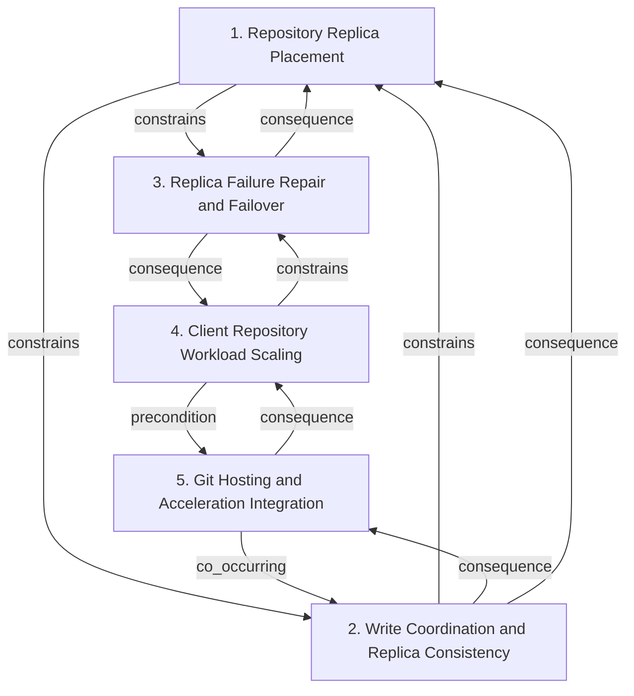

# Grounded Theory Report

## Narrative Summary

This taxonomy identifies the architectural design decisions involved in making Git repositories operate at scale: across very many repositories, very large repositories, and very many users, on both hosting servers and clients. For each decision, the catalog records the alternative options considered or adopted, together with the quality attributes, constraints, and practical concerns that shape the choice.

The view is organized into five dimensions. Repository Replica Placement concerns the physical and geographic arrangement of repository copies for scale and durability. Write Coordination and Replica Consistency covers how state changes are coordinated, persisted, ordered, and kept consistent across replicas. Replica Failure Repair and Failover addresses how unhealthy replicas are detected, repaired, isolated, and bypassed during failures or maintenance. Client Repository Workload Scaling focuses on reducing client-side repository data, working-tree size, metadata work, and command latency. Git Hosting and Acceleration Integration covers the integration and deployment of Git protocols, hosting services, clients, and acceleration features.

The diagram and dimension catalogs provide the structural detail: the taxonomy consolidated 179 draft values into 175 distinct values across these five dimensions, with near-duplicates merged where appropriate. Evidence links 272 of 277 open codes to a value, and all 40 source documents support at least one value.

## Dimension Relationship Diagram

## Dimension Catalog

### 1. Repository Replica Placement

Which physical and geographic arrangement of repository copies supports scale and durability?

**Values:**

- **Multi-server repository replication** — Maintaining several repository copies on different servers for distributed availability and consistency.
- **Unsynchronized packfile distribution** — Sending packfiles to hosts without consensus because their objects remain unreachable until references are updated.
- **Multi-disk repository placement** — Distribute one repository across multiple disks to increase parallel operation capacity.
- **Multi-machine repository placement** — Place repository data across multiple machines to preserve availability and parallelism.
- **HTTP daemon over on-disk repository** — Place an HTTP daemon directly in front of a filesystem-resident repository.
- **Three-replica repository placement** — Place each repository on a fixed three-replica cluster to balance redundancy, service capacity, and one-machine failure tolerance.
- **Replica trimming for lightly used repositories** — Reduce replica counts for low-demand repositories to avoid fixed redundancy cost.
- **DRBD filesystem block replication** — Use latency-sensitive filesystem block replication with replicas kept colocated.
- **Multi-rack repository replication** — Replicating repositories across distinct racks to tolerate rack-level failures.
- **On-disk repository source of truth** — Authoritative repository state is maintained in replicated on-disk repository copies.
- **Fully synchronized replica state** — Resulting state in which every replica contains the accepted push and can serve consistent reads.
- **Durable highly available repository access** — Maintain repository and gist access despite server and network failures through replicated placement.
- **Packfile-centered scalability ceiling** — Filesystem-dependent packfiles limit repository scalability, availability, and parallel operation capacity.
- **Replica-count scalability ceiling** — Adding replicas to a synchronous transaction cluster produces tail latency and limits repository push throughput.
- **Monorepo capacity shortfall** — The adopted replica arrangement fails to provide sufficient capacity for massive monorepo and CI traffic.
- **Full replica-state checksum overhead** — Recomputing replica-state checksums from scratch consumes capacity in repositories with many references.
- **Replica-count floor-ceiling mismatch** — A fixed redundancy floor wastes resources for small repositories while replica expansion fails to scale massive repositories.
- **Linear read scaling** — Read throughput increasing linearly as repository replicas are added.
- **Replica-consistency complexity cost** — High implementation complexity caused by maintaining fully synchronized replicas.
- **Distributed-model hosting burden** — The operational difficulty of hosting repositories under a distributed version-control model.

**Outgoing relations:**

- **constrains** → Replica Failure Repair and Failover (#3): Quorum and replica-agreement choices determine how many servers can be unavailable during maintenance or failure while preserving writes and reads.
- **constrains** → Write Coordination and Replica Consistency (#2): Replica coordination determines whether repository persistence and publication can be implemented through synchronized replicas or a separately durable ingestion log.

### 2. Write Coordination and Replica Consistency

How are repository state changes coordinated, persisted, ordered, and made consistent across replicas?

**Values:**

- **S3-compatible write-ahead log** — Persisting every push as a durable write-ahead-log entry in object storage.
- **Durability-before-acknowledgment** — Acknowledging a push only after its write-ahead-log entry is fully persisted.
- **Reference-transaction publication gate** — Separating durable ingestion from visibility by requiring a prepared reference transaction and recorded log pointer.
- **Single-object write per push** — Issuing one object-storage PUT for every push, which would expose ingestion to object-storage latency.
- **Batched WAL persistence** — Batching log persistence to amortize object-storage latency and approach local disk throughput.
- **Local NVMe Git repository** — Maintaining a normal Git repository on fast local NVMe storage for reference-transaction synchronization.
- **Orchestrated push fan-out** — Distributing pushed packfiles and reference transactions to repository replicas through an orchestrator.
- **Three-phase reference commit** — Using three-phase commit for the small reference transaction rather than synchronizing the entire packfile.
- **Prepared reference locking** — Locking and validating the expected reference value until a coordinated transaction commits or aborts.
- **Majority-based write acceptance** — Considering a write durable or a push acceptable only after acknowledgement by a replica majority.
- **Per-write voting protocol** — Selecting each write’s order and outcome through voting rather than through a permanently designated primary.
- **Replica rollback for failed quorum** — Reverting writes that were not identically applied at a majority of replicas.
- **Single-primary write ordering** — Using one elected primary whose arrival order determines authoritative write ordering.
- **Majority-based exclusive write locking** — Acquiring exclusive locks across a replica majority before writes.
- **Minimum two-replica write commitment** — Require every accepted write to reach at least two replicas before admission.
- **Consistency-first write admission** — Prioritize consistency and partition tolerance over accepting writes during insufficient replication.
- **Per-update latency budget** — Bound reference-update latency so repositories sustain a target update rate despite distant replicas.
- **Read-preserving write-path optimization** — Optimize reference-update writes without degrading the much larger repository-read workload.
- **WAL-first storage architecture** — Placing the write-ahead log at the center of durable, consistent horizontal repository scaling.
- **Replicated compaction output** — Replicating compacted repository data rather than independently compacting each replica.
- **S3 Express One Zone WAL storage** — Using S3 Express One Zone for lower-latency, higher-throughput WAL ingestion.
- **Replica-wide write-order serialization** — Applying conflicting writes in the same order on every replica.
- **Concurrent-write elimination** — Preventing conflicting writes from proceeding concurrently.
- **Cross-region replica coordination** — Coordinating updates with distant replicas through multiple network round trips despite substantial latency.
- **Fully consistent replica synchronization** — Keeping all repository replicas synchronized so reads observe recently committed Git state.
- **Eventually consistent repository views** — Allowing replicas to expose temporarily divergent repository state.
- **Packfile-level replication** — Replicating Git data at the packfile layer rather than distributing Git itself.
- **Git-level distribution** — Distributing Git itself or Git-level objects as the replication boundary.
- **Distributed object-level Git storage** — Storing Git objects individually in a distributed key-value store or hash table.
- **Primary-only repository compaction** — Compaction runs only on the primary replica while other replicas consume the resulting state.
- **Replica-local repository repacking** — Each replica independently performs repository repacking.
- **WAL-propagated compaction events** — Compaction results are propagated through the write-ahead log for replicas to reproduce.
- **Incremental geometric repository compaction** — Multi-pack indexes and geometric compaction defer or reduce full repacking as packs accumulate.
- **Periodic repository compaction** — Repository and log storage are compacted periodically to bound restore and lookup costs.
- **Linearizable push ordering** — Resulting single consistent visibility order for push operations.
- **Four-round-trip coordination cost** — Operational latency incurred by the adopted distant-replica coordination protocol. _(consolidated with 1 similar value judged the same decision: "Cross-region coordination latency")_
- **Write unavailability during insufficient replication** — Refuse writes temporarily when the required replica commitments cannot be created.
- **Protection against permanent data loss** — Multiple committed copies make accepted writes highly unlikely to be permanently lost or corrupted.
- **Reference-update amplification** — Internal pull-request and testing workflows multiply one user push into many reference updates.
- **Replica-latency update-rate constraint** — Greater inter-replica latency lowers the sustainable rate of reference updates.
- **Concurrent replica maintenance availability risk** — Concurrent maintenance on replicas can trigger failover and reduce repository availability.

**Outgoing relations:**

- **constrains** → Repository Replica Placement (#1): Durability and publication mechanisms constrain the consistency guarantees that can be offered for accepted pushes.
- **consequence** → Git Hosting and Acceleration Integration (#5): Choosing standard local Git storage enables reuse of upstream Git behavior and reduces specialized implementation requirements.
- **consequence** → Repository Replica Placement (#1): Write commit and persistence choices determine when replicated topology can expose a consistent repository state.

### 3. Replica Failure Repair and Failover

How are unhealthy replicas detected, repaired, isolated, and bypassed during failures or maintenance?

**Values:**

- **Rolling reboot testing** — Testing resilience through controlled, sequential server reboots instead of random failure injection.
- **Chaos-monkey server testing** — Randomly rebooting file servers to inject failures during resilience testing.
- **Pre-reboot server quiescence** — Allowing existing reads to finish while preventing new reads before reboot or retirement.
- **Immediate server reboot** — Rebooting immediately without quiescing, potentially interrupting long-running repository reads.
- **Rack-level maintenance sequencing** — Treating racks as availability zones and completing maintenance on one rack before proceeding to another.
- **Bounded concurrent reboots** — Limiting simultaneous reboots to a small bounded group of servers.
- **Continued write replication during quiescence** — Continuing writes to a quiescing server so it does not accumulate an excessive catch-up backlog.
- **Failure-handling reuse for maintenance** — Applying crash and permanent-failure mechanisms to intentional reboot and retirement operations.
- **Unplanned server unplugging** — Removing a server abruptly without controlled quiescence or failure-handling procedures.
- **Unhealthy-replica isolation** — Excluding replicas that lose a write vote from reads and writes until they are repaired.
- **Automatic replica repair** — Repairing lagging or failed replicas automatically and quickly.
- **Periodic replica-count reconciliation** — Detecting under-replicated repositories and creating replacement replicas.
- **N-to-N replica reconstruction** — Rebuilding replicas from any surviving source onto any available destination in the cluster.
- **Operation-failure-based primary failure detection** — Detect replica failure from failed repository operations rather than heartbeat failure.
- **Supplemental heartbeat recovery signals** — Use heartbeats for load polling and recovery marking without making them primary failure detectors.
- **Heartbeat-based primary failure detection** — Use heartbeat failure as the primary test for replica unavailability.
- **Ordered multi-replica failover** — Try preference-ordered up-to-date replicas when the preferred repository server fails.
- **Advisory replica demotion** — Move repeatedly failing replicas later in preference order while retaining them as fallbacks.
- **Per-application-server failure views** — Maintain failure status separately for each application-server view of file servers.
- **MxN failure-detection model** — Evaluate failures across application-server and file-server pairs instead of one global status.
- **RPC failover monitoring** — Use redirected operation patterns to detect misbehaving repository servers.
- **Per-application-server failure detection** — Having each application server independently determine file-server availability.
- **Combined heartbeat and real-traffic detection** — Combining heartbeat signals with failures observed in real application requests.
- **Consecutive request-failure quarantine threshold** — Quarantining a server after a configured run of consecutive request failures.
- **Single-replica read routing** — Serving each fetch or clone from one up-to-date replica without cross-replica read coordination.
- **Co-located object-cache proxy routing** — Route large-repository object traffic through caches near users and build machines.
- **Arbitrary replica read scale-out** — Adding an arbitrary number of replicas to increase read-only Git throughput.
- **Failure-aware request routing** — Routing repository requests around unavailable or degraded file servers.
- **Incremental replica-state checksum verification** — Maintain replica-state checksums incrementally from changed reference-value pairs rather than rescanning all references.
- **External repository-machine routing database** — A maintained routing table maps each repository to every machine hosting a replica.
- **Pet-style repository operations** — Each repository copy is individually tracked, monitored, and repaired rather than treated as interchangeable capacity.
- **Two-copy failure degradation** — Resulting state after sudden server loss, in which two surviving copies serve traffic but cannot tolerate another failure.
- **Lost clone progress after shutdown** — Resulting user impact when an abrupt shutdown interrupts a large clone and forces it to restart elsewhere.
- **Localized application-server failure impact** — Limiting incorrect offline determinations to the affected application server.
- **RPC-failover graph fault visibility** — Making flaky application servers visible in RPC-failover operational graphs.
- **False offline marking of healthy replicas** — Healthy replicas may be quarantined after coincidental request failures, causing a small availability penalty.

**Outgoing relations:**

- **consequence** → Repository Replica Placement (#1): Replica coordination choices determine whether remaining replicas can continue reads and majority-based writes during server absence.
- **consequence** → Client Repository Workload Scaling (#4): Maintenance and failure handling directly affect whether large client fetches and clones complete without losing transferred progress.

### 4. Client Repository Workload Scaling

How should clients reduce repository data, working-tree size, metadata work, and command latency at large scale?

**Values:**

- **Compressed Git index** — Compressing client-side index metadata to reduce repository metadata size.
- **Hourly background fetches** — Fetching periodically in the background to keep local repositories synchronized without manual initiation.
- **Automatic commit-graph and multi-pack maintenance** — Updating advanced Git structures in the background as history and pack data grow.
- **Built-in file system monitor** — Using Git’s file system monitor to accelerate status and add operations in large working trees.
- **Partial clone** — Downloading only objects needed for the current checkout to reduce client transfer and storage.
- **Sparse checkout** — Materializing only necessary files in the working directory to reduce filesystem scale.
- **Source repository placement under /src** — Keeping generated build artifacts outside the repository working tree to limit its effective scope.
- **Single-pack-file repacking** — Consolidate repository data into one pack file during garbage collection.
- **Loose-object and delta-packed maintenance** — Use cleanup and delta-compressed pack storage to control object count, lookup cost, and disk usage.
- **Central-server on-demand object retrieval** — Rely on a central server to supply Git objects missing from the client when commands or working-directory scope require them.
- **GVFS object-transfer protocol** — Use GVFS transfer semantics to clone and retrieve only the large-repository objects needed by the client.
- **Hidden-reference background fetch** — Fetch objects and hidden refs asynchronously while preserving visible branch references for explicit foreground updates.
- **Background repository maintenance** — Deferring repository upkeep to background processes instead of interactive commands.
- **Incremental repository maintenance** — Maintaining repository data incrementally rather than rewriting it all at once.
- **Foreground automatic garbage collection** — Running automatic garbage collection during user-facing Git commands.
- **Full repository rewrite garbage collection** — Rewriting the complete object store during garbage collection.
- **Disabled automatic garbage collection** — Disabling automatic garbage collection and accepting accumulating repository maintenance debt.
- **DAG-dependent repository traversal** — Traversing commits, trees, and parents through sequentially dependent Git object lookups.
- **Git-aware filesystem watcher** — A Git-integrated watcher uses repository knowledge, including ignored paths, to reduce change-detection work.
- **Watchman-based filesystem watcher** — A general-purpose Watchman watcher supplies filesystem change notifications without Git-specific ignore-rule knowledge.
- **Background garbage-collection delegation** — Automatic garbage collection is suppressed during user commands and delegated to background maintenance.
- **Suppressed ahead-behind status calculation** — Status omits branch ahead-behind comparison to reduce repeated command latency.
- **Virtualized filesystem population** — A virtualized filesystem delays populated-size costs and accelerates checkout by presenting files on demand.
- **Foreground maintenance execution** — Operators explicitly run individual or complete repository maintenance tasks on demand.
- **Combined repository maintenance command** — Configuration, fetching, graph updates, loose-object cleanup, and pack cleanup run as one consolidated maintenance operation.
- **Pack-index accumulation overhead** — Object lookups slow as repositories accumulate more pack indexes.
- **Loose-object storage overhead** — Accumulated loose objects increase performance and disk-space costs.
- **Foreground-fetch commit-graph overhead** — Writing commit graphs during foreground fetches adds command latency and motivates asynchronous maintenance.
- **Commit-graph performance benefit** — Commit graphs preserve history-query performance in repositories with very large commit counts.
- **Pack-count and storage reduction** — Incremental repacking reduces pack-file count and aggregate repository storage substantially.
- **High populated-file processing cost** — Populating and detecting modifications in working-tree files imposes substantial data movement and processing cost.
- **Interactive command blocking** — User-facing commands waiting for expensive repository maintenance.
- **System-wide resource exhaustion** — Repository maintenance consuming enough CPU and memory to stall the client system.
- **Client-compatible clone efficiency** — Preserving efficient Git-client cloning by retaining native repository data.
- **Distributed-store traversal round trips** — Repeated remote lookups required by dependent Git DAG traversal.
- **Poor clone performance** — Unacceptably slow cloning caused by distributed object storage and packfile transfer constraints.
- **Git on-disk compaction bottleneck** — Git disk compaction becoming the throughput limit at high ingestion scale.
- **Externalized build output** — Build artifacts reside outside the Git working directory to reduce working-directory management work.

**Outgoing relations:**

- **precondition** → Git Hosting and Acceleration Integration (#5): Client-scale features require repository activation and configuration through the supporting acceleration tooling.
- **constrains** → Replica Failure Repair and Failover (#3): Long-running client operations make server maintenance choices consequential because interrupted clones can lose substantial progress.

### 5. Git Hosting and Acceleration Integration

How are Git protocols, hosting services, clients, and acceleration features integrated and deployed?

**Values:**

- **Explicit repository registration** — Requiring users to activate Scalar management explicitly from a repository working directory.
- **Local Git configuration setup** — Applying repository-specific Git configuration during activation.
- **User-controlled maintenance suspension** — Providing commands to pause or unregister background repository maintenance.
- **Custom Git client dependency** — Requiring a custom Git release to provide acceleration functionality.
- **Upstream contribution to core Git** — Moving acceleration features into core Git to remove the custom-client requirement.
- **Service-independent acceleration** — Supporting accelerated repositories regardless of their hosting service.
- **Internal-to-customer platform reuse** — Reuse an internally built hosting platform to serve external customers with the same operational model.
- **Painless migration path** — Provide a low-disruption migration route from existing repository hosting into the new platform.
- **Continuous infrastructure evolution** — Continue adapting repository-hosting infrastructure as version-control demands change.
- **Reliability-, performance-, and scale-oriented hosting platform** — Build hosting infrastructure specifically to improve repository reliability, performance, and scale.
- **Proven engineering and operational philosophy** — Apply an engineering and operational approach presented as proven at comparable scale and reliability demands.
- **GVFS protocol support in Scalar** — Keep GVFS protocol support in Scalar for services that provide it rather than making it a standard Git capability. _(consolidated with 1 similar value judged the same decision: "GVFS protocol exclusion from standard Git")_
- **Automatic Git performance configuration** — Automatically configure repositories with advanced Git performance settings instead of requiring users to manage them manually.
- **Forked Git implementation** — Maintaining a modified Git implementation for nonstandard repository storage.
- **Reduced Scalar scope** — Deliberately shrinking Scalar's long-term role as Git gains native capabilities.
- **Scalar interim performance layer** — Using Scalar to provide required performance while core Git improves.
- **Core Git eventual performance path** — Transitioning performance capabilities from Scalar into the core Git client.
- **Git feature contributions replacing management layers** — Replacing separate management layers with capabilities contributed to Git.
- **Native Git repository integration** — Building around Git's native repository format without modifying or forking Git.
- **Decentralized repository workflow** — Supporting independent maintainers and decentralized repository collaboration.
- **Offline development capability** — Allowing repository work without contacting the centralized host.
- **Delayed push capability** — Allowing changes to be pushed after offline or deferred development.
- **Packfile-based Git network transfer** — Using packfiles as the Git protocol's network transfer representation.
- **Distributed Git hosting architecture** — Using distributed repositories as the architectural model for hosting Git data.
- **Centralized Git hosting architecture** — Using a centralized host for repository collaboration despite distributed clients.
- **Separate fetch-objects service endpoint** — Branch updates come from the central authority while packfiles are downloaded from a separate cache-like endpoint.
- **Co-located GVFS cache infrastructure** — A cache server is deployed alongside repository infrastructure to serve GVFS requests for large user populations.
- **Git protocol without GVFS cache infrastructure** — An existing Git-protocol repository is used when the organization cannot operate GVFS cache infrastructure.
- **GVFS without cache infrastructure** — GVFS is adopted without the cache-server infrastructure needed to support its scalable request model.
- **Network-filesystem repository hosting** — Repositories are stored on a centralized network filesystem for access by multiple application instances.
- **Background repository configuration updates** — Registered repositories receive evolving configuration changes in the background without blocking user work.
- **Rails monolith with co-located repositories** — A Rails application and repository copies share a machine as a simple hosting baseline.
- **Horizontal application-instance scaling** — Additional application instances scale request handling while requiring repositories to become broadly accessible.
- **Filesystem-level repository distribution** — Repository filesystems are distributed across machines while the application and Git implementation remain unchanged.
- **Packfile-level repository distribution** — Packfiles rather than complete filesystems are distributed to scale repository access.
- **Git-level repository access redesign** — Git itself is modified to support the hosting scale-out architecture.
- **JGit repository abstraction for distributed storage** — A Git repository abstraction is retained while replacing packfile storage with a distributed object store.
- **Commit-graph maintenance latency** — Operational time incurred by background commit-graph writing and verification.
- **Agent-driven repository workload growth** — Increased code, pull-request, and CI volume raises hosting scalability and reliability demands.
- **Repository availability dependency** — Developer productivity and business continuity depend on repository push and pull availability.
- **High cost of CI downtime** — Even short CI outages impose substantial productivity costs.
- **Network-filesystem semantic incompatibility** — Network filesystem locking, tearing, reading, and synchronization semantics cause slow and buggy Git operations.

**Outgoing relations:**

- **consequence** → Client Repository Workload Scaling (#4): Registration and configuration choices enable the client-side scale mechanisms such as sparse checkout, background maintenance, and partial clone.
- **co_occurring** → Write Coordination and Replica Consistency (#2): Service-independent tooling and upstream Git reuse commonly accompany storage designs that preserve ordinary Git repository semantics.

## Evaluation

_Observe-only LLM-as-judge scoreboard (judge: openai/gpt-5.6-luna). Pass flags are display-only — nothing gates on them._

| Criterion | Score | Pass | Reason |
|---|---|---|---|
| Orthogonality | 0.30 | ✗ | The five top-level questions are partly distinct, but several dimensions contain alternatives answering the same architectural question. Most notably, dimension 2, "Write Coordination and Replica Consistency," duplicates dimension 5, "Git Hosting and Acceleration Integration," through distribution-boundary choices: move 2.27-2.29 (packfile-, Git-, and object-level distribution) to the hosting/integration dimension or consolidate them with 5.34-5.37. Dimension 1, "Repository Replica Placement," also overlaps dimension 5 through hosting-placement alternatives such as 5.30 and 5.32-5.35; move those physical distribution choices into dimension 1. Dimension 1 further mixes coordination answers and outcomes: move 1.2, 1.10, 1.11, and 1.19 to dimension 2. Finally, client acceleration choices overlap between dimensions 4 and 5, especially 4.11 and 5.12 and the custom/core-Git alternatives 5.4-5.5; keep workload-reduction mechanisms in dimension 4 and move protocol/client-integration alternatives to dimension 5. |
| Clarity | 0.60 | ✓ | The five dimension descriptions generally pose recognizable questions, and most values have specific, distinguishable labels—for example, 2.10 Majority-based write acceptance differs from 2.13 Single-primary write ordering, and 4.5 Partial clone differs from 4.6 Sparse checkout. However, several dimensions are overloaded or contain values whose descriptions do not match the named decision. Dimension 1, Repository Replica Placement, mixes placement choices (1.1, 1.6, 1.9) with serving/storage boundaries (1.2, 1.5, 1.10) and outcomes (1.13–1.20); split it into separate existing-content questions or move the non-placement values. Dimension 3, Replica Failure Repair and Failover, includes testing choices 3.1–3.2, cache routing 3.26, checksum verification 3.29, and routing metadata 3.30, which do not clearly answer its failure-repair question; reorganize these under the relevant existing decision group. Dimension 5, Git Hosting and Acceleration Integration, is especially overloaded: values 5.20–5.25 describe Git’s architectural model, 5.26–5.37 describe hosting and distribution mechanisms, and 5.1–5.18 describe Scalar/client integration; split or rename the dimension and reorganize those existing values. Within dimension 2, closely related values such as 2.10, 2.14, 2.15, and 2.16 should have descriptions that explicitly state their distinct decision boundaries rather than all broadly describing consistency-first quorum behavior. |
| Completeness | 0.90 | ✓ | All major areas implied by the use case have decision points with several candidates: server-side placement and replication in dimension 1, write coordination and consistency in dimension 2, failure repair and failover in dimension 3, client scaling in dimension 4, and hosting, protocol, and acceleration integration in dimension 5. These cover very many repositories, very large repositories, very many users, and both servers and clients. No major area lacks a multi-candidate decision point; only the repository-allocation choices for the very-many-repositories case are distributed across dimensions 1 and 5 rather than organized in one place. |
| Use case alignment | 0.80 | ✓ | All five dimensions are substantially within scope: replica placement, write consistency, failure repair, client workload scaling, and hosting/acceleration architecture directly address scaling Git across servers and clients. The main scope issue is dimension 5, "Git Hosting and Acceleration Integration," which includes tangential values such as 5.9 "Continuous infrastructure evolution," 5.11 "Proven engineering and operational philosophy," and 5.20–5.22 "Decentralized repository workflow," "Offline development capability," and "Delayed push capability." Drop those values or move them out of this taxonomy, retaining the hosting, protocol, client-integration, and deployment choices. Dimension 1 also contains somewhat indirect values such as 1.20 "Distributed-model hosting burden"; drop it if the taxonomy is limited to architectural decisions rather than general operational effects. |
| No catch-alls | 0.80 | ✓ | The taxonomy largely avoids explicit catch-all buckets and most values are concrete alternatives or outcomes. The main exceptions are value 5.9, "Continuous infrastructure evolution," which is an overly broad general strategy; value 5.10, "Reliability-, performance-, and scale-oriented hosting platform," which bundles general goals rather than a specific decision; and value 5.11, "Proven engineering and operational philosophy," which is a vague umbrella. Drop these three values or reorganize their specific content into the existing focused dimensions; no other clear catch-all dimension or value is present. |
| Axis vs. value | 0.20 | ✗ | The taxonomy repeatedly violates the one-decision-per-dimension rule. Dimension 1, "Repository Replica Placement," mixes placement with synchronization and hosting choices: move 1.2 and 1.10 to the consistency/authority decision, and separate replica-count policy such as 1.7 from physical placement. Dimension 2, "Write Coordination and Replica Consistency," combines WAL durability, commit coordination, replication boundaries, quorum policy, and compaction; split it into separate questions and reorganize values such as 2.1–2.5, 2.8–2.18, and 2.27–2.34 accordingly. Dimension 3 mixes failure testing, maintenance sequencing, failure detection, routing, and repair; split these decision points and move values such as 3.1–3.9, 3.14–3.24, and 3.25–3.31. Dimension 4 combines client data selection, filesystem/worktree scope, monitoring, and repository maintenance; split it and relocate values such as 4.5–4.7, 4.18–4.23, and 4.24–4.25. Dimension 5 combines client integration, hosting topology, protocol/cache deployment, and migration; split it and reorganize values such as 5.1–5.6, 5.23–5.30, and 5.32–5.37. These are major structural violations even though explicitly marked outcomes are permitted by the evaluation format. |
| One decision point | 0.20 | ✗ | The output contains many genuine alternatives and correctly marks outcomes, but all five dimensions are broad mixtures of different decision questions. Dimension 1, "Repository Replica Placement," combines physical placement (1.3, 1.4, 1.9), replica policy (1.1, 1.6, 1.7, 1.8), and authority/storage architecture (1.5, 1.10); split these into separate questions or move 1.10 to dimension 2. Dimension 2, "Write Coordination and Replica Consistency," mixes WAL persistence (2.1, 2.4, 2.5, 2.21), commit ordering (2.3, 2.8, 2.9, 2.13), quorum/consistency (2.10, 2.12, 2.14, 2.15, 2.16, 2.26), replication boundary (2.27–2.29), and compaction (2.20, 2.30–2.34); split only along those groups, each of which has at least two existing candidates. Dimension 3 combines maintenance testing (3.1–3.9), failure detection (3.14–3.24), repair (3.10–3.13), and routing/read scale-out (3.17–3.31), so split or move values to those decision questions. Dimension 4 mixes client transfer/scope (4.5–4.7, 4.10–4.12), repository maintenance (4.8–4.9, 4.13–4.17, 4.21, 4.24–4.25), and filesystem monitoring (4.4, 4.19–4.20); reorganize these and merge singleton-like items such as 4.1 and 4.2 into the questions they answer. Dimension 5 similarly combines client integration, custom versus core Git (5.4–5.6, 5.12–5.19), hosting topology (5.30–5.37), and protocol/cache deployment (5.23, 5.26–5.29); split these into decision points while preserving at least two candidates per resulting dimension. Thus the taxonomy is relevant to scaling Git across servers and clients, but its decision points are not reliably one-question dimensions. |
| Rejected-alternative handling | 0.90 | ✓ | The taxonomy consistently uses the permitted statuses, distinguishes outcomes such as 1.11 Fully synchronized replica state and 4.32 Interactive command blocking from candidate decisions, and generally describes rejected or mixed alternatives neutrally. Two status-description mismatches should be fixed: 5.29 GVFS without cache infrastructure is marked rejected but says GVFS 'is adopted'; rewrite it to state that this option was considered and declined. 5.12 GVFS protocol support in Scalar is marked mixed but says to 'Keep' it, implying adoption; rewrite it as a contested alternative or explicitly describe the disagreement. No clear duplicate candidate with conflicting statuses or outcome phrased as a selectable alternative is evident. |
| Dimensional coverage | 1.00 | ✓ | All decision-bearing passages can be placed under at least one taxonomy dimension. Scalar choices in s04_p01 and s04_p02 map to client scaling and Git integration values such as partial clone, sparse checkout, background configuration, and upstream Git contributions; replication and consistency decisions in s02_p01, s02_p02, s02_p03, s02_p04, s02_p06, s03_p02, and s03_p09 map to dimensions 1 and 2; maintenance decisions in s05_p09, s05_p11, and s05_p12 map to dimension 4; and quiescence, rolling reboot, repair, and failover decisions in s03_p07 and s03_p08 map to dimension 3. The alternative hosting and storage designs in s01_p03, s01_p04, s01_p05, and s01_p11 are also represented by dimensions 1, 2, and 5. No unplaceable decision-bearing passage was identified. |
| Candidate-decision coverage | 0.80 | ✓ | The taxonomy covers most adopted and rejected options, including Scalar's partial clone, sparse checkout, background maintenance, DRBD rejection, quorum writes, three-phase commit, quiesced maintenance, rolling reboots, and multi-pack indexes. Missing or insufficiently named options remain: add a rendezvous-hashing/stateless on-demand repository placement value to dimension 3, Replica Failure Repair and Failover, supported by s01_p11; add an arbitrary-server primary with CAS/no-consensus value to dimension 2, Write Coordination and Replica Consistency, also supported by s01_p11; add coalesced bookkeeping updates and priority for user-initiated updates to dimension 2, supported by s02_p06; add geographically nearest, non-voting read replicas to dimension 1, Repository Replica Placement, supported by s02_p06 and s02_p01; and add overlapping useful work with network coordination to dimension 2, supported by s02_p03. The RPC-based dedicated-fileserver hosting adopted in s01_p05 is also not explicitly named, and should be added to dimension 5, Git Hosting and Acceleration Integration. |

**Overall score:** 0.65 (mean of evaluated criteria)