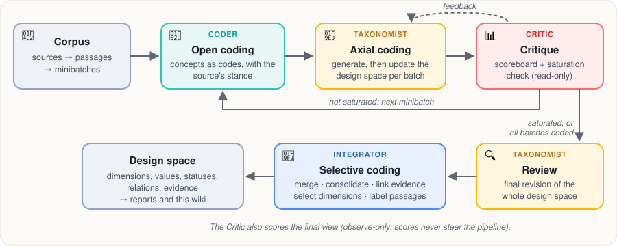

# Approach: how DelveDSpace mines a design space

## What a design space is

A **design space** organizes the design decisions of a domain. Each **dimension** is one decision point, phrased as a question a designer must answer (*where does the source of truth for a repository live?*). Its **values** are the alternative answers found in the documents. Values carry a **status**: *accepted* (a source adopts it), *rejected* (a source considered and declined it), *mixed* (some sources adopt it, others reject it) or *outcome* (an effect of decisions, such as a cost or result, rather than a choice). **Relations** link dimensions that interact (*constrains*, *precondition*, *consequence*, *co-occurring*). Every value keeps its **evidence**: the passages that support it.

## Grounded theory in brief

DelveDSpace follows **grounded theory**, a qualitative method that builds a theory from data instead of testing a theory fixed in advance:

- **Open coding:** read the data closely and name the concepts it contains (*codes*).
- **Axial coding:** relate codes to each other and group them into categories with properties, by **constant comparison** of each new incident with what has been found so far. Here, categories are dimensions and properties are values.
- **Selective coding:** integrate and delimit the theory around the study's question, and validate it against the data.
- **Theoretical saturation:** stop collecting when new data no longer adds concepts.
- **Memos:** record the reasoning behind each analytic step. Here, the explanation of each iteration and the log of editing operations.

## The agents

The pipeline is an orchestrated multi-agent workflow. Agents are roles that share one artifact, the design space under construction, and coordinate through it and through explicit feedback. Their icons are the ones the command line shows while each step runs.

| Agent | Grounded-theory phase | What it does | What it may change |
|---|---|---|---|
| 🔬 **Coder** | Open coding | Names the concepts of each passage as codes, with the source's stance (adopts, rejects, or reports an outcome) | Writes codes; never touches the design space |
| 🧠 **Taxonomist** | Axial coding; final review | Folds each batch's codes into the design space and justifies every change (add, split, merge, move, rename, relate) | Edits the design space |
| 📊 **Critic** | Throughout | Scores each draft on quality criteria and returns actionable issues; decides whether a batch added anything new (saturation) | Reads and judges only |
| 🧲 **Integrator** | Selective coding | Merges duplicates, links evidence, selects the dimensions that pass the support rules, labels the passages | Applies deterministic rules and bounded judgments |

Deterministic checks keep the agents grounded: edits are validated before they apply, evidence is rebuilt from the codes by embedding similarity, and dimensions need enough sources and at least two candidate decisions to be kept.

## The extraction workflow

1. 📂 📦 **Prepare the corpus.** Sources are split into passages of about 300 words (ids such as `s03_p02`: source 3, passage 2) and shuffled into minibatches.
2. 🔬 **Open coding (Coder).** Each passage of a minibatch gets its codes and stances.
3. 🧠 🔄 **Axial coding (Taxonomist).** The first minibatch generates an initial design space; each later minibatch updates it. In *tools* mode the Taxonomist edits through validated operations and never drops a value that has evidence.
4. 📊 🧪 **Critique (Critic).** The draft is scored (orthogonality, clarity, one decision per dimension, coverage, …) and the weakest criteria go back to the Taxonomist as feedback. A saturation check compares the next batch's codes with the design space so far.
5. 🔁 **Loop or stop.** Steps 2–4 repeat for each minibatch until a run of batches adds nothing new (saturation) or all batches are coded.
6. 🔍 **Review (Taxonomist).** A final revision of the whole design space.
7. 🧲 🎯 🔖 **Integration (Integrator).** Dimensions naming the same decision are merged; duplicate values are consolidated (embedding distance plus an LLM judge for borderline pairs); each code is linked to its closest value, which yields the evidence; dimensions without enough support are dropped with a recorded rationale; passages are labeled with their main dimension.
8. 📊 **Final evaluation (Critic).** The selected design space is scored once more. Evaluation is *observe-only*: scores never change the design space or steer the pipeline.

## LLM roles

Three roles are configured separately so that judging stays independent of what it judges: the **generation** LLM (Coder, Taxonomist, Integrator judgments), the **evaluation** LLM (Critic) and the **matching** LLM (comparisons with expert ground truth, outside this wiki).

| Role | Model in this run |
|---|---|
| Generation LLM | `openai/gpt-5.6-luna` |
| Evaluation LLM (judge) | `openai/gpt-5.6-luna` |
| Embedding model | `openai/text-embedding-3-small` |

## What in this wiki is not mined

- **Systems** (when present) come from a separate, hand-made map of which passages describe which system; a system's position is the values its passages support.
- **Design points** are sampled combinations of values; their descriptions, and the **source summaries**, are written by an LLM for this wiki and labeled as such.
- Everything else (dimensions, values, statuses, relations, evidence, the narrative summary) is the pipeline's output, rendered without rewording.

## This run's settings

| Setting | Value |
|---|---|
| Passages per minibatch | `8` |
| Taxonomist edit mode | `tools` |
| Saturated batches in a row to stop | `3` |
| Share of the corpus coded before stopping | `0.7` |
| Minimum sources per dimension | `1` |
| Minimum candidate decisions per dimension | `2` |
| LLM relevance filter at selection | `False` |
| Dimension merging | `True` |
| Open coding reads | `content` |
