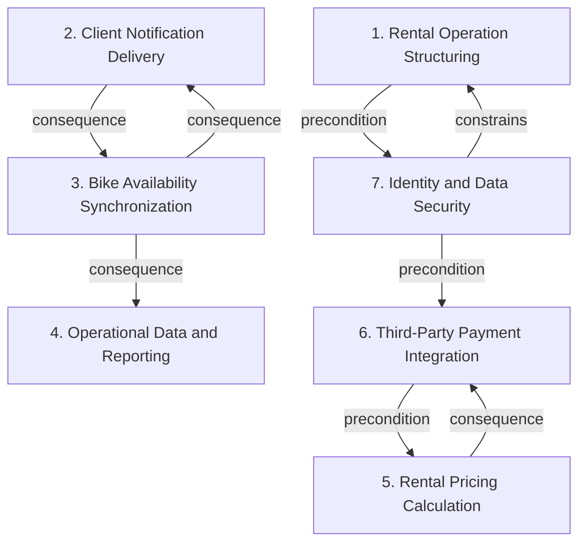

# Grounded Theory Report

## Narrative Summary

This taxonomy supports architectural design decisions for CityBike, a bike-sharing platform for urban mobility and eco-friendly transportation. It focuses on how the system is structured and operated across web and mobile clients, including locating, unlocking by QR code, paying for rentals within a 1000-meter radius, tracking bikes in real time, and meeting GDPR, the Privacy Directive, ISO 27001, and local EU/China standards.

The dimensions capture distinct kinds of architectural concern. Rental Operation Structuring covers how executable rental work is organized and bounded. Client Notification Delivery addresses how riders receive rental, availability, and usage updates. Bike Availability Synchronization focuses on how changes in bike status are detected and reflected in availability data. Operational Data and Reporting covers persistence, querying, aggregation, interpretation, and presentation of operational and usage data. Rental Pricing Calculation separates how charges are determined from how payment is executed. Third-Party Payment Integration describes how external payment providers are connected through a stable internal contract. Identity and Data Security captures authentication, session protection, verification lifecycles, and the confidentiality of user and payment data.

Taken together, these dimensions provide a plain-language map of the main architectural choices involved in building and operating the CityBike platform, before moving into the relationship diagram and the per-dimension catalog.

## Dimension Relationship Diagram

## Dimension Catalog

### 1. Rental Operation Structuring

Architectural patterns for structuring executable rental operations, including command encapsulation and deliberate boundaries around command usage.

**Values:**

- **Command-Based Rental Operations** — Encapsulates rental actions as command objects to organize execution and potentially support queuing, logging, or undo behavior.
- **Scoped Command Application** — Limits command usage to rental operations rather than applying it to notification scheduling, preserving responsibility boundaries.

**Outgoing relations:**

- **precondition** → Identity and Data Security (#7): Authenticated sessions and account protections are required to authorize rental actions safely.

### 2. Client Notification Delivery

Client-facing delivery of rental, availability, and usage updates through observation and asynchronous scheduling mechanisms.

**Values:**

- **Observer-Based Rental Notifications** — Uses observers to notify UI components when rental state changes, keeping client views synchronized with rental activity.
- **Asynchronous Notification Scheduling** — Uses asynchronous scheduling so state-change notifications do not block processing or degrade UI responsiveness.
- **Observer-Based User Updates** — Uses observers to push bike-status and usage-history changes to users and other interested client consumers.

**Outgoing relations:**

- **consequence** → Bike Availability Synchronization (#3): Client notifications commonly consume availability and operational state changes produced by synchronization mechanisms.

### 3. Bike Availability Synchronization

Mechanisms for detecting bike-status changes and refreshing availability data, distinct from broader client notification delivery.

**Values:**

- **Observer-Based Availability Refresh** — Uses observers to refresh the available-bike list whenever a bike status changes.
- **Status-Change Driven Synchronization** — Triggers availability updates directly from bike-status transitions, making state change the synchronization event.

**Outgoing relations:**

- **consequence** → Operational Data and Reporting (#4): Availability changes provide operational state consumed by monitoring, analytics, and reporting functions.
- **consequence** → Client Notification Delivery (#2): Availability state changes are a direct source of client-facing availability notifications.

### 4. Operational Data and Reporting

Persistence, querying, aggregation, interpretation, and presentation of operational and usage data for monitoring and reporting.

**Values:**

- **Aggregated Operations Dashboard** — Aggregates bike status information into an operational dashboard for centralized visibility.
- **Real-Time Operational Monitoring** — Provides live visibility into bike conditions and platform operations.
- **Usage Analytics Processing** — Processes usage data to support operational analysis and service optimization.
- **Repository-Based Bike Persistence** — Uses repository abstractions to isolate bike-domain persistence from application and domain logic.
- **Repository-Based Usage Querying** — Uses repository abstractions to query usage statistics while separating analytics access from storage implementation.
- **Builder-Based Usage Reports** — Uses a Builder pattern to compose structured usage-history reports from multiple report components.
- **Downloadable Usage History** — Produces usage-history reports as downloadable artifacts for rider-facing history access.

**Outgoing relations:**

_No outgoing relations._

### 5. Rental Pricing Calculation

Architectural strategies for determining rental charges, separate from external payment transaction execution.

**Values:**

- **Strategy-Based Pricing Calculation** — Uses a dedicated strategy abstraction to select and vary rental pricing calculation behavior.
- **Separated Pricing and Notification Timing** — Keeps notification timing outside pricing calculation, separating charge computation from event delivery responsibilities.

**Outgoing relations:**

- **consequence** → Third-Party Payment Integration (#6): Pricing decisions produce the rental amount later used by payment processing.

### 6. Third-Party Payment Integration

Abstraction and decoupling choices for integrating external payment providers through a stable internal payment contract.

**Values:**

- **Adapter-Based Payment Integration** — Wraps third-party payment providers with adapters so provider-specific interfaces conform to the platform's internal contract.
- **Common Internal Payment Interface** — Exposes a common internal payment interface, insulating rental services from provider-specific APIs and implementation details.

**Outgoing relations:**

- **precondition** → Rental Pricing Calculation (#5): Payment integration requires a computed charge amount from the rental pricing strategy.

### 7. Identity and Data Security

Controls identity, authentication, session protection, verification lifecycles, and confidentiality of user and payment data.

**Values:**

- **Fifteen-Minute Inactivity Timeout** — Automatically logs users out after 15 minutes of inactivity to reduce unauthorized access risk.
- **Identity Data Collection at Signup** — Collects identity information during signup as part of account creation and access management.
- **Contact Data Collection at Signup** — Collects contact information during signup to support account verification and user communication.
- **Password-Based Authentication** — Requires password credentials for account creation and subsequent authentication.
- **Optional Location Data Collection** — Makes location collection optional, supporting location-aware services while preserving user choice and privacy.
- **Registration Security Controls** — Applies security controls to registration workflows to protect onboarding data and account creation.
- **Thirty-Minute Verification-Code Validity** — Sets verification-code validity to 30 minutes, limiting the exposure period for account verification.
- **Verification-Code Delivery Channel** — Delivers verification codes through an explicitly selected communication channel within the authentication flow.
- **Thirty-Second Verification-Code Validity** — Sets verification-code lifetime to 30 seconds to prevent reuse and reduce authentication abuse.
- **Encryption of Data in Transit** — Encrypts user and payment data during transmission to protect confidentiality across web and mobile communications.
- **Encryption of Stored User Data** — Encrypts persisted user information to protect confidentiality of stored registration and payment-related data.
- **Registration Data Confidentiality** — Applies confidentiality protections specifically to registration information handled during onboarding.
- **Payment Data Confidentiality** — Applies confidentiality protections to payment-related information handled by the platform and external payment integrations.

**Outgoing relations:**

- **constrains** → Rental Operation Structuring (#1): Security controls restrict access to rental and payment operations and protect associated user information.
- **precondition** → Third-Party Payment Integration (#6): Identity verification and secure data handling are required before protected payment operations can proceed.
