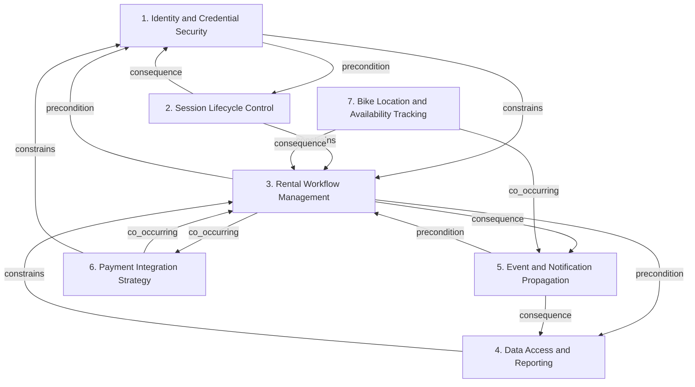

# Grounded Theory Report

## Narrative Summary

This taxonomy summarizes architectural design decisions for CityBike, a bike-sharing platform for urban mobility and eco-friendly transportation available on both web and mobile devices. Riders use it to find bikes within a 1000-meter radius, unlock them with a QR code, and pay for rentals, while the system must comply with the GDPR, the Privacy Directive, ISO 27001, and local EU/China standards and protect user and payment data.

The dimensions capture different kinds of architectural choices that can vary independently. Some decisions focus on secure identity and access, including Identity and Credential Security and Session Lifecycle Control. Others describe how the rental process is structured through Rental Workflow Management, how platform data is stored and queried through Data Access and Reporting, and how bike positions and availability are found and monitored through Bike Location and Availability Tracking.

The taxonomy also separates choices about how the platform communicates and integrates: Event and Notification Propagation covers asynchronous propagation of domain and bike-status changes, and Payment Integration Strategy covers delegation to external payment providers. Taken together, these dimensions provide a plain-language map of the main architectural concerns in the CityBike system before the detailed catalog and relationship diagram.

## Dimension Relationship Diagram

## Dimension Catalog

### 1. Identity and Credential Security

Authentication methods, credential protection, and verification-token policies that establish secure user identity contexts.

**Values:**

- **Email/password authentication** — Uses email and password as the primary user authentication mechanism.
- **Transport and storage protection** — Protects credentials during transmission and while stored by the platform.
- **Ephemeral verification code authentication** — Generates and delivers short-lived verification codes to support secure account authentication.
- **30-minute verification-code validity** — Expires verification-code tokens after a specified 30-minute validity window to limit replay risk.
- **30-second verification-code validity** — Applies a 30-second expiration policy to one-time verification codes.

**Outgoing relations:**

- **precondition** → Session Lifecycle Control (#2): Identity controls determine which authenticated context can be established before protected sessions and rental operations begin.
- **constrains** → Rental Workflow Management (#3): Credential and token protections constrain secure access to rental operations.

### 2. Session Lifecycle Control

Policies for ending authenticated access, including explicit logout and automatic expiration, independently of rental state.

**Values:**

- **Immediate logout termination** — Provides an explicit logout action that immediately invalidates or ends the current user session.
- **Inactivity-based session timeout** — Automatically ends a user session after 15 minutes of inactivity.

**Outgoing relations:**

- **consequence** → Identity and Credential Security (#1): Session termination enforces the security boundary established by identity and credential mechanisms.
- **constrains** → Rental Workflow Management (#3): Session validity affects whether users may initiate or continue protected rental operations.

### 3. Rental Workflow Management

State models and execution strategies for progressing rentals through unlock, active use, timing, and return stages.

**Values:**

- **State-machine workflow** — Represents navigation and rental progression with explicit states rather than ad hoc conditional transitions.
- **QR-based bike unlocking** — Starts a rental by scanning a bike QR code and transitioning the rental into an unlocked state.
- **Rental lifecycle state tracking** — Tracks checkout, active ride, return, and related bike-status transitions as explicit lifecycle states.
- **Rental duration tracking** — Monitors elapsed rental time to support time-based management of active bike rentals.
- **Command-based rental operations** — Encapsulates rental actions as command objects, separating action requests from their execution.
- **Separate notification scheduling** — Keeps notification scheduling outside command execution, assigning timing and delivery to a distinct mechanism.

**Outgoing relations:**

- **precondition** → Identity and Credential Security (#1): Authenticated identity is required before unlocking or changing protected rental states.
- **precondition** → Data Access and Reporting (#4): Persistent operational data supports rental lifecycle decisions and history retrieval.
- **consequence** → Event and Notification Propagation (#5): Rental transitions and timing actions generate events consumed by notification mechanisms.
- **co_occurring** → Payment Integration Strategy (#6): Payment handling commonly accompanies or constrains rental completion while remaining a separate integration concern.

### 4. Data Access and Reporting

Abstractions and policies for storing, querying, retrieving, and assembling operational, historical, and analytical platform data.

**Values:**

- **Repository-based persistence abstraction** — Uses repositories to decouple domain services from persistence technology while supporting bike-data queries.
- **Usage-statistics persistence** — Persists and retrieves usage statistics alongside operational bike information for platform analysis.
- **Downloadable usage history reports** — Assembles usage-history data into reports that riders can download.
- **Builder-based report assembly** — Uses the Builder pattern to construct downloadable reports from composed usage-history data.

**Outgoing relations:**

- **constrains** → Rental Workflow Management (#3): Persistent, queryable data constrains lifecycle decisions and supports downloadable usage history.

### 5. Event and Notification Propagation

Patterns for propagating domain and bike-status changes asynchronously to interfaces, subscribers, and dependent components.

**Values:**

- **Observer-based state notifications** — Uses observers to push rental-state changes to the UI or subscribed components.
- **Scheduled event delivery** — Uses scheduler assistance when notification dispatch requires deferred or timed delivery.
- **UI synchronization on state change** — Updates client components when rental state changes so displayed availability and ride status remain synchronized.
- **Event-driven bike registration** — Treats bike registration as an initiating domain event that triggers subsequent processing.
- **Asynchronous downstream bike updates** — Processes bike removal and update actions asynchronously after registration or other lifecycle events.
- **Pre-timeout expiry notifications** — Sends reminders before rental expiry based on monitored duration and scheduled timing.
- **Observer-based user notifications** — Uses observer subscriptions to notify users about bike-status changes and newly available usage history.
- **Observer-based bike availability refresh** — Refreshes available-bike listings when bike-status events occur.

**Outgoing relations:**

- **precondition** → Rental Workflow Management (#3): Rental, timing, and bike-status transitions provide source events for notification and subscriber mechanisms.
- **consequence** → Data Access and Reporting (#4): Propagation can expose updated availability and usage-history information after data changes.

### 6. Payment Integration Strategy

Abstractions and delegation strategies for connecting the platform with external payment providers and interchangeable payment-processing implementations.

**Values:**

- **Payment facade abstraction** — Hides payment-processing complexity behind a simple facade exposed to application services.
- **Delegation to payment services** — Delegates facade operations to underlying payment services or third-party payment providers.
- **Strategy-based payment methods** — Uses separate strategy classes to support interchangeable payment-processing methods.

**Outgoing relations:**

- **co_occurring** → Rental Workflow Management (#3): Payment authorization and processing support rental completion but cross a separate external-service boundary.
- **constrains** → Identity and Credential Security (#1): Payment data handling must respect platform security and privacy controls.

### 7. Bike Location and Availability Tracking

Approaches for locating, filtering, monitoring, and presenting bike positions and availability across the service area.

**Values:**

- **Radius-based bike proximity filtering** — Returns bike locations within a specified radius of the rider, supporting the 1000-meter service-area requirement.
- **Real-time bike status tracking** — Provides live bike-status information for availability and operational monitoring.

**Outgoing relations:**

- **co_occurring** → Event and Notification Propagation (#5): Location and availability information is propagated to clients through event and notification mechanisms.
- **consequence** → Rental Workflow Management (#3): Rental lifecycle changes alter bike availability and status information.
