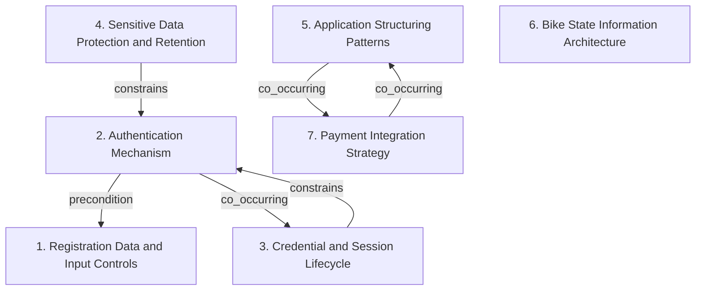

# Grounded Theory Report

## Narrative Summary

This taxonomy supports architecture design decisions for CityBike, a bike-sharing platform for urban mobility and eco-friendly transportation that works on both web and mobile devices. Riders use it to find bikes within a 1000-meter radius, unlock them with a QR code, and pay for rentals, while the system also needs to protect user and payment data and comply with the GDPR, the Privacy Directive, ISO 27001, and local EU/China standards.

The dimensions separate different kinds of architectural concern. Some focus on user access and identity: Registration Data and Input Controls covers what users must provide and how inputs are validated, Authentication Mechanism covers how rider identity is established, Credential and Session Lifecycle covers expiry and termination rules, and Sensitive Data Protection and Retention covers how personal, payment, and biometric data are protected, minimized, retained, and deleted. Others address how the application is organized and how core bike information is handled: Application Structuring Patterns covers rental state management, pricing logic, command handling, scheduling, and report assembly, while Bike State Information Architecture covers bike-state notification, event propagation, geospatial discovery, and aggregated fleet information access. Payment Integration Strategy captures how heterogeneous third-party payment providers are abstracted, normalized, or wrapped in a façade.

## Dimension Relationship Diagram

## Dimension Catalog

### 1. Registration Data and Input Controls

Captures variation in personal registration fields, optional attributes, credential inputs, and validation controls, distinct from subsequent authentication behavior.

**Values:**

- **Validated personal-data registration** — Collects personal registration data, including a password and optional zip code, with security and validation considerations.

**Outgoing relations:**

_No outgoing relations._

### 2. Authentication Mechanism

Captures variation in primary authentication factors and token-based mechanisms used to establish rider identity after registration.

**Values:**

- **Biometric thumbprint login** — Uses a biometric thumbprint as the rider login mechanism.
- **Ephemeral verification-code authentication** — Authenticates users with verification codes generated, delivered through a selected channel, and valid for a limited period.
- **Email-password authentication** — Uses an email address and password as the primary user authentication mechanism.

**Outgoing relations:**

- **precondition** → Registration Data and Input Controls (#1): A registered account or identity record is required before a primary authentication mechanism can establish rider identity.
- **co_occurring** → Credential and Session Lifecycle (#3): Authentication mechanisms commonly require complementary expiration and inactivity controls to limit credential and session exposure.

### 3. Credential and Session Lifecycle

Captures variation in expiration, inactivity, scheduling, and explicit termination policies governing credentials, rentals, and authenticated sessions.

**Values:**

- **Thirty-minute verification-code expiration** — Expires verification codes after 30 minutes as an authentication security control.
- **Inactivity-based session timeout** — Automatically logs users out after 15 minutes of inactivity.
- **Manual session logout termination** — Provides an explicit logout control that terminates the active user session immediately.
- **Short-lived verification-code timeout** — Uses a short timeout to invalidate one-time verification codes when they are not entered promptly.
- **Scheduler-driven rental-duration notifications** — Tracks rental durations and schedules notifications before rental expiry.

**Outgoing relations:**

- **constrains** → Authentication Mechanism (#2): Lifecycle controls restrict how long authentication mechanisms remain usable, reducing exposure after compromise, inactivity, or explicit logout.

### 4. Sensitive Data Protection and Retention

Captures variation in protection, minimization, retention, and deletion treatment for personal, payment, and biometric data.

**Values:**

- **Immediate biometric-data deletion** — Deletes biometric data immediately after successful authentication to support data minimization and privacy compliance.
- **End-to-end personal and payment data encryption** — Uses encryption for registration and payment data during transmission and while stored.

**Outgoing relations:**

- **constrains** → Authentication Mechanism (#2): Protection and retention decisions constrain authentication and account implementations by limiting exposure and reuse of sensitive data.

### 5. Application Structuring Patterns

Captures variation in application structuring patterns for rental state management, pricing logic, command handling, scheduling, and report assembly.

**Values:**

- **Command-based rental operations** — Models rental operations as commands, separating action invocation from notification scheduling.
- **Strategy-based rental pricing** — Uses the Strategy pattern to substitute alternative rental pricing calculations independently of notification timing or delivery.
- **Builder-based usage report assembly** — Uses the Builder pattern to assemble downloadable usage-history reports.
- **State-based rental lifecycle management** — Uses the State pattern to manage rental lifecycle states and scheduler-driven timing notifications.
- **State-machine rental workflow** — Uses a state machine to coordinate navigation, QR scanning, bike unlocking, and rental lifecycle transitions.

**Outgoing relations:**

- **co_occurring** → Payment Integration Strategy (#7): Payment processing commonly participates in rental operations, while provider abstraction remains a separate integration concern.

### 6. Bike State Information Architecture

Captures variation in bike-state notification, event propagation, geospatial discovery, and aggregated fleet information access.

**Values:**

- **Observer-based user notifications** — Uses the Observer pattern to notify users of bike status changes and usage-history availability.
- **Asynchronous bike-lifecycle events** — Uses asynchronous domain events to trigger downstream bike-removal processing after bike registration.
- **Observer-based bike availability updates** — Uses Observer-based updates so components react to bike status or location changes and keep availability lists current.
- **Radius-based nearby bike discovery** — Queries bike locations and filters results to bikes within a specified distance radius.
- **Real-time fleet status monitoring dashboard** — Provides an aggregated real-time dashboard for bike status, usage analytics, and fleet operational oversight.
- **Observer-based rental-state notifications** — Uses Observer-based notifications to propagate rental-state changes to user interfaces or dependent components.

**Outgoing relations:**

_No outgoing relations._

### 7. Payment Integration Strategy

Captures variation in abstraction, normalization, and façade strategies for integrating heterogeneous third-party payment providers.

**Values:**

- **Adapter-based payment provider integration** — Places third-party payment APIs behind adapters and a common internal interface, normalizing provider-specific contracts.
- **Facade-based payment processing** — Provides a simplified payment façade that delegates processing internally to payment services.

**Outgoing relations:**

- **co_occurring** → Application Structuring Patterns (#5): Payment processing commonly participates in rental operations, while provider abstraction remains a separate integration concern.
