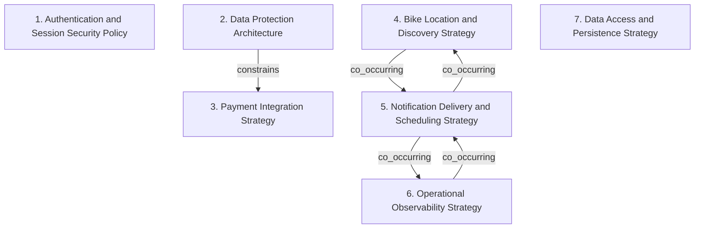

# Grounded Theory Report

## Narrative Summary

This taxonomy describes architectural design decisions for CityBike, a bike-sharing platform for urban mobility and eco-friendly transportation available on web and mobile, where riders locate, unlock bikes with a QR code, and pay for rentals within a 1000-meter radius. It is meant to help compare how the system handles security, payments, location discovery, notifications, operations, and storage under requirements such as the General Data Protection Regulation (GDPR), the Privacy Directive, ISO 27001, and local EU/China standards.

The rendered view groups the decisions into distinct dimensions of variation. Authentication and Session Security Policy covers how users authenticate, how verification codes and sessions are managed, and how authentication data is handled. Data Protection Architecture focuses on cryptographic protection and privacy safeguards for personal and payment data. Payment Integration Strategy captures how CityBike connects to external payment providers and how much delegation or interchangeability is built in.

Other dimensions cover Bike Location and Discovery Strategy for tracking bike positions, updating them, and finding nearby bikes; Notification Delivery and Scheduling Strategy for event-driven notifications and reminders; Operational Observability Strategy for live monitoring and analytics; and Data Access and Persistence Strategy for how storage is organized and queried. Taken together, these dimensions separate fundamentally different architectural concerns so the diagram and catalog can show each decision in its own place.

## Dimension Relationship Diagram

## Dimension Catalog

### 1. Authentication and Session Security Policy

Variation in authentication methods, verification-code validity, session termination, and authentication-data handling, distinct from general data protection architecture.

**Values:**

- **Immediate logout termination** — A manual logout control immediately invalidates the active user session.
- **Fifteen-minute inactivity timeout** — The platform automatically terminates sessions after fifteen minutes without user activity.
- **Biometric authentication with immediate data deletion** — Users authenticate with a thumbprint, after which the biometric data is immediately deleted to support privacy and data minimization.
- **Thirty-second verification-code validity** — Verification codes remain valid for only thirty seconds, limiting the authentication window and reducing replay exposure.

**Outgoing relations:**

_No outgoing relations._

### 2. Data Protection Architecture

Variation in cryptographic protection and privacy safeguards for personal and payment data, separate from authentication, sessions, and integrations.

**Values:**

- **End-to-end encryption** — Data is encrypted both during transmission and while stored, including registration information.

**Outgoing relations:**

- **constrains** → Payment Integration Strategy (#3): Encryption and privacy obligations restrict which payment-provider integration designs can safely handle CityBike user and payment data.

### 3. Payment Integration Strategy

Variation in abstraction, delegation, and interchangeability mechanisms for connecting CityBike with multiple external payment providers.

**Values:**

- **Adapter-based provider abstraction** — A common payment interface uses adapters to hide provider-specific differences and support multiple external platforms.
- **Facade-based payment delegation** — A payment facade exposes simplified operations while delegating processing internally to dedicated payment services.
- **Strategy-based provider interchangeability** — Separate payment strategies encapsulate provider behavior, allowing payment methods to be added or exchanged without changing core logic.

**Outgoing relations:**

_No outgoing relations._

### 4. Bike Location and Discovery Strategy

Variation in bike-position tracking, update behavior, proximity querying, and geographic filtering for rider discovery, separate from notification delivery.

**Values:**

- **Radius-constrained geospatial search** — Location queries return only bikes within the required user proximity radius, such as 1000 meters.
- **Real-time bike position tracking** — A location service manages continuously updated bike positions and supports proximity queries for current nearby-bike discovery.

**Outgoing relations:**

- **co_occurring** → Notification Delivery and Scheduling Strategy (#5): Nearby-bike discovery and bike-status notifications jointly support the rider’s real-time availability experience, while addressing different architectural concerns.

### 5. Notification Delivery and Scheduling Strategy

Variation in event propagation, asynchronous notification delivery, usage-history alerts, and scheduled rental reminders, distinct from location computation.

**Values:**

- **Observer-based status notification** — Bike status changes are propagated to interested users or clients through an Observer-style event mechanism.
- **Usage-history availability notification** — The system notifies riders when their trip or usage history becomes available for access.
- **Observer-based rental-state notification** — Rental-state changes are pushed to UI or application components through observers, with optional asynchronous scheduling support.
- **Scheduled pre-expiry rental notification** — A scheduler tracks rental duration and sends riders notifications before the rental reaches its expiration point.

**Outgoing relations:**

- **co_occurring** → Bike Location and Discovery Strategy (#4): Notifications may communicate changes to bikes discovered through proximity search, but event delivery and geospatial filtering remain separate design axes.
- **co_occurring** → Operational Observability Strategy (#6): Operational dashboards can consume propagated bike and rental events, linking observability interfaces with notification delivery without making them the same concern.

### 6. Operational Observability Strategy

Variation in live operational monitoring, aggregation, and presentation of fleet status and usage analytics for support and management.

**Values:**

- **Real-time operational dashboard** — A live dashboard aggregates bike-status data and usage analytics to support monitoring, capacity planning, and fleet operations.

**Outgoing relations:**

- **co_occurring** → Notification Delivery and Scheduling Strategy (#5): Operational dashboards may subscribe to bike-status events, while dashboard aggregation and event propagation remain distinct architectural concerns.

### 7. Data Access and Persistence Strategy

Variation in organizing storage access and usage-statistics queries, distinct from business notifications, location behavior, and operational presentation.

**Values:**

- **Repository-based bike and usage data access** — Repositories encapsulate bike-data persistence and provide structured querying of usage statistics.

**Outgoing relations:**

_No outgoing relations._
