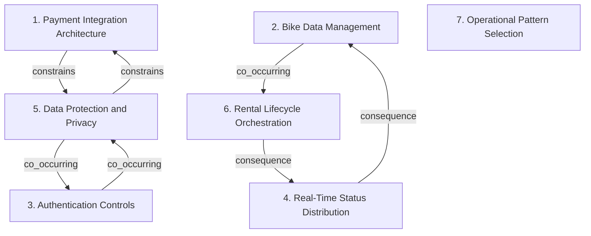

# Grounded Theory Report

## Narrative Summary

This taxonomy organizes software architecture design decisions for CityBike, a bike-sharing platform for urban mobility and eco-friendly transportation. CityBike runs on web and mobile devices, lets riders find and unlock bikes with a QR code, supports payments within a 1000-meter radius, and must comply with the General Data Protection Regulation (GDPR), the Privacy Directive, ISO 27001, and local European Union and China standards while protecting user and payment data.

The dimensions separate decisions by their main architectural concern. Some decisions focus on how external payment providers are integrated through the Payment Integration Architecture dimension. Others address how bike information is stored, managed, and queried in Bike Data Management, and how live bike-status changes are propagated in Real-Time Status Distribution. Authentication Controls covers login, session ending, and temporary credential policies. Data Protection and Privacy captures choices for minimizing, encrypting, retaining, and otherwise protecting sensitive personal, payment, registration, and location data. Rental Lifecycle Orchestration covers coordination of rental states, bike lifecycle events, operational commands, duration tracking, and time-based rider notifications. Operational Pattern Selection captures reusable patterns for operational concerns that do not fit the other dimensions.

Taken together, these dimensions provide a plain-language map of the main kinds of architectural variation involved in building and operating CityBike, before the more detailed relationship diagram and per-dimension catalog.

## Dimension Relationship Diagram

## Dimension Catalog

### 1. Payment Integration Architecture

Variation in integrating external payment providers, including abstraction boundaries, delegation mechanisms, and extensibility across payment methods.

**Values:**

- **Facade-based payment delegation** — A payment facade presents a simplified internal interface while delegating processing to complex external payment services or gateways.
- **Adapter-based provider abstraction** — Adapters place external payment-provider APIs behind a common internal interface, isolating provider-specific representations and operations.
- **Strategy-based payment extensibility** — Separate strategy classes represent alternative payment methods or providers, allowing the system to select among integrations.

**Outgoing relations:**

- **constrains** → Data Protection and Privacy (#5): Security and privacy requirements constrain how payment integrations transmit, process, and store sensitive payment information.

### 2. Bike Data Management

Variation in storing, managing, and querying bike information, including spatial discovery, persistence, and proximity-based access.

**Values:**

- **Location service with proximity queries** — A dedicated location-management capability supports searches for bikes within the rider’s relevant geographic radius.
- **Repository-based bike data persistence** — A repository encapsulates persistence and querying for bike data and usage statistics.

**Outgoing relations:**

- **co_occurring** → Rental Lifecycle Orchestration (#6): Bike data management supplies current information, while status distribution determines how quickly changes reach discovery and monitoring consumers.

### 3. Authentication Controls

Variation in user authentication, session termination, and temporary credential policies, distinct from protecting data during transmission or storage.

**Values:**

- **Biometric thumbprint authentication** — Users authenticate through thumbprint biometrics, with biometric data deleted immediately after successful authentication.
- **Email-password authentication** — Users authenticate with email and password, with authentication data transmitted and stored using security protections.
- **Session logout control** — Users can manually terminate their active session through an immediate logout action.
- **Thirty-second verification-code validity** — A verification code becomes invalid 30 seconds after issuance through a timeout.
- **Thirty-minute verification-code validity** — A verification code remains valid for 30 minutes before expiration.

**Outgoing relations:**

- **co_occurring** → Data Protection and Privacy (#5): Authentication controls and data-protection measures jointly secure user access and sensitive information while representing different control decisions.

### 4. Real-Time Status Distribution

Variation in propagating bike-status changes and selecting live-update consumers, distinct from storing or querying bike information.

**Values:**

- **Observer-based monitoring updates** — An Observer mechanism pushes bike-status changes to dashboards and monitoring subscribers for operational visibility.
- **Observer-based availability updates** — Bike-status changes trigger Observer notifications that refresh the available-bikes list in real time.
- **Observer-based user history notifications** — Observers notify users about bike-status changes and the availability of usage-history information.

**Outgoing relations:**

- **consequence** → Bike Data Management (#2): Status propagation affects the freshness of bike information available to location, availability, and monitoring features.

### 5. Data Protection and Privacy

Variation in minimizing, encrypting, retaining, and otherwise protecting sensitive personal, payment, registration, and location data.

**Values:**

- **Privacy-conscious registration minimization** — Registration collects necessary identity and contact information while making zip code optional and emphasizing privacy-focused minimization.
- **Encryption in transit and at rest** — Registration, payment, location, and other sensitive data are protected through encrypted transport and encrypted storage.

**Outgoing relations:**

- **constrains** → Payment Integration Architecture (#1): Data-protection requirements restrict payment integration choices involving transmission, storage, and handling of sensitive information.
- **co_occurring** → Authentication Controls (#3): Data protection and authentication controls jointly address security but govern different architectural mechanisms.

### 6. Rental Lifecycle Orchestration

Variation in coordinating rental states, bike lifecycle events, operational commands, duration tracking, and time-based rider notifications.

**Values:**

- **Command-based rental operations** — The Command pattern encapsulates and executes rental operations while keeping notification scheduling outside the command mechanism.
- **State-machine rental and QR unlock flow** — A state machine coordinates navigation, QR-based bike unlocking, and progression through the rental lifecycle.
- **Scheduled rental-expiry notifications** — A scheduler tracks rental duration and sends riders notifications before the rental expires.
- **Event-driven bike lifecycle workflow** — A bike-registered event initiates subsequent bike lifecycle processing, such as a removal workflow.

**Outgoing relations:**

- **consequence** → Real-Time Status Distribution (#4): Rental and bike lifecycle transitions produce status changes that may require distribution to riders, dashboards, and monitoring consumers.

### 7. Operational Pattern Selection

Variation in applying reusable architectural patterns to operational concerns not defined by payment, data, security, distribution, or rental orchestration.

**Values:**

- **Strategy-based rental pricing** — A Strategy pattern selects among rental pricing calculations while remaining separate from notification timing.

**Outgoing relations:**

_No outgoing relations._

## Evaluation

_Observe-only LLM-as-judge scoreboard (judge: openai/gpt-5.6-luna). Pass flags are display-only — nothing gates on them._

| Criterion | Score | Pass | Reason |
|---|---|---|---|
| Orthogonality | 0.30 | ✗ | The output captures a few distinct concerns, especially payment integration, bike location/data management, real-time status distribution, privacy, and authentication. However, it omits or fails to represent major Input dimensions such as service decomposition, API gateway/request routing, regulatory compliance mechanisms, service discovery, observability/distributed tracing, and the specified communication infrastructure. Bike Data Management also combines persistence with spatial tracking, while Operational Pattern Selection is an overly generic catch-all rather than a clear architectural axis. Thus, although some dimensions are distinct, the full Input taxonomy is not preserved. |
| Clarity | 0.50 | ✓ | The output has several clear, useful dimensions, including Payment Integration Architecture, Real-Time Status Distribution, Rental Lifecycle Orchestration, and Authentication Controls, with descriptions that generally explain the document types they cover. It also distinguishes data protection from authentication and status distribution from bike-data storage. However, several axes are overly broad or combine different concerns: Bike Data Management mixes persistence, spatial queries, and discovery; Authentication Controls mixes authentication methods, logout, and verification-code lifetimes; and Operational Pattern Selection is especially vague. It also omits or fails to clearly represent key requested architectural dimensions such as service decomposition, API gateway/request routing, service discovery, observability/tracing, and regulatory compliance mechanisms. The values under Real-Time Status Distribution are largely the same Observer pattern differentiated only by consumers, which provides weak architectural variation guidance. |
| Completeness | 0.40 | ✗ | The taxonomy covers several core use-case concerns, including payment-provider integration, bike proximity/location data, QR-based rental lifecycle, real-time status updates, authentication, and data protection. However, it omits major explicitly requested architectural axes: service decomposition, API gateway and request routing, service registry/discovery, message-broker or real-time communication strategy, observability/distributed tracing, and a distinct mechanism for GDPR, the Privacy Directive, ISO 27001, and EU/China compliance. Some dimensions also merge unlike concerns, such as authentication mechanisms with session and verification-code policies, while the broad operational-pattern dimension is underdeveloped. |
| Use case alignment | 0.50 | ✓ | The output identifies several relevant dimensions for CityBike, including payment integration, bike location/proximity data, real-time status updates, rental and QR-unlock orchestration, authentication, and privacy protection. However, it omits major architectural variation axes explicitly needed by the use case, such as service decomposition, API gateway and request routing, service discovery, regulatory compliance mechanisms for GDPR/Privacy Directive/ISO 27001 and EU/China standards, and observability/distributed tracing. Some dimensions are also overly implementation-specific or non-orthogonal: Bike Data Management combines storage and spatial querying, Real-Time Status Distribution largely repeats Observer variants rather than distinguishing communication patterns, and Operational Pattern Selection with rental pricing is weakly related to the stated architectural concerns. |
| No catch-alls | 0.20 | ✗ | The input describes specific architectural concerns and contains no explicitly labeled catch-all such as Other, Miscellaneous, or General. Most output dimensions are reasonably focused, but dimension 7, "Operational Pattern Selection," is explicitly defined as covering concerns not addressed elsewhere, making it a vague residual category. This falsely introduces a catch-all rather than accurately reflecting the input taxonomy. |
| Axis vs. value | 0.40 | ✗ | The output identifies several genuine multi-valued concerns, including payment integration, bike data management, authentication, rental orchestration, and status distribution. However, it omits major dimensions explicitly requested in the input, such as service decomposition, API gateway/routing, service discovery, observability/tracing, container orchestration, and regulatory compliance. Several dimensions also mix distinct axes: Data Protection combines minimization with encryption, Authentication includes logout and verification-code lifetime, and Real-Time Status Distribution offers only Observer-based variants rather than alternative communication patterns. Operational Pattern Selection has only one value, making it a single label rather than a meaningful axis of variation. |
| Dimensional coverage | 0.90 | ✓ | The taxonomy covers nearly all input themes: event-driven bike removal, observer availability/history updates, proximity and location services, payment Strategy/Adapter/Facade patterns, verification-code timeout/TTL/token expiration, rental state management, encryption, biometric and email-password authentication, registration minimization, and manual logout are all placed on relevant dimensions. Two input documents lack valid placement: the Builder pattern for usage-history reports and the 15-minute inactivity-based session timeout. The latter is distinct from the covered manual logout and verification-code timeout, so these omissions warrant a modest penalty. |

**Overall score:** 0.46 (mean of evaluated criteria)