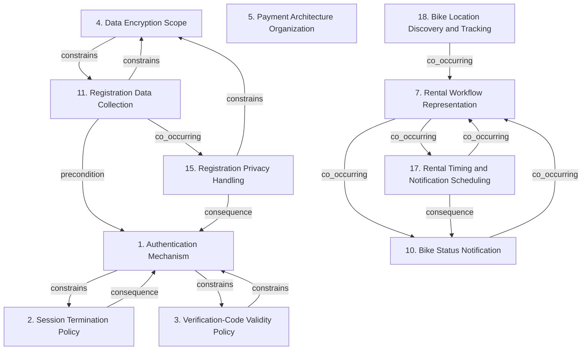

# Grounded Theory Report

## Narrative Summary

This taxonomy classifies software architecture design decisions for CityBike, a bike-sharing platform available on web and mobile devices. It supports locating and unlocking bikes with QR codes, paying for rentals, and finding bikes within a 1000-meter radius, while addressing real-time tracking, third-party payment integration, and compliance with the General Data Protection Regulation (GDPR), the Privacy Directive, ISO 27001, and applicable local European Union and Chinese standards.

The rendered view organizes these decisions into distinct architectural concerns. Authentication Mechanism, Session Termination Policy, and Verification-Code Validity Policy cover rider identity and account-access lifecycles. Data Encryption Scope, Registration Data Collection, and Registration Privacy Handling address the protection and management of rider and payment-related information. Payment Architecture Organization describes the internal structure of payment operations, while Rental Workflow Representation, Rental Timing and Notification Scheduling, and Bike Status Notification describe rental lifecycles, time-based actions, and the propagation of bike and usage information. Bike Location Discovery and Tracking covers real-time positioning and proximity-based bike finding.

The taxonomy explanation reports 43 draft values consolidated across 16 dimensions, with two near-duplicate values merged and the remaining 39 retained as distinct. All 63 open codes were linked to a value, and all 28 documents support at least one value, providing coverage for the architectural decisions represented here.

## Dimension Relationship Diagram

## Dimension Catalog

### 1. Authentication Mechanism

Mechanisms used to establish rider identity, including biometric and password-based authentication methods.

**Values:**

- **Biometric thumbprint authentication** — Uses a thumbprint biometric as the CityBike user login and authentication mechanism.
- **Email-and-password authentication** — Authenticates riders through an email address and password combination.

**Outgoing relations:**

- **constrains** → Session Termination Policy (#2): The authentication mechanism determines which authenticated sessions require termination controls.
- **constrains** → Verification-Code Validity Policy (#3): Code-based authentication requires an explicit validity policy limiting code usability.
- **co_occurring** → #13 _(target excluded from this view)_: Verification-code handling supports account verification within the authentication architecture.

### 2. Session Termination Policy

Rules governing when authenticated rider sessions end through inactivity or explicit logout, distinct from verification-code expiration.

**Values:**

- **15-minute inactivity session termination** — Automatically terminates a user session after 15 minutes without activity.
- **Manual session termination** — Immediately terminates an active user session when the rider logs out.

**Outgoing relations:**

- **consequence** → Authentication Mechanism (#1): Session termination applies after an authentication mechanism establishes an active rider session.

### 3. Verification-Code Validity Policy

Validity windows and enforcement rules governing how long account-verification codes remain usable.

**Values:**

- **30-second verification-code validity** — Limits verification-code usability to a 30-second validity window. _(consolidated with 1 similar value judged the same decision: "30-minute verification-code validity")_
- **Verification-code expiration enforcement** — Prevents verification codes from being used after their validity window.

**Outgoing relations:**

- **constrains** → Authentication Mechanism (#1): Verification-code validity constrains the usable lifetime of code-based account verification.

### 4. Data Encryption Scope

Protection applied to information during transmission and storage, including credentials, registration data, and payment information.

**Values:**

- **In-transit encryption** — Encrypts CityBike data while it travels across networks, including user, credential, and payment information.
- **At-rest encryption** — Encrypts stored CityBike information, including registration data, credentials, and other sensitive records.

**Outgoing relations:**

- **constrains** → #6 _(target excluded from this view)_: Encryption requirements constrain how payment integrations transmit and store payment-related information.
- **constrains** → Registration Data Collection (#11): Encryption protects registration information during communication and storage.

### 5. Payment Architecture Organization

Internal structural patterns used to expose and organize payment operations, distinct from external provider types.

**Values:**

- **Facade-based payment-service delegation** — Presents simplified payment operations through a facade that delegates processing to internal payment services.
- **Strategy-class payment-provider separation** — Separates payment methods into independently replaceable strategy classes.
- **Adapter-based payment-provider integration** — Isolates provider-specific implementations behind CityBike payment abstractions.
- **Common internal payment interface** — Provides a shared interface for consistent interaction with external payment providers.

**Outgoing relations:**

- **constrains** → #6 _(target excluded from this view)_: Internal payment architecture constrains how external providers are represented and accessed.

### 7. Rental Workflow Representation

Architectural representations for rental operations and lifecycle states, distinct from rental timing and notification scheduling.

**Values:**

- **Command-based rental encapsulation** — Encapsulates rental operations as Command objects.
- **State-machine-based rental workflow** — Uses a state machine to coordinate navigation, QR scanning, unlocking, and rental states.
- **State-pattern rental lifecycle management** — Uses a state pattern to represent rental stages such as availability, active rental, and completion.

**Outgoing relations:**

- **co_occurring** → Bike Status Notification (#10): Rental workflow changes generate status information for riders and system components.
- **co_occurring** → #12 _(target excluded from this view)_: Persistent bike and usage data supports rental operations and lifecycle management.
- **co_occurring** → Rental Timing and Notification Scheduling (#17): Rental workflow representations commonly operate with timing and notification mechanisms.

### 10. Bike Status Notification

Mechanisms for propagating bike status, availability, rental, and usage information to riders and system components.

**Values:**

- **Observer-based bike-status notification** — Uses the Observer pattern to propagate bike-status changes to dashboards, riders, and monitoring components.
- **Observer-based rental-state notification** — Uses observers to propagate rental-state changes to user interfaces and other components.
- **Available-bike list updates** — Updates rider-facing available-bike lists in response to bike-status changes.
- **Usage-history availability notification** — Notifies riders when new usage history becomes available.

**Outgoing relations:**

- **co_occurring** → Rental Workflow Representation (#7): Rental state changes generate information updates for user interfaces and operational components.
- **co_occurring** → #14 _(target excluded from this view)_: Operational monitoring interfaces consume propagated bike and usage information.

### 11. Registration Data Collection

Types of personal, credential, and optional location information collected during rider registration.

**Values:**

- **Personal-detail collection** — Collects users' personal details through the registration form.
- **Credential collection** — Collects user credentials during registration for subsequent authentication.
- **Optional location-information collection** — Allows users to provide location information optionally for location-aware services.

**Outgoing relations:**

- **constrains** → Data Encryption Scope (#4): Collected registration data determines which information requires encryption and protection.
- **precondition** → Authentication Mechanism (#1): Registration establishes credentials and identity information used by authentication mechanisms.
- **co_occurring** → Registration Privacy Handling (#15): Collected registration data requires corresponding privacy and lifecycle handling.

### 15. Registration Privacy Handling

Security and lifecycle policies governing registration information, including general safeguards and biometric-data deletion.

**Values:**

- **Registration-data security safeguards** — Applies security safeguards to collected personal details, credentials, and location information.
- **Immediate post-authentication biometric deletion** — Removes biometric data immediately after authentication to support privacy and data minimization.

**Outgoing relations:**

- **constrains** → Data Encryption Scope (#4): Privacy handling determines the protection and retention requirements applied to registration information.
- **consequence** → Authentication Mechanism (#1): Authentication choices can create privacy consequences for biometric and credential data.

### 17. Rental Timing and Notification Scheduling

Scheduling mechanisms for monitoring rental duration and issuing time-based or pre-expiry rider notifications.

**Values:**

- **Rental-duration monitoring scheduler** — Uses a scheduler to monitor the duration of active bike rentals.
- **Pre-expiry rental notification scheduling** — Schedules notifications before rental expiry to provide advance warning.
- **Scheduler-triggered time-based notifications** — Initiates notifications based on rental timing and lifecycle events.

**Outgoing relations:**

- **co_occurring** → Rental Workflow Representation (#7): Rental timing mechanisms operate alongside workflow representations to manage active rental lifecycles.
- **consequence** → Bike Status Notification (#10): Scheduled rental notifications produce rider-facing information updates.

### 18. Bike Location Discovery and Tracking

Mechanisms for tracking real-time bike positions and finding bikes within rider-specified proximity radii.

**Values:**

- **Radius-based bike location filtering** — Filters bikes by proximity so riders can discover bikes within the required radius. _(consolidated with 1 similar value judged the same decision: "Rider proximity query handling")_
- **Real-time bike location tracking service** — Manages real-time bike positions through a location-based service.

**Outgoing relations:**

- **co_occurring** → Rental Workflow Representation (#7): Location discovery supports the navigation and access stages of rental workflows.
- **co_occurring** → #14 _(target excluded from this view)_: Operational interfaces can consume real-time location information for fleet visibility.

## Discarded Dimensions

Dimensions considered during taxonomy generation but excluded from this view during dimension selection, judged not relevant to the stated use case:

- **6. Payment Provider Integration** — Insufficient evidence: supported by 1 source(s) (1 document(s)); at least 2 required.
- **12. Usage Data Access and Reporting** — Usage Data Access and Reporting is outside the stated use case's decision scope. The use case requires real-time bike-location tracking and rental operations, but does not require usage-statistics querying, downloadable usage reports, or reporting architecture. Its persistence and report-assembly alternatives therefore cannot directly change a CityBike architecture decision for this use case.
- **13. Verification-Code Handling** — Insufficient evidence: supported by 1 source(s) (1 document(s)); at least 2 required.
- **14. Operational Monitoring Interface** — Insufficient evidence: supported by 1 source(s) (1 document(s)); at least 2 required.
- **16. Fleet Event Automation** — Insufficient evidence: supported by 1 source(s) (1 document(s)); at least 2 required.

## Evaluation

_Observe-only LLM-as-judge scoreboard (judge: openai/gpt-5.6-luna). Pass flags are display-only — nothing gates on them._

| Criterion | Score | Pass | Reason |
|---|---|---|---|
| Orthogonality | 0.90 | ✓ | The dimensions generally ask distinct architectural questions: bike discovery/tracking (18) covers proximity and location tracking, status propagation (10) covers notifications, rental representation (7) covers workflow modeling, and timing/scheduling (17) covers duration-based triggers. Payment organization (5), encryption scope (4), registration collection (11), registration privacy handling (15), authentication (1), session termination (2), and verification-code validity (3) also address different concerns. The only minor proximity is between the broad registration-data security safeguard value 15.1 and encryption scope 4, but their primary questions remain distinguishable; no clear dimension pair requires merging. |
| Clarity | 0.80 | ✓ | Most dimensions clearly state their axes and most values are distinguishable, such as in 4 (in-transit versus at-rest encryption), 11 (personal, credential, and optional location collection), and 18 (proximity filtering versus real-time tracking). The main ambiguity is in 7: values 7.2 (state-machine-based rental workflow) and 7.3 (state-pattern rental lifecycle management) both describe representing the same rental stages; rename or rewrite them to distinguish workflow coordination from lifecycle state representation, or merge them. In 10, values 10.1 and 10.2 overlap because rental-state changes can be bike-status changes; clarify 10.1 as physical/availability telemetry and 10.2 as rental lifecycle events. In 17, values 17.2 and 17.3 both describe time-triggered rental notifications, so merge them or make one specifically pre-expiry scheduling and the other a different notification trigger. |
| Completeness | 0.40 | ✗ | The taxonomy covers bike tracking (18), payment organization (5), rental workflow and QR-related lifecycle behavior (7), encryption (4), authentication (1), and notification mechanisms (10), with multiple candidates in each. However, major use-case areas have no decision points: service decomposition, API gateway/request routing, service discovery, observability/distributed tracing, and GDPR/Privacy Directive/ISO 27001 or regional compliance mechanisms. Dimension 5 should be split or reorganized into external provider integration versus internal payment organization, using its existing adapter/interface and facade/strategy values; dimension 15 should be renamed or reorganized around the existing privacy-handling values rather than implying full regulatory-compliance coverage. The absent infrastructure and compliance areas remain substantial gaps. |
| Use case alignment | 0.80 | ✓ | Most dimensions concern CityBike’s stated architecture scope, including bike location tracking (18), payment-provider integration (5), encryption (4), authentication and session security (1, 2), privacy and registration data (11, 15), rental workflow (7), status notifications (10), and rental scheduling (17). The main weakness is that dimensions 3 (Verification-Code Validity Policy), 11 (Registration Data Collection), and parts of 2 (Session Termination Policy) emphasize fine-grained product or operational policies rather than architectural mechanisms; revise by merging these policy dimensions into the broader authentication/privacy dimensions, or move their policy values into those dimensions. The output does not need additional dimensions for omitted technologies because this criterion concerns only scope. |
| No catch-alls | 1.00 | ✓ | No catch-all dimensions or values are present. Each dimension is framed around a specific CityBike concern, such as bike location tracking (18), payment organization (5), encryption scope (4), authentication (1), and rental timing (17), and the values describe concrete alternatives or outcomes rather than buckets like 'Other' or 'Miscellaneous'. No revision is needed for the catch-all criterion. |
| Axis vs. value | 0.30 | ✗ | Several entries do not represent one decision with alternative answers. Dimension 18, "Bike Location Discovery and Tracking," combines proximity filtering (18.1) with the separate tracking-service choice (18.2); separate or drop one axis rather than treating them as alternatives. Dimension 11, "Registration Data Collection," lists independently collectable data categories (11.1–11.3), not alternative collection strategies; reorganize these as outcomes or remove the dimension. Dimension 15, "Registration Privacy Handling," mixes general safeguards (15.1) with biometric deletion (15.2), which are distinct privacy-lifecycle decisions; separate or relocate the deletion entry. Dimension 10, "Bike Status Notification," mixes notification mechanisms, subjects, and outcomes: move 10.3 and 10.4 out of the candidate values as outcomes and keep only a single notification decision axis. Dimension 17, "Rental Timing and Notification Scheduling," similarly combines duration monitoring, pre-expiry scheduling, and notification triggering; reorganize these into one decision axis or drop the non-alternative entries. These issues are especially significant given the use case's explicit requirements for real-time bike tracking, rental notifications, and privacy handling. |
| One decision point | 0.40 | ✗ | Several dimensions contain multiple architectural questions rather than alternatives to one question. In id 18, radius filtering (18.1) and real-time tracking (18.2) should be moved to separate existing decision points or the mixed dimension should be dropped. Id 5 mixes facade, strategy, adapter, and common-interface choices; reorganize these into the payment decision points matching their respective intents rather than one broad organization dimension. Id 15 combines general registration-data safeguards with biometric deletion; move each value to the security or data-lifecycle decision point it answers. Id 7 mixes command encapsulation with state-machine/state-pattern lifecycle representation, so separate or merge those values into matching decision points. Id 10 similarly mixes notification mechanisms, event subjects, and rider-facing update outcomes, while id 17 mixes duration monitoring with notification scheduling. Id 3 also combines validity duration with expiration enforcement. These issues are significant despite the use case's clear security, privacy, GDPR, and real-time-tracking concerns; dimensions such as id 1, id 2, and id 4 are comparatively coherent and have at least two candidates. |
| Rejected-alternative handling | 1.00 | ✓ | No violations of the specified status rules are present. Every CityBike taxonomy value is marked accepted, and each description presents the mechanism as adopted; there are no rejected or mixed values described as adopted, no duplicated candidate under different statuses within a dimension, and no outcome values phrased as alternatives. |
| Dimensional coverage | 0.90 | ✓ | 17 of 19 decision-bearing passages can be placed. The taxonomy covers registration collection and security (11, 4, 15), session termination (2), verification-code expiration (3), authentication (1), payment patterns (5), rental workflow and notification patterns (7, 10, 17), and bike discovery (18). Two passages cannot be placed: 4a925776-d050-43c1-9bb1-54800ab7e7b6 discusses using the Builder pattern for usage-history reports; add a report-construction dimension/value for this decision. 59e2c235-89e7-4eaf-80f4-8019e9db1a9d discusses Strategy for rental-pricing calculations; add a rental-pricing strategy dimension/value, rather than relying on the payment-specific value 5.2. |
| Candidate-decision coverage | 0.80 | ✓ | Most adopted options are represented, including 15-minute inactivity and manual logout (2.1–2.2), authentication methods (1.1–1.2), encryption, registration collection, payment facade/adapters, rental state/command patterns, observer notifications, location filtering, and scheduling. Missing or mismatched coverage: replace or add value “30-minute verification-code validity” in dimension 3, supported by 96e3317f-4bd3-4bd6-ac32-3b3c5b67bc0d and 5ccaa4d4-00de-4d5d-b60e-93612ce149f3; the current 3.1 incorrectly says 30 seconds. Add a dimension for usage-history report construction with value “Builder-based usage-history report assembly,” supported by 4a925776-d050-43c1-9bb1-54800ab7e7b6. Add “Strategy-based rental pricing calculation” to the rental-pricing decision dimension, supported by 59e2c235-89e7-4eaf-80f4-8019e9db1a9d; the existing 5.2 is specifically about payment providers and does not name this option. |

**Overall score:** 0.73 (mean of evaluated criteria)