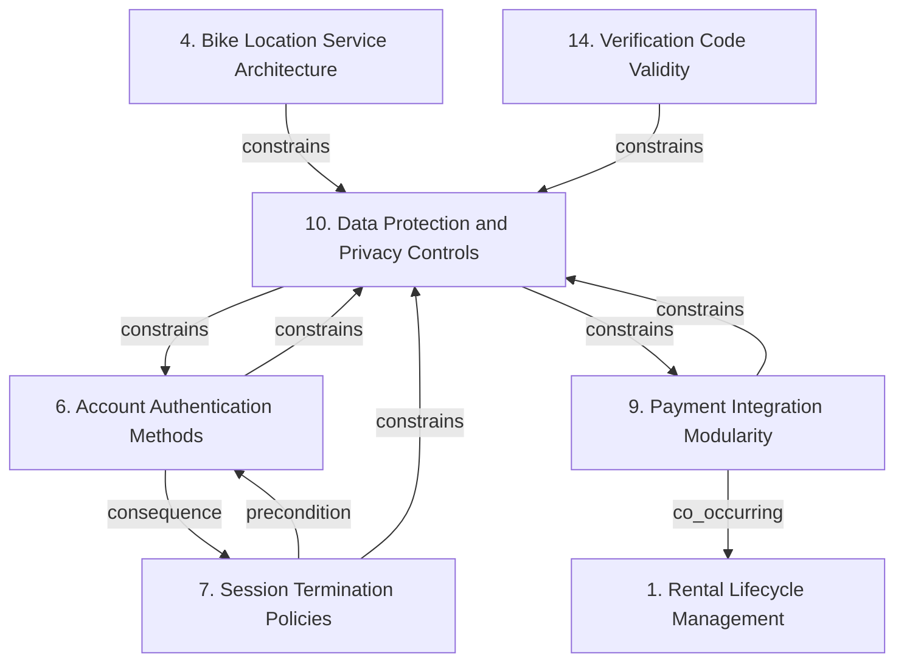

# Grounded Theory Report

## Narrative Summary

This taxonomy classifies architectural design decisions for CityBike, a bike-sharing platform for urban mobility and eco-friendly transportation. The application is available on web and mobile devices, allowing riders to locate, unlock via QR code, and pay for bike rentals within a 1000-meter radius. It must comply with the General Data Protection Regulation (GDPR), the Privacy Directive, ISO 27001, and local European Union and China standards, while integrating with third-party payment platforms, tracking bike locations in real time, and protecting user and payment data.

In this view, the decisions are organized across seven dimensions. Rental Lifecycle Management covers mechanisms for bike-unlocking, active-use, and rental-completion state transitions and event-triggered actions. Bike Location Service Architecture covers real-time positioning and nearby-bike queries, with distance filtering treated as a query constraint rather than a separate service alternative. Account Authentication Methods covers credential, biometric, and verification mechanisms; Session Termination Policies covers explicit sign-out and inactivity-based session ending; and Verification Code Validity covers how long generated verification codes remain usable. Payment Integration Modularity addresses isolation, abstraction, adaptation, and variation in external payment-provider integrations, while Data Protection and Privacy Controls addresses protection and minimization of personal, authentication, biometric, verification, location, and payment information.

The taxonomy explanation reports 43 distinct values consolidated across 15 dimensions, with no values merged. All 64 open codes were assigned to a value with similarity of at least 0.50, and all 28 documents support at least one value. The diagram and catalog provide the detailed structural view; these dimensions provide the plain-language orientation for interpreting it.

## Dimension Relationship Diagram

## Dimension Catalog

### 1. Rental Lifecycle Management

Architectural mechanisms governing rental-state transitions and event-triggered actions throughout bike unlocking, active use, and completion.

**Values:**

- **State-based rental lifecycle management** — State-machine or State-pattern mechanisms govern QR scanning, unlocking, active rental, and completion transitions.
- **Event-driven bike lifecycle automation** — Domain events initiate automated bike-management operations such as removal after bike registration.

**Outgoing relations:**

- **consequence** → #2 _(target excluded from this view)_: Lifecycle milestones create timing conditions for rental notifications.
- **consequence** → #3 _(target excluded from this view)_: Lifecycle changes generate rental-status information for dissemination.

### 4. Bike Location Service Architecture

Architectural approaches for real-time bike positioning and nearby-bike queries; distance filtering is treated as a query constraint, not a service alternative.

**Values:**

- **Dedicated real-time location service** — A dedicated service manages bike positions in real time and processes nearby-bike queries.
- **Proximity-filtered bike location queries** — A query constraint filters bike locations by proximity and returns only bikes within a configured distance.

**Outgoing relations:**

- **consequence** → #3 _(target excluded from this view)_: Location-query results are communicated to rider interfaces.
- **constrains** → Data Protection and Privacy Controls (#10): Location information may require privacy controls.

### 6. Account Authentication Methods

Credential, biometric, and verification mechanisms used to authenticate riders before granting account access.

**Values:**

- **Email-password authentication** — Email and password provide a rider login mechanism.
- **Thumbprint-based biometric authentication** — Thumbprint authentication provides a login mechanism on web and mobile platforms.
- **Verification-code generation and delivery** — Verification codes are generated and delivered to users for account verification and secure access.

**Outgoing relations:**

- **consequence** → Session Termination Policies (#7): Successful authentication establishes the session governed by termination policies.
- **co_occurring** → #8 _(target excluded from this view)_: Authentication and verification-code mechanisms jointly support secure account access.
- **constrains** → Data Protection and Privacy Controls (#10): Authentication choices determine which credentials and biometric information require protection.

### 7. Session Termination Policies

Policies for ending authenticated sessions through explicit user action or inactivity thresholds.

**Values:**

- **Immediate manual logout termination** — Manual logout immediately terminates the authenticated user session.
- **Automatic inactivity session timeout** — Inactive sessions are automatically terminated after a configured inactivity period.
- **Fifteen-minute inactivity threshold** — The documented inactivity threshold for automatic session termination is fifteen minutes.
- **Secure user access control** — Session timeout is treated as a mechanism for maintaining secure access to user accounts.

**Outgoing relations:**

- **precondition** → Account Authentication Methods (#6): Session termination applies after authentication establishes a session.
- **constrains** → Data Protection and Privacy Controls (#10): Session controls reduce exposure of authenticated personal and payment information.

### 9. Payment Integration Modularity

Architectural mechanisms for isolating, abstracting, adapting, and varying integrations with external payment providers.

**Values:**

- **Modular payment behavior variation** — Payment methods use strategy-based, modular components so payment behavior can vary independently from unrelated platform functionality.
- **Adapter-based payment-provider integration** — Adapters encapsulate differences among third-party payment providers.
- **Common CityBike payment interface** — A shared CityBike-facing interface standardizes access to different provider APIs.
- **Payment facade delegation** — A facade abstracts payment processing and delegates internally to external payment providers.

**Outgoing relations:**

- **constrains** → Data Protection and Privacy Controls (#10): Security and privacy requirements restrict payment-provider integration and payment-data handling.
- **co_occurring** → Rental Lifecycle Management (#1): Payment processing participates in rental operations while remaining independently variable.

### 10. Data Protection and Privacy Controls

Protection and minimization mechanisms for personal, authentication, biometric, verification, location, and payment information.

**Values:**

- **In-transit data encryption** — User and payment-related data is encrypted while transmitted between CityBike components and clients.
- **At-rest data encryption** — User and payment-related data is encrypted while stored.
- **Registration-data encryption** — Information collected during user registration is included within the encrypted data scope.
- **Secure login-credential transmission** — Login information is transmitted securely to protect credentials during communication.
- **Secure credential storage** — Stored login credentials receive secure handling as part of authentication design.
- **Post-authentication biometric data deletion** — Biometric data is immediately deleted after successful authentication.
- **Biometric privacy protection** — Protection of biometric information is an explicit security and privacy objective.

**Outgoing relations:**

- **constrains** → Account Authentication Methods (#6): Data-protection requirements constrain authentication credentials and biometric-login implementations.
- **constrains** → #8 _(target excluded from this view)_: Verification-code handling must satisfy transmission, storage, and privacy requirements.
- **constrains** → Payment Integration Modularity (#9): Encryption and privacy controls constrain payment integration and payment-data handling.
- **constrains** → #12 _(target excluded from this view)_: Registration data categories determine required security and minimization controls.

### 14. Verification Code Validity

Validity-period policies governing how long generated verification codes remain usable.

**Values:**

- **Thirty-minute verification-code validity** — Verification codes expire after thirty minutes.
- **Thirty-second verification-code expiration** — Verification-code tokens automatically expire after thirty seconds.

**Outgoing relations:**

- **precondition** → #8 _(target excluded from this view)_: Validity periods apply to generated and delivered verification codes.
- **constrains** → Data Protection and Privacy Controls (#10): Short validity periods reduce exposure of verification credentials.

## Discarded Dimensions

Dimensions considered during taxonomy generation but excluded from this view during dimension selection, judged not relevant to the stated use case:

- **2. Rental Notification Timing** — Rental notification timing is not part of the stated CityBike use case. The requirements describe locating, unlocking, renting, paying, tracking, and protecting data, but do not require duration warnings or other rental notifications.
- **3. Bike Status Dissemination** — Not a decision point: 1 candidate decision(s) (accepted/rejected/mixed values) besides outcomes; at least 2 required.
- **5. Monitoring Data Presentation** — Insufficient evidence: supported by 1 source(s) (1 document(s)); at least 2 required.
- **8. Verification Code Delivery** — Insufficient evidence: supported by 1 source(s) (1 document(s)); at least 2 required.
- **11. Usage History Reporting** — Usage-history reporting and downloadable rider reports are outside the stated use case. No reporting, export, or activity-history download decision is required for the specified CityBike capabilities.
- **12. Registration Data Scope** — Insufficient evidence: supported by 1 source(s) (1 document(s)); at least 2 required.
- **13. Rental Operation Encapsulation** — Insufficient evidence: supported by 1 source(s) (1 document(s)); at least 2 required.
- **15. Rental Pricing Calculation** — Insufficient evidence: supported by 1 source(s) (1 document(s)); at least 2 required.

## Evaluation

_Observe-only LLM-as-judge scoreboard (judge: openai/gpt-5.6-luna). Pass flags are display-only — nothing gates on them._

| Criterion | Score | Pass | Reason |
|---|---|---|---|
| Orthogonality | 1.00 | ✓ | No overlapping dimension questions are evident. The taxonomy distinguishes authentication methods (6), session termination (7), verification-code validity (14), privacy controls (10), bike-location architecture (4), payment-provider integration (9), and rental lifecycle management (1). Although some values concern related security or expiration topics, they answer different questions about authentication, session state, code lifetime, or data protection, so no merge or value move is required under this criterion. |
| Clarity | 0.70 | ✓ | Most dimensions have understandable scopes and several values are concrete and distinguishable, especially 4 (Bike Location Service Architecture), 6 (Account Authentication Methods), and 14 (Verification Code Validity). The main weakness is overlap and mixed specificity in 10 (Data Protection and Privacy Controls): 10.3 overlaps with 10.1/10.2, while 10.4 and 10.5 are narrower restatements of those encryption values; consolidate or drop these redundant values. In 9 (Payment Integration Modularity), 9.1 (Modular payment behavior variation) is vague compared with the concrete adapter, interface, and facade values; rename it to the more specific “Strategy-based payment behavior variation” or drop it. In 7 (Session Termination Policies), 7.4 (Secure user access control) is a generic objective rather than a distinguishable termination policy; drop it, and incorporate 7.3’s fifteen-minute detail into 7.2 if it is intended as that policy’s parameter. |
| Completeness | 0.40 | ✗ | The taxonomy represents several relevant decision areas with multiple candidates, notably Bike Location Service Architecture (4.1–4.2), Payment Integration Modularity (9.1–9.4), authentication, session management, rental lifecycle, and privacy controls. However, major areas explicitly required by the CityBike use case have no decision point: service decomposition, API gateway/request routing, service discovery, real-time communication patterns, observability/distributed tracing, and regulatory-compliance mechanisms for GDPR, the Privacy Directive, ISO 27001, and EU/China standards. Data Protection and Privacy Controls (10) addresses encryption and biometrics but does not provide alternatives for compliance mechanisms. Revise by reorganizing existing dimensions and values where possible, but the output currently contains no existing candidates that can represent these missing architectural concerns. |
| Use case alignment | 1.00 | ✓ | All seven dimensions are within the CityBike use-case scope. Location architecture directly addresses real-time positioning and nearby-bike queries within 1000 meters; payment modularity addresses third-party payment integration; rental lifecycle covers QR unlocking and rental completion; authentication, session termination, verification-code validity, and data-protection controls address the required security, privacy, GDPR, and payment-data concerns. No dimension is unrelated or merely outside the stated subject, lifecycle, or architectural-decision scope. |
| No catch-alls | 1.00 | ✓ | No dimension or value is an explicit catch-all bucket such as “Other,” “Miscellaneous,” or “General considerations.” The broad Data Protection and Privacy Controls dimension is still populated with specific encryption, credential, biometric, and deletion mechanisms, while the remaining dimensions target concrete concerns such as bike location, payment integration, authentication, sessions, and verification-code validity. No catch-all needs removal or reorganization. |
| Axis vs. value | 0.40 | ✗ | Several entries are subtopics or details rather than alternatives to one decision. In dimension 7, value 7.3 (Fifteen-minute inactivity threshold) is a parameter of 7.2, and 7.4 (Secure user access control) is an objective/outcome rather than a candidate decision; remove them or reorganize 7.2 to contain the timeout policy without treating these as peer values. In dimension 4, 4.1 (Dedicated real-time location service) concerns service decomposition while 4.2 (Proximity-filtered bike location queries) concerns query behavior; separate the concerns using existing content or drop the orphaned subtopic. In dimension 10, 10.3, 10.4, and 10.5 are narrower scopes or applications of the broader encryption controls 10.1 and 10.2, and 10.7 is an objective rather than an alternative; fold the narrower values into the relevant encryption decisions and remove or reclassify the objective. Dimension 9 also lists implementation mechanisms (9.2 Adapter-based integration, 9.3 Common interface, and 9.4 Facade delegation) that can be parts of one modular integration approach rather than peer answers, so consolidate them under the broader modularity decision or drop the mechanism-level entries. |
| One decision point | 0.40 | ✗ | Several dimensions have at least two values, but important groups do not represent one decision question. Dimension 10, Data Protection and Privacy Controls, mixes transport/storage encryption, credential handling, and biometric retention; split it into encryption controls (10.1–10.5) and biometric-data handling (10.6–10.7). Dimension 4 mixes a service architecture choice (4.1) with a query constraint (4.2); move 4.2 to an existing query/filter decision point or remove the orphan rather than treating it as an alternative. Dimension 1 combines state-transition management (1.1) with event-triggered automation (1.2), so merge these into an existing lifecycle question only if both remain alternatives, or move the odd value. Dimension 7 contains policy alternatives (7.1–7.2), a parameter of 7.2 (7.3), and a security objective rather than a decision (7.4); fold 7.3 into 7.2 and reclassify or remove 7.4. Account Authentication Methods (6) and Verification Code Validity (14) are comparatively well-formed, and the security/privacy focus of the CityBike use case gives dimension 10 a relevant quality-attribute basis despite its mixed axes. |
| Rejected-alternative handling | 0.80 | ✓ | Most values use valid accepted statuses and their descriptions generally describe adopted architectural mechanisms. However, 7.4 Secure user access control and 10.7 Biometric privacy protection are stated as security objectives or effects rather than decision alternatives, so they should be marked outcome (and their descriptions adjusted accordingly). Dimension 14 also contains mutually exclusive validity periods, 14.1 Thirty-minute verification-code validity and 14.2 Thirty-second verification-code expiration, both marked accepted; reconcile the source stance by marking the alternatives mixed where sources disagree or retain only the adopted alternative. |
| Dimensional coverage | 0.70 | ✓ | The taxonomy places 13 of 20 decision-bearing passages, including session timeout under 7.2/7.3, verification-code expiration under 14.1, payment facade/adapters under 9.2/9.4, rental state management under 1.1, encryption under 10.1-10.5, authentication under 6.1/6.2, proximity filtering under 4.2, and manual logout under 7.1. The unplaced decisions are: observer-based notifications in 24988034-c134-4555-91f9-bed8a73213b3, e3c709de-5720-4642-9653-4e6c21482f8f, 43e7bf2c-a70b-471d-b062-05fafd8dab56, and aa5dcc66-2d23-490c-a8cb-18ccf3f1c16e; command-based rental operation encapsulation in c96a97f0-4929-4692-aea5-90f94f2ec39a; builder-based usage-history report construction in 0a992f37-f4fa-4a08-8d80-53aa63a9b7c9; and strategy-based rental pricing in 362c0919-ddee-4fe6-a8d8-252fb24de6d8. Add an observer/status-notification dimension or value, add a command value to dimension 1 (Rental Lifecycle Management) for rental-operation encapsulation, add a report-construction dimension/value for the Builder decision, and add a separate rental-pricing strategy dimension/value rather than treating it as payment integration. |
| Candidate-decision coverage | 0.60 | ✓ | The taxonomy names the options for session timeout (7.2/7.3), 30-minute verification validity (14.1), payment facade and adapters (9.2–9.4), state-based rental management (1.1), encryption (10.1–10.3), authentication (6.1–6.2), and proximity filtering (4.2). Missing options should be added as follows: add a registration-data capture dimension/value for name, email, phone, password, and optional ZIP code from eac6bf29-0925-4c47-add2-9afe3076dfd2; add an observer-based notification dimension covering bike-status, rental-state, usage-history, and available-bike updates from 24988034-c134-4555-91f9-bed8a73213b3, e3c709de-5720-4642-9653-4e6c21482f8f, 43e7bf2c-a70b-471d-b062-05fafd8dab56, and aa5dcc66-2d23-490c-a8cb-18ccf3f1c16e; add a command-pattern rental-operations value from c96a97f0-4929-4692-aea5-90f94f2ec39a; add a builder-pattern usage-history-report value from 0a992f37-f4fa-4a08-8d80-53aa63a9b7c9; and add a strategy-based rental-pricing value from 362c0919-ddee-4fe6-a8d8-252fb24de6d8. |

**Overall score:** 0.70 (mean of evaluated criteria)