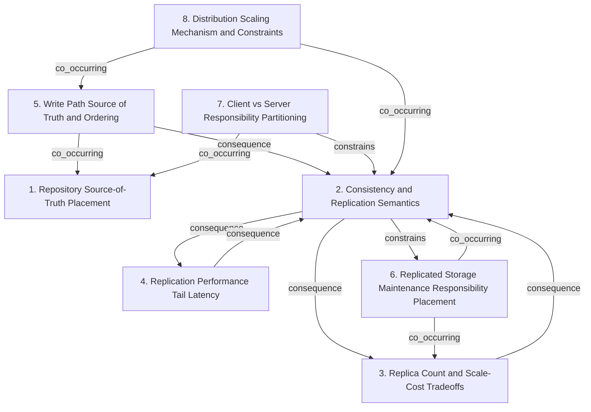

# Grounded Theory Report

## Narrative Summary

This taxonomy was built to help collaborators understand how Git repository hosting systems were scaled and redesigned over time—tracking architectural decisions, tradeoffs, and lessons learned as deployments moved from early ideas to today’s large-scale services.

To keep those designs comparable, the taxonomy organizes variation along orthogonal dimensions. The first is **Repository Source-of-Truth Placement**, which asks where authoritative Git data lives (for example, whether it is centralized or split between different stores such as blobs and metadata). A second dimension is **Consistency and Replication Semantics**, focused on correctness across replicas and how timely correctness is ensured, independently of how many replicas the system runs.

Systems then differ in the economics and risk they accept via **Replica Count and Scale-Cost Tradeoffs**—how many replicas are maintained under cost constraints, separate from the correctness mechanism itself. Related but distinct is **Replication Performance Tail Latency**, which captures when the design explicitly trades performance tail behavior against the strength or timeliness of consistency. Closely tied to this is **Write Path Source of Truth and Ordering**, distinguishing whether client-visible correctness depends on pre-consensus application (consensus-first) or whether updates are logged and then derived into visible state (WAL-first).

Because large distributed systems require ongoing work, the taxonomy also includes **Replicated Storage Maintenance Responsibility Placement**, which asks whether background maintenance/compaction runs only on a primary or is distributed across replicas—trading extra replica CPU/bandwidth against operational simplicity. Complementing that, **Client vs Server Responsibility Partitioning** captures how responsibilities for caching, transfer, and consistency handling are divided between clients and the server, regardless of how replication or storage are organized.

Finally, **Distribution Scaling Mechanism and Constraints** frames what makes distribution difficult in practice: whether the primary constraint is replication/consistency itself or whether broader system constraints dominate. Together, these dimensions let the report categorize architectural choices (from GitHub’s early filesystem-distribution experiments and Google’s distributed-object-store attempt, through GitHub’s consensus-replicated Spokes and Microsoft’s client-side virtualization with GVFS/Scalar, to Cursor’s write-ahead-log-based Continuity/Origin) without conflating storage placement, correctness mechanisms, performance tradeoffs, and operational responsibilities.

## Dimension Relationship Diagram

## Dimension Catalog

### 1. Repository Source-of-Truth Placement

Where authoritative Git data is stored or centralized (filesystem, KV store, blob/metadata split). Distinct from replica mechanics and maintenance placement.

**Values:**

- **Centralized filesystem-backed object storage** — Single authoritative filesystem/object store rather than distributing the underlying filesystem.
- **Distributed KV store for Git objects (rejected)** — Keep repository objects in a distributed key-value store, rejected as a design alternative.
- **Split blob store and relational metadata (rejected)** — Store blobs separately from metadata in different systems, rejected as an alternative architecture.

**Outgoing relations:**

_No outgoing relations._

### 2. Consistency and Replication Semantics

How the system ensures correctness across replicas (strong timely consistency vs log-derived derived truth), independent of replica-count economics.

**Values:**

- **Strong, timely consistency required** — Repository hosting must not tolerate eventual consistency; clients demand strong, timely consistency.
- **Consensus-based strong replication (Spokes)** — Spokes uses strong consensus replication to meet consistency requirements.
- **Log-first operations with derived truth** — Use write-ahead logs to record operations first, then derive authoritative repository state after.

**Outgoing relations:**

- **consequence** → Replica Count and Scale-Cost Tradeoffs (#3): When using strong replication/consensus, limiting replicas can reduce availability/correctness margins.
- **consequence** → Replication Performance Tail Latency (#4): Tradeoffs connect stronger correctness to higher tail-at-scale write latency.
- **constrains** → Replicated Storage Maintenance Responsibility Placement (#6): Log-first truth derivation changes the replication/consensus requirement for client-visible correctness compared to consensus-first designs.

### 3. Replica Count and Scale-Cost Tradeoffs

How many replicas are maintained (minimum vs more) under cost constraints, trading correctness/availability against resource usage.

**Values:**

- **Safe minimum replicas to reduce cost** — Maintain a safe minimum replica count due to high cost from millions of tiny repos; trades correctness/availability.

**Outgoing relations:**

- **consequence** → Consistency and Replication Semantics (#2): When using strong replication/consensus, limiting replicas can reduce availability/correctness margins.

### 4. Replication Performance Tail Latency

Which performance dimension is explicitly traded against correctness/consistency, e.g., tail write latency; orthogonal to replica count.

**Values:**

- **Accept tail-at-scale write latency for consistency** — Trade consistency guarantees for higher tail write latency as the dominant operational cost.

**Outgoing relations:**

- **consequence** → Consistency and Replication Semantics (#2): The documented tradeoff is specifically between stronger consistency guarantees and higher tail-at-scale write latency.

### 5. Write Path Source of Truth and Ordering

Whether client-visible correctness relies on pre-consensus application or on logging then deriving state; distinguishes consensus-first from WAL-first systems.

**Values:**

- **Consensus-first: agree before acting** — Changes are applied based on agreeing via consensus/replication before they take effect as authoritative state.
- **Log-first: write-ahead logging records before truth** — Operations are first recorded in a write-ahead log, and authoritative repository truth is derived after.

**Outgoing relations:**

- **consequence** → Consistency and Replication Semantics (#2): WAL-first designs correspond to non-consensus-first semantics (log recorded before acting), weakening immediate consensus-driven state application.
- **co_occurring** → Repository Source-of-Truth Placement (#1): WAL-first designs often pair with object/log backends for the durable operation record, though not strictly required.

### 6. Replicated Storage Maintenance Responsibility Placement

Where background maintenance/compaction work runs in a replicated system (primary-only vs distributed), trading replica CPU/bandwidth usage.

**Values:**

- **Primary-only compaction** — Compaction/maintenance performed only on the primary, reducing replica CPU while shifting load to the primary.

**Outgoing relations:**

- **co_occurring** → Replica Count and Scale-Cost Tradeoffs (#3): Compaction-placement strategies matter when multiple replicas synchronize derived/compacted results.
- **co_occurring** → Consistency and Replication Semantics (#2): Both consensus and WAL-derived architectures may need maintenance placement, but this is a separate operational axis.

### 7. Client vs Server Responsibility Partitioning

How responsibilities for caching/transfer/consistency handling are divided between clients and the server, independent of storage or replication semantics.

**Values:**

- **Client-side virtualization (GVFS/Scalar)** — Scale by shifting caching/transfer/consistency handling to clients while keeping the Git server simpler.

**Outgoing relations:**

- **constrains** → Consistency and Replication Semantics (#2): Shifting consistency handling to clients reduces server-side complexity and correctness work location, without fully determining consensus vs WAL semantics.
- **co_occurring** → Repository Source-of-Truth Placement (#1): Client virtualization often accompanies server simplification, but source-of-truth placement can vary independently.

### 8. Distribution Scaling Mechanism and Constraints

What mechanism frames server-scale distribution difficulty (replication/consistency constraints vs broader constraints), independent of the exact consistency model.

**Values:**

- **Replication/consistency constrained distribution at server scale** — Server-scale repository distribution is difficult because replication and consistency requirements constrain how distribution works.

**Outgoing relations:**

- **co_occurring** → Consistency and Replication Semantics (#2): Server-scale distribution constraints are tied to replication/consistency decisions (e.g., Spokes/WAL transitions).
- **co_occurring** → Write Path Source of Truth and Ordering (#5): The scaling story aligns with whether the system is consensus-first or log-first.
