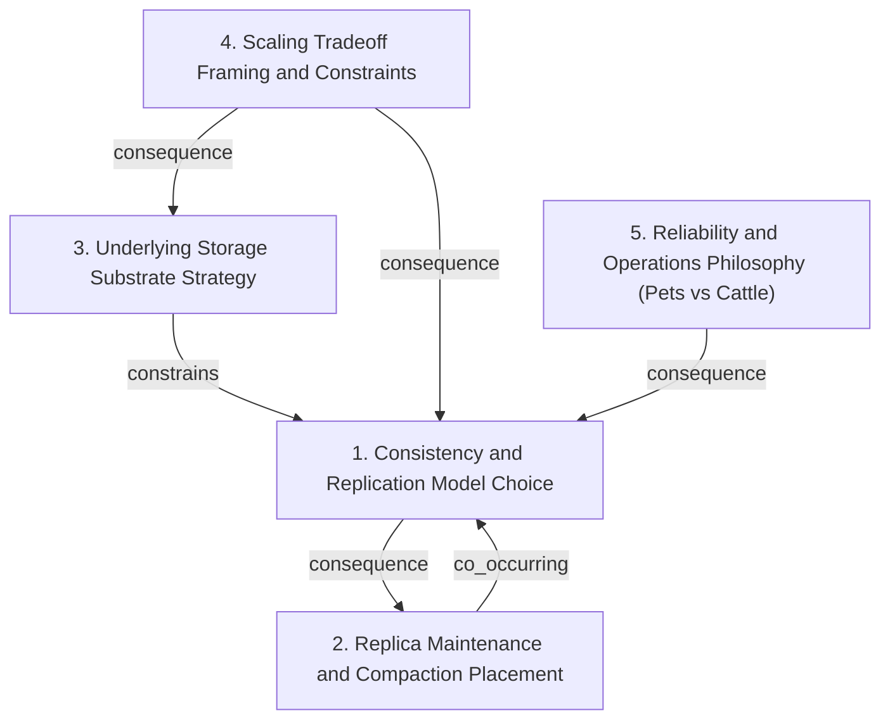

# Grounded Theory Report

## Narrative Summary

This taxonomy is meant to help readers understand how Git repository hosting has been scaled over time, and to compare architectural decisions in a way that’s useful even if you didn’t run the pipeline.

Across the systems considered—from GitHub’s early filesystem-distribution experiments and Google’s distributed-object-store attempt, through GitHub’s consensus-replicated Spokes system and Microsoft’s client-side virtualization (GVFS/Scalar), to Cursor’s write-ahead-log-based Continuity/Origin—the architectural choices repeatedly vary along four orthogonal dimensions.

First, **Consistency and Replication Model Choice** captures where “correctness” is established for repository state updates: whether the system relies on strong or consensus-style agreement among replicas, or instead treats a write-ahead log (WAL) as the mechanism that derives eventual correctness. This separates the question of immediate agreement from the log-derived path to durable correctness.

Second, **Replica Maintenance and Compaction Placement** focuses on operational cost and where expensive upkeep work happens. Different designs place compaction and related maintenance responsibilities on different sets of replicas, shifting load toward a primary/leader replica versus distributing the work to other replicas.

Third, **Underlying Storage Substrate Strategy** distinguishes what lower-level substrate actually stores repository data or state. Some approaches redesign hosting around distributed storage, others experiment with object-store-like substrates, others move toward client-side virtualization of repository content, and still others center their design on a WAL-backed substrate.

Fourth, **Scaling Tradeoff Framing and Constraints** records how each architecture frames its dominant balancing act—performance versus correctness versus operational work—and whether it leans into multiple evaluated alternatives or more directly commits to a single path.

Finally, the taxonomy includes an operational perspective in **Reliability and Operations Philosophy (Pets vs Cattle)**: whether replicated nodes (especially stateful, consensus-style replicas) are managed as pets—treated as special, stateful machines—or whether the architecture fits a more cattle-like posture where replicas are more generic compute.

Together, these dimensions provide a consistent lens for cataloging and comparing the design moves each system made as scale increased, without forcing every system into the same replication, storage, or maintenance model.

## Dimension Relationship Diagram

## Dimension Catalog

### 1. Consistency and Replication Model Choice

How repository state updates propagate across replicas (strong/consensus vs WAL-derived eventual truth). Separates immediate agreement from log-derived correctness.

**Values:**

- **Strongly consistent replica visibility** — Clients never observe eventual visibility; correctness is ensured via strong consistency across replicas.
- **Consensus-replicated repository hosting** — Replica set uses consensus so repositories behave like replicated state across nodes.
- **WAL-driven eventual truth derivation** — Cross-replica correctness is derived later from ordered write-ahead logs rather than synchronous agreement.
- **Relaxed replica consensus for scalability** — Uses weak/relaxed replica consensus, trading strict strong-consensus guarantees for scalability and tail latency control.

**Outgoing relations:**

- **consequence** → Replica Maintenance and Compaction Placement (#2): Consistency/replication choices often shape where maintenance and expensive upkeep can be centralized.

### 2. Replica Maintenance and Compaction Placement

Who runs expensive upkeep (e.g., compaction) and resulting load trade-offs (primary/leader vs other replicas).

**Values:**

- **Primary-only compaction** — Run compaction only on the primary, reducing replica CPU while increasing bandwidth usage on replicas to receive effects.

**Outgoing relations:**

- **co_occurring** → Consistency and Replication Model Choice (#1): Maintenance placement often aligns with replication/consistency designs aimed at scalable correctness.

### 3. Underlying Storage Substrate Strategy

What lower-level substrate stores Git objects or repo state (e.g., hosting redesigns, distributed object stores, S3-backed WAL, client-side virtualization).

**Values:**

- **Replace filesystem distribution with Spokes** — Move from filesystem-based distribution experiments to a dedicated repository hosting system (Spokes) for replicated repositories.
- **Distributed object-store for hosting scaling experiments** — Attempt an intermediate design using a distributed object store for Git object or related hosting scaling.
- **S3-backed write-ahead logs for repository state** — Use S3 write-ahead logs as the substrate/coordination mechanism for deriving consistent repository state.
- **Rejected blob-storage plus relational-database alternative** — Explicitly rejects using blob storage combined with a relational database as the core hosting/substrate approach.
- **Client-side Git virtualization as effective storage shift** — Shift repository state access burden to clients via virtualization/caching rather than server-side replicated storage.

**Outgoing relations:**

- **constrains** → Consistency and Replication Model Choice (#1): Substrate/hosting choices constrain feasible consistency/replication mechanisms and how state can be synchronized across replicas.

### 4. Scaling Tradeoff Framing and Constraints

Dominant constraint and balancing acts (performance vs correctness vs operations) and whether multiple alternatives were evaluated.

**Values:**

- **Object distribution and access-pattern limits scalability** — Scalability constrained by Git object distribution and access under real workloads and replica/caching effects.
- **Central correctness costs increase with distribution** — Correctness/consistency maintenance becomes expensive with replicas/caches, requiring deliberate trade-offs.
- **Performance–correctness–operations balancing** — Architecture explicitly balances performance, correctness, and operational complexity.
- **Multiple alternatives evaluated for scaling** — Emphasizes comparing scaling alternatives rather than selecting a single unexamined approach.
- **Tail-at-scale write latency as primary driver** — Write pipeline and consistency choices primarily driven by tail-at-scale write latency management.
- **Replica-count safety and cost tradeoff at massive scale** — Maintain safe minimum replica count while controlling costs from millions of tiny repositories.
- **Automation and coordination as core framing** — AI-driven automation and explicit client/server coordination presented as central to scalability.
- **Reduce server replication/consistency burden for scaling** — Scaling aims to reduce server burden (e.g., client virtualization) rather than strengthening replication/consistency per update.

**Outgoing relations:**

- **consequence** → Underlying Storage Substrate Strategy (#3): Constraint framing about object distribution/access and synchronization drives which substrate/hosting approaches are viable.
- **consequence** → Consistency and Replication Model Choice (#1): Performance/correctness/latency drivers determine whether systems choose strong consensus, relaxed consensus, or WAL-derived truth.

### 5. Reliability and Operations Philosophy (Pets vs Cattle)

Operational management stance for replicated nodes: stateful consensus replicas treated as pets vs generic cattle-like compute.

**Values:**

- **Consensus replicas treated as stateful pets** — Consensus-replicated hosting is treated as stateful and carefully managed rather than generic auto-scalable cattle.

**Outgoing relations:**

- **consequence** → Consistency and Replication Model Choice (#1): Pets-style operations aligns with carefully managed strong/consensus replication systems.
