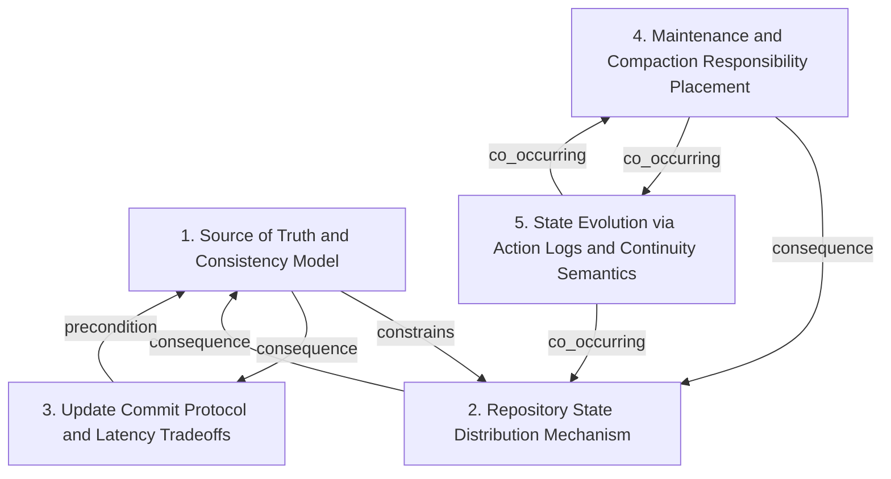

# Grounded Theory Report

## Narrative Summary

This taxonomy is meant to help collaborators understand how Git repository hosting architectures have been scaled and rebalanced over time—shifting responsibilities and tradeoffs across systems that attempt to distribute repository data, keep it correct under concurrency, and keep long-lived state from becoming too expensive to store or maintain.

Across the designs, the first major axis is **Source of Truth and Consistency Model**—specifically how correctness is guaranteed when repository state is distributed. At one end are systems that use **consensus-replicated full repos** to provide stronger correctness guarantees across replicas. At the other are approaches with **client-managed consistency**, where the design assumes clients shoulder more responsibility for ensuring they operate against the right state, trading strong correctness for different consistency goals.

A second axis is **Repository State Distribution Mechanism**, i.e., where repository data lives and how it is distributed. Some architectures rely on server-side distribution where replicas hold full repository state using consensus. Others push distribution to the client side via **client-side virtualization**, reducing what must be kept and managed centrally. The model also recognizes designs where state is derived from logged data—captured here as **log-derived S3 state**.

Once you decide how state is distributed, you also confront the **Update Commit Protocol and Latency Tradeoffs**. This dimension focuses on how updates are committed reliably in the face of distribution and failure, including when protocols require multi-phase commit behavior versus when designs prioritize tail latency (the worst-case delay) by adjusting what must be proven before acknowledging an update.

Over long-running operation, systems must manage the ongoing cost of state growth. That leads to **Maintenance and Compaction Responsibility Placement**, which captures where maintenance work is performed—either across the replica set (replica-wide) or primarily at the primary (primary-only). This placement choice reflects a concrete tradeoff among CPU and bandwidth costs while still supporting sustained state evolution.

Finally, the taxonomy highlights how time-varying repository state is advanced through **State Evolution via Action Logs and Continuity Semantics**. Here, the key pattern is **WAL-based (write-ahead log–based) continuity**, where the system derives current state by replaying or interpreting a sequence of logged actions. The dimension distinguishes accepted continuity patterns from explicitly rejected storage approaches, emphasizing that the “how” of evolving state matters as much as where the state is stored.

Taken together, these five dimensions provide an organizing lens for architectural decisions and tradeoffs—separating where correctness comes from, how repository state is distributed, how updates are committed under latency and failure constraints, where maintenance is paid, and how continuity is implemented through logs to support evolving repository state over time.

## Dimension Relationship Diagram

## Dimension Catalog

### 1. Source of Truth and Consistency Model

How correctness is guaranteed across distributed state: consensus-replicated full repos versus client-managed consistency, under strong-vs-eventual requirements.

**Values:**

- **Strong consistency via replication and consensus** — Correctness/consistency is defined by consensus across replicated full Git repositories.
- **Strong consistency required; eventual consistency rejected** — Architectures must avoid eventual consistency because it breaks Git client correctness/usability.

**Outgoing relations:**

- **constrains** → Repository State Distribution Mechanism (#2): Consistency model constrains feasible replication/virtualization mechanisms and correctness properties.
- **consequence** → Update Commit Protocol and Latency Tradeoffs (#3): Consistency assumptions determine commit/update protocol complexity and latency trade-offs.

### 2. Repository State Distribution Mechanism

Where repository data lives and how it is distributed: consensus-replicated server-side full repos versus client-side virtualization; also includes log-derived S3 state.

**Values:**

- **Consensus-replicated real Git repositories** — Replica copies contain real repository objects/refs, maintained through consensus for correctness.
- **Client-side virtualization (GVFS/Scalar)** — Scale Git by creating client-local views via virtualization rather than server-mediated replication of full repos.
- **S3-backed WAL state for continuous evolution** — Repository state is managed via S3-backed write-ahead logs; derived state advances after actions rather than pre-coordinated state replication.

**Outgoing relations:**

- **consequence** → Source of Truth and Consistency Model (#1): Distribution choice drives which consistency/correctness mechanisms are practical.

### 3. Update Commit Protocol and Latency Tradeoffs

How repository updates are committed reliably under distribution: multi-phase commit and explicit choices between tail latency and correctness.

**Values:**

- **Multi-phase commits for reliable updates** — Uses multi-phase commit to ensure repository updates are applied reliably under distributed replication.
- **Accept worse tail latency for consensus correctness** — Strong consensus is preserved even though write tail latency worsens at scale.

**Outgoing relations:**

- **precondition** → Source of Truth and Consistency Model (#1): Commit protocol requirements depend on the selected consistency model.

### 4. Maintenance and Compaction Responsibility Placement

Where maintenance/compaction load is executed: replica-wide vs primary-only; how placement trades CPU and bandwidth while supporting sustained state evolution.

**Values:**

- **Maintenance/compaction shifted by client/server partitioning** — Architecture introduces consistency and maintenance/compaction tradeoffs due to how responsibilities are partitioned.
- **Primary-only compaction for reduced replica CPU** — Compaction runs only on the primary, shifting compute from replicas to primary and increasing replica bandwidth use as a tradeoff.

**Outgoing relations:**

- **consequence** → Repository State Distribution Mechanism (#2): Client/server partitioning and WAL-based evolution change what maintenance work remains centralized or shifts to primaries.
- **co_occurring** → State Evolution via Action Logs and Continuity Semantics (#5): WAL continuity designs commonly come with operational rules for compaction/maintenance to keep log-derived state efficient.

### 5. State Evolution via Action Logs and Continuity Semantics

How time-varying repository state is advanced: WAL-based continuity deriving state after logged actions, including accepted continuity patterns and explicitly rejected storage approaches.

**Values:**

- **Write-ahead-log-based continuity (Cursor Continuity/Origin)** — Uses WAL semantics to manage repository state evolution for continuous access over time, deriving state after logged actions.
- **Rejected: distribute Git filesystem directly** — Explicitly rejects distributing Git’s underlying filesystem as the core scaling approach.
- **Rejected: distribute Git objects via distributed KV** — Explicitly rejects storing Git objects in a distributed key-value store as the primary scaling architecture.
- **Rejected: hybrid blob/object + relational metadata** — Explicitly rejects splitting Git storage into blob/object storage for Git objects plus relational DB for metadata.

**Outgoing relations:**

- **co_occurring** → Maintenance and Compaction Responsibility Placement (#4): WAL-based continuity typically couples with ongoing maintenance/compaction considerations.
- **co_occurring** → Repository State Distribution Mechanism (#2): Continuity mechanisms are discussed alongside distribution/replication changes.

## Evaluation

_Observe-only LLM-as-judge scoreboard (judge: openai/gpt-5.4-nano). Pass flags are display-only — nothing gates on them._

| Criterion | Score | Pass | Reason |
|---|---|---|---|
| Orthogonality | 0.30 | ✗ | The response defines distinct taxonomy dimensions (e.g., “Repository State Distribution Mechanism” vs “Source of Truth and Consistency Model” vs “Update Commit Protocol and Latency Tradeoffs”), which partially matches the input’s request for orthogonal architectural axes. However, it introduces potential same-axis redundancy/confounding: both dimension 1 values (“Strong consistency via replication and consensus” and “Strong consistency required; eventual consistency rejected”) and dimension 3 values (“Accept worse tail latency for consensus correctness” tied to the same supporting doc) overlap heavily on the consistency/correctness axis, rather than cleanly separating a distinct dimension. Also, dimension 5 mixes the requested “source of truth / state evolution” axis with multiple “Rejected:” options (rejected approaches), which are not clearly a separate orthogonal dimension of variation like the input asks, but instead label evidence against alternatives. While there are no clear cases of duplicate dimension names, the overlapping treatment of strong consistency across dimensions 1 and 3 and the conflation of variation vs explicit rejections reduce alignment with the evaluation steps about avoiding same-axis duplicates/merges. |
| Clarity | 0.80 | ✓ | The Actual Output aligns well with the Input’s requirement to identify orthogonal architectural dimensions (e.g., repository state distribution, consistency/source-of-truth, commit/update protocol, maintenance placement, and state evolution via logs). Dimension names largely match in meaning and scope: Input’s “where the source of truth lives” maps to “Repository State Distribution Mechanism,” “how consistency is achieved across replicas” maps to “Source of Truth and Consistency Model,” and “how compaction/maintenance work is distributed” maps to “Maintenance and Compaction Responsibility Placement.” The descriptions are mostly classifier-consistent and give workable boundaries (server consensus replication vs client virtualization; strong consistency enforced vs eventual consistency rejected; multi-phase commit/latency tradeoff). However, the Input also calls for additional axes like “design assumptions about client vs server responsibility,” and the Actual Output does not clearly provide a dedicated dimension for that beyond indirect hints, and some descriptions (e.g., dimension 4) are somewhat generic/overlapping with dimension 2/5’s co-occurrence rationale, risking minor ambiguity between neighboring dimensions. |
| Completeness | 0.90 | ✓ | The input asks to identify orthogonal architectural dimensions across the listed scaling systems (early filesystem-distribution, Google distributed-object-store attempt, GitHub Spokes consensus replication, Microsoft GVFS/Scalar client virtualization, Cursor WAL-based Continuity/Origin) including where the source of truth lives, how consistency is achieved, how replica count/cost-correctness tradeoffs relate, how compaction/maintenance is distributed, and what is assumed about client vs server. The actual output creates multiple taxonomy axes that largely match these implied dimensions: repository state distribution mechanism (consensus server-side repos vs client virtualization vs S3-backed WAL state), source of truth/consistency model (strong consensus vs rejecting eventual consistency), update commit protocol/latency tradeoffs (multi-phase commit and tail-latency vs correctness), and maintenance/compaction responsibility placement (primary-only vs shifted responsibilities). It also includes an evolution axis explicitly grounded in Cursor WAL continuity semantics. One notable shortcoming is that the input explicitly mentions replica count relating to cost and correctness, but the actual output discusses correctness/latency and compaction placement more than replica-count/cost tradeoffs as an explicit independent axis. Overall, the taxonomy covers most major implied variation with only a relatively small gap. |
| Use case alignment | 0.80 | ✓ | The response strongly matches the required orthogonal architectural dimensions from the input: it includes repository/source-of-truth distribution (server consensus-replicated repos vs client virtualization vs S3-backed WAL state), a consistency/correctness dimension (strong consistency via consensus with eventual rejected), maintenance/compaction responsibility placement (primary-only compaction and client/server partitioning effects), and WAL/action-log-based state evolution for Cursor Continuity/Origin with explicitly rejected alternative storage approaches. These cover key examples mentioned in the test case (GitHub filesystem experiments, Google distributed-object-store attempt, Spokes consensus replication, GVFS/Scalar virtualization, Cursor WAL continuity). However, it falls short on some input-requested specifics: the input asks for replica count relationships to cost/correctness and assumptions about client vs server responsibility as separate orthogonal dimensions, but the output only partially addresses client/server responsibility through maintenance/compaction wording and does not explicitly model replica-count/cost correctness tradeoffs as its own dimension. It also introduces an extra dimension-like separation via an “Update Commit Protocol and Latency Tradeoffs” category, but this is plausibly coherent; overall cohesion is good. |
| No catch-alls | 0.90 | ✓ | The response strongly aligns with the evaluation intent: it assigns each decision to specific architectural dimensions (e.g., 'Repository State Distribution Mechanism', 'Source of Truth and Consistency Model', 'Update Commit Protocol and Latency Tradeoffs', 'Maintenance and Compaction Responsibility Placement', 'State Evolution via Action Logs and Continuity Semantics') and describes membership clearly via dedicated values (including explicit 'Rejected' options) rather than using any vague catch-all. However, the evaluation steps hinge on checking whether the input taxonomy includes an 'Other/Miscellaneous' dimension; the provided input parameters do not actually show such a taxonomy, so step-1/step-2 cannot be directly validated. Aside from that missing taxonomy visibility, the output does not contain any 'Other/Miscellaneous' labeling and provides specific, non-ambiguous dimension assignments. |
| Axis vs. value | 0.80 | ✓ | The response largely matches the evaluation intent by defining multiple orthogonal dimensions as true axes with multiple value variants. For key Input dimensions like “source of truth/distribution,” “consistency model,” “client vs server responsibility,” and “compaction/maintenance placement,” the Actual Output provides separate dimension objects (e.g., Repository State Distribution Mechanism with varied values like consensus-replicated repos vs GVFS/Scalar vs S3-backed WAL; Source of Truth and Consistency Model with strong consistency variants; Maintenance and Compaction Responsibility Placement with replica-wide shift vs primary-only). It also addresses the “continuity/write-ahead log” aspect via a dedicated State Evolution via Action Logs and Continuity Semantics dimension with both accepted (WAL-based continuity) and explicitly rejected approaches. Minor gaps: the Input asks to identify dimensions such as “replica count relates to cost and correctness,” but no clear axis directly captures replica-count/cost tradeoffs; additionally, the Output introduces an extra dimension (commit protocol/latency tradeoffs) that is plausible but not explicitly listed among the Input’s examples, reducing direct alignment with the specified set of orthogonal factors. |
| Dimensional coverage | 0.70 | ✓ | The actual output provides taxonomy dimensions (1-5) that broadly cover the input themes: distribution mechanism (e.g., consensus-replicated repos, client virtualization, S3-backed WAL state), consistency model (strong consistency, rejecting eventual consistency), commit/latency tradeoffs (multi-phase commits, tail latency tradeoff), and specific maintenance/compaction tradeoffs (primary-only compaction). It also explicitly assigns several rejected alternatives (distributed KV for objects, directly distributing the filesystem, blob/object + relational metadata) under the state evolution/log continuity dimension. However, some input themes are only indirectly addressed or not clearly mapped: items like “AI coding agents as the forcing function behind a new architecture,” “Evolution timeline/two decades,” and “Alternative solutions, compared: five answers to one question” are not obviously placed along any dimension, and the dimensions’ assignments are to specific document IDs that do not clearly correspond to each named input paragraph. This weakens step 2/3 verification that every input document is unambiguously placed and that all unassigned theme areas are penalized. |

**Overall score:** 0.74 (mean of evaluated criteria)