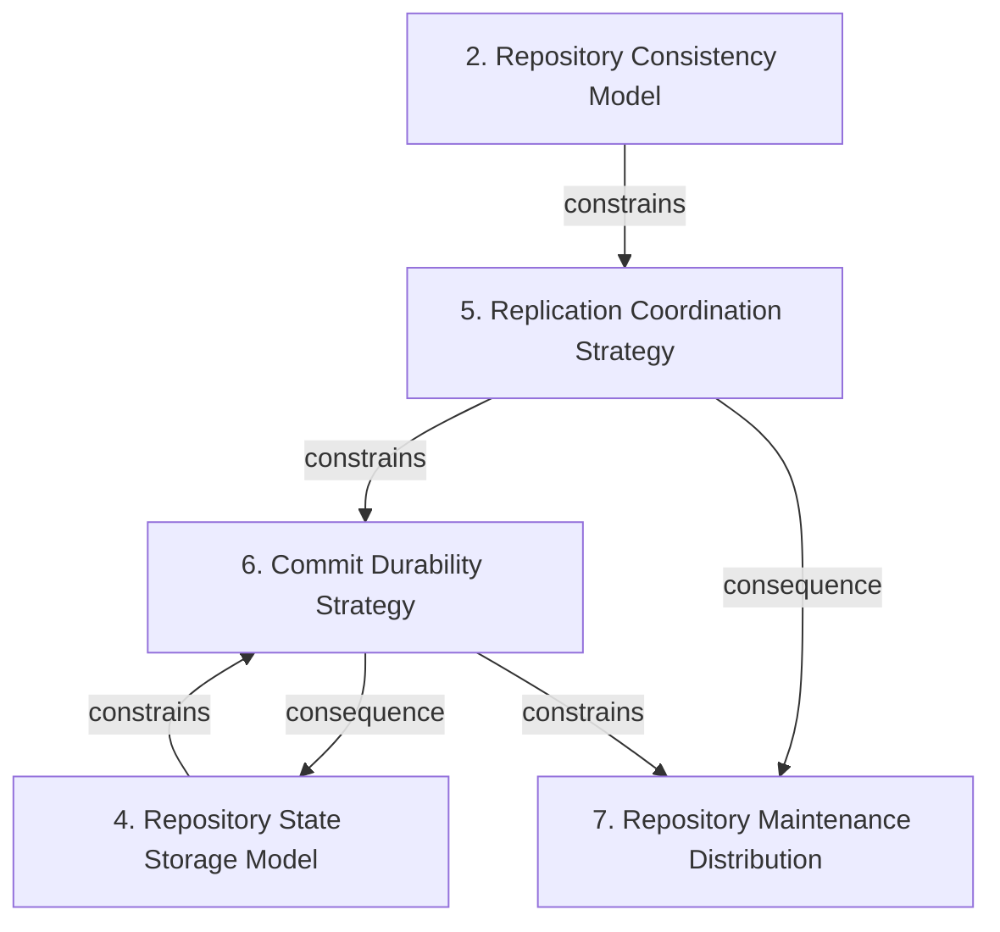

# Grounded Theory Report

## Narrative Summary

This taxonomy describes how repository hosting has been scaled over time, from GitHub’s early filesystem-distribution experiments and Google’s distributed-object-store attempt through GitHub’s consensus-replicated Spokes system, Microsoft’s client-side virtualization through Git Virtual File System (GVFS) and Scalar, and Cursor’s write-ahead-log-based Continuity/Origin system. It provides a common vocabulary for comparing their architectural decisions, tradeoffs, alternatives, and lessons learned.

The comparison is organized around five dimensions. Repository Consistency Model captures what repository views clients are expected to observe, including whether state may be stale, divergent, or still converging. Repository State Storage Model describes where repository truth resides—directly in Git state, in a distributed store, or as a representation derived from another durable source. Replication Coordination Strategy describes how replicas coordinate changes, including the role and operational consequences of consensus. Commit Durability Strategy distinguishes actions coordinated before execution from actions made durable through a write-ahead record. Repository Maintenance Distribution describes where compaction and other maintenance run, and how their computation and data-transfer burdens are allocated.

The taxonomy consolidation retained all 33 draft values as distinct. Evidence links all 41 open codes to a value, and all 13 documents support at least one value, providing coverage for the structural detail shown in the diagram and catalog.

## Dimension Relationship Diagram

## Dimension Catalog

### 2. Repository Consistency Model

Axis describing required repository-view consistency and whether Git clients may observe stale, divergent, or converging state.

**Values:**

- **Strongly consistent repository views** — Requires repository reads to present a strongly consistent view to Git clients.
- **Eventual-consistency repository views** — Considers but declines repository views that converge over time rather than providing immediate consistency.
- **Git client failures under eventual consistency** — Reports client failures caused by serving eventually consistent repository views.
- **Storage consistency tradeoffs** — Reports consistency consequences exposed by distributing the filesystem beneath Git.

**Outgoing relations:**

- **constrains** → #3 _(target excluded from this view)_: Strong consistency requirements restrict which replica counts and arrangements can safely serve Git clients.
- **constrains** → Replication Coordination Strategy (#5): The required consistency level restricts acceptable replication-coordination mechanisms.

### 4. Repository State Storage Model

Axis describing where repository truth resides and whether Git state is stored directly, distributed, or derived from another durable representation.

**Values:**

- **Filesystem-based repository storage** — Keeps repository storage in a filesystem-based representation.
- **Distributed filesystem beneath Git** — Considers but declines placing a distributed filesystem beneath Git as the repository-hosting substrate.
- **Distributed key-value store for Git objects** — Considers but declines storing Git objects in a distributed key-value store as the repository representation.
- **Blob storage combined with relational database** — Considers but declines combining blob storage for repository content with relational storage for metadata.
- **Real Git repository storage** — Preserves the real Git repository as the hosted data model rather than replacing it with an abstraction.
- **Derived repository truth** — Derives repository truth from recorded state instead of maintaining only a directly authoritative mutable replica.

**Outgoing relations:**

- **constrains** → Commit Durability Strategy (#6): The storage model constrains which durability and commit-ordering strategies can serve as the repository source of truth.

### 5. Replication Coordination Strategy

Axis describing how repository replicas coordinate state changes, including consensus mechanisms and their operational consequences.

**Values:**

- **Consensus-replicated Spokes hosting** — Uses Spokes-style consensus replication to provide scalable, consistent hosting of real Git repositories.
- **Strong consensus replication** — Uses strong consensus replication to maintain correctness and consistency across repository replicas.
- **Consensus-based replication** — A generic consensus-replication proposal considered but not retained, distinct from the adopted strong-consensus implementation.
- **Higher tail-at-scale write latency** — Reports increased tail write latency as a consequence of strong consensus replication.
- **Stateful repository replicas** — Reports stateful repository instances as a consequence of consensus replication.
- **Pet-like repository infrastructure** — Reports costly, stateful, non-interchangeable repository infrastructure under consensus replication.
- **Complicated horizontal scaling** — Reports difficulty adding capacity horizontally for stateful consensus-replicated repositories.
- **Complicated replica replacement** — Reports difficulty replacing stateful consensus-replicated repository instances.
- **Complicated repository maintenance** — Reports increased maintenance difficulty caused by stateful consensus-replicated repositories.
- **High operational cost of consensus replication** — Reports resource and operational burden resulting from consensus-replicated repositories.

**Outgoing relations:**

- **constrains** → Commit Durability Strategy (#6): Replication coordination determines when changes may be committed and which durability mechanism is required.
- **consequence** → Repository Maintenance Distribution (#7): Coordination choices affect the operational burden of maintaining, replacing, and scaling repository replicas.

### 6. Commit Durability Strategy

Axis describing whether repository actions are coordinated before execution or made durable through a write-ahead record.

**Values:**

- **Consensus-before-action architecture** — Establishes consensus before repository actions proceed.
- **Write-ahead logging** — Records repository changes before applying them to the repository representation.
- **S3-backed write-ahead log** — Stores the write-ahead log in S3 as the durable persistence layer for repository change history.

**Outgoing relations:**

- **consequence** → Repository State Storage Model (#4): Commit-durability choices determine how repository truth can be reconstructed or derived from durable state.
- **constrains** → Repository Maintenance Distribution (#7): Durability and commit ordering determine where subsequent repository maintenance work can safely occur.

### 7. Repository Maintenance Distribution

Axis describing where compaction and repository maintenance execute and how resulting computation and data-transfer burdens are allocated.

**Values:**

- **Primary-only compaction** — Performs compaction only on the primary replica rather than independently across replicas.
- **Distributed maintenance** — Distributes repository maintenance work across participating components.
- **Reduced replica CPU usage** — Reports lower replica computation as an outcome of primary-only compaction.
- **Increased compacted-data distribution bandwidth** — Reports higher bandwidth requirements when compacted repository data is distributed from the primary.

**Outgoing relations:**

- **consequence** → #3 _(target excluded from this view)_: Maintenance placement changes the compute and bandwidth burden associated with operating repository replicas.

## Discarded Dimensions

Dimensions considered during taxonomy generation but excluded from this view during dimension selection, judged not relevant to the stated use case:

- **1. Architectural Scaling Locus** — Insufficient evidence: supported by 1 source(s) (1 document(s)); at least 2 required.
- **3. Replica Footprint Strategy** — Insufficient evidence: supported by 1 source(s) (1 document(s)); at least 2 required.

## Evaluation

_Observe-only LLM-as-judge scoreboard (judge: openai/gpt-5.6-luna). Pass flags are display-only — nothing gates on them._

| Criterion | Score | Pass | Reason |
|---|---|---|---|
| Orthogonality | 0.70 | ✓ | Most dimensions ask distinct questions: id 4 covers repository truth and representation, id 2 covers client-visible consistency, and id 7 covers maintenance placement. The main overlap is between id 5, "Replication Coordination Strategy," and id 6, "Commit Durability Strategy": value 6.1, "Consensus-before-action architecture," is effectively another answer about replica coordination already represented by 5.1 and 5.2. Revise id 6 to focus solely on durable change recording (for example, WAL versus another persistence mechanism), and move or remove 6.1. There is also a weaker overlap between id 4.6, "Derived repository truth," and id 6.2/6.3 because WAL-backed state can describe where truth is derived, so clarify id 4 as the repository representation and id 6 as the change-durability mechanism. |
| Clarity | 0.70 | ✓ | Most dimensions clearly state an architectural question and their values are generally distinguishable, especially 2 (Repository Consistency Model) and 7 (Repository Maintenance Distribution). However, dimension 4 has overlapping values 4.1 (Filesystem-based repository storage) and 4.5 (Real Git repository storage); rename or redefine them so one describes the physical substrate and the other the authoritative data model. In dimension 5, 5.1 (Consensus-replicated Spokes hosting) and 5.2 (Strong consensus replication) are difficult to distinguish because Spokes is presented as a specific form of strong consensus; make one explicitly implementation-specific and the other mechanism-level, or merge them. Dimension 6's 6.3 (S3-backed write-ahead log) is a storage-location variant of 6.2 rather than a clearly separate durability strategy; clarify that the axis includes log placement or move it under a separate persistence-medium question. Value 2.4 (Storage consistency tradeoffs) is vague and does not identify a concrete outcome; rename it to the specific consistency effect it represents. |
| Completeness | 0.60 | ✓ | The taxonomy covers several major areas with multiple candidates: Repository State Storage Model (4), Repository Consistency Model (2), Replication Coordination Strategy (5), Commit Durability Strategy (6), and Repository Maintenance Distribution (7). However, it lacks a decision point for how replica count trades off against cost, availability, and correctness; add a dimension such as “Replica Cardinality and Cost Strategy” with alternatives like single-primary, fixed quorum, and elastic replicas. It also omits the explicit client-versus-server responsibility boundary highlighted by GVFS/Scalar; add a dimension such as “Repository Workload Placement” with client-side virtualization, server-side hosting, and split-responsibility alternatives. |
| Use case alignment | 1.00 | ✓ | All five dimensions are within scope of the use case's architectural evolution of Git hosting at scale. Repository State Storage Model covers filesystem, distributed, and derived truth; Replication Coordination Strategy covers Spokes, consensus, replica costs, and scaling consequences; Commit Durability Strategy covers consensus-before-action and Cursor's S3-backed write-ahead log; Repository Consistency Model addresses strong versus eventual consistency and client failures; and Repository Maintenance Distribution covers primary-only versus distributed compaction and their resource tradeoffs. No dimension is unrelated to the stated subject, lifecycle, or architectural decision kind. |
| No catch-alls | 1.00 | ✓ | No dimension or value is a catch-all bucket. The dimensions use specific architectural axes, such as id 4 "Repository State Storage Model," id 5 "Replication Coordination Strategy," and id 7 "Repository Maintenance Distribution," while values describe concrete alternatives or outcomes. Broad-sounding labels such as "Distributed maintenance" and "Storage consistency tradeoffs" remain tied to specific architectural decisions rather than serving as miscellaneous categories. No change is needed for the catch-all criterion. |
| Axis vs. value | 0.60 | ✓ | Several dimensions are valid decision axes, including repository state storage (4), consistency model (2), and maintenance distribution (7), and outcomes are correctly represented with status 'outcome'. However, dimension 6 mixes distinct decisions: 'Consensus-before-action architecture' (6.1) belongs under replication coordination (5), while 'Write-ahead logging' (6.2) is a durability mechanism. Split dimension 6 into separate coordination and durability questions, or move 6.1 to dimension 5. 'S3-backed write-ahead log' (6.3) is a sub-choice about WAL persistence location rather than a peer to WAL itself; move it to a new storage-location dimension or make it subordinate to 6.2. Likewise, 'Consensus-replicated Spokes hosting' (5.1) is a concrete implementation of 'Strong consensus replication' (5.2); consolidate these at one level or move Spokes to a separate implementation dimension. |
| One decision point | 0.60 | ✓ | Most dimensions have at least two candidate decisions and are reasonably coherent: dimension 2 contrasts strong versus eventual consistency, and dimension 7 contrasts primary-only versus distributed maintenance. However, dimension 6, "Commit Durability Strategy," mixes different questions: 6.1 is a coordination timing choice, while 6.2 is a durability mechanism and 6.3 is the storage location for that mechanism. Split it into separate dimensions such as "When is an action authorized?" and "How is committed state durably recorded?", moving 6.3 under the latter. Dimension 4, "Repository State Storage Model," also combines representation choices (4.1, 4.2, 4.3, 4.4, 4.5) with the derived-versus-authoritative truth distinction in 4.6; split or rename it to make that single decision question explicit. Dimension 5 is mostly coherent, but 5.1, 5.2, and 5.3 are overlapping levels of specificity; consolidate them or distinguish the implementation choice from the general replication protocol. |
| Rejected-alternative handling | 0.80 | ✓ | The taxonomy consistently uses valid statuses, and rejected values such as 4.2 Distributed filesystem beneath Git and 2.2 Eventual-consistency repository views are explicitly described as declined, while outcomes such as 5.4 Higher tail-at-scale write latency and 7.3 Reduced replica CPU usage are correctly framed as effects rather than choices. The main issue is dimension 5, Replication Coordination Strategy: 5.3 Consensus-based replication is rejected even though 5.1 Consensus-replicated Spokes hosting and 5.2 Strong consensus replication are accepted variants of the same candidate decision, creating a duplicated decision under conflicting statuses. Replace 5.3 with a genuinely distinct rejected coordination strategy, or merge/refine these consensus values so the generic option is not simultaneously accepted and rejected. |
| Dimensional coverage | 0.90 | ✓ | Most decision-bearing passages map directly to the taxonomy: rejected distributed filesystem, key-value store, and blob/relational alternatives map to 4.2-4.4; Spokes, consensus, WAL/S3, consistency, and compaction map to dimensions 2, 4, 5, 6, and 7. The main uncovered passage is 3ed2b99e-3e0d-439e-a007-5daf3553b842, which decides to scale Git by virtualizing the client rather than the server; neither 4 (Repository State Storage Model) nor 5 (Replication Coordination Strategy) represents this deployment-placement choice. Add a dimension such as "Where is Git scaling performed?" with client-side virtualization and server-side scaling values. Passage e9ae107a-0590-493a-9c31-5ce3975de499 discusses choosing a safe minimum replica count versus the cost of millions of tiny repositories; 5 does not include replication factor as a decision. Add an accepted replica-count value to 5 or split out a replication-factor dimension, with the cost represented as an outcome. |
| Candidate-decision coverage | 0.80 | ✓ | The taxonomy names most explicit storage, consistency, consensus, WAL/S3, compaction, and tradeoff options, including the rejected distributed filesystem, distributed key-value store, and blob-plus-relational database alternatives. It misses the scaling-locus decision in [3ed2b99e3-3e0d-439e-a007-5daf3553b842] (and likely the comparable alternatives in [f9c56011-b463-4479-be42-4796e06015ad]): add dimension 3, such as 'Where is Git scaled or virtualized?', with values for client virtualization and server-side virtualization. It also misses the adopted safe minimum replica-count option in [e9ae107a-0590-493a-9c31-5ce3975de499]; add a 'Replica Count Strategy' dimension with the safe minimum replication factor value. The existing relations reference dimension 3, but that dimension and its decision values are absent. |

**Overall score:** 0.77 (mean of evaluated criteria)