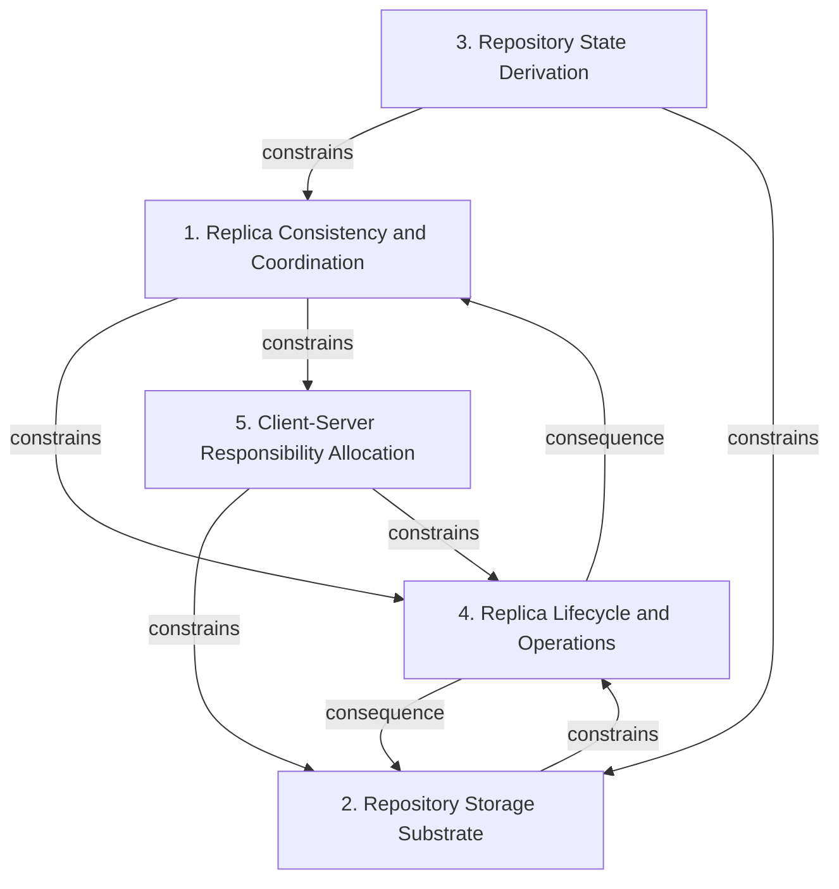

# Grounded Theory Report

## Narrative Summary

This taxonomy classifies architectural decisions, tradeoffs, alternative solutions, and lessons learned in scaling Git repository hosting over time. It provides a common lens for comparing GitHub’s early filesystem-distribution experiments, Google’s distributed-object-store attempt, GitHub’s consensus-replicated Spokes system, Microsoft’s client-side virtualization through GVFS (Git Virtual File System) and Scalar, and Cursor’s write-ahead-log-based Continuity/Origin system.

The decisions are organized along five orthogonal dimensions. Replica Consistency and Coordination covers the consistency guarantees visible to clients and the mechanisms used to establish agreement among replicas. Repository Storage Substrate covers the physical or logical medium holding Git objects, repository data, or durable source-of-truth records. Repository State Derivation distinguishes designs in which repository truth is established before an action, recorded durably first, or reconstructed afterward. Replica Lifecycle and Operations covers replica statefulness and individuality, population, replacement, scaling, placement, and recurring maintenance work. Client-Server Responsibility Allocation captures whether scaling and virtualization remain in hosting infrastructure or shift toward Git clients.

Together, these dimensions orient the relationship diagram and the per-dimension catalog: each decision is placed where its fundamental architectural intent best fits, while the full set preserves the different ways these systems distribute responsibility, establish repository truth, coordinate replicas, and perform ongoing operations. The taxonomy links all 46 open codes to a value and includes support from all 14 documents.

## Dimension Relationship Diagram

## Dimension Catalog

### 1. Replica Consistency and Coordination

This dimension distinguishes client-visible consistency guarantees and the coordination mechanisms used to establish agreement across repository replicas.

**Values:**

- **Strong consistency for Git clients** — Repository operations expose coordinated, current state to Git clients.
- **Eventual-consistency repository design** — Repository state may lag across locations, making it unsuitable for reliable Git client operations.
- **Consistency-and-correctness priority** — The architecture explicitly prioritizes preserving consistency and correctness across replicas.
- **Consensus-before-action architecture** — An operation proceeds only after consensus establishes the required state transition.
- **Consensus-based replica consistency** — Consensus serves as the mechanism for coordinating consistency across repository replicas. _(consolidated with 2 similar values judged the same decision: "Consensus-replicated repository architecture", "Strong consensus replication")_
- **Consensus replication** — Consensus replication was explicitly replaced by another durability and scaling approach.
- **Stale repository state** — Client-visible repository data can be outdated when consistency is eventual.
- **Unreliable repository operations** — Eventual consistency can cause repository operations to behave unreliably for clients.
- **Higher tail write latency** — Strong coordination produces increased tail write latency at scale.
- **Repository consistency improvement** — Consensus-replicated repositories are intended to improve repository consistency.
- **Hosting reliability improvement** — The architecture is intended to improve the reliability of repository hosting.

**Outgoing relations:**

- **constrains** → Replica Lifecycle and Operations (#4): Consistency and coordination determine when repository operations become authoritative and whether state is derived before or after action.
- **constrains** → Client-Server Responsibility Allocation (#5): Coordination mechanisms constrain replica statefulness, population requirements, and operational behavior.
- **co_occurring** → #6 _(target excluded from this view)_: Consistency requirements and client-server responsibility jointly shape how reliable repository access is provided.

### 2. Repository Storage Substrate

This dimension distinguishes the physical or logical storage substrate used to hold Git objects, repository data, or durable source-of-truth records.

**Values:**

- **Filesystem-based repository storage** — Repositories or Git objects are distributed and stored through filesystem-based infrastructure.
- **Distributed object-store repository hosting** — A distributed object store serves as the foundation for repository hosting.
- **Blob storage with relational database** — A hybrid architecture combining blob storage with a relational database was evaluated and rejected.
- **Distributed filesystem beneath Git** — Distributing the filesystem layer beneath Git was proposed as a repository-scaling approach but rejected.
- **Distributed key-value Git-object storage** — Storing Git objects in a distributed key-value store was evaluated and rejected as the repository source of truth.

**Outgoing relations:**

- **constrains** → Replica Lifecycle and Operations (#4): The storage substrate determines which repository state-derivation and durable-recording strategies are practical.
- **constrains** → #6 _(target excluded from this view)_: Storage placement affects how much repository-management responsibility remains server-side versus shifting to clients.

### 3. Repository State Derivation

This dimension distinguishes whether repository truth is established before action, recorded durably first, or reconstructed after operations are recorded.

**Values:**

- **Log-first operation recording** — Operations are durably recorded before repository state is derived from them.
- **Post hoc truth derivation** — Repository truth is reconstructed or computed after operations have been recorded.
- **S3-backed write-ahead log** — An S3-backed durable write-ahead log records repository operations as the foundation for repository state.

**Outgoing relations:**

- **constrains** → Replica Consistency and Coordination (#1): The point at which state becomes authoritative determines when coordination must establish a valid transition.
- **constrains** → Repository Storage Substrate (#2): State derivation requires a suitable substrate for retaining operations or materialized repository state.

### 4. Replica Lifecycle and Operations

This dimension distinguishes replica statefulness, individuality, population, replacement, scaling, and placement of recurring repository maintenance work.

**Values:**

- **Stateful repository replicas** — Replicas retain substantial repository state rather than acting as stateless interchangeable workers.
- **Pet-style infrastructure** — Replicas are individually managed, costly, and non-fungible infrastructure units.
- **Safe minimum replica count** — The architecture maintains a minimum replica population needed for repository durability and correctness.
- **Primary-only compaction** — Compaction is performed only by the primary replica, defining where maintenance work occurs.
- **Replica non-interchangeability** — Stateful repository replicas cannot be treated as equivalent replacement units.
- **Scaling complexity** — Stateful, individually managed replicas make repository scaling more difficult.
- **Replica replacement complexity** — Replacing replicas is more difficult when they retain unique repository state.
- **Maintenance burden** — Individually managed stateful replicas increase ongoing maintenance work.
- **Higher repository operating cost** — Consensus-replicated, stateful repositories impose higher operating costs than interchangeable replicas.
- **Replication cost for tiny repositories** — Replicating very large numbers of small repositories creates substantial operational expense.
- **Reduced replica CPU usage** — Primary-only compaction reduces compaction processing performed by replicas.
- **Increased synchronization bandwidth requirements** — Primary-only compaction increases bandwidth required to synchronize replicas.
- **Operational scalability improvement** — The architecture is intended to improve the scalability of repository operations.
- **Replica scaling tradeoff** — Replica count and replication strategy affect architectural behavior and operating costs.

**Outgoing relations:**

- **consequence** → Replica Consistency and Coordination (#1): Coordination choices produce corresponding requirements for replica state, population, maintenance, and operational management.
- **consequence** → Repository Storage Substrate (#2): Storage and replication architecture determine replica lifecycle and maintenance requirements.

### 5. Client-Server Responsibility Allocation

This dimension distinguishes whether repository scaling and virtualization responsibilities remain in hosting infrastructure or shift to Git clients.

**Values:**

- **Client-side Git virtualization** — GVFS and Scalar virtualize repository access at the client rather than redesigning server-side storage.
- **Server-side repository-storage redesign** — Redesigning server-side repository storage was considered as an alternative to client virtualization but not pursued.
- **Reduced local checkout cost** — Client-side virtualization lowers the cost of local repository checkouts.
- **Client-server responsibility allocation** — Architectures differ in whether repository-management and virtualization responsibilities reside in hosting infrastructure or clients.

**Outgoing relations:**

- **constrains** → Repository Storage Substrate (#2): Client-side responsibility reduces the need to redesign server-side repository storage.
- **constrains** → Replica Lifecycle and Operations (#4): Client-side virtualization changes server replica and infrastructure requirements for repository access.

## Evaluation

_Observe-only LLM-as-judge scoreboard (judge: openai/gpt-5.6-luna). Pass flags are display-only — nothing gates on them._

| Criterion | Score | Pass | Reason |
|---|---|---|---|
| Orthogonality | 0.70 | ✓ | Most dimensions ask different questions: consistency/coordination (1), storage substrate (2), replica lifecycle and maintenance (4), and client-versus-server responsibility (5) are generally separable. The main overlap is between dimension 3, "Repository State Derivation," and dimension 2, "Repository Storage Substrate": value 3.3, "S3-backed write-ahead log," is a storage-substrate answer and should be moved to dimension 2 or reframed as a purely temporal derivation choice. Dimension 3 also partially overlaps dimension 1 because "Log-first operation recording" and "Consensus-before-action architecture" both classify when operations become authoritative relative to action; rename or restructure dimension 3 to focus strictly on derivation timing and move mechanism-specific values out of it. |
| Clarity | 0.40 | ✗ | Several dimensions are understandable, but important axes and values are overloaded or indistinguishable. Dimension 1, "Replica Consistency and Coordination," asks both about client-visible guarantees and coordination mechanisms; values 1.1, 1.3, 1.4, and 1.5 substantially overlap. Split it into separate guarantee and coordination questions, moving each existing value to the applicable dimension. Dimension 4, "Replica Lifecycle and Operations," combines statefulness, replica identity, replica count, replacement, scaling, and compaction; split or reorganize it into narrower questions using its existing values. Dimension 3, "Repository State Derivation," also mixes temporal derivation semantics with the specific S3 implementation: 3.1 and 3.2 are not clearly distinct, while 3.3 does not describe the same level of alternative. Rename or split the dimension so the derivation alternatives are separated from the S3-backed implementation. Dimension 5.4 repeats the dimension name and is too broad to distinguish a specific outcome; rename it to state the concrete responsibility-allocation effect. |
| Completeness | 1.00 | ✓ | All major decision areas in the use case have decision points with multiple candidate decisions: dimension 2 (Repository Storage Substrate) covers source-of-truth alternatives such as filesystem and distributed object-store hosting; dimension 1 (Replica Consistency and Coordination) covers strong, eventual, and consensus-based approaches; dimension 4 (Replica Lifecycle and Operations) covers replica count, statefulness, and primary-only compaction; dimension 5 (Client-Server Responsibility Allocation) contrasts client-side virtualization with server-side redesign; and dimension 3 (Repository State Derivation) covers log-first and post hoc derivation approaches. No major area lacks a multi-candidate decision point, so no reorganization is required under this criterion. |
| Use case alignment | 1.00 | ✓ | All five dimensions are within the use-case scope: 1 covers replica consistency and consensus, 2 covers filesystem, object-store, and other repository source-of-truth substrates, 3 covers Continuity/Origin's write-ahead-log and state derivation, 4 covers replica count, statefulness, cost, replacement, and compaction maintenance, and 5 covers GVFS/Scalar's client-versus-server responsibility split. No dimension is out of scope or merely tangential, so no reorganization is needed for this criterion. |
| No catch-alls | 0.70 | ✓ | Most dimensions are specific architectural axes, and there are no explicit labels such as 'Other' or 'Miscellaneous'. However, dimension 4, 'Replica Lifecycle and Operations', is a catch-all: its description bundles statefulness, individuality, population, replacement, scaling, placement of maintenance, and several unrelated outcomes. Reorganize dimension 4 by separating the existing replica-model values (4.1–4.3) from maintenance-placement values such as 4.4, using more focused dimension names rather than the broad 'Lifecycle and Operations' bucket. |
| Axis vs. value | 0.40 | ✗ | The taxonomy captures several relevant axes, especially storage substrate for GitHub's filesystem experiments and Google's object-store attempt, and client/server responsibility for GVFS/Scalar. However, dimension 1, "Replica Consistency and Coordination," combines two decisions—client-visible consistency guarantees and replica-agreement mechanisms—so it should be split into separate consistency and coordination dimensions, moving values 1.4–1.6 to the latter. Dimension 4, "Replica Lifecycle and Operations," bundles replica statefulness, replica population, and maintenance placement; reorganize 4.1–4.3 under a replica lifecycle/population question and remove or relocate 4.4, "Primary-only compaction," because it answers a separate maintenance-placement question. Value 3.3, "S3-backed write-ahead log," is a concrete storage/durability implementation rather than an answer to the state-derivation question; move it to the storage/source-of-truth dimension. These structural issues obscure the distinctions between Spokes consensus replication and Continuity/Origin's WAL-based approach. |
| One decision point | 0.40 | ✗ | Dimensions 2, Repository Storage Substrate, and 5, Client-Server Responsibility Allocation, are coherent and each has at least two candidate decisions relevant to the filesystem/object-store and GVFS/Scalar alternatives. However, dimension 1, Replica Consistency and Coordination, mixes client-visible guarantees (1.1, 1.2), priorities (1.3), coordination mechanisms (1.4, 1.5), and historical replacement (1.6); split it into guarantee and coordination questions, moving 1.3 to the question it actually answers. Dimension 4, Replica Lifecycle and Operations, combines statefulness, pet infrastructure, replica count, and compaction placement; retain 4.1-4.3 under a clearly scoped replica-management question and move 4.4 to a maintenance/compaction decision point, or reorganize these values so each resulting question has at least two candidates. Dimension 3, Repository State Derivation, mostly addresses log-first versus post hoc derivation, but 3.3 is a specific S3 implementation rather than an alternative answer; merge it with the log-first value or move it to the storage-substrate decision. These mixed questions substantially weaken the requested orthogonal decision-point taxonomy despite the strong storage and responsibility dimensions. |
| Rejected-alternative handling | 0.70 | ✓ | Most values use valid statuses, and rejected candidates such as 1.2, 2.3, 2.4, and 5.2 are not described as adopted; outcomes are generally expressed as effects. However, dimension 1 duplicates the consensus-replication decision in 1.5 (accepted) and 1.6 (mixed); merge them and retain one status. The mixed descriptions for 1.6 and 2.5 state that the approaches were replaced or rejected, so revise them to acknowledge disagreement or use a non-mixed status. In dimension 5, outcome 5.4 is phrased as the alternative allocation decision itself rather than an effect; drop it or move/merge it with the candidate decisions 5.1 and 5.2. |
| Dimensional coverage | 1.00 | ✓ | All decision-bearing passages can be placed under the taxonomy. The Git storage alternatives in d8c24866, 744b2d0b, and 71d49115 map to dimension 2; the Cursor WAL and state-derivation decisions in cc5ed95d and 948d9850 map to dimension 3; Spokes consistency, latency, and replica tradeoffs in 72d5f761, 18a2da1f, f4be69bf, and c247d568 map to dimensions 1 and 4; and Microsoft's client virtualization in 5edb9c3e maps to dimension 5. The lessons and evolution passages are likewise covered by the corresponding accepted values and outcomes. No coverage shortcoming was identified. |
| Candidate-decision coverage | 1.00 | ✓ | No material shortcomings found. The taxonomy names the specific adopted and rejected options across the decision passages: S3-backed write-ahead logging (3.3), consensus and eventual consistency alternatives (1.1–1.6), filesystem, object-store, blob-plus-relational, distributed-filesystem, and distributed-key-value storage (2.1–2.5), primary-only compaction and minimum replica count (4.3–4.4), and client-side Git virtualization versus server redesign (5.1–5.2). The remaining passages are background, tradeoff, or outcome discussions whose concrete options are likewise represented. |

**Overall score:** 0.73 (mean of evaluated criteria)