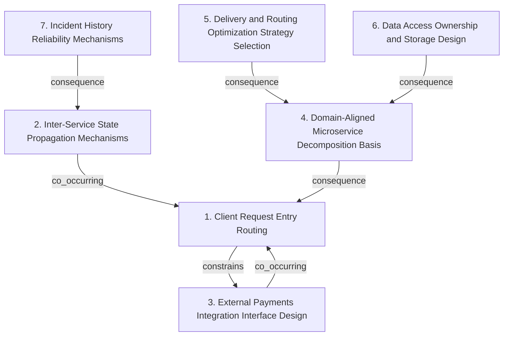

# Grounded Theory Report

## Narrative Summary

This taxonomy supports classifying architectural design decisions for a food delivery company migrating from a monolithic system to microservices. In the target system, PC and mobile clients access customer and order data via SQL databases, while the business modules include Customers (critical), Orders (non-critical, with retry limits), Delivery & Routing (critical, with optimization algorithms based on truck delay), Statistics (non-critical, order/truck status), Incidents (semi-critical, route manager alerts), and external Payments (critical, third-party gateway). An OrderManager mediates between customers, orders, delivery, and incidents.

Architectural decisions are organized along orthogonal dimensions that reflect fundamentally different concerns. First, “Client Request Entry Routing” captures how PC/mobile requests enter the microservice system and how routing boundaries map to domain areas, explicitly excluding choices related to the Payments facade. In parallel, “Inter-Service State Propagation Mechanisms” focuses on how domain state changes spread across services—whether updates are disseminated by push/event-style mechanisms or by pull/query-style access—separately from both client request entry routing and from how external Payments is exposed.

Because Payments is a special external dependency, the taxonomy separates “External Payments Integration Interface Design,” which covers how third-party Payments capabilities are exposed to internal modules (for example, via a facade/abstraction), and how the external routing to Payments is reached. This is treated as distinct from the general question of how clients enter the microservice system.

The taxonomy then addresses how the monolith is split into microservices through “Domain-Aligned Microservice Decomposition Basis,” using business-module boundaries as the organizing principle, including whether Statistics and Incidents remain separate services. Related but distinct from decomposition, “Data Access Ownership and Storage Design” characterizes who owns and persists data (service-owned versus shared/shared-access patterns), describing the data access pattern independent of routing, external integration, or algorithm choice.

Delivery logic involves both selection and execution concerns, so “Delivery and Routing Optimization Strategy Selection” isolates how delivery routing and truck-delay optimization algorithms are chosen and executed (for example, via strategy classes versus a plugin architecture). Finally, for semi-critical incident handling, “Incident History Reliability Mechanisms” captures how critical incident history is recorded and made reconstructable (such as event sourcing versus other persistence and recovery approaches), treated separately from general state propagation.

Across these dimensions, the classification provides a plain-language way to describe “what changed” in the architecture along distinct axes: where requests enter, how state changes propagate, how external payments are integrated, how services are carved along domain modules, how delivery algorithms are selected, how data ownership is managed, and how incident history is made reliable and reconstructable.

## Dimension Relationship Diagram

## Dimension Catalog

### 1. Client Request Entry Routing

How PC/mobile requests enter the microservice system (gateway vs direct) and how routing boundaries map to domain areas, excluding external Payments facade choices.

**Values:**

- **Central gateway for all PC/mobile HTTP routing** — Dedicated API Gateway fronts all PC/mobile HTTP/REST traffic and forwards to internal microservices and management endpoints.
- **Gateway routes Customers and Orders** — Gateway forwards client requests to Customers and Orders microservices with CRUD-oriented boundaries.
- **Gateway routes Statistics and Incidents** — Gateway forwards requests to Statistics and Incidents microservices (or their separately decomposed successors).
- **Gateway routes third-party Payments integration** — Gateway is the centralized routing path for external Payments integration request entry/forwarding.

**Outgoing relations:**

- **constrains** → External Payments Integration Interface Design (#3): When Payments is exposed via the external integration path, gateway routing typically governs how those requests enter the Payments subsystem.

### 2. Inter-Service State Propagation Mechanisms

How domain state changes disseminate across services (push/event vs pull/query), distinguishing propagation style from request entry routing and external integration.

**Values:**

- **Observer/event mechanism for Statistics updates** — Use internal observer/event patterns to push state changes into the Statistics microservice.

**Outgoing relations:**

- **co_occurring** → Client Request Entry Routing (#1): Event-driven propagation often complements gateway-centered request entry for non-critical modules like Statistics.

### 3. External Payments Integration Interface Design

How third-party Payments capabilities are exposed to internal modules (facade/abstraction) and how external routing is reached, separate from general client entry routing.

**Values:**

- **Facade wraps internal Payments behind simplified interface** — Expose Payments capabilities via a facade so OrderManager and other modules use a stable simplified contract.
- **Gateway routes payment requests** — API Gateway forwards payment-related requests to an external Payments service.

**Outgoing relations:**

- **co_occurring** → Client Request Entry Routing (#1): Payments integration commonly relies on gateway routing while internal callers remain protected behind a stable facade.

### 4. Domain-Aligned Microservice Decomposition Basis

How the monolith is decomposed into microservices via business-module boundaries, including whether Statistics and Incidents remain separate.

**Values:**

- **Decompose by business modules** — Split monolith into microservices aligned to business modules (Customers, Orders, Delivery & Routing, Payments), including separating Statistics from Incidents when needed for migration readiness.
- **Split Statistics and Incidents into separate microservices** — Keep Statistics and Incidents as distinct microservices rather than a combined module, improving encapsulation and responsibility isolation.

**Outgoing relations:**

- **consequence** → Client Request Entry Routing (#1): Domain-aligned services imply distinct microservice endpoints that the gateway routes to.

### 5. Delivery and Routing Optimization Strategy Selection

How delivery routing/truck-delay optimization algorithms are chosen and executed (strategy classes vs plugin architecture), distinct from routing entry and data persistence.

**Values:**

- **Strategy pattern for delivery delay optimization** — Delivery module selects among optimization strategy classes based on routing/truck-delay needs.
- **Microkernel plugins for delivery routing algorithms** — Use a microkernel architecture where delivery/routing optimization algorithms are implemented as plugins around a shared core.

**Outgoing relations:**

- **consequence** → Domain-Aligned Microservice Decomposition Basis (#4): A Delivery & Routing microservice decomposition enables internal strategy/plugin selection for routing decisions.

### 6. Data Access Ownership and Storage Design

How microservices own/persist data and access repositories (service-owned vs shared/shared-access layers), independent of routing, integration, or algorithm choice.

**Values:**

- **Per-service SQL repositories for data access** — Each microservice uses its own service-owned SQL repository for its domain data (e.g., Customers and Orders).

**Outgoing relations:**

- **consequence** → Domain-Aligned Microservice Decomposition Basis (#4): Service-owned data repositories typically follow domain-aligned decomposition into services with separate storage.

### 7. Incident History Reliability Mechanisms

How critical incident history is recorded and made reconstructable (e.g., event sourcing vs other persistence/recovery), separate from general state propagation.

**Values:**

- **Event sourcing for critical incident history** — Use event sourcing to preserve a reliable, replayable history of critical incidents for audit/resilience needs.

**Outgoing relations:**

- **consequence** → Inter-Service State Propagation Mechanisms (#2): Incident reliability requirements often motivate event-based representations that can also support downstream propagation.
