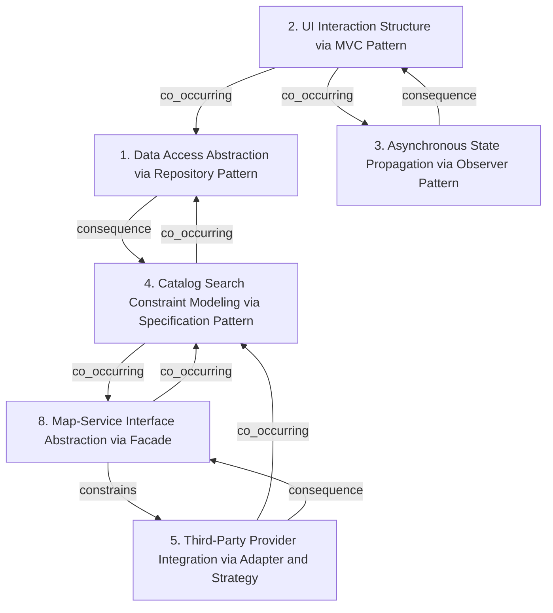

# Grounded Theory Report

## Narrative Summary

This taxonomy helps classify architectural design decisions for a tech-enabled healthy food startup running a “ghost kitchen” model—where users browse available items, purchase meals, and pick them up at any point of sale—while aiming to scale to multiple third-party vendors and to later support personalized meal recommendations.

Across the architecture, decisions are organized into orthogonal dimensions that capture different kinds of concerns. One dimension focuses on how persistence and querying are accessed through the Repository Pattern, varying by which domains—orders, profiles, meals, promotions, and subscriptions—are encapsulated behind repository interfaces. Another dimension looks at how the user interface is structured via the Model–View–Controller (MVC) pattern, varying by whether MVC governs core workflows such as browsing, profile updates, and order or subscription modifications.

Because the platform’s user experience can depend on changes that happen outside a single user action, another dimension captures Asynchronous State Propagation using the Observer pattern, specifically around how promotion or subscription updates reach the views. Search behavior is treated as a separate architectural concern: the Catalog Search Constraint Modeling dimension uses the Specification pattern to represent and compose meal search constraints, with availability and dietary filters modeled as composable specifications applied across vendors.

Integration with external parties is handled through a dedicated dimension that covers Third-Party Provider Integration using Adapter and Strategy. Variation here comes from whether heterogeneous external services are unified with an Adapter interface and whether provider selection or algorithms are swappable using Strategy. Finally, there is a dimension for Map-Service Interface Abstraction via a Facade, which decouples discovery flows from map-provider specifics behind a single interface.

## Dimension Relationship Diagram

## Dimension Catalog

### 1. Data Access Abstraction via Repository Pattern

Architectural decisions abstracting persistence/query using repositories, differing by which domains (orders, profiles, meals, promotions, subscriptions) are encapsulated behind interfaces.

**Values:**

- **Repository for orders, promotions, subscriptions** — Centralize ordering, promotion, and subscription persistence/query behind dedicated repository interfaces.
- **Repository for profiles, orders, meals** — Encapsulate profile, meal, and ordering reads/writes via repositories for consistent access boundaries.

**Outgoing relations:**

- **consequence** → Catalog Search Constraint Modeling via Specification Pattern (#4): Search/filters operate over domain data typically accessed through repository abstractions.

### 2. UI Interaction Structure via MVC Pattern

Architectural decisions structuring UI workflows with MVC, differing by whether MVC governs core flows like browsing, profile updates, and order/subscription modifications.

**Values:**

- **MVC for user interaction flows** — Adopt MVC to manage interaction areas such as promotions browsing, order history, and subscription management.
- **MVC for core browsing and modifications** — Use MVC separation for browsing meals and handling profile/order/meal modifications.

**Outgoing relations:**

- **co_occurring** → Asynchronous State Propagation via Observer Pattern (#3): Observer updates commonly keep MVC view state consistent as promotion/subscription data changes.
- **co_occurring** → Data Access Abstraction via Repository Pattern (#1): MVC controllers/views often delegate interaction-driven operations to repository-backed services.

### 3. Asynchronous State Propagation via Observer Pattern

Architectural decisions for asynchronously propagating state changes to UI via Observer, focusing on promotion/subscription updates reaching views.

**Values:**

- **Observer for promotion/subscription UI updates** — Push promotion/subscription state changes to UI views asynchronously using Observer.

**Outgoing relations:**

- **consequence** → UI Interaction Structure via MVC Pattern (#2): Observer-driven updates primarily serve view consistency within an MVC-style UI structure.

### 4. Catalog Search Constraint Modeling via Specification Pattern

Architectural decisions representing and composing meal search constraints, differing by how availability/dietary filters are modeled as composable specifications and applied across vendors.

**Values:**

- **Availability and dietary filters as specifications** — Implement meal search filtering as composable specification components for availability and dietary criteria.
- **Vendor-agnostic specifications for multi-vendor catalogs** — Ensure specification logic works across third-party vendor items in a shared ghost-kitchen catalog experience.

**Outgoing relations:**

- **co_occurring** → Data Access Abstraction via Repository Pattern (#1): Search specifications typically execute against domain data accessed through repositories.
- **co_occurring** → Map-Service Interface Abstraction via Facade (#8): Discovery/pickup and location mapping abstractions commonly integrate with catalog browsing and filtering.

### 5. Third-Party Provider Integration via Adapter and Strategy

Architectural decisions integrating heterogeneous external services and swapping providers/algorithms, differing by using Adapter for interface unification and Strategy for pluggable provider selection.

**Values:**

- **Adapter for multi-map-provider integration** — Translate each map provider’s interface into a shared common interface for the platform.
- **Strategy for swappable map providers and search algorithms** — Exchange map providers or search algorithms using interchangeable Strategy components.

**Outgoing relations:**

- **co_occurring** → Catalog Search Constraint Modeling via Specification Pattern (#4): Provider selection and search constraint modeling jointly produce filtered catalog results.
- **consequence** → Map-Service Interface Abstraction via Facade (#8): Facade-based map UI abstraction typically coordinates with lower-level provider integration patterns.

### 8. Map-Service Interface Abstraction via Facade

Architectural decisions decoupling map-provider details from discovery flows, differing by whether a Facade hides provider-specific integration details behind one interface.

**Values:**

- **Facade abstraction for map-provider integration** — Use a Facade to hide map-provider differences from the rest of the platform.

**Outgoing relations:**

- **constrains** → Third-Party Provider Integration via Adapter and Strategy (#5): Facade abstraction typically sits atop or coordinates with lower-level provider integration components.
- **co_occurring** → Catalog Search Constraint Modeling via Specification Pattern (#4): Pickup/item discovery experiences often combine mapping UI with catalog search and filtering.

## Discarded Dimensions

Dimensions considered during taxonomy generation but excluded from this view during dimension selection, judged not relevant to the stated use case:

- **6. Credential Security Controls for Authentication** — Authentication credential security and secret-handling controls are important generally, but the use case for this step is centered on architectural variation for ghost-kitchen catalog, multi-vendor ordering/discovery, and personalization data flows. None of the provided dimensions in scope explicitly link credential storage/access-control choices to the core architecture decisions being classified.
- **7. Account Verification Workflow Design** — User account verification workflow (signup validation/confirmation) is orthogonal to the main ghost-kitchen architectural variations in catalog search, provider/vendor integration, pickup mapping, data/persistence abstractions, and recommendation pipeline enablement. It does not meaningfully change the architectural intent described by the included dimensions for this use case.