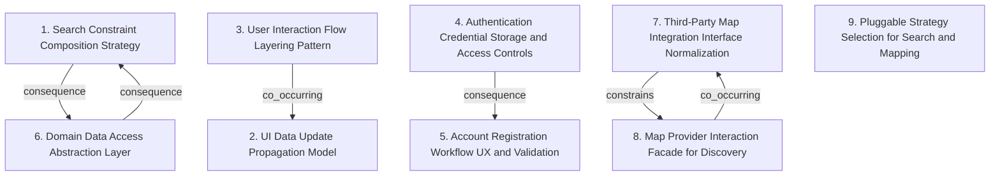

# Grounded Theory Report

## Narrative Summary

This taxonomy captures architecture design choices for a tech-enabled healthy food startup running a “ghost kitchen” model—where users can browse meals, purchase them, and pick them up at any point of sale—while also planning for multiple third-party vendors, and for using user data (health goals, purchase history, and item ratings) to power personalized recommendations.

Across the design space, the dimensions separate concerns that often get mixed together: how meal discovery rules are expressed versus how those results are surfaced; how identity and registration are handled versus how application flows are organized; and how external services are integrated versus how the core system reads and writes its own domain data.

Search behavior is differentiated by the **Search Constraint Composition Strategy**, which focuses on how dietary and availability constraints are modeled and combined (covering the logic semantics of search). Complementing that, **Pluggable Strategy Selection for Search and Mapping** supports runtime swapping of search behavior and map behavior through interchangeable algorithms/providers.

Discovery also depends on location and map capabilities, which are handled in two layers: **Third-Party Map Integration Interface Normalization** normalizes heterogeneous map providers behind an abstraction boundary, while **Map Provider Interaction Facade for Discovery** keeps user-facing discovery flows insulated from direct map-provider calls by providing a stable interface for discovery features like pickup locations.

On the user experience side, architectural decisions are split between **User Interaction Flow Layering Pattern** (how user-facing flows—such as browsing meals or purchasing—are structured) and **UI Data Update Propagation Model** (how promotion or subscription plan updates reach user interface views in near real time, focusing on event propagation and view consistency rather than storage or access).

The taxonomy also distinguishes security and onboarding: **Authentication Credential Storage and Access Controls** governs how credentials are secured at rest and protected by authorization boundaries, while **Account Registration Workflow UX and Validation** covers the step-by-step registration workflow, validation, and confirmation experience.

Finally, core persistence concerns are isolated in **Domain Data Access Abstraction Layer**, which defines where CRUD (create, read, update, delete) and retrieval logic for core domains lives, independent of UI and external integration boundaries.

## Dimension Relationship Diagram

## Dimension Catalog

### 1. Search Constraint Composition Strategy

How meal discovery constraints are modeled and composed, especially dietary requirements and availability. Governs search logic semantics, not UI, auth, or external integrations.

**Values:**

- **Specification-based dietary and availability filters** — Represent availability and dietary needs as specifications and compose them to drive meal search filtering.

**Outgoing relations:**

- **consequence** → Domain Data Access Abstraction Layer (#6): Search filtering and availability checks typically rely on consistent repository-provided access to meals and orders.

### 2. UI Data Update Propagation Model

How promotion/subscription plan updates reach user interface views in (near) real time. Concerns event propagation and view consistency, not persistence or auth.

**Values:**

- **Observer pattern for real-time promotion UI updates** — Use Observer to notify UI components/views when promotion/subscription plan data changes.

**Outgoing relations:**

_No outgoing relations._

### 3. User Interaction Flow Layering Pattern

How user-facing interaction flows are structured (e.g., browsing meals, managing subscriptions, ordering). Captures UX flow architecture decisions separate from update propagation.

**Values:**

- **MVC for core user interaction flows** — Adopt MVC to organize user interactions including browsing meals, order modifications, and subscription-related UX.

**Outgoing relations:**

- **co_occurring** → UI Data Update Propagation Model (#2): UI flows structured via MVC commonly benefit from Observer-driven updates for promotions/subscriptions, matching dynamic UX needs.

### 4. Authentication Credential Storage and Access Controls

How authentication credentials are secured at rest and protected by authorization boundaries. Governs identity-data security controls independent of other architecture layers.

**Values:**

- **Encrypted credential storage with strict access controls** — Encrypt stored authentication credentials and enforce strict access controls around credential data.
- **Standard credential verification authentication** — Verify user credentials against stored data using a standard authentication/verification mechanism.

**Outgoing relations:**

- **consequence** → Account Registration Workflow UX and Validation (#5): A validated registration workflow implies credential handling must comply with encryption and restricted access controls.

### 5. Account Registration Workflow UX and Validation

How new users are onboarded via registration steps, validation, and confirmation. Orthogonal to credential storage because it defines workflow and validation UX.

**Values:**

- **Validated registration with confirmation steps** — Provide user-facing account creation forms with validation and explicit confirmation steps.

**Outgoing relations:**

_No outgoing relations._

### 6. Domain Data Access Abstraction Layer

Where data CRUD/retrieval logic lives for core domains. Defines persistence-access boundaries independent of UI and integration. Repositories may cover specific domain aggregates.

**Values:**

- **Repository layer for profiles, meals, and orders** — Use a repository layer to manage data access operations for user profiles, meals, and meal orders.
- **Repositories for orders, promotions, and subscriptions** — Encapsulate data access behind repositories for orders plus marketing/promo and subscription-related domains.

**Outgoing relations:**

- **consequence** → Search Constraint Composition Strategy (#1): Search filtering and availability checks typically rely on consistent repository-provided access to meals and orders.

### 7. Third-Party Map Integration Interface Normalization

How external map providers are integrated through adapter/normalization to present a consistent interface. Handles provider heterogeneity handling behind abstraction boundaries.

**Values:**

- **Adapter for normalized multi-map-provider API** — Integrate multiple map providers via Adapter, normalizing disparate provider interfaces into a common API.

**Outgoing relations:**

- **constrains** → Map Provider Interaction Facade for Discovery (#8): If a facade abstracts map interactions for discovery, adapters typically sit behind it to normalize provider differences.

### 8. Map Provider Interaction Facade for Discovery

How the system hides direct map-provider calls from user-facing item discovery flows. Provides a stable interface for discovery features like pickup locations, independent of normalization.

**Values:**

- **Facade layer to abstract map-provider interactions** — Introduce a facade that hides direct external map provider interactions, supporting user-facing discovery such as pickup locations.

**Outgoing relations:**

- **co_occurring** → Third-Party Map Integration Interface Normalization (#7): A facade for discovery commonly coexists with adapter-based normalization behind the scenes to support multiple providers.

### 9. Pluggable Strategy Selection for Search and Mapping

How interchangeable algorithms/providers are selected at runtime for search behavior and map behavior. Captures modular swapping decisions beyond adapter normalization and facade abstraction.

**Values:**

- **Strategy pattern to swap map providers and search algorithms** — Use Strategy to allow interchangeable implementations for both map providers and search algorithms.

**Outgoing relations:**

_No outgoing relations._
