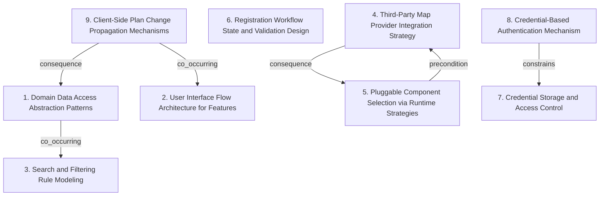

# Grounded Theory Report

## Narrative Summary

This taxonomy captures how different architectural design decisions were made while building a tech-enabled healthy food startup operating a “ghost kitchen” model. The platform lets users browse available items, purchase meals, and pick them up at any point of sale, with long-term goals that include supporting multiple third-party vendors through shared points of sale and harvesting user data (health goals, purchase history, item ratings) for personalized meal recommendations.

Across the catalog, the architectural variation is organized into orthogonal dimensions that reflect distinct concerns rather than small implementation differences. One set of decisions focuses on how the platform encapsulates reads and writes for core domain entities through abstraction layers (Domain Data Access Abstraction Patterns). Another set describes how feature behavior is structured across the user interface versus controllers/services (User Interface Flow Architecture for Features), shaping the flow for modules such as browsing and history.

The taxonomy also covers how meal discovery rules are represented (Search and Filtering Rule Modeling), and how that discovery is adapted to external services for location—either by isolating external map/location provider APIs behind a consistent interface (Third-Party Map Provider Integration Strategy) or by swapping implementations through runtime strategies (Pluggable Component Selection via Runtime Strategies). Complementing those “integration and discovery” choices are decisions around user onboarding, particularly the design of a multi-step registration workflow with explicit validation gates and confirmation (Registration Workflow State and Validation Design).

Finally, the taxonomy includes security and state-propagation concerns. It distinguishes how authentication credentials are stored and who can access them internally (Credential Storage and Access Control) from how those stored credentials are used during credential-based authentication (Credential-Based Authentication Mechanism). The remaining dimension addresses subscription or promotion plan updates: it captures how plan-change data is observed and then propagated to user interface views after plan data updates (Client-Side Plan Change Propagation Mechanisms). 

Together, these dimensions provide a plain-language way to orient collaborators to what each part of the system is optimizing for—domain data access, user flow structure, discovery rules, external integration, runtime extensibility, onboarding validation, authentication, and UI consistency after plan changes—before they dig into the per-dimension catalog and relationship diagram.

## Dimension Relationship Diagram

## Dimension Catalog

### 1. Domain Data Access Abstraction Patterns

Architectural decisions on how the platform encapsulates reads/writes for core domain entities using abstraction layers like repositories.

**Values:**

- **Repository pattern for key domain entities** — Use repositories to centralize querying/operations for entities such as user profiles, meal orders, and meals.
- **Repository pattern for orders, promotions, subscriptions** — Apply repositories to transactional and offer-related data to decouple data-access logic from business logic.

**Outgoing relations:**

- **co_occurring** → Search and Filtering Rule Modeling (#3): User-interaction flows (e.g., order history, subscriptions) typically rely on consistent domain data access abstractions.

### 2. User Interface Flow Architecture for Features

Decisions about structuring user interaction flows (UI vs controllers/services) for feature modules like browsing, history, and subscriptions.

**Values:**

- **Adopt MVC for browsing/history/subscription flows** — Use MVC architecture to manage separation of concerns for UI and interaction flows across those features.

**Outgoing relations:**

_No outgoing relations._

### 3. Search and Filtering Rule Modeling

How meal discovery/query constraints are represented—i.e., rule composition for availability and dietary criteria.

**Values:**

- **Specification objects for filtering criteria** — Model search filtering via specification objects that compose availability and dietary constraints.

**Outgoing relations:**

_No outgoing relations._

### 4. Third-Party Map Provider Integration Strategy

How external map/location services are integrated: providing consistent interfaces, isolating provider APIs, and supporting swaps.

**Values:**

- **Adapter pattern for multi-map provider integration** — Integrate multiple map providers behind common contracts using adapters.
- **Facade layer for external map abstraction** — Use a facade to isolate and standardize interactions with external map providers for discovery workflows.

**Outgoing relations:**

- **consequence** → Pluggable Component Selection via Runtime Strategies (#5): Interfaces/facades enable runtime strategy swapping of map/search components without exposing provider details.

### 5. Pluggable Component Selection via Runtime Strategies

How the system selects implementations at runtime (e.g., map provider or search algorithm), emphasizing configurability/extensibility.

**Values:**

- **Strategy pattern for runtime map/search swapping** — Use Strategy to dynamically swap map providers or search algorithms at runtime.

**Outgoing relations:**

- **precondition** → Third-Party Map Provider Integration Strategy (#4): Runtime swapping typically requires a stable abstraction layer (adapter/facade) to interchange implementations safely.

### 6. Registration Workflow State and Validation Design

How user sign-up is implemented as a multi-step process, including validation gates and explicit confirmation.

**Values:**

- **Multi-step registration with validation and confirmation** — Implement registration as multiple steps with form validation at steps and a final confirmation step.

**Outgoing relations:**

_No outgoing relations._

### 7. Credential Storage and Access Control

Decisions on how authentication credentials are stored securely and who is allowed to access them internally.

**Values:**

- **Encrypted credential storage with strict access controls** — Encrypt stored user passwords and enforce strict access controls over credential reading by components/services.

**Outgoing relations:**

_No outgoing relations._

### 8. Credential-Based Authentication Mechanism

Decisions on how users authenticate using stored credentials (e.g., standard credential verification flow).

**Values:**

- **Standard credential-based authentication** — Authenticate by verifying user credentials against stored credential data using a standard verification mechanism.

**Outgoing relations:**

- **constrains** → Credential Storage and Access Control (#7): Credential verification depends on secure, protected storage and controlled credential access.

### 9. Client-Side Plan Change Propagation Mechanisms

How subscription/promotion changes are observed and propagated to UI views after plan data updates.

**Values:**

- **Observer pattern for plan-change UI updates** — Use Observer so UI views are notified and updated when subscription/promotion plan data changes.

**Outgoing relations:**

- **co_occurring** → User Interface Flow Architecture for Features (#2): Observer-driven UI updates commonly co-occur with MVC-style UI layering for views/controllers.
- **consequence** → Domain Data Access Abstraction Patterns (#1): When plans/promotions change, the ability to propagate updates depends on consistent domain data access for those entities.
