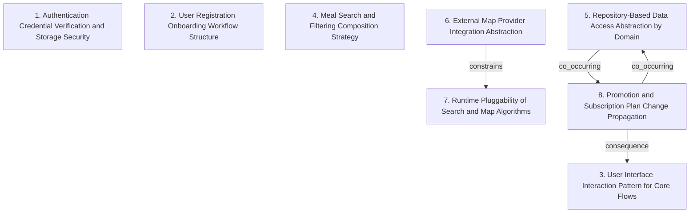

# Grounded Theory Report

## Narrative Summary

This taxonomy captures how a tech-enabled healthy food “ghost kitchen” startup designs software architecture for the platform experiences it will deliver—letting users browse available items, purchase meals, and pick them up at any point of sale—while supporting long-term expansion to multiple third-party vendors through shared points of sale and later personalization using user data (health goals, purchase history, and item ratings).

Across the architectural choices described here, the variations cluster into orthogonal dimensions that each reflect a different core concern. The first set of decisions focuses on how authentication is handled: how credentials are verified against persisted data, how they are secured (for example, encryption at rest), and how access control governs retrieval and use. A second set covers how users register and onboard, including how multi-step confirmation is structured and when and how input validation is enforced during the flow.

User experience is treated as its own architectural concern. The taxonomy distinguishes different user interface interaction patterns for core flows, such as how the system models profile updates, browsing, and order-related screens (including promotions and subscriptions). Meal discovery also varies in a fundamentally different way: it contrasts approaches to composing meal search and filtering constraints—specification-based filters that can be composed together versus simpler, non-composable approaches.

Data access and integration boundaries are separated into further dimensions. Persistence/querying is abstracted differently by domain via repository-based data access, which varies by which domains use repositories (orders, promotions, subscriptions, profile, meals) and whether there is standardized core access. For location features, the taxonomy distinguishes external map provider integration through abstraction (facades/adapters) to isolate the system from provider APIs and support provider interchangeability. In parallel, it captures whether search and map behavior is swappable at runtime through pluggable components (strategy-like components for selecting map providers and search algorithms dynamically).

Finally, the taxonomy includes how the platform reacts when promotion and subscription plans change. Choices in this dimension distinguish event-driven synchronization—an Observer-like approach that disseminates updates and supports frontend state updates—from other possible propagation styles.

Together, these dimensions provide a structured way to compare design decisions without collapsing them into one notion of “architecture”: they separate identity and onboarding, user experience, discovery logic, persistence abstractions, third-party integration and runtime swapping, and update propagation for promotions and subscriptions.

## Dimension Relationship Diagram

## Dimension Catalog

### 1. Authentication Credential Verification and Storage Security

Architectural choices for user authentication and credential storage, including verification against persisted data, encryption-at-rest, and strict retrieval/use access control.

**Values:**

- **Standard credential verification against persisted data** — Authenticate by comparing presented credentials with credentials stored in persistent data.
- **Encrypted credential storage with strict read access** — Encrypt credentials at rest and enforce strict access controls for credential retrieval/use by authorized components.

**Outgoing relations:**

_No outgoing relations._

### 2. User Registration Onboarding Workflow Structure

Design of onboarding/registration flows, varying by multi-step confirmation and by when/how input validation is enforced.

**Values:**

- **Multi-step registration with confirmation stage** — Use a staged registration process culminating in a confirmation step before account completion.
- **Registration input validation enforcement** — Validate form inputs during registration to ensure account data quality.

**Outgoing relations:**

_No outgoing relations._

### 3. User Interface Interaction Pattern for Core Flows

UI architectural pattern for core user interactions, covering how views/controllers model profile updates, browsing, and order/promotion/subscription screens.

**Values:**

- **MVC for ghost-kitchen user interaction flows** — Apply Model-View-Controller to manage key UI interactions including profile updates, meal browsing, order modifications, and related views.

**Outgoing relations:**

_No outgoing relations._

### 4. Meal Search and Filtering Composition Strategy

How meal discovery constraints are modeled and combined, distinguishing composable specification-based filters from simpler non-composable approaches.

**Values:**

- **Specification pattern for composable filter logic** — Implement meal search filtering using the specification pattern to compose availability and dietary criteria.

**Outgoing relations:**

_No outgoing relations._

### 5. Repository-Based Data Access Abstraction by Domain

How persistence/querying is abstracted from application logic, varying by which domains use repositories (orders, promotions, subscriptions, profile, meals) and whether repositories are standardized core access.

**Values:**

- **Repositories for orders, promotions, and subscriptions** — Use repository pattern to abstract data access for order data, promotion data, and subscription data.
- **Repositories for central user-profile data operations** — Use repositories to centralize operations and querying for user-profile data.
- **Repositories for central meal-order data operations** — Use repositories to centralize operations and querying for meal-order data.
- **Repositories for central meal-catalog data operations** — Use repositories to centralize operations and querying for meal (catalog) data.
- **Repository pattern as core domain data-access abstraction** — Standardize repository pattern as the abstraction layer for core domain data access (operations and querying).

**Outgoing relations:**

- **co_occurring** → Promotion and Subscription Plan Change Propagation (#8): Maintaining synchronized frontend state for plan changes commonly relies on repository reads of updated plan data.

### 6. External Map Provider Integration Abstraction

How third-party map/location services are integrated, distinguishing facade/adapters that isolate the system from provider APIs and enable provider interchangeability.

**Values:**

- **Facade abstraction over external maps providers** — Introduce a facade layer to abstract interactions with external maps providers, enabling provider interchangeability.
- **Adapter pattern for multi–map-provider integration** — Use an Adapter pattern so multiple map providers can be integrated behind a shared interface.

**Outgoing relations:**

- **constrains** → Runtime Pluggability of Search and Map Algorithms (#7): If map-provider integration is designed for interchangeability, search/navigation typically also becomes runtime-pluggable via strategy.

### 7. Runtime Pluggability of Search and Map Algorithms

How discovery/navigation behavior is swapped at runtime, distinguishing strategy-like pluggable components for selecting map providers and search algorithms dynamically.

**Values:**

- **Strategy pattern for runtime swapping of map providers and search algorithms** — Use Strategy pattern so both map providers and search algorithms can be changed at runtime.

**Outgoing relations:**

_No outgoing relations._

### 8. Promotion and Subscription Plan Change Propagation

How promotion/subscription plan updates disseminate to dependent components, distinguishing Observer-like event-driven synchronization (including frontend state updates).

**Values:**

- **Observer pattern for plan-change propagation** — Use Observer pattern to propagate changes in promotion/subscription plans and keep dependent components updated.
- **Frontend UI synchronized with plan-change events** — Ensure frontend UI views reflect promotion/subscription plan changes consistently when underlying data updates.

**Outgoing relations:**

- **consequence** → User Interface Interaction Pattern for Core Flows (#3): Event-driven plan-change propagation typically impacts how UI state/view updates are implemented for core flows.
- **co_occurring** → Repository-Based Data Access Abstraction by Domain (#5): Maintaining synchronized frontend state for plan changes commonly relies on repository reads of updated plan data.
