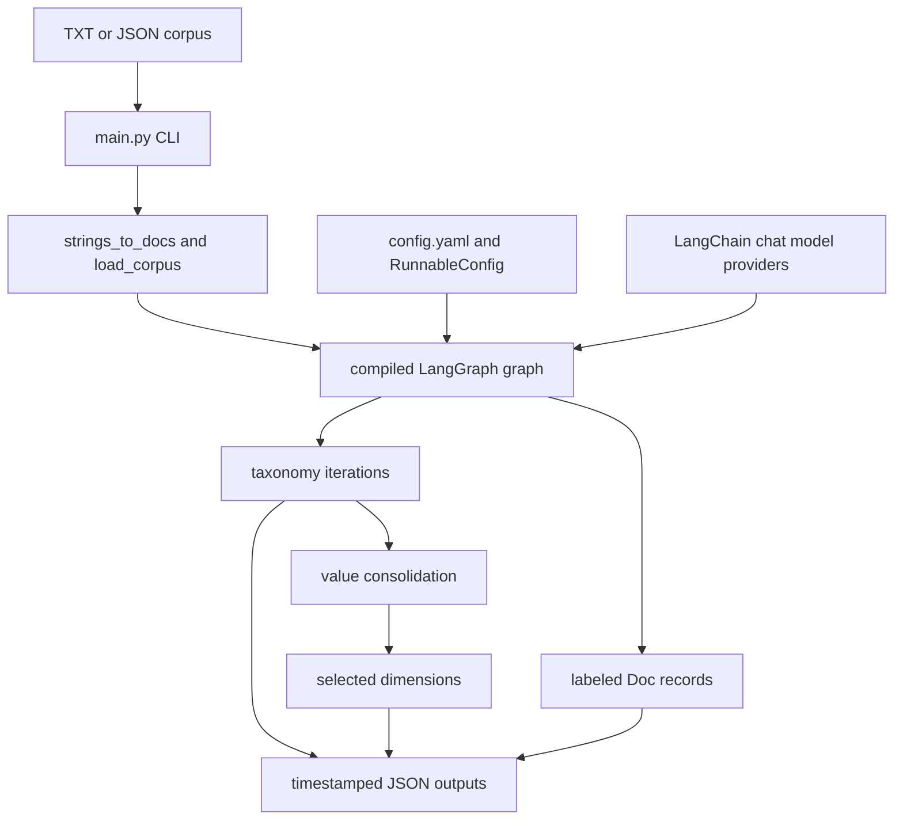

# Delve architecture overview

Delve is a Python 3.9+ package that turns an unstructured corpus into an iteratively refined taxonomy and LLM-labeled documents. The repository has one runtime application (`main.py`) and one installable package under `src/taxonomy_generator`; it is not a multi-service workspace. The research/design intent is TnT-LLM-style taxonomy generation and zero-shot labeling, with open coding, saturation checks, value consolidation, and use-case dimension selection; it does not train a lightweight classifier in this repository.

## Composition and entrypoints

- `pyproject.toml` declares the `delve = main:main` console script, `src` package discovery, LangChain/LangGraph/provider dependencies, and package data.
- `langgraph.json` exposes `src/taxonomy_generator/graph.py:graph` as the LangGraph deployment entrypoint and names `.env` as its environment file.
- `taxonomy_generator.__init__` exports `graph`, state classes, `Configuration`/`Settings`, settings initialization, and document converters. Nodes, schemas, routing functions, and prompt constants are internal import surfaces; see [Public Python API](../interfaces/public-api.md).
- `main.py` loads `.env`, parses a corpus path, initializes settings, streams `graph.astream`, renders Rich output, and optionally serializes JSON.

This diagram shows the inspected runtime boundary from file input and configuration through graph execution to returned and serialized results.

## Dependencies and ownership

`graph.py` owns orchestration; `nodes/` owns each pipeline operation; `routing/` owns branch decisions; `state.py` owns graph state; `schemas.py` owns LLM structured-output contracts; `utils.py` owns document/model/prompt data conversion; `prompts/` owns Markdown system prompts. `main.py` owns user-facing presentation and file serialization, so changing a node's state output can affect both graph consumers and CLI output.

The main dependency flow is: LangGraph invokes async nodes; nodes resolve `Configuration`, load a provider model with `init_chat_model`, bind a Pydantic schema using `with_structured_output`, and pass JSON-shaped prompt data. Provider API keys are operational prerequisites; no secrets are documented here. Configuration details live in [Configuration and settings](../configuration/settings.md).

## Boundaries and change routing

Use [Graph and orchestration](../pipeline/graph.md) for lifecycle or routing changes, [Ingestion and preprocessing](../pipeline/ingestion-and-preprocessing.md) for corpus/summary/batch behavior, [Taxonomy lifecycle](../pipeline/taxonomy.md) for generation prompts and refinement, and [Document classification](../pipeline/classification.md) for labels and scores. Schema changes must be coordinated with [State and schemas](../data-model/state-and-schemas.md), prompt templates with [Prompt system](../prompts/prompt-system.md), and output changes with [CLI and output contracts](../interfaces/cli-and-outputs.md).
