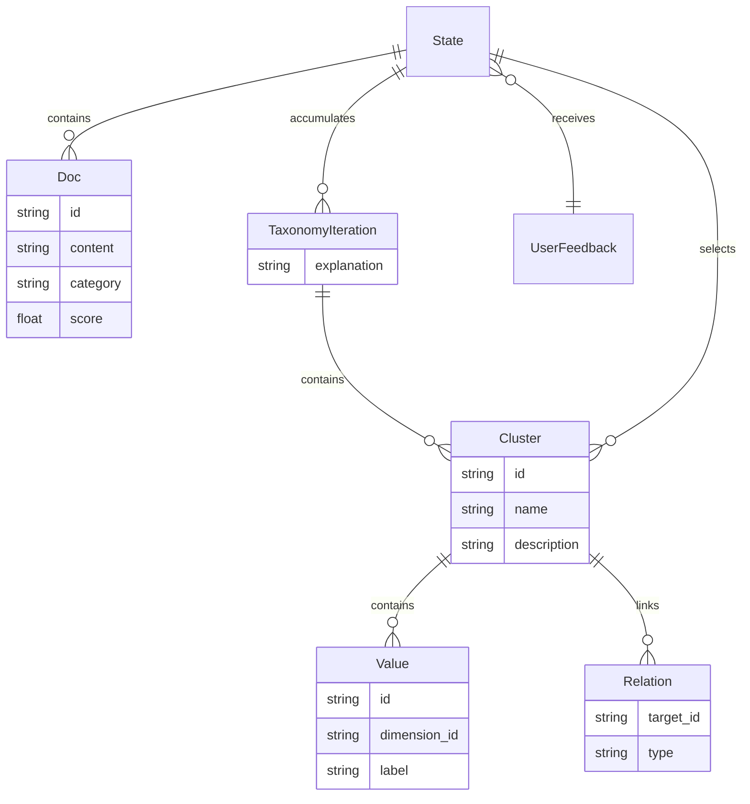

# Pipeline state and structured schemas

## Core records and state

`Doc` in `state.py` requires `id` and `content`; summary, explanation, category, value, and score are optional. `InputState` accepts documents, while `State` adds minibatch indices, accumulated open codes, saturation history/streak, `use_case`, `user_feedback`, and `selected_clusters`. `OutputState` exposes messages, taxonomy iterations, explanations, final documents, and selected clusters.

`clusters`, `explanations`, `status`, `open_codes`, and `saturation_history` use `operator.add`, so node results append. Documents, minibatches, `open_code_batch_index`, saturation streak, and selected clusters are replacement-style fields. `messages` uses LangGraph `add_messages`. `UserFeedback` restricts `decision` to `continue` or `modify`; `format_feedback` renders it for taxonomy prompts, but the standard CLI does not inject it.

`selected_clusters` is a filtered view, not a destructive replacement of the full taxonomy history. Classification currently reconstructs documents from the latest complete taxonomy iteration; CLI taxonomy output can preserve both views.

## Structured output contracts

- `SummaryOutput(summary, explanation)` enriches documents.
- `OpenCodesOutput(codes[])` contains `OpenCode(doc_id, label, rationale)` for one document.
- `TaxonomyOutput(clusters[], explanation)` contains `Cluster` dimensions with `Relation` links and `Value` decisions.
- `SaturationCheckOutput` records saturation, uncovered concepts, and rationale.
- `SelectionOutput(selected_ids[], dropped[], rationale)` filters dimensions while retaining drop reasons.
- `ValueMergeOutput(same_decision, rationale)` adjudicates borderline merges.
- `LabelOutput(reasoning, category, score, value_id?)` drives final labels; score is described as 0.0–1.0 but has no numeric range validator.

`format_docs`, `format_open_codes_for_docs`, and `format_taxonomy` are prompt-shape boundaries. The latter includes relations and values when present, so downstream update, selection, merge, and labeling behavior depends on preserving those fields deliberately.

## Change surface

A schema change requires coordinated edits to `schemas.py`, the corresponding prompt, node mapping, state fields when applicable, and `main.py` serialization. Public callers should also check [Public Python API](../interfaces/public-api.md). Narrow validation is import/graph compilation; external-model behavior requires a deliberate provider or embedding smoke run, because no automated test suite was found.