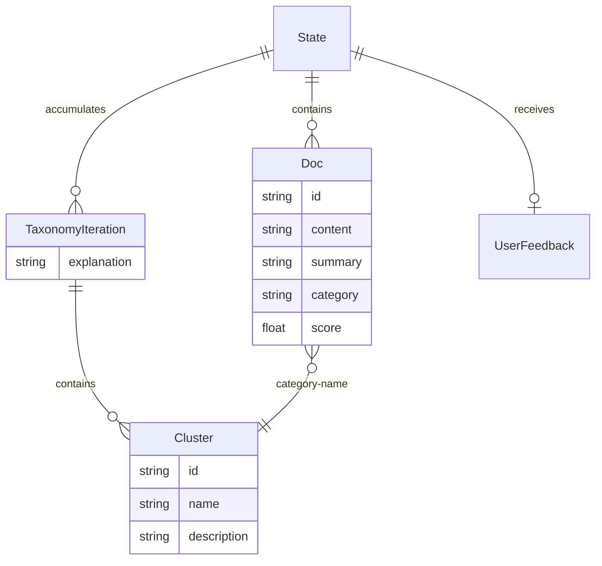

# Pipeline state and structured schemas

## Core records

`Doc` in `state.py` is the canonical document record: `id` and `content` are required; `summary`, `explanation`, `category`, and `score` are optional. `strings_to_docs` assigns UUIDs. `docs_from_dicts` preserves `Doc` instances, accepts dictionaries, and converts other values to string content. The labeler reconstructs `Doc` records so the final record contains summary, classification reasoning in `explanation`, category, and confidence score.

`UserFeedback` is a Pydantic model with `decision` restricted to `continue` or `modify`, required `explanation`, and optional `feedback`. `format_feedback` turns it into prompt text; the standard CLI does not inject feedback, but graph callers can pre-populate it.

## State layers and reducers

- `InputState.documents` is the caller-provided corpus.
- `State` adds working `documents`, `minibatches` (lists of document indices), `status`, `use_case`, `is_last_step`, and `user_feedback`.
- `OutputState` exposes `messages`, `clusters`, `explanations`, and final `documents`.
- `clusters`, `explanations`, `status` use `operator.add`, so node updates append; documents and minibatches replace. `messages` uses LangGraph `add_messages`.

This model shows the source-defined relationships; category assignment is a string match selected by the labeler rather than a persisted foreign-key object.

## LLM output contracts

`SummaryOutput(summary, explanation)` drives summary enrichment. `Cluster(id, name, description)` is nested in `TaxonomyOutput(clusters, explanation)`, used by generation, update, and review. `LabelOutput(reasoning, category, score)` drives final document reconstruction; the prompt describes `score` as 0.0–1.0 confidence, but Pydantic does not add a numeric range validator.

`utils.format_docs` intentionally sends only `id` and summary-or-content to taxonomy prompts. `format_taxonomy` sends only `id`, `name`, and `description`. This is a prompt privacy/shape invariant: adding fields changes model context and must be deliberate.

## Change surface

Schema changes require coordinated updates to `schemas.py`, the corresponding prompt Markdown, node mapping, state/output serialization in `main.py`, and this contract. The narrowest available validation is import/graph compilation plus mocked or provider-backed manual invocation; no automated tests were found.
