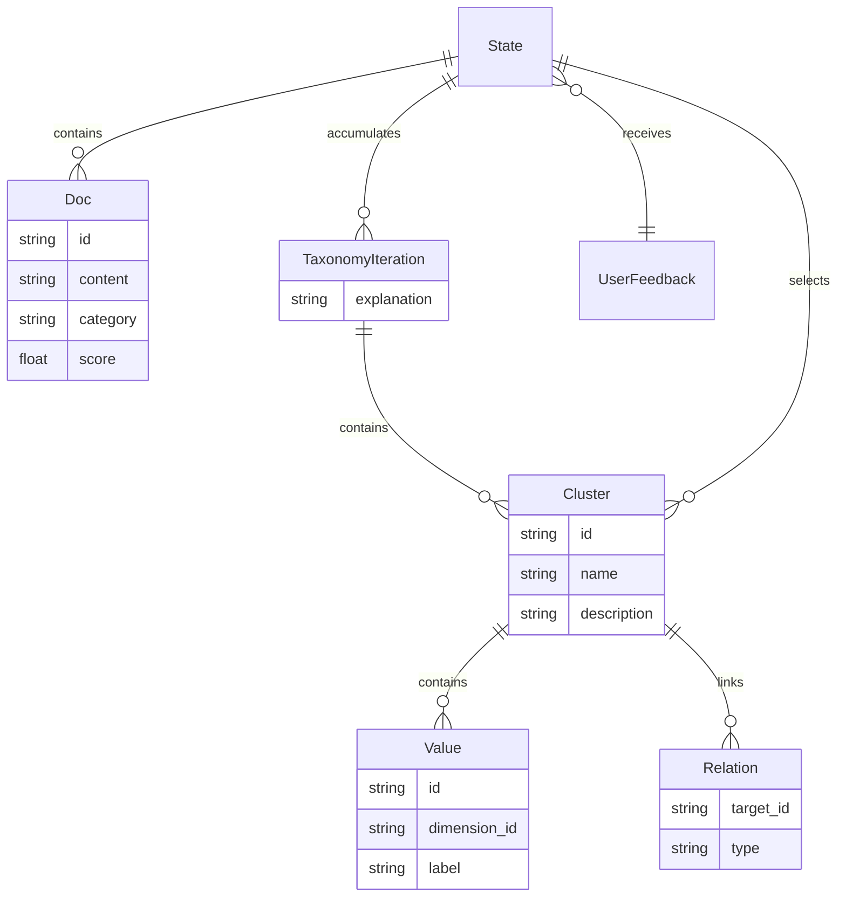

# Pipeline state and structured schemas

## Core records and state

`Doc` in `state.py` requires `id` and `content`; summary, explanation, category, value, and score are optional. `InputState` accepts documents and persistent `external_feedback`, while `State` adds minibatch indices, accumulated open codes, saturation history/streak, `use_case`, automated `user_feedback`, seed/test-mode fields, and `selected_clusters`. `OutputState` exposes messages, taxonomy iterations, explanations, final documents, selected clusters, dropped-dimension reasons, test-mode `delta_summary`, the final `evaluation` scoreboard, and append-only `evaluation_history`.

`clusters`, `explanations`, `status`, `open_codes`, `saturation_history`, and `evaluation_history` use `operator.add`, so node results append. Documents, minibatches, `open_code_batch_index`, saturation streak, selected clusters, dropped dimensions, `delta_summary`, and the current `evaluation` scoreboard are replacement-style fields. `messages` uses LangGraph `add_messages`. `UserFeedback` restricts `decision` to `continue` or `modify`; `format_feedback` merges persistent external feedback, the saturation critic, and evaluation reasons for taxonomy prompts.

```mermaid
erDiagram
    State ||--o{ Doc : contains
    State ||--o{ TaxonomyIteration : accumulates
    TaxonomyIteration ||--o{ Cluster : contains
    Cluster ||--o{ Value : contains
    Cluster ||--o{ Relation : links
    State ||--o{ Cluster : selects
    State }o--|| UserFeedback : receives
    TaxonomyIteration { string explanation }
    Cluster { string id string name string description }
    Value { string id string dimension_id string label }
    Relation { string target_id string type }
    Doc { string id string content string category float score }
```

`selected_clusters` is a filtered view, not a destructive replacement of the full taxonomy history. Classification currently reconstructs documents from the latest complete taxonomy iteration; CLI taxonomy output can preserve both views.

## Structured output contracts

- `SummaryOutput(summary, explanation)` enriches documents.
- `OpenCodesOutput(codes[])` contains `OpenCode(doc_id, label, rationale)` for one document.
- `TaxonomyOutput(clusters[], explanation)` contains `Cluster` dimensions with `Relation` links and `Value` decisions.
- `SaturationCheckOutput` records saturation, uncovered concepts, and rationale.
- `SelectionOutput(selected_ids[], dropped[], rationale)` filters dimensions while retaining drop reasons.
- `ValueMergeOutput(same_decision, rationale)` adjudicates borderline merges.
- `LabelOutput(reasoning, category, score, value_id?)` drives final labels; score is described as 0.0–1.0 but has no numeric range validator.
- Evaluation scoreboards are plain dictionaries with criteria rows, optional document-grounded rows, `overall`, model, unavailable/error status, and evaluator view metadata; they are stored in `evaluation` and `evaluation_history` rather than Pydantic schemas.

`format_docs`, `format_open_codes_for_docs`, and `format_taxonomy` are prompt-shape boundaries. The latter includes relations and values when present, so downstream update, selection, merge, and labeling behavior depends on preserving those fields deliberately.

## Change surface

A schema or state change requires coordinated edits to `schemas.py`, the corresponding prompt, node mapping, state fields when applicable, and `main.py` serialization. Public callers should also check [Public Python API](../interfaces/public-api.md). Focused tests live in `tests/unit_tests/test_schemas.py` and the affected node/routing suites; narrow validation is import/graph compilation, while external-model behavior requires a deliberate provider, judge, or embedding smoke run.