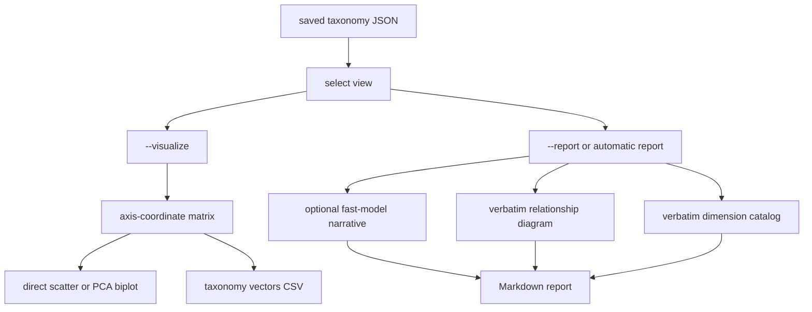

# Taxonomy visualization and grounded-theory reports

Consult this page when changing post-run artifacts, the `--visualize` or `--report` modes, taxonomy-view selection, or the optional visualization hooks in pipeline nodes. These features operate on saved taxonomy data and are separate from the core [LangGraph pipeline](../pipeline/graph.md).

## Two post-processing paths

This flow distinguishes model-assisted narrative prose from deterministic structural rendering.

## View selection and report semantics

`main._select_clusters_for_visualize` accepts the normal `iterations` wrapper or a bare cluster list. Selection precedence is explicit `--iteration N` (1-based), then `selected_clusters` when present, then the last iteration. An out-of-range iteration exits with a clear error. `_explanation_for_view` pairs an explicit iteration with its own explanation; the default selected/last view uses the latest explanation. Discarded-dimension rationales are shown only for the default selected view, and names are resolved from the full final cluster list by `_dropped_dimensions_for_view` so excluded dimensions remain inspectable without being added to the selected catalog.

`report_renderer.generate_and_write_report` composes four possible sections: narrative summary, relationship diagram, dimension catalog, and discarded dimensions. The narrative uses `fast_llm` and is grounded in the stored explanation plus in-scope dimension descriptions. If model access fails, the file is still written with an explicit unavailable note. `render_diagram` and `render_catalog` do not call an LLM: relations outside the rendered view are retained in the catalog but omitted from the diagram, and values with `merged_from` provenance are annotated.

## Visualization behavior

`visualization.render_taxonomy_biplot` is fail-soft and returns a path or `None`. It skips fewer than three values or a one-dimensional space. For exactly two or three dimensions it plots the axis-coordinate matrix directly, avoiding an unnecessary lossy projection. Larger taxonomies use `pca` and report captured variance; low captured variance is labeled as a weak proxy. `embeddings` axis positions use normalized embedding distances and one-dimensional MDS within each dimension. `uniform` positions put every value at `1.0` on its own axis; display-only jitter makes coincident points readable and is seeded by `random_seed`.

The exact matrix used for charting is exported as `taxonomy_vectors_<name>_<stage>_<iteration>.csv`; figures use `taxonomy_biplot_<name>_<stage>_<iteration>.png`. `resolve_output_dir` prioritizes `visualization_output_dir`, then `default_output_dir`, then `output`.

## CLI and automatic generation

- `python main.py --visualize FILE` renders a saved taxonomy without running the pipeline. `--axis-positions {auto,embeddings,uniform}` controls axis geometry; `auto` follows the saved `consolidated` flag and defaults to uniform for legacy files. `--output DIR` redirects chart artifacts.
- `python main.py --report FILE` renders a saved taxonomy without reading `--corpus`; it writes `<taxonomy>_report_<timestamp>.md`. It is mutually exclusive with `--visualize`. `--iteration` applies to both modes.
- A pipeline run with `--output DIR` automatically writes the report beside the JSON artifacts. `--no-auto-report` suppresses this additional report and its narrative model call. Report generation is best-effort after serialization: a narrative failure does not invalidate the pipeline result.

The normal pipeline calls visualization from generation, update, review, and consolidation only when `visualization.enabled` (and, unless `visualization.every_iteration` is true, only at final stages). These hooks are optional and must not change taxonomy state or merge decisions.

## Change surface and validation

| Change | Implementation surface | Focused validation |
|---|---|---|
| Add a report section or change view semantics | `main.py:_select_clusters_for_visualize`, `_explanation_for_view`, `_dropped_dimensions_for_view`; `report_renderer.py:assemble_report`, `generate_and_write_report` | Use a saved taxonomy JSON; test explicit and default iteration behavior and legacy missing keys |
| Change chart geometry or artifact naming | `visualization.py:build_axis_matrix`, `render_taxonomy_biplot`, `export_axis_matrix_csv`, `resolve_output_dir` | Use synthetic clusters with 1, 2, 3, and 4 dimensions; verify fail-soft behavior and PNG/CSV names |
| Change automatic report wiring | `main.py:run` output serialization block and `_run_report` | `python main.py --help`; provider-backed report only when intentionally testing narrative generation |

Internal renderer checks are not enough: verify the consumer-facing CLI path and the saved artifact. Expensive checks are conditional on model access, embedding credentials, optional `matplotlib`/`pca`/`pandas` dependencies, or a full provider-backed pipeline run. Do not hand-edit generated output as source truth.
