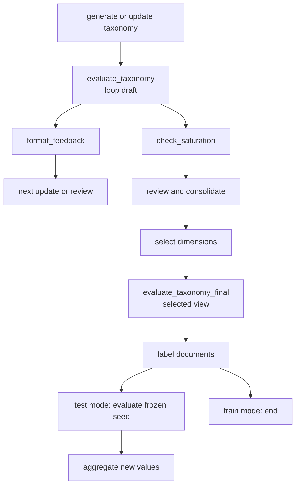

# Taxonomy evaluation and feedback loop

Consult this page when changing judge criteria, score persistence, feedback sent to taxonomy prompts, saved-taxonomy evaluation, or the evaluator's placement in the graph. Evaluation is an observe-only quality signal: it scores the current view, records reasons, and lets later refinement address actionable issues without changing taxonomy structure itself.

## Runtime placement

In train mode, generation and updates flow through a draft evaluation before saturation. Draft scoring can be skipped according to `evaluation.every_n_iterations`, but the last draft and final view are scored when evaluation is enabled. After selection, the final evaluator scores the selected view and runs before labeling. In test mode, the seeded taxonomy is evaluated after labeling as a drift signal before new-value aggregation. The evaluator never writes `clusters`, `selected_clusters`, or routing fields.

## Scoreboard contract

`evaluation.runner.run_scoreboard` serializes only taxonomy structure relevant to the criteria (dimension IDs/names/descriptions, relations, and value labels/descriptions/status). It samples documents with `sample_documents`: documents are grouped by source, shuffled with `pipeline.random_seed`, and selected round-robin so repeated iterations use the same source-stratified sample. Structural criteria use the configured use case; document-grounded coverage criteria use sampled passages. The returned dictionary contains criteria rows, `overall`, judge model, and `unavailable`; each evaluator call adds `view`, `iteration`, and `dimensions`.

`OutputState.evaluation` is replacement-style and ends with the chronologically last scoreboard. `evaluation_history` appends every scored draft and final call, allowing saved taxonomy JSON and reports to show progression. A judge/provider error is represented as an unavailable scoreboard and does not abort the pipeline. `evaluation.enabled: false` skips scoring and feedback.

`utils.format_feedback` combines persistent external feedback, the latest saturation critic feedback, and the latest evaluation feedback. `evaluation.feedback_exclude` removes named criteria from the prompt feedback while retaining them in the scoreboard; this defaults to excluding Completeness because it is judged from the use case without corpus evidence.

## Standalone evaluation

`main.py --evaluate TAXONOMY [TAXONOMY ...]` evaluates one saved taxonomy, optionally with `--corpus` for coverage, or compares two or more saved taxonomies for consistency. `--all-iterations` re-scores every saved iteration and the selected view. The command writes an `evaluation_*.json` artifact beside the first taxonomy or under `--output`. This is separate from the pipeline's persisted evaluation history and uses the current criteria/configuration. The resulting sidecar can be surfaced by [CLI and output contracts](../interfaces/cli-and-outputs.md) and composed into the offline [visualization and reporting](../interfaces/reporting-and-visualization.md) page.

## Change surface and focused checks

| Change | Implementation surface | Focused validation |
|---|---|---|
| Change criteria, thresholds, sampling, or judge resolution | `evaluation/metrics.py`, `evaluation/runner.py`, `evaluation/judge.py`, `settings.py` | `test_run_metrics.py`, `test_scoreboard_runner.py`, and deterministic `sample_documents` checks; provider calls are conditional |
| Change feedback composition | `utils.py:format_feedback`, `state.py:InputState`, `nodes/taxonomy_generator.py`, `nodes/taxonomy_updater.py`, `nodes/taxonomy_reviewer.py` | `test_format_feedback_evaluation.py` and prompt-content tests |
| Change evaluator placement or mode behavior | `graph.py`, `nodes/taxonomy_evaluator.py`, `routing/should_*` | `test_taxonomy_evaluator.py`, routing tests, then graph compilation |
| Change saved evaluation or CLI behavior | `main.py:_run_evaluate`, serializers, report renderer | CLI parser/help plus relevant unit tests; package/provider integration is conditional |

Internal scorer tests are not enough for a shipped change: when changing `--evaluate` or persisted output, also exercise the CLI path and inspect the generated JSON. Full judge runs require model credentials and network access; they are expensive conditional checks, not the default validation.
