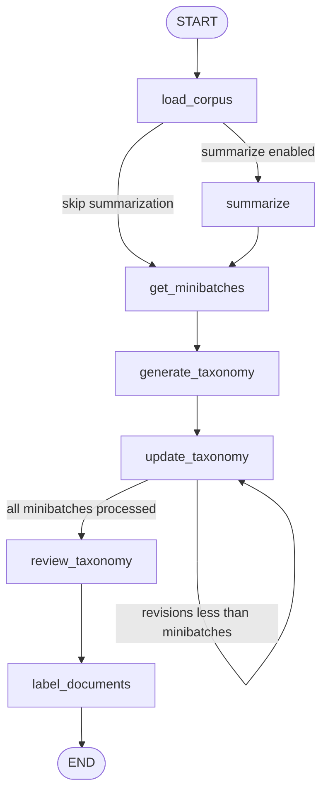

# LangGraph pipeline and routing

`src/taxonomy_generator/graph.py` constructs and compiles a `StateGraph(State, input_schema=InputState, output_schema=OutputState, context_schema=Configuration)`. The compiled object is exported as `graph` and named `Taxonomy Generation`.

## Lifecycle

The diagram reflects the explicit edges in `graph.py` and the decisions in `should_summarize` and `should_review`.

The fixed ordering is load, optional summarize, batch, initial generation, one or more update passes, final review, then labeling. `should_review` compares `len(state.clusters)` with `len(state.minibatches)`: the initial generation contributes the first taxonomy iteration, and updates continue until every minibatch has been incorporated. `should_summarize` resolves `skip_summarization` from runtime configuration and bypasses the LLM summary node when true.

## Node contracts

| Node | Owns | Main state effect |
|---|---|---|
| `load_corpus` | normalization and limits | replaces `documents`; appends status |
| `summarize` | fast-model summaries | replaces documents with summary/explanation fields |
| `get_minibatches` | shuffled index partitions | replaces `minibatches` |
| `generate_taxonomy` | first batch taxonomy | appends `clusters` and `explanations` |
| `update_taxonomy` | subsequent refinement | appends one iteration per routing pass |
| `review_taxonomy` | sampled final review | appends final reviewed iteration |
| `label_documents` | classification | replaces documents and appends an `AIMessage` |

Nodes return partial dictionaries; reducers in `State` append taxonomy/explanation/status collections while document and minibatch fields are replaced. A graph run requires non-empty documents and valid batches; empty input or invalid `batch_size` fails before meaningful LLM work.

## Extension and validation

To add a pipeline step, update node registration and edges in `graph.py`, define its state contract, and update CLI streaming labels in `main.py` if it should be visible. Routing changes must preserve the relationship between taxonomy iterations and minibatches. There is no repository test suite; narrow non-network checks are `python -c "from taxonomy_generator.graph import graph; print(graph)"` and `python main.py --help` after dependencies are installed. Behavioral invariants are implemented in `nodes/corpus_loader.py`, `nodes/minibatches_generator.py`, and `routing/should_review.py`.
