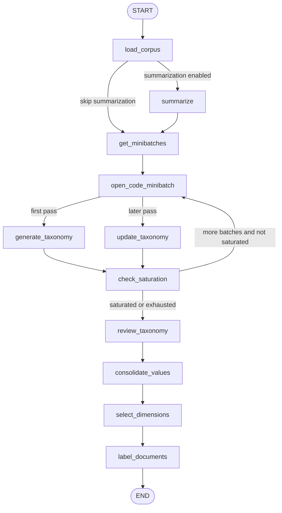

# LangGraph pipeline and routing

`src/taxonomy_generator/graph.py` constructs `StateGraph(State, input_schema=InputState, output_schema=OutputState, context_schema=Configuration)`. The compiled object is exported as `graph` and named `Taxonomy Generation`.

## Lifecycle

`load_corpus` optionally leads through summaries, then every minibatch is open-coded before axial generation or update. `should_generate_or_update` routes the first open-coded batch to generation and later batches to updates. `should_review` stops when the saturation streak reaches `saturation_streak_threshold` or minibatches are exhausted; unsaturated exhaustion still proceeds to review. Review is followed by value consolidation, use-case dimension selection, and labeling.

## Node contracts

| Node | Owns | Main state effect |
|---|---|---|
| `load_corpus` | normalization and limits | replaces `documents`; appends status |
| `summarize` | fast-model summaries | enriches documents with summary/explanation |
| `get_minibatches` | shuffled index partitions | replaces `minibatches` |
| `open_code_minibatch` | per-document concept extraction | appends `open_codes`; advances `open_code_batch_index` |
| `generate_taxonomy` | first-batch axial coding | appends `clusters` and `explanations` |
| `update_taxonomy` | subsequent refinement | appends a taxonomy iteration |
| `check_saturation` | theoretical-saturation verdict | appends history and updates streak |
| `review_taxonomy` | sampled final review | appends reviewed taxonomy iteration |
| `consolidate_values` | within-dimension value merging | appends a cleaned taxonomy iteration |
| `select_dimensions` | use-case relevance filter | replaces `selected_clusters` without deleting full taxonomy |
| `label_documents` | classification | labels documents and appends an `AIMessage` |

`clusters`, `explanations`, `status`, `open_codes`, and `saturation_history` append through reducers; document, minibatch, and selection fields are replaced. The graph requires valid non-empty corpus/batch input before meaningful model work. Configuration and node behavior are detailed in [Taxonomy generation and refinement](taxonomy.md) and [Pipeline state and structured schemas](../data-model/state-and-schemas.md).

## Extension and validation

To add a pipeline step, update node registration and edges in `graph.py`, define its state/schema contract, and update CLI streaming labels in `main.py` if it should be visible. Routing changes must preserve open-code index alignment, saturation termination, and post-review ordering. Narrow checks are `python -c "from taxonomy_generator.graph import graph; print(graph)"` and `python main.py --help`; provider-backed runs are conditional integration checks.