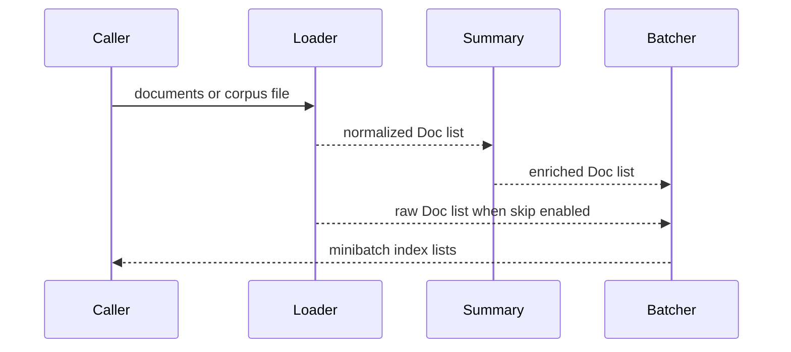

# Corpus ingestion and preprocessing

## File boundary and normalization

`main.run` first calls `init_settings`, then `main.load_corpus(args.corpus)`, then constructs `invoke_input = {"documents": strings_to_docs(texts)}` before streaming `graph.astream`; the file loader therefore discards JSON object IDs and metadata because it returns only content strings. `.txt` is one non-blank stripped document per line. `.json` must be an iterable array: strings become documents, dictionaries use `content`, and other values are stringified. Missing files raise `FileNotFoundError`; malformed JSON raises `JSONDecodeError`. `strings_to_docs` then assigns fresh UUID IDs. Programmatic callers can preserve dictionary `id`, `summary`, `explanation`, and `category` through `docs_from_dicts`, or pass `Doc` objects directly; missing dictionary content becomes `""` and missing IDs get a UUID.

`nodes.corpus_loader.load_corpus` rejects an empty input, normalizes through `docs_from_dicts`, optionally shuffles and caps with `max_runs`, then samples with `sample_size`. A configured seed is applied before each random operation. It returns the working `documents` and status.

## Summarization and batching

If `skip_summarization` is false, `generate_summaries` uses the fast model and `SUMMARY_GENERATION_PROMPT` with `SummaryOutput`. It maps each content through a chain, bounds async requests using `summary_max_concurrency`, and returns records containing original id/content plus summary/explanation. If skipped, raw content is later used by `format_docs`.

`generate_minibatches` shuffles document indices and partitions them with `_create_batches`; the final batch may be shorter. Non-positive batch size raises `ValueError`; no documents returns empty batches and status. Indices, not copied documents, are carried into taxonomy nodes, preserving a stable reference to the working list.

This sequence shows the source-defined preprocessing alternatives before taxonomy work.

## Change and validation surface

Corpus format changes belong in `main.load_corpus` and should preserve dict `content` handling. Summary output changes span `SummaryOutput`, `summary_generator.py`, and `Doc`. Batch changes must preserve positive-size validation and index coverage. No focused automated tests exist; use safe local checks for `load_corpus`, `strings_to_docs`, `_create_batches`, and routing with dependency installation, without invoking models.
