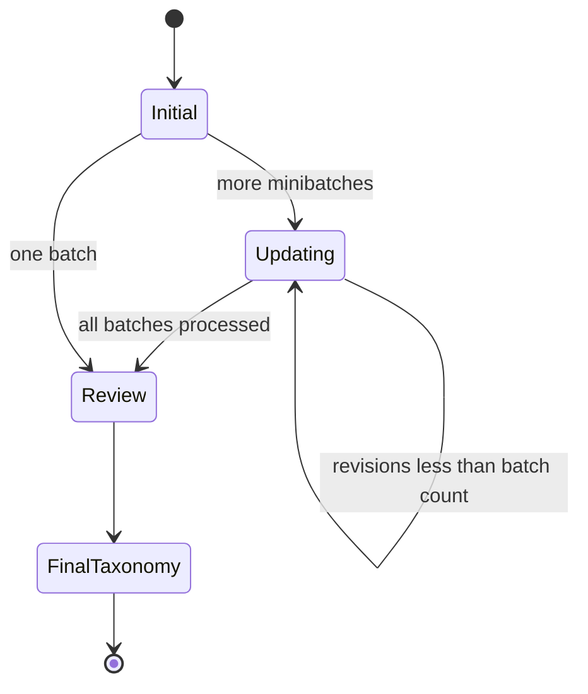

# Taxonomy generation and refinement

`generate_taxonomy`, `update_taxonomy`, and `review_taxonomy` all build a `TaxonomyOutput` structured chain with the reasoning model. Their prompt roles differ: generation creates dimensions from the first minibatch, update preserves or changes the accumulated taxonomy for the next minibatch, and review makes a minimal final quality pass over a random sample.

`utils.invoke_taxonomy_chain` selects the minibatch indices, formats only `id` plus summary/content, formats the latest taxonomy, resolves use case and length constraints, and appends a list of cluster dictionaries plus explanation. `max_num_clusters=None` is rendered as an instruction for the LLM to choose a small data-supported number; it is not a schema-level limit.

## Iteration invariant

The initial node always consumes `state.minibatches[0]`. Each update selects `len(state.clusters) % len(state.minibatches)`, so the first update consumes the second batch and routing stops when the number of accumulated iterations reaches the number of batches. Review samples up to `review_sample_size`, or `batch_size` when unset, then appends the reviewed result. `clusters[-1]` is the final taxonomy consumed by classification.

This lifecycle is grounded in `graph.py`, `should_review.py`, and the three taxonomy nodes.

## Prompt and model coupling

The reasoning model (`Configuration.model`) serves all three taxonomy stages. Generation/update/review bind feedback, use case, dimension limits, word limits, existing taxonomy JSON where applicable, and `TaxonomyOutput`. Prompt instructions require flat orthogonal, specific dimensions and explanations. `UserFeedback` is supported by state/helpers but is not populated by the standard CLI.

Changing taxonomy fields, iteration order, or prompt variables requires coordinated edits in `schemas.py`, `utils.py`, node setup functions, prompt files, and output serialization. With no automated tests, validate imports, graph compilation, deterministic helper behavior, and a provider-backed smoke run only when network/model credentials are intentionally available.
