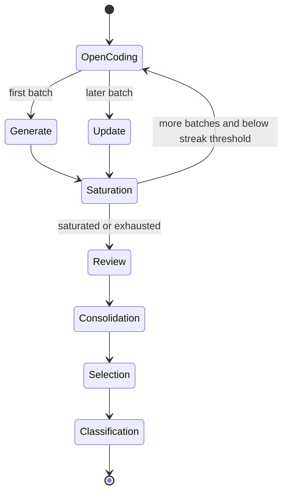

# Taxonomy generation, consolidation, and selection

The taxonomy lifecycle is a grounded, multi-stage flow. `open_code_minibatch` extracts document-level concepts with the fast model; `generate_taxonomy` and `update_taxonomy` use those codes for axial coding into dimensions, values, and typed relations; `review_taxonomy` performs a final sampled quality pass. All structured taxonomy stages return `TaxonomyOutput`.

## Iteration and saturation

The first open-coded minibatch is generated into the initial taxonomy. Each later open-coded batch is incorporated by an update. `check_saturation` records `is_saturated`, uncovered concepts, and rationale; `should_review` advances to the next open-coding pass until the configured streak threshold is reached or all minibatches are exhausted. Therefore `clusters` contains the full accumulated history, including the reviewed iteration and subsequent consolidation iteration; it is not simply one entry per batch.

```mermaid
stateDiagram-v2
    [*] --> OpenCoding
    OpenCoding --> Generate: first batch
    OpenCoding --> Update: later batch
    Generate --> Saturation
    Update --> Saturation
    Saturation --> OpenCoding: more batches and below streak threshold
    Saturation --> Review: saturated or exhausted
    Review --> Consolidation
    Consolidation --> Selection
    Selection --> Classification
    Classification --> [*]
```

## Value consolidation

`consolidate_values` operates on the reviewed taxonomy. It embeds each value's label and description, L2-normalizes vectors, computes distances only among values in the same dimension, and joins pairs at or below `value_merge_distance_threshold` using deterministic connected components. Pairs in the threshold-plus-`value_merge_borderline_band` are adjudicated by the reasoning model. Each merged value uses the nearest-to-centroid canonical label, unions supporting document IDs, records `merged_from` provenance, and renumbers values within the dimension. Failed adjudication keeps values separate. Setting `taxonomy.consolidate_values` false passes the reviewed taxonomy through unchanged and avoids embeddings/adjudication.

## Dimension selection and classification input

`select_dimensions` sends the consolidated taxonomy to a structured `SelectionOutput` chain. It preserves the model's selected ordering in `selected_clusters` and records dropped dimensions with rationales instead of silently deleting them from the full `clusters` history. The classifier consumes the latest complete taxonomy iteration, not `selected_clusters`; callers and CLI presentation can use `selected_clusters` as the use-case-filtered view. See [Document classification](classification.md) and [CLI and output contracts](../interfaces/cli-and-outputs.md).

## Reusing a saved taxonomy

`pipeline.mode: test` requires `pipeline.taxonomy_input` and uses the selected view by default (`taxonomy_input_view: auto` resolves to `selected` in test mode). The graph freezes those seed dimensions, labels the new corpus, then `aggregate_new_values` appends genuinely new value labels to matching dimensions and emits `delta_summary`; fallback documents remain listed rather than becoming taxonomy values. Exact labels are removed first, embedding deduplication is best effort, and an embedding failure falls back to exact-string deduplication. In train mode, a saved input seeds refinement and `auto` resolves to the final iteration instead.

The reusable-taxonomy path is distinct from ordinary consolidation: it does not regenerate dimensions in test mode. `load_seed_taxonomy` also removes relations pointing to dimensions omitted by the selected seed view. The frozen-view and mode-resolution contract is covered by `tests/unit_tests/test_seed_view.py`, while value growth and routing are covered by `test_value_aggregator.py` and `test_should_aggregate_values.py`.

## Evaluation relationship

When enabled, [taxonomy evaluation](evaluation.md) scores each selected or frozen view and formats actionable reasons for the next update/review; it observes state and does not decide merges. This means changes to taxonomy structure may require coordinated updates to the evaluator's serialization and criteria even when the evaluator itself is unchanged.

## Change surface and validation

Changes to taxonomy fields or prompt variables span `schemas.py`, the relevant node, `utils.py`, and Markdown prompts. Changes to merge behavior also affect `value_consolidator.py`, embedding configuration, provenance, and optional visualization. Changes to selection or reusable-taxonomy behavior affect `SelectionOutput`, `State.selected_clusters`, seed loading, aggregation, and CLI serialization. Focused checks include `python -m pytest tests/unit_tests/test_seed_view.py tests/unit_tests/test_value_aggregator.py tests/unit_tests/test_should_aggregate_values.py -q` plus graph compilation; use provider and embedding smoke runs only when intentionally testing external integrations.