# Delve code wiki quickstart

Delve is a Python package and CLI that accepts a text or JSON corpus, optionally summarizes it, builds an LLM-generated taxonomy through open coding, minibatch refinement, saturation review, value consolidation, and dimension selection, then labels every document. The compiled LangGraph is the runtime center; `main.py` is the human-facing CLI and serializer.

## Start here

- [Architecture overview](architecture/overview.md) — package boundaries, entrypoints, dependencies, and system flow.
- [Graph and orchestration](pipeline/graph.md) — node topology, conditional routing, reducers, and lifecycle invariants.
- [Ingestion and preprocessing](pipeline/ingestion-and-preprocessing.md) — file formats, normalization, sampling, summaries, and batches.
- [Taxonomy lifecycle](pipeline/taxonomy.md) — coding, generation, saturation, consolidation, selection, review, and iteration semantics.
- [Document classification](pipeline/classification.md) — final taxonomy use, concurrency, labels, scores, and fallback behavior.
- [State and schemas](data-model/state-and-schemas.md) — `Doc`, graph state, reducers, taxonomy values/relations, and Pydantic output contracts.
- [Configuration and settings](configuration/settings.md) — YAML, defaults, overrides, cache lifecycle, providers, consolidation, and visualization.
- [Public Python API](interfaces/public-api.md) — `taxonomy_generator` exports, `graph.ainvoke`, packaging, and extension boundaries.
- [CLI and output contracts](interfaces/cli-and-outputs.md) — flags, streaming behavior, graph export, selected views, and JSON files.
- [Prompt system](prompts/prompt-system.md) — Markdown-backed templates and their model/schema coupling.
- [Examples and validation](examples-and-validation.md) — existing repository validation guidance.

## Runtime map

```mermaid
flowchart LR
    Corpus["corpus file or documents"] --> Ingest["load and normalize"]
    Ingest --> Optional["summarize or skip"]
    Optional --> Batch["shuffle and batch indices"]
    Batch --> Open["open code"]
    Open --> Gen["generate or update taxonomy"]
    Gen --> Saturate["check saturation"]
    Saturate -->|continue| Open
    Saturate -->|stop| Review["review final sample"]
    Review --> Merge["consolidate values"]
    Merge --> Select["select dimensions"]
    Select --> Label["label documents"]
    Label --> Result["graph result and CLI JSON"]
```

Exact edges and reducers are in [Graph and orchestration](pipeline/graph.md).

## Task routing

| Change area or user intent | Relevant wiki page | Exact source entrypoints and symbols | Focused checks and minimal validation |
|---|---|---|---|
| Change graph ordering or routing | [Graph](pipeline/graph.md) | `graph.py:builder`, `graph`, `should_summarize`, `should_generate_or_update`, `should_review` | Import/compile graph; inspect empty-input, batch, and termination invariants |
| Change corpus files, sampling, summaries, or batches | [Ingestion](pipeline/ingestion-and-preprocessing.md) | `main.load_corpus`, `strings_to_docs`, `docs_from_dicts`, `load_corpus`, `generate_summaries`, `_create_batches` | Safe TXT/JSON conversion and no-network imports |
| Change open coding, taxonomy semantics, saturation, consolidation, or selection | [Taxonomy](pipeline/taxonomy.md) and [Prompts](prompts/prompt-system.md) | `open_code_minibatch`, `generate_taxonomy`, `update_taxonomy`, `check_saturation`, `review_taxonomy`, `consolidate_values`, `select_dimensions` | Prompt import and graph compile; provider/embedding smoke only when intentional |
| Change labels, scores, fallback, or classification concurrency | [Classification](pipeline/classification.md) and [CLI/output](interfaces/cli-and-outputs.md) | `label_documents`, `_label_single_doc`, `LabelOutput`, `selected_clusters`, `resolve_taxonomy_data` | Schema/helper imports and missing-cluster failure; provider smoke conditional |
| Change a record, reducer, or LLM response field | [State and schemas](data-model/state-and-schemas.md) | `Doc`, `State`, `UserFeedback`, `OpenCodesOutput`, `TaxonomyOutput`, `SelectionOutput`, `LabelOutput` | Import schemas; update prompt/node/serializer together |
| Add or change a setting | [Configuration](configuration/settings.md) | `Settings`, `_build_*`, `Configuration`, `_defaults_from_settings`, `init_settings` | Load checked-in and temporary YAML; verify override mapping |
| Change imports or installation behavior | [Public API](interfaces/public-api.md) | `__all__`, `pyproject.toml`, `langgraph.json`, `main:main` | Import/export list and graph import; package build conditional |
| Change CLI flags, Rich display, graph PNG, or JSON files | [CLI/output](interfaces/cli-and-outputs.md) | `parse_args`, `run`, `TokenTracker`, display/serialization helpers | `python main.py --help`; local serializer/parser checks |
| Investigate tests, lint, or documentation automation | [Examples/validation](examples-and-validation.md) | `Makefile`, `.github/workflows/openwiki-update.yml` | Check advertised targets and workflow separately |

## Operational notes

A real pipeline run requires configured LangChain chat/embedding providers and network/API access unless using local providers. The current YAML is `config.yaml`; CLI and `RunnableConfig.configurable` values override it. `settings.py` does not implement the README's claims that `LLM_MODEL` and `LLM_FAST_MODEL` override YAML. Do not treat ignored `output/` or `examples/` artifacts as tests or source truth.

No automated test files were found. Start with imports, graph compilation, settings loading, parser/help, and local serialization; use provider-backed generation, embedding, selection, or labeling only as conditional integration validation.
